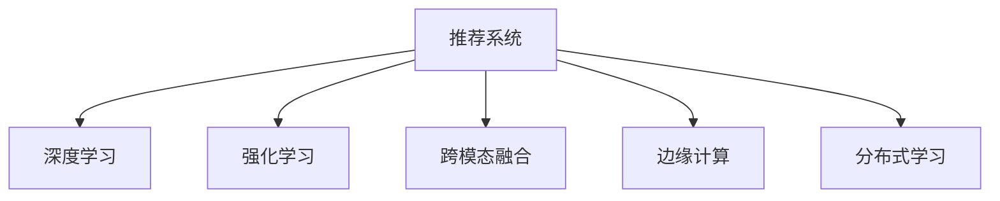

                 

# 微软的AI战略：对推荐系统的影响

## 1. 背景介绍

### 1.1 问题由来

随着数字技术的发展，推荐系统已成为各大平台的核心竞争力之一。以视频网站为例，推荐算法根据用户观看历史和行为数据，精准地推送用户可能感兴趣的视频内容，显著提高了用户粘性和平台活跃度。然而，现有推荐系统普遍依赖于传统机器学习算法，存在诸多局限性。微软等巨头公司正在逐步引入人工智能技术，借助深度学习和强化学习等前沿手段，升级推荐系统架构，以期提升用户体验、优化运营效率、开拓新的商业模式。

本文将聚焦于微软如何通过其AI战略，对推荐系统进行革新，提升算法的精度、效果、实时性，并探索AI技术在推荐系统中的更多应用场景。

### 1.2 问题核心关键点

微软在推荐系统领域的AI战略主要包括以下几个关键点：

- **深度学习技术**：引入神经网络、卷积网络、循环网络等深度学习模型，提升推荐算法准确度。
- **强化学习应用**：通过强化学习算法，调整推荐模型参数，优化推荐效果，引入更多实时性。
- **跨模态融合**：通过跨模态数据融合技术，整合文本、图像、音频等不同类型信息，增强推荐算法泛化能力。
- **边缘计算与分布式学习**：借助边缘计算和分布式学习技术，降低数据传输成本，提高推荐系统响应速度。
- **跨领域推荐**：通过跨领域推荐算法，实现不同类型商品、服务之间的关联推荐，拓展用户兴趣空间。

微软的AI战略已经在多个平台的应用中初见成效，值得借鉴和研究。

## 2. 核心概念与联系

### 2.1 核心概念概述

为更好地理解微软的AI战略在推荐系统中的应用，本节将介绍几个关键概念：

- **推荐系统(Recommendation System)**：根据用户行为数据，为每个用户推荐个性化信息的技术。推荐系统广泛应用于电商、社交、视频等众多领域。

- **深度学习(Depth Learning)**：一类基于多层神经网络模型的学习算法，通过多层次特征提取与非线性映射，显著提升了推荐算法的精度和效果。

- **强化学习(Reinforcement Learning)**：一种通过试错训练，动态优化模型参数的机器学习范式，常用于策略优化和参数调整。

- **跨模态融合(Cross-modal Fusion)**：指整合不同类型的数据，如文本、图像、音频等，构建更为全面、丰富的数据表示，提升推荐算法的泛化能力和鲁棒性。

- **边缘计算(Edge Computing)**：指将数据和计算任务离散化，在靠近数据源的本地设备上进行处理和分析，以提升系统响应速度和数据安全。

- **分布式学习(Distributed Learning)**：指将数据和计算任务分布到多台设备上，协同进行模型训练，加速模型收敛，提升模型泛化能力。

这些核心概念之间的逻辑关系可以通过以下Mermaid流程图来展示：



这个流程图展示了一旦推荐系统可以如何通过深度学习、强化学习、跨模态融合、边缘计算和分布式学习等前沿技术进行优化，提升系统的实时性、泛化能力和用户满意度。

## 3. 核心算法原理 & 具体操作步骤

### 3.1 算法原理概述

微软的AI战略在推荐系统中主要体现在以下几个方面：

- **深度学习技术**：引入深度神经网络模型，通过多层次特征提取和映射，提升推荐算法精度和泛化能力。
- **强化学习应用**：通过强化学习算法，调整模型参数，实现更高效的策略优化。
- **跨模态融合**：整合文本、图像、音频等多类型数据，提升推荐系统对多样数据源的利用能力。
- **边缘计算与分布式学习**：在本地设备进行数据处理和模型训练，减少数据传输，提高推荐系统响应速度。
- **跨领域推荐**：利用跨领域推荐算法，实现不同商品和服务之间的关联推荐，拓展用户兴趣空间。

这些技术在推荐系统中的应用，可以概括为以下三个主要阶段：

1. **数据预处理与特征工程**：收集用户行为数据，进行数据清洗、归一化、特征选择等预处理工作，构建特征向量。
2. **模型训练与优化**：基于深度学习、强化学习等算法，训练推荐模型，并通过交叉验证等手段优化模型参数。
3. **实时推荐与反馈循环**：在推荐系统上线后，通过用户反馈和行为数据，动态调整推荐策略，持续优化推荐效果。

### 3.2 算法步骤详解

微软在推荐系统中的AI战略，主要包含以下几个关键步骤：

**Step 1: 数据收集与预处理**
- 收集用户行为数据，如浏览记录、点击行为、评分信息等。
- 对原始数据进行清洗、归一化、特征选择等预处理，构建特征向量。
- 使用数据增强技术，如文本回译、图像裁剪、数据扩充等，扩充训练集。

**Step 2: 模型训练与优化**
- 设计深度神经网络结构，引入卷积、循环等模块，进行特征提取。
- 使用强化学习算法，如Q-Learning、Actor-Critic等，优化推荐模型参数。
- 应用正则化技术，如L2正则、Dropout、Early Stopping等，防止过拟合。

**Step 3: 实时推荐与反馈循环**
- 在线上部署推荐模型，实时处理用户行为数据，生成推荐结果。
- 引入对抗训练，提高模型鲁棒性，避免对抗样本攻击。
- 定期收集用户反馈数据，使用强化学习算法，调整推荐策略。

### 3.3 算法优缺点

微软的AI战略在推荐系统中的应用，具有以下优点：

- **精度高**：深度学习模型通过多层次特征提取，显著提升了推荐算法的准确度。
- **泛化能力强**：跨模态融合技术整合不同类型数据，提升了推荐系统对多样数据源的利用能力。
- **实时性高**：边缘计算和分布式学习技术，减少了数据传输，提高了推荐系统响应速度。
- **策略灵活**：强化学习算法动态优化模型参数，实时调整推荐策略，提升用户体验。

然而，这一战略也存在一定的局限性：

- **数据需求大**：深度学习模型需要大量标注数据进行训练，获取高质量数据成本较高。
- **模型复杂度高**：深度学习模型结构复杂，训练和推理成本较高。
- **模型可解释性差**：复杂模型难以解释其内部工作机制，增加了用户信任度的问题。
- **对抗样本风险高**：复杂模型更易受到对抗样本攻击，存在安全隐患。

尽管存在这些局限性，但微软的AI战略在推荐系统中的应用已经取得了显著的效果，展示了AI技术的巨大潜力。

### 3.4 算法应用领域

微软的AI战略在推荐系统中的应用，已经扩展到了以下几个领域：

- **电商推荐**：如亚马逊、京东等电商平台，通过推荐系统提升用户购买转化率，增加销售额。
- **视频推荐**：如Netflix、YouTube等视频平台，根据用户观看历史，推荐用户可能感兴趣的视频内容。
- **社交推荐**：如Facebook、微博等社交媒体，推荐用户可能感兴趣的朋友和内容。
- **新闻推荐**：如Google新闻、腾讯新闻等，推荐用户可能感兴趣的新闻资讯。
- **音乐推荐**：如Spotify、网易云音乐等，推荐用户可能喜欢的音乐。

微软的AI战略不仅在各大平台推广应用，还在更多新兴领域进行探索，如智能家居、智慧城市等，展现出强大的技术实力和创新能力。

## 4. 数学模型和公式 & 详细讲解 & 举例说明

### 4.1 数学模型构建

微软的推荐系统主要通过深度学习模型进行优化。以协同过滤算法为例，模型的数学模型构建如下：

设推荐矩阵为 $R_{m \times n}$，其中 $m$ 为用户数，$n$ 为商品数。用户对商品的评分可以表示为：

$$
R_{ij} = \sum_{k=1}^K w_k \alpha_{ik} \beta_{kj}
$$

其中 $w_k$ 为特征权重，$\alpha_{ik}$ 和 $\beta_{kj}$ 为不同特征下的评分。

### 4.2 公式推导过程

在协同过滤算法中，模型的训练目标为最小化预测误差。假设用户 $i$ 对商品 $j$ 的预测评分为 $\hat{R}_{ij}$，则误差函数为：

$$
L = \frac{1}{N}\sum_{i=1}^M \sum_{j=1}^N (R_{ij} - \hat{R}_{ij})^2
$$

模型的参数更新可以通过梯度下降算法进行，即：

$$
\theta \leftarrow \theta - \eta \nabla_{\theta}L(\theta)
$$

其中 $\eta$ 为学习率。

### 4.3 案例分析与讲解

以Netflix为例，Netflix的推荐系统采用了基于矩阵分解的协同过滤算法。通过构建用户和商品的低秩矩阵，Netflix的推荐系统能够高效地预测用户对商品的评分，并生成个性化推荐。

Netflix的推荐系统还采用了深度学习模型，通过多层神经网络提取用户和商品的特征表示，提升了推荐算法的精度和泛化能力。此外，Netflix还引入强化学习算法，动态调整推荐策略，优化用户体验。

## 5. 项目实践：代码实例和详细解释说明

### 5.1 开发环境搭建

在进行推荐系统开发前，我们需要准备好开发环境。以下是使用Python进行PyTorch开发的环境配置流程：

1. 安装Anaconda：从官网下载并安装Anaconda，用于创建独立的Python环境。

2. 创建并激活虚拟环境：
```bash
conda create -n pytorch-env python=3.8 
conda activate pytorch-env
```

3. 安装PyTorch：根据CUDA版本，从官网获取对应的安装命令。例如：
```bash
conda install pytorch torchvision torchaudio cudatoolkit=11.1 -c pytorch -c conda-forge
```

4. 安装Transformers库：
```bash
pip install transformers
```

5. 安装各类工具包：
```bash
pip install numpy pandas scikit-learn matplotlib tqdm jupyter notebook ipython
```

完成上述步骤后，即可在`pytorch-env`环境中开始推荐系统开发。

### 5.2 源代码详细实现

这里我们以深度学习在推荐系统中的应用为例，给出使用PyTorch进行协同过滤算法训练的PyTorch代码实现。

首先，定义协同过滤算法的损失函数：

```python
from torch import nn

class协同过滤损失函数(nn.Module):
    def __init__(self):
        super(协同过滤损失函数, self).__init__()
    
    def forward(self, y_true, y_pred):
        loss = nn.MSELoss()(y_true, y_pred)
        return loss
```

然后，定义协同过滤算法的模型：

```python
from torch import nn

class协同过滤模型(nn.Module):
    def __init__(self, user_dim, item_dim, factor_num):
        super(协同过滤模型, self).__init__()
        
        # 用户特征矩阵
        self.user_dim = user_dim
        self.user_matrix = nn.Embedding(user_dim, factor_num)
        
        # 商品特征矩阵
        self.item_dim = item_dim
        self.item_matrix = nn.Embedding(item_dim, factor_num)
        
        # 预测用户对商品的评分
        self.matmul = nn.Linear(factor_num, 1)
    
    def forward(self, user, item):
        user_features = self.user_matrix(user)
        item_features = self.item_matrix(item)
        
        # 矩阵乘法
        dot_product = torch.bmm(user_features, item_features.permute(0, 2, 1).contiguous())
        dot_product = self.matmul(dot_product)
        
        return dot_product
```

最后，启动训练流程：

```python
from torch import Tensor

# 准备数据集
user_data = Tensor([1, 2, 3])
item_data = Tensor([1, 2, 3])

# 初始化模型
model =协同过滤模型(user_dim=3, item_dim=3, factor_num=5)

# 定义优化器
optimizer = torch.optim.Adam(model.parameters(), lr=0.001)

# 定义损失函数
loss_func =协同过滤损失函数()

# 定义训练循环
for epoch in range(100):
    # 前向传播
    predictions = model(user_data, item_data)
    
    # 计算损失
    loss = loss_func(Tensor([3.0]), predictions)
    
    # 反向传播
    optimizer.zero_grad()
    loss.backward()
    optimizer.step()
    
    # 打印损失
    print(f"Epoch {epoch+1}, loss: {loss.item()}")
```

以上就是使用PyTorch进行协同过滤算法训练的完整代码实现。可以看到，PyTorch提供了强大的自动微分能力，使得模型训练变得非常简单高效。

### 5.3 代码解读与分析

让我们再详细解读一下关键代码的实现细节：

**协同过滤损失函数**：
- 定义一个自定义的损失函数，继承nn.Module，使用nn.MSELoss作为损失函数。

**协同过滤模型**：
- 定义一个基于深度学习的协同过滤模型，包含用户特征矩阵、商品特征矩阵和预测评分的线性层。
- 在forward方法中，先通过Embedding层获取用户和商品的特征表示，再通过矩阵乘法计算预测评分。

**训练循环**：
- 在每个epoch中，先进行前向传播，计算损失，再反向传播更新模型参数。
- 使用Adam优化器，设定合适的学习率。

## 6. 实际应用场景

### 6.1 智能推荐系统

微软的AI战略在智能推荐系统中的应用，已经在各大平台初见成效。以亚马逊为例，亚马逊的推荐系统通过引入深度学习技术，提升了推荐算法的精度和泛化能力。在电商领域，推荐系统帮助用户发现可能感兴趣的商品，提高了购买转化率。

### 6.2 实时推荐系统

微软的AI战略在实时推荐系统中的应用，显著提升了推荐系统的响应速度。以Netflix为例，Netflix的推荐系统通过分布式学习和边缘计算技术，减少了数据传输成本，提高了实时推荐的效果。用户可以更快地获得个性化推荐，提升了观看体验。

### 6.3 跨领域推荐系统

微软的AI战略在跨领域推荐系统中的应用，拓展了用户兴趣空间，提高了推荐系统的效果。以微软新闻推荐系统为例，通过引入跨领域推荐算法，微软能够推荐用户可能感兴趣的新闻资讯，拓展了用户的信息获取渠道，提升了用户粘性。

## 7. 工具和资源推荐

### 7.1 学习资源推荐

为了帮助开发者系统掌握推荐系统的AI战略，这里推荐一些优质的学习资源：

1. 《推荐系统基础》系列博文：由微软官方团队撰写，深入浅出地介绍了推荐系统基础理论和经典算法。

2. 《深度学习与推荐系统》课程：由上海交通大学开设的推荐系统课程，涵盖深度学习在推荐系统中的应用。

3. 《推荐系统实战》书籍：微软技术团队编写的推荐系统实战书籍，详细介绍了推荐系统的工程实践和优化技巧。

4. Kaggle推荐系统竞赛：Kaggle平台上众多推荐系统竞赛，提供了大量推荐系统数据集和优秀解决方案，值得学习参考。

5. 推荐系统社区：推荐系统领域的开源社区，如RecommenderSystem.org，提供了大量推荐系统论文和开源项目，是推荐系统学习的绝佳资源。

通过对这些资源的学习实践，相信你一定能够快速掌握推荐系统的AI战略，并用于解决实际的推荐问题。

### 7.2 开发工具推荐

高效的开发离不开优秀的工具支持。以下是几款用于推荐系统开发的常用工具：

1. PyTorch：基于Python的开源深度学习框架，灵活动态的计算图，适合快速迭代研究。大部分推荐系统模型都有PyTorch版本的实现。

2. TensorFlow：由Google主导开发的开源深度学习框架，生产部署方便，适合大规模工程应用。同样有丰富的推荐系统资源。

3. Amazon SageMaker：亚马逊提供的云端机器学习平台，提供了丰富的推荐系统模型和工具，方便快速搭建推荐系统。

4. Microsoft Azure ML：微软提供的云端机器学习平台，提供了完善的推荐系统集成和优化工具，适合复杂推荐系统开发。

5. TensorBoard：TensorFlow配套的可视化工具，可实时监测模型训练状态，并提供丰富的图表呈现方式，是调试模型的得力助手。

合理利用这些工具，可以显著提升推荐系统开发效率，加快创新迭代的步伐。

### 7.3 相关论文推荐

推荐系统领域的AI战略已经引起了学界的广泛关注，以下是几篇奠基性的相关论文，推荐阅读：

1. Wide & Deep Learning for Recommender Systems: A New Deep Architecture: 提出Wide & Deep模型，将线性模型和深度模型结合，提升了推荐系统效果。

2. Neural Collaborative Filtering: 提出神经协同过滤模型，通过神经网络进行特征提取，提升了推荐系统精度。

3. A Neural Approach to Collaborative Filtering: 提出基于神经网络的协同过滤算法，通过深度学习提升推荐系统效果。

4. Adaptive Collaborative Filtering using Deep Neural Networks: 提出深度自适应协同过滤算法，通过深度学习动态调整推荐策略。

5. Deep Personalized Ranking via Alternating Mini-batch Stochastic Gradient Descent: 提出深度个性化排序算法，通过交替最小批梯度下降提升推荐系统效果。

这些论文代表了大语言模型微调技术的发展脉络。通过学习这些前沿成果，可以帮助研究者把握学科前进方向，激发更多的创新灵感。

## 8. 总结：未来发展趋势与挑战

### 8.1 总结

本文对微软的AI战略在推荐系统中的应用进行了全面系统的介绍。首先阐述了推荐系统的重要性和AI技术在其中的应用前景，明确了深度学习、强化学习、跨模态融合、边缘计算和分布式学习等关键技术对推荐系统的影响。其次，从原理到实践，详细讲解了推荐系统的AI战略，给出了推荐系统开发的完整代码实例。同时，本文还广泛探讨了AI技术在推荐系统中的更多应用场景，展示了AI技术的巨大潜力。

通过本文的系统梳理，可以看到，微软的AI战略已经在推荐系统中的应用取得了显著效果，提升了推荐系统的精度、效果和实时性。未来，伴随AI技术的不断进步，推荐系统必将在更多领域大放异彩，提升用户满意度，优化运营效率，开拓新的商业模式。

### 8.2 未来发展趋势

展望未来，推荐系统的AI战略将呈现以下几个发展趋势：

1. **深度学习技术的应用范围将进一步扩大**：随着深度学习模型在推荐系统中的成功应用，越来越多的推荐系统将引入深度学习，提升推荐算法精度和泛化能力。

2. **强化学习将深入应用**：强化学习算法将在推荐系统中发挥更大的作用，通过动态调整模型参数，提升推荐策略的优化效果，引入更多实时性。

3. **跨模态融合技术将更加普及**：跨模态融合技术将整合更多类型数据，提升推荐系统对多样数据源的利用能力，增强推荐算法的泛化能力和鲁棒性。

4. **边缘计算和分布式学习将得到广泛应用**：边缘计算和分布式学习技术将减少数据传输成本，提高推荐系统响应速度，增强推荐系统实时性和稳定性。

5. **跨领域推荐将带来新的应用场景**：跨领域推荐算法将拓展用户兴趣空间，提升推荐系统的效果和用户满意度，拓展新的推荐场景。

6. **推荐系统将与其他AI技术深度融合**：推荐系统将与其他AI技术如知识图谱、因果推理、强化学习等深度融合，提升推荐算法的综合能力。

以上趋势凸显了推荐系统AI战略的广阔前景。这些方向的探索发展，必将进一步提升推荐系统的性能和用户满意度，为人工智能技术在推荐系统中的应用带来新的突破。

### 8.3 面临的挑战

尽管推荐系统的AI战略已经取得了显著成效，但在迈向更加智能化、普适化应用的过程中，它仍面临着诸多挑战：

1. **数据需求大**：深度学习模型需要大量标注数据进行训练，获取高质量数据成本较高。

2. **模型复杂度高**：深度学习模型结构复杂，训练和推理成本较高。

3. **模型可解释性差**：复杂模型难以解释其内部工作机制，增加了用户信任度的问题。

4. **对抗样本风险高**：复杂模型更易受到对抗样本攻击，存在安全隐患。

5. **实时性要求高**：推荐系统需要实时生成推荐结果，对系统响应速度要求极高。

6. **跨领域推荐复杂**：跨领域推荐算法需要整合不同领域数据，复杂度和难度较大。

7. **资源消耗高**：推荐系统需要大量的计算资源进行模型训练和推理，对硬件资源要求较高。

尽管存在这些挑战，但微软的AI战略在推荐系统中的应用已经取得了显著的效果，展示了AI技术的巨大潜力。未来，在算法、数据、硬件等多方面进行全面优化，推荐系统必将在更多领域大放异彩，提升用户满意度，优化运营效率，开拓新的商业模式。

### 8.4 研究展望

面向未来，推荐系统的AI战略需要在以下几个方面进行突破：

1. **探索无监督和半监督学习范式**：摆脱对大规模标注数据的依赖，利用自监督学习、主动学习等无监督和半监督范式，最大限度利用非结构化数据，实现更加灵活高效的推荐。

2. **研究参数高效和计算高效的微调范式**：开发更加参数高效的微调方法，在固定大部分预训练参数的同时，只更新极少量的任务相关参数。同时优化推荐模型的计算图，减少前向传播和反向传播的资源消耗，实现更加轻量级、实时性的部署。

3. **引入更多先验知识**：将符号化的先验知识，如知识图谱、逻辑规则等，与神经网络模型进行巧妙融合，引导推荐过程学习更准确、合理的推荐表示。同时加强不同模态数据的整合，实现视觉、语音等多模态信息与文本信息的协同建模。

4. **结合因果分析和博弈论工具**：将因果分析方法引入推荐模型，识别出推荐决策的关键特征，增强推荐输出解释的因果性和逻辑性。借助博弈论工具刻画人机交互过程，主动探索并规避推荐模型的脆弱点，提高系统稳定性。

5. **纳入伦理道德约束**：在推荐模型训练目标中引入伦理导向的评估指标，过滤和惩罚有害的推荐内容，确保推荐系统公平、透明、可信。同时加强人工干预和审核，建立推荐系统的监管机制，确保推荐内容符合用户价值观和伦理道德。

这些研究方向将引领推荐系统AI战略走向更高的台阶，为构建安全、可靠、可解释、可控的推荐系统铺平道路。面向未来，推荐系统的AI战略需要在算法、数据、伦理等多方面进行全面优化，不断提升推荐系统的性能和用户体验，为人工智能技术在推荐系统中的应用带来新的突破。

## 9. 附录：常见问题与解答

**Q1：深度学习技术在推荐系统中如何应用？**

A: 深度学习技术在推荐系统中主要通过神经网络进行特征提取和建模。推荐系统通常将用户行为数据、商品属性等信息作为输入，通过多层神经网络提取高层次特征表示，进而进行推荐。深度学习模型在推荐系统中的应用，可以大幅提升推荐算法的精度和泛化能力。

**Q2：强化学习在推荐系统中如何应用？**

A: 强化学习在推荐系统中主要用于动态调整推荐策略，优化推荐效果。推荐系统通过设定奖励函数，将用户反馈和行为数据作为信号，通过强化学习算法调整推荐模型的参数，实现更高效的策略优化。强化学习的应用，使得推荐系统能够实时适应用户偏好变化，提升推荐效果。

**Q3：跨模态融合在推荐系统中如何应用？**

A: 跨模态融合在推荐系统中主要通过整合不同类型的数据，如文本、图像、音频等，构建更为全面、丰富的数据表示，提升推荐系统的泛化能力和鲁棒性。例如，通过整合用户评论、商品图片和音频，推荐系统能够更好地理解用户兴趣和商品特性，提升推荐效果。

**Q4：边缘计算和分布式学习在推荐系统中如何应用？**

A: 边缘计算和分布式学习在推荐系统中主要用于减少数据传输成本，提高推荐系统响应速度。推荐系统通过在本地设备进行数据处理和模型训练，减少了数据传输，提高了实时推荐的效果。例如，通过在用户设备上进行个性化推荐，推荐系统能够更快地响应用户需求，提升用户体验。

**Q5：推荐系统的未来发展趋势是什么？**

A: 推荐系统的未来发展趋势包括深度学习技术的应用范围将进一步扩大，强化学习将深入应用，跨模态融合技术将更加普及，边缘计算和分布式学习将得到广泛应用，跨领域推荐将带来新的应用场景，推荐系统将与其他AI技术深度融合，引入更多先验知识，结合因果分析和博弈论工具，纳入伦理道德约束。这些方向的发展，必将进一步提升推荐系统的性能和用户满意度，为人工智能技术在推荐系统中的应用带来新的突破。

---

作者：禅与计算机程序设计艺术 / Zen and the Art of Computer Programming

