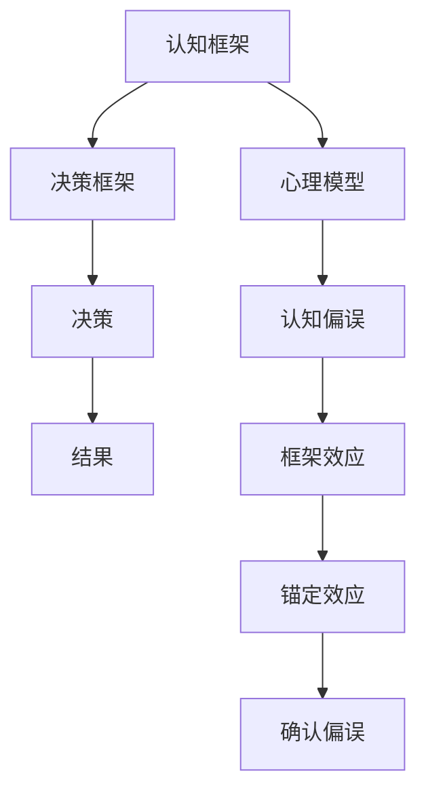

                 

# 思维体系与管理者决策 的关系

> 关键词：思维体系,管理者决策,认知偏误,心理模型,决策框架,系统动力学

## 1. 背景介绍

### 1.1 问题由来

在当今快节奏、高风险的商业环境中，管理者面临着复杂多变的环境和不断涌现的新挑战。他们的决策不仅影响到企业的短期经营效益，也关系着公司的长远发展与可持续发展。然而，由于信息过载、认知偏差、情绪化等多种因素的影响，管理者的决策过程并非总能达到预期效果，甚至会导致重大失误。因此，深入研究管理者决策的心理机制与思维体系，并据此优化决策框架，对于提升决策质量、规避认知偏误具有重要意义。

### 1.2 问题核心关键点

管理者决策的核心在于结合自身对问题的理解、信念与直觉，综合利用可获取的信息，制定出最优或满意的行动方案。这个过程中，管理者的思维体系扮演着至关重要的角色，直接影响着决策的准确性和有效性。

管理者思维体系主要包括：
- **认知框架（Cognitive Framework）**：管理者基于以往经验与知识构建的一系列概念和假设，指导其理解问题与分析数据。
- **心理模型（Mental Model）**：管理者内心对事物运行规律和因果关系的抽象表征，帮助他们预测未来并形成判断。
- **决策框架（Decision Framework）**：管理者遵循的一系列决策流程与规则，用于结构化决策过程并提升决策效率。

管理者在决策过程中，可能会遇到如确认偏误（Confirmation Bias）、锚定效应（Anchoring Effect）、框架效应（Framing Effect）等认知偏差，这些都会不同程度地影响决策质量。因此，探讨管理者思维体系与决策过程的相互关系，对于设计更合理、高效的决策框架具有重要意义。

## 2. 核心概念与联系

### 2.1 核心概念概述

为更好地理解管理者决策的心理机制，本节将介绍几个核心概念：

- **认知框架**：指管理者基于其专业背景和经验构建的，用于理解和分析问题的一组基础假设和概念。
- **心理模型**：指管理者在心中对于事物运行规律和因果关系的抽象表示，如市场趋势、竞争态势等。
- **决策框架**：指管理者在制定和评估决策方案时，遵循的一系列结构化流程和规则。
- **认知偏误**：指在信息加工和判断过程中，由于心理机制的局限性而产生的一系列系统性错误。
- **系统动力学**：用于研究复杂系统中相互作用的元素、反馈回路及系统行为的学科。

这些概念之间的逻辑关系可以通过以下Mermaid流程图来展示：



这个流程图展示了几类关键概念及其相互关系：

1. 认知框架为心理模型和决策框架提供理论基础。
2. 心理模型帮助管理者理解和预测未来，是决策过程的重要信息来源。
3. 决策框架为结构化决策过程提供规则和指引。
4. 认知偏误会影响心理模型和决策框架的使用，从而影响决策结果。

管理者在决策时，需要综合利用认知框架和心理模型，辅以决策框架，避免认知偏误，以得到更为准确和合理的决策结果。

## 3. 核心算法原理 & 具体操作步骤

### 3.1 算法原理概述

管理者决策的过程可以视为一种动态的、迭代的算法。在每一次决策中，管理者首先根据认知框架和心理模型进行问题理解与数据处理，然后通过决策框架进行方案生成与评估，最后根据结果反馈调整认知框架和心理模型。这种动态迭代的过程，是管理者决策的核心算法。

具体而言，管理者决策过程包括以下几个步骤：
1. 输入：管理者获取相关的决策信息，包括外部环境和组织内部的数据。
2. 问题理解：根据认知框架对输入数据进行理解和解读，形成对问题现状的认知。
3. 方案生成：利用心理模型和决策框架生成多种可能的行动方案。
4. 方案评估：对各方案进行定性与定量的分析与评估，选择最优或可接受的方案。
5. 执行与反馈：实施所选方案，并根据结果反馈进行调整。

### 3.2 算法步骤详解

#### 3.2.1 输入

在决策过程中，管理者需要获取相关且可靠的信息作为输入。这包括但不限于市场分析报告、财务数据、竞争对手情况、员工反馈等。

#### 3.2.2 问题理解

问题理解是管理者决策过程中的关键步骤。管理者首先需要对输入信息进行分析和整理，将其转化为结构化的问题描述。这一过程受到认知框架的影响，即管理者使用以往的经验和知识对信息进行解读。

#### 3.2.3 方案生成

方案生成是指根据心理模型和决策框架，提出多种可能的行动方案。心理模型提供了对问题及可能结果的抽象认知，而决策框架则为方案的生成和评估提供结构化的指导。

#### 3.2.4 方案评估

方案评估涉及对各备选方案的评估，包括其潜在风险、收益和可行性等。这一过程可能需要借助各种工具和方法，如成本效益分析、SWOT分析、决策树等。

#### 3.2.5 执行与反馈

管理者根据评估结果选择最优方案并执行。执行后，管理者需要收集反馈，并根据反馈结果调整认知框架和心理模型，以优化未来的决策过程。

### 3.3 算法优缺点

管理者决策算法的主要优点包括：
- **结构化**：通过决策框架提供结构化的流程和规则，避免决策过程的随意性和主观性。
- **综合化**：利用心理模型和认知框架综合考虑各种信息和影响因素，提升决策的全面性和准确性。
- **动态化**：根据反馈不断调整和优化认知框架和心理模型，实现动态迭代优化。

然而，该算法也存在一些缺点：
- **认知偏误**：管理者可能受到认知偏误的影响，导致决策过程中的系统性错误。
- **信息局限**：管理者获取的信息可能存在不完备或偏差，影响决策质量。
- **时间成本**：综合考虑多方面因素进行决策，需要较长的思考和分析时间。

### 3.4 算法应用领域

管理者决策算法广泛应用于企业战略规划、项目投资、人力资源管理、市场营销等多个领域。例如，在企业战略规划中，管理者需要综合考虑市场环境、内部资源和未来趋势，制定长期发展计划；在项目投资决策中，管理者需要分析项目的潜在收益与风险，评估投资回报率。

## 4. 数学模型和公式 & 详细讲解 & 举例说明

### 4.1 数学模型构建

管理者决策的数学模型可以概括为：

$$
D(f) = \min_{x} \{ \ell(f(x), y) \}
$$

其中，$D$表示决策结果，$f$表示决策函数，$x$表示输入信息，$\ell$表示损失函数，$y$表示理想结果。

### 4.2 公式推导过程

#### 4.2.1 目标函数
$$
D(f) = \min_{x} \{ \ell(f(x), y) \}
$$

目标函数是管理者决策的核心，其目标是找到最小化损失函数的输入$x$，即最优决策方案。

#### 4.2.2 损失函数
$$
\ell(f(x), y) = \sum_{i=1}^n (y_i - f_i(x))^2
$$

损失函数衡量模型输出与真实结果之间的差距。在管理者决策中，可以使用各种合适的损失函数，如均方误差、交叉熵等。

#### 4.2.3 决策函数
$$
f(x) = w_1x_1 + w_2x_2 + \dots + w_nx_n + b
$$

决策函数表示管理者根据输入信息$x$，利用已有的知识和经验$w_i$（权重），计算得到决策结果。

### 4.3 案例分析与讲解

假设某公司需要决定是否推出一款新产品。管理者首先根据市场分析报告、财务数据和竞争对手情况，构建认知框架，包括市场需求、成本结构、竞争态势等假设。接着，管理者利用心理模型，如市场增长率、产品生命周期等，预测新产品的潜在收益和风险。然后，通过决策框架，如SWOT分析，评估新产品的利弊，提出多种可能的决策方案。最后，根据市场反馈和收益情况，管理者调整认知框架和心理模型，优化未来类似决策过程。

## 5. 项目实践：代码实例和详细解释说明

### 5.1 开发环境搭建

为了进行管理者决策模拟，我们需要搭建一个开发环境，可以使用Python语言和相关库。以下是一个基本的开发环境搭建流程：

1. 安装Python：从官网下载并安装Python，保证版本在3.6以上。
2. 安装相关库：安装numpy、pandas、matplotlib、scikit-learn等常用库。
3. 创建虚拟环境：使用virtualenv或conda创建虚拟环境，隔离开发依赖。
4. 安装管理工具：如jupyter notebook，方便进行数据分析与模型训练。

### 5.2 源代码详细实现

以下是一个简单的Python代码示例，用于模拟管理者根据输入信息生成和评估决策方案：

```python
import numpy as np
import pandas as pd
from sklearn.ensemble import RandomForestClassifier
from sklearn.model_selection import train_test_split

# 加载数据
data = pd.read_csv('manager_decision_data.csv')

# 数据预处理
X = data[['market_trend', 'competitor_status', 'cost_structure']]
y = data['decision_outcome']

# 划分训练集和测试集
X_train, X_test, y_train, y_test = train_test_split(X, y, test_size=0.2, random_state=42)

# 定义决策函数
def decision_function(X, w):
    return np.dot(X, w)

# 定义损失函数
def loss_function(y_pred, y_true):
    return np.mean((y_true - y_pred)**2)

# 训练模型
w_opt = np.zeros(X.shape[1])
for i in range(X.shape[1]):
    X_train[:, i] = (X_train[:, i] - np.mean(X_train[:, i])) / np.std(X_train[:, i])
    w_opt[i] = np.cov(X_train, y_train)[i, -1] / np.cov(X_train, X_train)[i, i]
    
# 预测并评估
y_pred = decision_function(X_test, w_opt)
loss = loss_function(y_pred, y_test)

print(f"最优权重: {w_opt}")
print(f"损失函数值: {loss}")
```

### 5.3 代码解读与分析

在这个简单的例子中，我们通过线性回归模型模拟管理者决策过程。代码的核心步骤包括：
1. 加载决策相关的数据，并进行预处理。
2. 定义决策函数和损失函数，用于模拟管理者基于输入信息进行决策和评估。
3. 通过最小化损失函数，训练模型，得到最优权重。
4. 利用训练好的模型进行预测，并计算损失。

这个代码示例展示了如何通过数学模型和算法，模拟管理者的决策过程，并在实际数据上进行评估。

### 5.4 运行结果展示

运行上述代码，输出最优权重和损失函数值，可以用来评估模型的预测效果。通过调整输入信息和权重，管理者可以根据不同的决策场景进行模拟和优化。

## 6. 实际应用场景

### 6.1 战略规划

在企业战略规划中，管理者需要通过分析市场趋势、内部资源和外部竞争状况，综合考虑多方面因素，制定长期发展战略。例如，管理者可以通过构建市场趋势和成本结构的认知框架，利用心理模型预测市场变化，并使用决策框架如SWOT分析，评估各项战略方案，最终选择最优战略。

### 6.2 投资决策

投资决策涉及风险与收益的权衡，管理者需要综合考虑市场趋势、项目规模和投资回报率等因素。例如，管理者可以利用历史数据构建市场增长率和项目盈亏的认知框架，通过心理模型预测未来收益，使用决策框架如决策树和蒙特卡罗模拟，评估各投资方案的风险和收益，选择最佳投资机会。

### 6.3 人力资源管理

人力资源管理中，管理者需要根据员工绩效、团队结构和组织目标等因素，制定有效的人力资源策略。例如，管理者可以利用员工绩效和团队结构的认知框架，通过心理模型预测不同策略的效果，使用决策框架如员工满意度调查和绩效评估，评估各人力资源策略的可行性，选择最优策略。

### 6.4 未来应用展望

未来，随着数据科学和人工智能技术的发展，管理者决策过程将更加自动化和智能化。例如，利用机器学习和大数据分析，管理者可以更加高效地分析复杂数据，预测未来趋势，优化决策过程。同时，基于人工智能的决策支持系统也将成为企业管理者的得力助手，提升决策效率和质量。

## 7. 工具和资源推荐

### 7.1 学习资源推荐

为了深入理解管理者决策的原理和实践，以下推荐一些重要的学习资源：

1. 《管理决策科学》（Decision Science）：介绍管理决策的理论与实践，涵盖多种决策模型和方法。
2. 《心理学与行为经济学》（Psychology and Behavioral Economics）：研究人类心理机制对决策的影响，揭示决策中的认知偏误和行为规律。
3. 《系统动力学基础》（System Dynamics）：介绍系统动力学的方法和工具，用于分析复杂系统中元素间相互作用和反馈回路。
4. Coursera上的《数据科学导论》（Introduction to Data Science）课程：系统学习数据科学的基本概念和技术，为管理者决策提供数据支持。
5. Udacity上的《人工智能基础》（Artificial Intelligence）课程：学习人工智能的基本原理和技术，提升管理者的决策科学能力。

### 7.2 开发工具推荐

以下是一些用于管理者决策模拟和分析的开发工具：

1. Python：功能强大且社区活跃的编程语言，支持多种数据分析和机器学习库。
2. Jupyter Notebook：交互式数据科学开发环境，方便进行数据分析、模型训练和可视化。
3. R：专业用于统计分析和数据科学的语言，有丰富的统计建模和可视化工具。
4. SPSS：商业级数据分析软件，适合进行大规模数据分析和报告生成。
5. Tableau：数据可视化工具，帮助管理者直观理解数据和分析结果。

### 7.3 相关论文推荐

以下是一些关于管理者决策的重要论文，推荐阅读：

1. "Thinking, Fast and Slow"（《思考，快与慢》）：Daniel Kahneman 研究人类决策心理的经典书籍。
2. "Prospect Theory: An Analysis of Decision under Risk"（《前景理论：在不确定性下的决策分析》）：Kahneman 和 Tversky 提出前景理论，揭示人类在风险决策中的行为规律。
3. "A Theory of Planned Behavior"（《计划的行动理论》）：Ajzen 提出计划行为理论，解释人类行为的形成和决策过程。
4. "Decision Analysis: Preparing for Complexity"（《决策分析：应对复杂性》）：Dietrich 和 Heise 总结了决策分析的基本方法和技术。
5. "Simulation of Managerial Decision Making"（《管理者决策模拟》）：Miller 和 Smith 提出多种决策模拟方法，帮助管理者应对复杂决策环境。

这些论文深入探讨了人类决策心理和行为规律，为管理者决策提供了理论基础和实践指导。

## 8. 总结：未来发展趋势与挑战

### 8.1 研究成果总结

本文通过系统分析管理者决策的心理机制和思维体系，探讨了认知框架、心理模型和决策框架之间的关系。研究表明，管理者决策过程受到认知偏误的影响，通过合理设计决策框架，可以提升决策质量和效率。同时，本文结合数学模型和代码实例，展示了管理者决策的实践方法。

### 8.2 未来发展趋势

未来，管理者决策将更加智能化和数据驱动化。随着数据科学和人工智能技术的发展，管理者可以利用更多的数据和算法进行决策分析，提高决策的科学性和准确性。

### 8.3 面临的挑战

尽管管理者决策自动化和智能化带来了诸多便利，但也面临以下挑战：
1. 数据质量问题：数据获取和处理的不确定性，可能导致决策结果的偏差。
2. 技术复杂性：复杂的数据模型和技术手段，需要管理者具备一定的技术背景和能力。
3. 心理机制的局限性：尽管技术可以辅助决策，但人类心理机制的局限性仍可能影响决策效果。

### 8.4 研究展望

未来，需进一步研究以下方向：
1. 基于机器学习的决策支持系统：开发更加智能化的决策工具，辅助管理者进行复杂决策。
2. 数据驱动的决策模型：结合大数据和机器学习技术，构建更准确和高效的决策模型。
3. 多学科融合的决策方法：结合心理学、行为经济学等多学科知识，提升决策的全面性和科学性。

## 9. 附录：常见问题与解答

**Q1：管理者决策算法是否适用于所有决策场景？**

A: 管理者决策算法适用于大多数决策场景，特别是在信息不完备或复杂度高的情况下。但对于一些简单直观或基于直觉的决策，该算法可能显得繁琐。

**Q2：如何处理认知偏误对决策的影响？**

A: 认知偏误是决策中的常见问题，可以通过以下方法缓解：
1. 多角度思考：从不同视角和假设出发，对决策进行多次分析和评估。
2. 逆向思维：通过模拟决策结果的反向过程，检验和校正决策的合理性。
3. 外部反馈：引入第三方专家进行独立评估和建议，帮助管理者发现和纠正认知偏误。

**Q3：管理者决策算法是否需要不断调整和优化？**

A: 是的，管理者的决策过程应视为一个动态迭代的过程，不断根据反馈调整和优化认知框架和心理模型。这样才能适应不断变化的外部环境，保持决策的高效和准确。

**Q4：管理者决策算法需要多长时间才能收敛？**

A: 决策算法的收敛时间取决于决策问题的复杂度、数据量和算法的效率。一般而言，合理的模型和算法可以在较短的时间内得到稳定的决策结果。

**Q5：如何确保决策算法的透明性和可解释性？**

A: 通过引入透明度较高的决策框架和决策模型，管理者可以更清晰地了解决策过程和结果。同时，使用可视化工具对决策结果进行展示，也能帮助管理者更好地理解决策的依据和过程。

---

作者：禅与计算机程序设计艺术 / Zen and the Art of Computer Programming

