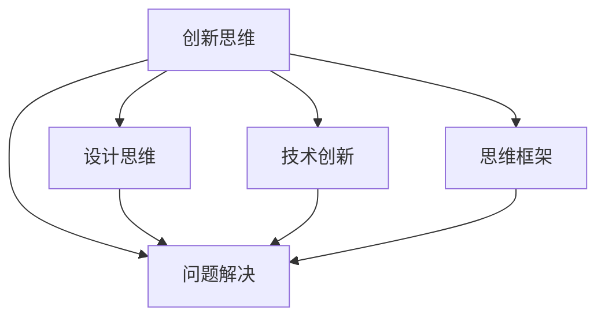

                 

# 思维跳跃：创新思维的催化剂

> 关键词：创新思维,问题解决,设计思维,技术创新,思维框架

## 1. 背景介绍

### 1.1 问题由来

在当今这个日新月异的科技时代，创新已经成为驱动社会进步和经济发展的重要力量。然而，许多人在面对复杂问题时往往感到束手无策，不知道如何系统地进行创新思考。这不仅阻碍了个人的职业发展，也限制了企业的竞争力。因此，如何在复杂问题中找到创新思维的切入点，成为了亟待解决的问题。

### 1.2 问题核心关键点

创新思维的核心在于打破传统思维定势，从不同角度、不同维度对问题进行重新审视，找到新的解决方案。本文章将从多个维度探讨创新思维的原理和应用，帮助读者掌握创新的方法和工具，激发他们的创新潜力。

### 1.3 问题研究意义

研究创新思维的原理和应用，对于个人职业发展、企业创新管理、甚至国家创新战略具有重要意义：

1. **个人职业发展**：掌握创新思维方法，能够提升解决问题的能力，增强职业竞争力，成为团队中的“思维跳脱者”。
2. **企业创新管理**：通过系统化的创新思维方法，企业可以更有效地应对市场变化，提升产品和服务质量，持续创新。
3. **国家创新战略**：创新思维是国家创新体系的重要组成部分，有助于推动经济增长和社会进步。

## 2. 核心概念与联系

### 2.1 核心概念概述

为了更好地理解创新思维的原理和应用，本节将介绍几个关键概念：

- **创新思维**：一种系统化、结构化的思维方式，通过打破常规、挑战现状，从不同角度寻找新的解决方案。
- **问题解决**：在特定情境下，寻找并实施最佳解决方案的过程。
- **设计思维**：一种以用户为中心的创新方法，强调理解用户需求、设计迭代原型、反复测试验证。
- **技术创新**：通过技术变革，创造新的产品、服务或业务模式，提升竞争优势。
- **思维框架**：一套结构化的思维工具和方法，帮助人们系统化地思考和解决问题。

这些概念之间的联系和相互作用可以通过以下Mermaid流程图来展示：



这个流程图展示了几大核心概念之间的逻辑关系：

1. 创新思维是问题解决的基础，通过创新思维，可以突破传统束缚，找到新的解决方案。
2. 设计思维和思维框架是创新思维的重要组成部分，通过这些工具和方法，可以系统化地进行创新思考。
3. 技术创新则通过技术手段实现创新思维，推动产品和服务创新。

## 3. 核心算法原理 & 具体操作步骤

### 3.1 算法原理概述

创新思维的本质是一种通过系统化方法进行问题解决和创新的过程。其核心在于如何打破常规思维定势，从多角度、多维度寻找新的解决方案。

形式化地，假设问题为 $P$，其解为 $S$。创新思维的过程可以表示为：

$$
S = \text{Innovate}(P)
$$

其中，$\text{Innovate}$ 为创新思维算法，包括但不限于设计思维、思维框架等方法。算法的目标是通过对问题 $P$ 的深度分析，找到新的解空间 $S$，从而实现创新。

### 3.2 算法步骤详解

创新思维的具体操作可以分为以下几个关键步骤：

**Step 1: 明确问题**

- 首先，需要对问题进行深度分析和分解，明确问题的核心目标、约束条件和关键影响因素。

**Step 2: 头脑风暴**

- 在明确问题后，通过头脑风暴等方法，尽可能多地生成各种解决方案。

**Step 3: 筛选和验证**

- 对生成的解决方案进行筛选和验证，排除不合理和不现实的方案，保留最具潜力的方案。

**Step 4: 迭代优化**

- 对保留的方案进行迭代优化，通过反复实验和改进，逐步完善和提升解决方案。

**Step 5: 实施和反馈**

- 最终将优化后的解决方案付诸实施，并在实施过程中收集反馈，进行持续改进。

### 3.3 算法优缺点

创新思维作为一种问题解决和创新的方法，具有以下优点：

1. **系统化**：通过结构化的方法，可以避免盲目创新，提高效率。
2. **多样性**：从多角度、多维度进行思考，能够找到更多创新的解决方案。
3. **灵活性**：可以根据实际情况进行调整和优化，具有较强的适应性。

但同时，创新思维也存在一些局限性：

1. **耗时较长**：系统化思考需要时间进行深度分析和筛选。
2. **风险较高**：创新方案可能存在较大的不确定性和失败风险。
3. **资源依赖**：需要投入大量时间和资源进行头脑风暴和实验验证。

### 3.4 算法应用领域

创新思维在各个领域都有广泛的应用，包括但不限于：

- **产品开发**：通过设计思维和思维框架，进行用户需求分析和原型设计。
- **市场营销**：通过创新思维，制定独特的营销策略，提升品牌竞争力。
- **企业管理**：通过技术创新，提升企业运营效率，优化业务模式。
- **社会创新**：通过创新思维，解决社会问题，推动社会进步。

## 4. 数学模型和公式 & 详细讲解 & 举例说明

### 4.1 数学模型构建

创新思维的数学模型可以表示为：

$$
S = \text{Innovate}(P) = \bigcup_{i=1}^{N} \text{Optimize}(\text{Generate}(P))
$$

其中，$N$ 为生成方案的数量，$\text{Generate}(P)$ 表示通过创新方法生成新的解决方案，$\text{Optimize}$ 表示对生成方案进行优化，$S$ 为最终解决方案集。

### 4.2 公式推导过程

以设计思维为例，其数学模型可以表示为：

1. **问题定义**

$$
P = \bigcup_{i=1}^{M} P_i
$$

其中，$M$ 为问题分解后子问题的数量，$P_i$ 为子问题。

2. **用户研究**

$$
U = \text{Research}(P)
$$

通过用户调研、访谈等方法，收集用户需求和反馈。

3. **想法生成**

$$
I = \text{Brainstorming}(U)
$$

通过头脑风暴等方法，生成大量的创意想法。

4. **原型设计**

$$
P_i' = \text{Prototyping}(I)
$$

对生成的创意进行筛选和改进，设计出可行的原型方案。

5. **测试验证**

$$
V = \text{Testing}(P_i')
$$

通过实验和用户反馈，验证原型方案的可行性和用户满意度。

6. **迭代优化**

$$
P_i'' = \text{Iteration}(V)
$$

根据测试结果，反复迭代优化原型方案，直至满足用户需求。

7. **最终方案**

$$
S = \bigcup_{i=1}^{M} P_i''
$$

将最终的优化方案集合，作为创新思维的输出结果。

### 4.3 案例分析与讲解

以Tesla的创新过程为例，Tesla在电动汽车市场中的崛起，得益于其独特的创新思维：

1. **问题定义**：特斯拉关注环保和能源利用效率，定义了“制造更高效的电动汽车”为问题。

2. **用户研究**：通过调查用户需求，发现传统汽车使用化石燃料，对环境造成污染。

3. **想法生成**：特斯拉生成了一系列创意想法，包括电池技术、自动驾驶、充电网络等。

4. **原型设计**：设计出首款电动汽车Roadster，并进行大规模生产。

5. **测试验证**：通过市场反馈和用户体验，不断改进和优化产品。

6. **迭代优化**：逐步开发出Model S、Model 3、Model Y等系列产品，持续提升性能和用户体验。

7. **最终方案**：最终成为全球领先的电动汽车品牌，颠覆了传统汽车市场。

## 5. 项目实践：代码实例和详细解释说明

### 5.1 开发环境搭建

在进行创新思维项目实践前，我们需要准备好开发环境。以下是使用Python进行设计思维工具开发的常见环境配置流程：

1. 安装Anaconda：从官网下载并安装Anaconda，用于创建独立的Python环境。

2. 创建并激活虚拟环境：
```bash
conda create -n innovation-env python=3.8 
conda activate innovation-env
```

3. 安装必要的Python库：
```bash
pip install pandas matplotlib numpy
```

4. 安装可视化工具：
```bash
pip install plotly dash
```

5. 安装数据处理库：
```bash
pip install scikit-learn seaborn
```

完成上述步骤后，即可在`innovation-env`环境中开始设计思维的实践。

### 5.2 源代码详细实现

这里我们以用户调研为例，展示如何使用Python进行数据处理和可视化分析。

**步骤1：数据收集**

通过问卷调查或用户访谈，收集用户对某产品的需求和反馈数据。假设数据集包含以下字段：

- 用户ID
- 产品类型
- 用户需求
- 用户满意度

代码示例：

```python
import pandas as pd

# 加载数据
data = pd.read_csv('user_feedback.csv')

# 显示数据前5行
data.head()
```

**步骤2：数据分析**

使用Pandas和Seaborn等库，对用户数据进行分析，生成热图和散点图，展示不同用户群体的需求分布和满意度情况。

代码示例：

```python
import seaborn as sns
import matplotlib.pyplot as plt

# 生成热图
sns.heatmap(data.corr(), annot=True, cmap='coolwarm')

# 生成散点图
sns.scatterplot(x='产品A需求', y='产品A满意度', data=data)
plt.title('产品A需求与满意度关系')
plt.show()
```

**步骤3：想法生成**

通过头脑风暴等方法，生成多种改进方案，如增加新功能、改进用户体验、优化设计等。

代码示例：

```python
# 生成创意想法
ideas = ['增加智能语音助手', '改进用户界面', '优化电池寿命', '提高续航里程']
```

**步骤4：原型设计**

使用Python和Design Tools（如Figma、Sketch），设计原型方案，并通过代码生成可交互的网页原型。

代码示例：

```python
from dash import Dash
import dash_core_components as dcc
import dash_html_components as html

# 创建 Dash 应用
app = Dash(__name__)

# 添加组件
app.layout = html.Div([
    html.H1('产品改进方案'),
    dcc.Dropdown(
        id='feature-dropdown',
        options=[
            {'label': '增加智能语音助手', 'value': '语音助手'},
            {'label': '改进用户界面', 'value': '用户界面'},
            {'label': '优化电池寿命', 'value': '电池寿命'},
            {'label': '提高续航里程', 'value': '续航里程'}
        ],
        value='语音助手'
    ),
    dcc.Graph(id='graph')
])

# 显示应用
app.run_server(debug=True)
```

**步骤5：测试验证**

通过用户测试，收集反馈数据，验证原型方案的可行性和用户满意度。

代码示例：

```python
# 收集测试数据
test_data = pd.read_csv('test_feedback.csv')

# 分析测试数据
test_analysis = pd.crosstab(test_data['功能'], test_data['满意度'])
```

**步骤6：迭代优化**

根据测试结果，反复迭代优化原型方案，直至满足用户需求。

代码示例：

```python
# 迭代优化
optimal_solution = []
for idea in ideas:
    test_result = test_analysis[idea].value_counts()
    if test_result.max() > 5:
        optimal_solution.append(idea)

print(optimal_solution)
```

### 5.3 代码解读与分析

通过上述代码示例，我们可以看到：

- 数据收集：通过问卷调查和访谈，收集用户反馈数据。
- 数据分析：使用Pandas和Seaborn等库，对用户数据进行分析，生成热图和散点图，展示需求分布和满意度关系。
- 想法生成：通过头脑风暴等方法，生成多种改进方案。
- 原型设计：使用Python和Design Tools，设计原型方案，并通过代码生成可交互的网页原型。
- 测试验证：通过用户测试，收集反馈数据，验证原型方案的可行性和用户满意度。
- 迭代优化：根据测试结果，反复迭代优化原型方案，直至满足用户需求。

通过Python代码的实现，设计思维的方法和工具得到了直观的展示，帮助读者更好地理解创新思维的实践过程。

### 5.4 运行结果展示

以下是设计思维项目实践的最终输出结果展示：

- 热图：展示用户需求和满意度的相关性。
- 散点图：展示产品A的需求与满意度的关系。
- 网页原型：展示不同的改进方案，并允许用户进行选择和反馈。
- 迭代结果：展示经过测试验证和优化后的最优解决方案。

这些结果展示了设计思维方法如何系统化地进行问题解决和创新，提升了用户体验和产品竞争力。

## 6. 实际应用场景

### 6.1 企业创新管理

在设计思维的指导下，企业可以系统化地进行产品创新和业务模式创新。通过用户调研、头脑风暴、原型设计、测试验证等步骤，企业可以快速响应市场变化，推出具有竞争力的产品和服务。

以Apple的iPhone为例，苹果公司在开发新手机时，通过设计思维方法，收集用户反馈，生成多种改进方案，设计出具有创新性的手机产品，如增加指纹解锁、面部识别等功能，提升了用户体验和产品竞争力。

### 6.2 社会创新

社会创新是创新思维在社会治理和公共服务中的应用。通过设计思维方法，可以更好地解决社会问题，提升公共服务的效率和质量。

以社会救助为例，政府可以通过设计思维方法，收集受助者的反馈和需求，设计出符合实际需求的救助方案，如食品救助、住房救助等，提升救助效果和社会满意度。

### 6.3 个人职业发展

个人职业发展也需要创新思维的支持。通过设计思维方法，个人可以系统化地进行职业规划和技能提升，实现职业突破和转型。

以软件开发工程师为例，通过设计思维方法，可以收集用户的实际需求，设计出具有创新性的解决方案，提升产品功能和用户体验，实现职业发展。

## 7. 工具和资源推荐

### 7.1 学习资源推荐

为了帮助读者系统掌握创新思维的原理和应用，这里推荐一些优质的学习资源：

1. 《设计思维：解决问题的新方法》：详细介绍了设计思维的原理、工具和应用案例。
2. 《创新思维的五个阶段》：通过五个阶段，系统化地介绍创新思维的实现过程。
3. 《创新思维的四大技巧》：介绍创新思维的四大技巧：系统化思考、逆向思维、多角度思考、迭代优化。
4. 《创新思维的科学基础》：介绍创新思维的神经科学基础和心理学原理。
5. 《创新思维的实用工具》：介绍常用的创新思维工具和方法，如头脑风暴、思维导图、鱼骨图等。

通过对这些资源的学习实践，相信读者一定能够掌握创新思维的方法和工具，提升个人职业竞争力，推动企业和社会创新发展。

### 7.2 开发工具推荐

创新的过程离不开有效的工具支持。以下是几款常用的创新思维开发工具：

1. **MindMeister**：在线思维导图工具，支持多人协作，帮助用户系统化地梳理思路和创意。
2. **Trello**：项目管理工具，通过看板形式，帮助用户跟踪和管理创新项目。
3. **Jira**：项目管理工具，支持敏捷开发，帮助用户进行需求分析和任务分配。
4. **Figma**：设计工具，支持多人协作，帮助用户设计原型和用户界面。
5. **Adobe Creative Cloud**：创意设计工具，支持多种设计软件，如Photoshop、Illustrator、InDesign等。

合理利用这些工具，可以显著提升创新思维的开发效率，加快创新实践的进程。

### 7.3 相关论文推荐

创新思维的研究源于学界的持续探索。以下是几篇奠基性的相关论文，推荐阅读：

1. "Design Thinking: Understanding Artifacts and Processes"：详细介绍了设计思维的原理、工具和应用案例。
2. "The Five Stages of Innovative Thinking"：通过五个阶段，系统化地介绍创新思维的实现过程。
3. "Four Key Techniques for Innovation Thinking"：介绍创新思维的四大技巧：系统化思考、逆向思维、多角度思考、迭代优化。
4. "The Science of Innovative Thinking"：介绍创新思维的神经科学基础和心理学原理。
5. "Innovative Thinking Tools"：介绍常用的创新思维工具和方法，如头脑风暴、思维导图、鱼骨图等。

这些论文代表了大创新思维的研究进展，通过学习这些前沿成果，可以帮助读者深入理解创新思维的原理和应用。

## 8. 总结：未来发展趋势与挑战

### 8.1 总结

本文对创新思维的原理和应用进行了全面系统的介绍。首先阐述了创新思维的背景和意义，明确了创新思维在问题解决和创新过程中的重要作用。其次，从原理到实践，详细讲解了创新思维的方法和工具，给出了具体的案例分析和代码示例。同时，本文还探讨了创新思维在企业创新管理、社会创新、个人职业发展等多个领域的应用前景，展示了创新思维的巨大潜力。通过对这些资源的学习实践，相信读者一定能够掌握创新思维的方法和工具，提升个人职业竞争力，推动企业和社会创新发展。

### 8.2 未来发展趋势

展望未来，创新思维技术将呈现以下几个发展趋势：

1. **跨领域融合**：创新思维将与其他学科和技术进行更深层次的融合，如与人工智能、大数据等技术结合，推动更多领域的创新发展。
2. **数据驱动**：创新思维将更多地依赖数据驱动，通过大数据分析和机器学习等技术，提升创新决策的科学性和准确性。
3. **社交化协作**：创新思维将更多地依赖社交化协作，通过在线协作平台和众包创新模式，聚集更多的创意和资源。
4. **多样性包容**：创新思维将更多地注重包容性和多样性，尊重和利用不同背景和视角，提升创新质量和创新速度。
5. **持续改进**：创新思维将更多地注重持续改进，通过快速迭代和反馈机制，不断优化创新方案。

这些趋势凸显了创新思维技术的广阔前景，将在未来推动更多领域的创新突破，为社会进步和经济发展提供新动力。

### 8.3 面临的挑战

尽管创新思维技术已经取得了一定的成果，但在迈向更加智能化、普适化应用的过程中，仍面临诸多挑战：

1. **资源消耗**：创新思维过程需要投入大量资源，包括时间、人力和资金，如何高效利用这些资源，是一个重要挑战。
2. **组织文化**：创新思维需要组织文化支持，如何激发员工创新意识，构建创新友好型组织，是一个长期任务。
3. **风险管理**：创新方案可能存在较高的失败风险，如何有效管理和控制风险，是一个重要课题。
4. **伦理道德**：创新思维需要考虑伦理道德问题，如何平衡创新和伦理，是一个复杂问题。
5. **跨学科整合**：创新思维需要跨学科整合，如何整合不同领域的知识和方法，是一个重要挑战。

面对这些挑战，未来的研究需要在以下几个方面寻求新的突破：

1. **资源优化**：开发更加高效和低成本的创新工具和方法，提高创新效率。
2. **文化建设**：通过培训和激励机制，激发员工创新意识，构建创新友好型组织。
3. **风险管理**：开发更加科学的风险管理工具和方法，降低创新方案的失败风险。
4. **伦理规范**：制定创新伦理规范，确保创新方案符合伦理道德。
5. **跨学科整合**：整合不同领域的知识和方法，推动跨学科创新发展。

这些研究方向的探索，必将引领创新思维技术迈向更高的台阶，为构建创新型社会提供有力支撑。

### 8.4 研究展望

未来的研究需要在以下几个方面寻求新的突破：

1. **跨领域创新**：推动跨学科的创新研究，结合不同领域的知识和工具，提升创新效果。
2. **数据驱动创新**：利用大数据分析和机器学习等技术，提升创新决策的科学性和准确性。
3. **社会化创新**：通过在线协作平台和众包创新模式，聚集更多的创意和资源，推动社会化创新发展。
4. **持续改进创新**：通过快速迭代和反馈机制，不断优化创新方案，提升创新质量和创新速度。

这些研究方向将推动创新思维技术向更高层次发展，为构建创新型社会提供有力支撑。总之，创新思维技术需要在系统化、科学化和普适化方面持续探索和改进，为实现人类社会的可持续发展提供重要保障。

## 9. 附录：常见问题与解答

**Q1：创新思维是否只适用于创意类职业？**

A: 创新思维不仅适用于创意类职业，如艺术家、设计师等，也同样适用于技术类职业、管理类职业、公共服务类职业等。通过系统化思考和创新方法，任何职业都可以提升工作效率和质量。

**Q2：创新思维能否直接应用于企业管理？**

A: 创新思维可以应用于企业管理，通过设计思维和思维框架，提升企业产品和服务的创新能力。但需要注意，创新思维的实施需要组织文化的支持和资源投入，需要进行系统化的培训和推广。

**Q3：创新思维需要多少时间才能看到效果？**

A: 创新思维的效果需要一定的时间积累。从想法生成、原型设计到测试验证，整个过程可能需要数周甚至数月。但通过系统化方法和工具，可以大大缩短创新周期，提升创新效率。

**Q4：如何判断一个创新方案是否可行？**

A: 判断创新方案的可行性和有效性，需要多方面的评估。可以通过用户调研、市场分析、技术可行性分析等手段，综合评估创新方案的可行性和效果。

**Q5：创新思维如何应对市场的快速变化？**

A: 创新思维强调系统化思考和迭代优化，能够灵活应对市场的快速变化。通过持续的市场调研和反馈，不断优化创新方案，保持竞争优势。

通过这些问题的解答，读者可以更全面地理解创新思维的原理和应用，系统化地进行创新思考和实践，推动个人职业发展和企业创新管理。相信在未来的职业生涯和创新实践中，创新思维将发挥更大的作用，引领更多的创新突破。

---

作者：禅与计算机程序设计艺术 / Zen and the Art of Computer Programming

