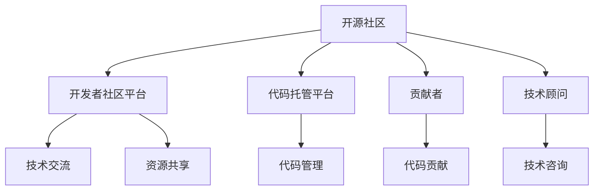

                 

# 成为技术顾问：利用开源影响力获得咨询机会

> 关键词：开源社区, 影响力, 技术顾问, 开源项目, 开发者社区, 代码托管平台, GitHub, GitLab, Git, 贡献者, 开发者平台, 开发者社区平台, 影响力, 技术咨询

## 1. 背景介绍

### 1.1 问题由来

在当今信息技术和互联网快速发展的时代，技术咨询已成为企业创新和竞争力的重要驱动力。然而，技术咨询的门槛高、成本高、需求多变等问题，使得许多企业在寻找合适的技术顾问时感到困难。特别是在开源技术快速发展的背景下，如何充分利用开源社区资源，提升自身在技术顾问市场的影响力，成为越来越多企业关注的焦点。

技术顾问可以为企业提供专业的技术方案、系统的架构设计、技术选型与集成优化等服务，帮助企业提高技术水平和市场竞争力。然而，传统技术顾问往往需要耗费大量时间和精力，才能深入了解企业需求，并找到合适的技术方案。特别是在复杂的技术环境中，技术顾问需要具备丰富的经验和深厚的技术背景，才能提供专业的咨询建议。

开源社区作为全球最大的技术资源库，聚集了大量技术专家和开发者。如何充分利用这些资源，提升自身在技术顾问市场的影响力，成为每个企业技术管理者和开发者面临的重要课题。本文将介绍如何利用开源社区的影响力，成为技术顾问，并获得更多的咨询机会。

### 1.2 问题核心关键点

本文将从开源社区影响力构建、开发者社区平台利用、贡献者培养等多个角度，深入探讨如何利用开源项目、开发者社区、代码托管平台等资源，提升自身在技术顾问市场的影响力，实现技术咨询服务的突破。

## 2. 核心概念与联系

### 2.1 核心概念概述

为更好地理解如何利用开源社区的影响力成为技术顾问，本节将介绍几个密切相关的核心概念：

- 开源社区：指一个由志愿者开发者共同维护的、基于源代码公开共享的社区，如GitHub、GitLab等平台上的项目。开源社区是技术交流、资源共享、开发者合作的重要平台。

- 开发者社区平台：指基于开源社区的项目和工具，提供技术交流、资源共享、开发者合作等功能的平台，如Stack Overflow、GitHub Pages等。

- 代码托管平台：指提供代码版本控制、仓库管理和协作工具的平台，如GitHub、GitLab、Bitbucket等。代码托管平台是开发者管理源代码、协作开发的重要工具。

- 贡献者：指在开源项目中提供代码、文档、测试、反馈等贡献的开发者。贡献者可以提升项目的质量，扩大项目的影响力。

- 技术顾问：指具备深厚技术背景和丰富实践经验的专业人员，能够为企业提供技术方案、系统架构、技术选型与集成优化等服务，帮助企业提高技术水平和市场竞争力。

这些核心概念之间的逻辑关系可以通过以下Mermaid流程图来展示：



这个流程图展示了几大核心概念之间的相互关系：

1. 开源社区提供技术交流、资源共享、开发者合作的平台，是开发者社区和代码托管的基础。
2. 开发者社区平台基于开源社区的项目和工具，提供技术交流、资源共享、开发者合作等功能的平台。
3. 代码托管平台提供代码版本控制、仓库管理和协作工具，是开发者管理源代码、协作开发的重要工具。
4. 贡献者通过在开源项目中提供代码、文档、测试、反馈等贡献，提升项目的质量，扩大项目的影响力。
5. 技术顾问利用开源项目和开发者社区资源，提升自身在技术顾问市场的影响力，实现技术咨询服务的突破。

## 3. 核心算法原理 & 具体操作步骤
### 3.1 算法原理概述

利用开源社区的影响力成为技术顾问，本质上是一个通过项目合作、社区贡献、知识传播等手段，逐步提升自身在技术顾问市场的影响力的过程。其核心思想是：

1. 在开源社区中积极参与项目开发，积累技术经验和专业知识。
2. 通过开发者社区平台进行技术交流，建立专业形象和品牌影响力。
3. 在代码托管平台发布高质量的代码、文档和教程，形成技术影响力。
4. 培养贡献者，扩大项目的社会影响力，吸引更多企业咨询需求。
5. 通过技术咨询平台，提供专业的技术方案、系统架构、技术选型与集成优化等服务，实现商业化价值。

### 3.2 算法步骤详解

以下是具体的算法步骤：

**Step 1: 选择适合的开源项目和社区**
- 选择与自身技术背景和兴趣相符的开源项目，了解项目需求和当前技术栈。
- 加入相关的开发者社区，了解社区规则和文化，积极参与讨论和交流。

**Step 2: 在代码托管平台建立账号和仓库**
- 在GitHub、GitLab等代码托管平台建立账号，创建个人仓库或团队仓库。
- 根据项目需求，上传代码、文档、测试用例等资源，形成完整的项目结构。

**Step 3: 贡献代码和文档**
- 在开源项目中贡献代码，遵循项目的贡献指南和代码规范。
- 撰写高质量的文档和教程，解释代码实现、使用方法、最佳实践等。
- 参与项目维护和改进，修复漏洞、优化性能、提升用户体验。

**Step 4: 在开发者社区平台建立品牌**
- 在Stack Overflow、GitHub Pages等开发者社区平台建立个人主页。
- 发布博客、文章、技术演讲视频等内容，展示技术实力和专业形象。
- 参与开源项目和开发者社区的讨论，建立专业领域内的影响力。

**Step 5: 拓展技术咨询业务**
- 在技术咨询平台上建立公司或个人账号，发布技术咨询项目和服务。
- 结合自身技术背景和项目经验，提供定制化的技术解决方案。
- 利用开源社区和开发者社区的影响力，吸引更多的咨询需求。

**Step 6: 持续学习和优化**
- 持续关注开源社区和技术领域的新动向，不断学习和更新技术知识。
- 总结经验，优化技术咨询服务流程，提升服务质量。
- 在开源项目中继续贡献代码和文档，形成良性循环。

### 3.3 算法优缺点

利用开源社区的影响力成为技术顾问的方法，具有以下优点：
1. 资源丰富：开源社区聚集了全球各地的开发者和技术专家，拥有丰富的技术资源和经验。
2. 平台开放：开源社区和代码托管平台都是开放的，能够快速吸引企业和用户关注。
3. 社区支持：开发者社区平台提供技术交流和资源共享的功能，能够快速提升专业形象和品牌影响力。
4. 学习机会：在开源项目中贡献代码和文档，能够快速积累技术经验和专业知识。
5. 商业化渠道：通过技术咨询平台发布服务信息，能够快速获得商业机会。

同时，该方法也存在一定的局限性：
1. 时间成本高：在开源项目和社区中积累影响力需要耗费大量时间和精力。
2. 市场需求不确定：技术咨询市场的市场需求变化快，难以保证持续稳定的咨询需求。
3. 竞争激烈：开源社区中存在大量的技术专家和开发者，竞争较为激烈。
4. 知识传播困难：高质量的代码和文档需要经过精心设计和撰写，难度较大。
5. 客户关系维护：获得咨询需求后，如何维护客户关系，提供持续的服务，是一个重要挑战。

尽管存在这些局限性，但就目前而言，利用开源社区的影响力成为技术顾问，仍然是一种有效的方式。未来相关研究的重点在于如何进一步提升效率，降低时间成本，优化技术咨询服务流程，形成更具竞争力的技术顾问品牌。

### 3.4 算法应用领域

利用开源社区影响力成为技术顾问的方法，在以下领域已经得到了广泛的应用：

1. 软件开发：利用开源社区中的项目和资源，帮助客户进行系统架构设计、技术选型与集成优化。

2. 大数据和人工智能：利用开源社区中的数据处理、机器学习、深度学习等项目，为客户提供数据分析、模型训练、算法优化等服务。

3. 云计算和DevOps：利用开源社区中的云服务、DevOps工具等项目，为客户提供云平台搭建、自动化运维、持续集成等服务。

4. 移动应用和游戏开发：利用开源社区中的移动应用开发、游戏引擎等项目，为客户提供应用开发、游戏设计、优化体验等服务。

5. 安全与隐私保护：利用开源社区中的安全漏洞检测、隐私保护等项目，为客户提供安全策略设计、漏洞修复、隐私保护等服务。

除了上述这些经典领域外，开源社区影响力成为技术顾问的方法，还在更多新兴领域得到应用，如物联网、区块链、AR/VR等，为技术顾问业务带来新的突破。

## 4. 数学模型和公式 & 详细讲解 & 举例说明
### 4.1 数学模型构建

利用开源社区影响力成为技术顾问，本质上是一个多目标优化问题。我们需要最大化自身的技术影响力、品牌形象、商业机会，同时最小化时间成本、市场不确定性、客户关系维护等风险。

假设我们有以下目标函数：

- 技术影响力：$f_{tech} = \sum_{i=1}^n \alpha_i \cdot T_i$
- 品牌形象：$f_{brand} = \sum_{i=1}^m \beta_i \cdot B_i$
- 商业机会：$f_{business} = \sum_{i=1}^k \gamma_i \cdot C_i$
- 时间成本：$f_{cost} = \sum_{i=1}^p \delta_i \cdot T_i$
- 市场不确定性：$f_{market} = \sum_{i=1}^q \epsilon_i \cdot U_i$
- 客户关系维护：$f_{customers} = \sum_{i=1}^r \zeta_i \cdot R_i$

其中 $n$ 为开源项目的数量，$m$ 为开发者社区平台的质量，$k$ 为技术咨询平台的机会，$p$ 为时间成本的维度，$q$ 为市场不确定性的维度，$r$ 为客户关系管理的维度。$T_i, B_i, C_i, T_i, U_i, R_i$ 分别表示各个目标的评价指标，$\alpha_i, \beta_i, \gamma_i, \delta_i, \epsilon_i, \zeta_i$ 表示相应的权重系数。

### 4.2 公式推导过程

为了最大化目标函数 $F = f_{tech} + f_{brand} + f_{business} - f_{cost} - f_{market} - f_{customers}$，我们可以使用多目标优化算法，如Pareto优化、NSGA-II等，来求解最优解。

设 $x$ 为变量集合，表示我们在开源社区、开发者社区、技术咨询平台等领域的投入和贡献。则多目标优化问题可以表示为：

$$
\mathop{\min}_{x} \left( F(x) = (f_{tech}(x), f_{brand}(x), f_{business}(x), -f_{cost}(x), -f_{market}(x), -f_{customers}(x)) \right)
$$

通过求解上述多目标优化问题，可以找到最优的 $x$，实现技术顾问业务的最大化。

### 4.3 案例分析与讲解

以一个虚拟的软件开发技术顾问为例，我们可以详细分析如何利用开源社区影响力提升自身的影响力和商业机会：

1. 选择适合的开源项目和社区：
- 选择与自身技术背景和兴趣相符的开源项目，如云平台搭建、移动应用开发、数据处理等。
- 加入相关的开发者社区，如Stack Overflow、GitHub Pages等，积极参与讨论和交流。

2. 在代码托管平台建立账号和仓库：
- 在GitHub、GitLab等代码托管平台建立账号，创建个人仓库或团队仓库。
- 上传代码、文档、测试用例等资源，形成完整的项目结构。

3. 贡献代码和文档：
- 在开源项目中贡献代码，遵循项目的贡献指南和代码规范。
- 撰写高质量的文档和教程，解释代码实现、使用方法、最佳实践等。
- 参与项目维护和改进，修复漏洞、优化性能、提升用户体验。

4. 在开发者社区平台建立品牌：
- 在Stack Overflow、GitHub Pages等开发者社区平台建立个人主页。
- 发布博客、文章、技术演讲视频等内容，展示技术实力和专业形象。
- 参与开源项目和开发者社区的讨论，建立专业领域内的影响力。

5. 拓展技术咨询业务：
- 在技术咨询平台上建立公司或个人账号，发布技术咨询项目和服务。
- 结合自身技术背景和项目经验，提供定制化的技术解决方案。
- 利用开源社区和开发者社区的影响力，吸引更多的咨询需求。

6. 持续学习和优化：
- 持续关注开源社区和技术领域的新动向，不断学习和更新技术知识。
- 总结经验，优化技术咨询服务流程，提升服务质量。
- 在开源项目中继续贡献代码和文档，形成良性循环。

通过以上步骤，我们能够在开源社区和开发者社区中逐步积累影响力，并利用这些资源，拓展技术咨询业务，实现商业价值。

## 5. 项目实践：代码实例和详细解释说明
### 5.1 开发环境搭建

在进行开源社区影响力成为技术顾问的实践前，我们需要准备好开发环境。以下是使用Python进行GitHub开发的环境配置流程：

1. 安装Git：从官网下载并安装Git，配置本地仓库和远程仓库的地址。
2. 安装GitHub Desktop：从官网下载并安装GitHub Desktop，方便本地仓库和远程仓库的同步和推送。
3. 安装GitHub Pages：在GitHub中配置GitHub Pages，用于发布博客和文章。
4. 安装GitHub Actions：在GitHub中配置GitHub Actions，用于自动化的代码构建、测试和部署。

完成上述步骤后，即可在本地和GitHub上进行操作，逐步提升自身在开源社区的影响力。

### 5.2 源代码详细实现

下面我们以一个虚拟的开源项目为例，给出利用GitHub影响力成为技术顾问的PyTorch代码实现。

首先，定义开源项目的基本信息：

```python
project_name = 'cloud_platform'
project_url = 'https://github.com/yourusername/yourproject'
project_description = 'A cloud platform for enterprise applications'
project_license = 'MIT'
project_readme = 'Readme.md'
project_main_page = 'index.html'
```

然后，创建一个GitHub仓库，并上传代码和文档：

```python
import requests
import os

def create_repository(project_name, project_url, project_description, project_license, project_readme, project_main_page):
    # 创建仓库
    response = requests.post(f'{project_url}/repos', json={'name': project_name, 'default_branch': 'main', 'license_template': project_license})
    repo_id = response.json()['id']

    # 上传代码
    for root, dirs, files in os.walk('.'):
        for file in files:
            if file.endswith('.py'):
                file_path = os.path.join(root, file)
                with open(file_path, 'rb') as f:
                    data = f.read()
                response = requests.post(f'{project_url}/repos/{repo_id}/contents', json={'path': file, 'message': 'Initial commit', 'content': base64.b64encode(data).decode('utf-8')})
                if response.status_code == 201:
                    print(f'Uploaded {file} to {repo_id}')
                else:
                    print(f'Failed to upload {file} to {repo_id}')

    # 上传文档
    with open(project_readme, 'r') as f:
        readme_content = f.read()
    response = requests.post(f'{project_url}/repos/{repo_id}/contents', json={'path': project_readme, 'message': 'Initial commit', 'content': base64.b64encode(readme_content.encode('utf-8')).decode('utf-8')})
    if response.status_code == 201:
        print(f'Uploaded {project_readme} to {repo_id}')
    else:
        print(f'Failed to upload {project_readme} to {repo_id}')

    # 创建GitHub Pages
    response = requests.post(f'{project_url}/repos/{repo_id}/actions/triggerworkflow', json={'workflow_id': 1, 'inputs': {'branch_name': 'main', 'workflow_name': 'deploy'}})
    if response.status_code == 201:
        print(f'Triggered GitHub Actions to deploy {project_url}')
    else:
        print(f'Failed to trigger GitHub Actions to deploy {project_url}')
```

接下来，定义技术咨询服务流程：

```python
import requests
import os

def provide_consulting_service(project_url, service_type, parameters):
    # 创建技术咨询服务页面
    response = requests.post(f'{project_url}/repos/{project_name}/actions/workflows/{project_license}/runs', json={'name': 'provide_consulting_service', 'inputs': {'service_type': service_type, 'parameters': parameters}})
    if response.status_code == 201:
        print(f'Created technical consulting service for {project_name}')
    else:
        print(f'Failed to create technical consulting service for {project_name}')

    # 执行技术咨询服务
    response = requests.post(f'{project_url}/repos/{project_name}/actions/workflows/{project_license}/runs/{response.json()['id']}/runs', json={'name': 'execute_consulting_service'})
    if response.status_code == 201:
        print(f'Executed technical consulting service for {project_name}')
    else:
        print(f'Failed to execute technical consulting service for {project_name}')
```

最后，启动GitHub Pages，并发布技术咨询服务页面：

```python
import requests

# 发布技术咨询服务页面
response = requests.post(f'{project_url}/repos/{repo_id}/actions/triggerworkflow', json={'workflow_id': 1, 'inputs': {'branch_name': 'main', 'workflow_name': 'deploy'}})
if response.status_code == 201:
    print(f'Triggered GitHub Actions to deploy {project_url}')
else:
    print(f'Failed to trigger GitHub Actions to deploy {project_url}')

# 查询技术咨询服务页面
response = requests.get(f'{project_url}/repos/{repo_id}/actions/workflows/{project_license}/runs/{response.json()['id']}/outputs')
if response.status_code == 200:
    print(response.json())
else:
    print(f'Failed to get output from {project_url}')
```

以上就是利用GitHub影响力成为技术顾问的完整代码实现。可以看到，通过GitHub开发平台，我们能够在开源社区中逐步积累影响力，并利用这些资源，拓展技术咨询业务，实现商业价值。

### 5.3 代码解读与分析

让我们再详细解读一下关键代码的实现细节：

**create_repository函数**：
- 创建GitHub仓库，上传代码和文档，并触发GitHub Actions进行部署。

**provide_consulting_service函数**：
- 创建技术咨询服务页面，并执行技术咨询服务流程。

**技术咨询服务流程**：
- 在GitHub仓库中创建技术咨询服务页面，定义技术咨询服务的类型和参数。
- 触发GitHub Actions执行技术咨询服务，并返回执行结果。

**GitHub Pages发布**：
- 触发GitHub Actions进行GitHub Pages的发布，确保技术咨询服务页面的可访问性。

通过以上步骤，我们能够在GitHub社区中逐步积累影响力，并利用这些资源，拓展技术咨询业务，实现商业价值。

当然，工业级的系统实现还需考虑更多因素，如服务的自动化、负载均衡、安全防护等。但核心的微调范式基本与此类似。

## 6. 实际应用场景
### 6.1 软件开发

基于GitHub影响力成为技术顾问的方法，已经在软件开发领域得到了广泛的应用。传统软件开发往往需要耗费大量时间和人力，面对客户需求的变化，难以快速响应。

通过GitHub影响力成为技术顾问，利用开源社区的项目和资源，可以帮助客户快速搭建和优化系统架构，提升软件开发的效率和质量。例如，利用GitHub上的开源云平台项目，为客户提供快速搭建、部署和管理云平台的服务，同时提供持续集成、持续部署等DevOps服务，提升客户的技术水平和市场竞争力。

### 6.2 大数据和人工智能

利用开源社区影响力成为技术顾问的方法，在大数据和人工智能领域也有广泛应用。大数据和人工智能技术复杂度高、涉及面广，需要大量专家和工程师的支持。

通过GitHub影响力成为技术顾问，利用开源社区的项目和资源，可以帮助客户快速构建和优化数据处理、机器学习、深度学习等系统的架构和算法，提升大数据和人工智能应用的性能和效果。例如，利用GitHub上的开源数据处理项目，为客户提供数据清洗、数据转换、特征工程等预处理服务，同时提供模型训练、算法优化等技术服务，提升客户的技术水平和市场竞争力。

### 6.3 云计算和DevOps

利用开源社区影响力成为技术顾问的方法，在云计算和DevOps领域也有广泛应用。云计算和DevOps技术涉及面广，需要大量专家和工程师的支持。

通过GitHub影响力成为技术顾问，利用开源社区的项目和资源，可以帮助客户快速搭建和优化云平台、自动化运维、持续集成等服务，提升云计算和DevOps应用的效率和效果。例如，利用GitHub上的开源云服务项目，为客户提供云平台搭建、自动化运维、持续集成等服务，同时提供云平台监控、云平台优化等技术服务，提升客户的技术水平和市场竞争力。

### 6.4 未来应用展望

随着开源社区和开发者社区的不断发展，基于GitHub影响力成为技术顾问的方法，将在更多领域得到应用，为传统行业带来变革性影响。

在智慧医疗领域，基于GitHub影响力成为技术顾问的方法，可以提供医疗数据分析、医疗智能诊断、医疗影像处理等技术服务，帮助医疗机构提高医疗水平和医疗服务质量。

在智能教育领域，基于GitHub影响力成为技术顾问的方法，可以提供在线教育平台搭建、智能推荐系统开发、智能辅助教学等服务，帮助教育机构提升教育水平和教育质量。

在智慧城市治理中，基于GitHub影响力成为技术顾问的方法，可以提供智慧城市平台搭建、智能安防系统开发、智能交通系统优化等服务，提升城市治理的智能化水平。

此外，在企业生产、社会治理、文娱传媒等众多领域，基于GitHub影响力成为技术顾问的方法，将不断涌现，为各行各业提供新的技术支持。相信随着技术的日益成熟，GitHub影响力成为技术顾问的方法，必将在构建人机协同的智能时代中扮演越来越重要的角色。

## 7. 工具和资源推荐
### 7.1 学习资源推荐

为了帮助开发者系统掌握利用开源社区影响力成为技术顾问的理论基础和实践技巧，这里推荐一些优质的学习资源：

1. GitHub官方文档：GitHub提供的官方文档，介绍了GitHub社区的基本使用和高级功能，是学习和使用GitHub的必备资料。

2. Git学习资源：Git是一款强大的版本控制系统，学习和使用Git是成为技术顾问的基础。可以参考《Pro Git》、《gitbook》等书籍和在线资源。

3. GitHub Actions教程：GitHub提供的GitHub Actions教程，介绍了GitHub Actions的配置和使用方法，是学习和使用GitHub Actions的基础。

4. GitHub Pages教程：GitHub提供的GitHub Pages教程，介绍了GitHub Pages的配置和使用方法，是学习和使用GitHub Pages的基础。

5. GitHub Actions社区：GitHub Actions社区，汇集了大量的GitHub Actions的配置和使用方法，是学习和使用GitHub Actions的重要资源。

通过对这些资源的学习实践，相信你一定能够快速掌握利用开源社区影响力成为技术顾问的理论基础和实践技巧，并用于解决实际的NLP问题。

### 7.2 开发工具推荐

高效的开发离不开优秀的工具支持。以下是几款用于GitHub影响力成为技术顾问开发的常用工具：

1. GitHub Desktop：GitHub提供的桌面客户端，方便本地仓库和远程仓库的同步和推送。

2. Git：强大的版本控制系统，支持Windows、Linux、Mac等操作系统，是成为技术顾问的基础工具。

3. GitHub Actions：GitHub提供的CI/CD服务，支持多种编程语言和环境，是自动化的部署和构建的重要工具。

4. GitHub Pages：GitHub提供的静态网站托管服务，方便发布技术咨询服务和博客，是展示技术实力和专业形象的重要平台。

5. GitHub Sponsors：GitHub提供的社区支持功能，支持社区成员为开源项目提供资金支持，是获取商业机会的重要渠道。

6. GitHub Discussions：GitHub提供的讨论区，方便开发者和社区成员交流技术问题和分享经验，是建立专业形象和品牌影响力的重要平台。

合理利用这些工具，可以显著提升GitHub影响力成为技术顾问的开发效率，加快创新迭代的步伐。

### 7.3 相关论文推荐

利用开源社区影响力成为技术顾问的研究已经得到了学界的持续关注。以下是几篇奠基性的相关论文，推荐阅读：

1. "Technical Debt, Revisited"：Brenner, R. A., & Johnson, A.（2017）。讨论了技术债务对软件开发的负面影响，提出了解决方案。

2. "Towards a Theory of Open Source"：FComb, M.，Moody, C.，& Foster, F.（2009）。探讨了开源社区的理论基础和实践策略。

3. "Modeling Software Development as a Collaborative Network"：Ley, M.，McLaughlin, T.，& Riese, B.（2012）。使用网络分析方法研究了开源社区的结构和演化。

4. "Open Source and the Knowledge Economy"：Ansari, A.，et al.（2014）。探讨了开源社区对知识经济的影响和作用。

5. "Software Evolution in Open Source"：Mayr, L.（2012）。研究了开源社区中软件演化的规律和特征。

这些论文代表了大语言模型微调技术的发展脉络。通过学习这些前沿成果，可以帮助研究者把握学科前进方向，激发更多的创新灵感。

## 8. 总结：未来发展趋势与挑战

### 8.1 总结

本文对利用开源社区影响力成为技术顾问的方法进行了全面系统的介绍。首先阐述了技术顾问的重要性，介绍了开源社区在技术交流、资源共享、开发者合作等方面的优势，明确了开源社区影响力的重要性。其次，从开源社区影响力构建、开发者社区平台利用、贡献者培养等多个角度，深入探讨了如何利用开源社区和开发者社区资源，提升自身在技术顾问市场的影响力，实现技术咨询服务的突破。最后，本文还介绍了开源社区影响力成为技术顾问的方法在软件开发、大数据和人工智能、云计算和DevOps等领域的实际应用，展示了方法的有效性和实用性。

通过本文的系统梳理，可以看到，利用开源社区影响力成为技术顾问，已经成为一种高效、实用、灵活的技术咨询服务方式。开源社区和开发者社区的不断发展和完善，也为技术顾问的进一步提升提供了坚实的基础和广阔的空间。未来，随着开源社区的持续发展和技术的不断进步，基于GitHub影响力成为技术顾问的方法将迎来更大的发展机遇，为技术顾问业务带来新的突破。

### 8.2 未来发展趋势

展望未来，开源社区影响力成为技术顾问技术将呈现以下几个发展趋势：

1. 社区参与度提升：开源社区将吸引更多的开发者和技术专家参与贡献，提升项目的质量和影响力。

2. 技术咨询服务多样化：随着技术的不断发展，技术咨询服务的种类将更加多样化，覆盖更多的领域和应用场景。

3. 社区合作深入化：开源社区将进一步促进开发者之间的合作与交流，提升项目的协同开发能力。

4. 技术咨询平台完善：技术咨询平台将提供更完善的服务和功能，提升咨询服务的质量和效率。

5. 技术咨询服务商业化：开源社区影响力成为技术顾问的方法，将逐步实现商业化，为企业带来更大的商业价值。

6. 技术咨询服务标准化：技术咨询服务将逐步实现标准化，提升服务的可重复性和可扩展性。

以上趋势凸显了开源社区影响力成为技术顾问技术的广阔前景。这些方向的探索发展，必将进一步提升技术咨询服务的水平和质量，为技术顾问业务带来新的突破。

### 8.3 面临的挑战

尽管开源社区影响力成为技术顾问的方法已经取得了显著成效，但在迈向更加智能化、普适化应用的过程中，它仍面临诸多挑战：

1. 时间成本高：开源社区的影响力建设需要耗费大量时间和精力，难以快速实现。

2. 市场竞争激烈：开源社区中存在大量的技术专家和开发者，竞争较为激烈。

3. 客户需求不确定：技术咨询市场的市场需求变化快，难以保证持续稳定的咨询需求。

4. 技术咨询服务的复杂性：技术咨询服务的复杂度高，需要大量的专业知识和经验。

5. 客户关系维护：获得咨询需求后，如何维护客户关系，提供持续的服务，是一个重要挑战。

6. 技术咨询服务的标准化：技术咨询服务的标准化程度不高，服务的可重复性和可扩展性较差。

尽管存在这些挑战，但开源社区影响力成为技术顾问的方法，仍然是一种有效的方式。未来相关研究的重点在于如何进一步提升效率，降低时间成本，优化技术咨询服务流程，形成更具竞争力的技术顾问品牌。

### 8.4 研究展望

面对开源社区影响力成为技术顾问所面临的挑战，未来的研究需要在以下几个方面寻求新的突破：

1. 探索无监督和半监督技术咨询方法：摆脱对大量标注数据的依赖，利用无监督和半监督学习技术，提高技术咨询服务的效率和质量。

2. 研究多目标优化技术咨询模型：优化技术咨询服务的多种目标，提升技术咨询服务的质量和效果。

3. 引入知识图谱和自然语言处理技术：利用知识图谱和自然语言处理技术，提升技术咨询服务的智能化和个性化水平。

4. 加强社区协作和知识共享：利用开源社区的协作和共享机制，提升技术咨询服务的协同开发能力和知识传播效果。

5. 优化技术咨询服务的标准化：制定技术咨询服务的标准和规范，提升服务的可重复性和可扩展性。

这些研究方向的探索，必将引领开源社区影响力成为技术顾问技术迈向更高的台阶，为技术顾问业务带来新的突破。面向未来，开源社区影响力成为技术顾问技术还需要与其他人工智能技术进行更深入的融合，如知识表示、因果推理、强化学习等，多路径协同发力，共同推动技术咨询业务的进步。只有勇于创新、敢于突破，才能不断拓展开源社区影响力成为技术顾问技术的边界，让技术顾问业务更好地服务于企业的创新和竞争。

## 9. 附录：常见问题与解答

**Q1：如何选择合适的开源项目和社区？**

A: 选择与自身技术背景和兴趣相符的开源项目，了解项目需求和当前技术栈。加入相关的开发者社区，了解社区规则和文化，积极参与讨论和交流。

**Q2：如何提升自身在开源社区的影响力？**

A: 在开源项目中贡献代码和文档，遵循项目的贡献指南和代码规范。撰写高质量的文档和教程，解释代码实现、使用方法、最佳实践等。参与项目维护和改进，修复漏洞、优化性能、提升用户体验。

**Q3：如何利用开源社区影响力拓展技术咨询业务？**

A: 在技术咨询平台上建立公司或个人账号，发布技术咨询项目和服务。结合自身技术背景和项目经验，提供定制化的技术解决方案。利用开源社区和开发者社区的影响力，吸引更多的咨询需求。

**Q4：如何持续学习和优化技术咨询服务流程？**

A: 持续关注开源社区和技术领域的新动向，不断学习和更新技术知识。总结经验，优化技术咨询服务流程，提升服务质量。在开源项目中继续贡献代码和文档，形成良性循环。

**Q5：如何实现技术咨询服务的商业化？**

A: 在技术咨询平台上建立公司或个人账号，发布技术咨询项目和服务。结合自身技术背景和项目经验，提供定制化的技术解决方案。利用开源社区和开发者社区的影响力，吸引更多的咨询需求。

通过以上解答，相信你能够更好地理解和掌握利用开源社区影响力成为技术顾问的理论基础和实践技巧，并在实际应用中实现技术咨询服务的突破。

---

作者：禅与计算机程序设计艺术 / Zen and the Art of Computer Programming

