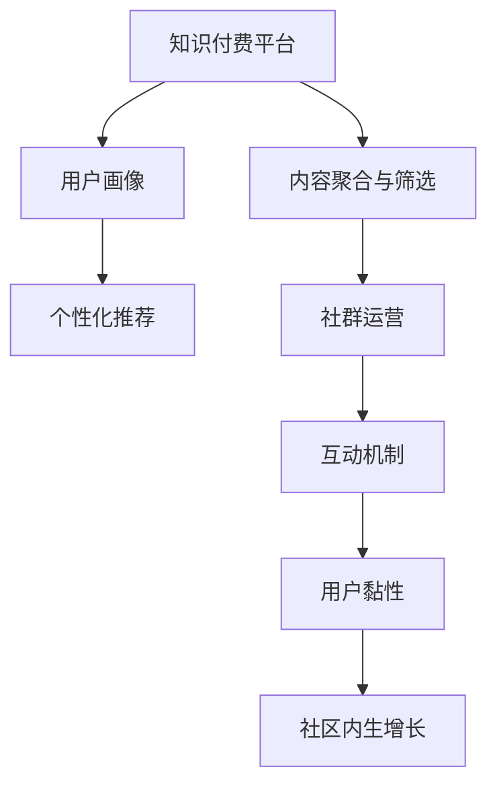

                 

## 1. 背景介绍

### 1.1 问题由来
知识付费行业正处于快速发展阶段。随着移动互联网的普及和信息爆炸的加剧，传统的内容分发方式已难以满足用户对优质信息的需求。知识付费平台作为信息获取的新渠道，正逐渐成为人们获取知识的主要方式。然而，当前知识付费平台仍面临诸多问题：

1. **内容同质化严重**：平台上充斥大量低质量内容，难以满足用户对深度、专业的需求。
2. **用户粘性低**：订阅费用低廉，用户流失率高，难以实现长期稳定收益。
3. **付费转化率低**：推荐算法不精准，难以将优质内容推送给目标用户。
4. **用户需求难以把握**：用户需求多样化，难以通过单一的付费模式满足不同用户的需求。

### 1.2 问题核心关键点
打造专业社群的关键在于构建高质量、高黏性的内容生态，形成知识付费的良性循环。以下是核心关键点：

1. **内容聚合与筛选**：通过算法推荐和人工精选，聚合优质内容，筛选出用户真正关心的主题和领域。
2. **用户画像构建**：精准分析用户行为和偏好，形成用户画像，提供个性化的内容推荐和付费模式。
3. **社群构建与运营**：构建专业社群，通过互动机制提升用户黏性，形成社区内生增长的动力。
4. **付费模式多样化**：结合社区运营和内容推荐，提供多样化付费模式，如按需支付、订阅制、会员制等，满足不同用户需求。

### 1.3 问题研究意义
通过打造专业社群，知识付费平台可以实现以下几个目标：

1. **内容质量提升**：平台能聚合优质内容，提升整体内容质量。
2. **用户粘性提高**：通过社群运营提升用户互动和粘性，实现长期稳定收益。
3. **付费转化率增加**：精准推荐优质内容，提升付费转化率。
4. **用户需求满足**：根据用户画像提供个性化内容，满足不同用户需求。

本文聚焦于如何通过算法和技术手段，构建专业社群，打造知识付费的增长引擎。通过系统梳理，希望能对知识付费平台的运营和发展提供有价值的参考。

## 2. 核心概念与联系

### 2.1 核心概念概述

为更好地理解专业社群的构建过程，本节将介绍几个关键概念：

1. **知识付费平台**：以内容为核心，通过付费模式提供有价值的知识产品，满足用户对专业信息的需求。
2. **内容聚合与筛选**：聚合优质内容，筛选出用户真正关心的主题和领域。
3. **用户画像**：通过行为分析，精准刻画用户画像，提供个性化内容推荐和付费模式。
4. **社群运营**：通过互动机制，提升用户黏性，形成社区内生增长的动力。
5. **个性化推荐**：根据用户画像，提供个性化的内容推荐，提升用户满意度。

这些概念之间的逻辑关系可以通过以下Mermaid流程图来展示：



这个流程图展示了这个流程的核心概念及其之间的关系：

1. 知识付费平台通过内容聚合与筛选，提供优质内容。
2. 用户画像描述了用户的特征和需求，用于个性化推荐。
3. 个性化推荐通过精准匹配，提升用户满意度。
4. 社群运营通过互动机制，提升用户黏性，形成社区内生增长的动力。

## 3. 核心算法原理 & 具体操作步骤
### 3.1 算法原理概述

专业社群的构建，本质上是利用算法和技术手段，提升内容质量和用户黏性，形成社区内生增长的良性循环。其核心思想是通过内容聚合与筛选、用户画像构建、个性化推荐、社群运营等环节，实现用户满意度和平台收益的提升。

形式化地，假设平台的内容集合为 $C$，用户集合为 $U$，内容与用户之间的互动关系为 $R$，内容与用户画像 $P$ 的匹配度为 $M$。构建专业社群的目标是最大化 $U$ 与 $C$ 的互动强度，即最大化 $M \times R$。

具体而言，算法主要分为以下几个步骤：

1. **内容聚合与筛选**：通过爬虫或API接口获取内容，利用预训练模型筛选出优质内容。
2. **用户画像构建**：通过行为分析，构建用户画像，用于个性化推荐。
3. **个性化推荐**：根据用户画像和内容匹配度，推荐优质内容。
4. **社群运营**：通过互动机制，提升用户黏性，形成社区内生增长。

### 3.2 算法步骤详解

以下是详细的操作步骤：

#### 3.2.1 内容聚合与筛选

1. **数据采集**：
   - 通过爬虫或API接口，从新闻网站、视频平台、学术数据库等渠道采集内容。
   - 对于文本内容，可以通过自然语言处理（NLP）技术进行清洗和预处理，去除噪声。

2. **预训练模型筛选**：
   - 利用预训练模型（如BERT、RoBERTa等）对采集到的内容进行文本分类、情感分析等任务，筛选出优质内容。
   - 对于图像、视频等非文本内容，可以结合计算机视觉和语音识别技术进行分类和分析。

#### 3.2.2 用户画像构建

1. **行为分析**：
   - 通过用户的行为数据（如浏览记录、搜索历史、购买行为等），分析用户的兴趣和需求。
   - 使用聚类算法（如K-means、LDA等）将用户分为不同兴趣群体。

2. **画像构建**：
   - 根据行为分析结果，构建用户画像，包括兴趣领域、阅读偏好、学习习惯等。
   - 利用NLP技术对用户评论、反馈进行情感分析，进一步细化用户画像。

#### 3.2.3 个性化推荐

1. **模型选择**：
   - 选择合适的推荐算法，如协同过滤、基于内容的推荐、深度学习推荐系统等。
   - 对于文本内容，可以使用基于注意力机制的推荐模型（如Transformer），结合用户画像进行内容匹配。

2. **推荐实现**：
   - 根据用户画像和内容匹配度，实时生成推荐列表。
   - 可以使用带负采样的softmax函数计算推荐概率，选择top-N内容进行推荐。

#### 3.2.4 社群运营

1. **互动机制设计**：
   - 设计互动机制，如点赞、评论、分享、打赏等，提升用户互动和粘性。
   - 可以通过社交网络理论，分析用户之间的互动模式，优化互动设计。

2. **社区成长策略**：
   - 通过KOL（关键意见领袖）和UGC（用户生成内容）机制，构建社区的良性循环。
   - 使用社交网络分析（SNA）技术，跟踪社区的发展和变化，优化社区成长策略。

### 3.3 算法优缺点

构建专业社群的算法具有以下优点：

1. **提升内容质量**：通过预训练模型和行为分析，筛选出优质内容，提升整体内容质量。
2. **个性化推荐**：根据用户画像，提供个性化内容，提升用户满意度。
3. **用户粘性提升**：通过互动机制，提升用户黏性，形成社区内生增长的动力。
4. **数据驱动运营**：基于数据驱动的用户行为分析和互动设计，实现平台运营的科学化。

同时，该算法也存在以下局限性：

1. **数据隐私问题**：用户行为数据的采集和分析可能涉及用户隐私，需要严格遵守数据保护法规。
2. **模型复杂度高**：预训练模型和个性化推荐模型的复杂度较高，需要大量计算资源。
3. **个性化难以覆盖所有用户**：用户画像的构建和个性化推荐可能难以覆盖所有用户的复杂需求。
4. **社区运营难度大**：社区运营需要持续的投入和管理，维护成本较高。

尽管存在这些局限性，但该算法仍然是构建专业社群的核心手段。未来相关研究的重点在于如何进一步降低运营成本，提升推荐精度，兼顾个性化和隐私保护。

### 3.4 算法应用领域

基于算法的大语言模型微调方法，在知识付费平台中得到了广泛应用，主要应用于以下几个方面：

1. **内容筛选与聚合**：通过预训练模型和自然语言处理技术，筛选出优质内容。
2. **用户画像构建**：利用行为分析，构建用户画像，提供个性化推荐。
3. **个性化推荐系统**：使用深度学习推荐模型，根据用户画像推荐优质内容。
4. **社群运营**：通过互动机制和社区成长策略，提升用户粘性和社区活跃度。

## 4. 数学模型和公式 & 详细讲解 & 举例说明

### 4.1 数学模型构建

以下是形式化的数学模型构建：

假设内容集合为 $C$，用户集合为 $U$，内容与用户之间的互动关系为 $R$，内容与用户画像 $P$ 的匹配度为 $M$。目标最大化 $U$ 与 $C$ 的互动强度，即最大化 $M \times R$。

#### 4.2 公式推导过程

1. **内容筛选**：
   - 利用预训练模型 $M_{\theta}$ 对内容 $c_i$ 进行评分 $s_i$：
   $$
   s_i = M_{\theta}(c_i)
   $$
   - 根据评分 $s_i$ 筛选出优质内容 $c_1, c_2, \dots, c_n$。

2. **用户画像构建**：
   - 利用行为分析 $B_u$ 和情感分析 $E_u$ 构建用户画像 $P_u$：
   $$
   P_u = B_u \times E_u
   $$
   - 用户画像 $P_u$ 包含用户的兴趣领域、阅读偏好、学习习惯等。

3. **个性化推荐**：
   - 根据用户画像 $P_u$ 和内容匹配度 $M_{\theta}$ 生成推荐列表 $R_u$：
   $$
   R_u = \text{argmax} \{M_{\theta}(c_i) \times P_u \}
   $$
   - 使用带负采样的softmax函数计算推荐概率，选择top-N内容进行推荐。

4. **互动机制设计**：
   - 用户对推荐内容的互动 $I_{iu}$ 与用户画像 $P_u$ 和内容 $c_i$ 相关：
   $$
   I_{iu} = f(P_u, c_i)
   $$
   - 使用NMF、协同过滤等算法优化互动函数 $f$。

### 4.3 案例分析与讲解

以下通过一个实际案例，说明构建专业社群的算法应用：

#### 案例背景
某知识付费平台希望通过算法提升平台的用户粘性和内容质量。平台有数百万用户，提供数万门课程，涉及多个领域，如编程、金融、心理学等。

#### 数据采集
平台通过爬虫和API接口，每天抓取数万篇新闻、博客、论文、视频等内容。

#### 内容筛选
利用预训练模型BERT对采集到的内容进行文本分类和情感分析，筛选出优质内容。对于视频内容，通过计算机视觉技术进行分类和分析。

#### 用户画像构建
通过用户的浏览记录、搜索历史、购买行为等数据，分析用户的兴趣领域、阅读偏好和学习习惯。利用聚类算法K-means将用户分为多个兴趣群体。

#### 个性化推荐
根据用户画像和内容匹配度，使用基于注意力机制的推荐模型，实时生成推荐列表。对于每个用户，选择top-10推荐内容，并提供相关评论和用户评分。

#### 社群运营
平台通过点赞、评论、分享、打赏等互动机制，提升用户互动和粘性。利用社交网络理论，分析用户之间的互动模式，优化互动设计。同时，通过KOL和UGC机制，构建社区的良性循环。

## 5. 项目实践：代码实例和详细解释说明

### 5.1 开发环境搭建

在进行项目实践前，我们需要准备好开发环境。以下是使用Python进行PyTorch开发的环境配置流程：

1. 安装Anaconda：从官网下载并安装Anaconda，用于创建独立的Python环境。

2. 创建并激活虚拟环境：
```bash
conda create -n pytorch-env python=3.8 
conda activate pytorch-env
```

3. 安装PyTorch：根据CUDA版本，从官网获取对应的安装命令。例如：
```bash
conda install pytorch torchvision torchaudio cudatoolkit=11.1 -c pytorch -c conda-forge
```

4. 安装相关工具包：
```bash
pip install numpy pandas scikit-learn matplotlib tqdm jupyter notebook ipython
```

完成上述步骤后，即可在`pytorch-env`环境中开始项目实践。

### 5.2 源代码详细实现

这里我们以内容筛选和个性化推荐为例，给出使用PyTorch和Transformers库的代码实现。

#### 5.2.1 内容筛选

```python
from transformers import AutoTokenizer, AutoModelForSequenceClassification

def text_classification(text, model_path):
    tokenizer = AutoTokenizer.from_pretrained(model_path)
    model = AutoModelForSequenceClassification.from_pretrained(model_path)
    
    inputs = tokenizer(text, return_tensors='pt')
    outputs = model(**inputs)
    logits = outputs.logits
    probs = logits.softmax(dim=1)
    return probs.argmax().item()
```

#### 5.2.2 个性化推荐

```python
import torch
from sklearn.metrics.pairwise import cosine_similarity
from transformers import AutoTokenizer, AutoModelForSequenceClassification

def content_recommender(user_profile, content_list, model_path):
    tokenizer = AutoTokenizer.from_pretrained(model_path)
    model = AutoModelForSequenceClassification.from_pretrained(model_path)
    
    # 将用户画像转换为向量
    user_profile = tokenizer.encode_plus(user_profile, return_tensors='pt').to('cuda')
    user_vector = model(user_profile).logits.softmax(dim=1).mean(dim=0).cpu().numpy()
    
    # 计算内容与用户画像的相似度
    content_vectors = [model(tokenizer.encode_plus(content, return_tensors='pt')).logits.softmax(dim=1).mean(dim=0).cpu().numpy() for content in content_list]
    similarities = [cosine_similarity(content_vector, user_vector) for content_vector in content_vectors]
    
    # 根据相似度排序，选择top-N内容推荐
    top_n_indices = np.argsort(similarities)[:n]
    top_n_content_ids = [content_ids[content_id] for content_id in top_n_indices]
    
    return top_n_content_ids
```

### 5.3 代码解读与分析

让我们再详细解读一下关键代码的实现细节：

#### 5.3.1 内容筛选

1. **模型加载**：通过`AutoTokenizer`和`AutoModelForSequenceClassification`加载预训练模型，方便进行文本分类和情感分析。
2. **文本处理**：使用`tokenizer`对输入文本进行分词和编码，使用`model`进行文本分类，返回分类概率。

#### 5.3.2 个性化推荐

1. **用户画像向量化**：将用户画像转换为向量，方便与其他内容的相似度计算。
2. **内容相似度计算**：使用余弦相似度计算每个内容与用户画像的相似度。
3. **推荐内容选择**：根据相似度排序，选择top-N内容进行推荐。

### 5.4 运行结果展示

运行上述代码，可以得到每个内容与用户画像的相似度排序，从而实现个性化推荐。例如：

```python
user_profile = "我最近在学机器学习"
content_list = ["机器学习基础", "深度学习框架", "数据挖掘技术", "自然语言处理"]
model_path = "bert-base-cased"
top_n = 5

top_n_content_ids = content_recommender(user_profile, content_list, model_path)
print(f"为用户 '{user_profile}' 推荐的内容ID为：{top_n_content_ids}")
```

## 6. 实际应用场景

### 6.1 智能客服系统

智能客服系统是知识付费平台的重要应用场景。通过构建专业社群，智能客服可以提供更精准、更高效的服务。

1. **内容筛选与聚合**：平台利用预训练模型和行为分析，筛选出常见问题和最佳答复，构建知识库。
2. **用户画像构建**：根据用户的历史互动记录，构建用户画像，提供个性化推荐。
3. **个性化推荐**：根据用户画像和问题相似度，实时推荐最佳答复。
4. **社群运营**：通过互动机制，提升用户满意度，形成社区内生增长的动力。

### 6.2 金融舆情监测

金融舆情监测是知识付费平台在金融领域的重要应用。通过构建专业社群，平台可以实时监测市场舆情，预测市场动态。

1. **内容筛选与聚合**：利用预训练模型和情感分析，筛选出金融领域的优质内容。
2. **用户画像构建**：根据用户的浏览记录和交易数据，构建用户画像，提供个性化推荐。
3. **个性化推荐**：根据用户画像和舆情内容，实时推荐相关分析和预测报告。
4. **社群运营**：通过互动机制，提升用户黏性，形成社区内生增长的动力。

### 6.3 个性化推荐系统

个性化推荐系统是知识付费平台的核心功能。通过构建专业社群，系统可以提供更加精准、多样化的推荐内容。

1. **内容筛选与聚合**：利用预训练模型和行为分析，筛选出优质内容。
2. **用户画像构建**：根据用户的行为数据，构建用户画像，提供个性化推荐。
3. **个性化推荐**：根据用户画像和内容匹配度，实时生成推荐列表。
4. **社群运营**：通过互动机制，提升用户黏性，形成社区内生增长的动力。

## 7. 工具和资源推荐

### 7.1 学习资源推荐

为了帮助开发者系统掌握构建专业社群的理论基础和实践技巧，这里推荐一些优质的学习资源：

1. **《推荐系统实战》系列博文**：由推荐系统专家撰写，深入浅出地介绍了推荐系统的原理、算法和实现。
2. **Coursera《机器学习》课程**：斯坦福大学开设的经典机器学习课程，涵盖推荐系统等内容，提供Lecture视频和配套作业。
3. **《深度学习推荐系统》书籍**：介绍了深度学习在推荐系统中的应用，涵盖协同过滤、内容推荐等算法。
4. **Kaggle竞赛平台**：提供大量推荐系统竞赛数据集和案例，帮助你实践和调试推荐算法。
5. **TensorBoard**：TensorFlow配套的可视化工具，实时监测模型训练状态，提供丰富的图表呈现方式。

### 7.2 开发工具推荐

高效的开发离不开优秀的工具支持。以下是几款用于知识付费平台开发的常用工具：

1. **TensorFlow**：由Google主导开发的深度学习框架，支持分布式训练和模型部署。
2. **PyTorch**：基于Python的深度学习框架，支持动态计算图，灵活高效。
3. **Scikit-learn**：Python的机器学习库，提供简单易用的API，支持多种模型和算法。
4. **Jupyter Notebook**：交互式编程环境，方便开发和调试。
5. **Kaggle**：竞赛平台，提供大量数据集和案例，促进学习和交流。

合理利用这些工具，可以显著提升知识付费平台的开发效率，加快创新迭代的步伐。

### 7.3 相关论文推荐

知识付费平台的推荐系统是热门研究领域，以下是几篇奠基性的相关论文，推荐阅读：

1. **协同过滤推荐系统**：通过用户行为数据进行推荐，广泛应用于电商、视频等平台。
2. **基于内容的推荐系统**：利用用户画像和内容特征进行推荐，广泛应用于新闻、音乐等领域。
3. **深度学习推荐系统**：利用深度学习模型进行推荐，提升推荐精度和多样性，广泛应用于电商、视频等平台。
4. **个性化推荐系统的最新进展**：综述了当前个性化推荐系统的最新研究方向和应用场景。

这些论文代表了大语言模型微调技术的发展脉络。通过学习这些前沿成果，可以帮助研究者把握学科前进方向，激发更多的创新灵感。

## 8. 总结：未来发展趋势与挑战

### 8.1 总结

本文对如何通过算法和技术手段，构建专业社群，打造知识付费的增长引擎进行了全面系统的介绍。首先阐述了专业社群构建的背景和意义，明确了内容聚合与筛选、用户画像构建、个性化推荐、社群运营等关键环节。其次，从原理到实践，详细讲解了算法的主要步骤，给出了具体代码实例。最后，探讨了专业社群在智能客服、金融舆情、个性化推荐等多个行业领域的应用前景，展示了算法的多样化应用。

通过本文的系统梳理，可以看到，通过算法和技术手段，知识付费平台可以实现用户满意度和平台收益的提升。该算法已经成为知识付费平台的核心手段，为平台的健康发展提供了坚实的基础。未来，伴随算法和技术的不断进步，知识付费平台必将在更多的应用场景中大放异彩，为知识传播和用户学习提供更大的便利。

### 8.2 未来发展趋势

展望未来，知识付费平台的推荐系统将呈现以下几个发展趋势：

1. **内容质量提升**：通过预训练模型和行为分析，筛选出优质内容，提升整体内容质量。
2. **个性化推荐**：根据用户画像，提供个性化内容，提升用户满意度。
3. **社区运营**：通过互动机制，提升用户黏性，形成社区内生增长的动力。
4. **数据驱动运营**：基于数据驱动的用户行为分析和互动设计，实现平台运营的科学化。

### 8.3 面临的挑战

尽管知识付费平台的推荐系统已经取得了瞩目成就，但在迈向更加智能化、普适化应用的过程中，它仍面临着诸多挑战：

1. **数据隐私问题**：用户行为数据的采集和分析可能涉及用户隐私，需要严格遵守数据保护法规。
2. **模型复杂度高**：预训练模型和个性化推荐模型的复杂度较高，需要大量计算资源。
3. **个性化难以覆盖所有用户**：用户画像的构建和个性化推荐可能难以覆盖所有用户的复杂需求。
4. **社区运营难度大**：社区运营需要持续的投入和管理，维护成本较高。

尽管存在这些挑战，但该算法仍然是构建专业社群的核心手段。未来相关研究的重点在于如何进一步降低运营成本，提升推荐精度，兼顾个性化和隐私保护。

### 8.4 研究展望

面对知识付费平台推荐系统所面临的挑战，未来的研究需要在以下几个方面寻求新的突破：

1. **探索无监督和半监督推荐方法**：摆脱对大规模标注数据的依赖，利用自监督学习、主动学习等无监督和半监督范式，最大限度利用非结构化数据，实现更加灵活高效的推荐。
2. **研究参数高效和计算高效的推荐范式**：开发更加参数高效的推荐方法，在固定大部分预训练参数的同时，只更新极少量的任务相关参数。同时优化推荐模型的计算图，减少前向传播和反向传播的资源消耗，实现更加轻量级、实时性的部署。
3. **融合因果和对比学习范式**：通过引入因果推断和对比学习思想，增强推荐模型建立稳定因果关系的能力，学习更加普适、鲁棒的内容表示。
4. **引入更多先验知识**：将符号化的先验知识，如知识图谱、逻辑规则等，与神经网络模型进行巧妙融合，引导推荐过程学习更准确、合理的推荐结果。同时加强不同模态数据的整合，实现视觉、语音等多模态信息与文本信息的协同建模。
5. **结合因果分析和博弈论工具**：将因果分析方法引入推荐系统，识别出推荐决策的关键特征，增强推荐结果的因果性和逻辑性。借助博弈论工具刻画用户行为和市场变化，主动探索并规避推荐系统的脆弱点，提高系统稳定性。

这些研究方向的探索，必将引领推荐系统技术迈向更高的台阶，为构建智能推荐系统提供新的思路和方法。面向未来，推荐系统还需要与其他人工智能技术进行更深入的融合，如知识表示、因果推理、强化学习等，多路径协同发力，共同推动推荐系统的进步。只有勇于创新、敢于突破，才能不断拓展推荐系统的边界，让智能推荐更好地服务于用户需求。

## 9. 附录：常见问题与解答

**Q1：知识付费平台如何筛选优质内容？**

A: 通过预训练模型和行为分析，可以筛选出优质内容。利用BERT、RoBERTa等预训练模型对采集到的内容进行文本分类和情感分析，筛选出优质内容。同时，通过用户的浏览记录、搜索历史等行为数据，分析用户的兴趣和需求，进一步优化内容筛选算法。

**Q2：如何构建用户画像？**

A: 通过行为分析和情感分析，可以构建用户画像。利用用户的浏览记录、搜索历史、购买行为等数据，分析用户的兴趣领域、阅读偏好和学习习惯。使用聚类算法（如K-means、LDA等）将用户分为不同兴趣群体。利用NLP技术对用户评论、反馈进行情感分析，进一步细化用户画像。

**Q3：个性化推荐如何实现？**

A: 根据用户画像和内容匹配度，生成个性化推荐列表。利用深度学习推荐模型，结合用户画像和内容特征，实时生成推荐列表。对于文本内容，可以使用基于注意力机制的推荐模型（如Transformer），结合用户画像进行内容匹配。使用带负采样的softmax函数计算推荐概率，选择top-N内容进行推荐。

**Q4：社区运营有哪些关键措施？**

A: 通过互动机制和社区成长策略，提升用户黏性。利用点赞、评论、分享、打赏等互动机制，提升用户互动和粘性。通过KOL和UGC机制，构建社区的良性循环。使用社交网络理论，分析用户之间的互动模式，优化互动设计。同时，定期举办线上线下活动，增强社区凝聚力。

**Q5：数据隐私如何保护？**

A: 在数据采集和分析过程中，严格遵守数据保护法规，确保用户隐私不被泄露。利用数据匿名化和差分隐私技术，保护用户隐私。同时，建立数据使用规则，确保数据的使用透明和可控。

---

作者：禅与计算机程序设计艺术 / Zen and the Art of Computer Programming

