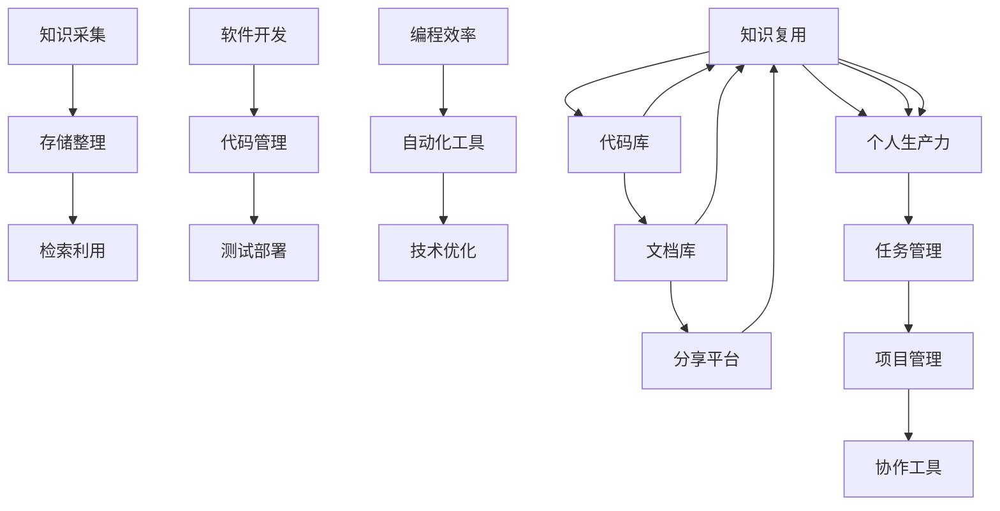

                 

# 打造个人知识管理系统:程序员实战指南

> 关键词：知识管理, 软件开发, 编程效率, 知识复用, 个人生产力

## 1. 背景介绍

在信息爆炸的互联网时代，程序员面临的是一个快速变化、高度复杂的知识体系。面对不断更新的编程语言、框架、工具和技术，如何高效地学习和掌握这些知识，是每一个程序员都必须面对的挑战。同时，由于代码的日积月累，如何系统地存储、管理和检索代码和文档，也成为了程序员日常工作中的一项重要任务。为此，构建一个有效的个人知识管理系统，对于提升编程效率、加速知识复用和提升个人生产力，具有重要的意义。

## 2. 核心概念与联系

### 2.1 核心概念概述

本文聚焦于个人知识管理系统的构建与实践，将围绕以下几个核心概念展开：

- **知识管理(Knowledge Management)**：通过对知识的采集、存储、整理和检索，提升个人或团队的学习效率和生产力。

- **软件开发(Development)**：包括软件设计、编码、测试、部署等全生命周期管理。

- **编程效率(Programming Efficiency)**：通过自动化、工具、技术优化等手段，提升软件开发和维护的效率。

- **知识复用(Knowledge Reuse)**：通过代码库、文档库、分享平台等方式，实现代码和文档的快速检索和重用。

- **个人生产力(Personal Productivity)**：通过构建个人知识管理系统，提升工作和学习效率，使开发者能够专注于更有价值的任务。

### 2.2 核心概念原理和架构的 Mermaid 流程图



该流程图展示了知识管理系统的核心架构和工作流程：

1. **知识采集**：通过阅读、编程、学习等多种方式，收集知识。
2. **存储整理**：将采集到的知识进行分类、标记、存储。
3. **检索利用**：根据需要快速检索和重用知识。
4. **软件开发**：包括设计、编码、测试、部署等环节。
5. **代码管理**：实现代码的版本控制、静态检查、代码重构等。
6. **测试部署**：通过自动化测试、持续集成等方式，提高软件交付的效率和质量。
7. **编程效率**：通过自动化、代码重构、工具优化等方式，提高编程效率。
8. **知识复用**：通过代码库、文档库、分享平台等实现知识复用。
9. **个人生产力**：通过任务管理、项目管理、协作工具等方式，提升工作效率。

这些概念之间的联系和相互作用，共同构成了个人知识管理系统的核心架构和工作流程。

## 3. 核心算法原理 & 具体操作步骤

### 3.1 算法原理概述

个人知识管理系统的核心算法原理主要基于以下两点：

- **信息检索和知识图谱**：构建知识图谱，将知识进行分类、关联，使得信息检索更加高效。
- **机器学习和知识推荐**：通过机器学习算法，对用户的行为和偏好进行建模，推荐个性化的知识资源。

### 3.2 算法步骤详解

个人知识管理系统的构建，可以大致分为以下几个步骤：

1. **需求分析**：明确个人或团队的知识管理需求，包括知识类型、存储方式、检索方式等。
2. **工具选择**：选择合适的知识管理系统工具，如Notion、Evernote、Confluence等。
3. **数据整理**：将现有知识进行整理、分类和存储，建立知识图谱。
4. **系统搭建**：根据需求和使用习惯，搭建知识管理系统。
5. **测试优化**：对系统进行测试，根据反馈不断优化。
6. **知识复用和更新**：定期更新知识库，实现知识的复用和共享。

### 3.3 算法优缺点

个人知识管理系统的优点包括：

- **系统化存储**：将知识系统地存储在集中化的系统中，便于管理和检索。
- **高效检索**：通过搜索、过滤等方式，快速找到需要的知识。
- **知识复用**：通过代码库、文档库、分享平台等方式，实现代码和文档的快速检索和重用。

缺点包括：

- **初始投入**：需要投入一定的时间和资源进行需求分析和系统搭建。
- **复杂度**：对于知识管理系统功能较多的系统，可能需要较多的维护和更新。
- **隐私保护**：知识管理系统的数据存储在云端，可能存在隐私泄露的风险。

### 3.4 算法应用领域

个人知识管理系统可以应用于以下几个领域：

- **软件开发**：实现代码库、文档库、测试库等管理。
- **技术学习**：存储学习笔记、编程经验、技术博客等。
- **项目协作**：集成项目管理工具，实现任务和文档的协作管理。
- **知识分享**：搭建内部或外部知识分享平台，促进知识传播和复用。

## 4. 数学模型和公式 & 详细讲解 & 举例说明

### 4.1 数学模型构建

个人知识管理系统的数学模型主要基于以下几个假设：

1. **知识图谱构建**：假设知识图谱是一个无向图 $G=(V,E)$，其中 $V$ 是知识节点集合，$E$ 是知识边集合。节点表示知识片段，边表示知识之间的关系。

2. **知识推荐算法**：假设用户 $u$ 的知识兴趣可以用向量 $v_u$ 表示，知识 $k$ 的向量表示为 $v_k$。推荐算法 $P$ 可以根据用户和知识的向量，计算推荐分数 $score(u,k)$。

### 4.2 公式推导过程

1. **知识图谱构建**：知识图谱的构建可以通过RDF、GraphDB等方式实现。具体过程包括：

   - 提取知识节点：通过爬虫、导入等方式，从文本、代码、论文等源中提取知识节点。
   - 建立知识边：通过自然语言处理(NLP)、实体识别等方式，建立知识节点之间的关系。
   - 存储知识图谱：将构建好的知识图谱存储在数据库中，便于查询和更新。

2. **知识推荐算法**：常见的知识推荐算法包括基于协同过滤、基于内容的推荐、基于深度学习的推荐等。以下以基于深度学习的推荐算法为例，推导其公式：

   - **协同过滤推荐**：假设用户 $u$ 对知识 $k_1, k_2, ..., k_m$ 的评分向量为 $v_{u,k_i}$，知识 $k_j$ 的评分向量为 $v_{k_j,k_i}$，协同过滤推荐算法可以表示为：
   
     \[
     score(u,k_j) = \frac{\sum_{i=1}^m v_{u,k_i}v_{k_j,k_i}}{\sqrt{\sum_{i=1}^m v_{k_j,k_i}^2}}
     \]

   - **基于内容的推荐**：假设知识 $k$ 的向量表示为 $v_k = (w_{k,1}, w_{k,2}, ..., w_{k,n})$，用户 $u$ 的向量表示为 $v_u = (w_{u,1}, w_{u,2}, ..., w_{u,n})$，基于内容的推荐算法可以表示为：

     \[
     score(u,k) = \sum_{i=1}^n w_{u,i}w_{k,i}
     \]

   - **基于深度学习的推荐**：假设用户和知识的向量表示为 $v_u$ 和 $v_k$，推荐算法 $P$ 可以通过多层感知机(MLP)、神经网络等深度学习模型进行计算。推荐公式可以表示为：

     \[
     score(u,k) = v_u^T W v_k
     \]

   其中 $W$ 为模型参数，通过训练得到。

### 4.3 案例分析与讲解

以Github代码管理为例，分析其如何利用知识管理技术提升编程效率。

1. **知识采集**：开发者可以通过GitHub直接将代码提交到仓库，通过版本控制历史记录和管理代码变更。

2. **存储整理**：代码被存储在Git仓库中，可以根据项目、文件、提交等维度进行分类和管理。

3. **检索利用**：通过GitHub的搜索功能，开发者可以快速查找代码库中的历史提交、问题和评论，进行代码复用和共享。

4. **代码管理**：GitHub实现了版本控制、代码审查、静态检查等功能，支持代码的提交、合并和回退。

5. **知识复用**：开发者可以通过GitHub的代码库进行代码重用，也可以分享自己的代码片段和库，促进社区交流和协作。

## 5. 项目实践：代码实例和详细解释说明

### 5.1 开发环境搭建

本节将详细介绍如何在本地搭建一个个人知识管理系统的开发环境。

1. **安装Python**：
   - 从官网下载安装包，运行安装程序。
   - 配置环境变量，将Python可执行文件添加到系统路径。

2. **安装开发工具**：
   - 安装PyCharm、Visual Studio Code等IDE。
   - 安装Python开发库，如Flask、Django等。

3. **安装数据库**：
   - 安装MySQL、PostgreSQL等关系型数据库，或MongoDB等非关系型数据库。

4. **搭建Web服务器**：
   - 使用Flask、Django等框架搭建Web服务器，提供知识管理系统的API接口。
   - 安装Apache、Nginx等Web服务器，配置反向代理和负载均衡。

### 5.2 源代码详细实现

以下是一个简单的知识管理系统，包括知识分类、搜索、上传、下载等功能：

1. **知识分类模块**：

   ```python
   from flask import Flask, render_template, request
   
   app = Flask(__name__)
   
   @app.route('/')
   def index():
       return render_template('index.html')
   
   @app.route('/classify', methods=['POST'])
   def classify():
       category = request.form['category']
       return 'Category: {}'.format(category)
   ```

2. **搜索模块**：

   ```python
   @app.route('/search', methods=['GET'])
   def search():
       search_term = request.args.get('term')
       return 'Search term: {}'.format(search_term)
   ```

3. **上传模块**：

   ```python
   @app.route('/upload', methods=['POST'])
   def upload():
       file = request.files['file']
       return 'File uploaded: {}'.format(file.filename)
   ```

4. **下载模块**：

   ```python
   @app.route('/download', methods=['GET'])
   def download():
       filename = request.args.get('filename')
       return 'File downloaded: {}'.format(filename)
   ```

### 5.3 代码解读与分析

通过上述代码，可以看出知识管理系统的基本架构：

- **路由**：通过Flask的路由功能，将不同的请求映射到对应的处理函数。
- **模板**：使用HTML模板引擎渲染页面，显示系统状态和功能。
- **表单**：通过HTML表单，收集用户输入，进行知识分类、搜索、上传、下载等操作。

该系统虽然功能简单，但能够满足基本的知识管理需求。开发者可以根据实际需求，进一步扩展系统的功能，如添加知识推荐、权限控制、数据备份等。

### 5.4 运行结果展示

运行上述代码，可以在本地启动Web服务器，通过浏览器访问系统页面，进行知识分类、搜索、上传、下载等操作。例如：

- 在浏览器中输入 `http://localhost:5000/classify`，可以提交分类请求。
- 在浏览器中输入 `http://localhost:5000/search`，可以搜索知识库。
- 在浏览器中输入 `http://localhost:5000/upload`，可以上传文件。
- 在浏览器中输入 `http://localhost:5000/download`，可以下载文件。

## 6. 实际应用场景

### 6.1 软件开发

软件开发是个人知识管理系统应用最广泛的场景之一。通过代码库、文档库、测试库等，可以系统地管理开发过程中的代码、文档和测试用例，提升开发效率和代码质量。

以GitHub为例，其核心功能包括：

- **代码管理**：支持Git版本控制，提供代码提交、合并、回退等操作。
- **文档管理**：支持Markdown文档格式，提供代码注释、API文档等功能。
- **测试管理**：支持持续集成、持续部署(CI/CD)，提供自动化测试和部署功能。
- **协作管理**：提供Pull Request、Issue跟踪、评论等功能，促进团队协作和代码审查。

### 6.2 技术学习

技术学习也是个人知识管理系统的常见应用场景。通过学习笔记、编程经验、技术博客等知识资源的存储和检索，可以快速获取所需知识，提升学习效率。

以Notion为例，其核心功能包括：

- **笔记管理**：支持创建笔记、添加标签、添加附件等功能，记录学习笔记和编程经验。
- **知识图谱**：支持构建知识图谱，将知识进行分类、关联，便于知识检索和重用。
- **模板管理**：提供多种模板，支持快速创建笔记和文档。
- **协作管理**：支持多人协作，共享笔记和知识库。

### 6.3 项目协作

项目协作也是个人知识管理系统的应用场景之一。通过任务管理、文档管理、协作工具等功能，可以实现项目的高效管理和协作。

以Confluence为例，其核心功能包括：

- **页面管理**：支持创建和编辑页面，添加标签、附件等功能，记录项目进展和文档。
- **知识图谱**：支持构建知识图谱，将知识进行分类、关联，便于知识检索和重用。
- **权限管理**：支持设置用户和组的权限，确保项目文档和代码的安全性。
- **协作工具**：提供评论、任务管理、代码审查等功能，促进团队协作和项目进展。

### 6.4 未来应用展望

未来，个人知识管理系统将呈现以下几个发展趋势：

1. **智能化推荐**：通过机器学习算法，实现智能化的知识推荐，提高知识发现和利用效率。
2. **多模态融合**：实现文本、图片、视频等多模态数据的融合，丰富知识表示形式。
3. **自动化生成**：利用自然语言生成(NLG)技术，自动生成文档和代码，提高生产效率。
4. **区块链技术**：通过区块链技术，实现知识版权保护和数据隐私保护。
5. **云原生架构**：利用云原生技术，实现知识系统的高度可扩展和弹性伸缩。

## 7. 工具和资源推荐

### 7.1 学习资源推荐

为帮助开发者系统掌握个人知识管理系统的理论和实践，这里推荐以下学习资源：

1. **《Effective Knowledge Management》**：由国际知名专家编写，涵盖知识管理的基础理论和实践方法。
2. **《Programming for Software Engineers》**：介绍软件开发的全生命周期管理，涵盖代码库、文档库、测试库等管理方法。
3. **《Knowledge Graphs in Action》**：介绍知识图谱的构建和应用，涵盖知识检索、推荐等技术。
4. **《Python Web Development with Flask》**：介绍如何使用Flask搭建Web服务器，实现知识管理系统的API接口。
5. **《GitHub Handbook》**：详细介绍GitHub的使用方法和最佳实践，涵盖代码库、文档库、测试库等功能。

### 7.2 开发工具推荐

为帮助开发者高效开发个人知识管理系统，这里推荐以下开发工具：

1. **PyCharm**：一款功能强大的IDE，支持Python、Flask等开发环境。
2. **Visual Studio Code**：一款轻量级的IDE，支持多种编程语言和开发工具。
3. **Git**：版本控制系统，支持代码库的管理和版本控制。
4. **Django**：Web框架，支持快速搭建Web服务器和API接口。
5. **Flask**：轻量级的Web框架，支持快速搭建API接口和Web应用。
6. **MySQL**：关系型数据库，支持知识库的数据存储和管理。

### 7.3 相关论文推荐

为帮助开发者深入理解个人知识管理系统的前沿技术，这里推荐以下相关论文：

1. **Knowledge Graphs: Concepts, Approaches, and Applications**：由国际知名专家编写，涵盖知识图谱的概念、方法和应用。
2. **Machine Learning in Knowledge Discovery**：介绍机器学习在知识发现中的应用，涵盖推荐算法、数据挖掘等技术。
3. **Web Applications for Knowledge Management**：介绍Web应用在知识管理中的应用，涵盖API接口、Web服务等功能。
4. **Blockchain for Knowledge Management**：介绍区块链技术在知识管理中的应用，涵盖版权保护、数据隐私等技术。
5. **Cloud Native Knowledge Management Systems**：介绍云原生技术在知识管理中的应用，涵盖弹性伸缩、分布式存储等功能。

## 8. 总结：未来发展趋势与挑战

### 8.1 研究成果总结

本文系统介绍了个人知识管理系统的构建与实践，通过需求分析、工具选择、数据整理、系统搭建、测试优化等步骤，详细讲解了知识管理系统的构建流程。同时，通过GitHub、Notion、Confluence等实例，展示了知识管理系统的实际应用效果。

### 8.2 未来发展趋势

未来，个人知识管理系统将呈现以下几个发展趋势：

1. **智能化推荐**：通过机器学习算法，实现智能化的知识推荐，提高知识发现和利用效率。
2. **多模态融合**：实现文本、图片、视频等多模态数据的融合，丰富知识表示形式。
3. **自动化生成**：利用自然语言生成(NLG)技术，自动生成文档和代码，提高生产效率。
4. **区块链技术**：通过区块链技术，实现知识版权保护和数据隐私保护。
5. **云原生架构**：利用云原生技术，实现知识系统的高度可扩展和弹性伸缩。

### 8.3 面临的挑战

尽管个人知识管理系统已经取得了一定的进展，但仍面临以下几个挑战：

1. **数据隐私**：知识管理系统需要处理大量用户数据，如何保护用户隐私是一个重要问题。
2. **系统复杂度**：知识管理系统的功能丰富，如何设计简单易用的界面和操作流程，是一个重要挑战。
3. **标准化**：不同知识管理系统之间的数据格式和API接口不一致，如何实现系统之间的互操作，是一个重要问题。
4. **可扩展性**：知识管理系统需要处理大规模的数据和复杂的操作，如何设计可扩展的架构，是一个重要挑战。
5. **安全性和可靠性**：知识管理系统需要保证系统的稳定性和安全性，如何设计高效的数据备份和恢复机制，是一个重要问题。

### 8.4 研究展望

面对知识管理系统的挑战，未来的研究需要在以下几个方面寻求新的突破：

1. **数据隐私保护**：研究数据加密、隐私保护等技术，保障用户数据的安全性。
2. **系统标准化**：研究标准化数据格式和API接口，实现系统之间的互操作。
3. **智能化推荐**：研究推荐算法和知识图谱技术，提高知识推荐的智能化水平。
4. **多模态融合**：研究多模态数据的融合和表示，丰富知识表示形式。
5. **云原生架构**：研究云原生技术，实现知识系统的高度可扩展和弹性伸缩。

本文从理论到实践，系统介绍了个人知识管理系统的构建与实践，希望为开发者提供全面的技术指引，加速知识管理系统的开发和应用。只有不断创新、持续优化，才能真正实现个人知识管理系统的智能化和高效化，提升开发者的编程效率和知识复用能力。

---

作者：禅与计算机程序设计艺术 / Zen and the Art of Computer Programming

