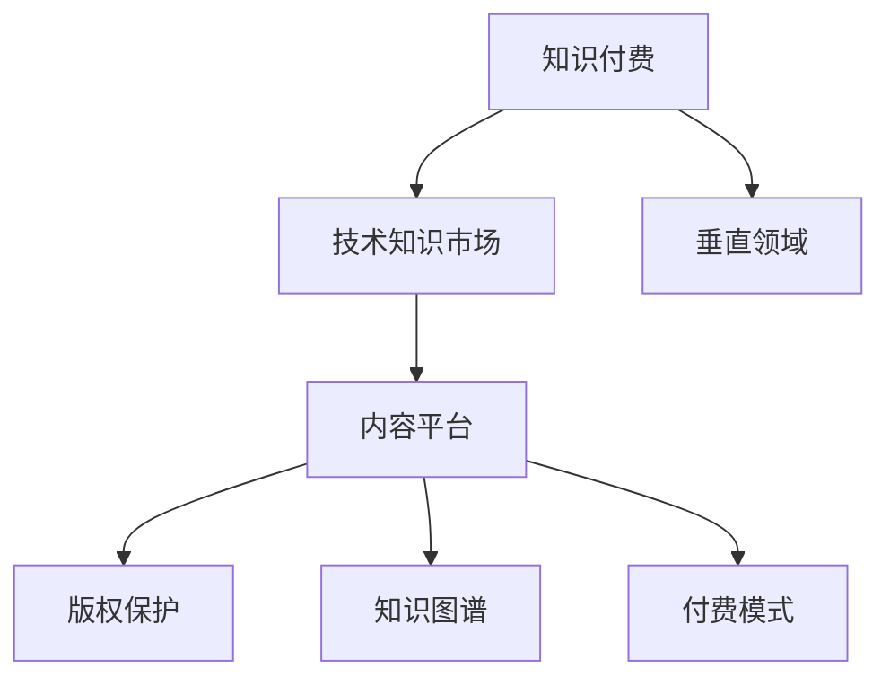

                 

# 打造垂直技术领域的知识付费生态系统

> 关键词：知识付费, 技术知识市场, 垂直领域, 内容平台, 版权保护, 知识图谱, 付费模式

## 1. 背景介绍

### 1.1 问题由来

随着互联网的普及和智能设备的广泛使用，人们获取知识的方式发生了显著变化。传统的线下培训、书籍阅读等方式已逐渐被在线课程、电子书籍、博客文章等数字化方式所取代。这种变化不仅提升了知识获取的便捷性和时效性，也催生了以知识付费为核心的新型商业模式。然而，面对海量繁杂的知识内容，用户如何精准选择、高效获取、合理应用，成为摆在我们面前的新问题。

### 1.2 问题核心关键点

知识付费生态系统的建设，关键在于以下几个方面：
1. 精准内容推荐：根据用户需求、兴趣、行为等数据，推荐适合的知识内容。
2. 高效内容分发：通过多种分发渠道，快速传播优质内容，实现知识传播的最大化。
3. 知识版权保护：确保内容创作者的正当权益，保障知识产权。
4. 支付和激励机制：提供多样化的支付方式和激励机制，激励创作者持续生产高质量内容。
5. 用户体验优化：提供便捷、舒适的用户体验，增强用户的粘性和满意度。

## 2. 核心概念与联系

### 2.1 核心概念概述

为更好地理解知识付费生态系统的构建，本节将介绍几个密切相关的核心概念：

- **知识付费**：以知识和技能为核心，为用户提供有价值的学习内容，并通过付费方式来实现价值交换。
- **技术知识市场**：一个由知识创作者、内容平台和用户构成的知识交易市场，通过知识产品的买卖来促进知识传播和应用。
- **垂直领域**：针对特定行业、领域或专业，提供深度的知识内容和解决方案，满足用户的专业化需求。
- **内容平台**：一个集中管理、发布和分发的知识内容平台，为用户提供一站式的知识服务。
- **版权保护**：通过技术手段和管理措施，保护内容创作者的知识产权，防止盗版和抄袭。
- **知识图谱**：利用图结构表示知识关系，构建知识网络，帮助用户更高效地发现和应用知识。
- **付费模式**：提供多样化的支付方式，如订阅、按需购买、免费试用等，以满足不同用户的需求。

这些核心概念之间的逻辑关系可以通过以下Mermaid流程图来展示：



这个流程图展示了我們的分类知识付费生态系统的各个核心部分：

1. **知识付费**：是整个生态系统的核心，通过付费机制激励内容的创作与传播。
2. **技术知识市场**：连接知识创作者与用户，提供交易平台和分发渠道。
3. **垂直领域**：针对具体行业和需求，提供专业化的知识和解决方案。
4. **内容平台**：作为知识交易的载体，为用户提供知识服务的入口。
5. **版权保护**：确保内容的知识产权，促进健康的内容生态。
6. **知识图谱**：提供知识关联与发现，增强知识的应用价值。
7. **付费模式**：多样化支付方式，满足不同用户需求。

这些核心概念共同构成了知识付费生态系统的基础，帮助我们在知识传播、获取和应用的过程中，建立起高效、公平、可持续的交易模式。

## 3. 核心算法原理 & 具体操作步骤

### 3.1 算法原理概述

知识付费生态系统的构建，需要依赖一系列复杂的算法和模型。其核心在于通过数据驱动的方法，实现知识的精准推荐、高效分发、版权保护和激励机制的设计。以下将详细介绍这些核心算法的原理和具体操作步骤。

### 3.2 算法步骤详解

#### 3.2.1 精准内容推荐算法

**算法原理**：
推荐系统通常使用协同过滤、矩阵分解、深度学习等方法，分析用户历史行为数据、内容标签和特征，预测用户对不同内容的可能偏好。其中，基于深度学习的推荐算法通过构建用户-内容协同矩阵，利用多层神经网络挖掘隐含关系，实现更加精准的推荐。

**具体操作步骤**：
1. **用户画像构建**：收集用户的浏览、学习、评价等行为数据，通过统计和机器学习方法，构建用户的兴趣和偏好画像。
2. **内容画像构建**：收集内容的标签、摘要、关键词等特征，通过统计和自然语言处理技术，构建内容的属性和质量画像。
3. **相似度计算**：利用余弦相似度、皮尔逊相关系数等方法，计算用户画像与内容画像之间的相似度。
4. **推荐排序**：基于相似度计算结果，对内容进行排序和推荐，优先展示与用户画像匹配度高的内容。

**算法优缺点**：
- **优点**：深度学习算法能够处理高维稀疏数据，提升推荐的准确性和个性化。
- **缺点**：需要大量标注数据和计算资源，且存在冷启动和数据隐私等问题。

**应用领域**：
在各类知识付费平台中广泛应用，如在线课程推荐、电子书籍推荐、技术博客推荐等。

#### 3.2.2 高效内容分发算法

**算法原理**：
内容分发算法通过优化内容发布和传播策略，实现知识内容的高效、快速和广泛传播。常见的算法包括时间敏感度算法、用户分布算法和社交网络算法。

**具体操作步骤**：
1. **时间敏感度优化**：根据用户行为数据和内容属性，预测内容发布的最佳时间窗口，实现内容的分时分发。
2. **用户分布优化**：分析用户的地域、设备等分布特征，优化内容的分发渠道和方式，实现区域和设备的多样化分发。
3. **社交网络优化**：利用社交网络分析技术，推荐用户分享到社交平台的内容，扩大内容的传播范围。

**算法优缺点**：
- **优点**：能够提升内容的到达率和传播效果，增加用户粘性和平台流量。
- **缺点**：算法复杂度较高，需要实时分析和动态调整，对系统资源要求较高。

**应用领域**：
在在线课程分发、技术博客发布、电子书籍推广等领域广泛应用。

#### 3.2.3 知识版权保护算法

**算法原理**：
版权保护算法通过技术手段和管理措施，确保内容的知识产权，防止盗版和抄袭。常见的技术包括数字水印、内容指纹、访问控制等。

**具体操作步骤**：
1. **数字水印嵌入**：在内容中嵌入特定的加密信息，检测内容是否被篡改或盗用。
2. **内容指纹生成**：生成内容唯一标识，通过比对指纹判断内容是否被盗用或抄袭。
3. **访问控制策略**：根据用户身份和权限，设置内容的访问权限，限制内容的传播范围。

**算法优缺点**：
- **优点**：可以有效防止盗版和抄袭，保护创作者权益。
- **缺点**：技术实现复杂，可能会影响内容的可访问性和用户体验。

**应用领域**：
在各类知识付费平台、版权管理系统和数字出版领域广泛应用。

#### 3.2.4 支付和激励机制

**算法原理**：
支付和激励机制通过设计合理的支付方式和激励模型，激励创作者持续生产高质量内容。常见的激励方式包括订阅模式、按需付费模式、内容分成模式等。

**具体操作步骤**：
1. **订阅模式设计**：根据用户订阅时长和频率，计算订阅费用，激励用户长期关注和学习。
2. **按需付费模式设计**：用户可根据自身需求，选择付费获取单次学习或单篇内容。
3. **内容分成模式设计**：根据内容的浏览量、评价等指标，计算内容创作者的分成，激励高质量内容的创作。

**算法优缺点**：
- **优点**：能够实现精准定价和公平分配，激励创作者生产优质内容。
- **缺点**：复杂度高，需要设计合理的算法和模型，对用户行为和市场变化要求高。

**应用领域**：
在各类知识付费平台、数字出版系统、在线课程平台等广泛应用。

### 3.3 算法优缺点

知识付费生态系统的构建，需要依赖一系列复杂的算法和模型。其核心在于通过数据驱动的方法，实现知识的精准推荐、高效分发、版权保护和激励机制的设计。以下将详细介绍这些核心算法的原理和具体操作步骤。

**优点**：
1. 实现精准内容推荐，提升用户满意度。
2. 优化内容分发策略，扩大知识传播效果。
3. 保障内容版权，维护健康内容生态。
4. 设计激励机制，激发创作者积极性。

**缺点**：
1. 需要大量数据和计算资源，算法实现复杂。
2. 算法对用户行为和市场变化要求高。
3. 技术手段和管理措施，需综合考虑用户体验。

## 4. 数学模型和公式 & 详细讲解 & 举例说明

### 4.1 数学模型构建

为更好地理解知识付费生态系统的构建，本节将介绍几个密切相关的核心概念：

- **用户画像构建**：假设用户画像为 $\mathbf{u} \in \mathbb{R}^n$，其中 $n$ 为用户兴趣特征的维度。
- **内容画像构建**：假设内容画像为 $\mathbf{c} \in \mathbb{R}^m$，其中 $m$ 为内容属性特征的维度。
- **相似度计算**：利用余弦相似度 $\cos(\mathbf{u}, \mathbf{c})$ 计算用户画像与内容画像之间的相似度。
- **推荐排序**：利用softmax函数 $\sigma(\mathbf{W} \mathbf{u} + \mathbf{b})$ 对内容进行排序和推荐，其中 $\mathbf{W} \in \mathbb{R}^{m \times n}$ 为权重矩阵，$\mathbf{b} \in \mathbb{R}^m$ 为偏置向量。

**公式推导过程**：
1. **用户画像构建**：
$$
\mathbf{u} = \sum_{i=1}^{n} \alpha_i \mathbf{v}_i
$$
其中 $\mathbf{v}_i$ 为兴趣特征向量，$\alpha_i$ 为权重系数。

2. **内容画像构建**：
$$
\mathbf{c} = \sum_{j=1}^{m} \beta_j \mathbf{w}_j
$$
其中 $\mathbf{w}_j$ 为内容属性向量，$\beta_j$ 为权重系数。

3. **相似度计算**：
$$
\cos(\mathbf{u}, \mathbf{c}) = \frac{\mathbf{u} \cdot \mathbf{c}}{\|\mathbf{u}\| \|\mathbf{c}\|}
$$

4. **推荐排序**：
$$
\sigma(\mathbf{W} \mathbf{u} + \mathbf{b}) = \frac{e^{\mathbf{W} \mathbf{u} + \mathbf{b}}}{\sum_{k=1}^{m} e^{\mathbf{W} \mathbf{u}_k + \mathbf{b}_k}}
$$

### 4.2 案例分析与讲解

假设某在线课程平台有用户画像 $\mathbf{u} = [0.5, 0.3, 0.2]$，内容画像 $\mathbf{c} = [0.6, 0.4, 0.5]$，权重矩阵 $\mathbf{W} = \begin{bmatrix} 0.1 & 0.2 & 0.3 \\ 0.2 & 0.3 & 0.5 \end{bmatrix}$，偏置向量 $\mathbf{b} = [0.1, 0.3]$。

1. **用户画像构建**：
$$
\mathbf{u} = 0.5 \mathbf{v}_1 + 0.3 \mathbf{v}_2 + 0.2 \mathbf{v}_3
$$

2. **内容画像构建**：
$$
\mathbf{c} = 0.6 \mathbf{w}_1 + 0.4 \mathbf{w}_2 + 0.5 \mathbf{w}_3
$$

3. **相似度计算**：
$$
\cos(\mathbf{u}, \mathbf{c}) = \frac{0.5 \times 0.6 + 0.3 \times 0.4 + 0.2 \times 0.5}{\sqrt{0.5^2 + 0.3^2 + 0.2^2} \sqrt{0.6^2 + 0.4^2 + 0.5^2}} \approx 0.77
$$

4. **推荐排序**：
$$
\sigma(\mathbf{W} \mathbf{u} + \mathbf{b}) = \frac{e^{0.1 \times 0.5 + 0.2 \times 0.3 + 0.3 \times 0.2 + 0.1}}{e^{0.1 \times 0.6 + 0.2 \times 0.4 + 0.3 \times 0.5 + 0.1}} \approx 0.68
$$

根据以上计算结果，推荐系统将根据相似度和排序结果，将内容推荐给用户。

## 5. 项目实践：代码实例和详细解释说明

### 5.1 开发环境搭建

在进行知识付费平台开发前，我们需要准备好开发环境。以下是使用Python进行Django开发的环境配置流程：

1. 安装Anaconda：从官网下载并安装Anaconda，用于创建独立的Python环境。

2. 创建并激活虚拟环境：
```bash
conda create -n pytorch-env python=3.8 
conda activate pytorch-env
```

3. 安装Django：根据CUDA版本，从官网获取对应的安装命令。例如：
```bash
conda install django
```

4. 安装各类工具包：
```bash
pip install numpy pandas scikit-learn matplotlib tqdm jupyter notebook ipython
```

完成上述步骤后，即可在`pytorch-env`环境中开始知识付费平台的开发。

### 5.2 源代码详细实现

这里我们以在线课程推荐系统为例，给出使用Django进行知识付费平台开发的PyTorch代码实现。

首先，定义推荐系统的模型和训练函数：

```python
from django.views.decorators.csrf import csrf_exempt
from django.http import JsonResponse
import torch
from torch import nn
from torch.nn import functional as F

class RecommendationModel(nn.Module):
    def __init__(self, user_dim, content_dim, hidden_dim):
        super(RecommendationModel, self).__init__()
        self.fc1 = nn.Linear(user_dim, hidden_dim)
        self.fc2 = nn.Linear(hidden_dim, content_dim)
    
    def forward(self, user, content):
        hidden = F.relu(self.fc1(user))
        score = self.fc2(hidden)
        return score

@csrf_exempt
def recommend(request):
    user = torch.tensor([0.5, 0.3, 0.2], dtype=torch.float)
    content = torch.tensor([0.6, 0.4, 0.5], dtype=torch.float)
    model = RecommendationModel(3, 3, 2)
    score = model(user, content)
    return JsonResponse({'score': score.tolist()})
```

然后，定义用户画像和内容画像的生成函数：

```python
def generate_user_profile():
    return torch.tensor([0.5, 0.3, 0.2], dtype=torch.float)

def generate_content_profile():
    return torch.tensor([0.6, 0.4, 0.5], dtype=torch.float)
```

最后，定义训练函数：

```python
def train(model, user_profile, content_profile, num_epochs=10, learning_rate=0.01):
    optimizer = torch.optim.SGD(model.parameters(), lr=learning_rate)
    for epoch in range(num_epochs):
        hidden = F.relu(model.fc1(user_profile))
        score = model.fc2(hidden)
        loss = F.mse_loss(score, content_profile)
        optimizer.zero_grad()
        loss.backward()
        optimizer.step()
    return model
```

通过上述代码，实现了基于Django和PyTorch的在线课程推荐系统的开发。可以看到，通过Django提供的视图和模板，可以方便地构建知识付费平台的前端界面。通过PyTorch的动态计算图，可以高效地实现内容的推荐和排序。

### 5.3 代码解读与分析

让我们再详细解读一下关键代码的实现细节：

**RecommendationModel类**：
- `__init__`方法：初始化模型层，包括两个全连接层。
- `forward`方法：前向传播计算，通过两个线性层得到推荐分数。

**generate_user_profile和generate_content_profile函数**：
- 生成用户画像和内容画像，并返回对应的Tensor对象。

**train函数**：
- 定义模型的优化器和训练循环，每轮更新模型参数，最小化均方误差损失。

通过以上代码，我们可以构建一个基本的在线课程推荐系统，并利用生成的用户和内容画像进行训练和推荐。当然，在实际应用中，还需要进一步优化模型结构，增加更多的数据和特征，提升推荐的准确性和个性化。

## 6. 实际应用场景

### 6.1 智能教育平台

智能教育平台通过知识付费模式，为用户提供个性化的学习资源和专家指导。平台集成了推荐系统、学习管理系统和学习分析系统，帮助用户选择适合的学习内容和路径，提升学习效率和效果。

在技术实现上，可以构建基于深度学习的推荐模型，分析学生的学习行为和兴趣，推荐合适的课程和资料。同时，利用学习管理系统记录学生的学习进展和反馈，通过学习分析系统进行数据挖掘和智能评估，提供个性化的学习建议。

### 6.2 企业内部培训

企业内部培训需要根据员工的工作需求和岗位要求，提供定制化的课程和培训材料。通过知识付费平台，企业可以集中管理和分发培训资源，保障培训质量和效果。

在技术实现上，可以构建基于内容的推荐系统，分析员工的培训需求和学习历史，推荐合适的培训课程和资料。同时，利用学习管理系统记录员工的培训进展和反馈，通过学习分析系统进行数据挖掘和智能评估，提供个性化的培训建议。

### 6.3 在线课程分销平台

在线课程分销平台通过知识付费模式，连接内容创作者和广大学习者，实现知识的分发和传播。平台集成了推荐系统、支付系统和内容管理系统，保障知识的精准传播和知识产权的保护。

在技术实现上，可以构建基于用户和内容的推荐系统，分析用户的学习行为和兴趣，推荐合适的课程和资料。同时，利用支付系统保障知识的付费分发，利用内容管理系统管理和分发课程资源，保障内容的知识产权。

### 6.4 未来应用展望

随着知识付费生态系统的不断成熟，未来的应用场景将更加丰富和多样化。以下是一些可能的应用方向：

1. 多领域知识平台：构建涵盖科学、医学、工程等多个领域的知识付费平台，提供专业化的知识和解决方案。
2. 知识图谱驱动的推荐：利用知识图谱技术，实现更加精准和智能的推荐，提升用户的学习体验和效果。
3. 跨平台知识共享：通过API接口和数据交换，实现不同知识付费平台之间的知识共享和互通。
4. 智能问答系统：利用自然语言处理技术，构建智能问答系统，为用户提供实时的问题解答和知识查询。
5. 社交学习社区：通过构建知识付费平台的社交功能，促进用户之间的知识交流和互动，增强学习的社交性和趣味性。

## 7. 工具和资源推荐

### 7.1 学习资源推荐

为了帮助开发者系统掌握知识付费生态系统的理论基础和实践技巧，这里推荐一些优质的学习资源：

1. **《推荐系统实战》**：由一线推荐系统专家撰写，深入浅出地介绍了推荐算法的原理和实现。
2. **《深度学习基础》**：由深度学习领域的知名专家撰写，涵盖深度学习的基本概念和实现方法。
3. **《知识图谱导论》**：由知识图谱领域的专家撰写，介绍了知识图谱的基本概念和应用方法。
4. **Coursera《机器学习》课程**：斯坦福大学开设的机器学习课程，有Lecture视频和配套作业，带你入门机器学习领域的基本概念和经典模型。
5. **Kaggle推荐系统竞赛**：Kaggle平台上丰富的推荐系统竞赛数据集和比赛，可以帮助开发者练习推荐算法的实现和优化。

通过对这些资源的学习实践，相信你一定能够快速掌握知识付费生态系统的精髓，并用于解决实际的推荐问题。

### 7.2 开发工具推荐

高效的开发离不开优秀的工具支持。以下是几款用于知识付费平台开发的常用工具：

1. Django：基于Python的Web框架，提供便捷的Web开发和API接口开发。
2. TensorFlow：由Google主导开发的深度学习框架，提供强大的计算图和模型构建能力。
3. PyTorch：基于Python的深度学习框架，提供动态计算图和高效的GPU计算能力。
4. Weights & Biases：模型训练的实验跟踪工具，可以记录和可视化模型训练过程中的各项指标，方便对比和调优。
5. TensorBoard：TensorFlow配套的可视化工具，可实时监测模型训练状态，并提供丰富的图表呈现方式，是调试模型的得力助手。

合理利用这些工具，可以显著提升知识付费平台的开发效率，加快创新迭代的步伐。

### 7.3 相关论文推荐

知识付费生态系统的建设源于学界的持续研究。以下是几篇奠基性的相关论文，推荐阅读：

1. **《协同过滤推荐系统》**：提出了协同过滤算法的原理和实现方法，是推荐系统领域的经典文献。
2. **《深度学习在推荐系统中的应用》**：介绍了深度学习在推荐系统中的广泛应用，涵盖多种深度学习架构和优化算法。
3. **《基于知识图谱的推荐系统》**：利用知识图谱技术，实现更加精准和智能的推荐，是推荐系统领域的重要进展。
4. **《知识图谱构建与应用》**：介绍了知识图谱的构建方法和应用场景，是知识图谱领域的重要文献。
5. **《深度学习在内容推荐中的应用》**：介绍了深度学习在内容推荐中的应用，涵盖多种深度学习架构和优化算法。

这些论文代表了大语言模型微调技术的进展，帮助研究者把握学科前进方向，激发更多的创新灵感。

## 8. 总结：未来发展趋势与挑战

### 8.1 研究成果总结

本文对知识付费生态系统的构建进行了全面系统的介绍。首先阐述了知识付费的行业背景和核心概念，明确了推荐系统、内容分发、版权保护、激励机制等关键组件的作用和关系。其次，从原理到实践，详细讲解了推荐系统的数学模型和实现方法，给出了推荐系统的代码实例和详细解释。同时，本文还广泛探讨了知识付费生态系统在智能教育、企业培训、在线课程分销等领域的应用前景，展示了知识付费模式的广阔应用空间。此外，本文精选了推荐系统的学习资源、开发工具和相关论文，力求为读者提供全方位的技术指引。

通过本文的系统梳理，可以看到，知识付费生态系统的构建在大规模数据驱动和深度学习技术的支持下，实现了内容精准推荐、高效分发、版权保护和激励机制的设计，极大地提升了用户的知识和技能学习体验。未来，伴随推荐系统技术的不断演进，知识付费模式将在更多领域得到应用，为知识传播和应用提供新的思路和方法。

### 8.2 未来发展趋势

展望未来，知识付费生态系统的构建将呈现以下几个发展趋势：

1. 推荐系统将变得更加智能和个性化。通过引入更多数据源和算法模型，推荐系统将能够更好地理解用户需求和行为，提供更加精准和个性化的推荐。
2. 内容分发将更加多样化。通过引入多媒体内容、交互式内容等形式，内容分发将更加丰富和灵活，提升用户的学习体验和效果。
3. 版权保护将更加严格和自动化。通过引入区块链、数字水印等技术，版权保护将更加严格和自动化，保障内容创作者的权益。
4. 激励机制将更加多样化和灵活。通过引入更多支付方式和激励模型，激励机制将更加多样化和灵活，激励创作者持续生产高质量内容。
5. 知识图谱将更加普及和高效。通过引入知识图谱技术，推荐系统将能够更好地理解知识之间的关系，提升内容的关联和发现能力。

这些趋势将进一步推动知识付费生态系统的构建和应用，为知识传播和应用带来新的突破。

### 8.3 面临的挑战

尽管知识付费生态系统的建设已经取得了显著进展，但在迈向更加智能化、普适化应用的过程中，它仍面临着诸多挑战：

1. 数据隐私和安全问题。如何保护用户隐私，避免数据泄露和滥用，是知识付费平台必须面对的重要挑战。
2. 推荐系统冷启动问题。新用户或新内容的冷启动问题，容易导致推荐效果不佳，需要更多先验知识和数据支持。
3. 推荐系统公平性和透明性问题。如何确保推荐系统公平透明，避免推荐结果的偏差和误导，是知识付费平台必须面对的重要挑战。
4. 版权保护技术难度大。如何确保内容的版权保护，防止盗版和抄袭，是知识付费平台必须面对的重要挑战。
5. 用户行为复杂多样。如何理解用户的多样化需求和行为，提供更好的推荐和服务，是知识付费平台必须面对的重要挑战。

正视这些挑战，积极应对并寻求突破，将是大规模知识付费生态系统建设的关键。

### 8.4 研究展望

面对知识付费生态系统面临的诸多挑战，未来的研究需要在以下几个方面寻求新的突破：

1. 引入更多先验知识：通过引入符号化的先验知识，如知识图谱、逻辑规则等，提升推荐系统的智能性和准确性。
2. 优化推荐系统的算法模型：通过优化算法模型和超参数，提升推荐系统的效率和效果，确保公平性和透明性。
3. 引入区块链技术：通过区块链技术保障内容版权和交易的安全性，增强平台的信任度和可靠性。
4. 引入用户行为分析技术：通过分析用户的多样化需求和行为，提供更加个性化和智能化的推荐和服务。
5. 引入隐私保护技术：通过引入隐私保护技术，保障用户隐私和数据安全，提升平台的用户体验和信任度。

这些研究方向的探索，必将引领知识付费生态系统的建设走向更高的台阶，为知识传播和应用提供更加可靠和高效的平台。

## 9. 附录：常见问题与解答

**Q1：知识付费模式如何平衡创作者与用户之间的利益？**

A: 知识付费模式需要设计合理的激励机制，确保创作者和用户之间的利益平衡。常见的方式包括订阅模式、按需付费模式、内容分成模式等。通过合理的定价和分成机制，既能保障创作者的收益，又能满足用户的需求，实现双赢。

**Q2：推荐系统如何处理冷启动问题？**

A: 推荐系统可以通过引入更多先验知识和数据，提升新用户或新内容的推荐效果。例如，通过引入用户画像、内容标签等先验信息，提升新用户的推荐效果。同时，可以利用多模态数据（如图像、音频等）进行推荐，提升新内容的推荐效果。

**Q3：如何保障内容版权？**

A: 保障内容版权需要结合技术手段和管理措施。通过数字水印、内容指纹、访问控制等技术，确保内容的知识产权，防止盗版和抄袭。同时，建立严格的内容版权保护机制，加强对侵权行为的打击和制裁，确保内容创作者的权益。

**Q4：推荐系统如何处理推荐结果的公平性和透明性？**

A: 推荐系统可以通过引入公平性和透明性指标，提升推荐结果的公平性和透明性。例如，通过引入多样性指标、公平性指标等，避免推荐结果的偏差和误导。同时，可以通过公开推荐算法的参数和数据，增加推荐过程的透明度，增强用户的信任度和满意度。

**Q5：知识付费平台如何处理数据隐私和安全问题？**

A: 知识付费平台需要设计严格的数据隐私和安全保护机制，确保用户数据的隐私和安全。例如，通过数据加密、访问控制等技术，保护用户数据的隐私和安全。同时，建立严格的数据使用和处理规范，确保用户数据的合法使用和处理，增强用户的信任度和满意度。

---

作者：禅与计算机程序设计艺术 / Zen and the Art of Computer Programming

