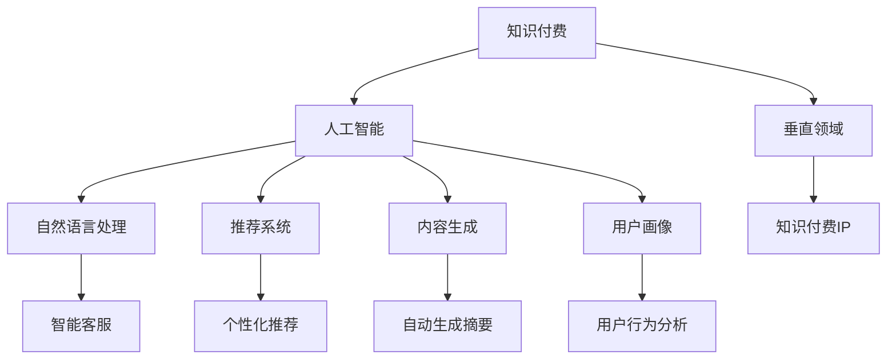

                 

# 打造垂直领域的知识付费IP

> 关键词：知识付费, 人工智能, 垂直领域, 自然语言处理, 推荐系统, 内容生成, 用户画像

## 1. 背景介绍

随着互联网和数字化技术的飞速发展，知识付费行业正在迎来前所未有的发展机遇。知识付费平台不仅为广大用户提供了获取专业知识和技能的机会，还为知识生产者提供了新的经济模式和职业发展空间。然而，如何构建具有竞争力和可持续性的知识付费IP，是当前知识付费平台面临的重要课题。

在大数据和人工智能技术的推动下，知识付费IP可以更加精准、高效地匹配用户需求和内容供给，提升用户满意度和平台黏性。本文将从人工智能的角度，探讨如何打造垂直领域的知识付费IP，为知识付费行业的发展提供新的思路和实践参考。

## 2. 核心概念与联系

### 2.1 核心概念概述

为了更好地理解打造垂直领域知识付费IP的过程，本节将介绍几个密切相关的核心概念：

- **知识付费**：指用户为获取特定知识和技能而付费的模式，包括订阅服务、单次购买、按需问答等多种形式。
- **人工智能**：指利用计算机技术模拟人类智能活动，包括感知、理解、推理、学习、问题求解、自然语言处理等。
- **垂直领域**：指特定行业或专业领域，如医疗、法律、教育、金融等。
- **自然语言处理(NLP)**：指使计算机能够理解、生成和处理人类语言的技术，是人工智能的重要分支。
- **推荐系统**：指通过分析用户行为数据，推荐相关内容的技术，广泛应用于电商、新闻、视频等多个领域。
- **内容生成**：指使用算法自动生成文本、图片、视频等内容的系统，如文本生成、图像生成、视频生成等。
- **用户画像**：指通过数据分析和建模，刻画用户特征和行为习惯的模型，用于精准营销和个性化推荐。

这些核心概念之间的逻辑关系可以通过以下Mermaid流程图来展示：



这个流程图展示了一系列核心概念及其之间的关系：

1. 知识付费是人工智能技术在垂直领域的典型应用，通过提供定制化的知识服务，提升用户价值。
2. 人工智能涵盖多个分支，包括自然语言处理、推荐系统、内容生成等，为知识付费提供技术支持。
3. 自然语言处理通过解析和生成文本，提升内容处理的智能化水平。
4. 推荐系统通过分析用户行为，精准推荐相关内容，提升用户满意度。
5. 内容生成通过自动生成文本、图片、视频等内容，降低内容生产成本。
6. 用户画像通过刻画用户特征，实现个性化推荐和精准营销。
7. 垂直领域知识付费IP是知识付费技术在特定行业的应用，结合AI技术，提供更优质、更具竞争力的知识服务。

这些概念共同构成了打造垂直领域知识付费IP的基础框架，帮助我们系统性地理解知识付费的AI技术实现过程。

## 3. 核心算法原理 & 具体操作步骤
### 3.1 算法原理概述

打造垂直领域知识付费IP的核心算法原理，主要涉及以下几个方面：

1. **内容推荐算法**：利用协同过滤、内容相似度、矩阵分解等算法，根据用户行为数据和内容特征，推荐相关知识内容。
2. **内容生成算法**：基于深度学习模型，如GPT、BERT等，生成高质量的文章、问答、视频等内容。
3. **用户画像建模**：通过聚类、分类等算法，对用户行为数据进行建模，刻画用户兴趣和行为特征。
4. **个性化推荐算法**：结合用户画像和内容推荐算法，实现个性化推荐，提升用户满意度。
5. **自然语言处理技术**：应用于问答系统、内容搜索、用户反馈分析等环节，提升用户交互体验。

这些算法和技术通过协同工作，构建了垂直领域知识付费IP的智能平台。

### 3.2 算法步骤详解

打造垂直领域知识付费IP的具体步骤包括：

**Step 1: 数据收集与处理**

1. **用户行为数据收集**：收集用户在平台上的行为数据，如浏览记录、购买记录、评分记录等。
2. **内容特征提取**：提取内容的关键词、摘要、标签等信息，作为内容特征向量。
3. **用户画像构建**：利用机器学习算法，对用户行为数据进行建模，生成用户画像。

**Step 2: 推荐系统设计**

1. **协同过滤推荐**：根据用户行为数据和内容特征，计算用户-内容间的相似度，推荐相关内容。
2. **基于内容的推荐**：根据内容特征向量，计算内容-内容间的相似度，推荐相关内容。
3. **矩阵分解推荐**：利用奇异值分解(SVD)等算法，对用户行为数据进行分解，推荐相关内容。

**Step 3: 内容生成与优化**

1. **内容生成模型**：使用深度学习模型，如GPT、BERT等，生成高质量的文章、问答、视频等内容。
2. **内容优化**：通过用户反馈和评分数据，优化内容生成模型，提升内容质量和用户满意度。

**Step 4: 个性化推荐**

1. **用户画像融合**：将用户画像与推荐算法结合，生成个性化推荐结果。
2. **推荐算法优化**：根据用户反馈和推荐效果，不断优化推荐算法，提升推荐准确性和用户体验。

**Step 5: 平台部署与迭代**

1. **系统部署**：将推荐系统和内容生成系统部署到服务器，提供知识付费服务。
2. **用户反馈收集**：收集用户对推荐结果和内容的反馈，用于优化推荐算法和内容生成模型。
3. **持续迭代**：根据用户反馈和业务需求，持续优化推荐算法和内容生成模型，提升平台竞争力和用户体验。

### 3.3 算法优缺点

打造垂直领域知识付费IP的算法主要具有以下优点：

1. **精准推荐**：通过个性化推荐算法和用户画像，提供高度个性化的内容推荐，提升用户满意度和平台黏性。
2. **高效生成**：利用深度学习模型自动生成高质量内容，降低内容生产成本，缩短内容发布时间。
3. **智能客服**：结合自然语言处理技术，实现智能客服，提升用户交互体验。
4. **数据驱动**：通过分析用户行为数据，动态调整推荐算法和内容生成模型，提升服务质量。

同时，这些算法也存在以下局限性：

1. **数据依赖**：算法依赖高质量的数据，数据不足或质量不高可能影响推荐效果。
2. **冷启动问题**：新用户或新内容可能无法得到有效的推荐或生成。
3. **模型复杂性**：深度学习模型的训练和优化需要大量计算资源，初期投入较高。
4. **隐私风险**：用户行为数据的收集和使用可能涉及隐私风险，需要严格遵守数据保护法规。

尽管存在这些局限性，但就目前而言，基于人工智能的推荐和内容生成技术仍然是打造垂直领域知识付费IP的最主流范式。未来相关研究的重点在于如何进一步降低算法对数据的依赖，提高模型的冷启动能力和鲁棒性，同时兼顾隐私保护和用户满意度。

### 3.4 算法应用领域

基于人工智能的推荐和内容生成技术，已经在知识付费平台的多项应用中取得了显著效果。以下是几个典型的应用领域：

- **在线教育**：通过推荐系统，为用户推荐适合的课程和学习资料，提升学习效果和用户满意度。
- **医疗健康**：利用自然语言处理技术，为用户提供健康问答、疾病诊断等服务，提升用户健康知识水平。
- **职业技能培训**：通过推荐系统，为用户推荐合适的技能培训课程，提升职业技能和就业竞争力。
- **金融理财**：利用推荐系统，为用户提供个性化的理财方案和金融资讯，提升用户理财水平。
- **文化娱乐**：结合内容生成技术，为用户推荐高质量的影视作品、音乐、书籍等，提升文化娱乐体验。

除了上述这些应用外，人工智能技术还被创新性地应用于更多场景中，如智能写作、智能营销、智能设计等，为知识付费平台带来了新的发展机遇。随着技术不断进步，相信人工智能将在更多领域大放异彩。

## 4. 数学模型和公式 & 详细讲解 & 举例说明

### 4.1 数学模型构建

本节将使用数学语言对垂直领域知识付费IP的算法进行更加严格的刻画。

记用户行为数据为 $U=\{u_i\}_{i=1}^N$，内容特征向量为 $X=\{x_j\}_{j=1}^M$，用户画像为 $P=\{p_k\}_{k=1}^K$，其中 $u_i$ 为用户行为向量，$x_j$ 为内容特征向量，$p_k$ 为用户画像向量。

**协同过滤推荐模型**：利用余弦相似度计算用户-内容间的相似度，推荐相关内容。模型定义为：

$$
\text{similarity}(u_i,x_j) = \frac{\langle u_i, x_j \rangle}{||u_i|| ||x_j||}
$$

其中 $\langle \cdot, \cdot \rangle$ 为向量的点积，$||\cdot||$ 为向量的模长。

**基于内容的推荐模型**：利用内容特征向量计算内容-内容间的相似度，推荐相关内容。模型定义为：

$$
\text{similarity}(x_i,x_j) = \frac{\langle x_i, x_j \rangle}{||x_i|| ||x_j||}
$$

**矩阵分解推荐模型**：利用奇异值分解(SVD)对用户行为数据进行分解，推荐相关内容。模型定义为：

$$
\text{similarity}(u_i,x_j) = \langle U \cdot V^\top \cdot \hat{U}_i, \hat{X}_j \rangle
$$

其中 $U$ 和 $V$ 为矩阵分解的左右奇异矩阵，$\hat{U}_i$ 和 $\hat{X}_j$ 为分解后的用户行为和内容特征矩阵。

**内容生成模型**：使用深度学习模型，如GPT、BERT等，生成高质量的内容。模型定义为：

$$
\hat{y} = M_\theta(x)
$$

其中 $M_\theta$ 为内容生成模型，$x$ 为输入，$\hat{y}$ 为输出。

### 4.2 公式推导过程

以下我们以推荐系统为例，推导协同过滤推荐模型的计算公式。

记用户行为数据为 $U=\{u_i\}_{i=1}^N$，内容特征向量为 $X=\{x_j\}_{j=1}^M$，用户画像为 $P=\{p_k\}_{k=1}^K$。

**协同过滤推荐模型**：利用余弦相似度计算用户-内容间的相似度，推荐相关内容。模型定义为：

$$
\text{similarity}(u_i,x_j) = \frac{\langle u_i, x_j \rangle}{||u_i|| ||x_j||}
$$

其中 $\langle \cdot, \cdot \rangle$ 为向量的点积，$||\cdot||$ 为向量的模长。

将用户行为数据和内容特征向量带入模型，计算相似度矩阵 $S$：

$$
S = U^\top \cdot V
$$

其中 $U$ 为用户行为矩阵，$V$ 为内容特征矩阵。

通过相似度矩阵 $S$，计算每个用户对每个内容的相似度，选择相似度最高的 $k$ 个内容进行推荐。

### 4.3 案例分析与讲解

以在线教育平台为例，用户在使用平台时会产生大量的行为数据，如浏览课程、观看视频、完成作业等。平台可以通过收集这些数据，构建用户画像和内容画像，利用推荐系统为用户推荐适合的课程和学习资料。

具体实现步骤如下：

1. **数据收集**：平台收集用户在平台上的行为数据，如浏览记录、观看视频、完成作业等。
2. **特征提取**：提取课程和视频的关键词、摘要、标签等信息，作为内容特征向量。
3. **用户画像建模**：利用机器学习算法，对用户行为数据进行建模，生成用户画像。
4. **推荐系统设计**：设计协同过滤推荐模型和基于内容的推荐模型，计算用户-内容间的相似度，推荐相关内容。
5. **内容生成**：利用深度学习模型自动生成高质量的文章、视频等学习内容。
6. **个性化推荐**：结合用户画像和推荐算法，生成个性化推荐结果，提升用户满意度。
7. **平台部署与迭代**：将推荐系统和内容生成系统部署到服务器，根据用户反馈和业务需求，持续优化推荐算法和内容生成模型。

## 5. 项目实践：代码实例和详细解释说明
### 5.1 开发环境搭建

在进行知识付费平台开发前，我们需要准备好开发环境。以下是使用Python进行TensorFlow开发的环境配置流程：

1. 安装Anaconda：从官网下载并安装Anaconda，用于创建独立的Python环境。

2. 创建并激活虚拟环境：
```bash
conda create -n tensorflow-env python=3.8 
conda activate tensorflow-env
```

3. 安装TensorFlow：根据CUDA版本，从官网获取对应的安装命令。例如：
```bash
conda install tensorflow tensorflow-cpu tensorflow-gpu -c conda-forge -c pytorch -c nvidia
```

4. 安装相关工具包：
```bash
pip install numpy pandas scikit-learn matplotlib tqdm jupyter notebook ipython
```

完成上述步骤后，即可在`tensorflow-env`环境中开始知识付费平台的开发。

### 5.2 源代码详细实现

下面我们以在线教育平台的推荐系统为例，给出使用TensorFlow进行协同过滤推荐系统的PyTorch代码实现。

首先，定义协同过滤推荐系统的类：

```python
import tensorflow as tf

class CollaborativeFiltering(tf.keras.layers.Layer):
    def __init__(self, num_users, num_items, num_factors, learning_rate=0.01):
        super(CollaborativeFiltering, self).__init__()
        self.num_users = num_users
        self.num_items = num_items
        self.num_factors = num_factors
        self.learning_rate = learning_rate
        self.U = tf.Variable(tf.random.normal([num_users, num_factors]))
        self.V = tf.Variable(tf.random.normal([num_items, num_factors]))
    
    def call(self, x, y):
        U = self.U
        V = self.V
        batch_size = tf.shape(x)[0]
        users = tf.range(batch_size)
        items = tf.reshape(y, [-1, 1])
        users = tf.tile(users, [1, tf.shape(items)[1]])
        users = tf.concat([users, items], axis=1)
        W = tf.matmul(U, V, transpose_b=True)
        return tf.reduce_sum(W * users, axis=2)
```

然后，定义训练函数：

```python
def train_CF(model, train_X, train_Y, epochs=100):
    optimizer = tf.keras.optimizers.Adam(learning_rate=model.learning_rate)
    model.compile(optimizer=optimizer, loss='mse')
    
    for epoch in range(epochs):
        with tf.GradientTape() as tape:
            loss = model(tf.convert_to_tensor(train_X), tf.convert_to_tensor(train_Y))
        gradients = tape.gradient(loss, [model.U, model.V])
        optimizer.apply_gradients(zip(gradients, [model.U, model.V]))
        print(f"Epoch {epoch+1}, loss: {loss:.4f}")
```

接着，加载数据集并开始训练：

```python
# 假设数据集已经预处理完毕，train_X为用户行为矩阵，train_Y为内容特征向量
train_X = ...
train_Y = ...

num_users = train_X.shape[0]
num_items = train_Y.shape[0]
num_factors = 10

model = CollaborativeFiltering(num_users, num_items, num_factors)
train_CF(model, train_X, train_Y, epochs=100)

# 测试集测试
test_X = ...
test_Y = ...

test_loss = model(tf.convert_to_tensor(test_X), tf.convert_to_tensor(test_Y))
print(f"Test loss: {test_loss:.4f}")
```

以上就是使用TensorFlow进行协同过滤推荐系统的完整代码实现。可以看到，TensorFlow提供了高效的图计算和自动微分功能，可以方便地构建和训练推荐模型。

### 5.3 代码解读与分析

让我们再详细解读一下关键代码的实现细节：

**CollaborativeFiltering类**：
- `__init__`方法：初始化用户数、物品数、因子数和学习率等关键参数，创建用户和物品的因子矩阵。
- `call`方法：计算用户-物品的相似度，返回推荐结果。

**train_CF函数**：
- 定义优化器为Adam，学习率为模型参数指定的值。
- 在每个epoch中，前向传播计算损失，反向传播计算梯度，并使用优化器更新模型参数。
- 打印每个epoch的损失值。

**测试集测试**：
- 使用测试集数据计算推荐系统的损失值，输出测试结果。

可以看到，TensorFlow提供的自动微分和优化器功能，可以大大简化推荐系统的实现过程，提高代码的可读性和可维护性。

当然，实际系统开发中还需要考虑更多因素，如数据预处理、模型评估、超参数调优等，需要开发者在实践中不断积累经验。

## 6. 实际应用场景
### 6.1 智能学习助手

智能学习助手是知识付费平台的核心应用之一，通过推荐系统为用户推荐适合的课程和学习资料，提升学习效果和用户满意度。

在技术实现上，可以收集用户的学习历史、评分记录、互动记录等数据，构建用户画像。利用推荐系统，根据用户画像和内容特征，为用户推荐相关的课程和学习资料。同时，结合内容生成技术，生成高质量的文章、视频等学习内容，进一步提升用户的学习体验。

### 6.2 智能健康顾问

智能健康顾问是知识付费平台在医疗健康领域的重要应用。通过自然语言处理技术，为用户提供健康问答、疾病诊断等服务，提升用户健康知识水平。

具体而言，可以收集用户的健康咨询记录、体检报告、历史病历等数据，构建用户画像。利用推荐系统，根据用户画像和内容特征，为用户推荐健康相关的文章、视频、音频等知识内容。同时，结合内容生成技术，自动生成高质量的健康内容，进一步提升用户的健康水平。

### 6.3 职业技能培训

职业技能培训是知识付费平台在职业技能领域的核心应用。通过推荐系统，为用户推荐适合的职业技能培训课程，提升职业技能和就业竞争力。

具体实现步骤如下：
1. 收集用户的职业背景、技能水平、职业兴趣等数据，构建用户画像。
2. 利用推荐系统，根据用户画像和内容特征，为用户推荐适合的职业技能培训课程。
3. 结合内容生成技术，自动生成高质量的职业技能培训文章、视频等，进一步提升用户的学习效果。

### 6.4 未来应用展望

随着人工智能技术的发展，知识付费平台的应用领域将不断扩展，涵盖更多垂直领域。未来，知识付费平台有望在医疗健康、金融理财、教育培训、文化娱乐等多个领域大放异彩，为更多用户提供个性化的知识服务。

在技术层面，未来知识付费平台将更加注重数据的深度挖掘和模型的智能化设计，提升推荐系统的准确性和个性化程度。同时，结合自然语言处理技术和内容生成技术，提升用户的交互体验和内容质量。

## 7. 工具和资源推荐
### 7.1 学习资源推荐

为了帮助开发者系统掌握知识付费平台的技术实现，这里推荐一些优质的学习资源：

1. **《深度学习》系列书籍**：由吴恩达、Ian Goodfellow等专家撰写，全面介绍了深度学习的基本原理和实践应用。
2. **TensorFlow官方文档**：TensorFlow的官方文档，提供了丰富的API文档和示例代码，是TensorFlow学习的好帮手。
3. **Kaggle竞赛平台**：全球知名的数据科学竞赛平台，提供了大量的真实数据集和竞赛任务，帮助你提升数据分析和机器学习的实战能力。
4. **PyTorch官方文档**：PyTorch的官方文档，提供了丰富的API文档和示例代码，是PyTorch学习的好帮手。
5. **Coursera在线课程**：全球知名的在线学习平台，提供大量深度学习和人工智能相关课程，覆盖从基础到进阶的各个层次。

通过对这些资源的学习实践，相信你一定能够快速掌握知识付费平台的技术实现，并用于解决实际的NLP问题。

### 7.2 开发工具推荐

高效的开发离不开优秀的工具支持。以下是几款用于知识付费平台开发的常用工具：

1. **TensorFlow**：由Google主导开发的开源深度学习框架，生产部署方便，适合大规模工程应用。
2. **PyTorch**：基于Python的开源深度学习框架，灵活动态的计算图，适合快速迭代研究。
3. **Jupyter Notebook**：一款强大的交互式编程环境，支持Python、R等语言，非常适合数据科学和机器学习的实验开发。
4. **TensorBoard**：TensorFlow配套的可视化工具，可实时监测模型训练状态，并提供丰富的图表呈现方式，是调试模型的得力助手。
5. **Kaggle**：全球知名的数据科学竞赛平台，提供了大量的真实数据集和竞赛任务，帮助开发者提升实战能力。

合理利用这些工具，可以显著提升知识付费平台的开发效率，加快创新迭代的步伐。

### 7.3 相关论文推荐

知识付费平台的发展离不开学界的持续研究。以下是几篇奠基性的相关论文，推荐阅读：

1. **《深度学习在推荐系统中的应用》**：深入探讨了深度学习在推荐系统中的应用，包括协同过滤、内容推荐等算法。
2. **《知识图谱在推荐系统中的应用》**：介绍了知识图谱在推荐系统中的应用，提升了推荐系统的知识融合能力和鲁棒性。
3. **《自然语言处理在知识付费平台中的应用》**：全面介绍了自然语言处理技术在知识付费平台中的应用，包括智能客服、内容搜索、用户反馈分析等环节。
4. **《内容生成技术在知识付费平台中的应用》**：介绍了内容生成技术在知识付费平台中的应用，包括自动生成摘要、自动生成问题、自动生成答案等。
5. **《用户画像建模在知识付费平台中的应用》**：介绍了用户画像建模技术在知识付费平台中的应用，包括聚类、分类、回归等算法。

这些论文代表了大语言模型微调技术的发展脉络。通过学习这些前沿成果，可以帮助研究者把握学科前进方向，激发更多的创新灵感。

## 8. 总结：未来发展趋势与挑战
### 8.1 总结

本文对打造垂直领域知识付费IP的过程进行了全面系统的介绍。首先阐述了知识付费平台在大数据和人工智能技术推动下的发展机遇，明确了AI技术在垂直领域的核心作用。其次，从算法原理到实践细节，详细讲解了知识付费平台的技术实现过程，给出了具体代码实现示例。同时，本文还探讨了知识付费平台在多个垂直领域的应用前景，展示了AI技术在知识付费平台的广阔应用空间。最后，推荐了一些优质的学习资源和开发工具，以帮助开发者掌握知识付费平台的技术实现。

通过本文的系统梳理，可以看到，知识付费平台正处于快速发展期，AI技术是其成功的关键因素。AI技术通过智能推荐、智能客服、智能内容生成等手段，提升了平台的用户体验和运营效率，推动了平台的持续增长。未来，伴随技术的不断进步，知识付费平台必将在更多垂直领域大放异彩，为各行各业的知识传播和价值创造带来新的机遇。

### 8.2 未来发展趋势

展望未来，知识付费平台的发展趋势将主要集中在以下几个方面：

1. **个性化推荐**：结合深度学习和知识图谱等技术，提升推荐系统的个性化程度，实现更加精准的推荐。
2. **内容生成**：利用自然语言处理技术和深度学习模型，自动生成高质量的内容，降低内容生产成本，提升内容质量。
3. **智能客服**：结合自然语言处理技术和深度学习模型，实现智能客服，提升用户交互体验。
4. **用户画像**：利用机器学习算法，构建更加全面、准确的用户画像，实现精准营销和个性化推荐。
5. **多模态融合**：结合图像、视频、语音等多模态数据，提升内容生成和推荐系统的智能化水平。
6. **联邦学习**：在用户隐私保护的前提下，实现跨平台的数据融合和知识共享，提升推荐系统的整体性能。

这些趋势将推动知识付费平台的智能化、个性化、协同化发展，为用户带来更加优质的知识服务体验。

### 8.3 面临的挑战

尽管知识付费平台在AI技术的应用上取得了显著成效，但在迈向更加智能化、普适化应用的过程中，它仍面临着诸多挑战：

1. **数据隐私保护**：知识付费平台需要收集大量用户行为数据，如何在保障用户隐私的前提下进行数据处理和分析，是一个重要的挑战。
2. **模型鲁棒性**：推荐系统在高频数据下容易出现疲劳现象，如何在数据分布变化时保持模型的稳定性，是一个重要的挑战。
3. **用户互动体验**：如何提升用户互动体验，增加用户粘性，是一个重要的挑战。
4. **内容质量控制**：如何在提升内容生成的同时，保障内容的真实性和准确性，是一个重要的挑战。
5. **平台运营成本**：知识付费平台的运营需要大量的资源投入，如何降低运营成本，提高平台竞争力，是一个重要的挑战。

尽管存在这些挑战，但通过技术创新和优化，知识付费平台依然有望在未来大放异彩。

### 8.4 研究展望

面对知识付费平台所面临的种种挑战，未来的研究需要在以下几个方面寻求新的突破：

1. **数据隐私保护技术**：发展高效的数据隐私保护算法，保护用户隐私，同时保障推荐系统的性能。
2. **模型鲁棒性提升**：研究推荐系统的鲁棒性提升技术，增强模型在数据分布变化时的稳定性。
3. **智能客服优化**：优化智能客服的交互逻辑和语料库，提升用户交互体验。
4. **内容质量控制**：引入内容审查和质量控制机制，保障内容的质量和真实性。
5. **平台运营优化**：研究平台的运营优化策略，降低运营成本，提高平台竞争力。

这些研究方向的探索，必将引领知识付费平台迈向更高的台阶，为用户带来更加优质的知识服务体验。

## 9. 附录：常见问题与解答

**Q1：知识付费平台应该如何选择推荐算法？**

A: 知识付费平台在选择推荐算法时，应该综合考虑以下几个因素：
1. 数据规模：选择适合大规模数据处理的推荐算法，如矩阵分解、深度学习等。
2. 推荐精度：选择适合提高推荐精度的算法，如协同过滤、基于内容的推荐等。
3. 推荐速度：选择适合快速响应用户需求的推荐算法，如增量学习、实时推荐等。
4. 模型复杂度：选择适合平台当前资源和业务需求的推荐算法，避免过度复杂导致资源消耗过大。

**Q2：知识付费平台应该如何处理数据隐私问题？**

A: 知识付费平台在处理数据隐私问题时，应该采取以下措施：
1. 数据匿名化：对用户行为数据进行匿名化处理，保护用户隐私。
2. 数据加密：对敏感数据进行加密处理，防止数据泄露。
3. 数据去标识化：对用户数据进行去标识化处理，防止数据被识别和滥用。
4. 用户授权：在数据处理前，征得用户同意，保障用户知情权。
5. 合规性审查：遵守相关数据保护法规，如GDPR等，保障数据处理合法合规。

**Q3：知识付费平台应该如何优化推荐算法？**

A: 知识付费平台在优化推荐算法时，应该采取以下措施：
1. 数据增强：通过数据增强技术，丰富推荐系统的训练数据，提升算法效果。
2. 特征工程：优化推荐系统的特征提取和特征组合方式，提升推荐精度。
3. 模型选择：选择适合当前业务需求的推荐算法，如深度学习、协同过滤等。
4. 超参数调优：通过调参实验，优化推荐算法的超参数，提升推荐效果。
5. 反馈循环：结合用户反馈和评分数据，动态调整推荐算法，提升推荐质量。

**Q4：知识付费平台应该如何提升内容质量？**

A: 知识付费平台在提升内容质量时，应该采取以下措施：
1. 内容审查：引入内容审查机制，保障内容的质量和真实性。
2. 用户评分：利用用户评分数据，评估内容质量，筛选优质内容。
3. 专家评审：引入专家评审机制，提升内容的权威性和可信度。
4. 内容优化：根据用户反馈和评分数据，优化内容的结构和表达方式，提升用户体验。

**Q5：知识付费平台应该如何提升用户互动体验？**

A: 知识付费平台在提升用户互动体验时，应该采取以下措施：
1. 智能客服：引入智能客服系统，提升用户互动体验。
2. 互动提示：通过互动提示和引导，提升用户交互的流畅性和体验感。
3. 社交功能：引入社交功能，促进用户间的交流和互动。
4. 数据反馈：收集用户互动数据，动态优化平台的交互逻辑和界面设计。

通过这些措施，知识付费平台可以不断提升用户体验和平台粘性，实现持续增长。

---

作者：禅与计算机程序设计艺术 / Zen and the Art of Computer Programming

