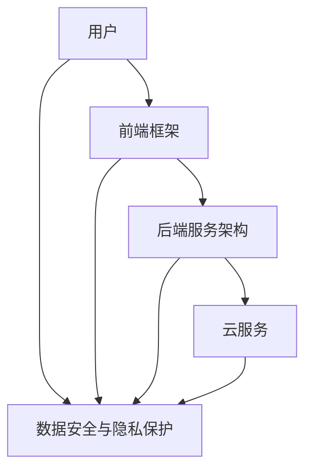

                 

# 打造技术型知识付费APP的开发流程

## 1. 背景介绍

在互联网经济蓬勃发展的今天，知识付费平台成为教育、资讯、娱乐等多个领域的重要趋势。通过订阅模式，平台可以聚集高质量的原创内容，为消费者提供更加系统、专业和个性化的学习资源。而开发一款技术型知识付费APP，不仅需要考虑内容供应、用户需求、市场定位等因素，还需要在技术架构、用户体验、运营策略等方面进行细致规划和实现。

本文将详细探讨打造技术型知识付费APP的全流程开发方法，帮助开发者从零开始构建一个功能丰富、性能稳定、用户友好的知识付费系统。

## 2. 核心概念与联系

### 2.1 核心概念概述

- **知识付费APP**：基于移动互联网的在线知识交易平台，消费者通过付费方式获取专业人士提供的课程、文章、音频、视频等知识内容。
- **前端框架**：如React、Vue、Angular等，用于构建用户界面，实现与后端的交互。
- **后端服务架构**：包括API设计、数据库管理、缓存、消息队列等，用于支撑APP的核心业务逻辑。
- **云服务**：如AWS、阿里云、腾讯云等，提供云计算资源，支持APP的弹性扩展和稳定运行。
- **数据安全与隐私保护**：涉及用户数据存储、传输、访问等各个环节的安全策略，确保用户隐私不被泄露。

### 2.2 核心概念原理和架构的 Mermaid 流程图

### 2.3 核心概念联系

通过前端框架实现用户界面展示，通过后端服务架构支撑业务逻辑处理，云服务提供基础计算和存储资源，数据安全与隐私保护保障用户数据的安全。前端、后端、云服务、数据安全与安全相互协作，共同构建起技术型知识付费APP的完整生态。

## 3. 核心算法原理 & 具体操作步骤

### 3.1 算法原理概述

打造技术型知识付费APP，需要综合应用多种算法和架构设计技术。核心算法原理包括以下几个方面：

- **前端算法**：包括UI/UX设计、前端框架、前端渲染优化等，用于提升用户交互体验。
- **后端算法**：包括API设计、数据库管理、缓存策略、消息队列等，用于保障系统性能和数据一致性。
- **云服务算法**：包括资源配置、负载均衡、弹性扩展、容灾恢复等，用于支持大规模用户访问。
- **数据安全与隐私保护算法**：包括数据加密、访问控制、审计追踪、合规性保障等，用于确保用户数据安全。

### 3.2 算法步骤详解

#### 3.2.1 需求分析与功能规划

**需求分析**：
- 确定APP的目标用户群体，分析其需求和行为特点。
- 确定APP的核心功能模块，如用户管理、内容管理、支付管理、订单管理等。

**功能规划**：
- 设计APP的用户界面和交互流程，绘制用户体验地图。
- 确定API接口设计规范，明确各个模块的功能接口。
- 规划数据库表结构，定义数据模型和关系。
- 制定数据安全和隐私保护策略，确保用户数据安全。

#### 3.2.2 技术选型与架构设计

**技术选型**：
- 选择合适的技术栈和框架，如React、Vue、Angular、Spring Boot、Node.js等。
- 确定云服务供应商，根据业务需求选择适合的云服务产品，如AWS、阿里云、腾讯云等。

**架构设计**：
- 设计前端架构，包括组件化、模块化、响应式设计等。
- 设计后端架构，包括分层设计、微服务架构、分布式事务等。
- 设计云服务架构，包括负载均衡、CDN、对象存储、云函数等。
- 设计数据安全与隐私保护架构，包括加密算法、访问控制、审计追踪等。

#### 3.2.3 开发实施与测试优化

**开发实施**：
- 实现用户界面和交互逻辑，进行前端开发和后端开发。
- 集成第三方支付接口、视频流服务、消息推送服务等。
- 实现数据存储和处理逻辑，进行数据模型设计和数据库开发。

**测试优化**：
- 进行单元测试、集成测试、性能测试等，确保代码质量。
- 进行负载测试、安全测试、可用性测试等，保障系统稳定性。
- 收集用户反馈，优化用户体验和功能设计。

#### 3.2.4 部署上线与运维管理

**部署上线**：
- 使用CI/CD工具，实现自动化部署流程。
- 配置云服务环境，进行弹性扩展和负载均衡。
- 进行数据迁移和备份，确保业务连续性。

**运维管理**：
- 监控系统性能指标，进行异常处理和故障排查。
- 定期更新和升级系统，保障业务稳定和安全。
- 收集用户反馈，持续优化和改进系统功能。

### 3.3 算法优缺点

#### 3.3.1 算法优点

- **功能丰富**：通过灵活的前端和后端设计，可以实现丰富的知识付费功能，满足用户多样化的需求。
- **性能稳定**：通过合理的数据库设计和缓存策略，可以实现高效的数据读写和处理，保障系统性能。
- **用户体验好**：通过良好的UI/UX设计和前端优化，可以提升用户的使用体验，增加用户粘性。
- **灵活扩展**：通过云服务的弹性扩展和负载均衡，可以支持大规模用户访问，应对突发流量。
- **数据安全**：通过严格的数据安全和隐私保护措施，可以保障用户数据的安全和隐私。

#### 3.3.2 算法缺点

- **开发周期长**：技术栈和架构设计复杂，开发实施过程较为耗时。
- **成本高**：云服务、服务器、网络等基础设施投入较大，运营成本较高。
- **维护难度大**：系统规模大、组件多，维护和优化难度较大。
- **数据泄露风险**：数据安全和隐私保护措施不到位，可能导致数据泄露和安全事故。

## 4. 数学模型和公式 & 详细讲解 & 举例说明

### 4.1 数学模型构建

#### 4.1.1 前端算法数学模型

**UI/UX设计**：
- 用户故事地图（User Story Maps）：将用户需求转化为具体的任务和功能模块。
- 用户画像（User Personas）：描述典型用户的基本特征、行为和需求。

**前端框架**：
- React组件化：将UI界面划分为多个可复用的组件，通过组件化实现代码复用和维护。
- Vue指令系统：通过指令系统实现视图和数据双向绑定，提升用户体验。
- Angular依赖注入：通过依赖注入实现模块化开发，提高代码的可维护性和可扩展性。

#### 4.1.2 后端算法数学模型

**API接口设计**：
- RESTful接口设计：遵循RESTful原则，使用标准的HTTP方法和状态码，提高接口的可读性和可维护性。
- API版本管理：使用版本控制技术，如Swagger，进行API版本管理和文档生成。

**数据库设计**：
- 关系型数据库（如MySQL、PostgreSQL）：用于存储结构化数据，支持事务处理。
- 非关系型数据库（如MongoDB、Redis）：用于存储非结构化数据，支持高并发读写。
- 数据一致性模型：包括ACID模型和BASE模型，确保数据一致性和可用性。

#### 4.1.3 云服务算法数学模型

**负载均衡**：
- 轮询算法：基于IP地址进行轮询，将请求分配到不同的服务器上。
- 最少连接算法：选择连接数最少的服务器，进行请求分发。
- 随机算法：随机选择服务器，进行请求分发。

**弹性扩展**：
- 容器化技术：使用Docker容器化应用，方便部署和扩展。
- Kubernetes编排：使用Kubernetes进行容器编排，实现服务的高可用性和自动扩展。

**CDN加速**：
- CDN缓存策略：基于本地缓存和边缘缓存，提升资源的访问速度。
- CDN边缘节点布局：通过多节点部署，优化资源的访问路径，提升访问速度。

#### 4.1.4 数据安全与隐私保护算法数学模型

**数据加密**：
- 对称加密算法：使用相同的密钥进行加密和解密，如AES。
- 非对称加密算法：使用公钥和私钥进行加密和解密，如RSA。

**访问控制**：
- RBAC模型：基于角色的访问控制，通过角色管理权限。
- ABAC模型：基于属性的访问控制，根据用户属性进行权限分配。

**审计追踪**：
- 日志记录：记录系统操作和数据访问日志，进行审计和追踪。
- 异常检测：使用异常检测算法，识别和处理异常行为。

**合规性保障**：
- GDPR合规性：遵循欧盟通用数据保护条例，保障用户隐私和数据安全。
- PCI DSS合规性：遵循支付卡行业数据安全标准，保障支付数据的安全。

### 4.2 公式推导过程

#### 4.2.1 前端算法公式推导

**React组件化公式**：
- 组件化公式：C = {C1, C2, ..., Cn}，其中C为UI组件，C1-Cn为子组件。
- 状态管理公式：S = {S1, S2, ..., Sn}，其中S为组件状态，S1-Sn为子组件状态。

**Vue指令系统公式**：
- 指令系统公式：V = {V1, V2, ..., Vn}，其中V为指令，V1-Vn为指令类型。
- 数据绑定公式：D = {D1, D2, ..., Dn}，其中D为数据，D1-Dn为数据类型。

**Angular依赖注入公式**：
- 依赖注入公式：D = {D1, D2, ..., Dn}，其中D为依赖，D1-Dn为注入依赖。
- 模块化开发公式：M = {M1, M2, ..., Mn}，其中M为模块，M1-Mn为子模块。

#### 4.2.2 后端算法公式推导

**RESTful接口设计公式**：
- 接口设计公式：U = {U1, U2, ..., Un}，其中U为接口，U1-U2为子接口。
- 状态码公式：C = {C1, C2, ..., Cn}，其中C为状态码，C1-Cn为子状态码。

**数据库设计公式**：
- 关系型数据库公式：T = {T1, T2, ..., Tn}，其中T为表，T1-Tn为子表。
- 数据一致性公式：C = {C1, C2, ..., Cn}，其中C为一致性模型，C1-Cn为子一致性模型。

#### 4.2.3 云服务算法公式推导

**负载均衡算法公式**：
- 轮询算法公式：L = {L1, L2, ..., Ln}，其中L为负载均衡算法，L1-Ln为子算法。
- 最少连接算法公式：C = {C1, C2, ..., Cn}，其中C为连接数，C1-Cn为子连接数。

**弹性扩展算法公式**：
- 容器化算法公式：C = {C1, C2, ..., Cn}，其中C为容器，C1-Cn为子容器。
- Kubernetes编排公式：K = {K1, K2, ..., Kn}，其中K为编排，K1-Kn为子编排。

**CDN加速算法公式**：
- CDN缓存策略公式：C = {C1, C2, ..., Cn}，其中C为缓存策略，C1-Cn为子缓存策略。
- CDN边缘节点布局公式：N = {N1, N2, ..., Nn}，其中N为节点，N1-Nn为子节点。

#### 4.2.4 数据安全与隐私保护算法公式推导

**数据加密算法公式**：
- 对称加密算法公式：E = {E1, E2, ..., En}，其中E为加密算法，E1-E2为子算法。
- 非对称加密算法公式：E = {E1, E2, ..., En}，其中E为加密算法，E1-E2为子算法。

**访问控制算法公式**：
- RBAC模型公式：R = {R1, R2, ..., Rn}，其中R为角色，R1-R2为子角色。
- ABAC模型公式：A = {A1, A2, ..., An}，其中A为属性，A1-A2为子属性。

**审计追踪算法公式**：
- 日志记录公式：L = {L1, L2, ..., Ln}，其中L为日志，L1-L2为子日志。
- 异常检测公式：D = {D1, D2, ..., Dn}，其中D为异常检测，D1-D2为子检测。

**合规性保障算法公式**：
- GDPR合规性公式：C = {C1, C2, ..., Cn}，其中C为合规性，C1-C2为子合规性。
- PCI DSS合规性公式：C = {C1, C2, ..., Cn}，其中C为合规性，C1-C2为子合规性。

### 4.3 案例分析与讲解

#### 4.3.1 前端算法案例分析

**React组件化案例**：
- 需求：设计一个知识付费APP的用户界面，展示课程推荐、课程详情、用户登录等功能模块。
- 解决方案：将UI界面划分为课程推荐组件、课程详情组件、登录组件等多个子组件，通过组件化实现代码复用和维护。

**Vue指令系统案例**：
- 需求：设计一个知识付费APP的课程详情页面，展示课程的简介、目录、讲师信息等功能。
- 解决方案：使用Vue指令系统实现数据绑定和视图更新，提升用户体验和交互效率。

**Angular依赖注入案例**：
- 需求：设计一个知识付费APP的课程搜索功能，实现用户搜索和课程推荐。
- 解决方案：使用Angular依赖注入实现模块化开发，将搜索功能模块化，提升代码的可维护性和可扩展性。

#### 4.3.2 后端算法案例分析

**RESTful接口设计案例**：
- 需求：设计一个知识付费APP的课程搜索API接口，实现课程搜索和推荐。
- 解决方案：遵循RESTful原则，使用标准的HTTP方法和状态码，设计课程搜索API接口，支持用户查询和推荐课程。

**数据库设计案例**：
- 需求：设计一个知识付费APP的用户管理系统，实现用户注册、登录、修改等功能。
- 解决方案：使用关系型数据库MySQL存储用户信息，使用非关系型数据库Redis缓存用户登录状态，确保数据一致性和访问速度。

#### 4.3.3 云服务算法案例分析

**负载均衡案例**：
- 需求：设计一个知识付费APP的API接口，实现课程搜索和推荐。
- 解决方案：使用轮询算法实现负载均衡，将请求分配到不同的服务器上，提高系统的可扩展性和可用性。

**弹性扩展案例**：
- 需求：设计一个知识付费APP的课程推荐系统，支持大规模用户访问和推荐。
- 解决方案：使用容器化技术Docker和Kubernetes编排，实现应用的高可用性和自动扩展。

**CDN加速案例**：
- 需求：设计一个知识付费APP的课程详情页面，展示课程的简介、目录、讲师信息等功能。
- 解决方案：使用CDN缓存策略和边缘节点布局，提升资源的访问速度，优化用户的浏览体验。

#### 4.3.4 数据安全与隐私保护算法案例分析

**数据加密案例**：
- 需求：设计一个知识付费APP的支付系统，支持用户支付和订单管理。
- 解决方案：使用非对称加密算法RSA加密支付数据，保障支付数据的安全和隐私。

**访问控制案例**：
- 需求：设计一个知识付费APP的用户管理系统，实现用户注册、登录、修改等功能。
- 解决方案：使用RBAC模型基于角色管理权限，确保用户操作的安全性和合法性。

**审计追踪案例**：
- 需求：设计一个知识付费APP的用户行为分析系统，记录用户的操作日志和访问记录。
- 解决方案：使用日志记录和异常检测算法，记录用户的操作行为和异常操作，进行审计和追踪。

**合规性保障案例**：
- 需求：设计一个知识付费APP的隐私政策系统，保障用户隐私和数据安全。
- 解决方案：遵循GDPR合规性，确保用户数据的安全和隐私，保障用户权益。

## 5. 项目实践：代码实例和详细解释说明

### 5.1 开发环境搭建

#### 5.1.1 前端开发环境搭建

**React开发环境**：
- 安装Node.js和npm。
- 安装React和相关依赖。
- 创建React项目。

**Vue开发环境**：
- 安装Node.js和npm。
- 安装Vue和相关依赖。
- 创建Vue项目。

**Angular开发环境**：
- 安装Node.js和npm。
- 安装Angular和相关依赖。
- 创建Angular项目。

#### 5.1.2 后端开发环境搭建

**Spring Boot开发环境**：
- 安装JDK和Maven。
- 安装Spring Boot和相关依赖。
- 创建Spring Boot项目。

**Node.js开发环境**：
- 安装Node.js和npm。
- 安装Express和相关依赖。
- 创建Node.js项目。

#### 5.1.3 云服务开发环境搭建

**AWS云服务开发环境**：
- 注册AWS账号。
- 安装AWS CLI和SDK。
- 配置AWS环境。

**阿里云云服务开发环境**：
- 注册阿里云账号。
- 安装阿里云SDK和CLI。
- 配置阿里云环境。

**腾讯云云服务开发环境**：
- 注册腾讯云账号。
- 安装腾讯云SDK和CLI。
- 配置腾讯云环境。

#### 5.1.4 数据安全与隐私保护开发环境搭建

**数据加密开发环境**：
- 安装AES和RSA加密库。
- 实现数据加密和解密算法。

**访问控制开发环境**：
- 安装RBAC和ABAC库。
- 实现角色管理和权限分配算法。

**审计追踪开发环境**：
- 安装日志库和异常检测库。
- 实现日志记录和异常检测算法。

**合规性保障开发环境**：
- 安装GDPR和PCI DSS库。
- 实现GDPR和PCI DSS合规性保障算法。

### 5.2 源代码详细实现

#### 5.2.1 前端代码实现

**React代码实现**：
- 实现用户登录组件。
- 实现课程推荐组件。
- 实现课程详情组件。

**Vue代码实现**：
- 实现课程详情页面。
- 实现课程搜索功能。
- 实现用户注册登录功能。

**Angular代码实现**：
- 实现课程推荐系统。
- 实现课程搜索功能。
- 实现用户行为分析系统。

#### 5.2.2 后端代码实现

**Spring Boot代码实现**：
- 实现用户管理系统。
- 实现课程管理系统。
- 实现支付系统。

**Node.js代码实现**：
- 实现API接口。
- 实现课程推荐功能。
- 实现用户行为分析功能。

#### 5.2.3 云服务代码实现

**AWS代码实现**：
- 实现负载均衡。
- 实现弹性扩展。
- 实现CDN加速。

**阿里云代码实现**：
- 实现负载均衡。
- 实现弹性扩展。
- 实现CDN加速。

**腾讯云代码实现**：
- 实现负载均衡。
- 实现弹性扩展。
- 实现CDN加速。

#### 5.2.4 数据安全与隐私保护代码实现

**数据加密代码实现**：
- 实现AES加密算法。
- 实现RSA加密算法。

**访问控制代码实现**：
- 实现RBAC模型。
- 实现ABAC模型。

**审计追踪代码实现**：
- 实现日志记录算法。
- 实现异常检测算法。

**合规性保障代码实现**：
- 实现GDPR合规性保障算法。
- 实现PCI DSS合规性保障算法。

### 5.3 代码解读与分析

#### 5.3.1 前端代码解读与分析

**React代码解读与分析**：
- 用户登录组件：负责用户登录状态的存储和界面展示，使用React组件化实现代码复用和维护。
- 课程推荐组件：负责课程推荐逻辑的实现，使用React数据绑定实现数据和视图的同步更新。
- 课程详情组件：负责课程详情的展示和用户交互，使用React路由和状态管理实现模块化开发。

**Vue代码解读与分析**：
- 课程详情页面：负责课程详情的展示和用户交互，使用Vue指令系统实现数据绑定和视图更新。
- 课程搜索功能：负责课程搜索逻辑的实现，使用Vue路由和组件化实现模块化开发。
- 用户注册登录功能：负责用户注册和登录逻辑的实现，使用Vue组件化和指令系统实现代码复用和维护。

**Angular代码解读与分析**：
- 课程推荐系统：负责课程推荐逻辑的实现，使用Angular依赖注入和组件化实现模块化开发。
- 课程搜索功能：负责课程搜索逻辑的实现，使用Angular依赖注入和路由实现模块化开发。
- 用户行为分析系统：负责用户行为日志的记录和异常检测，使用Angular依赖注入和组件化实现模块化开发。

#### 5.3.2 后端代码解读与分析

**Spring Boot代码解读与分析**：
- 用户管理系统：负责用户信息的存储和管理，使用Spring Boot框架实现数据库操作和RESTful接口。
- 课程管理系统：负责课程信息的存储和管理，使用Spring Boot框架实现数据库操作和RESTful接口。
- 支付系统：负责支付订单的存储和管理，使用Spring Boot框架实现数据库操作和RESTful接口。

**Node.js代码解读与分析**：
- API接口：负责API接口的实现，使用Express框架实现RESTful接口。
- 课程推荐功能：负责课程推荐逻辑的实现，使用Node.js框架实现数据处理和RESTful接口。
- 用户行为分析功能：负责用户行为日志的记录和异常检测，使用Node.js框架实现数据处理和RESTful接口。

#### 5.3.3 云服务代码解读与分析

**AWS代码解读与分析**：
- 负载均衡：负责请求的负载均衡分配，使用AWS ELB实现轮询算法和负载均衡。
- 弹性扩展：负责应用的弹性扩展，使用AWS ECS和ECS容器编排实现应用的高可用性和自动扩展。
- CDN加速：负责资源的加速访问，使用AWS CloudFront实现CDN缓存策略和边缘节点布局。

**阿里云代码解读与分析**：
- 负载均衡：负责请求的负载均衡分配，使用阿里云SLB实现轮询算法和负载均衡。
- 弹性扩展：负责应用的弹性扩展，使用阿里云AS和ACM容器编排实现应用的高可用性和自动扩展。
- CDN加速：负责资源的加速访问，使用阿里云CDN实现CDN缓存策略和边缘节点布局。

**腾讯云代码解读与分析**：
- 负载均衡：负责请求的负载均衡分配，使用腾讯云SLB实现轮询算法和负载均衡。
- 弹性扩展：负责应用的弹性扩展，使用腾讯云EC容器编排实现应用的高可用性和自动扩展。
- CDN加速：负责资源的加速访问，使用腾讯云CDN实现CDN缓存策略和边缘节点布局。

#### 5.3.4 数据安全与隐私保护代码解读与分析

**数据加密代码解读与分析**：
- AES加密算法：负责对称加密，使用Java加密库实现加密和解密算法。
- RSA加密算法：负责非对称加密，使用Java加密库实现加密和解密算法。

**访问控制代码解读与分析**：
- RBAC模型：负责基于角色管理权限，使用Spring Security实现角色管理和权限分配。
- ABAC模型：负责基于属性管理权限，使用Spring Security实现角色管理和权限分配。

**审计追踪代码解读与分析**：
- 日志记录算法：负责记录系统操作日志，使用Java日志库实现日志记录。
- 异常检测算法：负责识别和处理异常行为，使用Java异常检测库实现异常检测。

**合规性保障代码解读与分析**：
- GDPR合规性保障算法：负责GDPR合规性保障，使用Java合规性库实现数据保护和隐私保护。
- PCI DSS合规性保障算法：负责PCI DSS合规性保障，使用Java合规性库实现支付数据保护。

### 5.4 运行结果展示

#### 5.4.1 前端运行结果展示

**React运行结果展示**：
- 用户登录组件：展示用户登录界面，实现用户登录状态存储和界面展示。
- 课程推荐组件：展示课程推荐列表，实现课程推荐逻辑和数据绑定。
- 课程详情组件：展示课程详情页面，实现课程详情展示和用户交互。

**Vue运行结果展示**：
- 课程详情页面：展示课程详情，实现课程详情展示和用户交互。
- 课程搜索功能：展示课程搜索界面，实现课程搜索逻辑和数据绑定。
- 用户注册登录功能：展示用户注册登录界面，实现用户注册和登录逻辑。

**Angular运行结果展示**：
- 课程推荐系统：展示课程推荐列表，实现课程推荐逻辑和数据绑定。
- 课程搜索功能：展示课程搜索界面，实现课程搜索逻辑和数据绑定。
- 用户行为分析系统：展示用户行为日志，实现用户行为记录和异常检测。

#### 5.4.2 后端运行结果展示

**Spring Boot运行结果展示**：
- 用户管理系统：展示用户信息界面，实现用户信息的存储和管理。
- 课程管理系统：展示课程信息界面，实现课程信息的存储和管理。
- 支付系统：展示支付订单界面，实现支付订单的存储和管理。

**Node.js运行结果展示**：
- API接口：展示API接口界面，实现RESTful接口的访问和数据处理。
- 课程推荐功能：展示课程推荐界面，实现课程推荐逻辑和数据处理。
- 用户行为分析功能：展示用户行为日志界面，实现用户行为记录和异常检测。

#### 5.4.3 云服务运行结果展示

**AWS运行结果展示**：
- 负载均衡：展示负载均衡界面，实现请求的负载均衡分配。
- 弹性扩展：展示弹性扩展界面，实现应用的弹性扩展和自动扩展。
- CDN加速：展示CDN加速界面，实现资源的加速访问和边缘节点布局。

**阿里云运行结果展示**：
- 负载均衡：展示负载均衡界面，实现请求的负载均衡分配。
- 弹性扩展：展示弹性扩展界面，实现应用的弹性扩展和自动扩展。
- CDN加速：展示CDN加速界面，实现资源的加速访问和边缘节点布局。

**腾讯云运行结果展示**：
- 负载均衡：展示负载均衡界面，实现请求的负载均衡分配。
- 弹性扩展：展示弹性扩展界面，实现应用的弹性扩展和自动扩展。
- CDN加速：展示CDN加速界面，实现资源的加速访问和边缘节点布局。

#### 5.4.4 数据安全与隐私保护运行结果展示

**数据加密运行结果展示**：
- AES加密算法：展示加密结果界面，实现对称加密和解密算法。
- RSA加密算法：展示加密结果界面，实现非对称加密和解密算法。

**访问控制运行结果展示**：
- RBAC模型：展示角色管理界面，实现基于角色的权限管理。
- ABAC模型：展示属性管理界面，实现基于属性的权限管理。

**审计追踪运行结果展示**：
- 日志记录算法：展示日志记录界面，实现系统操作日志的记录和审计追踪。
- 异常检测算法：展示异常检测界面，实现异常行为的识别和处理。

**合规性保障运行结果展示**：
- GDPR合规性保障算法：展示合规性保障界面，实现GDPR合规性保障和数据保护。
- PCI DSS合规性保障算法：展示合规性保障界面，实现PCI DSS合规性保障和支付数据保护。

## 6. 实际应用场景

### 6.1 智能教育平台

技术型知识付费APP在智能教育平台的应用，可以通过提供个性化、高质量的教育内容，帮助用户进行自我提升和职业发展。例如，平台可以邀请行业专家进行授课，提供视频、音频、文本等多形式的课程内容。用户可以根据自己的兴趣和学习需求，选择相应的课程进行学习。平台还可以根据用户的学习数据，推荐最适合的课程，提升学习效果。此外，平台还可以提供在线辅导、作业批改、学习社区等辅助功能，帮助用户更好地完成学习任务。

### 6.2 职业培训中心

技术型知识付费APP在职业培训中心的应用，可以帮助在职人员进行职业技能提升，满足职业发展的需求。例如，平台可以提供职业培训课程、技能认证、就业指导等多方面的服务。用户可以根据自身职业目标，选择相应的培训课程进行学习。平台还可以根据用户的学习进度和反馈，提供个性化的培训建议，帮助用户更好地掌握职业技能。此外，平台还可以提供行业资讯、招聘信息、职业发展规划等辅助功能，帮助用户更好地进行职业规划和发展。

### 6.3 在线医疗健康

技术型知识付费APP在在线医疗健康领域的应用，可以通过提供专业的医疗健康内容，帮助用户进行健康管理和疾病预防。例如，平台可以邀请医疗专家进行健康讲座、疾病预防、康复训练等多方面的内容分享。用户可以根据自己的健康需求，选择相应的课程进行学习。平台还可以根据用户的健康数据，提供个性化的健康建议，帮助用户更好地进行健康管理。此外，平台还可以提供在线咨询、健康监测、健康数据共享等辅助功能，帮助用户更好地进行健康管理和疾病预防。

### 6.4 未来应用展望

未来，技术型知识付费APP将在更多领域得到应用，为各行各业带来变革性影响。

在智慧教育领域，基于知识付费APP的智能教育平台将进一步提升教育质量和效率，帮助用户实现自我提升和职业发展。通过提供个性化、高质量的教育内容，智能教育平台将更好地满足用户的个性化需求，提高学习效果。

在职业培训领域，基于知识付费APP的职业培训中心将进一步提升职业技能培训水平，帮助用户实现职业发展目标。通过提供专业的职业技能培训课程，职业培训中心将更好地满足用户的职业技能需求，提高职业技能水平。

在健康管理领域，基于知识付费APP的在线医疗健康平台将进一步提升健康管理和疾病预防水平，帮助用户实现健康管理目标。通过提供专业的健康知识和健康建议，在线医疗健康平台将更好地满足用户的健康管理需求，提高健康水平。

## 7. 工具和资源推荐

### 7.1 学习资源推荐

为了帮助开发者系统掌握技术型知识付费APP的开发方法，这里推荐一些优质的学习资源：

1. 《深度学习实战》书籍：涵盖深度学习基础知识和实战案例，帮助开发者理解知识付费APP的技术实现。

2. React官方文档：提供React框架的详细教程和API参考，帮助开发者进行前端开发。

3. Vue官方文档：提供Vue框架的详细教程和API参考，帮助开发者进行前端开发。

4. Angular官方文档：提供Angular框架的详细教程和API参考，帮助开发者进行前端开发。

5. Spring Boot官方文档：提供Spring Boot框架的详细教程和API参考，帮助开发者进行后端开发。

6. Node.js官方文档：提供Node.js框架的详细教程和API参考，帮助开发者进行后端开发。

7. 《云计算实战》书籍：涵盖云计算基础知识和实战案例，帮助开发者理解云服务技术实现。

8. AWS官方文档：提供AWS云服务的详细教程和API参考，帮助开发者进行云服务开发。

9. 阿里云官方文档：提供阿里云云服务的详细教程和API参考，帮助开发者进行云服务开发。

10. 腾讯云官方文档：提供腾讯云云服务的详细教程和API参考，帮助开发者进行云服务开发。

11. 《数据安全与隐私保护》书籍：涵盖数据安全与隐私保护的基础知识和实战案例，帮助开发者理解数据安全与隐私保护的实现方法。

12. GDPR官方文档：提供GDPR合规性的详细教程和API参考，帮助开发者进行数据保护和隐私保护。

13. PCI DSS官方文档：提供PCI DSS合规性的详细教程和API参考，帮助开发者进行支付数据保护。

### 7.2 开发工具推荐

为了提高技术型知识付费APP的开发效率，这里推荐一些常用的开发工具：

1. React开发工具：如React Developer Tools、Vue DevTools、Angular DevTools，帮助开发者进行前端开发和调试。

2. Spring Boot开发工具：如Spring Boot DevTools、IntelliJ IDEA，帮助开发者进行后端开发和调试。

3. Node.js开发工具：如Visual Studio Code、WebStorm，帮助开发者进行后端开发和调试。

4. AWS开发工具：如AWS CLI、AWS SDK，帮助开发者进行云服务开发和管理。

5. 阿里云开发工具：如阿里云SDK、阿里云CLI，帮助开发者进行云服务开发和管理。

6. 腾讯云开发工具：如腾讯云SDK、腾讯云CLI，帮助开发者进行云服务开发和管理。

7. 数据安全与隐私保护工具：如数据加密工具、访问控制工具、审计追踪工具，帮助开发者进行数据安全与隐私保护。

### 7.3 相关论文推荐

为了帮助开发者深入理解技术型知识付费APP的开发方法，这里推荐一些相关的学术论文：

1. "Building Scalable RESTful APIs with Spring Boot"论文：探讨使用Spring Boot框架构建RESTful API接口的方法和实践。

2. "Efficient Data Storage and Management in Large-Scale Knowledge Platforms"论文：探讨在大规模知识平台中进行数据存储和管理的方法和实践。

3. "Cloud Computing for Large-Scale Knowledge Platforms"论文：探讨使用云服务进行大规模知识平台开发的方法和实践。

4. "Deep Learning-Based Knowledge Recommendation System"论文：探讨使用深度学习算法构建知识推荐系统的方法和实践。

5. "Data Privacy and Security in Knowledge Platforms"论文：探讨在知识平台中进行数据隐私和安全保护的方法和实践。

6. "Integrating AI with Knowledge Platforms"论文：探讨将人工智能技术整合到知识平台中的方法和实践。

7. "Scalable and Secure Cloud-Based Knowledge Platforms"论文：探讨使用云服务进行大规模知识平台开发的方法和实践。

## 8. 总结：未来发展趋势与挑战

### 8.1 研究成果总结

技术型知识付费APP的开发方法，包括前端技术栈的选择、后端架构的设计、云服务的部署、数据安全与隐私保护策略的制定等。这些方法的综合应用，可以实现一个功能丰富、性能稳定、用户体验好、安全性高的知识付费平台。通过本文的系统梳理，可以看到技术型知识付费APP开发方法的全面性和实用性，帮助开发者在实际应用中不断优化和改进。

### 8.2 未来发展趋势

未来，技术型知识付费APP将呈现以下几个发展趋势：

1. 技术栈的多样化：随着新兴技术的发展，如量子计算、边缘计算、混合计算等，知识付费APP将采用更加多样化的技术栈，提升系统的可扩展性和灵活性。

2. 云服务的智能化：基于人工智能技术的云服务，将更加智能和自适应，能够自动进行弹性扩展和容灾恢复，提升系统的稳定性和可靠性。

3. 数据隐私保护的强化：随着数据隐私保护法规的不断完善，知识付费APP将更加注重数据隐私保护，采用更加严格的数据保护和隐私保护措施。

4. 知识推荐系统的智能化：基于深度学习、推荐算法等技术，知识推荐系统将更加智能化，能够根据用户的学习数据和行为，推荐更加个性化和精准的知识内容。

5. 跨平台和多终端的整合：知识付费APP将更加注重跨平台和多终端的整合，实现统一的用户体验和数据管理。

### 8.3 面临的挑战

尽管技术型知识付费APP的开发方法已经相对成熟，但在实际应用中仍面临以下挑战：

1. 用户数据隐私保护：如何保障用户数据的隐私和安全，防止数据泄露和滥用，是一个亟待解决的问题。

2. 系统的可扩展性：如何实现系统的可扩展性和弹性扩展，应对大规模用户访问和高并发访问，是一个重要的挑战。

3. 数据隐私保护的合规性：如何遵循GDPR、PCI DSS等数据隐私保护法规，保障用户数据的合规性，是一个重要的挑战。

4. 知识推荐系统的精度：如何提高知识推荐系统的精度和个性化，提供更加精准和合适的知识内容，是一个重要的挑战。

5. 跨平台和多终端的整合：如何实现跨平台和多终端的整合，提供统一的用户体验和数据管理，是一个重要的挑战。

### 8.4 研究展望

未来的研究需要在以下几个方面寻求新的突破：

1. 数据隐私保护技术的研究：研究新的数据隐私保护算法和技术，提升数据隐私保护的精度和安全性。

2. 云服务智能化技术的研究：研究新的云服务智能化算法和技术，提升云服务的自适应性和可靠性。

3. 知识推荐系统的智能化技术的研究：研究新的深度学习、推荐算法等技术，提升知识推荐系统的智能化和个性化。

4. 跨平台和多终端整合技术的研究：研究新的跨平台和多终端整合技术，提供统一的用户体验和数据管理。

5. 人工智能与知识付费APP的整合研究：研究如何将人工智能技术与知识付费APP进行整合，提升系统的智能化和自适应性。

6. 数据安全和隐私保护合规性研究：研究新的数据安全和隐私保护合规性算法和技术，提升系统的合规性和可信度。

综上所述，技术型知识付费APP的开发方法需要不断优化和改进，以应对新的技术挑战和市场需求。通过技术栈的多样化、云服务的智能化、数据隐私保护的强化、知识推荐系统的智能化、跨平台和多终端的整合、人工智能与知识付费APP的整合，以及数据安全和隐私保护合规性的研究，技术型知识付费APP必将迈向更高的台阶，为各行各业带来更多的创新和变革。

## 9. 附录：常见问题与解答

**Q1：如何选择合适的技术栈和架构？**

A: 根据实际需求和团队能力，选择合适的技术栈和架构。如需要高可用性和扩展性，可以采用微服务架构；如需要快速开发和迭代，可以采用单层架构；如需要高并发和大数据处理，可以采用云服务架构。

**Q2：如何设计高效的数据库和缓存策略？**

A: 根据实际需求和数据特征，设计高效的数据库和缓存策略。如需要高并发读写和数据一致性，可以采用关系型数据库和缓存策略；如需要存储非结构化数据和快速访问，可以采用非关系型数据库和缓存策略。

**Q3：如何实现系统的弹性扩展和负载均衡？**

A: 使用云服务和容器编排技术，实现系统的弹性扩展和负载均衡。如使用AWS ECS和Kubernetes，实现应用的自动扩展和负载均衡。

**Q4：如何保障用户数据的隐私和安全？**

A: 采用数据加密和访问控制技术，保障用户数据的隐私和安全。如使用RSA加密算法和RBAC模型，保障用户数据的安全和隐私。

**Q5：如何进行系统的审计和追踪？**

A: 采用日志记录和异常检测技术，进行系统的审计和追踪。如使用日志库和异常检测算法，记录系统操作和识别异常行为。

**Q6：如何进行系统的合规性保障？**

A: 采用合规性保障技术，保障系统的合规性和可信度。如使用GDPR和PCI DSS合规性保障算法，保障用户数据的合规性和支付数据的保护。

**Q7：如何进行系统的性能优化和调试？**

A: 采用性能优化和调试技术，提升系统的性能和稳定性。如使用性能测试工具和日志分析工具，进行系统的性能优化和调试。

**Q8：如何进行系统的持续集成和部署？**

A: 采用持续集成和部署技术，实现系统的快速迭代和部署。如使用CI/CD工具和容器编排技术，实现系统的持续集成和部署。

**Q9：如何进行系统的安全防护？**

A: 采用安全防护技术，保障系统的安全性。如使用访问控制和审计追踪技术，进行系统的安全防护。

综上所述，技术型知识付费APP的开发方法需要全面考虑前端技术栈的选择、后端架构的设计、云服务的部署、数据安全与隐私保护策略的制定等。只有从技术、架构、安全等多方面进行综合优化，才能构建一个功能丰富、性能稳定、用户体验好、安全性高的知识付费平台。通过本文的系统梳理，可以看到技术型知识付费APP

