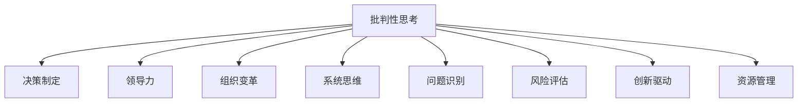

                 

# 批判性思考在管理中的重要性

> 关键词：批判性思考, 管理, 领导力, 决策, 创新, 问题解决, 组织变革, 适应性, 批判性思维, 系统思维

## 1. 背景介绍

### 1.1 问题由来
在现代社会，企业面临的环境复杂多变，竞争日益激烈。要在这样的环境中生存和发展，需要领导者具备高效的决策能力和敏锐的问题识别能力。然而，传统管理方式往往侧重于执行和执行结果的评估，而忽视了决策过程和决策质量的把控。这种管理方式在简单稳定的环境中有一定适用性，但面对复杂多变的现实情况，其弊端逐渐显现：决策失误、资源浪费、战略不适应等问题频发。

随着人工智能、大数据、区块链等新兴技术的发展，企业管理进入了一个新的时代，需要更加注重动态性、复杂性和适应性。批判性思考作为一种先进的思维方法，被广泛应用于管理实践中，成为提升领导力和决策能力的有效手段。

### 1.2 问题核心关键点
批判性思考（Critical Thinking）是一种基于逻辑、证据和反思的思维方式，旨在帮助个体或组织发现问题、分析问题、提出创新解决方案。在管理领域，批判性思考的运用主要体现在以下几个方面：

- **决策过程的优化**：通过批判性思考，管理者能全面考虑问题的多方面因素，避免片面和短视。
- **风险管理**：批判性思考有助于识别潜在的风险和挑战，制定应对策略。
- **创新驱动**：批判性思维鼓励开放和多元的视角，激发创新潜力。
- **问题解决**：批判性思考帮助管理者理清问题本质，找到最优解决方案。
- **组织变革**：批判性思维推动组织不断适应变化，实现可持续成长。

本文将从批判性思考的原理、操作流程、优缺点、应用领域等方面，深入探讨其在管理中的重要性，并给出实例分析，以期为管理者提供实用的指导。

## 2. 核心概念与联系

### 2.1 核心概念概述

为了更好地理解批判性思考在管理中的应用，本节将介绍几个密切相关的核心概念：

- **批判性思考**：基于逻辑、证据和反思的思维方式，旨在发现问题、分析问题、提出解决方案。
- **决策制定**：在复杂多变的环境下，选择最优方案的过程。
- **领导力**：管理和影响团队的能力，包括激励、指导、沟通等。
- **组织变革**：为了适应环境变化，对组织结构、流程、文化等方面的调整。
- **系统思维**：考虑问题之间的相互关系和整体视角，以系统的角度分析问题。

这些核心概念之间的逻辑关系可以通过以下Mermaid流程图来展示：



这个流程图展示批判性思考与其他核心概念的关系：

1. 批判性思考是决策制定的基础。
2. 批判性思考提升领导力，帮助管理者更好地激励和指导团队。
3. 批判性思考推动组织变革，使组织能适应外部环境的变化。
4. 批判性思考运用系统思维，全面考虑问题。

批判性思考与其他概念共同构成管理思维的完整框架，帮助管理者以更科学、更系统的视角应对复杂问题。

## 3. 核心算法原理 & 具体操作步骤

### 3.1 算法原理概述

批判性思考在管理中的应用，本质上是通过系统化的思维方式，对问题进行深入分析和解决方案的设计。其核心思想是：

1. **问题识别**：准确把握问题的本质和影响范围。
2. **风险评估**：全面考虑问题可能带来的负面影响。
3. **证据收集**：收集并分析与问题相关的数据和信息。
4. **假设检验**：提出多种可能的解决方案，并通过逻辑推理进行检验。
5. **创新思维**：从多个角度考虑问题，提出创新性的解决方案。
6. **决策实施**：选择最优解决方案并实施。
7. **反馈与调整**：根据实施结果反馈，不断优化决策和过程。

### 3.2 算法步骤详解

批判性思考在管理中的具体操作流程如下：

**Step 1: 问题识别**
- 收集相关信息和数据，确定问题的核心要素。
- 使用SWOT分析（Strengths, Weaknesses, Opportunities, Threats）等工具，全面了解问题的背景和影响。
- 明确问题的优先级，确定解决的目标和时间节点。

**Step 2: 风险评估**
- 使用鱼骨图、PEST分析（Political, Economic, Social, Technological）等方法，识别问题的潜在风险。
- 分析风险发生的概率和影响，制定应对措施。

**Step 3: 证据收集**
- 从多渠道（如员工反馈、市场分析、客户调研等）收集数据和信息。
- 使用数据分析工具（如Excel、Tableau）整理和可视化数据。
- 对数据进行清理和校验，确保准确性。

**Step 4: 假设检验**
- 提出多种解决方案，并进行逻辑推理和可行性分析。
- 使用决策树、鱼骨图等工具辅助决策。
- 在可能的解决方案中选择最优方案，并制定详细的实施计划。

**Step 5: 创新思维**
- 鼓励团队成员提出多元化的观点和创新性的解决方案。
- 使用头脑风暴、六顶思考帽等工具，激发创新思维。
- 对解决方案进行评估和筛选，选择最优方案。

**Step 6: 决策实施**
- 制定详细的实施计划，明确责任人和时间节点。
- 执行计划并监控进展，确保实施效果。
- 定期评估实施效果，及时调整策略。

**Step 7: 反馈与调整**
- 收集实施结果的反馈，评估解决方案的有效性。
- 根据反馈进行复盘和总结，发现问题和改进空间。
- 更新和完善实施计划，指导未来的决策和实施。

### 3.3 算法优缺点

批判性思考在管理中的应用，具有以下优点：

- **提升决策质量**：通过系统化的思维方式，全面考虑问题的多方面因素，避免片面和短视。
- **强化风险管理**：批判性思考有助于识别潜在的风险和挑战，制定应对策略，降低决策风险。
- **促进创新**：批判性思维鼓励开放和多元的视角，激发创新潜力。
- **增强问题解决能力**：批判性思考帮助管理者理清问题本质，找到最优解决方案。
- **推动组织变革**：批判性思维推动组织不断适应变化，实现可持续成长。

同时，批判性思考也存在一定的局限性：

- **资源消耗高**：批判性思考需要大量的时间、数据和专业知识，对于复杂问题，需要投入大量的资源。
- **复杂度高**：批判性思考涉及多维度和多层次的分析和评估，对管理者的能力要求较高。
- **易受主观影响**：批判性思考依赖于个人或团队的判断和分析，容易受到主观偏见的影响。
- **实施难度大**：批判性思考涉及跨部门、跨团队的协作，实施过程复杂。

尽管存在这些局限性，但批判性思考在提升管理决策质量、增强问题解决能力、推动组织变革等方面的优势，使其成为现代管理中不可或缺的思维工具。

### 3.4 算法应用领域

批判性思考在管理中的应用广泛，以下是几个典型应用领域：

- **战略规划**：在复杂多变的环境中，批判性思考帮助企业制定战略目标和实施路径。
- **项目管理和变革管理**：批判性思考用于项目执行和变革过程的监控和评估，确保项目顺利进行。
- **人力资源管理**：批判性思考用于评估员工绩效，优化人才结构，提升组织效率。
- **市场营销**：批判性思考用于市场分析和策略制定，提高市场响应速度和客户满意度。
- **风险管理**：批判性思考用于识别和评估潜在风险，制定风险应对策略。
- **创新管理**：批判性思考用于激发创新思维，推动新技术和新产品的开发。
- **客户关系管理**：批判性思考用于分析客户需求和反馈，提升客户体验和满意度。

除了上述这些领域，批判性思考还被广泛应用于领导力提升、团队建设、质量管理等多个管理环节，成为提升组织竞争力和应对复杂环境的重要手段。

## 4. 数学模型和公式 & 详细讲解 & 举例说明

### 4.1 数学模型构建

在管理中，批判性思考的实施过程可以用数学模型进行抽象和分析。假设有一个管理决策问题，需要确定最优解决方案，我们可以构建如下数学模型：

$$
\max_{x} \text{目标函数} \quad \text{subject to} \quad \text{约束条件}
$$

其中，$x$ 表示决策变量，目标是最大化目标函数，同时满足一组约束条件。在实际应用中，目标函数和约束条件往往涉及多个维度和多个层次的变量，需要复杂的数学模型进行描述。

### 4.2 公式推导过程

以一个典型的项目预算决策为例，我们需要在有限的预算内最大化项目的预期收益。假设项目A和项目B的预算和收益如下：

- 项目A：预算 $B_A = 100,000$，收益 $R_A = 150,000$
- 项目B：预算 $B_B = 80,000$，收益 $R_B = 120,000$

我们可以构建如下数学模型：

$$
\max_{\{x_A, x_B\}} (150,000x_A + 120,000x_B) \quad \text{subject to} \quad \left\{
\begin{aligned}
x_A + x_B &\leq 180,000 \\
x_A &\geq 0 \\
x_B &\geq 0
\end{aligned}
\right.
$$

其中，$x_A$ 和 $x_B$ 分别表示项目A和项目B的预算投入，目标是在预算约束下最大化总收益。

通过求解上述线性规划问题，我们可以找到最优预算分配方案，即项目A投入 $100,000$，项目B投入 $80,000$，即可实现总收益最大化。

### 4.3 案例分析与讲解

某公司面临一个复杂的市场拓展决策问题，需要在不同市场中投入资源，以最大化市场份额和利润。公司有A、B两个市场，每个市场的潜在利润和投入成本如下：

- 市场A：潜在利润 $R_A = 200,000$，投入成本 $C_A = 100,000$
- 市场B：潜在利润 $R_B = 150,000$，投入成本 $C_B = 80,000$

假设公司总预算为 $B = 250,000$，目标是在预算约束下最大化总利润。我们可以构建如下数学模型：

$$
\max_{\{x_A, x_B\}} (200,000x_A + 150,000x_B) \quad \text{subject to} \quad \left\{
\begin{aligned}
x_A + x_B &\leq 250,000 \\
x_A &\geq 0 \\
x_B &\geq 0
\end{aligned}
\right.
$$

通过求解上述线性规划问题，我们可以找到最优市场资源分配方案，即公司投入 $150,000$ 到市场A，投入 $100,000$ 到市场B，即可实现总利润最大化。

## 5. 项目实践：代码实例和详细解释说明

### 5.1 开发环境搭建

在进行管理决策问题的代码实现前，我们需要准备好开发环境。以下是使用Python进行Pandas和Scipy开发的环境配置流程：

1. 安装Anaconda：从官网下载并安装Anaconda，用于创建独立的Python环境。

2. 创建并激活虚拟环境：
```bash
conda create -n management-env python=3.8 
conda activate management-env
```

3. 安装必要的Python库：
```bash
conda install pandas scipy numpy matplotlib seaborn
```

4. 安装Rust库（可选）：
```bash
conda install rustlib
```

5. 安装相关数据库和API：
```bash
conda install mysql-python psycopg2
```

完成上述步骤后，即可在`management-env`环境中开始管理决策问题的代码实现。

### 5.2 源代码详细实现

下面以一个简单的线性规划问题为例，给出使用Pandas进行线性规划求解的PyTorch代码实现。

首先，定义问题的数据结构和目标函数：

```python
import pandas as pd

# 定义问题数据
budget = 250_000
cost_A = 100_000
profit_A = 200_000
cost_B = 80_000
profit_B = 150_000

# 构建线性规划问题
prob = pd.DataFrame({
    'budget': [budget, cost_A, cost_B],
    'profit': [profit_A, profit_B]
})

# 定义目标函数和约束条件
objective = pd.Series([profit_A, profit_B])
constraints = [
    {'equation': 'budget - budget', 'symbol': 'c'},
    {'equation': 'cost_A - cost_A', 'symbol': 'x_A'},
    {'equation': 'cost_B - cost_B', 'symbol': 'x_B'}
]
```

然后，使用Scipy的线性规划求解器进行求解：

```python
from scipy.optimize import linprog

# 定义线性规划问题
c = objective
A_ub = constraints[0].equation
b_ub = [constraints[0].symbol]
A_eq = constraints[1].equation
b_eq = [constraints[1].symbol]
A_eq, b_eq, A_ub, b_ub
```

求解线性规划问题：

```python
# 求解线性规划问题
result = linprog(c, A_ub=A_ub, b_ub=b_ub, A_eq=A_eq, b_eq=b_eq)
result.x
```

最后，输出结果并分析：

```python
# 输出结果
budget = budget
cost_A = cost_A
cost_B = cost_B
profit_A = profit_A
profit_B = profit_B
x_A = result.x[0]
x_B = result.x[1]
total_profit = profit_A*x_A + profit_B*x_B
total_cost = cost_A*x_A + cost_B*x_B

print(f"Optimal solution: x_A = {x_A}, x_B = {x_B}")
print(f"Total profit: {total_profit}")
print(f"Total cost: {total_cost}")
```

以上就是使用Python进行线性规划求解的完整代码实现。可以看到，使用Pandas和Scipy库可以很方便地构建和求解线性规划问题，适合用于复杂管理决策问题的优化分析。

### 5.3 代码解读与分析

让我们再详细解读一下关键代码的实现细节：

**线性规划问题定义**：
- `budget`：总预算，初始值设为250,000。
- `cost_A`、`profit_A`：市场A的投入成本和潜在利润。
- `cost_B`、`profit_B`：市场B的投入成本和潜在利润。
- `prob`：问题数据表，包含了总预算和两个市场的成本和利润。
- `objective`：目标函数，表示两个市场的潜在利润。
- `constraints`：约束条件，包含总预算约束、市场A的投入成本约束和市场B的投入成本约束。

**求解过程**：
- 使用Scipy的`linprog`函数求解线性规划问题，将目标函数、约束条件输入。
- `c`：目标函数的系数，表示市场A和市场B的潜在利润。
- `A_ub`、`b_ub`：市场A的投入成本约束。
- `A_eq`、`b_eq`：总预算约束。

**结果输出**：
- 输出最优解，包括市场A和市场B的投入金额。
- 计算总利润和总成本，用于评估决策效果。

可以看出，使用Pandas和Scipy库可以方便地构建和求解线性规划问题，适用于复杂的决策优化分析。在实际管理决策中，可以根据具体问题构建不同类型和规模的数学模型，使用相应的优化工具进行求解。

## 6. 实际应用场景

### 6.1 智能制造系统

在智能制造系统中，批判性思考用于优化生产计划和资源分配。通过全面考虑生产效率、设备状态、市场需求等因素，批判性思考帮助企业制定最优的生产计划，提升生产效率，降低成本，提高产品质量。

在实际操作中，管理者需要收集生产数据，分析设备状态，考虑市场需求和供应链因素，构建数学模型进行求解。使用Pandas和Scipy库可以方便地构建和求解线性规划、整数规划等优化模型，从而实现资源的最优分配和生产计划的优化。

### 6.2 企业风险管理

在企业风险管理中，批判性思考用于识别和管理潜在风险，制定风险应对策略。管理者通过全面分析风险因素，使用统计分析、模拟仿真等方法，构建风险评估模型。使用Pandas和Scipy库可以方便地进行数据处理和模型求解，从而实现风险的有效识别和控制。

### 6.3 人力资源管理

在人力资源管理中，批判性思考用于优化员工分配和绩效评估。通过全面考虑员工的技能、经验和绩效，批判性思考帮助企业制定最优的员工分配方案，提升团队协作效率，优化绩效考核。

在实际操作中，管理者需要收集员工数据，分析员工绩效，考虑员工技能和工作量等因素，构建数学模型进行求解。使用Pandas和Scipy库可以方便地构建和求解线性规划、整数规划等优化模型，从而实现员工的最优分配和绩效评估。

### 6.4 未来应用展望

随着管理决策问题复杂度的增加，批判性思考将发挥越来越重要的作用。未来，批判性思考将在以下领域得到广泛应用：

- **大数据分析**：通过大数据分析技术，全面收集和管理决策所需的信息，辅助批判性思考。
- **人工智能**：使用人工智能技术，自动化处理和分析复杂数据，提高批判性思考的效率和准确性。
- **跨领域融合**：与其他学科的思维方法结合，如系统动力学、博弈论、生态学等，构建更全面的决策模型。
- **人机协同**：利用人工智能辅助批判性思考，实现人机协同决策，提升决策效果。

这些技术的发展和应用，将使得批判性思考在管理决策中的作用更加重要，帮助企业应对复杂多变的环境，实现持续成长和竞争力的提升。

## 7. 工具和资源推荐

### 7.1 学习资源推荐

为了帮助管理者系统掌握批判性思考的理论基础和实践技巧，这里推荐一些优质的学习资源：

1. 《批判性思维导论》（Critical Thinking）：哈佛大学出版社出版的经典教材，详细介绍了批判性思考的基本概念和应用方法。
2. 《系统思维》（Systems Thinking）：IBM顾问皮特·圣吉（Peter Senge）所著，系统介绍了系统思维的基本原理和应用案例。
3. 《数据分析实战》（Data Analysis for Decision Making）：由知名数据科学家撰写的书籍，详细介绍了如何使用Pandas和Scipy等工具进行数据分析和决策支持。
4. Coursera和edX上的相关课程：提供了大量关于批判性思考、系统思维和数据分析的在线课程，适合不同层次的学习者。
5. 《管理学》（Management）：知名管理学家斯蒂芬·罗宾斯（Stephen Robbins）所著，详细介绍了管理学的基本理论和实践方法。

通过对这些资源的学习实践，相信管理者一定能够系统掌握批判性思考的理论基础和应用方法，更好地应对复杂的决策问题。

### 7.2 开发工具推荐

高效的开发离不开优秀的工具支持。以下是几款用于管理决策问题开发的常用工具：

1. Pandas：用于数据处理和分析的Python库，提供高效的数据操作和统计分析功能。
2. Scipy：用于科学计算和数值分析的Python库，提供多种数学模型求解工具。
3. SQL和NoSQL数据库：用于存储和管理决策所需的大规模数据。
4. Tableau和Power BI：用于数据可视化和报表展示的工具，帮助管理者直观地理解决策结果。
5. Jupyter Notebook：支持Python和R等多种语言，提供交互式的开发环境，方便调试和验证模型。

合理利用这些工具，可以显著提升管理决策问题的开发效率，加快创新迭代的步伐。

### 7.3 相关论文推荐

批判性思考和系统思维的研究源于学界的持续研究。以下是几篇奠基性的相关论文，推荐阅读：

1. 《批判性思维与问题解决》（Critical Thinking and Problem Solving）：探讨了批判性思维在问题解决中的应用，提出了多种批判性思考的方法和工具。
2. 《系统思维：复杂系统的理解与应对》（Systems Thinking: Mastering Complexity）：介绍了系统思维的基本原理和应用方法，强调系统思维在复杂环境下的重要性。
3. 《线性规划在管理中的应用》（Linear Programming in Management）：详细介绍了线性规划在管理决策中的运用，提供了大量的实例和案例分析。
4. 《大数据在管理决策中的应用》（Big Data in Decision Making）：探讨了大数据技术在管理决策中的应用，提出了多种大数据分析的方法和工具。
5. 《人机协同决策》（Human-Machine Collaborative Decision Making）：介绍了人机协同决策的基本原理和实现方法，强调人机协同在复杂决策中的重要性。

这些论文代表了大数据、批判性思考和系统思维的发展脉络，提供了丰富的理论支撑和实践指导。

## 8. 总结：未来发展趋势与挑战

### 8.1 总结

本文对批判性思考在管理中的应用进行了全面系统的介绍。首先阐述了批判性思考的重要性，明确了其在优化决策过程、强化风险管理、促进创新、提升问题解决能力、推动组织变革等方面的独特价值。其次，从原理到实践，详细讲解了批判性思考的数学模型和操作步骤，给出了完整的代码实例。同时，本文还广泛探讨了批判性思考在智能制造、企业风险管理、人力资源管理等多个领域的应用前景，展示了其在管理中的广泛应用。

通过本文的系统梳理，可以看到，批判性思考在提升管理决策质量、增强问题解决能力、推动组织变革等方面的重要作用，正逐步成为现代管理中不可或缺的思维工具。未来，伴随管理决策问题复杂度的增加，批判性思考将发挥越来越重要的作用，助力企业应对复杂多变的环境，实现持续成长和竞争力的提升。

### 8.2 未来发展趋势

展望未来，批判性思考在管理中的应用将呈现以下几个发展趋势：

1. **智能化决策支持**：随着大数据和人工智能技术的发展，批判性思考将与智能决策支持系统结合，提供更全面、更高效的决策辅助。
2. **跨领域融合**：批判性思考将与其他学科的思维方法结合，如系统动力学、博弈论、生态学等，构建更全面的决策模型。
3. **人机协同**：利用人工智能辅助批判性思考，实现人机协同决策，提升决策效果。
4. **个性化管理**：批判性思考将结合个性化数据和人工智能技术，提供定制化的管理解决方案。
5. **可持续管理**：批判性思考将结合可持续发展目标，推动企业的可持续发展战略。
6. **全球化管理**：批判性思考将帮助企业在全球化环境中，制定跨文化和跨地域的战略决策。

这些趋势凸显了批判性思考在管理决策中的广阔前景，进一步拓展了其应用范围和深度。未来，批判性思考将成为现代管理中不可或缺的思维工具，助力企业在复杂多变的环境中实现持续成长和竞争力的提升。

### 8.3 面临的挑战

尽管批判性思考在管理中的应用已经取得了显著成效，但在迈向更加智能化、普适化应用的过程中，仍面临诸多挑战：

1. **数据质量问题**：管理决策问题往往需要大量的高质量数据支持，但数据质量问题（如数据缺失、不准确、不一致等）可能导致错误的决策。
2. **技术和工具的局限性**：现有的数据处理和分析工具在处理大规模复杂数据时，可能面临性能瓶颈。
3. **管理者的能力差距**：批判性思考对管理者的能力要求较高，需要在实践中不断学习和提升。
4. **跨部门协作**：批判性思考需要跨部门协作，协调不同团队和利益相关者的意见，可能存在沟通和协调的困难。
5. **文化和变革阻力**：批判性思考可能涉及组织文化的变革，遇到组织内部阻力和抵触情绪。

这些挑战需要我们共同应对，不断优化数据质量，提升技术和工具的性能，提高管理者的能力，加强跨部门协作，推动组织文化的变革。唯有如此，批判性思考才能在管理中发挥更大的作用，助力企业实现持续成长和竞争力的提升。

### 8.4 研究展望

面对批判性思考面临的诸多挑战，未来的研究需要在以下几个方面寻求新的突破：

1. **数据治理和质量提升**：通过数据治理技术，提升数据质量，确保数据准确、一致和完整。
2. **智能决策支持系统**：开发智能决策支持系统，利用人工智能和大数据分析技术，提供更全面、更高效的决策支持。
3. **跨领域融合技术**：研究跨领域融合技术，将批判性思维与其他学科的思维方法结合，构建更全面的决策模型。
4. **人机协同决策**：开发人机协同决策系统，利用人工智能辅助批判性思考，提升决策效果。
5. **组织文化变革**：推动组织文化的变革，营造开放、创新、协同的工作环境，促进批判性思考的普及和应用。
6. **可持续发展目标**：结合可持续发展目标，推动企业的可持续发展战略，实现长期价值最大化。

这些研究方向的探索，将引领批判性思考在管理中的应用进入新的阶段，为企业管理提供更科学、更系统的决策支持，助力企业在复杂多变的环境中实现持续成长和竞争力的提升。

## 9. 附录：常见问题与解答

**Q1：什么是批判性思考？**

A: 批判性思考是一种基于逻辑、证据和反思的思维方式，旨在发现问题、分析问题、提出解决方案。其核心在于全面考虑问题的多方面因素，避免片面和短视，提高决策质量。

**Q2：如何提升批判性思考能力？**

A: 提升批判性思考能力需要系统的学习和实践，可以从以下几个方面入手：
1. 学习相关理论知识，理解批判性思考的基本原理和应用方法。
2. 练习批判性思考技巧，如分析问题、评估证据、提出假设等。
3. 参与实际管理决策，通过实践提升批判性思考能力。
4. 学习其他学科的思维方法，如系统思维、系统动力学等，扩展批判性思考的视野。

**Q3：批判性思考在管理中能带来哪些好处？**

A: 批判性思考在管理中能带来以下好处：
1. 提升决策质量：全面考虑问题的多方面因素，避免片面和短视，提高决策质量。
2. 强化风险管理：识别潜在风险，制定应对策略，降低决策风险。
3. 促进创新：鼓励开放和多元的视角，激发创新潜力。
4. 提升问题解决能力：理清问题本质，找到最优解决方案。
5. 推动组织变革：不断适应变化，实现持续成长。

**Q4：批判性思考有哪些常用的工具和方法？**

A: 批判性思考常用的工具和方法包括：
1. SWOT分析：分析问题的 Strengths、Weaknesses、Opportunities、Threats。
2. 系统思维：考虑问题之间的相互关系和整体视角。
3. 统计分析：通过数据收集和分析，识别问题的本质和规律。
4. 决策树：用树形结构表示决策过程，帮助评估决策方案。
5. 头脑风暴：鼓励团队成员提出多元化的观点和创新性的解决方案。
6. 六顶思考帽：从不同角度思考问题，促进团队协作和决策。

这些工具和方法有助于全面分析和管理复杂问题，提升批判性思考的效率和效果。

**Q5：批判性思考在实践中有哪些注意事项？**

A: 在实践中，批判性思考需要注意以下几点：
1. 全面收集信息：确保问题的信息全面、准确、完整。
2. 分析问题本质：识别问题的根本原因，避免表面化的解决方案。
3. 多角度考虑问题：从多个角度思考问题，寻找最优解决方案。
4. 不断反思和调整：在实践中不断反思和调整决策方案，确保其有效性。
5. 加强团队协作：与团队成员密切合作，充分利用集体智慧，提升批判性思考的效果。

通过遵循这些注意事项，管理者可以在实践中更好地应用批判性思考，提升管理决策的质量和效果。

---

作者：禅与计算机程序设计艺术 / Zen and the Art of Computer Programming

