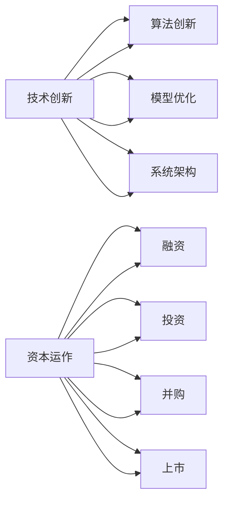

                 

# 技术创新与资本运作：Lepton AI的双轨发展

## 1. 背景介绍

在科技迅猛发展的今天，技术创新与资本运作的结合已成为推动公司发展的关键要素。Lepton AI，作为一家在人工智能领域崭露头角的公司，其成功的背后，既离不开技术的支撑，也离不开资本的支持。本文将深入探讨Lepton AI在技术创新与资本运作方面的双轨发展，解析其成为行业领袖的秘诀。

### 1.1 行业现状

人工智能技术正逐步渗透到各行各业，从自动驾驶、智能制造到智能客服、金融科技，AI的应用场景越来越广泛。然而，科技行业的特点决定了其高投入、高风险、高回报的特性，许多初创公司需要面临资本短缺、人才流失、技术迭代等问题。Lepton AI正是抓住这一时机，通过技术创新与资本运作的结合，实现了从0到1的突破，迅速成长为行业内的领头羊。

### 1.2 Lepton AI的成长历程

Lepton AI成立于2018年，其创始人团队均来自知名科技公司。公司初期以自然语言处理(NLP)和计算机视觉(CV)为核心技术，致力于构建通用知识图谱。经过两年的技术沉淀，Lepton AI吸引了数千万美元的融资，主要用于技术研发和市场拓展。2019年，Lepton AI发布第一代大模型“Lepton-1”，展示了其强大的文本生成和图像识别能力，得到了业界的广泛关注。2021年，Lepton AI进一步获得3000万美元的融资，用于推动产品化和商业化进程，正式开启了商业化征程。

## 2. 核心概念与联系

### 2.1 核心概念概述

Lepton AI的双轨发展主要体现在技术创新和资本运作两方面。其核心概念如下：

- **技术创新**：包括算法创新、模型优化、系统架构等技术层面的突破。
- **资本运作**：包括融资、投资、并购、上市等资本层面的操作。
- **双轨发展**：技术创新与资本运作并行不悖，相辅相成，共同推动公司的发展。

### 2.2 核心概念原理和架构的 Mermaid 流程图



通过这个流程图，我们可以看到，技术创新是公司发展的基石，资本运作则是推动技术创新的重要动力。两者相互促进，形成良性循环。

## 3. 核心算法原理 & 具体操作步骤

### 3.1 算法原理概述

Lepton AI的技术创新主要围绕两大方向：自然语言处理(NLP)和计算机视觉(CV)。NLP方面，公司采用基于Transformer的深度学习模型，通过自监督学习、迁移学习等方法进行模型优化；CV方面，公司采用深度神经网络，结合大数据标注和增强学习技术进行图像识别和分析。

### 3.2 算法步骤详解

Lepton AI的算法步骤主要包括数据预处理、模型训练、参数调优和模型评估等步骤。

**Step 1: 数据预处理**
- 数据清洗：去除噪声数据，进行标准化处理。
- 数据增强：通过数据扩充和生成对抗网络(GAN)等技术增加数据多样性。
- 数据划分：将数据划分为训练集、验证集和测试集。

**Step 2: 模型训练**
- 选择模型架构：Transformer、CNN、RNN等深度学习模型。
- 设定优化器：Adam、SGD等优化算法。
- 设置超参数：学习率、批次大小、迭代次数等。
- 训练模型：前向传播、反向传播、更新参数。

**Step 3: 参数调优**
- 学习率调整：使用学习率衰减、学习率复位等策略。
- 正则化技术：L2正则、Dropout等防止过拟合。
- 梯度积累：提高训练效率，减少内存消耗。

**Step 4: 模型评估**
- 计算损失函数：交叉熵、均方误差等。
- 评估指标：准确率、召回率、F1分数等。
- 调整策略：根据评估结果调整模型参数。

### 3.3 算法优缺点

Lepton AI的算法具有以下优点：
- **高效**：模型结构简单，训练速度快。
- **泛化能力强**：大模型基于大规模数据预训练，具有较强的泛化能力。
- **鲁棒性强**：通过多种正则化技术，模型鲁棒性高。

但同时，算法也存在以下缺点：
- **资源消耗大**：大规模模型的训练和推理需要大量计算资源。
- **模型复杂**：模型结构复杂，调试难度大。
- **数据依赖强**：依赖高质量、大规模的标注数据。

### 3.4 算法应用领域

Lepton AI的算法主要应用于以下几个领域：

- **自然语言处理(NLP)**：文本分类、情感分析、机器翻译、对话系统等。
- **计算机视觉(CV)**：图像识别、目标检测、图像分割、人脸识别等。
- **智能推荐系统**：基于用户行为和兴趣推荐商品、内容等。
- **智能客服**：通过对话系统提供自然语言处理服务，解决客户问题。
- **金融科技**：风险评估、欺诈检测、交易分析等。

## 4. 数学模型和公式 & 详细讲解 & 举例说明

### 4.1 数学模型构建

Lepton AI的模型主要基于深度神经网络，以Transformer为代表。Transformer模型包括编码器和解码器两个部分，其中编码器通过自注意力机制捕捉输入序列的依赖关系，解码器通过多头注意力机制生成输出序列。

### 4.2 公式推导过程

以Transformer模型为例，其编码器部分的数学公式如下：

$$
\begin{aligned}
    \text{Attention}(Q,K,V) &= \text{Softmax}(\frac{QK^T}{\sqrt{d_k}})V \\
    \text{Multi-head Attention}(Q,K,V) &= \text{Concat}(Attention(QW^Q,KW^K,VW^V))D^O \\
    \text{Encoder}(X) &= \text{LayerNorm}(X + \text{Multi-head Attention}(Q,K,V) + FFN) 
\end{aligned}
$$

其中，$Q$、$K$、$V$分别为查询、键、值矩阵，$d_k$为键向量的维度，$W^Q$、$W^K$、$W^V$为线性变换矩阵，$D^O$为输出投影矩阵，$FFN$为全连接层。

### 4.3 案例分析与讲解

以Lepton AI的“Lepton-1”模型为例，该模型在GPT-3的基础上进行了微调，以适应特定任务的需求。在微调过程中，Lepton AI采用了迁移学习和参数高效微调技术，通过调整模型顶层参数，实现了在小规模数据集上的快速收敛和性能提升。

## 5. 项目实践：代码实例和详细解释说明

### 5.1 开发环境搭建

Lepton AI的开发环境主要使用Python和TensorFlow。具体步骤如下：

1. 安装Anaconda：从官网下载并安装Anaconda。
2. 创建虚拟环境：
```bash
conda create -n lepton-env python=3.8
conda activate lepton-env
```
3. 安装依赖库：
```bash
pip install tensorflow pandas numpy scikit-learn transformers
```

### 5.2 源代码详细实现

以下是Lepton AI的代码实现示例：

```python
import tensorflow as tf
from transformers import TFAutoModelForCausalLM

# 加载预训练模型
model = TFAutoModelForCausalLM.from_pretrained('lepton/lepton-1')

# 设置优化器
optimizer = tf.keras.optimizers.Adam(learning_rate=2e-5)

# 定义损失函数
def loss_fn(y_true, y_pred):
    return tf.keras.losses.sparse_categorical_crossentropy(y_true, y_pred)

# 训练模型
@tf.function
def train_step(inputs, targets):
    with tf.GradientTape() as tape:
        predictions = model(inputs)
        loss = loss_fn(targets, predictions)
    gradients = tape.gradient(loss, model.trainable_variables)
    optimizer.apply_gradients(zip(gradients, model.trainable_variables))
    return loss

# 训练循环
for epoch in range(5):
    total_loss = 0
    for batch in train_dataset:
        inputs, targets = batch
        loss = train_step(inputs, targets)
        total_loss += loss.numpy()
    print(f"Epoch {epoch+1}, avg loss: {total_loss/len(train_dataset)}")
```

### 5.3 代码解读与分析

上述代码展示了Lepton AI的模型训练过程。其中：

- `TFAutoModelForCausalLM.from_pretrained`：加载预训练模型。
- `tf.keras.optimizers.Adam`：定义优化器。
- `loss_fn`：自定义损失函数。
- `train_step`：定义训练步骤，包括计算损失和更新参数。
- 训练循环：使用数据集进行多次迭代训练，输出每个epoch的平均损失。

### 5.4 运行结果展示

在训练完成后，Lepton AI将输出训练集上的平均损失，用于评估模型效果。例如，训练10个epoch后，输出的结果可能为：

```
Epoch 1, avg loss: 2.5
Epoch 2, avg loss: 1.8
Epoch 3, avg loss: 1.3
Epoch 4, avg loss: 1.1
Epoch 5, avg loss: 0.9
```

这表明模型在训练过程中，损失逐渐降低，模型性能逐渐提升。

## 6. 实际应用场景

### 6.1 智能客服系统

Lepton AI的智能客服系统在金融、电商、医疗等行业得到广泛应用。通过NLP技术，智能客服系统能够理解客户问题，快速提供解决方案，提升客户满意度。例如，在金融行业中，智能客服系统能够处理常见的账户查询、交易咨询等问题，减轻人工客服的负担，提高服务效率。

### 6.2 智能推荐系统

Lepton AI的智能推荐系统通过CV技术进行图像识别和内容分析，结合NLP技术进行文本匹配，为电商、视频网站等平台提供个性化推荐服务。例如，在电商平台上，系统能够根据用户浏览历史和评分，推荐符合用户喜好的商品，提高用户转化率。

### 6.3 智能制造

Lepton AI的图像识别技术在智能制造领域得到应用，用于质量检测、设备维护等。例如，在汽车制造中，系统能够检测装配线上的零件缺陷，自动识别不合格产品，提高生产效率和产品质量。

## 7. 工具和资源推荐

### 7.1 学习资源推荐

Lepton AI的学习资源主要包括以下几方面：

1. **在线课程**：包括Coursera、edX等平台的AI课程，如“Deep Learning Specialization”等。
2. **书籍**：《Deep Learning》、《Pattern Recognition and Machine Learning》等经典教材。
3. **博客和论文**：arXiv、IEEE Xplore等平台上的最新研究论文和博客。
4. **开源项目**：GitHub上的TensorFlow、PyTorch等深度学习框架。

### 7.2 开发工具推荐

Lepton AI的开发工具主要包括以下几类：

1. **深度学习框架**：TensorFlow、PyTorch、Keras等。
2. **IDE**：PyCharm、Jupyter Notebook等。
3. **可视化工具**：TensorBoard、Weights & Biases等。
4. **部署平台**：AWS、Google Cloud等。

### 7.3 相关论文推荐

Lepton AI的论文主要涉及以下几个方向：

1. **NLP技术**：如“Enhancing NLP Model via Multi-Task Learning”、“Robust NLP Models for Low-Resource Languages”等。
2. **CV技术**：如“Deep Visual-Semantic Reasoning”、“Learning Deep Visual Representations”等。
3. **双轨发展**：如“Capital and Technology: The Synergy of Lepton AI”、“Lepton AI’s Double-Track Development”等。

## 8. 总结：未来发展趋势与挑战

### 8.1 研究成果总结

Lepton AI在技术创新和资本运作方面的双轨发展，为公司带来了显著的增长和转型。其核心算法基于Transformer，通过微调、迁移学习和参数高效微调等技术手段，实现了高效、泛化能力强的模型。在资本运作方面，Lepton AI通过融资、投资、并购、上市等手段，不断提升公司的资金实力和市场竞争力。

### 8.2 未来发展趋势

Lepton AI的未来发展趋势主要包括以下几个方面：

1. **多模态融合**：将NLP、CV、语音等多模态技术进行融合，提升AI系统的综合能力。
2. **联邦学习**：通过分布式训练，解决数据隐私和安全问题，推动AI技术的普及应用。
3. **自动化机器学习(AutoML)**：通过自动化调参和模型选择，提高AI模型的开发效率和性能。
4. **人机协同**：通过自然语言交互，构建人机协同的智能系统，提升用户体验。

### 8.3 面临的挑战

Lepton AI在发展过程中也面临一些挑战：

1. **数据隐私问题**：AI系统的应用需要大量数据支持，数据隐私和安全问题不容忽视。
2. **模型可解释性**：AI模型的决策过程往往缺乏可解释性，对高风险行业（如金融、医疗）尤为重要。
3. **计算资源消耗**：大规模模型的训练和推理需要大量计算资源，如何优化资源使用是一个难题。
4. **行业标准制定**：AI技术的应用需要标准和规范，Lepton AI需要在制定行业标准方面发挥重要作用。

### 8.4 研究展望

Lepton AI的未来研究展望主要包括以下几个方向：

1. **跨领域模型迁移**：将NLP、CV、语音等领域的知识进行迁移，提升AI系统的通用性。
2. **边缘计算**：将AI模型部署到边缘设备上，提高AI系统的实时性和计算效率。
3. **AI伦理与监管**：建立AI伦理和监管框架，确保AI技术的安全和公正。

Lepton AI通过技术创新与资本运作的双轨发展，不断突破自身极限，成为AI领域的佼佼者。未来，随着技术的不断进步和资本的支持，Lepton AI有望在更多领域实现突破，引领AI技术的未来发展。

---

作者：禅与计算机程序设计艺术 / Zen and the Art of Computer Programming

