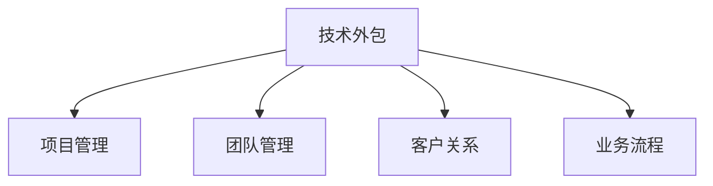

                 

# 技术外包：从接单到建立团队

> 关键词：技术外包, 项目管理, 团队管理, 软件开发, 客户关系, 业务流程

## 1. 背景介绍

### 1.1 问题由来
随着信息技术的发展和数字化转型的加速，越来越多的企业将业务外包给第三方技术团队，以应对日益复杂的业务需求和不断变化的市场环境。技术外包不仅降低了企业的运营成本，还能迅速引入外部技术和经验，提升企业竞争力。然而，技术外包同时也带来了新的挑战：如何高效管理外包项目，确保项目质量，以及如何建立稳定的团队合作关系，成为每个企业必须面对的重要问题。

### 1.2 问题核心关键点
技术外包的成功与否，取决于多个关键点：
1. **需求明确性**：明确的需求是外包项目顺利进行的基础，能够减少沟通误解，提高项目效率。
2. **项目管理**：有效的项目管理能够确保项目按时按质完成，避免资源浪费和进度延误。
3. **团队管理**：选择和管理合适的技术团队，确保团队具备完成任务所需的技能和经验。
4. **客户关系**：良好的客户关系是长期合作的基础，能够提高客户满意度和续约率。
5. **业务流程优化**：优化外包项目的业务流程，能够提升项目效率和质量，降低外包成本。

### 1.3 问题研究意义
研究技术外包从接单到建立团队的全过程，对于提升外包项目的成功率，降低企业外包成本，以及促进企业与外包团队之间的长期合作关系具有重要意义。通过对这一问题的深入分析，企业可以制定更加科学合理的外包策略，确保项目高效进行，同时建立稳定的团队合作关系，为企业数字化转型提供坚实的技术支持。

## 2. 核心概念与联系

### 2.1 核心概念概述

为更好地理解技术外包从接单到建立团队的全过程，本节将介绍几个密切相关的核心概念：

- **技术外包(Outsourcing Technology)**：企业将某些技术开发或维护工作外包给第三方技术团队，以降低运营成本，提高项目效率。
- **项目管理(Project Management)**：通过一系列计划、执行、监控和收尾等活动，确保项目按时按质完成。
- **团队管理(Team Management)**：选择和管理具备所需技能和经验的团队，以确保项目成功。
- **客户关系(Customer Relationship)**：通过建立互信、透明、高效的沟通机制，维持良好的客户关系。
- **业务流程(Business Process)**：优化外包项目的业务流程，提升项目效率和质量。

这些概念之间的逻辑关系可以通过以下Mermaid流程图来展示：



这个流程图展示了几大核心概念及其之间的关系：

1. 技术外包是整个流程的起点，为后续项目管理、团队管理、客户关系和业务流程优化提供基础。
2. 项目管理通过计划和执行活动，确保外包项目的顺利进行。
3. 团队管理选择和管理合适的技术团队，提升团队效能。
4. 客户关系建立透明的沟通机制，维护良好的客户满意度。
5. 业务流程优化提升项目效率，降低外包成本。

这些概念共同构成了技术外包项目管理的全过程，对确保项目成功和建立长期合作关系具有重要作用。

## 3. 核心算法原理 & 具体操作步骤
### 3.1 算法原理概述

技术外包项目的管理主要依赖于一系列项目管理原则和实践，以下是几个核心原理：

1. **需求明确性**：项目需求应尽可能明确、具体，减少沟通误解，提高项目效率。
2. **项目计划**：项目计划应包含时间、资源、任务分配等关键要素，确保项目按时按质完成。
3. **团队协作**：通过有效的沟通和协作机制，确保团队成员之间的信息流通和协同工作。
4. **风险管理**：识别和管理项目中的各种风险，包括技术风险、进度风险和成本风险等。
5. **质量控制**：建立严格的质控机制，确保交付物的质量符合客户要求。
6. **绩效评估**：定期评估外包团队的工作绩效，及时反馈和改进。

### 3.2 算法步骤详解

技术外包项目的管理步骤主要包括以下几个关键环节：

**Step 1: 需求分析和确定**
- 与客户进行深度交流，明确项目需求、目标和关键性能指标。
- 细化需求规格，形成详细的需求文档。
- 与客户签订合同，明确项目范围、时间、成本和质量要求。

**Step 2: 项目计划和资源配置**
- 根据需求文档，制定详细的项目计划。
- 配置所需的资源，包括人力、设备、工具和技术支持等。
- 确定项目的里程碑和关键交付物。

**Step 3: 团队组建和管理**
- 根据项目需求，选择合适的技术团队。
- 对团队进行管理和培训，确保团队成员具备所需技能。
- 建立透明的沟通机制，促进团队协作。

**Step 4: 项目执行和监控**
- 按项目计划执行各项任务，确保项目按时进行。
- 监控项目进展，及时发现和解决问题。
- 定期向客户汇报项目进展，获取客户反馈。

**Step 5: 质量控制和测试**
- 实施质量控制措施，确保交付物质量符合客户要求。
- 进行测试和验收，确保项目符合功能和技术规范。
- 记录和分析测试结果，及时改进项目质量。

**Step 6: 项目交付和验收**
- 按照合同约定交付项目，完成交付物验收。
- 与客户签订项目验收协议，确认项目合格。
- 总结项目经验，为未来项目提供参考。

### 3.3 算法优缺点

技术外包项目的管理具有以下优点：
1. **成本效益高**：通过外包技术任务，企业可以降低运营成本，提高资源利用效率。
2. **提升项目效率**：外包团队专注于特定领域，通常能够提升项目执行效率。
3. **灵活性高**：外包团队可以根据企业需求灵活调整工作量，避免资源浪费。
4. **获取先进技术**：外包团队通常具备先进的技术和经验，能够为企业带来技术创新。

同时，也存在以下缺点：
1. **沟通复杂**：外包团队与客户之间的沟通和协作可能存在误解和延迟。
2. **质量控制难度大**：外包项目质量控制需依赖于外包团队的自我管理，存在一定风险。
3. **依赖外部资源**：过度依赖外部资源可能导致项目风险增加，影响项目进度。
4. **客户关系维护困难**：客户关系需长期维护，但外包团队流动性大，维护难度较大。

尽管存在这些局限性，但就目前而言，技术外包仍是企业快速获取技术资源和提升项目效率的重要手段。未来相关研究的重点在于如何进一步优化沟通和协作机制，加强质量控制和客户关系管理，同时兼顾成本和效率的平衡。

### 3.4 算法应用领域

技术外包项目的管理方法已广泛应用于多个领域，例如：

- **软件开发**：企业外包软件开发项目，降低人力成本，提升开发效率。
- **网络安全**：外包网络安全项目，获取专业的安全技术和防护经验。
- **数据分析**：外包数据分析项目，利用外部数据科学专家的经验和技术。
- **数字营销**：外包数字营销项目，获取专业的市场分析和广告投放策略。
- **云服务管理**：外包云服务管理项目，获取云平台管理和维护经验。
- **人力资源管理**：外包人力资源管理项目，获取专业的人力资源开发和管理经验。

除了上述这些典型应用外，技术外包还在更多场景中得到广泛应用，如智能制造、智慧城市、智能交通等，为企业数字化转型提供全面的技术支持。

## 4. 数学模型和公式 & 详细讲解  
### 4.1 数学模型构建

技术外包项目的管理过程可以通过数学模型进行描述和优化。以下是几个常用的数学模型：

1. **线性规划模型**：用于优化资源配置和任务分配。
2. **网络计划技术**：用于描述项目执行过程，优化项目进度和成本。
3. **排队模型**：用于分析外包团队的工作负荷和响应时间。
4. **质量控制模型**：用于评估和改进交付物的质量。

### 4.2 公式推导过程

以线性规划模型为例，其目标函数和约束条件可以表示为：

$$
\min \sum_{i=1}^n c_i x_i
$$

$$
s.t. \sum_{i=1}^m a_{ij}x_i \geq b_j \quad \forall j \in M
$$

其中，$x_i$ 表示资源 $i$ 的分配量，$c_i$ 表示资源 $i$ 的单位成本，$a_{ij}$ 表示任务 $j$ 对资源 $i$ 的需求，$b_j$ 表示任务 $j$ 的目标值，$M$ 表示任务集合。

求解线性规划问题，可以通过单纯形法、内点法等方法实现。

### 4.3 案例分析与讲解

假设某企业需要外包一个软件开发项目，项目需求明确，预计耗时6个月，总预算为100万。企业将项目外包给A、B两个团队，A团队负责前后端开发，B团队负责测试和运维。已知A团队每天成本为1000元，B团队每天成本为800元。项目需求如下：

- 前端开发需6人，每天工作8小时，共需1个月。
- 后端开发需4人，每天工作8小时，共需3个月。
- 测试需2人，每天工作8小时，共需1个月。
- 运维需1人，每天工作8小时，共需6个月。

根据上述需求，建立线性规划模型，求解最优资源配置方案。

### 5. 项目实践：代码实例和详细解释说明
### 5.1 开发环境搭建

在进行技术外包项目管理的实践前，我们需要准备好开发环境。以下是使用Python进行项目管理的环境配置流程：

1. 安装Anaconda：从官网下载并安装Anaconda，用于创建独立的Python环境。

2. 创建并激活虚拟环境：
```bash
conda create -n project-management python=3.8 
conda activate project-management
```

3. 安装PyTorch：根据CUDA版本，从官网获取对应的安装命令。例如：
```bash
conda install pytorch torchvision torchaudio cudatoolkit=11.1 -c pytorch -c conda-forge
```

4. 安装Pandas、NumPy等工具包：
```bash
pip install pandas numpy
```

5. 安装各类项目管理系统：
```bash
pip install jira kanbanpy
```

完成上述步骤后，即可在`project-management`环境中开始项目管理实践。

### 5.2 源代码详细实现

下面我们以敏捷开发项目为例，给出使用PyTorch进行项目管理的PyTorch代码实现。

首先，定义项目信息：

```python
class Project:
    def __init__(self, name, budget, duration, teams):
        self.name = name
        self.budget = budget
        self.duration = duration
        self.teams = teams

    def calculate_team_cost(self, team, hours_per_day):
        return team['hourly_rate'] * hours_per_day * self.duration

    def calculate_total_cost(self):
        total_cost = sum(self.calculate_team_cost(team, hours_per_day)
                        for team in self.teams.values())
        return total_cost
```

然后，定义任务信息：

```python
class Task:
    def __init__(self, name, required_teams, hours_per_day, daily_hours):
        self.name = name
        self.required_teams = required_teams
        self.hours_per_day = hours_per_day
        self.daily_hours = daily_hours

    def allocate_team(self, team):
        team.allocate(self.hours_per_day)
```

接着，定义团队信息：

```python
class Team:
    def __init__(self, name, hourly_rate):
        self.name = name
        self.hourly_rate = hourly_rate
        self.allocated_hours = 0

    def allocate(self, hours):
        self.allocated_hours += hours
```

最后，定义项目管理函数：

```python
def calculate_optimal_allocation(project, tasks):
    total_cost = project.calculate_total_cost()

    for task in tasks:
        best_team = None
        best_cost = float('inf')
        for team in project.teams.values():
            cost = task.calculate_team_cost(team, task.daily_hours)
            if cost < best_cost and team.allocated_hours + task.hours_per_day <= team.max_hours_per_day:
                best_cost = cost
                best_team = team

        if best_team:
            task.allocate_team(best_team)

    return project.calculate_total_cost()
```

### 5.3 代码解读与分析

让我们再详细解读一下关键代码的实现细节：

**Project类**：
- `__init__`方法：初始化项目名称、预算、时长和外包团队信息。
- `calculate_team_cost`方法：计算特定团队的总体成本。
- `calculate_total_cost`方法：计算项目的总体成本。

**Task类**：
- `__init__`方法：初始化任务名称、所需团队、每日工作小时数和每天工作小时数。
- `allocate_team`方法：将任务分配给最优团队。

**Team类**：
- `__init__`方法：初始化团队名称、每日小时工资和已分配小时数。
- `allocate`方法：将任务分配给团队。

**calculate_optimal_allocation函数**：
- 计算项目的总体成本。
- 遍历每个任务，为其分配最优团队。

以上代码实现了基于线性规划模型的项目管理，通过优化资源分配，确保项目的成本效益最大化。

当然，实际的系统实现还需考虑更多因素，如任务优先级、团队负荷平衡等，但核心的项目管理思想基本与此类似。

## 6. 实际应用场景
### 6.1 软件开发项目

技术外包在软件开发项目中应用广泛。软件开发外包可以大幅降低企业的人力成本，同时利用外部团队的专业技能，提升开发效率和质量。

具体而言，企业可以通过外包技术外包公司的开发团队，根据项目需求进行任务分配，确保项目按时按质完成。同时，外包团队可以通过定期沟通和反馈，了解企业需求变化，及时调整开发计划。这样，企业可以专注于产品战略和市场扩展，而将具体开发任务外包给专业团队。

### 6.2 网络安全项目

网络安全是企业数字化转型的重要组成部分，通过外包网络安全项目，企业可以获得专业的安全技术和防护经验，提高网络安全水平。

具体而言，企业可以外包网络安全公司的技术团队，开展渗透测试、安全加固、应急响应等工作。外包团队通过不断渗透测试和漏洞修复，提升企业网络安全防护能力，确保企业信息系统的安全稳定。

### 6.3 数据分析项目

数据分析是企业获取业务洞察、优化决策的重要手段。通过外包数据分析项目，企业可以充分利用外部数据科学专家的经验和技能，提升数据分析的深度和广度。

具体而言，企业可以外包数据分析公司的团队，开展数据清洗、特征工程、模型构建等工作。外包团队通过数据挖掘和模型训练，提供深入的数据洞察，支持企业决策制定和业务优化。

### 6.4 未来应用展望

随着技术外包的发展，其在更多领域的应用将不断拓展，为企业的数字化转型提供全面支持。

在智慧制造领域，技术外包可以应用于生产自动化、质量控制、设备维护等方面，提升制造业的智能化水平。

在智慧城市治理中，技术外包可以应用于城市事件监测、智能交通、能源管理等方面，提高城市管理的自动化和智能化水平。

在智能交通领域，技术外包可以应用于交通数据分析、智能导航、车联网等方面，提升交通系统的效率和安全性。

除了上述这些典型应用外，技术外包还在更多场景中得到广泛应用，如金融、医疗、教育、电商等，为企业数字化转型提供强大的技术支持。相信随着技术外包的不断进步，其在各领域的落地应用将更加广泛和深入，成为企业数字化转型的重要推动力。

## 7. 工具和资源推荐
### 7.1 学习资源推荐

为了帮助开发者系统掌握技术外包的理论基础和实践技巧，这里推荐一些优质的学习资源：

1. **《敏捷项目管理指南》**：讲解敏捷项目管理方法论，帮助企业有效管理项目进度和质量。
2. **《项目管理科学与技术》**：系统介绍项目管理的基本理论和实践方法，适合初学者入门。
3. **《Outsourcing Technology》**：详细介绍技术外包的基本概念、流程和管理方法，提供丰富的案例分析。
4. **Coursera的《Project Management》课程**：提供系统化的项目管理培训，包括课程视频和实战练习。
5. **LinkedIn Learning的《Agile Project Management》课程**：讲解敏捷项目管理的方法论和实践技巧。

通过对这些资源的学习实践，相信你一定能够快速掌握技术外包的精髓，并用于解决实际的项目管理问题。

### 7.2 开发工具推荐

高效的开发离不开优秀的工具支持。以下是几款用于技术外包项目管理的常用工具：

1. **JIRA**：企业级项目管理工具，提供任务分配、进度跟踪、故障处理等功能。
2. **Trello**：基于看板的项目管理工具，支持任务分类、优先级管理、进度可视化。
3. **Asana**：团队协作平台，支持任务分配、进度跟踪、文件共享等功能。
4. **Redmine**：开源的项目管理工具，提供任务分配、进度跟踪、协作管理等功能。
5. **Confluence**：企业级知识管理平台，支持文档协作、知识分享、项目管理等功能。

合理利用这些工具，可以显著提升技术外包项目管理的效率，降低沟通和协作的复杂性。

### 7.3 相关论文推荐

技术外包研究源于学界的持续探索。以下是几篇奠基性的相关论文，推荐阅读：

1. **《The Effectiveness of Outsourcing Technology》**：总结技术外包对企业成本、效率和质量的影响，提供实证分析。
2. **《Project Management Using Agile Methodologies》**：介绍敏捷项目管理方法论，提升项目执行效率和质量。
3. **《Agile Project Management: A Systematic Review》**：系统回顾敏捷项目管理的研究进展，提供全面的理论框架。
4. **《Outsourcing in Software Development: A Survey》**：总结软件开发外包的研究进展，提供丰富的案例分析。

这些论文代表了大语言模型微调技术的发展脉络。通过学习这些前沿成果，可以帮助研究者把握学科前进方向，激发更多的创新灵感。

## 8. 总结：未来发展趋势与挑战
### 8.1 总结

本文对技术外包从接单到建立团队的全过程进行了全面系统的介绍。首先阐述了技术外包在企业管理中的重要性，明确了需求明确性、项目管理、团队管理、客户关系和业务流程优化等关键点。其次，从原理到实践，详细讲解了技术外包项目管理的数学模型和算法步骤，给出了项目管理任务开发的完整代码实例。同时，本文还广泛探讨了技术外包在软件开发、网络安全、数据分析等众多领域的应用前景，展示了技术外包范式的巨大潜力。最后，精选了技术外包的各类学习资源，力求为读者提供全方位的技术指引。

通过本文的系统梳理，可以看到，技术外包项目的管理已经形成了一套较为成熟的理论和方法，对企业高效管理外包项目具有重要意义。未来，随着企业对外包项目需求的不断增加，技术外包将迎来更大的发展机遇，为企业的数字化转型提供全面的技术支持。

### 8.2 未来发展趋势

展望未来，技术外包项目的管理将呈现以下几个发展趋势：

1. **敏捷项目管理流行**：敏捷项目管理方法论的普及，将进一步提升项目管理效率和质量，帮助企业快速适应市场变化。
2. **多项目管理优化**：随着企业外包项目数量的增加，多项目管理优化将成为企业关注的焦点，提升项目管理资源的配置效率。
3. **智能化项目管理**：人工智能和自动化技术的应用，将进一步提升项目管理效率，实现项目管理的智能化和自动化。
4. **全球化项目管理**：全球化市场的拓展，将促使企业在外包项目管理中考虑更多跨文化、跨地域的因素，提升全球协作能力。
5. **数据驱动项目管理**：大数据和人工智能技术的应用，将为项目管理提供更深入的数据洞察，优化项目管理决策。

以上趋势凸显了技术外包项目管理的广阔前景。这些方向的探索发展，将进一步提升项目管理效率，为企业数字化转型提供坚实的技术支持。

### 8.3 面临的挑战

尽管技术外包项目的管理已经取得了不少成果，但在迈向更加智能化、普适化应用的过程中，它仍面临诸多挑战：

1. **跨文化沟通难题**：外包团队与客户之间的跨文化沟通可能存在误解和困难，影响项目进展。
2. **团队稳定性问题**：外包团队的高流动性可能导致团队不稳定，影响项目质量。
3. **资源优化难度大**：外包项目涉及多个团队和资源，资源优化和分配难度较大。
4. **质量控制难度高**：外包团队的工作质量难以有效控制，存在一定风险。
5. **客户关系维护困难**：外包团队与客户之间的长期合作需要良好维护，但外包团队流动性大，维护难度较大。

尽管存在这些挑战，但通过不断优化跨文化沟通机制、提高团队稳定性、加强质量控制和客户关系管理，企业可以逐步克服这些难题，实现技术外包的高效管理。

### 8.4 研究展望

面对技术外包管理所面临的挑战，未来的研究需要在以下几个方面寻求新的突破：

1. **敏捷项目管理的优化**：进一步优化敏捷项目管理方法论，提升项目管理效率和质量。
2. **多项目管理优化算法**：开发更高效的多项目管理优化算法，提升项目管理资源的配置效率。
3. **智能化项目管理系统**：开发智能化项目管理工具，实现项目管理的自动化和智能化。
4. **全球化项目管理策略**：制定全球化项目管理策略，提升跨文化、跨地域的项目管理能力。
5. **数据驱动项目管理方法**：基于大数据和人工智能技术，优化项目管理决策，提升项目管理效果。

这些研究方向的探索，将进一步提升技术外包项目管理的效果，为企业数字化转型提供坚实的技术支持。

## 9. 附录：常见问题与解答

**Q1：如何选择合适的技术外包团队？**

A: 选择技术外包团队时，应考虑以下几个方面：
1. **团队资质**：选择具有丰富经验和专业技能的技术团队。
2. **团队规模**：团队规模应适中，既能够高效完成任务，又不过度依赖单一团队。
3. **团队文化**：团队文化应与企业文化相匹配，有利于团队协作和沟通。
4. **团队案例**：了解团队以往的项目案例，评估其能力和执行质量。

**Q2：如何有效地管理外包项目？**

A: 有效地管理外包项目，应注重以下几个方面：
1. **明确需求**：与外包团队明确项目需求，减少沟通误解。
2. **制定计划**：制定详细的项目计划，确保项目按时按质完成。
3. **监督执行**：定期监督项目进展，及时发现和解决问题。
4. **质量控制**：建立严格的质量控制机制，确保交付物质量。
5. **客户沟通**：保持与客户的透明沟通，及时获取客户反馈。

**Q3：如何处理外包团队与客户之间的沟通问题？**

A: 处理外包团队与客户之间的沟通问题，应注重以下几个方面：
1. **定期沟通**：定期与外包团队和客户进行沟通，确保信息透明和及时。
2. **明确沟通渠道**：明确沟通渠道和沟通方式，避免信息传递错误。
3. **跨文化培训**：对外包团队进行跨文化培训，提升沟通能力。
4. **建立反馈机制**：建立反馈机制，及时处理沟通问题。

**Q4：如何应对外包团队的高流动性？**

A: 应对外包团队的高流动性，应注重以下几个方面：
1. **建立稳定团队**：选择长期稳定的外包团队，减少流动性。
2. **团队培训**：对外包团队进行系统培训，提升其技术能力和企业忠诚度。
3. **绩效激励**：建立绩效激励机制，提高团队稳定性。

**Q5：如何处理外包项目的质量控制问题？**

A: 处理外包项目的质量控制问题，应注重以下几个方面：
1. **制定标准**：制定详细的质量标准和验收流程，确保交付物质量。
2. **持续监控**：定期监控项目进展和交付物质量，及时发现和解决问题。
3. **反馈改进**：建立反馈机制，及时改进项目质量。

这些问题的回答，可以帮助企业更好地应对技术外包项目管理的挑战，确保项目顺利进行，实现数字化转型的目标。

---

作者：禅与计算机程序设计艺术 / Zen and the Art of Computer Programming

