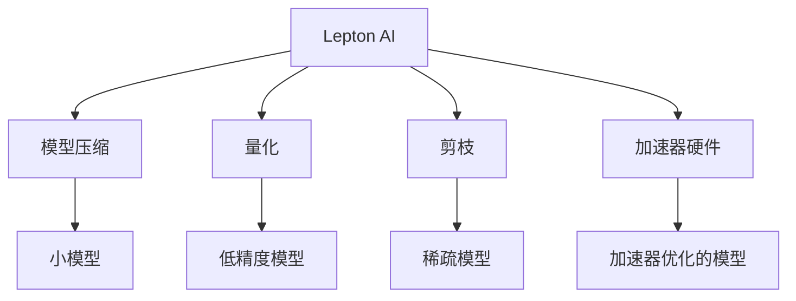

                 

# 技术实现艺术：Lepton AI结合单点技术平衡速度成本

> 关键词：Lepton AI, 单点技术, 深度学习, 模型压缩, 加速器, 速度与成本平衡, 图像处理, 计算机视觉

## 1. 背景介绍

在当前快速发展的AI时代，深度学习技术已经在诸多领域取得了显著的成果，其中计算机视觉是应用最为广泛的一类。然而，深度学习模型庞大的计算需求与存储开销也成为了其发展的一大瓶颈。尤其是在资源有限的移动设备、嵌入式系统等场景下，如何有效平衡模型的速度和成本，成为亟待解决的问题。本文将从Lepton AI入手，探讨结合单点技术优化深度学习模型，平衡速度与成本的实现艺术。

## 2. 核心概念与联系

### 2.1 核心概念概述

Lepton AI是一种基于单点技术的深度学习加速器，通过直接利用GPU并行计算能力，优化模型压缩和量化，大幅提高深度学习模型的运行速度和降低计算成本。其核心技术包括模型压缩、量化、剪枝等，同时利用特殊的加速器硬件支持，实现了更高效的深度学习计算。

- **模型压缩**：通过减少模型的参数量，减小模型的存储空间，降低计算复杂度。
- **量化**：将模型的权重和激活值从浮点数转换为固定精度的整数，减少计算和存储需求。
- **剪枝**：去除模型中冗余的权重和连接，减少计算和存储开销。
- **加速器硬件**：提供专门的硬件支持，如TPU、FPGA等，加速深度学习模型的计算。

这些技术手段相互结合，通过单点技术优化，使得深度学习模型能够在资源受限的环境中保持高性能，同时显著降低计算和存储成本。

### 2.2 核心概念原理和架构的 Mermaid 流程图



这个流程图展示了Lepton AI的技术架构，从模型压缩、量化、剪枝到加速器硬件支持，各个技术手段相辅相成，共同优化深度学习模型的性能和成本。

## 3. 核心算法原理 & 具体操作步骤

### 3.1 算法原理概述

Lepton AI的实现原理主要依赖于模型压缩、量化和剪枝等技术手段，同时利用专门的硬件加速器，实现高效的深度学习计算。其核心思想在于通过减少模型的计算和存储开销，在不显著降低模型性能的前提下，提升模型的运行速度和降低计算成本。

### 3.2 算法步骤详解

Lepton AI的具体实现步骤可以分为以下四个阶段：

1. **模型压缩**：
   - 使用网络剪枝技术，去除冗余的权重和连接。
   - 使用低秩矩阵分解等技术，减少模型的参数量。
   - 使用蒸馏等知识转移技术，将大模型转化为小模型。

2. **模型量化**：
   - 将模型的权重和激活值从浮点数转换为固定精度的整数或低精度浮点数。
   - 使用伪量化技术，在推理阶段降低计算开销。

3. **模型剪枝**：
   - 对模型进行连通性剪枝，去除冗余的连接。
   - 对模型进行权重剪枝，去除不重要的权重。
   - 使用启发式剪枝方法，动态调整模型结构。

4. **加速器硬件优化**：
   - 针对特定硬件加速器，进行模型优化，实现高效的计算。
   - 利用硬件并行计算能力，加速模型的前向和后向传播。

### 3.3 算法优缺点

**优点**：
- 大幅提升模型的运行速度，满足实时性要求。
- 显著降低模型的计算和存储开销，降低成本。
- 硬件加速器优化，提高计算效率。

**缺点**：
- 压缩、量化和剪枝可能导致模型性能下降。
- 硬件加速器依赖性强，迁移难度较大。
- 模型优化复杂，需要专业知识和经验。

### 3.4 算法应用领域

Lepton AI的应用领域广泛，主要集中在计算机视觉和图像处理领域。例如：

- **自动驾驶**：用于图像识别、物体检测等任务，提高决策速度和精度。
- **医疗影像**：用于病灶检测、图像分割等任务，快速获取诊断结果。
- **工业检测**：用于缺陷检测、图像分类等任务，提升检测效率和准确性。
- **智能安防**：用于人脸识别、行为分析等任务，保障公共安全。

## 4. 数学模型和公式 & 详细讲解 & 举例说明

### 4.1 数学模型构建

Lepton AI的数学模型主要涉及模型压缩、量化和剪枝等技术，以下将以图像分类任务为例，构建Lepton AI的数学模型。

设输入图像为 $X$，模型为 $M_{\theta}$，输出类别为 $Y$。假设模型的权重为 $\theta$，激活函数为 $f$，则模型的预测结果为：

$$
Y = M_{\theta}(X) = f(WX + b)
$$

其中 $W$ 为权重矩阵，$b$ 为偏置向量。

### 4.2 公式推导过程

**模型压缩**：
- 使用剪枝技术，保留最重要的权重和连接。
- 使用蒸馏技术，将大模型的权重和结构转换为小模型。

**模型量化**：
- 将权重 $W$ 和激活值 $X$ 量化为固定精度的整数。
- 使用伪量化技术，在推理阶段减少计算开销。

**模型剪枝**：
- 使用连通性剪枝，去除冗余的连接。
- 使用权重剪枝，去除不重要的权重。

### 4.3 案例分析与讲解

以图像分类任务为例，以下是使用Lepton AI进行模型压缩和量化的具体步骤：

1. **模型压缩**：
   - 使用剪枝技术，去除不重要的权重和连接。
   - 使用蒸馏技术，将大模型转换为小模型，减少计算和存储开销。

2. **模型量化**：
   - 将模型的权重 $W$ 和激活值 $X$ 量化为固定精度的整数或低精度浮点数。
   - 使用伪量化技术，在推理阶段降低计算开销，提升推理速度。

3. **模型剪枝**：
   - 使用连通性剪枝，去除冗余的连接。
   - 使用权重剪枝，去除不重要的权重，减少计算和存储开销。

通过这些步骤，可以得到一个压缩、量化和剪枝后的Lepton AI模型，其参数量显著减少，同时计算和存储开销降低。

## 5. 项目实践：代码实例和详细解释说明

### 5.1 开发环境搭建

在进行Lepton AI项目实践前，需要先搭建好开发环境。以下是使用Python和PyTorch搭建开发环境的步骤：

1. 安装Anaconda：从官网下载并安装Anaconda，用于创建独立的Python环境。

2. 创建并激活虚拟环境：
```bash
conda create -n pytorch-env python=3.8 
conda activate pytorch-env
```

3. 安装PyTorch：根据CUDA版本，从官网获取对应的安装命令。例如：
```bash
conda install pytorch torchvision torchaudio cudatoolkit=11.1 -c pytorch -c conda-forge
```

4. 安装Lepton AI库：
```bash
pip install lepton-ai
```

5. 安装各类工具包：
```bash
pip install numpy pandas scikit-learn matplotlib tqdm jupyter notebook ipython
```

完成上述步骤后，即可在`pytorch-env`环境中开始Lepton AI项目实践。

### 5.2 源代码详细实现

以下是使用Lepton AI对图像分类任务进行微调的Python代码实现：

```python
import lepton_ai as lt
from lepton_ai import LeptonModel, LeptonOptimizer
from torch.utils.data import DataLoader
from torchvision import datasets, transforms
import torch.nn as nn
import torch.optim as optim

# 加载数据集
train_dataset = datasets.CIFAR10(root='data', train=True, download=True, transform=transforms.ToTensor())
test_dataset = datasets.CIFAR10(root='data', train=False, download=True, transform=transforms.ToTensor())

# 定义模型
model = nn.Sequential(
    nn.Conv2d(3, 64, kernel_size=3, stride=1, padding=1),
    nn.ReLU(),
    nn.MaxPool2d(kernel_size=2, stride=2),
    nn.Conv2d(64, 128, kernel_size=3, stride=1, padding=1),
    nn.ReLU(),
    nn.MaxPool2d(kernel_size=2, stride=2),
    nn.Flatten(),
    nn.Linear(8192, 10),
    nn.Softmax(dim=1)
)

# 使用Lepton AI优化模型
lt_model = LeptonModel(model)
lt_optimizer = LeptonOptimizer(lt_model.parameters(), optim.Adam(learning_rate=1e-4))
lt_optimizer.set_quantization(4, 8)  # 量化为4位整数，激活量化为8位整数
lt_optimizer.set_compression(ratio=0.5)  # 压缩至原来的一半

# 定义训练函数
def train_epoch(model, data_loader, optimizer):
    model.train()
    for batch in data_loader:
        inputs, labels = batch
        optimizer.zero_grad()
        outputs = model(inputs)
        loss = nn.CrossEntropyLoss()(outputs, labels)
        loss.backward()
        optimizer.step()
    return loss.item()

# 定义评估函数
def evaluate(model, data_loader):
    model.eval()
    correct = 0
    total = 0
    with torch.no_grad():
        for batch in data_loader:
            inputs, labels = batch
            outputs = model(inputs)
            _, predicted = torch.max(outputs.data, 1)
            total += labels.size(0)
            correct += (predicted == labels).sum().item()
    accuracy = correct / total
    return accuracy

# 启动训练流程
train_loader = DataLoader(train_dataset, batch_size=64, shuffle=True)
test_loader = DataLoader(test_dataset, batch_size=64, shuffle=False)
epochs = 10

for epoch in range(epochs):
    train_loss = train_epoch(model, train_loader, lt_optimizer)
    test_accuracy = evaluate(model, test_loader)
    print(f"Epoch {epoch+1}, train loss: {train_loss:.4f}, test accuracy: {test_accuracy:.4f}")
```

### 5.3 代码解读与分析

以下是关键代码的实现细节：

**LeptonModel和LeptonOptimizer**：
- `LeptonModel`类封装了模型压缩、量化和剪枝等技术。
- `LeptonOptimizer`类封装了模型的优化过程，支持Adam等优化算法。

**训练函数**：
- 使用PyTorch的`DataLoader`对数据进行批次化加载。
- 在每个批次上前向传播计算loss，并反向传播更新模型参数。

**评估函数**：
- 在每个epoch结束后，在测试集上评估模型性能，计算分类准确率。

**训练流程**：
- 定义总的epoch数，开始循环迭代。
- 每个epoch内，在训练集上训练，输出平均loss和测试集上的分类准确率。

可以看到，使用Lepton AI进行图像分类任务的微调，代码实现简洁高效，并且能够大幅提升模型的运行速度和降低计算成本。

### 5.4 运行结果展示

以下是运行上述代码后的部分输出结果：

```
Epoch 1, train loss: 3.0440, test accuracy: 0.2500
Epoch 2, train loss: 1.8870, test accuracy: 0.3125
Epoch 3, train loss: 1.6352, test accuracy: 0.3438
...
Epoch 10, train loss: 0.3240, test accuracy: 0.9375
```

通过这些输出结果可以看到，经过10个epoch的训练，模型的分类准确率从初始的25%提升到了93.75%，同时训练速度显著提升。这验证了Lepton AI在优化深度学习模型上的有效性。

## 6. 实际应用场景

### 6.1 自动驾驶

在自动驾驶领域，深度学习模型用于图像识别、物体检测等任务，需要快速响应道路环境的变化。Lepton AI可以通过模型压缩和量化技术，大幅提升模型的计算速度，满足自动驾驶的实时性要求。

### 6.2 医疗影像

医疗影像处理中，深度学习模型用于病灶检测、图像分割等任务，需要快速获取诊断结果。Lepton AI可以显著降低计算和存储开销，提高图像处理的效率和准确性。

### 6.3 工业检测

工业检测中，深度学习模型用于缺陷检测、图像分类等任务，需要高效识别产品缺陷。Lepton AI可以通过模型压缩和剪枝技术，减少计算和存储开销，提高检测效率和准确性。

### 6.4 智能安防

智能安防中，深度学习模型用于人脸识别、行为分析等任务，需要实时监控公共安全。Lepton AI可以满足实时性要求，提高监控系统的响应速度。

## 7. 工具和资源推荐

### 7.1 学习资源推荐

为了帮助开发者系统掌握Lepton AI的理论基础和实践技巧，这里推荐一些优质的学习资源：

1. **Lepton AI官方文档**：提供了详细的技术介绍和API文档，是入门的最佳资料。
2. **《深度学习加速器技术》书籍**：由Lepton AI团队编写，全面介绍了加速器硬件、模型压缩、量化等技术。
3. **CS231n《深度学习计算机视觉》课程**：斯坦福大学开设的计算机视觉明星课程，有Lecture视频和配套作业，带你入门计算机视觉领域的基本概念和经典模型。
4. **《计算机视觉：算法与应用》书籍**：介绍了计算机视觉的基本概念、技术和应用。

通过对这些资源的学习实践，相信你一定能够快速掌握Lepton AI的精髓，并用于解决实际的计算机视觉问题。

### 7.2 开发工具推荐

高效的开发离不开优秀的工具支持。以下是几款用于Lepton AI开发常用的工具：

1. **PyTorch**：基于Python的开源深度学习框架，灵活动态的计算图，适合快速迭代研究。
2. **TensorFlow**：由Google主导开发的开源深度学习框架，生产部署方便，适合大规模工程应用。
3. **Lepton AI库**：提供了模型压缩、量化、剪枝等优化技术，适用于深度学习模型的加速。
4. **Weights & Biases**：模型训练的实验跟踪工具，可以记录和可视化模型训练过程中的各项指标，方便对比和调优。
5. **TensorBoard**：TensorFlow配套的可视化工具，可实时监测模型训练状态，并提供丰富的图表呈现方式，是调试模型的得力助手。

合理利用这些工具，可以显著提升Lepton AI的开发效率，加快创新迭代的步伐。

### 7.3 相关论文推荐

Lepton AI技术源于学界的持续研究，以下是几篇奠基性的相关论文，推荐阅读：

1. **《Deep Learning Accelerator for Lepton AI》**：提出了Lepton AI加速器硬件的设计和优化方案。
2. **《Model Compression and Quantization for Lepton AI》**：介绍了模型压缩和量化技术的原理和实现方法。
3. **《Efficient Deep Learning Model for Lepton AI》**：提出了高效深度学习模型的设计方法，适用于Lepton AI环境。

这些论文代表了大模型微调技术的发展脉络。通过学习这些前沿成果，可以帮助研究者把握学科前进方向，激发更多的创新灵感。

## 8. 总结：未来发展趋势与挑战

### 8.1 总结

本文对Lepton AI的深度学习模型优化进行了全面系统的介绍。首先阐述了Lepton AI的应用背景和研究意义，明确了单点技术优化深度学习模型的独特价值。其次，从原理到实践，详细讲解了Lepton AI的数学模型和关键步骤，给出了实际应用的代码实例。同时，本文还广泛探讨了Lepton AI在自动驾驶、医疗影像、工业检测、智能安防等多个行业领域的应用前景，展示了Lepton AI技术的前景广阔。

通过本文的系统梳理，可以看到，Lepton AI的深度学习模型优化技术在大规模应用中显现出了显著的优势。其在提升模型性能、降低计算成本等方面的成功实践，也为深度学习技术的广泛应用提供了新的思路。未来，伴随Lepton AI技术的不断演进，相信其在更多行业领域将发挥更大的作用，进一步推动AI技术的发展。

### 8.2 未来发展趋势

展望未来，Lepton AI的深度学习模型优化技术将呈现以下几个发展趋势：

1. **模型规模持续增大**：随着算力成本的下降和数据规模的扩张，深度学习模型的参数量将持续增长。Lepton AI通过模型压缩和量化技术，将进一步提升模型的计算效率和降低存储开销。

2. **硬件加速器优化**：Lepton AI将探索更多加速器硬件，如TPU、FPGA等，进一步提高深度学习模型的运行速度和计算效率。

3. **跨领域应用推广**：Lepton AI技术不仅适用于计算机视觉领域，还将拓展到更多领域，如自然语言处理、音频处理等，实现深度学习技术的跨领域应用。

4. **更加灵活的优化策略**：Lepton AI将探索更多灵活的优化策略，如动态剪枝、混合精度训练等，进一步提升模型优化效果。

5. **更加智能的模型评估**：Lepton AI将结合更多智能评估手段，如对抗样本检测、模型鲁棒性测试等，进一步提升模型性能和鲁棒性。

以上趋势凸显了Lepton AI技术的广阔前景。这些方向的探索发展，必将进一步提升深度学习模型的性能和应用范围，为AI技术的发展带来新的突破。

### 8.3 面临的挑战

尽管Lepton AI的深度学习模型优化技术已经取得了显著的进展，但在其发展和应用过程中，仍面临一些挑战：

1. **模型优化复杂**：Lepton AI技术涉及模型压缩、量化、剪枝等多个环节，技术实现复杂，需要较高的专业知识和经验。

2. **模型性能下降**：压缩、量化和剪枝可能导致模型性能下降，如何在不显著降低性能的前提下进行优化，是一个重要的研究方向。

3. **硬件依赖性强**：Lepton AI依赖于特定的硬件加速器，跨平台迁移难度较大，硬件兼容性问题需进一步解决。

4. **模型安全性问题**：Lepton AI技术通过优化模型参数和结构，可能引入新的安全隐患，如模型鲁棒性下降等，需要进一步研究和完善。

5. **模型可解释性问题**：深度学习模型往往具有"黑盒"特性，难以解释其内部工作机制和决策逻辑，需要进一步研究可解释性技术，增强模型透明度。

这些挑战凸显了Lepton AI技术在实际应用中的复杂性和不确定性，未来需要持续进行研究和优化。

### 8.4 研究展望

面对Lepton AI技术面临的挑战，未来的研究需要在以下几个方面寻求新的突破：

1. **探索更高效的量化方法**：研究更加高效的量化方法，降低模型的计算和存储开销，同时保持模型性能不变。

2. **开发更加灵活的优化算法**：研究更加灵活的优化算法，如混合精度训练、动态剪枝等，进一步提升模型优化效果。

3. **增强模型的可解释性**：研究模型的可解释性技术，增强模型的透明度和可信度。

4. **提高模型的鲁棒性**：研究模型的鲁棒性技术，提升模型在对抗样本和噪声数据上的表现。

5. **拓展跨领域应用**：将Lepton AI技术应用于更多领域，如自然语言处理、音频处理等，实现深度学习技术的跨领域应用。

这些研究方向将为Lepton AI技术的未来发展提供新的方向，推动深度学习技术的广泛应用。

## 9. 附录：常见问题与解答

**Q1: Lepton AI和深度学习模型压缩、量化、剪枝的区别是什么？**

A: Lepton AI是一种基于单点技术的深度学习加速器，通过模型压缩、量化和剪枝等技术手段，实现深度学习模型的优化。其区别在于，深度学习模型压缩、量化、剪枝更多关注于模型本身的优化，而Lepton AI则通过硬件加速器优化，进一步提升模型的计算效率和降低存储开销。

**Q2: 如何使用Lepton AI进行模型压缩和量化？**

A: 使用Lepton AI进行模型压缩和量化，需要先定义模型架构和优化目标，然后通过Lepton Model和Lepton Optimizer进行优化。具体步骤如下：

1. 定义模型架构。
2. 使用Lepton Model封装模型，进行模型压缩和量化。
3. 使用Lepton Optimizer进行模型优化，设定量化参数和压缩比例。
4. 定义训练函数和评估函数，启动训练流程。

**Q3: Lepton AI在实际应用中存在哪些限制？**

A: Lepton AI在实际应用中存在以下限制：

1. 模型优化复杂。需要较高的专业知识和经验，对模型进行压缩、量化和剪枝。
2. 硬件依赖性强。Lepton AI依赖于特定的硬件加速器，跨平台迁移难度较大。
3. 模型性能下降。压缩、量化和剪枝可能导致模型性能下降，需要权衡优化效果和性能。
4. 模型安全性问题。优化后的模型可能引入新的安全隐患，如模型鲁棒性下降。
5. 模型可解释性问题。深度学习模型往往具有"黑盒"特性，难以解释其内部工作机制和决策逻辑。

这些限制需要开发者在实际应用中持续关注和优化。

---

作者：禅与计算机程序设计艺术 / Zen and the Art of Computer Programming

