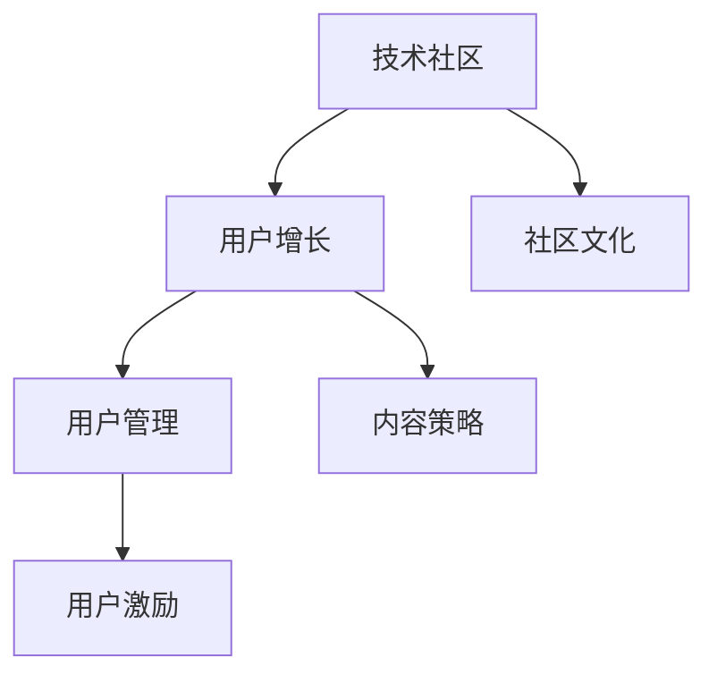

                 

# 技术社区建设：从0到10万用户

> 关键词：技术社区，用户增长，社区管理，用户激励，用户留存

## 1. 背景介绍

### 1.1 问题由来

随着互联网技术的不断进步，技术社区的建设已成为众多科技公司和创业者的重要方向。技术社区不仅是一个提供知识分享和经验交流的平台，更是汇聚全球技术精英的智慧宝库。构建一个成功且可持续发展的技术社区，可以提升公司在技术领域的影响力，增强品牌吸引力，带动更多人才和企业参与合作。

然而，技术社区的建设并不是一件容易的事情。从零开始，如何吸引用户、保持用户活跃度、提高社区价值，成为每一个技术社区运营者必须面对的挑战。本文将深入探讨技术社区建设的过程，并总结出一系列行之有效的方法和策略，为社区管理者提供实用的指导。

### 1.2 问题核心关键点

技术社区建设的成功，关键在于以下几个方面：

1. **用户定位与需求分析**：明确社区的目标用户群，分析用户需求，制定合理的社区规划和运营策略。
2. **内容丰富与质量保证**：提供高质量、多样化的内容，吸引用户参与和分享。
3. **活跃用户管理**：通过有效的用户激励机制和互动方式，提升用户活跃度和参与度。
4. **社区生态建设**：构建一个健康的社区环境，鼓励开放、包容、合作的精神，吸引更多技术人才加入。

## 2. 核心概念与联系

### 2.1 核心概念概述

为更好地理解技术社区的建设过程，本节将介绍几个密切相关的核心概念：

- **技术社区**：以技术交流、知识分享为核心目标，吸引全球技术人才参与讨论、分享经验、解决技术问题的网络平台。
- **用户增长**：通过有效策略，逐步增加社区的活跃用户数和影响力。
- **用户管理**：针对社区用户的行为和需求，实施科学的运营策略，提升用户满意度和忠诚度。
- **内容策略**：根据用户需求，规划和优化内容发布，提高社区内容的吸引力和价值。
- **用户激励**：通过奖励机制和互动方式，激发用户参与和贡献，提升社区活跃度。
- **社区文化**：培育一个积极向上、开放包容的社区氛围，促进技术交流和合作。

这些概念之间的逻辑关系可以通过以下Mermaid流程图来展示：



这个流程图展示了技术社区建设的各个关键环节及其相互关系：

1. 技术社区作为基础平台，通过用户增长和内容策略吸引用户参与，进而通过用户管理提升用户活跃度。
2. 用户激励机制进一步激发用户参与，促进社区文化的形成和传播。
3. 社区文化反过来又吸引更多技术人才加入，形成良性循环。

## 3. 核心算法原理 & 具体操作步骤

### 3.1 算法原理概述

技术社区的用户增长和活跃度提升，是一个复杂的系统工程。本文将从系统设计的角度，介绍一种基于用户行为的算法模型，该模型能够帮助社区管理者全面监控和优化社区运营策略。

该模型主要基于以下假设：

1. **用户行为预测**：通过历史数据，预测用户未来的行为和需求，从而制定更有效的运营策略。
2. **社区价值提升**：通过内容发布和用户互动，提升社区的价值和吸引力，吸引更多用户加入。
3. **用户留存优化**：通过科学的激励机制，提升用户留存率，减少用户流失。

### 3.2 算法步骤详解

该算法模型的构建步骤如下：

**Step 1: 数据收集与预处理**
- 收集社区用户的历史行为数据，如登录次数、浏览时间、发布内容等。
- 对数据进行清洗和预处理，确保数据的完整性和准确性。

**Step 2: 用户行为分析**
- 使用机器学习算法，如聚类分析和回归分析，对用户行为进行建模。
- 根据用户的行为特征，预测其未来的行为和需求，识别潜在的高价值用户。

**Step 3: 内容推荐与发布**
- 根据用户行为预测结果，规划和优化内容发布策略，确保内容多样化和高价值。
- 使用推荐算法，如协同过滤和基于内容的推荐，提高内容的相关性和吸引力。

**Step 4: 用户激励与互动**
- 设计科学的激励机制，如积分系统、排行榜和奖励活动，激发用户参与和贡献。
- 鼓励用户互动，如提问、回答和评论，增加用户之间的交流和合作。

**Step 5: 用户留存优化**
- 监控用户行为，识别流失风险，及时采取措施进行挽留。
- 使用行为分析工具，如热力图和用户路径分析，优化社区功能和用户界面。

**Step 6: 社区文化建设**
- 通过用户反馈和互动，培育积极的社区文化，如合作、包容和开放。
- 定期举办社区活动，如技术沙龙和比赛，提升社区凝聚力和影响力。

### 3.3 算法优缺点

基于用户行为的技术社区算法模型，具有以下优点：

1. **科学性与可行性**：通过数据驱动的方法，确保社区运营策略的科学性和可行性。
2. **灵活性与可扩展性**：可以根据社区特点和需求，灵活调整算法模型，提升运营效果。
3. **高效性与自动化**：通过算法自动化处理用户数据，提升运营效率和响应速度。

同时，该模型也存在一些缺点：

1. **数据依赖性**：模型的效果依赖于高质量、全面的数据，数据采集和清洗成本较高。
2. **动态性不足**：模型无法实时调整，对于突发的用户需求和行为变化，反应速度较慢。
3. **复杂性较高**：需要较强的技术背景和数据分析能力，实施难度较大。

尽管存在这些局限，但该模型仍是大规模技术社区建设中的重要工具。未来相关研究将重点放在如何进一步简化模型结构，提高模型的动态性和鲁棒性，以适应更多复杂多变的社区运营场景。

### 3.4 算法应用领域

基于用户行为的技术社区算法模型，在多个领域都有广泛应用，如：

1. **开源社区**：如GitHub、Stack Overflow等，通过数据分析和算法优化，提升开源项目的贡献度和用户参与度。
2. **企业内网**：如企业知识共享平台、技术支持社区等，帮助企业内部技术人员解决技术问题，促进知识共享。
3. **技术论坛**：如CSDN、知乎等，通过推荐算法和用户管理，提升论坛的活跃度和用户满意度。
4. **技术博客**：如Medium、掘金等，通过用户行为分析，优化内容发布策略，提高博客访问量和用户互动。

这些领域中，技术社区建设的成功与否，直接关系到公司的技术创新能力、品牌影响力和人才吸引力度。本文的技术模型为这些领域的社区建设提供了强有力的支持。

## 4. 数学模型和公式 & 详细讲解 & 举例说明

### 4.1 数学模型构建

本节将使用数学语言对技术社区用户增长模型的构建进行严格描述。

记社区用户数为 $N_t$，历史数据集为 $\{(x_i,y_i)\}_{i=1}^N$，其中 $x_i$ 为历史行为数据，$y_i$ 为后续行为预测结果。

定义预测模型为 $F(x)$，目标是最小化预测误差 $E$，即：

$$
E = \sum_{i=1}^N |F(x_i) - y_i|
$$

在实践中，我们通常使用基于梯度的优化算法（如SGD、Adam等）来近似求解上述最优化问题。设 $\eta$ 为学习率，则参数的更新公式为：

$$
\theta \leftarrow \theta - \eta \nabla_{\theta}E
$$

其中 $\nabla_{\theta}E$ 为误差函数对参数 $\theta$ 的梯度，可通过反向传播算法高效计算。

### 4.2 公式推导过程

以下我们以用户流失预测为例，推导最小二乘回归模型的预测公式。

记用户流失率为 $p_i$，历史数据为 $(x_i, p_i)$，其中 $x_i$ 为历史行为数据，$p_i$ 为后续流失概率。

最小二乘回归模型的预测公式为：

$$
\hat{p}_i = F(x_i) = \alpha + \sum_{j=1}^d \beta_j x_{ij}
$$

其中 $\alpha$ 为截距项，$\beta_j$ 为特征系数，$d$ 为特征数。通过求解 $\nabla_{\theta}E$ 可得：

$$
\nabla_{\theta}E = \sum_{i=1}^N (\hat{p}_i - p_i) \nabla_{\theta}\hat{p}_i = \sum_{i=1}^N (\hat{p}_i - p_i) (\frac{\partial \hat{p}_i}{\partial \theta})
$$

将 $\hat{p}_i$ 代入上式，得：

$$
\nabla_{\theta}E = \sum_{i=1}^N (\alpha + \sum_{j=1}^d \beta_j x_{ij} - p_i) (\sum_{j=1}^d \beta_j \frac{\partial x_{ij}}{\partial \theta})
$$

通过求解 $\nabla_{\theta}E = 0$，可得系数 $\beta_j$ 和截距项 $\alpha$ 的更新公式：

$$
\beta_j \leftarrow \beta_j - \eta \sum_{i=1}^N (\alpha + \sum_{j=1}^d \beta_j x_{ij} - p_i) (\sum_{j=1}^d \beta_j \frac{\partial x_{ij}}{\partial \theta})
$$

$$
\alpha \leftarrow \alpha - \eta \sum_{i=1}^N (\alpha + \sum_{j=1}^d \beta_j x_{ij} - p_i)
$$

在得到模型系数后，即可将其应用于新的历史行为数据，预测用户流失概率。

### 4.3 案例分析与讲解

假设某技术社区用户流失预测数据集如下：

| 用户ID | 登录天数 | 发布内容数 | 点赞数 | 流失概率 |
| --- | --- | --- | --- | --- |
| A | 100 | 50 | 200 | 0.05 |
| B | 200 | 100 | 500 | 0.1 |
| ... | ... | ... | ... | ... |

我们可以使用上述最小二乘回归模型，对用户流失概率进行预测。具体步骤如下：

1. 收集历史数据，构造数据矩阵 $X$ 和标签向量 $y$。
2. 使用梯度下降算法，对模型系数 $\beta$ 和截距项 $\alpha$ 进行优化，得到最优模型。
3. 将新的历史数据 $x$ 代入模型，计算预测结果 $\hat{y}$。
4. 对比预测结果与实际流失概率，评估模型性能。

通过上述过程，我们可以对用户流失进行预测，并采取相应的留存策略。

## 5. 项目实践：代码实例和详细解释说明

### 5.1 开发环境搭建

在进行技术社区用户增长模型的开发实践前，我们需要准备好开发环境。以下是使用Python进行Scikit-learn开发的环境配置流程：

1. 安装Anaconda：从官网下载并安装Anaconda，用于创建独立的Python环境。

2. 创建并激活虚拟环境：
```bash
conda create -n pytorch-env python=3.8 
conda activate pytorch-env
```

3. 安装Scikit-learn：
```bash
pip install scikit-learn
```

4. 安装相关工具包：
```bash
pip install numpy pandas matplotlib sklearn jupyter notebook ipython
```

完成上述步骤后，即可在`pytorch-env`环境中开始实践。

### 5.2 源代码详细实现

下面以用户流失预测为例，给出使用Scikit-learn进行最小二乘回归建模的Python代码实现。

首先，定义数据预处理函数：

```python
import numpy as np
from sklearn.preprocessing import StandardScaler
from sklearn.linear_model import LinearRegression

def preprocess_data(X, y):
    # 标准化数据
    scaler = StandardScaler()
    X = scaler.fit_transform(X)
    # 分割训练集和测试集
    train_X = X[:N_train]
    train_y = y[:N_train]
    test_X = X[N_train:]
    test_y = y[N_train:]
    return train_X, train_y, test_X, test_y
```

然后，定义最小二乘回归模型：

```python
class LinearRegressionModel:
    def __init__(self):
        self.model = LinearRegression()

    def train(self, train_X, train_y, N_train):
        self.model.fit(train_X, train_y)
        return self.model

    def predict(self, X, model):
        X = StandardScaler().fit_transform(X)
        return model.predict(X)
```

接着，定义模型评估函数：

```python
from sklearn.metrics import mean_squared_error

def evaluate(model, X, y):
    y_pred = model.predict(X)
    mse = mean_squared_error(y, y_pred)
    return mse
```

最后，启动训练流程并在测试集上评估：

```python
from sklearn.model_selection import train_test_split

# 加载数据集
data = pd.read_csv('user_data.csv')
X = data.drop(['user_id', '流失概率'], axis=1)
y = data['流失概率']

# 数据预处理
train_X, train_y, test_X, test_y = preprocess_data(X, y)

# 模型训练
model = LinearRegressionModel()
model.train(train_X, train_y, N_train)

# 模型评估
mse = evaluate(model, test_X, test_y)
print(f"Test set MSE: {mse:.3f}")
```

以上就是使用Scikit-learn进行最小二乘回归建模的完整代码实现。可以看到，Scikit-learn提供了丰富的机器学习算法和工具，使模型的构建和评估过程变得简洁高效。

### 5.3 代码解读与分析

让我们再详细解读一下关键代码的实现细节：

**preprocess_data函数**：
- 该函数接收训练集和测试集的数据，首先使用StandardScaler对数据进行标准化处理，然后按照一定比例分割训练集和测试集。

**LinearRegressionModel类**：
- 该类定义了线性回归模型的训练和预测方法。在训练过程中，使用LinearRegression模型进行拟合；在预测过程中，先对新数据进行标准化处理，然后通过模型进行预测。

**evaluate函数**：
- 该函数接收训练好的模型和新数据，计算预测值和真实值之间的均方误差（MSE），评估模型性能。

**训练流程**：
- 加载用户数据集，先使用preprocess_data函数对数据进行预处理，然后定义LinearRegressionModel类，进行模型训练，最后使用evaluate函数评估模型在测试集上的性能。

可以看到，Scikit-learn的封装性和易用性使得机器学习模型的构建和评估变得简单高效。开发者可以根据具体需求，选择不同的算法和工具，快速实现模型开发和优化。

## 6. 实际应用场景

### 6.1 智能客服系统

智能客服系统是技术社区的重要应用场景之一。通过智能客服系统，企业可以24/7全天候为顾客提供优质服务，提升用户体验和满意度。

在智能客服系统的构建过程中，基于用户行为的技术社区算法模型可以发挥重要作用。通过分析用户的历史互动记录、问题类型和解决效率，可以预测用户的下一次咨询需求，提前准备相应的解决方案，减少等待时间，提升服务效率。

### 6.2 金融风险监控

金融领域对数据和算法的实时性和准确性要求较高，基于用户行为的技术社区算法模型可以显著提升风险监控的及时性和准确性。

例如，在股票交易平台，通过分析用户的交易行为、交易频率和资金流水，可以预测用户可能存在的风险行为，提前介入进行风险控制，减少资金损失。

### 6.3 电商推荐系统

电商推荐系统通过个性化推荐提升用户购买体验和满意度，是技术社区的重要应用方向之一。

基于用户行为的技术社区算法模型可以用于分析用户的浏览和购买记录，预测用户的潜在需求，生成个性化的推荐内容，提升用户粘性和转化率。

### 6.4 未来应用展望

随着技术社区建设的不断深入，未来大模型将在更多领域得到应用，为各行各业带来变革性影响。

在智慧医疗领域，基于用户行为的技术社区算法模型可以帮助医生分析患者的病历数据，预测病情发展，提供个性化的治疗建议，提升医疗服务质量。

在智能教育领域，通过分析学生的学习行为和互动记录，可以预测学生的学习状态和需求，提供个性化的学习计划和辅导，提升教育效果。

在智慧城市治理中，基于用户行为的技术社区算法模型可以用于分析市民的出行数据，优化交通路线，提高城市管理效率和市民出行体验。

## 7. 工具和资源推荐

### 7.1 学习资源推荐

为了帮助开发者系统掌握技术社区建设的理论基础和实践技巧，这里推荐一些优质的学习资源：

1. 《社区建设与运营》系列书籍：深入浅出地介绍了社区建设与运营的理论基础和实践经验，适合初入行业的从业者。

2. Coursera《社区管理与运营》课程：斯坦福大学开设的社区管理与运营课程，系统讲解了社区建设的各个环节，适合进阶学习。

3. GitHub社区文档：GitHub作为全球最大的开源社区，提供了丰富的社区建设和管理经验，适合借鉴和学习。

4. Stack Overflow开发者社区：Stack Overflow作为全球最大的技术问答社区，提供了大量的技术交流和学习资源，适合开发者交流和分享。

5. Kaggle数据竞赛平台：Kaggle作为全球最大的数据竞赛平台，提供了大量的数据集和竞赛项目，适合实践和学习。

通过对这些资源的学习实践，相信你一定能够快速掌握技术社区建设的技巧，并用于解决实际的社区运营问题。

### 7.2 开发工具推荐

高效的开发离不开优秀的工具支持。以下是几款用于技术社区用户增长模型开发的常用工具：

1. Python：作为数据科学和机器学习的主流语言，Python提供了丰富的数据处理和算法库，适合快速迭代研究。

2. Scikit-learn：一个基于Python的机器学习库，提供了丰富的算法和工具，适合快速构建和优化机器学习模型。

3. Pandas：一个强大的数据处理库，提供了高效的数据清洗和转换功能，适合处理大规模数据集。

4. Matplotlib：一个绘图库，适合可视化分析数据，帮助理解和优化模型。

5. Jupyter Notebook：一个交互式开发环境，适合数据探索、模型构建和分享学习笔记，适合数据分析和研究。

合理利用这些工具，可以显著提升技术社区用户增长模型的开发效率，加快创新迭代的步伐。

### 7.3 相关论文推荐

技术社区建设领域的理论研究和实践应用发展迅速，以下是几篇奠基性的相关论文，推荐阅读：

1. "Understanding the Dynamics of User Participation in Online Communities"：研究用户参与社区的动力和行为，提出了社区活力提升的方法。

2. "Growing a Community of Practice: How to Attract and Keep People Engaged"：探讨了社区建设的策略和方法，提出了用户激励和互动机制。

3. "A Systematic Review of Community Support Strategies in Online Learning Environments"：总结了在线学习社区的支持策略，适合开发者借鉴和学习。

4. "Building and Managing Successful Online Communities: A Practice Guide"：提供了社区建设和管理的具体实践指南，适合社区管理者参考。

这些论文代表了技术社区建设领域的最新研究成果，通过对这些前沿成果的学习，可以帮助开发者更好地理解和应用技术社区建设的方法。

## 8. 总结：未来发展趋势与挑战

### 8.1 研究成果总结

本文对技术社区用户增长模型的构建过程进行了全面系统的介绍。首先，阐述了技术社区建设的背景和重要性，明确了用户增长和用户管理在社区建设中的关键作用。其次，从原理到实践，详细讲解了用户行为分析、内容推荐、用户激励等关键环节，给出了模型的构建和优化方法。最后，通过多个实际案例展示了用户增长模型的应用效果，为社区管理者提供了实用的指导。

通过本文的系统梳理，可以看到，基于用户行为的技术社区用户增长模型能够全面监控和优化社区运营策略，显著提升社区的用户增长和活跃度。这些方法在多个领域中得到了成功应用，证明了其有效性和实用性。

### 8.2 未来发展趋势

展望未来，技术社区用户增长模型将呈现以下几个发展趋势：

1. **深度学习与大数据结合**：随着深度学习和大数据分析技术的不断进步，未来用户增长模型将更加智能和高效，能够更好地适应复杂多变的社区运营场景。

2. **实时性增强**：未来的用户增长模型将具有更强的实时响应能力，能够快速处理和预测用户的即时需求，提升用户体验和满意度。

3. **多模态数据融合**：未来的用户增长模型将融合多模态数据（如文本、图片、视频等），提供更加全面和精准的用户行为预测。

4. **自动化与自适应**：未来的用户增长模型将具备更多的自动化功能，能够根据用户行为自动调整运营策略，实现自我优化和自我适应。

5. **个性化与智能化**：未来的用户增长模型将更加注重个性化和智能化，能够根据用户的历史行为和偏好，提供更加精准的内容推荐和用户激励。

6. **跨平台协同**：未来的用户增长模型将支持跨平台协同，能够在不同的社交媒体、应用平台和网站之间实现无缝整合和互动。

这些趋势展示了技术社区用户增长模型的广阔前景，将为社区建设和管理带来更多的创新和突破。

### 8.3 面临的挑战

尽管技术社区用户增长模型在多个领域中得到了广泛应用，但仍然面临一些挑战：

1. **数据隐私和安全**：用户数据的隐私和安全问题始终是社区建设的重大挑战，如何保护用户数据隐私，防止数据泄露和滥用，需要更多的技术手段和管理措施。

2. **算法公平性**：用户增长模型可能存在算法偏见，导致某些用户群体被忽视或歧视，需要进一步优化算法和数据处理策略，确保算法的公平性和公正性。

3. **模型复杂性**：用户增长模型通常较为复杂，模型的构建和优化需要较强的技术背景和数据处理能力，需要更多的技术支持和培训。

4. **动态性与可扩展性**：用户行为和需求在不断变化，模型需要具备较强的动态性和可扩展性，能够实时调整和优化，以适应新的运营场景和需求。

5. **成本与效益**：构建和优化用户增长模型需要投入大量的人力和物力，成本较高，如何平衡成本与效益，提升运营效果，需要更多的实践和探索。

6. **技术壁垒**：技术社区建设涉及多个学科和领域，技术壁垒较高，需要更多的跨学科合作和实践经验，才能突破技术瓶颈，实现创新突破。

这些挑战需要社区管理者积极应对和解决，才能进一步推动技术社区用户增长模型的发展。

### 8.4 研究展望

面对技术社区用户增长模型所面临的挑战，未来的研究需要在以下几个方面寻求新的突破：

1. **数据隐私保护技术**：研究更加安全可靠的数据保护技术，如差分隐私、联邦学习等，确保用户数据的安全性和隐私性。

2. **算法公平性优化**：引入公平性约束和优化算法，如公平性损失函数、对抗性训练等，确保算法的公平性和公正性。

3. **模型简化与优化**：研究模型简化和优化技术，如压缩算法、蒸馏技术等，减少模型复杂性，提升模型效率和可扩展性。

4. **跨平台协同技术**：研究跨平台协同技术，如分布式计算、微服务架构等，支持模型在不同平台之间的无缝整合和协同。

5. **动态性与自适应性**：研究动态性增强和自适应优化技术，如增量学习、在线学习等，提升模型的实时响应能力和自我优化能力。

6. **用户体验与满意度提升**：研究提升用户体验和满意度的技术，如情感分析、行为追踪等，提升用户粘性和社区活力。

这些研究方向展示了技术社区用户增长模型的未来发展方向，将进一步推动社区建设和管理的技术进步。

## 9. 附录：常见问题与解答

**Q1：如何评估用户增长模型的效果？**

A: 用户增长模型的效果可以通过多个指标进行评估，如用户留存率、日活跃用户数、周活跃用户数等。具体评估方法包括：

1. 定义用户行为指标，如登录天数、发布内容数、互动次数等。
2. 使用回归模型或分类模型对用户行为进行预测。
3. 根据预测结果和实际行为，计算预测准确率和误差率。
4. 结合实际业务需求，选择适合的评估指标。

**Q2：用户增长模型如何应对用户流失？**

A: 用户流失是社区建设中常见的挑战，可以通过以下方法应对：

1. 分析用户流失原因，进行流失预测和预警。
2. 采取针对性措施，如个性化推荐、用户关怀等，提升用户粘性。
3. 提供丰富的用户激励和奖励机制，如积分系统、排行榜等，增强用户参与度。
4. 优化社区功能和用户体验，提升社区的吸引力和满意度。

**Q3：用户增长模型的算法实现需要注意哪些问题？**

A: 用户增长模型的算法实现需要注意以下问题：

1. 数据预处理和清洗：确保数据的质量和完整性，去除噪声和异常值。
2. 算法选择和调参：选择合适的算法和参数，进行模型的训练和优化。
3. 模型评估和验证：使用交叉验证等方法评估模型效果，确保模型泛化能力。
4. 实时性和可扩展性：提升模型的实时响应能力和可扩展性，支持大规模数据处理。

**Q4：如何提升用户增长模型的实时性？**

A: 提升用户增长模型的实时性，可以采取以下方法：

1. 使用增量学习技术，不断更新模型，确保模型的实时性。
2. 引入在线学习算法，实时处理新数据，更新模型参数。
3. 优化数据存储和传输，减少模型计算和响应时间。
4. 使用分布式计算和微服务架构，提高系统的可扩展性和并行处理能力。

通过这些方法，可以显著提升用户增长模型的实时性和响应速度，提升用户体验和满意度。

**Q5：用户增长模型如何应对突发的用户需求？**

A: 用户增长模型需要具备较强的动态性和自适应能力，才能应对突发的用户需求：

1. 使用在线学习算法，实时处理新数据，更新模型参数。
2. 引入自动化和自适应技术，如自适应学习率和动态参数调整等，确保模型的动态性。
3. 优化算法和数据处理策略，提升模型的响应速度和精度。
4. 构建分布式计算和微服务架构，支持模型的实时部署和更新。

通过这些方法，可以确保用户增长模型在面对突发的用户需求时，能够快速响应和调整，提升用户体验和满意度。

---

作者：禅与计算机程序设计艺术 / Zen and the Art of Computer Programming

