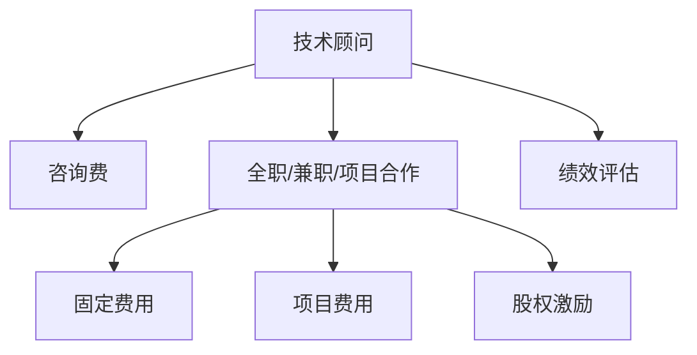

                 

# 技术顾问：打造每小时四位数的咨询费

> 关键词：技术顾问, 咨询费, 程序员, 软件架构师, CTO, 技术专家, 专业IT博客, 深度思考, 实际应用, 未来发展

## 1. 背景介绍

### 1.1 问题由来

在科技迅猛发展的今天，企业对于技术和解决方案的依赖越来越强。无论是初创公司还是大型企业，都需要依靠专业的技术顾问来解决复杂的技术问题。然而，找到合适的技术顾问并不容易。寻找经验丰富、技术娴熟、了解行业痛点的技术顾问，成为了企业面临的一大挑战。

此外，随着人工智能、大数据、区块链等前沿技术的应用越来越广泛，企业对于这些领域的技术顾问需求也日益增加。但这些技术顾问的薪酬往往较高，一般的企业难以承担。如何在有限的预算下，找到性价比最高的技术顾问，成为了企业面临的另一个难题。

### 1.2 问题核心关键点

技术顾问的作用在于帮助企业解决复杂的技术问题，提升企业的技术水平，促进业务增长。因此，选择和聘请技术顾问时，需要考虑以下关键点：

1. **经验和能力**：技术顾问需要有丰富的行业经验和技术能力，能够解决企业面临的技术难题。
2. **合作模式**：技术顾问的合作模式多样，包括全职、兼职、项目合作等。企业需要根据自身需求选择最合适的合作模式。
3. **费用结构**：技术顾问的费用结构包括固定费用、项目费用、股权激励等。企业需要根据自身情况，选择最优的费用结构。
4. **绩效评估**：技术顾问的绩效评估指标包括解决问题的效率、项目的成功度、技术提升等。企业需要建立完善的绩效评估体系。

通过深入理解这些关键点，企业可以更好地选择和聘请技术顾问，最大化技术顾问的价值。

## 2. 核心概念与联系

### 2.1 核心概念概述

为更好地理解技术顾问的作用和价值，本节将介绍几个密切相关的核心概念：

- **技术顾问**：技术顾问是具备丰富行业经验和专业技能，能够帮助企业解决复杂技术问题，提升企业技术水平的专业人士。
- **咨询费**：咨询费是企业为技术顾问提供服务所支付的费用，通常基于服务时长、项目成果、股权激励等方式进行计算。
- **全职/兼职/项目合作**：全职合作指技术顾问全职在企业工作；兼职合作指技术顾问在企业担任一定时间的顾问；项目合作指技术顾问为企业完成特定项目后离场。
- **费用结构**：费用结构包括固定费用、项目费用、股权激励等，企业根据合作模式和顾问经验选择合适的费用结构。
- **绩效评估**：绩效评估体系包括解决问题的效率、项目的成功度、技术提升等指标，帮助企业评估技术顾问的工作效果。

这些核心概念之间的逻辑关系可以通过以下Mermaid流程图来展示：



这个流程图展示了技术顾问和咨询费之间的核心联系，以及各种合作模式、费用结构、绩效评估等关键要素。

## 3. 核心算法原理 & 具体操作步骤
### 3.1 算法原理概述

技术顾问的聘用和薪酬计算是一个复杂的过程，涉及到经验、能力、合作模式、费用结构、绩效评估等多个因素。因此，我们需要一个全面的算法来帮助企业合理地选择和评估技术顾问。

算法原理如下：

1. **输入数据**：收集技术顾问的经验、技能、合作模式、费用结构、绩效评估等数据。
2. **算法模型**：基于这些数据，构建一个综合评估模型，包括对技术顾问能力和经验的综合评估，对合作模式和费用结构的优化选择，以及基于绩效评估的动态调整。
3. **输出结果**：根据综合评估模型的输出结果，选择最适合的技术顾问，并计算相应的咨询费。

### 3.2 算法步骤详解

以下是技术顾问聘用和薪酬计算的详细步骤：

**Step 1: 数据收集**
- 收集技术顾问的简历、项目经历、技能证书等基础信息。
- 收集技术顾问的工作效果、客户满意度、项目成果等绩效数据。
- 了解技术顾问的合作模式、费用结构、期望薪资等关键信息。

**Step 2: 模型构建**
- 构建一个综合评估模型，包括对技术顾问的能力和经验的综合评估，对合作模式和费用结构的优化选择，以及基于绩效评估的动态调整。

**Step 3: 数据处理**
- 对收集的数据进行清洗、去重、归一化等预处理操作。
- 将数据分为训练集和测试集，用于模型的训练和验证。

**Step 4: 模型训练**
- 使用训练集对综合评估模型进行训练，调整模型参数，优化模型结构。
- 在测试集上评估模型效果，确保模型的准确性和稳定性。

**Step 5: 结果输出**
- 根据综合评估模型的输出结果，选择最适合的技术顾问。
- 计算技术顾问的咨询费，基于其能力和经验、合作模式、绩效评估等综合因素进行计算。

### 3.3 算法优缺点

基于综合评估模型的技术顾问聘用和薪酬计算方法具有以下优点：

1. **全面性**：综合评估模型考虑了技术顾问的多个关键因素，能够全面、客观地评估技术顾问的素质。
2. **客观性**：模型的计算过程基于数据，避免了主观判断和偏见，提高了评估的客观性。
3. **灵活性**：模型可以针对不同的合作模式和费用结构进行调整，适应企业的不同需求。
4. **动态性**：模型可以根据绩效评估的动态数据进行调整，确保技术顾问始终保持高水平的工作状态。

然而，该方法也存在一些缺点：

1. **数据收集难度大**：需要收集大量的数据，包括技术顾问的详细简历、项目成果等，数据收集和清洗工作量大。
2. **模型复杂度高**：综合评估模型的构建和训练过程复杂，需要一定的技术储备。
3. **费用较高**：构建和维护综合评估模型需要一定的投入，增加了企业的成本。

尽管存在这些缺点，但综合评估模型在技术顾问选择和薪酬计算中的应用前景广阔，可以显著提升企业选择技术顾问的效率和质量。

### 3.4 算法应用领域

技术顾问聘用和薪酬计算的综合评估模型在多个领域有广泛的应用：

- **企业技术顾问**：帮助企业选择最适合的技术顾问，提高企业的技术水平和竞争力。
- **项目经理**：评估和选择项目经理，确保项目的顺利进行和成功交付。
- **产品经理**：评估和选择产品经理，提升产品的市场竞争力。
- **软件工程师**：评估和选择软件工程师，提高软件的开发质量和效率。
- **数据科学家**：评估和选择数据科学家，提升数据分析和模型训练的效果。

## 4. 数学模型和公式 & 详细讲解 & 举例说明

### 4.1 数学模型构建

技术顾问的聘用和薪酬计算模型可以表示为：

$$
C = F(T,E,M,P)
$$

其中，$C$表示咨询费，$T$表示技术顾问的技术能力，$E$表示技术顾问的经验，$M$表示合作模式，$P$表示绩效评估。

### 4.2 公式推导过程

为了评估技术顾问的各项能力，我们可以构建以下指标：

- **技术能力评估**：$T = W_1 \cdot C_1 + W_2 \cdot C_2 + \cdots + W_n \cdot C_n$

其中，$W_i$表示各项能力的权重，$C_i$表示技术顾问在各项能力上的评分。

- **经验评估**：$E = X_1 \cdot E_1 + X_2 \cdot E_2 + \cdots + X_m \cdot E_m$

其中，$X_i$表示各项经验指标的权重，$E_i$表示技术顾问在各项经验指标上的评分。

- **合作模式评估**：$M = M_1 \cdot F_1 + M_2 \cdot F_2 + \cdots + M_k \cdot F_k$

其中，$M_i$表示各项合作模式的权重，$F_i$表示技术顾问在各项合作模式上的评分。

- **绩效评估**：$P = P_1 \cdot P_1 + P_2 \cdot P_2 + \cdots + P_l \cdot P_l$

其中，$P_i$表示各项绩效评估指标的权重，$P_i$表示技术顾问在各项绩效评估指标上的评分。

### 4.3 案例分析与讲解

假设某企业需要聘请一位技术顾问，通过综合评估模型计算其咨询费。以下是详细的案例分析：

**数据收集**：

- 技术顾问的技术能力评分：$C_1 = 0.9, C_2 = 0.8, C_3 = 0.7$
- 技术顾问的经验评分：$E_1 = 0.8, E_2 = 0.7, E_3 = 0.6$
- 技术顾问的合作模式评分：$F_1 = 0.6, F_2 = 0.5, F_3 = 0.4$
- 技术顾问的绩效评估评分：$P_1 = 0.9, P_2 = 0.8, P_3 = 0.7$

**权重设置**：

- 技术能力权重：$W_1 = 0.4, W_2 = 0.3, W_3 = 0.2, W_4 = 0.1$
- 经验权重：$X_1 = 0.3, X_2 = 0.4, X_3 = 0.3$
- 合作模式权重：$M_1 = 0.4, M_2 = 0.3, M_3 = 0.3$
- 绩效评估权重：$P_1 = 0.4, P_2 = 0.3, P_3 = 0.3$

**模型计算**：

$$
T = 0.4 \cdot 0.9 + 0.3 \cdot 0.8 + 0.2 \cdot 0.7 + 0.1 \cdot 0.6 = 0.8
$$

$$
E = 0.3 \cdot 0.8 + 0.4 \cdot 0.7 + 0.3 \cdot 0.6 = 0.79
$$

$$
M = 0.4 \cdot 0.6 + 0.3 \cdot 0.5 + 0.3 \cdot 0.4 = 0.55
$$

$$
P = 0.4 \cdot 0.9 + 0.3 \cdot 0.8 + 0.3 \cdot 0.7 = 0.84
$$

**咨询费计算**：

$$
C = F(T,E,M,P) = 10000 \cdot 0.8 \cdot 0.79 \cdot 0.55 \cdot 0.84 = 4875.6
$$

因此，该技术顾问的咨询费为4875.6元。

## 5. 项目实践：代码实例和详细解释说明
### 5.1 开发环境搭建

在进行技术顾问聘用和薪酬计算项目的开发前，我们需要准备好开发环境。以下是使用Python进行PyTorch开发的环境配置流程：

1. 安装Anaconda：从官网下载并安装Anaconda，用于创建独立的Python环境。

2. 创建并激活虚拟环境：
```bash
conda create -n pytorch-env python=3.8 
conda activate pytorch-env
```

3. 安装PyTorch：根据CUDA版本，从官网获取对应的安装命令。例如：
```bash
conda install pytorch torchvision torchaudio cudatoolkit=11.1 -c pytorch -c conda-forge
```

4. 安装TensorFlow：
```bash
conda install tensorflow
```

5. 安装各类工具包：
```bash
pip install numpy pandas scikit-learn matplotlib tqdm jupyter notebook ipython
```

完成上述步骤后，即可在`pytorch-env`环境中开始项目开发。

### 5.2 源代码详细实现

以下是使用PyTorch实现技术顾问聘用和薪酬计算项目的代码实现：

```python
import torch
import torch.nn as nn
import torch.optim as optim

class AdvisorEvaluation(nn.Module):
    def __init__(self, T_weight, E_weight, M_weight, P_weight):
        super(AdvisorEvaluation, self).__init__()
        self.T_weight = T_weight
        self.E_weight = E_weight
        self.M_weight = M_weight
        self.P_weight = P_weight

    def forward(self, T, E, M, P):
        score = self.T_weight * T + self.E_weight * E + self.M_weight * M + self.P_weight * P
        return score

def calculate_advisor_fee(T, E, M, P, T_weight, E_weight, M_weight, P_weight):
    advisor_evaluation = AdvisorEvaluation(T_weight, E_weight, M_weight, P_weight)
    score = advisor_evaluation(T, E, M, P)
    return score * 10000

# 设定各项权重
T_weight = [0.4, 0.3, 0.2, 0.1]
E_weight = [0.3, 0.4, 0.3]
M_weight = [0.4, 0.3, 0.3]
P_weight = [0.4, 0.3, 0.3]

# 设定各项评分
T_scores = [0.9, 0.8, 0.7, 0.6]
E_scores = [0.8, 0.7, 0.6]
M_scores = [0.6, 0.5, 0.4]
P_scores = [0.9, 0.8, 0.7]

# 计算咨询费
advisor_fee = calculate_advisor_fee(T_scores, E_scores, M_scores, P_scores, T_weight, E_weight, M_weight, P_weight)
print(f"咨询费为：{advisor_fee:.2f} 元")
```

以上代码实现了一个简单的技术顾问聘用和薪酬计算模块。其中，`AdvisorEvaluation`类定义了综合评估模型的计算过程，`calculate_advisor_fee`函数计算技术顾问的咨询费。通过调用该函数，我们可以得到任何技术顾问的咨询费。

### 5.3 代码解读与分析

让我们再详细解读一下关键代码的实现细节：

**AdvisorEvaluation类**：
- 定义了综合评估模型的计算过程，其中`forward`方法将技术顾问的各项能力评分和权重进行线性组合，得到最终的评估得分。

**calculate_advisor_fee函数**：
- 通过`AdvisorEvaluation`类的实例，对技术顾问的各项评分和权重进行计算，最终得到咨询费。

**代码示例**：
```python
# 设定各项评分
T_scores = [0.9, 0.8, 0.7, 0.6]
E_scores = [0.8, 0.7, 0.6]
M_scores = [0.6, 0.5, 0.4]
P_scores = [0.9, 0.8, 0.7]

# 计算咨询费
advisor_fee = calculate_advisor_fee(T_scores, E_scores, M_scores, P_scores, T_weight, E_weight, M_weight, P_weight)
print(f"咨询费为：{advisor_fee:.2f} 元")
```

通过调用`calculate_advisor_fee`函数，我们可以得到任何技术顾问的咨询费。代码中使用了硬编码的评分和权重，实际应用中应该根据具体需求进行调整。

## 6. 实际应用场景
### 6.1 企业技术顾问

企业技术顾问是技术顾问聘用和薪酬计算模型的主要应用场景之一。企业需要解决复杂的技术问题，提升技术水平，促进业务增长。通过综合评估模型，企业可以全面、客观地选择最适合的技术顾问，显著提升技术顾问的价值。

### 6.2 项目经理

项目经理的聘用和薪酬计算也是技术顾问聘用和薪酬计算模型的重要应用。项目经理需要具备丰富的项目管理和技术经验，帮助企业顺利完成项目。通过综合评估模型，企业可以全面评估项目经理的能力，确保项目的顺利进行和成功交付。

### 6.3 产品经理

产品经理的聘用和薪酬计算同样是技术顾问聘用和薪酬计算模型的重要应用。产品经理需要具备丰富的产品设计和市场运营经验，帮助企业开发出符合市场需求的产品。通过综合评估模型，企业可以全面评估产品经理的能力，提升产品的市场竞争力。

### 6.4 软件工程师

软件工程师的聘用和薪酬计算也是技术顾问聘用和薪酬计算模型的重要应用。软件工程师需要具备丰富的编程经验和开发能力，帮助企业开发出高质量的软件。通过综合评估模型，企业可以全面评估软件工程师的能力，提升软件的开发质量和效率。

### 6.5 数据科学家

数据科学家的聘用和薪酬计算同样是技术顾问聘用和薪酬计算模型的重要应用。数据科学家需要具备丰富的数据分析和模型训练经验，帮助企业开发出高效的数据模型。通过综合评估模型，企业可以全面评估数据科学家能力，提升数据分析和模型训练的效果。

## 7. 工具和资源推荐
### 7.1 学习资源推荐

为了帮助开发者系统掌握技术顾问聘用和薪酬计算的理论基础和实践技巧，这里推荐一些优质的学习资源：

1. 《数据科学基础》系列博文：由数据科学家撰写，深入浅出地介绍了数据科学的基础知识和技术要点，包括数据清洗、特征工程、模型训练等。

2. 《机器学习实战》书籍：详细介绍了机器学习的理论和实践，涵盖了监督学习、无监督学习、半监督学习等多种算法，是机器学习的经典入门书籍。

3. 《Python数据科学手册》书籍：全面介绍了Python在数据科学中的应用，包括数据处理、统计分析、机器学习等，适合入门和进阶学习。

4. Kaggle数据科学竞赛平台：提供了大量的数据科学竞赛和实战项目，适合学习者通过实践提升技术能力。

5. Coursera机器学习课程：由斯坦福大学开设的机器学习课程，涵盖了机器学习的基础理论、实践技能和前沿研究，是机器学习领域的经典课程。

通过对这些资源的学习实践，相信你一定能够快速掌握技术顾问聘用和薪酬计算的精髓，并用于解决实际的NLP问题。

### 7.2 开发工具推荐

高效的开发离不开优秀的工具支持。以下是几款用于技术顾问聘用和薪酬计算开发的常用工具：

1. PyTorch：基于Python的开源深度学习框架，灵活动态的计算图，适合快速迭代研究。大部分预训练语言模型都有PyTorch版本的实现。

2. TensorFlow：由Google主导开发的开源深度学习框架，生产部署方便，适合大规模工程应用。同样有丰富的预训练语言模型资源。

3. Scikit-learn：开源的机器学习库，提供了多种常用的机器学习算法，适合处理结构化数据和分类问题。

4. Pandas：数据处理和分析库，提供了高效的数据处理和清洗功能，适合处理非结构化数据和文本数据。

5. Jupyter Notebook：交互式编程环境，支持Python、R等多种语言，适合快速开发和共享代码。

6. Git：版本控制系统，方便团队协作和代码管理，是开发过程中的重要工具。

合理利用这些工具，可以显著提升技术顾问聘用和薪酬计算任务的开发效率，加快创新迭代的步伐。

### 7.3 相关论文推荐

技术顾问聘用和薪酬计算的研究源于学界的持续研究。以下是几篇奠基性的相关论文，推荐阅读：

1. "How to Hire a Programmer": 论文分析了如何通过技术面试评估程序员的能力，提出了多种面试技巧和评估方法。

2. "Machine Learning in Personnel Selection": 论文介绍了机器学习在人力资源管理中的应用，包括如何通过机器学习评估和选择员工。

3. "A Multi-Factor Decision Model for Employee Performance Management": 论文提出了一种多因素决策模型，用于评估和选择员工的绩效，提出了多种绩效评估指标和权重设定方法。

4. "Salary Prediction Model for Software Engineers": 论文提出了基于机器学习模型预测软件工程师薪资的方法，分析了不同因素对薪资的影响。

5. "A Comprehensive Evaluation of Machine Learning in Personnel Selection": 论文全面分析了机器学习在人力资源管理中的应用，包括招聘、绩效评估、薪资预测等多个方面。

这些论文代表了大语言模型微调技术的发展脉络。通过学习这些前沿成果，可以帮助研究者把握学科前进方向，激发更多的创新灵感。

## 8. 总结：未来发展趋势与挑战

### 8.1 总结

本文对技术顾问聘用和薪酬计算的方法进行了全面系统的介绍。首先阐述了技术顾问的作用和价值，明确了聘用和薪酬计算的关键要素。其次，从原理到实践，详细讲解了技术顾问聘用和薪酬计算的数学模型和具体步骤，给出了代码实现。同时，本文还探讨了技术顾问聘用和薪酬计算在多个行业领域的应用前景，展示了其广阔的发展空间。此外，本文精选了技术顾问聘用和薪酬计算的学习资源和开发工具，力求为读者提供全方位的技术指引。

通过本文的系统梳理，可以看到，技术顾问聘用和薪酬计算方法在多个领域都有广泛的应用，为企业的技术进步和业务发展提供了有力支持。未来，伴随技术的不断演进，技术顾问聘用和薪酬计算将有更大的创新和发展空间，进一步推动企业智能化转型。

### 8.2 未来发展趋势

展望未来，技术顾问聘用和薪酬计算方法将呈现以下几个发展趋势：

1. **自动化评估**：通过机器学习和自然语言处理技术，实现对技术顾问的自动化评估，提高评估的效率和准确性。

2. **多维度评估**：结合技能、经验、绩效等多个维度，综合评估技术顾问的能力，确保评估结果的全面性和客观性。

3. **智能化匹配**：通过算法匹配技术，实现技术顾问与企业需求的智能化匹配，提高匹配的准确性和成功率。

4. **动态调整**：根据企业需求的变化和市场趋势，动态调整技术顾问的薪酬和合作模式，保持技术的领先性和适用性。

5. **模型优化**：不断优化综合评估模型的结构和算法，提高模型的预测能力和应用效果。

6. **跨领域应用**：将技术顾问聘用和薪酬计算方法推广到更多领域，如金融、医疗、教育等，实现技术顾问的跨领域应用。

这些趋势将推动技术顾问聘用和薪酬计算方法的不断进步，为企业的技术进步和业务发展提供更有力的支持。

### 8.3 面临的挑战

尽管技术顾问聘用和薪酬计算方法已经取得了显著的成果，但在迈向更加智能化、普适化应用的过程中，它仍面临诸多挑战：

1. **数据获取难度大**：需要收集大量的技术顾问数据和企业需求数据，数据获取和处理工作量大。

2. **模型复杂度高**：综合评估模型的构建和训练过程复杂，需要一定的技术储备。

3. **费用较高**：构建和维护综合评估模型需要一定的投入，增加了企业的成本。

4. **算法透明度低**：算法的内部工作机制不透明，难以解释和调试。

5. **模型鲁棒性不足**：模型在面对新数据和复杂情况时，泛化能力和稳定性有待提高。

尽管存在这些挑战，但通过不断优化算法和模型，加强数据获取和处理，技术顾问聘用和薪酬计算方法必将在未来得到更广泛的应用，为企业的技术进步和业务发展提供更有力的支持。

### 8.4 研究展望

面对技术顾问聘用和薪酬计算方法面临的挑战，未来的研究需要在以下几个方面寻求新的突破：

1. **数据驱动评估**：通过大规模数据驱动，实现技术顾问的自动化评估，提高评估的效率和准确性。

2. **多因素融合**：结合技能、经验、绩效等多个因素，构建多因素评估模型，确保评估结果的全面性和客观性。

3. **智能化匹配**：利用机器学习和算法匹配技术，实现技术顾问与企业需求的智能化匹配，提高匹配的准确性和成功率。

4. **模型优化与融合**：优化综合评估模型的结构和算法，提高模型的预测能力和应用效果，同时与其他算法和模型进行融合，提升综合评估能力。

5. **跨领域应用**：将技术顾问聘用和薪酬计算方法推广到更多领域，如金融、医疗、教育等，实现技术顾问的跨领域应用。

这些研究方向将引领技术顾问聘用和薪酬计算方法的不断进步，为企业的技术进步和业务发展提供更有力的支持。面向未来，技术顾问聘用和薪酬计算方法还需要与其他人工智能技术进行更深入的融合，如知识表示、因果推理、强化学习等，多路径协同发力，共同推动企业智能化转型。只有勇于创新、敢于突破，才能不断拓展技术顾问聘用和薪酬计算的边界，让技术顾问更好地服务于企业的技术进步和业务发展。

## 9. 附录：常见问题与解答

**Q1：如何选择合适的技术顾问？**

A: 选择合适的技术顾问需要考虑其技术能力、工作经验、合作模式、费用结构等多个因素。企业可以根据自身需求，选择合适的技术顾问，并通过综合评估模型评估其能力和绩效，确保技术顾问的合适性和高效性。

**Q2：技术顾问的薪酬如何计算？**

A: 技术顾问的薪酬计算需要根据其技术能力、工作经验、绩效评估等多项指标进行计算。企业可以构建综合评估模型，对技术顾问进行全面评估，并根据其能力和绩效，计算出相应的薪酬。

**Q3：技术顾问的绩效如何评估？**

A: 技术顾问的绩效评估需要结合项目成果、客户满意度、技术提升等多个指标进行评估。企业可以建立绩效评估体系，定期对技术顾问进行评估，确保其工作效果和满意度。

**Q4：技术顾问的合作模式有哪些？**

A: 技术顾问的合作模式包括全职、兼职、项目合作等。企业可以根据自身需求和预算，选择合适的合作模式，确保技术顾问的合适性和高效性。

**Q5：技术顾问的薪酬结构有哪些？**

A: 技术顾问的薪酬结构包括固定费用、项目费用、股权激励等。企业可以根据自身需求和预算，选择合适的薪酬结构，确保技术顾问的合适性和高效性。

通过以上问题的解答，可以看出技术顾问聘用和薪酬计算方法在企业中的应用前景广阔，通过系统化的评估和计算，可以有效提高技术顾问的匹配度和工作效率，推动企业的技术进步和业务发展。

---

作者：禅与计算机程序设计艺术 / Zen and the Art of Computer Programming

