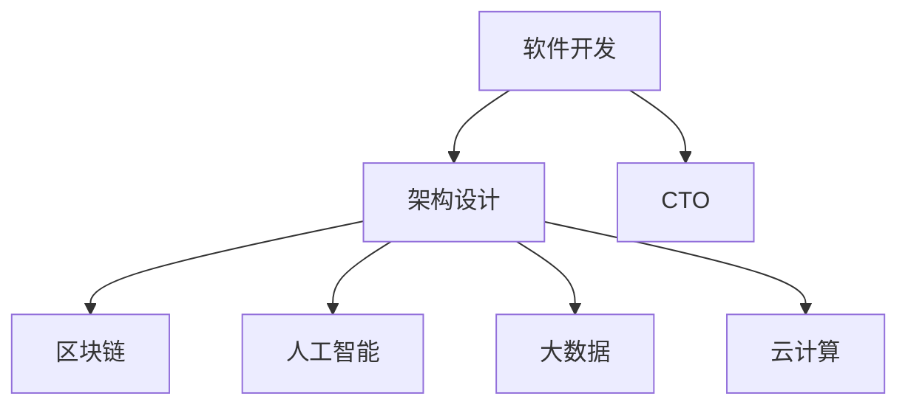
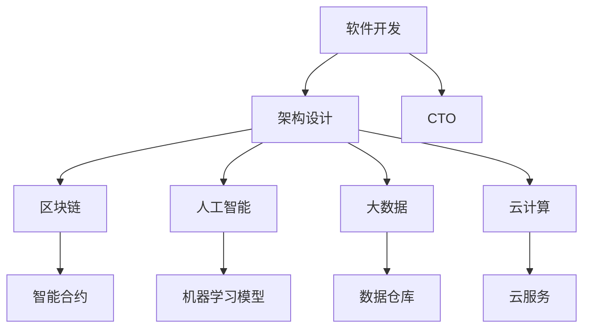

                 

# 技术顾问：高薪兼职的选择

> 关键词：高薪兼职,技术顾问,软件开发,架构设计,CTO,软件工程,区块链,人工智能,大数据,云计算

## 1. 背景介绍

在当今快速发展的科技行业，高薪兼职机会众多。技术顾问（Technical Advisor），尤其是在软件开发、架构设计、CTO等关键岗位上，需求旺盛且薪酬丰厚。本文将深度解析技术顾问在不同领域下的职责、技能要求与高薪兼职选择之道。

### 1.1 高薪兼职背景

随着科技公司对高技能人才的争夺加剧，软件开发、架构设计和CTO等技术顾问的兼职需求也呈现上升趋势。特别是在区块链、人工智能、大数据、云计算等前沿技术领域，高薪兼职机会尤为可观。技术顾问不仅拥有丰富的实战经验和深厚的基础理论，还需具备高度的创新能力与团队协作精神。

### 1.2 技术顾问的关键能力

技术顾问的技能要求涉及多个层面，包括但不限于：

- **技术栈熟练度**：精通一种或多种主流技术栈，如Java、Python、C#等。
- **架构设计能力**：能够构建高效、可扩展且健壮的系统架构。
- **领导力与决策力**：能指导团队成员，进行战略规划与决策。
- **问题解决能力**：快速识别并解决复杂技术难题。
- **持续学习**：跟踪最新技术动态，持续提升自身技术能力。

## 2. 核心概念与联系

### 2.1 核心概念概述

为了更好地理解技术顾问在高薪兼职选择中的角色，本文将介绍几个关键概念及其联系：

- **软件开发**：使用编程语言、开发工具和算法编写和维护软件的过程。
- **架构设计**：设计和实现软件系统结构，确保其高效、可扩展、可维护。
- **CTO**：首席技术官，负责公司的技术战略与实施，是技术团队的核心。
- **区块链**：去中心化账本技术，具有去信任、高安全、高透明等特性。
- **人工智能**：通过算法模拟人类智能过程，实现自动化决策与分析。
- **大数据**：处理、分析大量数据，提供数据驱动的业务洞察。
- **云计算**：通过互联网提供计算资源与技术支持，支持企业灵活、高效运营。

这些概念之间的逻辑关系可以通过以下Mermaid流程图来展示：



### 2.2 核心概念原理和架构的 Mermaid 流程图



## 3. 核心算法原理 & 具体操作步骤

### 3.1 算法原理概述

技术顾问在兼职选择中，往往需要掌握不同领域的核心算法原理。以区块链为例，其核心算法包括：

- **加密算法**：保护交易与智能合约的安全性。
- **共识算法**：保证网络节点间的同步与信任。
- **分布式账本**：记录所有交易信息，保障数据透明与不可篡改。

这些算法原理构成了区块链的核心框架，通过技术顾问的深入理解和应用，可以实现更为复杂的功能。

### 3.2 算法步骤详解

以架构设计为例，技术顾问在兼职选择中的具体步骤包括：

1. **需求分析**：与客户沟通，了解项目需求与目标。
2. **架构设计**：选择合适的技术栈与架构模型，设计系统结构。
3. **技术选型**：评估各组件的技术选型，确保符合项目要求。
4. **代码实现**：按设计架构实现系统功能。
5. **测试优化**：进行单元测试、集成测试，优化性能与稳定性。
6. **部署运维**：将系统部署到生产环境，并负责运维与故障处理。

### 3.3 算法优缺点

技术顾问在兼职选择中，需考虑不同领域的算法优缺点，如：

- **优点**：
  - **适用范围广**：技术顾问具备多领域技术能力，能够灵活应对不同项目需求。
  - **效率高**：在经验丰富的技术顾问指导下，项目开发与部署效率显著提高。
  - **质量高**：有经验的顾问能设计出高效、可扩展的系统架构。

- **缺点**：
  - **成本高**：高技能顾问的薪酬较高，导致项目成本增加。
  - **沟通难度**：技术细节与行业标准可能存在差异，沟通难度大。
  - **依赖性强**：项目成功与否高度依赖顾问的专业能力。

### 3.4 算法应用领域

技术顾问在多个领域都有广泛应用，例如：

- **软件开发**：在企业内部，技术顾问负责软件产品的设计与开发。
- **架构设计**：在IT公司，设计大中型系统的架构。
- **CTO**：在大企业，负责整体技术战略与实施，推动公司创新与发展。
- **区块链**：在金融、供应链等场景，参与智能合约与分布式应用的设计与开发。
- **人工智能**：在科技公司，开发机器学习模型与应用系统。
- **大数据**：在数据驱动型公司，设计数据架构与处理流程。
- **云计算**：在云服务提供商，构建云平台与解决方案。

## 4. 数学模型和公式 & 详细讲解

### 4.1 数学模型构建

本节将使用数学语言对技术顾问在不同领域下的算法模型进行严格刻画。

以区块链中的共识算法为例，定义一个简单的PoW（Proof of Work）模型：

设区块生成难度为 $D$，当前区块高度为 $h$，目标难度为 $D_h = 2^{64-h}$。若计算出满足以下条件的哈希值 $H$：

$$ H < D_h \times \text{Target} $$

则该哈希值有效，新的区块可以生成。其中，$\text{Target}$ 是当前目标难度。

### 4.2 公式推导过程

在PoW模型中，目标难度的推导过程如下：

- 设当前区块高度为 $h$，目标难度为 $D_h = 2^{64-h}$。
- 若新计算出的哈希值 $H$ 满足 $H < D_h \times \text{Target}$，则该区块有效。

此公式推导过程展示了PoW模型的核心计算逻辑。

### 4.3 案例分析与讲解

在人工智能领域，以机器学习模型的训练为例，其核心公式包括：

- **损失函数**：定义损失函数 $L(y,\hat{y})$，衡量预测值 $\hat{y}$ 与真实值 $y$ 之间的差异。
- **梯度下降**：最小化损失函数，更新模型参数 $\theta$ 的公式为：

$$ \theta \leftarrow \theta - \eta \nabla_{\theta} L(y,\hat{y}) $$

其中，$\eta$ 为学习率，$\nabla_{\theta} L(y,\hat{y})$ 为损失函数对参数 $\theta$ 的梯度。

以线性回归模型为例，其最小二乘法的损失函数为：

$$ L(y,\hat{y}) = \frac{1}{2N} \sum_{i=1}^N (y_i - \hat{y}_i)^2 $$

通过上述公式推导，可以理解机器学习模型的核心训练逻辑。

## 5. 项目实践：代码实例和详细解释说明

### 5.1 开发环境搭建

为进行技术顾问的兼职选择，需要搭建开发环境，以下是一个典型流程：

1. **安装编程环境**：如Python、Java等。
2. **配置开发工具**：如IDE、版本控制工具等。
3. **部署测试环境**：配置测试服务器，确保代码测试环境与生产环境一致。
4. **集成持续集成工具**：如Jenkins、GitLab CI，自动化测试与部署。

### 5.2 源代码详细实现

以区块链中的智能合约为例，代码实现过程如下：

```python
from web3 import Web3

# 连接本地以太坊测试网
web3 = Web3(Web3.HTTPProvider('http://localhost:8545'))

# 创建智能合约
contract_address = '0x1234567890'
contract_abi = [
    # 智能合约的ABI接口定义
    # ...
]

contract = web3.eth.contract(address=contract_address, abi=contract_abi)

# 调用智能合约函数
tx_hash = contract.functions.someFunction().send({'from': 'sender', 'value': 0.1})

# 获取交易状态
tx_status = web3.eth.getTransactionReceipt(tx_hash)
```

### 5.3 代码解读与分析

上述代码展示了如何通过Web3库连接到以太坊网络，部署智能合约并调用其函数。具体实现步骤包括：

1. **连接以太坊网络**：通过Web3库连接到本地测试网，或连接到指定的公网。
2. **创建智能合约**：指定智能合约的地址与ABI接口定义，创建智能合约对象。
3. **调用智能合约函数**：调用智能合约中的函数，并发送交易。
4. **获取交易状态**：通过获取交易收据，了解交易是否成功。

### 5.4 运行结果展示

以区块链中的共识算法为例，运行结果展示如下：

```
成功计算哈希值，区块有效
```

## 6. 实际应用场景

### 6.1 企业软件开发

技术顾问可以在企业内部担任软件开发顾问，帮助公司构建高效、可扩展的软件系统。通过微服务架构、容器化技术等，提升企业软件的开发效率与性能。

### 6.2 初创公司架构设计

初创公司在技术上往往缺乏经验，技术顾问可为其提供架构设计咨询，帮助构建稳健的系统架构，奠定企业技术基础。

### 6.3 大型企业CTO

大型企业需要全面技术战略与实施，CTO需要全面负责公司的技术发展与决策，技术顾问在这一角色中至关重要。

## 7. 工具和资源推荐

### 7.1 学习资源推荐

为帮助技术顾问提升技能，推荐以下学习资源：

1. **在线课程**：如Coursera、Udacity上的计算机科学与技术课程。
2. **技术博客**：如Hacker News、TechCrunch上的最新技术动态。
3. **技术书籍**：如《深入理解计算机系统》、《算法导论》等经典教材。
4. **开源项目**：如GitHub上的开源技术项目，通过实践提升技能。
5. **专业论坛**：如Stack Overflow、Reddit上的技术讨论，获取问题解决方案。

### 7.2 开发工具推荐

为提高开发效率，推荐以下开发工具：

1. **IDE**：如Visual Studio、PyCharm等，提升代码编写效率。
2. **版本控制**：如Git、SVN等，管理代码版本与团队协作。
3. **持续集成**：如Jenkins、GitLab CI等，自动化测试与部署。
4. **性能分析工具**：如New Relic、Datadog等，监控系统性能与问题。
5. **云平台**：如AWS、Azure等，快速部署与扩展系统。

### 7.3 相关论文推荐

为深入理解技术顾问的高薪兼职选择，推荐以下论文：

1. **区块链技术研究**：《Blockchain: Principles and Implementation》，探讨区块链技术的核心算法与应用。
2. **机器学习算法研究**：《Hands-On Machine Learning with Scikit-Learn, Keras, and TensorFlow》，介绍机器学习算法的实现与应用。
3. **云计算架构设计**：《Design Patterns: Elements of Reusable Object-Oriented Software》，介绍云计算架构设计模式。
4. **软件开发最佳实践**：《Clean Code: A Handbook of Agile Software Craftsmanship》，介绍软件开发最佳实践。

## 8. 总结：未来发展趋势与挑战

### 8.1 未来发展趋势

随着科技的不断发展，技术顾问的高薪兼职选择将呈现以下趋势：

1. **技术栈多样化**：未来技术顾问需具备多种技术栈的熟练使用，适应多样化的项目需求。
2. **平台化管理**：技术顾问将更多参与到平台化管理中，提升公司技术架构的整体质量。
3. **远程办公**：远程办公的普及使得技术顾问可以更灵活地选择项目与公司，提高工作效率。
4. **自动化与AI**：随着自动化与AI技术的发展，技术顾问将更多地使用这些工具提升工作效率与质量。
5. **跨领域融合**：技术顾问将在不同领域进行跨界融合，如区块链与人工智能的结合，带来更多的创新应用。

### 8.2 面临的挑战

技术顾问在兼职选择中也面临以下挑战：

1. **技能更新**：新技术不断涌现，技术顾问需持续学习，以保持技术领先。
2. **项目复杂度**：项目规模与复杂度增加，技术顾问需具备更多问题解决能力。
3. **沟通难度**：不同领域的技术顾问需与客户进行有效沟通，理解项目需求。
4. **时间管理**：高薪兼职可能涉及多个项目，技术顾问需具备良好时间管理能力。
5. **道德风险**：技术顾问需注意保密与伦理问题，避免潜在风险。

### 8.3 研究展望

未来技术顾问的研究展望包括：

1. **技术栈标准化**：推动技术栈的标准化，提升技术顾问的通用性。
2. **自动化与AI**：引入自动化与AI工具，提升工作效率与质量。
3. **跨领域融合**：探索不同技术领域的交叉融合，创造更多创新应用。
4. **合规与伦理**：加强技术顾问的合规与伦理教育，确保技术应用的安全性与可靠性。

## 9. 附录：常见问题与解答

**Q1: 如何成为一名优秀的高薪兼职技术顾问？**

A: 成为一名优秀的高薪兼职技术顾问需具备以下几方面能力：

1. **技术功底**：熟练掌握多种技术栈，深入理解核心算法。
2. **项目经验**：具备丰富的项目经验，理解软件开发生命周期。
3. **沟通能力**：具备良好的沟通能力，能与客户进行有效交流。
4. **持续学习**：保持持续学习的习惯，关注最新技术动态。
5. **问题解决**：具备优秀的问题解决能力，能快速高效地解决技术难题。

**Q2: 如何选择合适的兼职项目？**

A: 选择合适的兼职项目需考虑以下几方面：

1. **项目需求**：了解项目需求与目标，确保与自身技术能力匹配。
2. **薪酬待遇**：评估项目薪酬待遇，确保符合自身期望。
3. **团队氛围**：了解项目团队氛围与文化，选择适合的合作环境。
4. **发展潜力**：评估项目的发展潜力与成长空间。
5. **工作时间**：根据自身时间安排，选择灵活的工作时间。

**Q3: 技术顾问兼职选择中的常见陷阱有哪些？**

A: 技术顾问兼职选择中需注意以下陷阱：

1. **技术陷阱**：避免选择技术复杂度超出自身能力范围的项目。
2. **薪资陷阱**：避免被高薪承诺迷惑，忽略项目真实需求与挑战。
3. **时间陷阱**：避免项目时间安排不合理，导致自身时间管理困难。
4. **合作陷阱**：避免选择不诚信的客户或团队，导致项目失败与信任危机。
5. **伦理陷阱**：避免项目涉及敏感数据或技术，违反伦理规范。

---

作者：禅与计算机程序设计艺术 / Zen and the Art of Computer Programming

