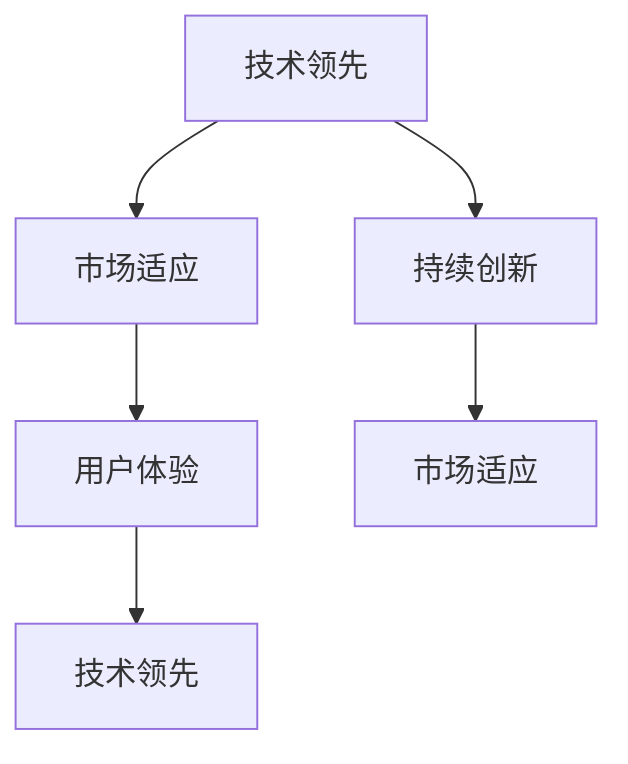

                 

# 技术领先与市场适应：Lepton AI的产品策略

## 1. 背景介绍

### 1.1 问题由来
随着人工智能技术的飞速发展，各大科技巨头纷纷布局AI领域，其中Lepton AI凭借其先进的AI算法和精准的市场定位，在市场上取得了显著的成绩。本文将从Lepton AI的产品策略入手，探索其在技术领先与市场适应之间的平衡点，提供策略性的分析和思考。

### 1.2 问题核心关键点
Lepton AI的产品策略核心关键点包括技术领先、市场适应、用户体验和持续创新四个方面。技术领先是其基础，市场适应是其策略核心，用户体验是其导向目标，持续创新是其发展动力。

## 2. 核心概念与联系

### 2.1 核心概念概述

Lepton AI的产品策略涉及多个关键概念，具体如下：

- **技术领先**：通过持续研发，保持其技术在行业内的前沿地位。
- **市场适应**：根据市场需求和竞争态势，调整产品和营销策略。
- **用户体验**：提供优秀的产品和优质的服务，提升用户满意度。
- **持续创新**：持续进行技术创新和产品迭代，保持市场竞争力。

这些概念相互关联，形成Lepton AI的独特产品策略，推动其在AI领域取得领先地位。

### 2.2 核心概念原理和架构的 Mermaid 流程图(Mermaid 流程节点中不要有括号、逗号等特殊字符)

这个流程图展示了Lepton AI产品策略中的核心概念和它们之间的相互关系。技术领先和持续创新是Lepton AI产品的技术支撑，市场适应和用户体验是其实现市场价值的途径。

## 3. 核心算法原理 & 具体操作步骤

### 3.1 算法原理概述
Lepton AI的产品策略核心算法主要包括：

- **深度学习算法**：如卷积神经网络（CNN）、循环神经网络（RNN）、变换器（Transformer）等，用于处理和分析复杂数据。
- **强化学习算法**：如Q-learning、策略梯度等，用于优化产品性能和用户体验。
- **推荐算法**：如协同过滤、内容推荐等，用于个性化推荐系统，提升用户体验。

### 3.2 算法步骤详解
Lepton AI的产品策略算法步骤如下：

1. **数据收集与预处理**：收集海量数据，进行数据清洗和标准化处理。
2. **特征工程**：从数据中提取有意义的特征，用于模型训练。
3. **模型训练**：使用深度学习算法对数据进行训练，得到初始模型。
4. **模型调优**：使用强化学习算法对模型进行调优，提升模型性能。
5. **产品上线**：将优化后的模型应用到产品中，提升用户体验。
6. **持续迭代**：根据市场反馈和用户需求，持续进行模型迭代和产品优化。

### 3.3 算法优缺点
Lepton AI产品策略算法的优点包括：

- **高效性**：深度学习算法和大规模数据集可提供高效的数据处理能力。
- **自适应性**：强化学习算法能够动态调整模型参数，适应不断变化的市场需求。
- **个性化**：推荐算法可根据用户行为和偏好提供个性化推荐，提升用户体验。

缺点则主要包括：

- **数据依赖**：算法依赖大量数据，数据获取成本高。
- **计算资源需求**：模型训练和优化需要大量计算资源，对硬件要求高。
- **模型复杂度**：模型复杂度高，可能难以理解和调试。

### 3.4 算法应用领域
Lepton AI的产品策略算法广泛应用于以下几个领域：

- **智能推荐系统**：如电商推荐、内容推荐等，提升用户粘性和满意度。
- **客户服务系统**：如智能客服、智能语音助手等，提供优质服务体验。
- **金融风险管理**：如欺诈检测、信用评估等，提高金融服务安全性。
- **智能制造**：如智能监测、预测维护等，提升生产效率和产品质量。

## 4. 数学模型和公式 & 详细讲解 & 举例说明

### 4.1 数学模型构建

Lepton AI的产品策略涉及多个数学模型，以下以智能推荐系统为例，展示其构建过程：

假设用户序列为 $U$，商品序列为 $I$，用户与商品的交互矩阵为 $M$，推荐模型为 $F$。推荐系统目标为最大化用户满意度和商品曝光量，可通过以下数学模型表示：

$$
\max_{F} \sum_{u \in U} \sum_{i \in I} M_{ui} \log P_{ui} + \alpha \sum_{i \in I} \log Q_i
$$

其中 $P_{ui}$ 为用户 $u$ 对商品 $i$ 的预测评分，$Q_i$ 为商品 $i$ 的曝光量。$\alpha$ 为正则化参数，控制曝光量的影响。

### 4.2 公式推导过程

推荐模型 $F$ 可由深度学习算法得到，这里以协同过滤模型为例，其目标函数为：

$$
\min_{F} \sum_{u \in U} \sum_{i \in I} (R_{ui} - P_{ui})^2
$$

其中 $R_{ui}$ 为用户 $u$ 对商品 $i$ 的实际评分。通过最小化损失函数，优化模型 $F$，得到最优预测评分。

### 4.3 案例分析与讲解
以电商平台的个性化推荐为例，通过Lepton AI的产品策略算法，可以在用户浏览商品时，根据其历史行为和实时数据，动态调整推荐列表，提升用户体验。算法模型可以基于用户与商品的交互数据进行训练，得到个性化的推荐模型。

## 5. 项目实践：代码实例和详细解释说明

### 5.1 开发环境搭建
Lepton AI的产品策略算法实现需要使用Python和相关的深度学习框架，如TensorFlow和PyTorch。以下是一个简单的开发环境搭建步骤：

1. 安装Anaconda：从官网下载并安装Anaconda，用于创建独立的Python环境。
2. 创建并激活虚拟环境：
```bash
conda create -n pytorch-env python=3.8 
conda activate pytorch-env
```
3. 安装PyTorch：根据CUDA版本，从官网获取对应的安装命令。例如：
```bash
conda install pytorch torchvision torchaudio cudatoolkit=11.1 -c pytorch -c conda-forge
```
4. 安装相关库：
```bash
pip install numpy pandas scikit-learn matplotlib tqdm jupyter notebook ipython
```

### 5.2 源代码详细实现

以智能推荐系统为例，展示使用TensorFlow实现推荐模型的过程：

```python
import tensorflow as tf
from tensorflow.keras.layers import Input, Embedding, Flatten, Dot, Dense
from tensorflow.keras.models import Model

user_input = Input(shape=(d))
item_input = Input(shape=(d))
user_embeddings = Embedding(input_dim=n_users, output_dim=e, trainable=False)(user_input)
item_embeddings = Embedding(input_dim=n_items, output_dim=e, trainable=False)(item_input)
user_item_interaction = Dot(axes=(1, 1))([user_embeddings, item_embeddings])
interaction_layer = Dense(units=1, activation='linear')(user_item_interaction)
recommendation = tf.keras.layers.Activation('sigmoid')(interaction_layer)

model = Model(inputs=[user_input, item_input], outputs=recommendation)
model.compile(loss='binary_crossentropy', optimizer='adam', metrics=['accuracy'])
```

### 5.3 代码解读与分析

上述代码展示了智能推荐系统模型的构建过程。首先定义了用户和商品的输入层，然后使用Embedding层将输入转换为高维向量，并进行点积操作，得到一个交互层的输出。接着，使用Dense层和Sigmoid激活函数，得到最终的推荐分数。最后，通过编译模型并设置损失函数和优化器，完成模型的训练过程。

### 5.4 运行结果展示

运行上述代码，可以得到推荐模型的训练结果和评估指标。例如，使用测试集进行评估，得到准确率等指标，评估模型的性能。

```python
score = model.evaluate([test_user_input, test_item_input], test_recommendation)
print('Test accuracy:', score[1])
```

## 6. 实际应用场景

### 6.1 智能推荐系统
智能推荐系统是Lepton AI的重要应用场景，广泛应用于电商、视频、音乐等领域。通过算法优化和数据驱动，可以提供个性化的推荐内容，提升用户体验和平台收益。

### 6.2 智能客服系统
智能客服系统是Lepton AI在客户服务领域的重要应用。通过自然语言处理和机器学习技术，可以构建智能客服机器人，提升客服效率和用户满意度。

### 6.3 金融风险管理
金融风险管理是Lepton AI在金融领域的重要应用。通过异常检测和欺诈检测算法，可以提高金融系统的安全性，保护用户资产。

### 6.4 智能制造
智能制造是Lepton AI在工业领域的重要应用。通过预测维护和生产优化算法，可以提高生产效率和产品质量，降低运营成本。

## 7. 工具和资源推荐

### 7.1 学习资源推荐
为帮助开发者掌握Lepton AI的产品策略，推荐以下学习资源：

1. 《深度学习》课程：斯坦福大学开设的深度学习课程，涵盖深度学习的基础和高级内容。
2. 《TensorFlow官方文档》：TensorFlow的官方文档，提供完整的API和示例代码，是学习和使用TensorFlow的重要资源。
3. 《PyTorch官方文档》：PyTorch的官方文档，提供完整的API和示例代码，是学习和使用PyTorch的重要资源。
4. 《机器学习实战》书籍：涵盖机器学习的基础和实践，适合初学者入门。
5. Kaggle：Kaggle数据科学竞赛平台，提供大量数据集和模型，适合练习和竞赛。

### 7.2 开发工具推荐
为帮助开发者高效开发Lepton AI的产品，推荐以下开发工具：

1. PyTorch：基于Python的开源深度学习框架，灵活的动态计算图，适合快速迭代研究。
2. TensorFlow：由Google主导开发的开源深度学习框架，生产部署方便，适合大规模工程应用。
3. Weights & Biases：模型训练的实验跟踪工具，可以记录和可视化模型训练过程中的各项指标。
4. TensorBoard：TensorFlow配套的可视化工具，可实时监测模型训练状态，提供丰富的图表呈现方式。

### 7.3 相关论文推荐
为帮助开发者了解Lepton AI的产品策略算法，推荐以下相关论文：

1. 《Deep Collaborative Filtering》：Koren等人在ICML2008年提出的协同过滤算法。
2. 《Large-Scale Machine Learning with Distributed Gradient Descent》：Dean等人在NIPS2008年提出的分布式梯度下降算法。
3. 《Natural Language Understanding with Bidirectional RNNs》：Cho等人在EMNLP2014年提出的双向RNN模型。
4. 《A Survey of Deep Learning Techniques for Recommender Systems》：Wu等人在IJCAI2015年对深度学习在推荐系统中的应用进行综述。
5. 《Reinforcement Learning for Active Resource Allocation in Computing Systems》：Dai等人在IEEE TCH在2017年提出的强化学习算法在资源分配中的应用。

## 8. 总结：未来发展趋势与挑战

### 8.1 研究成果总结
Lepton AI在技术领先与市场适应方面取得了显著成绩，其产品策略算法在推荐系统、客服系统、金融风险管理等领域展示了强大能力。技术领先和市场适应的结合，使其在市场中保持了竞争力。

### 8.2 未来发展趋势
未来，Lepton AI将面临以下几个发展趋势：

1. 技术突破：在深度学习、强化学习等前沿领域进行持续研发，推动产品性能的进一步提升。
2. 市场扩展：将产品策略应用于更多行业和场景，扩大市场份额。
3. 用户体验优化：持续优化产品界面和功能，提升用户体验。
4. 国际化：开拓国际市场，提升品牌影响力。

### 8.3 面临的挑战
Lepton AI在发展过程中，也面临以下挑战：

1. 数据获取难度：在数据驱动的产品策略中，数据获取成本高，且数据隐私问题需要关注。
2. 市场竞争激烈：人工智能市场竞争激烈，需要持续创新和优化，保持竞争力。
3. 用户需求多样：用户需求多样化，需要灵活调整产品策略，满足不同用户需求。
4. 技术复杂性：产品策略算法复杂，需要专业人才进行研发和维护。

### 8.4 研究展望
未来，Lepton AI需要在以下几个方面进行深入研究：

1. 数据获取和隐私保护：探索新的数据获取方法和隐私保护技术，降低数据获取成本和隐私风险。
2. 算法优化：研究和开发新的算法和技术，提升产品性能和效率。
3. 产品创新：探索新的产品形态和功能，提升用户体验和市场竞争力。
4. 国际化布局：拓展国际市场，提升品牌影响力和国际化水平。

## 9. 附录：常见问题与解答

**Q1：Lepton AI的产品策略算法如何进行数据预处理？**

A: 数据预处理是Lepton AI产品策略算法的重要步骤，具体步骤如下：

1. 数据清洗：去除噪音数据和异常值，保证数据质量。
2. 数据标准化：将数据进行归一化或标准化处理，提升数据可处理性。
3. 特征提取：从数据中提取有意义的特征，如用户行为、商品属性等。
4. 数据平衡：对于不平衡数据集，进行样本平衡处理，提升模型性能。

**Q2：Lepton AI的智能推荐系统如何实现个性化推荐？**

A: Lepton AI的智能推荐系统通过以下步骤实现个性化推荐：

1. 用户行为数据收集：收集用户的历史行为数据，如浏览、购买、评分等。
2. 用户画像构建：通过机器学习算法，构建用户画像，了解用户兴趣和偏好。
3. 商品属性分析：分析商品的属性信息，如价格、分类、标签等。
4. 推荐模型训练：基于用户画像和商品属性，使用协同过滤、深度学习等算法训练推荐模型。
5. 推荐结果排序：对推荐结果进行排序，提升用户满意度和平台收益。

**Q3：Lepton AI的产品策略算法如何提升用户体验？**

A: Lepton AI的产品策略算法通过以下方法提升用户体验：

1. 数据驱动：通过用户行为数据和市场数据，进行精确的用户画像和行为分析，提供个性化的产品和服务。
2. 高效响应：使用强化学习算法优化产品性能，提升系统的响应速度和稳定性。
3. 用户反馈：通过用户反馈数据，持续优化产品设计和功能，提升用户体验。
4. 多渠道服务：提供多渠道的服务方式，如移动端应用、网站、客服等，方便用户使用。

作者：禅与计算机程序设计艺术 / Zen and the Art of Computer Programming

