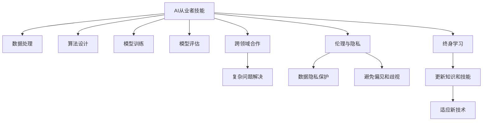

                 

## 1. 背景介绍

### 1.1 问题由来

在过去的几十年里，人工智能（AI）技术迅猛发展，尤其是在计算能力、数据量和算法复杂性方面的突破，使得机器能够处理大量复杂任务。这不仅推动了科技进步，也对全球经济、社会、文化和环境产生了深远影响。然而，随着AI的普及和应用范围的扩大，也给人类社会带来了诸多挑战，包括就业结构变化、道德伦理问题、隐私安全风险等。因此，如何在人类计算时代中培养出具备强大技能和伦理素养的AI从业者，已成为当前亟需解决的重要课题。

### 1.2 问题核心关键点

在AI时代，技能和培训的重要性不言而喻。AI从业者不仅需要掌握算法、数据处理、编程等核心技术技能，还需要具备批判性思维、伦理判断、团队协作等多方面的综合能力。同时，随着AI技术应用范围的不断扩展，跨领域合作和创新能力的培养也成为不可忽视的重点。

本文旨在探讨如何通过技能和培训，为人类计算时代做好准备。我们将从核心概念、算法原理、操作步骤、数学模型、项目实践、应用场景、工具和资源推荐等多个维度，全面剖析AI从业者所需掌握的技能和培训体系，希望能为相关领域的研究者、教育工作者和从业者提供有价值的参考。

## 2. 核心概念与联系

### 2.1 核心概念概述

- **AI从业者技能**：包括但不限于算法设计、模型训练、数据处理、编程语言、模型评估等技术技能。
- **跨领域合作**：指AI从业者与不同学科背景的专业人士合作，共同解决复杂问题的能力。
- **伦理与隐私**：在AI开发和应用过程中，如何保障数据隐私、尊重个体权益、避免偏见和歧视等方面的伦理考量。
- **终身学习**：AI从业者需要不断更新知识和技能，以适应快速发展的技术和应用需求。

### 2.2 核心概念原理和架构的 Mermaid 流程图



此图展示了AI从业者所需具备的关键技能和概念之间的联系。数据处理、算法设计、模型训练和评估是AI开发的基础技能；跨领域合作和复杂问题解决能力则是应用AI技术解决实际问题的必备能力；伦理与隐私保障是AI应用中不可忽视的重要考量；终身学习则保证了AI从业者的技能与时俱进。

## 3. 核心算法原理 & 具体操作步骤

### 3.1 算法原理概述

AI从业者需要掌握多种算法原理，包括但不限于监督学习、无监督学习、强化学习、迁移学习、深度学习等。这些算法构成了AI开发的基石，为处理复杂问题提供了强大的工具。

### 3.2 算法步骤详解

1. **数据收集与预处理**：收集相关领域的数据，进行清洗、归一化、特征工程等预处理操作，为模型训练准备数据。
2. **模型选择与设计**：根据任务类型选择合适的模型架构和损失函数，进行模型设计。
3. **模型训练与优化**：使用训练数据对模型进行训练，通过梯度下降等优化算法调整模型参数，最小化损失函数。
4. **模型评估与验证**：在验证集上评估模型性能，通过交叉验证等方法进行调参和优化。
5. **模型部署与应用**：将训练好的模型部署到实际应用场景中，进行实时推理和预测。

### 3.3 算法优缺点

- **优点**：算法多样，适用于各种AI任务；通过大量数据训练，可以有效提升模型性能；可以通过多种优化策略，适应不同的应用场景。
- **缺点**：算法复杂，需要较高数学和编程基础；模型训练和优化过程中可能存在过拟合和欠拟合问题；模型评估和验证需要大量计算资源和时间。

### 3.4 算法应用领域

AI算法广泛应用于各个领域，包括但不限于医疗健康、金融、交通、教育、环境保护等。例如，在医疗健康领域，通过深度学习算法分析医学影像，提高诊断准确率；在金融领域，通过机器学习算法预测市场趋势，优化投资策略；在交通领域，通过强化学习算法优化交通流量控制，减少拥堵。

## 4. 数学模型和公式 & 详细讲解 & 举例说明

### 4.1 数学模型构建

在AI算法中，数学模型起着至关重要的作用。以下是一些常见模型的数学构建公式：

- **线性回归模型**：$y = \theta_0 + \theta_1 x_1 + \theta_2 x_2 + \cdots + \theta_n x_n$
- **逻辑回归模型**：$P(y=1|x;\theta) = \frac{1}{1+\exp(-\theta_0 - \theta_1 x_1 - \theta_2 x_2 - \cdots - \theta_n x_n)}$
- **支持向量机模型**：$y = \sum_{i=1}^{n} \alpha_i y_i - \frac{1}{2} \sum_{i,j=1}^{n} y_i y_j \alpha_i \alpha_j g(x_i, x_j) + \sum_{i=1}^{n} \alpha_i - \frac{1}{2}$
- **神经网络模型**：$\hat{y} = \sigma(\sum_{i=1}^{n} w_i x_i + b)$

### 4.2 公式推导过程

以线性回归模型为例，推导其最小二乘法解的公式：

设样本集为 $(x_1, y_1), (x_2, y_2), \cdots, (x_m, y_m)$，回归函数为 $y = \theta_0 + \theta_1 x_1 + \theta_2 x_2 + \cdots + \theta_n x_n$。

最小二乘法求解 $\theta$ 的公式为：

$$
\hat{\theta} = \left(\sum_{i=1}^{m} x_i^2 \right)^{-1} \left(\sum_{i=1}^{m} x_i y_i\right)
$$

### 4.3 案例分析与讲解

在实际应用中，线性回归模型常用于房价预测、股票价格预测等任务。例如，通过收集历史房价数据，使用线性回归模型预测未来房价。通过最小二乘法求解，得到房价的预测公式，进而对未来房价进行预测。

## 5. 项目实践：代码实例和详细解释说明

### 5.1 开发环境搭建

- **Python 3.x**：选择 Python 3.x 版本，安装必要的第三方库，如 NumPy、Pandas、Scikit-learn、TensorFlow 等。
- **Jupyter Notebook**：用于编写和执行 Python 代码，支持代码块、输出、注释等多种功能。
- **Git 版本控制**：使用 Git 进行代码版本管理，方便团队协作和代码迭代。

### 5.2 源代码详细实现

以下是一个简单的线性回归模型的实现示例：

```python
import numpy as np

# 生成随机数据
np.random.seed(42)
x = np.random.rand(100, 1)
y = 2 * x + np.random.randn(100, 1) * 0.1

# 最小二乘法求解回归系数
theta = np.linalg.inv(x.T @ x) @ x.T @ y

# 计算预测值
x_test = np.array([[0.5], [0.75]])
y_pred = theta[0] + theta[1] * x_test

print(y_pred)
```

### 5.3 代码解读与分析

- **数据生成**：使用 NumPy 生成随机数据，模拟房价预测任务。
- **最小二乘法求解**：使用 NumPy 的线性代数库求解回归系数。
- **模型预测**：通过求解出的回归系数对测试数据进行预测，得到房价的预测值。

## 6. 实际应用场景

### 6.1 医疗健康

在医疗健康领域，AI算法被广泛应用于疾病诊断、个性化治疗、药物研发等任务。例如，通过深度学习算法分析医学影像，识别病变区域，提高诊断准确率；使用自然语言处理算法分析患者病历，提取关键信息，辅助医生制定治疗方案。

### 6.2 金融

在金融领域，AI算法被用于股票价格预测、信用风险评估、欺诈检测等任务。例如，通过机器学习算法分析市场数据，预测股票价格走势；使用强化学习算法优化投资组合，降低风险。

### 6.3 交通

在交通领域，AI算法被用于交通流量预测、智能交通控制、自动驾驶等任务。例如，通过深度学习算法分析交通数据，预测交通流量；使用强化学习算法优化交通信号控制，减少拥堵。

### 6.4 未来应用展望

随着AI技术的不断发展和应用，未来AI将进一步渗透到各个领域，带来更多创新应用。例如，在环境保护领域，通过AI算法分析环境数据，预测气候变化趋势，优化资源利用；在教育领域，通过AI算法分析学习数据，个性化推荐学习资源，提升教育质量。

## 7. 工具和资源推荐

### 7.1 学习资源推荐

1. **Coursera、edX**：提供大量高质量的在线课程，涵盖AI技术、数据科学、机器学习等多个领域。
2. **Kaggle**：数据科学竞赛平台，提供丰富的数据集和竞赛任务，实践AI算法。
3. **GitHub**：代码托管平台，可以浏览和下载各种开源AI项目，学习优秀的代码实现。
4. **Stack Overflow**：问答社区，遇到技术问题时，可以在此寻求帮助。

### 7.2 开发工具推荐

1. **Jupyter Notebook**：支持代码执行、输出显示、注释等，适合AI项目开发和协作。
2. **PyCharm**：强大的Python开发工具，提供代码自动补全、调试、版本控制等。
3. **TensorFlow、PyTorch**：流行的深度学习框架，提供丰富的API和示例，加速模型开发。
4. **Git、GitHub**：版本控制工具，方便代码管理、协作和迭代。

### 7.3 相关论文推荐

1. **Deep Learning**：Ian Goodfellow、Yoshua Bengio 和 Aaron Courville 合著的深度学习经典教材，详细介绍了深度学习的理论基础和实践方法。
2. **Hands-On Machine Learning with Scikit-Learn and TensorFlow**：Aurélien Géron 的机器学习实战书籍，提供了大量代码示例和实际案例。
3. **Reinforcement Learning: An Introduction**：Richard S. Sutton 和 Andrew G. Barto 的经典教材，系统介绍了强化学习理论和算法。

## 8. 总结：未来发展趋势与挑战

### 8.1 研究成果总结

AI技术的发展离不开教育、科研、产业界的共同努力。过去几十年，AI领域取得了许多重要研究成果，为AI技术的广泛应用奠定了坚实基础。

### 8.2 未来发展趋势

1. **AI技术的普及和应用**：随着AI技术的不断成熟和普及，未来将在各个领域得到更广泛的应用，带来更多创新。
2. **AI教育的提升**：AI教育将成为教育体系中的重要组成部分，培养更多具备AI技能的复合型人才。
3. **AI伦理和隐私保障**：随着AI应用范围的扩大，伦理和隐私问题将受到更多关注，相关研究和应用也将得到进一步发展。

### 8.3 面临的挑战

1. **数据隐私和安全**：AI应用过程中，如何保护数据隐私和安全，避免数据泄露和滥用。
2. **算法透明和可解释性**：如何提高算法的透明性和可解释性，使AI系统的决策过程可理解和可信。
3. **模型公平性和偏见**：如何避免AI模型中的偏见和歧视，确保AI系统的公平性。
4. **多领域合作和跨学科融合**：如何促进AI技术与不同学科的融合，推动更多创新应用。

### 8.4 研究展望

未来，AI技术的持续发展将依赖于教育、科研、产业界的共同努力。只有不断提升AI教育水平，加强跨领域合作，解决伦理和隐私问题，才能更好地推动AI技术的发展和应用。

## 9. 附录：常见问题与解答

**Q1: 如何选择合适的AI算法？**

A: 选择AI算法时，需要考虑数据类型、问题类型、模型复杂度等因素。例如，对于结构化数据，可以使用监督学习算法；对于非结构化数据，可以使用无监督学习或半监督学习算法。

**Q2: 如何在AI开发中避免过拟合？**

A: 避免过拟合的方法包括数据增强、正则化、早停、集成学习等。数据增强可以通过对原始数据进行扩充和变换，增加模型的泛化能力；正则化可以通过L1、L2正则化等方法，限制模型的复杂度；早停可以在验证集上监控模型性能，避免模型过拟合；集成学习可以通过组合多个模型的预测结果，提高模型稳定性。

**Q3: 如何评估AI模型的性能？**

A: 评估AI模型性能的指标包括但不限于准确率、召回率、F1分数、ROC曲线等。根据具体任务和应用场景选择合适的评估指标，通过交叉验证等方法进行模型调优和优化。

---

作者：禅与计算机程序设计艺术 / Zen and the Art of Computer Programming

