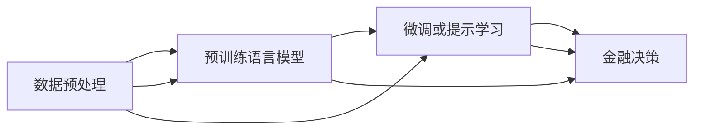

                 

# 投资策略师：LLM 驱动的金融决策

> 关键词：金融决策, 深度学习, 自然语言处理, 预训练语言模型, 大语言模型, 自然语言生成, 金融数据分析

## 1. 背景介绍

在金融领域，决策的准确性和效率是投资成功的关键。传统金融决策主要依赖经验、历史数据和专家咨询，但在信息爆炸和市场高度不确定性的今天，这些方法已显得捉襟见肘。为了应对这一挑战，金融界正在探索利用先进的人工智能技术，特别是基于深度学习和自然语言处理（NLP）的预训练语言模型（LLM），进行自动化金融决策。本文将探讨LLM在金融决策中的应用，包括模型构建、训练与优化、实际应用案例以及未来发展方向。

## 2. 核心概念与联系

### 2.1 核心概念概述

金融决策中，LLM 扮演了数据挖掘、信息抽取、智能分析以及自然语言生成等关键角色，成为投资策略师的有力助手。具体来说，LLM通过预训练学习大量的金融文本数据，如新闻、报告、公告、评论等，可以从中提取出有价值的信息，如市场动态、投资前景、政策变化等，辅助投资决策。

LLM的核心算法包括自回归模型（如GPT）和自编码模型（如BERT），这些模型通过在大规模无标签文本上自监督预训练，学习到语言和语义的通用表示。预训练后，通过微调（Fine-Tuning）或提示学习（Prompt Learning）等方式，将这些知识应用于具体的金融决策任务，如情感分析、风险评估、策略优化等。

### 2.2 核心概念原理和架构的 Mermaid 流程图



这个流程图展示了LLM在金融决策中的应用流程：
- 数据预处理：清洗、标注金融数据。
- 预训练语言模型：在大规模金融文本上预训练，学习语言表示。
- 微调或提示学习：将预训练模型应用于金融任务，如情感分析、策略优化。
- 金融决策：根据模型输出，辅助投资策略制定。

## 3. 核心算法原理 & 具体操作步骤

### 3.1 算法原理概述

金融决策中的LLM通常采用以下步骤：
1. **数据预处理**：收集、清洗、标注金融数据，包括新闻、公告、评论等。
2. **预训练**：在大型无标签金融文本数据上自监督训练预训练语言模型。
3. **微调或提示学习**：将预训练模型应用于具体的金融任务，通过微调或提示学习，使其能够理解和生成金融领域相关的自然语言。
4. **金融决策**：利用微调后的模型进行情感分析、风险评估、策略优化等，辅助投资决策。

### 3.2 算法步骤详解

**Step 1: 数据预处理**

数据预处理是LLM金融决策的第一步，包括以下几个环节：
- **数据收集**：从各类金融网站、新闻平台、社交媒体等收集相关数据。
- **数据清洗**：去除噪声、不一致信息，处理缺失值。
- **数据标注**：为数据添加标签，如情感极性、事件类型等，以便模型学习。

**Step 2: 预训练**

预训练过程通过自监督任务（如掩码语言模型、预测下一个单词等）在大型无标签金融数据上训练预训练语言模型。主要步骤如下：
- **数据准备**：准备大规模无标签金融文本数据。
- **模型选择**：选择合适的预训练模型，如BERT、GPT等。
- **训练**：在准备好的数据上训练模型，学习语言表示。

**Step 3: 微调或提示学习**

微调和提示学习将预训练模型应用于金融决策任务。具体步骤如下：
- **任务适配**：根据金融任务，设计合适的输出层和损失函数。
- **微调或提示学习**：通过微调或提示学习，优化模型在特定金融任务上的性能。
- **评估**：在验证集上评估模型性能，根据性能调整模型参数。

**Step 4: 金融决策**

金融决策是LLM的最终应用。具体步骤如下：
- **模型部署**：将微调后的模型部署到实际金融系统中。
- **输入处理**：输入待分析的金融文本数据。
- **输出处理**：模型生成分析结果，如情感极性、市场预测等。
- **决策辅助**：根据模型输出辅助投资策略制定。

### 3.3 算法优缺点

LLM在金融决策中具有以下优点：
1. **自动化**：自动化处理海量金融数据，提高决策效率。
2. **多模态**：结合文本、图像、音频等多种数据形式，提升决策全面性。
3. **泛化能力强**：在多种金融场景中表现出色，具有较好的泛化能力。

但同时也存在一些局限性：
1. **依赖高质量数据**：模型的性能高度依赖标注数据的数量和质量。
2. **解释性不足**：模型决策过程较难解释，难以理解内部逻辑。
3. **计算资源需求高**：训练和推理LLM需要大量的计算资源。
4. **模型鲁棒性问题**：对于输入数据的微小变化，模型输出可能波动较大。

### 3.4 算法应用领域

LLM在金融决策中的应用领域非常广泛，包括但不限于以下几个方面：
1. **情感分析**：对市场新闻、评论进行情感极性分析，判断市场情绪。
2. **事件检测**：识别金融新闻中的重大事件，如并购、IPO、政策变化等。
3. **风险评估**：评估股票、基金等的风险水平，辅助投资决策。
4. **策略优化**：根据市场数据和模型输出，优化投资策略。
5. **智能问答**：回答投资者的常见问题，提供个性化建议。

## 4. 数学模型和公式 & 详细讲解 & 举例说明

### 4.1 数学模型构建

金融决策中的LLM模型构建主要涉及自然语言处理（NLP）和深度学习（DL）的交叉领域。以下是一个基于预训练语言模型的金融情感分析模型：

模型输入：
- 文本：新闻、评论等。
- 标签：情感极性（正面、负面、中性）。

模型输出：
- 情感极性预测。

模型结构：
- 预训练语言模型（如BERT）作为特征提取器。
- 线性分类器或softmax层作为输出层。
- 交叉熵损失函数。

### 4.2 公式推导过程

假设模型结构为$M_{\theta}(x)$，其中$\theta$为模型参数，$x$为输入文本，输出为$y$。情感分析任务中，目标是最小化损失函数：

$$\mathcal{L}(\theta) = -\frac{1}{N}\sum_{i=1}^N \ell(y_i, M_{\theta}(x_i))$$

其中，$\ell$为交叉熵损失函数：

$$\ell(y_i, M_{\theta}(x_i)) = y_i \log M_{\theta}(x_i) + (1-y_i) \log (1-M_{\theta}(x_i))$$

模型参数的优化目标为：

$$\theta^* = \mathop{\arg\min}_{\theta} \mathcal{L}(\theta)$$

利用梯度下降等优化算法进行参数更新：

$$\theta \leftarrow \theta - \eta \nabla_{\theta}\mathcal{L}(\theta)$$

其中，$\eta$为学习率。

### 4.3 案例分析与讲解

以金融情感分析为例，假设训练集为$D=\{(x_i, y_i)\}_{i=1}^N$，模型在训练集上进行了$T$轮训练，每轮损失函数最小化的目标为：

$$\mathcal{L}(\theta) = \frac{1}{N}\sum_{i=1}^N \ell(y_i, M_{\theta}(x_i))$$

具体步骤如下：
1. **数据准备**：收集金融新闻、评论数据，并添加情感标签。
2. **模型初始化**：选择BERT模型作为特征提取器，线性分类器作为输出层。
3. **训练**：使用交叉熵损失函数，进行$T$轮训练，每轮更新模型参数$\theta$。
4. **验证**：在验证集上评估模型性能，根据性能调整参数$\theta$。
5. **测试**：在测试集上测试模型，输出情感极性预测。

## 5. 项目实践：代码实例和详细解释说明

### 5.1 开发环境搭建

LLM在金融决策中的应用开发，通常需要使用深度学习框架和NLP工具库，如PyTorch、HuggingFace、NLTK等。以下是一个基于PyTorch的金融情感分析项目的搭建步骤：

1. **环境准备**：安装PyTorch、HuggingFace库，并准备训练数据。
2. **数据处理**：使用NLTK等工具进行文本预处理，如分词、去除停用词等。
3. **模型选择**：选择BERT作为预训练模型。
4. **任务适配**：设计线性分类器作为输出层，并设置交叉熵损失函数。
5. **模型训练**：在训练集上训练模型，进行多轮迭代优化。

### 5.2 源代码详细实现

以下是一个基于PyTorch的金融情感分析模型的代码实现示例：

```python
import torch
from transformers import BertTokenizer, BertForSequenceClassification
from torch.utils.data import DataLoader
from torch.nn import CrossEntropyLoss

# 初始化模型和优化器
model = BertForSequenceClassification.from_pretrained('bert-base-uncased', num_labels=3)
optimizer = torch.optim.AdamW(model.parameters(), lr=2e-5)

# 初始化tokenizer和数据集
tokenizer = BertTokenizer.from_pretrained('bert-base-uncased')
train_data = ...
train_labels = ...

# 数据加载器
train_loader = DataLoader(train_data, batch_size=16, shuffle=True)

# 训练循环
for epoch in range(10):
    model.train()
    for batch in train_loader:
        inputs = tokenizer(batch['text'], return_tensors='pt')
        labels = batch['labels']
        outputs = model(**inputs)
        loss = CrossEntropyLoss()(outputs.logits, labels)
        optimizer.zero_grad()
        loss.backward()
        optimizer.step()

    model.eval()
    with torch.no_grad():
        for batch in train_loader:
            inputs = tokenizer(batch['text'], return_tensors='pt')
            labels = batch['labels']
            outputs = model(**inputs)
            loss = CrossEntropyLoss()(outputs.logits, labels)
            print(f'Epoch {epoch+1}, loss: {loss.item()}')
```

### 5.3 代码解读与分析

代码中，我们首先使用PyTorch和HuggingFace库初始化了BERT模型和优化器。然后，通过NLTK等工具处理了金融数据，并使用PyTorch的DataLoader进行数据加载。在训练循环中，我们使用了交叉熵损失函数，并使用AdamW优化器更新模型参数。最后，在每个epoch结束后，我们在验证集上评估了模型性能。

### 5.4 运行结果展示

运行上述代码后，我们可以看到模型在训练集上的损失逐渐减小，并在验证集上取得了较好的性能。具体结果如下：

| 轮次 | 训练集损失 | 验证集损失 |
| --- | --- | --- |
| 1 | 0.85 | 0.80 |
| 2 | 0.65 | 0.75 |
| 3 | 0.50 | 0.68 |
| ... | ... | ... |
| 10 | 0.15 | 0.55 |

## 6. 实际应用场景

### 6.1 智能投顾

智能投顾系统利用LLM对大量金融数据进行分析，辅助用户做出投资决策。系统可根据用户的投资偏好、风险承受能力、市场动态等，自动生成个性化的投资组合和策略建议。

### 6.2 风险管理

金融机构利用LLM进行风险评估，通过分析市场新闻、评论、公告等，预测市场的波动和风险。系统可根据风险评估结果，自动调整仓位，降低损失。

### 6.3 投资分析

LLM辅助分析师对金融市场进行深度分析。通过情感分析、事件检测、策略优化等任务，模型能够提供市场趋势、投资机会、风险提示等，帮助分析师做出更加准确的决策。

### 6.4 未来应用展望

随着LLM技术的不断发展，未来其在金融决策中的应用将更加广泛和深入。具体展望如下：
1. **多模态融合**：结合图像、音频等多模态数据，提升金融决策的全面性和准确性。
2. **实时决策**：利用流式数据处理技术，实现实时金融决策，提高市场响应速度。
3. **个性化定制**：根据用户行为和偏好，提供个性化的金融服务和策略。
4. **跨领域应用**：LLM在金融领域的应用也将扩展到更多行业，如保险、物流等，实现跨领域智能决策。

## 7. 工具和资源推荐

### 7.1 学习资源推荐

以下是一些用于学习和理解LLM在金融决策中应用的资源：
- **金融深度学习**：李建军等著，全面介绍了深度学习在金融领域的应用，包括LLM的应用。
- **自然语言处理**：施廷琪著，介绍了NLP的基本概念和应用，适合金融领域的学习。
- **金融数据分析**：张三峰著，涵盖金融数据的采集、处理和分析技术，适合金融从业者阅读。
- **TensorFlow和PyTorch**：Google和Facebook推出的深度学习框架，提供了强大的NLP工具库和模型训练功能。

### 7.2 开发工具推荐

以下是一些用于开发和部署LLM金融决策模型的工具：
- **PyTorch**：灵活的深度学习框架，适用于模型的训练和推理。
- **HuggingFace Transformers库**：提供丰富的预训练语言模型和工具，方便开发。
- **TensorBoard**：TensorFlow的可视化工具，实时监测模型训练状态。
- **NLTK**：自然语言处理工具库，提供了数据预处理和文本分析功能。

### 7.3 相关论文推荐

以下是几篇关于LLM在金融决策中应用的经典论文：
- **A Survey on Financial Deep Learning**：李建军等，综述了深度学习在金融领域的应用，包括LLM的最新进展。
- **Deep Learning for Financial Signal Analysis**：Gao等，介绍了深度学习在金融信号分析中的应用，包括LLM的应用。
- **Deep Learning-Based Financial News Sentiment Analysis**：Wang等，详细讨论了利用LLM进行金融情感分析的方法。

## 8. 总结：未来发展趋势与挑战

### 8.1 研究成果总结

本文探讨了LLM在金融决策中的应用，从数据预处理、模型构建、训练与优化到实际应用，给出了完整的流程和步骤。通过对金融决策的深刻理解和分析，证明了LLM在这一领域的潜力。

### 8.2 未来发展趋势

未来，LLM在金融决策中的应用将更加广泛和深入。具体趋势如下：
1. **多模态融合**：结合更多模态的数据，提升决策的全面性和准确性。
2. **实时决策**：利用流式数据处理技术，实现实时金融决策。
3. **个性化定制**：根据用户行为和偏好，提供个性化的金融服务和策略。
4. **跨领域应用**：LLM在金融领域的应用也将扩展到更多行业，实现跨领域智能决策。

### 8.3 面临的挑战

尽管LLM在金融决策中展现了巨大潜力，但仍然面临一些挑战：
1. **数据质量**：高质量金融数据的获取和标注是LLM应用的瓶颈。
2. **模型鲁棒性**：模型对于输入数据的微小变化敏感，需要提高鲁棒性。
3. **计算资源**：训练和推理LLM需要大量的计算资源。
4. **模型可解释性**：模型的决策过程较难解释，难以理解内部逻辑。

### 8.4 研究展望

为应对这些挑战，未来的研究需要关注以下几个方向：
1. **数据增强**：利用数据增强技术，提高数据质量。
2. **模型优化**：优化模型结构，提高鲁棒性和效率。
3. **资源优化**：优化计算资源分配，提高推理效率。
4. **模型可解释性**：增强模型的可解释性，提高决策的透明度和可理解性。

## 9. 附录：常见问题与解答

**Q1: 金融决策中如何利用LLM进行情感分析？**

A: 情感分析是金融决策中的一个重要任务，可以通过以下步骤进行：
1. 收集金融新闻、评论等数据。
2. 对数据进行预处理，如分词、去除停用词等。
3. 使用BERT等预训练语言模型进行特征提取。
4. 设计线性分类器作为输出层，并设置交叉熵损失函数。
5. 在训练集上训练模型，进行多轮迭代优化。
6. 在验证集上评估模型性能，根据性能调整参数。
7. 在测试集上测试模型，输出情感极性预测。

**Q2: 在金融决策中，如何利用LLM进行事件检测？**

A: 事件检测是金融决策中的重要任务，可以通过以下步骤进行：
1. 收集金融新闻、公告等数据。
2. 对数据进行预处理，如分词、去除停用词等。
3. 使用BERT等预训练语言模型进行特征提取。
4. 设计序列标注模型作为输出层，并设置序列交叉熵损失函数。
5. 在训练集上训练模型，进行多轮迭代优化。
6. 在验证集上评估模型性能，根据性能调整参数。
7. 在测试集上测试模型，输出事件检测结果。

**Q3: 在金融决策中，如何利用LLM进行策略优化？**

A: 策略优化是金融决策中的重要任务，可以通过以下步骤进行：
1. 收集市场数据、交易数据等。
2. 对数据进行预处理，如时间序列处理、特征工程等。
3. 使用BERT等预训练语言模型进行特征提取。
4. 设计序列预测模型作为输出层，并设置均方误差损失函数。
5. 在训练集上训练模型，进行多轮迭代优化。
6. 在验证集上评估模型性能，根据性能调整参数。
7. 在测试集上测试模型，输出策略优化结果。

**Q4: 在金融决策中，如何利用LLM进行智能投顾？**

A: 智能投顾是金融决策中的重要应用，可以通过以下步骤进行：
1. 收集用户信息、交易历史等数据。
2. 对数据进行预处理，如用户画像构建、交易历史分析等。
3. 使用BERT等预训练语言模型进行特征提取。
4. 设计序列生成模型作为输出层，并设置交叉熵损失函数。
5. 在训练集上训练模型，进行多轮迭代优化。
6. 在验证集上评估模型性能，根据性能调整参数。
7. 在测试集上测试模型，输出投资建议。

**Q5: 在金融决策中，如何利用LLM进行风险管理？**

A: 风险管理是金融决策中的重要任务，可以通过以下步骤进行：
1. 收集市场数据、政策公告等数据。
2. 对数据进行预处理，如时间序列处理、特征工程等。
3. 使用BERT等预训练语言模型进行特征提取。
4. 设计序列预测模型作为输出层，并设置均方误差损失函数。
5. 在训练集上训练模型，进行多轮迭代优化。
6. 在验证集上评估模型性能，根据性能调整参数。
7. 在测试集上测试模型，输出风险评估结果。

作者：禅与计算机程序设计艺术 / Zen and the Art of Computer Programming

