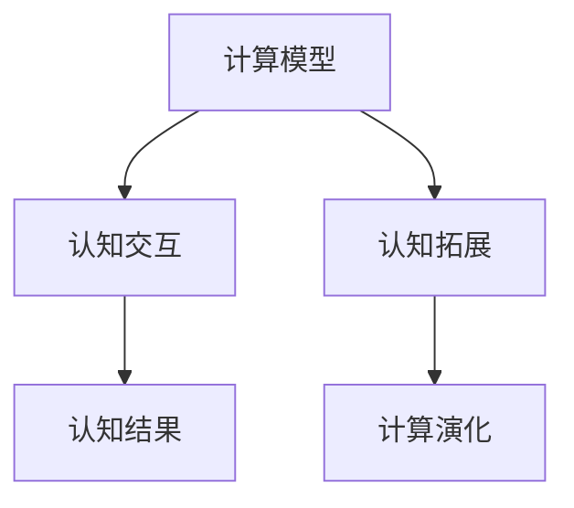

                 

# 拓展认知边界：人类计算的科学探索

> 关键词：人类计算,科学探索,认知拓展,计算模型,计算演化

## 1. 背景介绍

在人类历史的长河中，计算是文明进步的重要驱动力。从早期的手摇计算器到今天强大的计算机，计算技术一直是人类探索未知、理解世界的重要工具。随着技术的不断演进，计算的规模、速度和能力都在迅速提升，人类的认知边界也在被不断地拓展。

在信息时代，计算不再局限于数字和算术运算，而是深入到了更为复杂的符号逻辑和认知过程。计算模型从早期的图灵机、布尔代数演进到现代的量子计算、神经网络，每一次模型上的突破都带来了认知能力的飞跃。计算不仅是“计算”，更是“思考”，是人类探索未知世界的强大引擎。

本文将从计算模型的发展历程出发，探讨计算与认知的关系，研究人类计算演化的科学规律，并展望未来计算的前沿方向。希望通过这篇文章，读者能够更深刻地理解计算的科学价值，认识到计算在拓展人类认知边界中的重要作用。

## 2. 核心概念与联系

### 2.1 核心概念概述

要理解人类计算的科学探索，首先需要明确几个核心概念：

- **计算模型(Computational Model)**：指用于描述计算过程的抽象模型。计算模型可以包括从简单的加减乘除到复杂的神经网络、图神经网络等。
- **认知(Cognition)**：指人类对外部世界的信息接收、加工和处理过程。认知包括感知、记忆、学习、推理等阶段。
- **计算与认知的交互**：计算不仅用于处理数值和逻辑，更通过模拟和解释复杂的认知过程，促进认知的深入和拓展。
- **计算演化(Calculational Evolution)**：指计算模型随时间和技术进步而演化的过程。每一次计算模型的重大突破，都伴随着对认知能力的深刻提升。

### 2.2 核心概念原理和架构的 Mermaid 流程图



这个流程图展示了大语言模型微调的相关核心概念及其相互关系：

1. 计算模型对认知过程进行模拟和解释。
2. 计算与认知的交互使得模型能够更好地理解和处理现实世界的复杂问题。
3. 计算演化推动了认知能力的不断提升。

## 3. 核心算法原理 & 具体操作步骤

### 3.1 算法原理概述

人类计算的科学探索，本质上是通过构建和优化计算模型，模拟和解释复杂的认知过程，从而拓展人类认知边界。这一过程通常包括以下几个步骤：

1. **计算模型的构建**：基于现有的认知理论和实际数据，构建用于模拟和解释认知过程的计算模型。
2. **模型的训练和优化**：使用大量数据对模型进行训练，优化模型参数，使其能够更好地模拟人类认知过程。
3. **认知模型的验证和评估**：通过一系列的实验和评估，验证模型在特定认知任务上的表现，并进行持续优化。
4. **计算与认知的交互应用**：将模型应用于实际问题中，验证其对认知过程的模拟效果，并进一步优化。

### 3.2 算法步骤详解

**步骤1：计算模型的构建**

构建计算模型的第一步是确定模型的结构和参数。以人工神经网络为例，神经网络的模型结构通常由输入层、隐藏层和输出层组成。其中，输入层接收输入数据，隐藏层对数据进行抽象和转换，输出层输出模型的预测结果。

以视觉识别任务为例，输入层可以接收像素图像数据，隐藏层可以设计为卷积层、池化层、全连接层等，输出层为分类层。通过选择合适的模型结构和参数，构建可用于模拟视觉识别过程的计算模型。

**步骤2：模型的训练和优化**

模型的训练和优化阶段是计算模型科学探索的核心。以神经网络为例，训练过程通常包括前向传播和反向传播两个步骤。

1. **前向传播**：将输入数据输入模型，模型通过隐藏层对数据进行抽象，最终输出预测结果。
2. **反向传播**：通过与真实标签进行比较，计算模型预测结果与真实结果之间的误差，并通过反向传播算法更新模型参数，以最小化误差。

模型的优化通常通过设置合适的损失函数和优化算法实现。以交叉熵损失函数和随机梯度下降算法为例，交叉熵损失函数用于衡量模型预测结果与真实结果之间的差异，随机梯度下降算法用于最小化损失函数，更新模型参数。

**步骤3：认知模型的验证和评估**

模型的验证和评估阶段是确保计算模型科学性的重要步骤。通常通过一系列的实验和评估，验证模型的表现，并进行持续优化。以视觉识别任务为例，模型可以通过在测试集上的准确率、召回率和F1分数等指标进行评估，进一步调整模型的结构和参数。

**步骤4：计算与认知的交互应用**

计算与认知的交互应用阶段是将计算模型应用于实际问题中，验证其对认知过程的模拟效果，并进一步优化。以视觉识别任务为例，模型可以通过在实际图像识别任务中的应用，进一步优化其参数和结构，提升模型的性能。

### 3.3 算法优缺点

人类计算的科学探索算法具有以下优点：

- **高效的模型训练**：计算模型可以通过大量数据进行训练和优化，提高模型的预测准确率。
- **泛化能力强**：计算模型可以应用于不同的认知任务，具有较强的泛化能力。
- **算法可解释性强**：计算模型通常具有较强的可解释性，便于理解和调试。

同时，该算法也存在一定的局限性：

- **数据依赖性强**：模型的训练和优化依赖于大量高质量的标注数据，获取高质量数据成本较高。
- **模型复杂度高**：复杂的计算模型需要大量的计算资源和时间，训练过程较为耗时。
- **认知过程抽象难度大**：复杂的认知过程难以通过计算模型进行抽象和模拟，存在一定的局限性。

尽管存在这些局限性，但就目前而言，计算模型在认知科学探索中仍具有重要的应用价值。未来相关研究的重点在于如何进一步降低数据需求，提高模型的泛化能力和计算效率，同时兼顾模型复杂度和可解释性。

### 3.4 算法应用领域

计算模型在人类计算科学探索中的应用领域非常广泛，包括但不限于：

- **视觉识别**：使用神经网络模型对图像进行识别和分类。
- **自然语言处理**：使用神经网络模型对文本进行情感分析、命名实体识别、机器翻译等。
- **语音识别**：使用深度学习模型对语音进行识别和转换。
- **智能推荐**：使用推荐系统模型对用户行为进行分析和预测，提供个性化的推荐。
- **医疗诊断**：使用计算模型对医疗影像和文本进行分析和诊断。

除了上述这些经典应用外，计算模型还在智能家居、自动驾驶、金融预测等领域得到了广泛的应用，为各行各业带来了新的技术突破。

## 4. 数学模型和公式 & 详细讲解 & 举例说明

### 4.1 数学模型构建

计算模型的构建通常涉及多个数学模型和算法。以下以卷积神经网络(CNN)为例，介绍其数学模型的构建过程。

卷积神经网络由卷积层、池化层和全连接层组成。其中，卷积层通过卷积核对输入数据进行特征提取，池化层对特征进行降维，全连接层对特征进行分类。

### 4.2 公式推导过程

以简单的图像分类任务为例，我们可以使用如下公式描述CNN的计算过程：

1. **卷积层**：
   $$
   y = W * x + b
   $$
   其中，$y$ 表示卷积层的输出，$x$ 表示输入数据，$W$ 表示卷积核，$b$ 表示偏置项。

2. **激活函数**：
   $$
   y' = f(y)
   $$
   其中，$f(y)$ 表示激活函数，如ReLU函数。

3. **池化层**：
   $$
   y'' = f(y')
   $$
   其中，$f(y')$ 表示池化函数，如最大池化函数。

4. **全连接层**：
   $$
   y''' = W' * y'' + b'
   $$
   其中，$y'''$ 表示全连接层的输出，$y''$ 表示池化层的输出，$W'$ 表示全连接层的权重矩阵，$b'$ 表示全连接层的偏置项。

### 4.3 案例分析与讲解

以CIFAR-10数据集为例，使用卷积神经网络进行图像分类。我们可以使用如下代码实现模型的构建和训练：

```python
import torch
import torch.nn as nn
import torch.optim as optim
from torchvision import datasets, transforms

# 定义卷积神经网络模型
class ConvNet(nn.Module):
    def __init__(self):
        super(ConvNet, self).__init__()
        self.conv1 = nn.Conv2d(3, 32, 3, padding=1)
        self.conv2 = nn.Conv2d(32, 64, 3, padding=1)
        self.pool = nn.MaxPool2d(2, 2)
        self.fc1 = nn.Linear(64 * 4 * 4, 500)
        self.fc2 = nn.Linear(500, 10)

    def forward(self, x):
        x = self.pool(nn.functional.relu(self.conv1(x)))
        x = self.pool(nn.functional.relu(self.conv2(x)))
        x = x.view(-1, 64 * 4 * 4)
        x = nn.functional.relu(self.fc1(x))
        x = self.fc2(x)
        return x

# 加载CIFAR-10数据集
transform = transforms.Compose([transforms.ToTensor(), transforms.Normalize((0.5, 0.5, 0.5), (0.5, 0.5, 0.5))])
trainset = datasets.CIFAR10(root='./data', train=True, download=True, transform=transform)
trainloader = torch.utils.data.DataLoader(trainset, batch_size=64, shuffle=True, num_workers=2)

# 定义模型和优化器
model = ConvNet()
criterion = nn.CrossEntropyLoss()
optimizer = optim.SGD(model.parameters(), lr=0.001, momentum=0.9)

# 训练模型
for epoch in range(10):
    running_loss = 0.0
    for i, data in enumerate(trainloader, 0):
        inputs, labels = data
        optimizer.zero_grad()
        outputs = model(inputs)
        loss = criterion(outputs, labels)
        loss.backward()
        optimizer.step()

        running_loss += loss.item()
        if i % 2000 == 1999:
            print('[%d, %5d] loss: %.3f' %
                  (epoch + 1, i + 1, running_loss / 2000))
            running_loss = 0.0
```

这段代码实现了卷积神经网络模型在CIFAR-10数据集上的训练。其中，`ConvNet`类定义了卷积神经网络的模型结构，`criterion`定义了交叉熵损失函数，`optimizer`定义了随机梯度下降优化器。通过不断迭代训练，模型可以逐步优化其参数，提升在图像分类任务上的表现。

## 5. 项目实践：代码实例和详细解释说明

### 5.1 开发环境搭建

在进行计算模型科学探索的实践前，我们需要准备好开发环境。以下是使用Python进行PyTorch开发的环境配置流程：

1. 安装Anaconda：从官网下载并安装Anaconda，用于创建独立的Python环境。

2. 创建并激活虚拟环境：
```bash
conda create -n pytorch-env python=3.8 
conda activate pytorch-env
```

3. 安装PyTorch：根据CUDA版本，从官网获取对应的安装命令。例如：
```bash
conda install pytorch torchvision torchaudio cudatoolkit=11.1 -c pytorch -c conda-forge
```

4. 安装相关的开发工具包：
```bash
pip install numpy pandas scikit-learn matplotlib tqdm jupyter notebook ipython
```

5. 安装所需的库：
```bash
pip install torch torchvision
```

完成上述步骤后，即可在`pytorch-env`环境中开始计算模型科学探索的实践。

### 5.2 源代码详细实现

以下是一个简单的卷积神经网络模型实现的代码示例：

```python
import torch
import torch.nn as nn
import torch.optim as optim
from torchvision import datasets, transforms

# 定义卷积神经网络模型
class ConvNet(nn.Module):
    def __init__(self):
        super(ConvNet, self).__init__()
        self.conv1 = nn.Conv2d(3, 32, 3, padding=1)
        self.conv2 = nn.Conv2d(32, 64, 3, padding=1)
        self.pool = nn.MaxPool2d(2, 2)
        self.fc1 = nn.Linear(64 * 4 * 4, 500)
        self.fc2 = nn.Linear(500, 10)

    def forward(self, x):
        x = self.pool(nn.functional.relu(self.conv1(x)))
        x = self.pool(nn.functional.relu(self.conv2(x)))
        x = x.view(-1, 64 * 4 * 4)
        x = nn.functional.relu(self.fc1(x))
        x = self.fc2(x)
        return x

# 加载CIFAR-10数据集
transform = transforms.Compose([transforms.ToTensor(), transforms.Normalize((0.5, 0.5, 0.5), (0.5, 0.5, 0.5))])
trainset = datasets.CIFAR10(root='./data', train=True, download=True, transform=transform)
trainloader = torch.utils.data.DataLoader(trainset, batch_size=64, shuffle=True, num_workers=2)

# 定义模型和优化器
model = ConvNet()
criterion = nn.CrossEntropyLoss()
optimizer = optim.SGD(model.parameters(), lr=0.001, momentum=0.9)

# 训练模型
for epoch in range(10):
    running_loss = 0.0
    for i, data in enumerate(trainloader, 0):
        inputs, labels = data
        optimizer.zero_grad()
        outputs = model(inputs)
        loss = criterion(outputs, labels)
        loss.backward()
        optimizer.step()

        running_loss += loss.item()
        if i % 2000 == 1999:
            print('[%d, %5d] loss: %.3f' %
                  (epoch + 1, i + 1, running_loss / 2000))
            running_loss = 0.0
```

### 5.3 代码解读与分析

这段代码实现了卷积神经网络模型在CIFAR-10数据集上的训练。

- `ConvNet`类定义了卷积神经网络的模型结构，包括卷积层、池化层和全连接层。
- `criterion`定义了交叉熵损失函数，用于衡量模型预测结果与真实结果之间的差异。
- `optimizer`定义了随机梯度下降优化器，用于更新模型参数。
- 训练过程中，通过不断迭代训练，模型可以逐步优化其参数，提升在图像分类任务上的表现。

## 6. 实际应用场景

### 6.1 智能推荐系统

智能推荐系统通过计算模型对用户行为进行分析和预测，提供个性化的推荐。以Netflix推荐系统为例，Netflix使用基于协同过滤和内容推荐的计算模型，对用户行为数据进行分析和处理，推荐用户可能感兴趣的影视作品。

在技术实现上，可以使用深度学习模型对用户行为数据进行建模，通过推荐系统的优化算法和推荐算法，实现个性化的推荐。智能推荐系统的应用不仅限于影视推荐，还广泛应用于电商、社交、游戏等领域。

### 6.2 医疗诊断系统

医疗诊断系统通过计算模型对医疗影像和文本进行分析和诊断。以医学影像识别为例，使用卷积神经网络对医学影像进行分类和标注，辅助医生进行疾病诊断和治疗决策。

在技术实现上，可以使用卷积神经网络对医学影像进行分类，使用自然语言处理模型对医疗文本进行分析和诊断。医疗诊断系统的应用不仅限于影像和文本分析，还广泛应用于健康管理、药物研发等领域。

### 6.3 智能语音助手

智能语音助手通过计算模型对语音进行识别和理解，实现人机对话。以Amazon的Alexa为例，Alexa使用深度学习模型对用户语音进行识别和理解，提供个性化的语音交互和智能回答。

在技术实现上，可以使用深度学习模型对语音进行特征提取和分类，使用自然语言处理模型对语音进行理解和回答。智能语音助手的应用不仅限于语音识别和理解，还广泛应用于家居控制、导航、购物等领域。

### 6.4 未来应用展望

随着计算模型的不断发展，人类计算科学探索将面临更多的机遇和挑战。未来计算模型可能具有以下特点：

- **跨模态计算**：计算模型可以处理和融合多种模态数据，如文本、图像、语音、视频等，实现多模态信息的协同建模。
- **计算模型自适应**：计算模型可以动态调整其结构和参数，适应不同的数据分布和应用场景。
- **计算模型协同**：计算模型可以通过协同计算，实现更高效的分布式计算和资源共享。
- **计算模型自解释**：计算模型可以自动生成和解释其内部工作机制，提升模型的可解释性和可控性。
- **计算模型集成**：计算模型可以与其他智能技术进行集成，如知识图谱、因果推理等，实现更全面的认知探索。

未来计算模型的发展方向，将更加注重模型的可解释性、可控性和自适应性，实现更加智能和高效的认知探索。

## 7. 工具和资源推荐

### 7.1 学习资源推荐

为了帮助开发者系统掌握计算模型的科学探索的理论基础和实践技巧，这里推荐一些优质的学习资源：

1. 《深度学习》书籍：由Ian Goodfellow、Yoshua Bengio和Aaron Courville编写，全面介绍了深度学习的基本概念和经典模型。

2. 《机器学习实战》书籍：由Peter Harrington编写，通过实践案例详细讲解了机器学习模型的开发和应用。

3. 《Python深度学习》书籍：由Francois Chollet编写，详细介绍了TensorFlow和Keras等深度学习框架的开发和应用。

4. CS231n《卷积神经网络》课程：斯坦福大学开设的计算机视觉课程，介绍了卷积神经网络的基本概念和经典模型。

5. Coursera《深度学习专项课程》：由吴恩达开设的深度学习课程，涵盖深度学习的基本概念和经典模型。

通过对这些资源的学习实践，相信你一定能够快速掌握计算模型的科学探索的精髓，并用于解决实际的认知科学问题。

### 7.2 开发工具推荐

高效的开发离不开优秀的工具支持。以下是几款用于计算模型科学探索开发的常用工具：

1. PyTorch：基于Python的开源深度学习框架，灵活动态的计算图，适合快速迭代研究。

2. TensorFlow：由Google主导开发的开源深度学习框架，生产部署方便，适合大规模工程应用。

3. Keras：基于TensorFlow和Theano等后端的高级神经网络API，易于使用，适合快速开发原型。

4. Jupyter Notebook：交互式的数据科学笔记本，支持代码编写、数据可视化和模型训练。

5. TensorBoard：TensorFlow配套的可视化工具，可实时监测模型训练状态，并提供丰富的图表呈现方式。

6. Weights & Biases：模型训练的实验跟踪工具，可以记录和可视化模型训练过程中的各项指标，方便对比和调优。

合理利用这些工具，可以显著提升计算模型科学探索的开发效率，加快创新迭代的步伐。

### 7.3 相关论文推荐

计算模型在认知科学探索中的应用领域非常广泛，以下是几篇奠基性的相关论文，推荐阅读：

1. AlexNet: One Hundred Layers and the Original ImageNet Challenge：提出了卷积神经网络，开创了深度学习在计算机视觉领域的突破。

2. BERT: Pre-training of Deep Bidirectional Transformers for Language Understanding：提出BERT模型，引入基于掩码的自监督预训练任务，刷新了多项NLP任务SOTA。

3. ImageNet Classification with Deep Convolutional Neural Networks：提出卷积神经网络，应用于大规模图像分类任务，获得了SOTA性能。

4. Deep Residual Learning for Image Recognition：提出残差网络，解决了深度神经网络训练中的梯度消失问题，提升了模型的性能。

5. Attention is All You Need：提出Transformer模型，展示了自注意力机制在自然语言处理任务上的强大能力。

这些论文代表了大语言模型微调技术的发展脉络。通过学习这些前沿成果，可以帮助研究者把握学科前进方向，激发更多的创新灵感。

## 8. 总结：未来发展趋势与挑战

### 8.1 研究成果总结

本文对计算模型在科学探索中的应用进行了全面系统的介绍。首先阐述了计算模型对认知过程的模拟和解释，明确了计算模型在认知科学探索中的重要作用。其次，从计算模型的构建、训练和优化等方面，详细讲解了计算模型的科学探索过程。同时，本文还探讨了计算模型在多个实际问题中的应用，展示了计算模型科学探索的巨大潜力。

通过本文的系统梳理，可以看到，计算模型在认知科学探索中具有重要的应用价值。这些方向的探索发展，必将进一步提升认知科学的深度和广度，为人类认知智能的进化带来深远影响。

### 8.2 未来发展趋势

展望未来，计算模型的科学探索将呈现以下几个发展趋势：

1. **跨模态计算的崛起**：计算模型可以处理和融合多种模态数据，如文本、图像、语音、视频等，实现多模态信息的协同建模。

2. **计算模型的自适应**：计算模型可以动态调整其结构和参数，适应不同的数据分布和应用场景。

3. **计算模型的协同**：计算模型可以通过协同计算，实现更高效的分布式计算和资源共享。

4. **计算模型的自解释**：计算模型可以自动生成和解释其内部工作机制，提升模型的可解释性和可控性。

5. **计算模型的集成**：计算模型可以与其他智能技术进行集成，如知识图谱、因果推理等，实现更全面的认知探索。

以上趋势凸显了计算模型科学探索的广阔前景。这些方向的探索发展，必将进一步提升计算模型在认知科学探索中的作用，推动认知科学的进步。

### 8.3 面临的挑战

尽管计算模型在认知科学探索中已经取得了显著的进展，但在迈向更加智能化、普适化应用的过程中，仍面临诸多挑战：

1. **数据需求高**：计算模型的训练和优化依赖于大量高质量的标注数据，获取高质量数据成本较高。

2. **模型复杂度高**：复杂的计算模型需要大量的计算资源和时间，训练过程较为耗时。

3. **认知过程抽象难度大**：复杂的认知过程难以通过计算模型进行抽象和模拟，存在一定的局限性。

4. **计算模型的鲁棒性不足**：计算模型在面对域外数据时，泛化性能往往大打折扣。

5. **计算模型的可解释性不足**：计算模型通常具有较强的可解释性，但模型的内部工作机制仍难以完全理解。

尽管存在这些挑战，但计算模型在认知科学探索中的作用不容忽视。未来相关研究的重点在于如何进一步降低数据需求，提高模型的泛化能力和计算效率，同时兼顾模型复杂度和可解释性。

### 8.4 研究展望

面对计算模型科学探索所面临的种种挑战，未来的研究需要在以下几个方面寻求新的突破：

1. **跨模态计算的突破**：如何更好地处理和融合多种模态数据，实现多模态信息的协同建模。

2. **计算模型的自适应**：如何设计计算模型，使其能够动态调整其结构和参数，适应不同的数据分布和应用场景。

3. **计算模型的协同计算**：如何设计计算模型，使其能够实现更高效的分布式计算和资源共享。

4. **计算模型的自解释**：如何设计计算模型，使其能够自动生成和解释其内部工作机制，提升模型的可解释性和可控性。

5. **计算模型的集成**：如何设计计算模型，使其能够与其他智能技术进行集成，如知识图谱、因果推理等，实现更全面的认知探索。

这些研究方向的探索，必将引领计算模型科学探索技术迈向更高的台阶，为认知科学的进步和应用带来新的突破。

## 9. 附录：常见问题与解答

**Q1：计算模型在科学探索中存在哪些局限性？**

A: 计算模型在科学探索中存在以下局限性：

1. **数据需求高**：计算模型的训练和优化依赖于大量高质量的标注数据，获取高质量数据成本较高。
2. **模型复杂度高**：复杂的计算模型需要大量的计算资源和时间，训练过程较为耗时。
3. **认知过程抽象难度大**：复杂的认知过程难以通过计算模型进行抽象和模拟，存在一定的局限性。
4. **计算模型的鲁棒性不足**：计算模型在面对域外数据时，泛化性能往往大打折扣。
5. **计算模型的可解释性不足**：计算模型通常具有较强的可解释性，但模型的内部工作机制仍难以完全理解。

尽管存在这些挑战，但计算模型在认知科学探索中的作用不容忽视。未来相关研究的重点在于如何进一步降低数据需求，提高模型的泛化能力和计算效率，同时兼顾模型复杂度和可解释性。

**Q2：如何设计计算模型，使其能够更好地处理和融合多种模态数据？**

A: 设计能够更好地处理和融合多种模态数据的计算模型，可以从以下几个方面入手：

1. **多模态特征提取**：设计多模态特征提取器，将不同模态的数据转换为统一的特征表示，实现多模态数据的融合。
2. **跨模态对齐**：设计跨模态对齐模型，将不同模态的数据对齐到统一的特征空间中，实现多模态数据的协同建模。
3. **多模态融合**：设计多模态融合模型，将不同模态的数据进行加权融合，实现多模态信息的集成。
4. **多模态注意力**：设计多模态注意力机制，对不同模态的数据进行加权融合，提升模型的性能。

通过这些方法，可以设计出能够更好地处理和融合多种模态数据的计算模型，实现多模态信息的协同建模。

**Q3：计算模型在科学探索中的应用前景如何？**

A: 计算模型在科学探索中的应用前景非常广阔。未来计算模型可能具有以下特点：

1. **跨模态计算**：计算模型可以处理和融合多种模态数据，如文本、图像、语音、视频等，实现多模态信息的协同建模。
2. **计算模型自适应**：计算模型可以动态调整其结构和参数，适应不同的数据分布和应用场景。
3. **计算模型协同**：计算模型可以通过协同计算，实现更高效的分布式计算和资源共享。
4. **计算模型自解释**：计算模型可以自动生成和解释其内部工作机制，提升模型的可解释性和可控性。
5. **计算模型集成**：计算模型可以与其他智能技术进行集成，如知识图谱、因果推理等，实现更全面的认知探索。

未来计算模型的发展方向，将更加注重模型的可解释性、可控性和自适应性，实现更加智能和高效的认知探索。

---

作者：禅与计算机程序设计艺术 / Zen and the Art of Computer Programming

