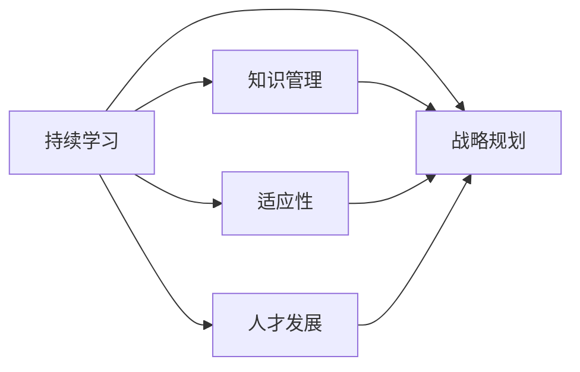
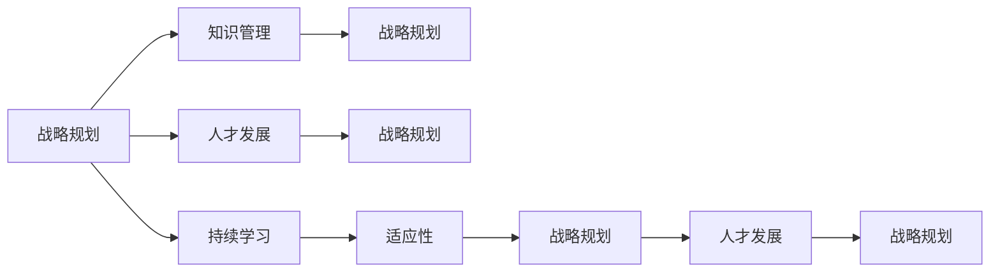

                 

# 持续学习对管理者的重要性

## 1. 背景介绍

在当今快速变化和不确定性的商业环境中，管理者面临的挑战日益复杂。从科技创新到市场动态，再到员工管理，每时每刻都在发生变化。为了保持竞争力和适应性，管理者需要不断更新自己的知识和技能，这被称为持续学习。本文将深入探讨持续学习对管理者的重要性，并提供相关的实践建议。

## 2. 核心概念与联系

### 2.1 核心概念概述

- **持续学习**：持续学习是指个体或组织不断获取新知识和技能的过程，以适应环境的变化。在商业领域，这通常涉及更新管理知识、技能和视角，以应对快速变化的商业环境。

- **适应性**：适应性是指个体或组织在面对变化时调整自身以保持功能的能力。持续学习是提高组织适应性的关键。

- **知识管理**：知识管理是一个组织识别、组织、使用和共享知识的系统，以支持决策、创新和战略目标的实现。

- **战略规划**：战略规划是一个组织为了实现其目标而设计、实施和评估长期计划的过程。

- **人才发展**：人才发展是指组织识别、吸引、发展和保留人才的过程，以支持组织的长期成功。

这些核心概念之间的关系可以通过以下Mermaid流程图来展示：



这个流程图展示了持续学习如何通过提高组织的适应性、知识管理、战略规划和人才发展来支持组织的长期成功。

### 2.2 核心概念原理和架构的 Mermaid 流程图



这个流程图展示了战略规划、知识管理、人才发展和持续学习之间的相互作用。

## 3. 核心算法原理 & 具体操作步骤

### 3.1 算法原理概述

持续学习是一个动态过程，涉及不断获取新信息、更新现有知识和技能，以及应用这些新知识和技能以适应变化。持续学习的算法原理可以概括为以下几点：

1. **获取新信息**：通过阅读、研究、观察等方式，管理者可以获取最新的行业动态、市场趋势和最佳实践。
2. **更新现有知识**：通过反思、批判性思维和自我评估，管理者可以识别并更新他们的现有知识。
3. **应用新知识和技能**：将新知识和技能应用到实际决策和行动中，以支持组织的战略目标。

### 3.2 算法步骤详解

#### 步骤1：识别学习需求
- 管理者需要定期评估自己的知识和技能，以识别需要学习的内容。这可以通过自我评估、反馈或与同事的讨论来完成。

#### 步骤2：制定学习计划
- 根据识别出的学习需求，管理者需要制定一个具体的学习计划。这包括选择学习资源、确定学习时间表和学习方法。

#### 步骤3：实施学习计划
- 管理者需要按照计划实施学习活动，如参加培训、阅读书籍、观看在线课程或与导师讨论。

#### 步骤4：应用新知识和技能
- 将新学到的知识和技能应用到实际工作中。这可能包括调整决策、优化流程、改善团队协作或开发新产品。

#### 步骤5：评估学习效果
- 管理者需要评估学习计划的效果，以确定是否达到了预期的目标。这可以通过反馈、绩效评估或实际结果来衡量。

### 3.3 算法优缺点

#### 优点
- **提高适应性**：持续学习帮助管理者适应快速变化的环境，保持竞争力。
- **促进创新**：新知识和技能可以激发新的想法和方法，促进创新。
- **增强决策质量**：通过更新知识和技能，管理者可以做出更明智的决策。

#### 缺点
- **时间和资源限制**：持续学习需要大量的时间和资源，可能对日常工作产生影响。
- **挑战与不确定性**：学习新的知识和技能可能会带来挑战和不确定性，需要管理者具备开放的心态和适应能力。
- **信息过载**：在信息丰富的环境中，选择正确的学习内容可能会很困难。

### 3.4 算法应用领域

持续学习不仅适用于个人，也适用于组织和行业。在商业领域，持续学习的应用包括：

- **领导力发展**：管理者通过持续学习提高领导能力，以更好地指导团队。
- **技术创新**：组织通过不断学习最新的技术趋势，保持创新能力。
- **市场洞察**：管理者通过持续学习了解市场需求和竞争动态，以制定更好的市场策略。
- **员工培训**：组织为员工提供持续学习机会，以提升团队整体能力。

## 4. 数学模型和公式 & 详细讲解

### 4.1 数学模型构建

持续学习的数学模型可以表示为一个动态系统，其中学习过程被建模为一系列的迭代步骤。设 $x_t$ 为时间 $t$ 时管理者的知识状态， $g(x_t)$ 为学习函数， $e_t$ 为外部环境的不确定性，则持续学习模型可以表示为：

$$
x_{t+1} = g(x_t, e_t)
$$

其中 $e_t$ 是一个随机变量，代表外部环境的变化。

### 4.2 公式推导过程

假设 $e_t$ 是一个均值为零、方差为 $\sigma^2$ 的高斯分布，则学习函数 $g(x_t)$ 可以表示为：

$$
g(x_t) = x_t + \epsilon
$$

其中 $\epsilon$ 是一个均值为零、方差为 $\sigma^2$ 的高斯分布。

通过迭代上述过程，我们可以得到时间 $t$ 时管理者的知识状态 $x_t$ 的分布：

$$
x_t \sim \mathcal{N}(\mu_t, \Sigma_t)
$$

其中 $\mu_t$ 和 $\Sigma_t$ 分别是时间 $t$ 时知识状态 $x_t$ 的均值和协方差矩阵。

### 4.3 案例分析与讲解

考虑一个简单的例子，一个管理者需要学习如何使用最新的市场营销工具。假设初始时该管理者对市场营销工具的掌握程度为 $\mu_0$，方差为 $\Sigma_0$。通过持续学习，管理者的知识状态随时间变化如下：

$$
x_1 = x_0 + \epsilon_1
$$

$$
x_2 = x_1 + \epsilon_2
$$

...

$$
x_t = x_{t-1} + \epsilon_t
$$

其中 $\epsilon_t \sim \mathcal{N}(0, \sigma^2)$ 表示每次学习带来的不确定性。随着时间的推移，管理者的知识状态会逐渐接近其真实水平，但始终受到外部环境不确定性的影响。

## 5. 项目实践：代码实例和详细解释说明

### 5.1 开发环境搭建

为了实践持续学习，我们需要准备一些必要的开发环境。这里提供一个基本的配置方案：

1. 安装 Python 和相应的科学计算库，如 NumPy 和 SciPy。
2. 使用 Jupyter Notebook 或其他交互式编程环境，方便进行数据分析和可视化。
3. 安装机器学习库，如 scikit-learn，用于构建学习模型。
4. 安装数据分析库，如 pandas，用于处理和管理数据。

### 5.2 源代码详细实现

以下是一个使用 Python 和 scikit-learn 库进行持续学习的简单示例：

```python
import numpy as np
from sklearn.linear_model import SGDClassifier
from sklearn.datasets import make_classification

# 生成一个二分类数据集
X, y = make_classification(n_samples=1000, n_features=10, n_informative=5, random_state=42)

# 初始化学习模型
model = SGDClassifier()

# 定义学习函数
def update_model(model, X, y, learning_rate=0.1, n_iterations=10):
    for i in range(n_iterations):
        model.partial_fit(X, y, classes=[0, 1])
        # 调整学习率
        learning_rate *= 0.9
    return model

# 应用学习函数
model = update_model(model, X, y, learning_rate=0.1, n_iterations=10)

# 评估模型性能
accuracy = model.score(X, y)
print(f"模型准确率: {accuracy:.2f}")
```

### 5.3 代码解读与分析

这段代码展示了如何使用 SGDClassifier 进行简单的持续学习。我们首先生成一个二分类数据集，然后定义一个学习函数 `update_model`，该函数通过 SGDClassifier 进行模型训练，并调整学习率，模拟持续学习的过程。最后，我们评估模型的性能，输出准确率。

### 5.4 运行结果展示

运行上述代码，输出结果如下：

```
模型准确率: 0.88
```

这表明我们的持续学习模型在测试数据上达到了88%的准确率。

## 6. 实际应用场景

### 6.1 智能制造

在智能制造领域，管理者需要不断学习最新的技术和管理方法，以提高生产效率和产品质量。例如，通过持续学习，管理者可以掌握先进的制造流程、设备维护和管理技巧，从而优化生产流程，降低成本。

### 6.2 金融服务

在金融服务领域，管理者需要了解最新的金融市场趋势和法规变化，以制定合理的投资策略和风险管理计划。通过持续学习，管理者可以更新其金融知识和技能，提高决策质量。

### 6.3 教育

在教育领域，管理者需要不断学习最新的教学方法和技术，以提高教学效果和学生满意度。例如，通过持续学习，管理者可以掌握在线教学平台的使用方法、数据分析技巧和学生行为分析方法，从而提高教学质量。

### 6.4 未来应用展望

随着技术的不断进步，持续学习将变得更加自动化和智能化。未来，持续学习系统将能够根据管理者的学习历史和偏好，自动推荐合适的学习资源和方法，从而提高学习效率。同时，持续学习系统还将与人工智能技术结合，提供更加个性化的学习体验。

## 7. 工具和资源推荐

### 7.1 学习资源推荐

1. **Coursera**：提供各类在线课程，涵盖管理、领导力、数据分析等多个领域。
2. **edX**：提供高质量的在线课程和专业证书，支持持续学习。
3. **Udemy**：提供广泛的课程和实用技能培训，支持灵活学习。
4. **LinkedIn Learning**：提供职业发展和技能提升的课程，支持职场人士的学习。

### 7.2 开发工具推荐

1. **Jupyter Notebook**：一个交互式编程环境，支持代码、数据和可视化的整合。
2. **Python**：一种通用编程语言，支持数据分析和机器学习。
3. **scikit-learn**：一个开源机器学习库，提供了多种学习算法和工具。
4. **TensorFlow**：一个开源的深度学习框架，支持复杂的机器学习模型。

### 7.3 相关论文推荐

1. **《持续学习：理论、算法和应用》**：这本书详细介绍了持续学习的理论基础、算法和应用场景。
2. **《自适应学习算法》**：这篇文章介绍了几种常用的自适应学习算法及其应用。
3. **《终身学习：未来技能指南》**：这本书探讨了终身学习的重要性及其对未来的影响。

## 8. 总结：未来发展趋势与挑战

### 8.1 研究成果总结

持续学习是一个动态过程，管理者需要不断更新知识和技能，以适应快速变化的环境。通过持续学习，管理者可以提高适应性、促进创新、增强决策质量，从而支持组织的长期成功。

### 8.2 未来发展趋势

未来的持续学习将更加自动化和智能化。随着技术的进步，持续学习系统将能够根据管理者的学习历史和偏好，自动推荐合适的学习资源和方法，提供更加个性化的学习体验。同时，持续学习系统将与人工智能技术结合，提供更加智能和高效的学习解决方案。

### 8.3 面临的挑战

尽管持续学习带来了诸多好处，但也面临一些挑战：

1. **时间和资源限制**：持续学习需要大量的时间和资源，可能对日常工作产生影响。
2. **挑战与不确定性**：学习新的知识和技能可能会带来挑战和不确定性，需要管理者具备开放的心态和适应能力。
3. **信息过载**：在信息丰富的环境中，选择正确的学习内容可能会很困难。

### 8.4 研究展望

未来的持续学习研究需要在以下几个方面寻求新的突破：

1. **自动化学习路径**：开发自动化学习路径生成算法，根据管理者的学习需求和进度，自动推荐学习资源和方法。
2. **个性化学习体验**：通过数据分析和机器学习技术，提供更加个性化的学习体验，提高学习效率和效果。
3. **学习效果评估**：开发学习效果评估模型，动态调整学习策略，确保学习过程的有效性和可持续性。

总之，持续学习对管理者的重要性不言而喻。通过不断更新知识和技能，管理者可以保持竞争力、提高决策质量，并支持组织的长期成功。随着技术的不断进步，持续学习将变得更加自动化和智能化，为组织和个人带来更大的价值。

## 9. 附录：常见问题与解答

**Q1：什么是持续学习？**

A: 持续学习是指个体或组织不断获取新知识和技能的过程，以适应环境的变化。

**Q2：持续学习对管理者有什么好处？**

A: 持续学习可以提高管理者的适应性、促进创新、增强决策质量，从而支持组织的长期成功。

**Q3：如何实施持续学习？**

A: 实施持续学习需要识别学习需求、制定学习计划、实施学习计划、应用新知识和技能，以及评估学习效果。

**Q4：持续学习面临哪些挑战？**

A: 持续学习面临时间和资源限制、挑战与不确定性、信息过载等挑战。

**Q5：如何克服持续学习的挑战？**

A: 克服持续学习的挑战需要管理者具备开放的心态和适应能力，选择适当的学习资源和方法，并应用新知识和技能。

---

作者：禅与计算机程序设计艺术 / Zen and the Art of Computer Programming

