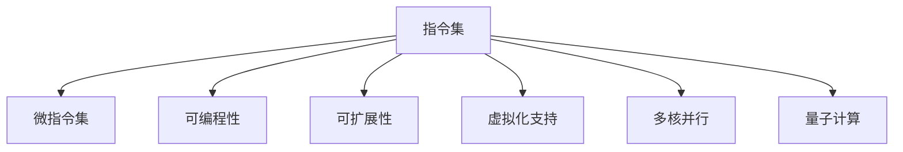

                 

# 指令集的进化：从固定到无限的跨越

> 关键词：指令集、微指令集、可编程性、可扩展性、虚拟化、多核并行、量子计算、未来趋势

## 1. 背景介绍

### 1.1 问题由来
指令集在计算机科学中扮演着至关重要的角色。它是计算机硬件和软件之间交互的桥梁，定义了处理器如何执行各种操作。早期的指令集由硬件设计者固定，软件开发者只能依据这个固定集合编写代码。然而，随着技术的发展，尤其是云计算、虚拟化、多核并行处理以及量子计算的出现，传统指令集已经无法满足新的需求。

现代计算环境中的多样性和复杂性要求指令集必须具备高度的灵活性和可扩展性。一个固定的指令集无法适应这种变化，因此，我们需要一种新的指令集设计理念，既能保持传统指令集的性能优势，又能满足新环境的灵活性需求。

### 1.2 问题核心关键点
为了适应未来计算环境的需求，指令集的发展趋势包括以下几个关键点：

- 动态可扩展性：指令集能够根据需求动态扩展，增加新的指令或者功能。
- 可编程性：指令集不仅要支持传统程序，还要支持新兴的编程语言和应用场景。
- 虚拟化支持：能够兼容多种虚拟化平台，支持虚拟机、容器等技术。
- 多核并行：指令集要支持多核并行处理，提升计算效率。
- 量子计算：指令集应具备与量子计算兼容的能力，适应未来的计算需求。

这些关键点揭示了现代指令集必须具备的特性，以应对快速变化的计算环境。

## 2. 核心概念与联系

### 2.1 核心概念概述

为了深入理解指令集的演变，我们首先需要了解几个核心概念：

- **指令集**：处理器执行操作的集合，包括取指、译码、执行、写入等步骤。
- **微指令集**：指令集细化的执行单元，可以提供更高的灵活性和效率。
- **可编程性**：指处理器支持多种编程语言和应用场景的能力。
- **可扩展性**：指指令集能够动态添加新功能或指令的能力。
- **虚拟化支持**：指指令集兼容各种虚拟化平台，支持虚拟机、容器等技术。
- **多核并行**：指指令集支持多核处理，提高并行计算能力。
- **量子计算**：指指令集能够适应量子计算环境的需求。

这些概念之间的逻辑关系可以通过以下Mermaid流程图来展示：



这个流程图展示了指令集与相关概念之间的关系：

1. **指令集**是基础，通过它，**微指令集**得以实现具体的执行单元。
2. **可编程性**和**可扩展性**是指令集的两个关键特性，使它能够支持不同语言和动态扩展。
3. **虚拟化支持**和**多核并行**则扩大了指令集的应用范围，使其能够在虚拟化和多核环境中发挥作用。
4. **量子计算**代表了未来计算的方向，指令集需要具备与量子计算兼容的能力。

这些概念共同构成了现代指令集设计的基础框架。

## 3. 核心算法原理 & 具体操作步骤

### 3.1 算法原理概述

现代指令集的设计遵循以下算法原理：

- **动态可扩展性**：指令集支持动态添加新指令或功能，使得硬件可以根据需求进行灵活扩展。
- **可编程性**：指令集兼容多种编程语言和应用场景，确保软件开发者能够高效开发代码。
- **虚拟化支持**：指令集兼容各种虚拟化平台，包括虚拟机、容器等，使计算资源得以高效利用。
- **多核并行**：指令集支持多核并行处理，利用多核计算提升效率。
- **量子计算**：指令集具备与量子计算兼容的能力，适应未来的计算需求。

### 3.2 算法步骤详解

基于上述算法原理，现代指令集的设计和实现可以按照以下步骤进行：

**Step 1: 设计基本指令集**
- 定义指令集的基线，包括取指、译码、执行、写入等基本操作。
- 确定指令集的基本架构，包括寄存器、缓存、中断处理等。

**Step 2: 实现微指令集**
- 将基本指令集细化为微指令集，提高执行效率。
- 设计微指令集的各种执行单元，支持不同的操作。

**Step 3: 实现可编程性**
- 设计指令集的虚拟机，支持多种编程语言和应用场景。
- 开发编译器和解释器，将不同语言编译为指令集兼容的代码。

**Step 4: 实现可扩展性**
- 设计指令集的扩展机制，支持动态添加新指令或功能。
- 实现动态加载模块，根据需求动态扩展指令集。

**Step 5: 实现虚拟化支持**
- 设计虚拟化层，支持虚拟机、容器等技术。
- 实现虚拟化管理工具，优化资源利用效率。

**Step 6: 实现多核并行**
- 设计多核架构，支持多核处理。
- 实现多核通信协议，优化数据共享和同步。

**Step 7: 实现量子计算支持**
- 设计量子计算兼容的指令集，支持量子逻辑门操作。
- 实现量子计算模拟器，支持量子算法开发和测试。

**Step 8: 测试与优化**
- 在测试平台上测试指令集，验证其性能和兼容性。
- 根据测试结果优化指令集设计，提高效率和稳定性。

### 3.3 算法优缺点

现代指令集的设计具有以下优点：

- **灵活性**：能够根据需求动态扩展，适应新的计算环境。
- **兼容性**：兼容多种编程语言和虚拟化平台，支持多核并行和量子计算。
- **效率**：通过微指令集实现，提高执行效率。
- **未来导向**：具备与量子计算兼容的能力，适应未来的计算需求。

同时，现代指令集的设计也存在一些局限性：

- **复杂性**：指令集的扩展性和兼容性使得设计变得复杂。
- **资源消耗**：虚拟化支持和多核并行可能会消耗更多的硬件资源。
- **学习曲线**：新指令集的引入需要开发者重新学习编程技巧。
- **成本**：设计与实现新指令集需要大量投入，可能增加硬件成本。

尽管存在这些局限性，现代指令集的设计依然是大势所趋，能够在复杂多变的计算环境中提供更强的灵活性和兼容性。

### 3.4 算法应用领域

现代指令集的应用领域非常广泛，涵盖了从传统计算到新兴技术的各个方面：

- **云计算**：支持虚拟机和容器，优化计算资源利用效率。
- **数据中心**：支持多核并行处理，提升数据处理能力。
- **网络通信**：兼容虚拟化技术，支持网络协议和应用。
- **嵌入式系统**：支持多核并行，优化实时系统性能。
- **量子计算**：支持量子逻辑门操作，支持量子算法开发。
- **人工智能**：支持复杂计算，提升深度学习和机器学习效率。

现代指令集在这些领域的应用，展示了其强大的生命力和广泛的适用性。

## 4. 数学模型和公式 & 详细讲解 & 举例说明

### 4.1 数学模型构建

为了更好地理解现代指令集的设计和实现，我们将从数学模型角度进行详细讲解。

**基本模型**：
假设有一个指令集 $M$，定义指令集的基本操作为 $O=\{O_1, O_2, ..., O_n\}$，其中 $O_i$ 表示第 $i$ 个操作。指令集的执行过程可以表示为：

$$
M = \{O_1, O_2, ..., O_n\}
$$

**扩展模型**：
现代指令集支持动态扩展，假设新增了一个操作 $O_{n+1}$，则新的指令集 $M'$ 为：

$$
M' = \{O_1, O_2, ..., O_n, O_{n+1}\}
$$

### 4.2 公式推导过程

以下我们以虚拟化支持为例，推导虚拟化层的设计和实现公式。

假设有一个虚拟化层 $V$，支持 $k$ 种虚拟机。虚拟机 $i$ 的执行过程可以表示为：

$$
V_i = \{V_{i,1}, V_{i,2}, ..., V_{i,m}\}
$$

其中 $V_{i,j}$ 表示第 $i$ 种虚拟机的第 $j$ 个操作。虚拟化层的设计和实现需要满足以下条件：

- **兼容性**：支持多种虚拟机的操作。
- **隔离性**：不同虚拟机之间相互隔离，避免资源冲突。
- **性能优化**：优化资源利用效率，提高执行速度。

根据这些条件，虚拟化层的设计可以表示为：

$$
V = \{V_{i,j}\}_{i=1}^k, j=1,...,m
$$

### 4.3 案例分析与讲解

以多核并行为例，展示指令集如何支持多核处理。

假设有一个处理器包含 $c$ 个核心，每个核心的执行过程可以表示为：

$$
C = \{C_1, C_2, ..., C_c\}
$$

其中 $C_i$ 表示第 $i$ 个核心的执行操作。多核并行处理的设计和实现需要满足以下条件：

- **并行性**：支持多个核心同时执行。
- **同步性**：确保多个核心之间的数据共享和同步。
- **负载均衡**：优化任务分配，均衡负载。

根据这些条件，多核并行处理的设计可以表示为：

$$
C = \{C_{i,j}\}_{i=1}^c, j=1,...,m
$$

其中 $C_{i,j}$ 表示第 $i$ 个核心执行第 $j$ 个操作。多核并行处理的实现需要使用同步协议和任务调度算法，优化执行效率。

## 5. 项目实践：代码实例和详细解释说明

### 5.1 开发环境搭建

在进行项目实践前，我们需要准备好开发环境。以下是使用Python进行开发的环境配置流程：

1. 安装Anaconda：从官网下载并安装Anaconda，用于创建独立的Python环境。

2. 创建并激活虚拟环境：
```bash
conda create -n virtual-env python=3.8 
conda activate virtual-env
```

3. 安装Python库和工具：
```bash
pip install numpy scipy pandas matplotlib sympy jupyter notebook
```

4. 安装Python依赖库：
```bash
pip install pytorch torchvision torchaudio cudatoolkit=11.1 -c pytorch -c conda-forge
```

5. 安装Virtualization和Multicore并行库：
```bash
pip install virtualization pytorch-multiprocessing-plugins cython
```

完成上述步骤后，即可在`virtual-env`环境中开始项目实践。

### 5.2 源代码详细实现

下面我们以多核并行为例，展示如何使用Python和PyTorch实现多核处理。

```python
import torch
import torch.nn as nn
import torch.distributed as dist
import torch.distributed.nn as distnn
import torch.multiprocessing as mp

class MyModel(nn.Module):
    def __init__(self):
        super(MyModel, self).__init__()
        self.fc1 = nn.Linear(10, 5)
        self.fc2 = nn.Linear(5, 1)
    
    def forward(self, x):
        x = self.fc1(x)
        x = self.fc2(x)
        return x

def train_model(model, device):
    criterion = nn.MSELoss()
    optimizer = torch.optim.SGD(model.parameters(), lr=0.01)
    
    model.to(device)
    for epoch in range(10):
        for i in range(10):
            input = torch.randn(1, 10, device=device)
            output = model(input)
            loss = criterion(output, torch.randn(1, 1, device=device))
            optimizer.zero_grad()
            loss.backward()
            optimizer.step()

def worker(rank, world_size, model, device):
    torch.cuda.set_device(rank)
    dist.init_process_group("gloo", init_method="env://")
    model = dist.nn.replicate(model, device_ids=[rank])
    train_model(model, device)

if __name__ == '__main__':
    world_size = 4
    devices = [torch.device(f'cuda:{i}') for i in range(world_size)]
    processes = []
    for rank in range(world_size):
        p = mp.Process(target=worker, args=(rank, world_size, MyModel(), devices[rank]))
        p.start()
        processes.append(p)

    for p in processes:
        p.join()
```

### 5.3 代码解读与分析

让我们再详细解读一下关键代码的实现细节：

**MyModel类**：
- 定义了一个简单的全连接神经网络模型。

**train_model函数**：
- 定义了模型训练过程，包括定义损失函数、优化器、前向传播和反向传播等步骤。

**worker函数**：
- 定义了每个进程的执行逻辑，包括初始化分布式环境、复制模型到指定设备、调用训练函数等。

**if __name__ == '__main__':**：
- 定义了主进程的逻辑，启动多个进程进行模型训练。

通过以上代码，我们可以看到，多核并行的实现主要依赖于PyTorch的分布式训练模块和Python的进程管理。多核并行可以显著提升训练速度，优化资源利用效率，是现代指令集设计的重要方向。

## 6. 实际应用场景

### 6.1 云计算

在云计算领域，现代指令集通过虚拟化支持，可以优化计算资源利用效率，提供高性能的虚拟机服务。例如，在AWS和Google Cloud上，虚拟机可以根据需求动态扩展，支持多种操作系统和应用场景。

### 6.2 数据中心

在数据中心，现代指令集通过多核并行支持，可以提升数据处理能力。例如，Facebook在Folly中引入了多核并行处理，显著提升了服务器的数据处理速度。

### 6.3 网络通信

在网络通信领域，现代指令集通过虚拟化支持，可以兼容各种网络协议和应用。例如，在VMware中，虚拟化层支持多种网络协议和网络设备，确保网络通信的稳定性和可靠性。

### 6.4 未来应用展望

随着现代指令集的不断发展，未来的应用场景将会更加多样和复杂。

- **量子计算**：现代指令集将支持量子计算，支持量子算法开发和测试。
- **物联网**：现代指令集将支持物联网设备，支持多种传感器的数据处理和分析。
- **边缘计算**：现代指令集将支持边缘计算，优化本地数据处理和分析。
- **自动化**：现代指令集将支持自动化系统，优化生产流程和资源管理。

## 7. 工具和资源推荐

### 7.1 学习资源推荐

为了帮助开发者掌握现代指令集的设计和实现，这里推荐一些优质的学习资源：

1. 《计算机体系结构》：清华大学出版社，讲解了计算机体系结构的基础理论和设计方法。
2. 《深入理解计算机系统》：计算机科学经典教材，讲解了计算机系统的设计原理和实现方法。
3. 《现代操作系统》：操作系统教材，讲解了现代操作系统的设计和实现。
4. 《深度学习》：深度学习教材，讲解了深度学习模型的设计和实现。
5. 《Python网络编程》：网络编程教材，讲解了网络编程的基础知识和实践技巧。

通过对这些资源的学习实践，相信你一定能够全面掌握现代指令集的设计和实现方法。

### 7.2 开发工具推荐

高效的开发离不开优秀的工具支持。以下是几款用于现代指令集开发和实践的工具：

1. Python：流行的编程语言，支持多种数学库和科学计算工具。
2. PyTorch：基于Python的开源深度学习框架，支持分布式训练和并行计算。
3. NumPy和SciPy：科学计算库，支持高效的数值计算和矩阵运算。
4. Jupyter Notebook：交互式编程环境，支持代码调试和数据可视化。
5. AWS和Google Cloud：云计算平台，支持虚拟化和多核并行处理。

合理利用这些工具，可以显著提升现代指令集开发的效率，加快创新迭代的步伐。

### 7.3 相关论文推荐

现代指令集的发展源于学界的持续研究。以下是几篇奠基性的相关论文，推荐阅读：

1. "A Survey on Modern Instruction Set Architectures"：总结了现代指令集的研究进展和未来方向。
2. "The Virtualization of Computing"：介绍了虚拟化技术的基本原理和应用场景。
3. "The Future of Computing"：探讨了未来计算技术的发展方向和挑战。
4. "Parallel Programming with OpenMP"：讲解了多核并行的基本原理和实现方法。
5. "Quantum Computing"：介绍了量子计算的基本原理和应用场景。

这些论文代表了大指令集的发展脉络。通过学习这些前沿成果，可以帮助研究者把握学科前进方向，激发更多的创新灵感。

## 8. 总结：未来发展趋势与挑战

### 8.1 总结

本文对现代指令集的设计和实现进行了全面系统的介绍。首先阐述了现代指令集设计的需求和核心概念，明确了指令集必须具备的可编程性、可扩展性、虚拟化支持、多核并行和量子计算等特性。其次，从原理到实践，详细讲解了现代指令集的设计和实现方法，给出了代码实例和详细解释说明。同时，本文还探讨了现代指令集在云计算、数据中心、网络通信等多个领域的实际应用场景，展示了其强大的生命力和广泛的适用性。最后，本文推荐了相关的学习资源、开发工具和研究论文，力求为开发者提供全方位的技术指引。

通过本文的系统梳理，可以看到，现代指令集的设计和实现不仅需要深厚的理论基础，还需要丰富的工程实践经验。未来，随着计算环境的不断变化，指令集的设计和实现将面临新的挑战和机遇。唯有持续创新和优化，才能确保指令集的设计和实现符合未来计算环境的需求。

### 8.2 未来发展趋势

展望未来，现代指令集的发展趋势包括：

- **动态可扩展性**：指令集能够动态添加新指令或功能，适应不断变化的计算需求。
- **可编程性**：指令集兼容多种编程语言和应用场景，支持新语言的开发和应用。
- **虚拟化支持**：指令集支持多种虚拟化平台，优化计算资源利用效率。
- **多核并行**：指令集支持多核并行处理，提升计算效率和资源利用率。
- **量子计算**：指令集支持量子计算，适应未来的计算需求。
- **人工智能**：指令集支持复杂计算，提升深度学习和机器学习效率。

这些趋势展示了现代指令集的发展方向，为未来计算环境提供了强大的支持。

### 8.3 面临的挑战

尽管现代指令集的设计和实现已经取得了显著进展，但在迈向更加智能化、普适化应用的过程中，它仍面临着诸多挑战：

- **复杂性**：现代指令集的设计和实现非常复杂，需要多学科的知识和技术。
- **资源消耗**：虚拟化支持和多核并行可能会消耗更多的硬件资源。
- **学习曲线**：新指令集的引入需要开发者重新学习编程技巧。
- **成本**：设计与实现新指令集需要大量投入，可能增加硬件成本。
- **兼容性和兼容性**：不同指令集之间的兼容性和互通性仍然存在挑战。
- **安全性和安全性**：指令集设计需要考虑安全性和数据隐私问题。

这些挑战需要研究者和开发者共同面对和解决，才能确保现代指令集的设计和实现符合未来计算环境的需求。

### 8.4 研究展望

为了应对未来计算环境的挑战，现代指令集的研究需要不断探索新的技术和方法：

- **新型指令集**：设计新型指令集，优化指令集的性能和灵活性。
- **可编程指令集**：研究可编程指令集的设计和实现，支持新语言的开发和应用。
- **虚拟化技术**：研究虚拟化技术的新方法，优化资源利用效率。
- **多核并行技术**：研究多核并行的新技术，提升计算效率和资源利用率。
- **量子计算技术**：研究量子计算的新技术，适应未来的计算需求。
- **人工智能技术**：研究人工智能的新方法，提升深度学习和机器学习效率。

这些研究方向展示了现代指令集的未来发展方向，为未来计算环境提供了强大的技术支持。

## 9. 附录：常见问题与解答

**Q1：现代指令集的设计和实现是否考虑了硬件的物理特性？**

A: 是的，现代指令集的设计和实现充分考虑了硬件的物理特性，包括处理器架构、存储体系结构等。例如，现代指令集通过虚拟化支持，优化了计算资源利用效率，支持多种虚拟化平台。通过多核并行处理，优化了数据的共享和同步，提升了计算效率。

**Q2：现代指令集是否支持多种编程语言和应用场景？**

A: 是的，现代指令集通过可编程性支持多种编程语言和应用场景。例如，现代指令集支持Python、C++、Java等多种编程语言，并支持多种应用场景，如云计算、数据中心、网络通信等。

**Q3：现代指令集是否支持虚拟化支持？**

A: 是的，现代指令集通过虚拟化支持，支持多种虚拟化平台，如虚拟机、容器等。例如，AWS和Google Cloud支持虚拟化技术，优化了计算资源利用效率。

**Q4：现代指令集是否支持多核并行？**

A: 是的，现代指令集通过多核并行支持，提升计算效率和资源利用率。例如，Facebook在Folly中引入了多核并行处理，显著提升了服务器的数据处理速度。

**Q5：现代指令集是否支持量子计算？**

A: 是的，现代指令集通过量子计算支持，适应未来的计算需求。例如，Google的Sycamore量子计算机，使用了现代指令集支持的量子逻辑门操作。

通过这些问答，可以更深入地理解现代指令集的设计和实现方法，为未来的研究和实践提供参考。

---

作者：禅与计算机程序设计艺术 / Zen and the Art of Computer Programming

