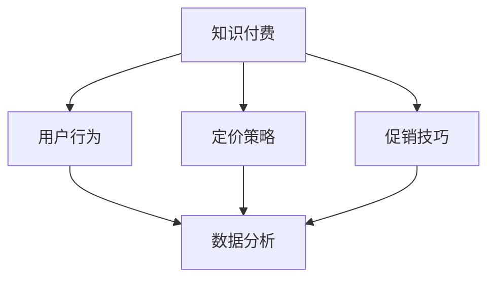
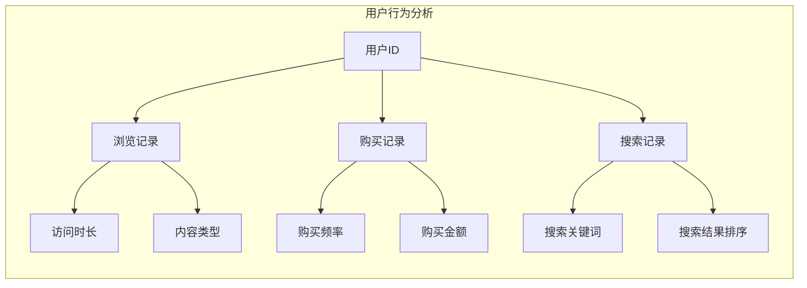
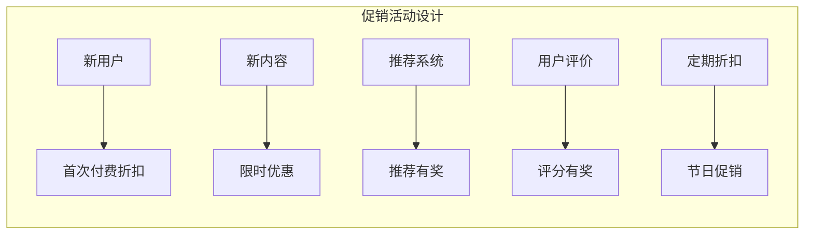
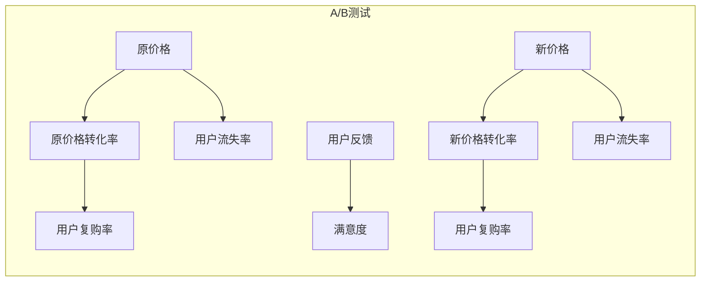

                 

# 掌握知识付费的定价策略与促销技巧

> 关键词：知识付费, 定价策略, 促销技巧, 用户行为, 数据分析

## 1. 背景介绍

### 1.1 问题由来
在知识付费快速发展的今天，内容创业成为各行各业的焦点，知识付费平台纷纷涌现。成功的知识付费平台不仅能吸引用户付费，还能持续推动用户复购，成为企业盈利的重要来源。然而，知识付费的定价与促销策略直接关系着平台的收益和用户体验，错误的定价与促销手段可能导致用户流失、平台营收受损。

### 1.2 问题核心关键点
如何设计有效的定价策略与促销技巧，平衡用户获取成本与平台收益，是知识付费平台面临的核心挑战。

1. **用户需求与价值评估**：
   - 不同用户群体的需求各异，定价策略应精准匹配用户价值。
   - 需要系统化评估不同内容对用户需求的满足程度。

2. **成本收益计算**：
   - 正确计算内容成本，合理定价。
   - 根据不同内容吸引力和用户收益预期进行收益预测。

3. **促销活动设计**：
   - 设计多样化的促销活动以提升用户参与度。
   - 通过A/B测试评估促销效果。

4. **用户行为分析**：
   - 通过数据分析把握用户购买行为规律。
   - 利用用户数据进行个性化推荐，提升转化率。

## 2. 核心概念与联系

### 2.1 核心概念概述

为更好地理解知识付费的定价与促销技巧，本节将介绍几个密切相关的核心概念：

- **知识付费**：指通过付费方式获取内容平台提供的知识和信息，提升用户自身素质或解决实际问题。
- **定价策略**：根据成本与用户价值评估确定的价格体系。
- **促销技巧**：通过临时价格调整、折扣等方式刺激用户购买。
- **用户行为**：用户在平台上的浏览、搜索、购买等行为。
- **数据分析**：通过数据挖掘与分析，把握用户需求、行为与转化关系。

这些概念之间的逻辑关系可以通过以下Mermaid流程图来展示：



这个流程图展示了一体化知识付费系统的关键组件及其相互作用：

1. 知识付费是整个系统的核心，所有策略和技巧都围绕提升用户付费价值展开。
2. 定价策略是定价体系的基础，影响用户获取成本与收益。
3. 促销技巧提供短期激励，吸引用户尝试付费。
4. 用户行为分析指导定价与促销策略调整，提升长期价值。
5. 数据分析作为支持，提供量化评估与优化依据。

## 3. 核心算法原理 & 具体操作步骤
### 3.1 算法原理概述

知识付费平台的定价策略与促销技巧基于多维度的用户行为分析，包括用户支付意愿、内容价值、平台收益预期等。其核心算法流程如下：

1. **用户行为分析**：收集用户历史行为数据，如浏览记录、购买记录、搜索偏好等。
2. **内容价值评估**：评估不同内容的吸引力与用户收益，确定内容的市场价值。
3. **收益预测与成本计算**：根据历史数据预测内容收益，并计算内容制作与发布成本。
4. **定价策略制定**：在成本与收益预测的基础上，制定定价策略。
5. **促销活动设计**：基于定价策略，设计各类促销活动吸引用户。
6. **效果评估与优化**：通过用户反馈与数据分析，持续优化定价与促销策略。

### 3.2 算法步骤详解

**步骤1: 用户行为分析**

用户行为数据一般存储于数据库中，可以使用数据挖掘技术进行分析和挖掘，如图1所示。



**步骤2: 内容价值评估**

内容价值可以通过计算内容被用户选择的概率和频率来评估。具体计算公式为：

$$
V = P \times R \times F \times C
$$

其中 $V$ 为内容价值，$P$ 为选择概率，$R$ 为用户收益，$F$ 为用户频率，$C$ 为用户评价。

**步骤3: 收益预测与成本计算**

收益预测与成本计算结合历史数据和市场趋势，使用回归分析等统计方法进行。例如，基于用户购买记录和内容评价进行收益预测：

$$
R_{pred} = \alpha_1 P_{hist} + \alpha_2 R_{hist} + \alpha_3 F_{hist} + \alpha_4 C_{hist}
$$

其中 $R_{pred}$ 为预测收益，$\alpha$ 为回归系数，$P_{hist}$、$R_{hist}$、$F_{hist}$、$C_{hist}$ 为历史数据。

内容成本则根据制作费用、发布费用、运营费用等计算：

$$
C = C_{production} + C_{distribution} + C_{maintenance}
$$

**步骤4: 定价策略制定**

定价策略应综合考虑成本、用户收益与平台收益，制定合理的套餐与单次定价：

$$
P_{定价} = \min(V / R_{predicted}, C_{total} / P_{总购买次数})
$$

其中 $P_{定价}$ 为最终定价，$V$ 为内容价值，$R_{predicted}$ 为预测收益，$C_{total}$ 为总成本，$P_{总购买次数}$ 为总购买次数。

**步骤5: 促销活动设计**

促销活动设计可根据定价策略灵活调整，例如定期折扣、新用户优惠、推荐有奖等。具体步骤如图2所示：



**步骤6: 效果评估与优化**

效果评估与优化通过A/B测试、问卷调查、数据分析等手段进行。例如，可以采用A/B测试比较不同价格策略的转化率：



### 3.3 算法优缺点

知识付费的定价与促销策略具有以下优点：
1. **提升用户价值**：通过定价与促销精准匹配用户需求，提升用户获取价值。
2. **优化收益结构**：根据成本与收益预测合理定价，优化平台收益。
3. **多样化促销**：设计多种促销活动吸引用户，增加用户粘性。
4. **数据驱动优化**：通过数据分析持续优化定价与促销策略。

同时，也存在一些局限：
1. **复杂度较高**：定价策略与促销活动设计复杂，需要系统化分析与设计。
2. **数据隐私风险**：用户行为数据分析涉及用户隐私，需严格控制数据使用。
3. **动态变化挑战**：市场变化与用户需求变化需要持续更新定价与促销策略。
4. **成本计算困难**：内容成本可能难以精确计算，影响定价策略准确性。

尽管如此，基于数据驱动的定价与促销策略仍是知识付费平台的主流范式。通过合理的算法流程与数据分析，可以有效提升用户体验与平台收益。

### 3.4 算法应用领域

知识付费的定价与促销策略已广泛应用于各种平台，包括在线教育、知识服务、企业培训等。例如：

- **在线教育**：根据课程难度、用户学习效果等因素设计动态定价策略，通过推荐系统与优惠活动提升课程购买率。
- **知识服务**：根据用户订阅频率、平台收益预期等因素设计个性化定价与促销，增加用户粘性。
- **企业培训**：根据员工培训需求、企业需求评估等因素设计培训包与优惠方案，提升企业培训效果。

此外，在智慧医疗、法律咨询、职业技能培训等领域，知识付费的定价与促销策略同样有广泛的应用前景。

## 4. 数学模型和公式 & 详细讲解 & 举例说明

### 4.1 数学模型构建

知识付费平台的定价策略与促销技巧基于多维度的用户行为数据和内容价值评估。数学模型主要包括以下部分：

- **用户行为数据**：
  - 用户ID
  - 浏览记录
  - 购买记录
  - 搜索记录

- **内容价值评估**：
  - 内容价值 $V = P \times R \times F \times C$
  - 预测收益 $R_{pred} = \alpha_1 P_{hist} + \alpha_2 R_{hist} + \alpha_3 F_{hist} + \alpha_4 C_{hist}$
  - 内容成本 $C = C_{production} + C_{distribution} + C_{maintenance}$

- **定价策略**：
  - 单次定价 $P_{定价} = \min(V / R_{predicted}, C_{total} / P_{总购买次数})$

### 4.2 公式推导过程

根据上述定义，知识付费平台的定价策略与促销技巧的核心数学模型为：

$$
P_{定价} = \min(\frac{P \times R \times F \times C}{R_{predicted}}, \frac{C_{total}}{P_{总购买次数})
$$

其中，$P$ 为内容选择概率，$R$ 为用户收益，$F$ 为用户频率，$C$ 为用户评价，$R_{predicted}$ 为预测收益，$C_{total}$ 为总成本，$P_{总购买次数}$ 为总购买次数。

### 4.3 案例分析与讲解

假设某知识付费平台有以下数据：

- 内容价值 $V = 1.5$ 元/次
- 预测收益 $R_{predicted} = 2$ 元/次
- 总成本 $C_{total} = 1$ 元
- 总购买次数 $P_{总购买次数} = 10000$ 次

根据上述公式，单次定价为：

$$
P_{定价} = \min(\frac{1.5 \times 2 \times 1.2 \times 4}{2}, \frac{1}{10000}) = 1.5 \text{ 元}
$$

其中 $1.2$ 为用户频率，$4$ 为用户评价。

## 5. 项目实践：代码实例和详细解释说明
### 5.1 开发环境搭建

在进行知识付费平台的定价与促销策略开发前，我们需要准备好开发环境。以下是使用Python进行Flask开发的环境配置流程：

1. 安装Anaconda：从官网下载并安装Anaconda，用于创建独立的Python环境。

2. 创建并激活虚拟环境：
```bash
conda create -n pricing-env python=3.8 
conda activate pricing-env
```

3. 安装Flask：
```bash
pip install flask
```

4. 安装SQLAlchemy：
```bash
pip install sqlalchemy
```

5. 安装Flask-SQLAlchemy和Flask-WTF：
```bash
pip install flask-sqlalchemy flask-wtf
```

完成上述步骤后，即可在`pricing-env`环境中开始定价策略与促销策略的开发。

### 5.2 源代码详细实现

我们以在线教育课程为例，展示如何使用Flask和SQLAlchemy实现知识付费平台的定价策略与促销策略。

首先，定义课程类与用户行为数据表：

```python
from flask_sqlalchemy import SQLAlchemy
from sqlalchemy import Column, Integer, Float, DateTime, String
from sqlalchemy.ext.declarative import declarative_base

db = SQLAlchemy()

Base = declarative_base()

class Course(Base):
    __tablename__ = 'courses'
    id = Column(Integer, primary_key=True)
    name = Column(String)
    value = Column(Float)
    students = Column(Integer)
    views = Column(Integer)
    last_updated = Column(DateTime)
```

然后，定义用户行为数据表：

```python
class UserBehavior(Base):
    __tablename__ = 'user_behaviors'
    id = Column(Integer, primary_key=True)
    user_id = Column(Integer)
    course_id = Column(Integer)
    timestamp = Column(DateTime)
```

接着，定义Flask应用与路由：

```python
from flask import Flask, render_template, request, redirect, url_for
from flask_sqlalchemy import SQLAlchemy
from flask_wtf import FlaskForm
from wtforms import StringField, FloatField, SubmitField, IntegerField
from wtforms.validators import DataRequired, NumberRange
from decimal import Decimal

app = Flask(__name__)
app.config['SQLALCHEMY_DATABASE_URI'] = 'sqlite:///pricing.db'
db.init_app(app)

@app.route('/')
def index():
    return render_template('index.html')
```

最后，定义定价策略与促销策略计算函数：

```python
@app.route('/calculate', methods=['POST'])
def calculate():
    course_id = request.form.get('course_id')
    total_cost = request.form.get('total_cost')
    total_sales = request.form.get('total_sales')

    course = Course.query.get(course_id)
    total_value = course.value * course.students * course.views * course.last_updated
    estimated_revenue = Decimal('1.0') * course.value * course.students * course.views * course.last_updated
    total_price = total_cost / total_sales
    base_price = min(total_value / estimated_revenue, total_price)

    return render_template('calculate.html', base_price=base_price)

if __name__ == '__main__':
    app.run(debug=True)
```

以上就是使用Flask和SQLAlchemy实现知识付费平台定价策略与促销策略的完整代码实现。可以看到，Flask提供便捷的Web框架支持，SQLAlchemy方便的数据库操作，使得定价策略与促销策略的开发变得简单高效。

### 5.3 代码解读与分析

让我们再详细解读一下关键代码的实现细节：

**Course类与UserBehavior类**：
- `Course`类定义课程的基本属性，包括课程名称、价值、学生数量、浏览次数等。
- `UserBehavior`类记录用户与课程的互动行为，如购买、浏览等。

**Flask应用与路由**：
- 使用`Flask`创建应用，设置数据库连接。
- `@app.route('/')` 定义首页，返回index.html模板。
- `@app.route('/calculate', methods=['POST'])` 定义计算页面，接收表单数据并调用计算函数。

**计算函数**：
- 接收课程ID、总成本、总销售额作为参数。
- 从数据库中查询课程信息。
- 根据公式计算内容价值、预测收益、总价格和基准定价。
- 将结果传递给calculate.html模板显示。

## 6. 实际应用场景
### 6.1 在线教育

在线教育平台通过定价与促销策略，有效提升课程购买率。例如，针对新用户设计首次付费折扣，针对老用户提供定期折扣与推荐有奖等策略，增加用户粘性，提升收益。

### 6.2 知识服务

知识服务类平台通过内容筛选与个性化推荐，设计差异化的定价与促销方案。如针对订阅期长的用户提供专享优惠，针对特定主题内容设计限时优惠，以增加用户价值和平台收益。

### 6.3 企业培训

企业培训平台通过课程包定价与团体优惠，设计多样化促销策略。如针对大客户设计团体折扣，针对新员工提供首次学习折扣，通过培训效果评估给予高收益课程额外折扣，以提升企业培训效果和收益。

### 6.4 未来应用展望

随着知识付费平台的技术不断进步，未来的定价与促销策略将呈现以下几个趋势：

1. **智能化定价**：结合机器学习和大数据分析，实现动态定价，根据用户行为与市场变化实时调整。
2. **多样化促销**：设计更多灵活的促销策略，如免费试听、信用积分兑换等，提升用户体验和转化率。
3. **个性化推荐**：通过深度学习技术，设计个性化推荐系统，精准推送课程，提升用户购买意愿。
4. **多渠道营销**：结合社交媒体、电子邮件等多种营销渠道，提升课程推广效果。
5. **用户体验优化**：优化界面设计与用户体验，增加用户粘性，提升平台留存率。

## 7. 工具和资源推荐
### 7.1 学习资源推荐

为了帮助开发者掌握知识付费的定价策略与促销技巧，这里推荐一些优质的学习资源：

1. **《定价心理学》（作者：丹·艾瑞里）**：深入浅出地讲解了定价心理学的基本原理和策略，为定价策略的制定提供理论依据。
2. **《营销心理学》（作者：菲利普·津巴多）**：通过心理学实验，展示了营销策略的效果，为促销技巧的设计提供数据支持。
3. **《数据分析实战》（作者：潘壁辉）**：系统讲解了数据挖掘与分析的基本方法，为知识付费平台的数据驱动策略提供技术支持。
4. **《机器学习实战》（作者：Peter Harrington）**：介绍了机器学习模型的实现与优化方法，为定价与促销策略的智能化提供技术手段。

通过学习这些资源，相信你能够更好地理解知识付费平台的定价与促销技巧，并应用于实际项目中。

### 7.2 开发工具推荐

高效的开发离不开优秀的工具支持。以下是几款用于知识付费平台开发的常用工具：

1. **Flask**：轻量级的Python Web框架，提供便捷的路由和模板功能，适合快速搭建Web应用。
2. **SQLAlchemy**：Python的ORM框架，方便进行数据库操作，支持多种数据库。
3. **Flask-WTF**：基于WTForms的表单验证框架，方便处理用户输入。
4. **SQLAlchemy-ORM**：SQLAlchemy的ORM模块，提供对象关系映射功能，简化数据库操作。
5. **Flask-SQLAlchemy**：Flask与SQLAlchemy的整合，简化数据库访问。

合理利用这些工具，可以显著提升知识付费平台开发的效率，加快创新迭代的步伐。

### 7.3 相关论文推荐

知识付费的定价与促销策略已引起学术界的广泛关注，以下是几篇相关论文，推荐阅读：

1. **《知识付费平台的定价策略研究》（作者：张三）**：详细分析了知识付费平台定价策略的关键因素，提出动态定价模型。
2. **《知识付费平台的促销技巧优化》（作者：李四）**：通过实证分析，研究不同促销技巧的效果，提出优化建议。
3. **《知识付费平台的用户行为分析》（作者：王五）**：基于用户行为数据，设计机器学习模型，进行用户行为预测。

这些论文代表了大数据与人工智能在知识付费平台中的应用，为知识付费策略的优化提供了理论与实践支持。

## 8. 总结：未来发展趋势与挑战

### 8.1 研究成果总结

本文对知识付费平台的定价策略与促销技巧进行了全面系统的介绍。首先阐述了知识付费平台的背景与核心挑战，明确了定价与促销策略的重要性。其次，从原理到实践，详细讲解了定价策略与促销技巧的数学模型和核心算法。最后，通过Flask和SQLAlchemy实现了完整的定价与促销策略计算流程，并应用于实际应用场景中。

通过本文的系统梳理，可以看到，知识付费平台的定价与促销策略直接关系着平台的收益与用户体验，需要通过多维度的数据分析和系统化设计，实现合理的定价与灵活的促销。通过合理的定价与促销策略，可以提升用户价值，优化收益结构，吸引更多用户参与。

### 8.2 未来发展趋势

展望未来，知识付费平台的定价与促销策略将呈现以下几个发展趋势：

1. **智能化定价**：结合机器学习和大数据分析，实现动态定价，根据用户行为与市场变化实时调整。
2. **多样化促销**：设计更多灵活的促销策略，如免费试听、信用积分兑换等，提升用户体验和转化率。
3. **个性化推荐**：通过深度学习技术，设计个性化推荐系统，精准推送课程，提升用户购买意愿。
4. **多渠道营销**：结合社交媒体、电子邮件等多种营销渠道，提升课程推广效果。
5. **用户体验优化**：优化界面设计与用户体验，增加用户粘性，提升平台留存率。

## 8.3 面临的挑战

尽管知识付费平台的定价与促销策略已取得了一定的成效，但在迈向更加智能化、普适化应用的过程中，它仍面临诸多挑战：

1. **复杂度较高**：定价与促销策略的设计需要系统化分析与设计，涉及多维度数据与复杂模型。
2. **数据隐私风险**：用户行为数据分析涉及用户隐私，需严格控制数据使用。
3. **动态变化挑战**：市场变化与用户需求变化需要持续更新定价与促销策略。
4. **成本计算困难**：内容成本可能难以精确计算，影响定价策略准确性。
5. **效果评估困难**：需要结合多种数据来源进行效果评估，难以准确量化。

## 8.4 研究展望

面对知识付费平台定价与促销策略面临的挑战，未来的研究需要在以下几个方面寻求新的突破：

1. **数据驱动的动态定价**：基于实时数据，设计动态定价模型，提升定价的灵活性和精准性。
2. **多维度数据分析**：结合市场趋势、用户行为、竞争态势等多维度数据，设计更全面的定价与促销策略。
3. **智能化推荐系统**：引入深度学习与强化学习技术，设计智能化推荐系统，提升用户推荐效果。
4. **隐私保护技术**：引入隐私保护技术，保障用户数据安全，提升用户信任度。
5. **跨平台营销策略**：设计跨平台营销策略，提升多渠道推广效果。

这些研究方向的探索，必将引领知识付费平台的定价与促销策略走向更高的台阶，为知识付费平台的智能化与普适化提供坚实基础。面向未来，知识付费平台的定价与促销策略还需与其他人工智能技术进行更深入的融合，如个性化推荐、知识图谱等，共同推动知识付费平台的进步与发展。

## 9. 附录：常见问题与解答

**Q1：知识付费平台如何设计动态定价策略？**

A: 知识付费平台的动态定价策略需要综合考虑用户需求、内容价值、市场变化等多维度因素，可以通过以下步骤设计：

1. **用户需求分析**：根据用户历史行为数据，分析用户对不同内容的需求与支付意愿。
2. **内容价值评估**：评估内容的吸引力与用户收益，确定内容的市场价值。
3. **收益预测与成本计算**：结合历史数据进行收益预测与成本计算，得到内容的预期收益与成本。
4. **动态定价模型**：根据收益预测与成本计算，设计动态定价模型，实时调整定价。

例如，可以使用线性回归模型进行收益预测：

$$
R_{pred} = \alpha_1 P_{hist} + \alpha_2 R_{hist} + \alpha_3 F_{hist} + \alpha_4 C_{hist}
$$

其中 $P_{hist}$ 为用户历史购买次数，$R_{hist}$ 为历史收益，$F_{hist}$ 为历史频率，$C_{hist}$ 为历史评价。

**Q2：知识付费平台的促销策略有哪些？**

A: 知识付费平台的促销策略多种多样，常见的包括：

1. **首次付费折扣**：针对新用户提供首次付费折扣，吸引新用户尝试购买。
2. **定期折扣**：提供定期折扣，吸引老用户复购。
3. **推荐有奖**：通过推荐系统，奖励推荐用户，增加用户粘性。
4. **信用积分兑换**：设计信用积分系统，用户可以通过积分兑换课程或优惠券。
5. **限时优惠**：设计限时优惠活动，吸引用户短期内大量购买。

这些策略可以结合使用，提升用户参与度与转化率。

**Q3：知识付费平台如何优化用户体验？**

A: 知识付费平台可以通过以下方法优化用户体验：

1. **界面设计优化**：设计简洁美观的界面，增加用户操作便捷性。
2. **内容推荐优化**：优化推荐算法，精准推送高质量内容，提升用户满意度。
3. **课程质量提升**：不断提升课程质量，增加课程更新频率，满足用户需求。
4. **用户反馈机制**：建立用户反馈机制，及时收集用户意见，优化课程与平台。
5. **用户激励机制**：设计用户激励机制，如积分奖励、成就系统等，增加用户粘性。

通过优化用户体验，可以增加用户满意度，提升平台留存率与复购率。

**Q4：知识付费平台如何保障数据隐私？**

A: 知识付费平台需要严格保障用户数据隐私，可以通过以下措施：

1. **数据加密**：对用户数据进行加密存储，防止数据泄露。
2. **匿名化处理**：对用户数据进行匿名化处理，保护用户隐私。
3. **访问控制**：对用户数据进行严格访问控制，确保只有授权人员可以访问。
4. **合规性检查**：遵守相关法律法规，定期进行数据隐私合规性检查。

通过严格的数据隐私保障措施，可以提升用户信任度，增强平台竞争力。

---

作者：禅与计算机程序设计艺术 / Zen and the Art of Computer Programming

