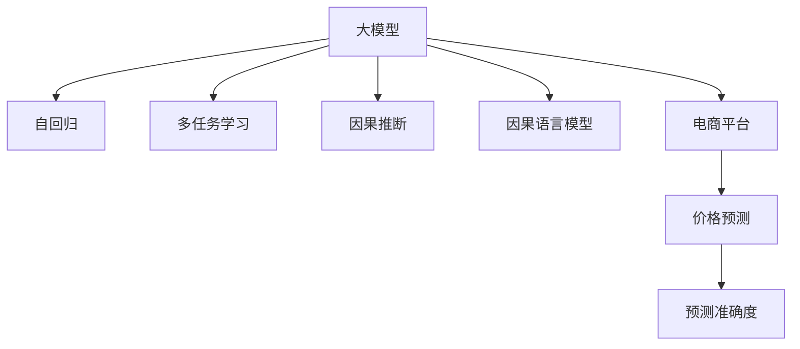

                 

# 探索大模型在电商平台价格预测中的潜力

> 关键词：大模型,价格预测,电商平台,自回归,多任务学习,Transformer,因果推断,因果语言模型

## 1. 背景介绍

### 1.1 问题由来
在现代电商平台上，商品价格预测是一个至关重要的任务，影响着商品的推荐、促销、库存管理等多个方面。传统的方法如回归分析、线性模型等，往往依赖于领域专家的手工特征工程，特征工程繁琐且难以捕捉商品价格的动态变化。而随着深度学习和大模型的兴起，电商平台的商品价格预测正迎来新的变革。

### 1.2 问题核心关键点
大模型通过大规模无标签数据进行预训练，学习到了丰富的语言和结构知识。将其应用于电商平台的商品价格预测，能够有效捕捉商品价格的多维动态关系，实现更加精确的价格预测。目前，大模型在电商价格预测上的应用，主要集中在自回归模型、多任务学习框架、因果语言模型等方面，但仍有大量挑战和优化空间。

### 1.3 问题研究意义
电商平台的商品价格预测直接影响着销售额和用户体验，影响深远。通过大模型进行价格预测，可以在保留用户互动行为信息的同时，融入商品描述、历史价格等结构化信息，提升预测模型的泛化能力和准确度，从而实现销售增长和用户满意度提升。此外，大模型预测的动态价格信息，还可以用于指导商品调价策略，优化库存管理，提升平台运营效率。

## 2. 核心概念与联系

### 2.1 核心概念概述

为了深入理解大模型在电商平台价格预测中的潜力，本节将介绍几个关键概念：

- 大模型：如GPT、BERT、T5等，通过大规模无标签数据进行预训练，具备强大的语言生成和理解能力，能够捕捉复杂的关系。
- 自回归模型：如RNN、LSTM等，通过将当前时间步的输出作为下一个时间步的输入，能够处理时间序列数据。
- 多任务学习：在训练过程中，同时学习多个相关任务，提高模型泛化能力和性能。
- 因果推断：通过挖掘数据中因果关系，避免误导性的相关性，提升模型的预测准确度。
- 因果语言模型：结合因果推断和多任务学习，学习语言生成的因果结构，提高预测模型的鲁棒性。
- 电商平台：如Amazon、淘宝、京东等，集中展示和交易商品的平台，具有大量用户行为数据和商品信息。
- 价格预测：根据商品描述、用户行为、市场行情等信息，预测商品的价格变化。

这些概念之间的关系，可以通过以下Mermaid流程图来展示：



这个流程图展示了大模型在电商平台价格预测中可能采用的核心概念和它们之间的关系。大模型通过自回归、多任务学习、因果推断、因果语言模型等技术，能够更加精准地预测电商平台上的商品价格。

## 3. 核心算法原理 & 具体操作步骤
### 3.1 算法原理概述

大模型在电商平台价格预测中的应用，主要基于自回归模型、多任务学习和因果推断等技术。其核心思想是通过大模型的强大语言理解能力，捕捉商品描述、用户行为和市场行情之间的复杂动态关系，进行精确的价格预测。

具体来说，假设电商平台上的商品有 $N$ 个特征，包括商品描述、用户评分、历史价格、市场行情等，记为 $X = (x_1, x_2, \cdots, x_N)$。价格预测模型 $M$ 的输出为 $y$，表示商品价格。

大模型通过自回归模型，可以对时间序列数据进行预测。例如，GPT-3可以通过对商品的历史价格 $x_3, x_4, \cdots, x_{n+1}$ 进行建模，预测第 $n+1$ 天的价格 $y_{n+1}$。

多任务学习框架，则允许模型同时学习多个相关任务。例如，模型可以同时预测商品价格、销量、用户评分等，从而学习这些任务之间的关联关系，提高预测准确度。

因果推断技术，能够帮助模型识别和处理数据中的因果关系。例如，模型可以学习用户行为 $x_1, x_2, \cdots, x_n$ 对商品价格 $y$ 的因果影响，避免误导性的相关性，提升预测效果。

### 3.2 算法步骤详解

大模型在电商平台价格预测中的具体步骤，包括以下几个关键环节：

**Step 1: 准备数据集和预训练模型**
- 准备电商平台的商品数据集 $D = \{(X_i, y_i)\}_{i=1}^M$，其中 $X_i = (x_{i1}, x_{i2}, \cdots, x_{iN})$ 表示商品的第 $i$ 个特征向量，$y_i$ 表示商品的价格标签。
- 选择合适的预训练模型 $M_{\theta}$，如GPT-3、BERT等，作为初始化参数。

**Step 2: 定义模型架构**
- 设计一个自回归模型，接收时间序列数据 $x_{t+1}$ 作为输入，输出下一个时间步的价格 $y_{t+1}$。
- 设计一个多任务学习框架，接收多个任务的相关特征 $X_t$，输出价格预测结果 $y_t$。
- 引入因果推断技术，将因果图嵌入模型架构中，表示因果关系 $x_1, x_2, \cdots, x_n \rightarrow y$。

**Step 3: 模型训练与微调**
- 在大模型基础上进行微调，更新模型参数，使得模型能够适应电商平台的特定需求。
- 使用电商平台的标注数据 $D$ 进行训练，最小化预测误差 $L(y, \hat{y})$，其中 $\hat{y} = M_{\theta}(X)$。

**Step 4: 模型评估与优化**
- 在验证集上评估模型的预测准确度，调整模型参数以提升性能。
- 使用多种评估指标，如均方误差(MSE)、平均绝对误差(MAE)、R-squared等，综合衡量模型的预测效果。

**Step 5: 模型部署与监控**
- 将微调后的模型部署到电商平台的实际应用中，进行实时价格预测。
- 实时监控模型的预测性能，定期更新模型参数以应对数据分布的变化。

以上是基于大模型的电商平台价格预测的完整流程。在实际应用中，还需根据具体任务特点和数据特征，进行模型架构和超参数的优化设计。

### 3.3 算法优缺点

大模型在电商平台价格预测中，具有以下优点：
1. 强大的语言理解能力：能够捕捉商品描述和用户行为中的语义信息，提升预测精度。
2. 时间序列建模：通过自回归模型，捕捉商品价格的动态变化趋势。
3. 多任务学习：同时学习多个相关任务，提高模型的泛化能力和预测准确度。
4. 因果推断：避免误导性的相关性，提高模型的鲁棒性和预测稳定性。

同时，该方法也存在一定的局限性：
1. 数据依赖性高：大模型的效果依赖于高质量的数据集，标注数据的获取和处理成本较高。
2. 模型复杂度高：大模型参数量庞大，训练和推理所需资源较多。
3. 泛化能力有限：当数据分布与预训练数据差异较大时，模型的泛化能力可能不足。
4. 模型解释性差：大模型的决策过程复杂，难以解释其内部工作机制。

尽管存在这些局限性，但就目前而言，大模型在电商平台价格预测中的应用，仍是研究热点和应用方向。未来相关研究的重点在于如何进一步降低对标注数据的依赖，提高模型的泛化能力和可解释性。

### 3.4 算法应用领域

大模型在电商平台价格预测中的应用，可以拓展到以下多个领域：

- 商品推荐：结合用户历史行为和商品特征，预测用户可能感兴趣的商品，提升推荐系统的效果。
- 库存管理：根据价格预测结果，调整商品库存，避免过剩或不足。
- 市场分析：通过价格预测模型，分析市场行情，指导商品定价策略。
- 价格波动监控：实时监控商品价格变化，及时调整销售策略。

此外，大模型在电商平台价格预测中的应用，还可以与其他技术结合，如生成对抗网络(GAN)、强化学习等，进一步提升预测模型的性能和应用范围。

## 4. 数学模型和公式 & 详细讲解 & 举例说明

### 4.1 数学模型构建

大模型在电商平台价格预测中的应用，主要基于自回归模型、多任务学习、因果推断等技术。假设电商平台上的商品有 $N$ 个特征，包括商品描述、用户评分、历史价格、市场行情等，记为 $X = (x_1, x_2, \cdots, x_N)$。价格预测模型 $M$ 的输出为 $y$，表示商品价格。

使用GPT-3进行价格预测，可以构建以下数学模型：

$$
\begin{aligned}
    \hat{y} &= M_{\theta}(X) \\
    &= \sigma(W \cdot \tanh(W_x + b_x) + W_y + b_y)
\end{aligned}
$$

其中，$W_x$ 和 $b_x$ 为商品特征的权重和偏置，$W_y$ 和 $b_y$ 为价格预测的权重和偏置。$\sigma$ 为sigmoid函数，将输出映射到 $[0, 1]$ 范围内。

### 4.2 公式推导过程

大模型在电商平台价格预测中的数学推导过程，可以详细描述如下：

1. **输入表示**：将商品特征 $X$ 表示为一个向量 $x = (x_1, x_2, \cdots, x_N)$。
2. **自回归建模**：使用GPT-3的自回归模型，对商品的历史价格 $x_{t+1}$ 进行建模，预测下一个时间步的价格 $y_{t+1}$。
3. **多任务学习**：使用多个任务的相关特征 $X_t$，输出价格预测结果 $y_t$，例如同时预测商品价格、销量、用户评分等。
4. **因果推断**：将因果图嵌入模型架构中，表示因果关系 $x_1, x_2, \cdots, x_n \rightarrow y$。

### 4.3 案例分析与讲解

以下以一个简单的案例，说明大模型在电商平台价格预测中的应用。

假设某电商平台上的商品A的特征为 $X = (x_1, x_2, \cdots, x_6)$，其中 $x_1$ 为用户评分，$x_2$ 为商品描述，$x_3$ 为历史价格，$x_4$ 为市场行情，$x_5$ 为节假日影响，$x_6$ 为用户地区。使用GPT-3进行价格预测，可以构建以下数学模型：

$$
\begin{aligned}
    \hat{y} &= M_{\theta}(X) \\
    &= \sigma(W \cdot \tanh(W_x + b_x) + W_y + b_y)
\end{aligned}
$$

其中，$W_x$ 和 $b_x$ 为商品特征的权重和偏置，$W_y$ 和 $b_y$ 为价格预测的权重和偏置。$\sigma$ 为sigmoid函数，将输出映射到 $[0, 1]$ 范围内。

通过这个模型，可以预测商品A在给定特征下的价格 $y$。例如，当用户评分为4，商品描述为“质量上乘”，历史价格为100元，市场行情为上涨，节假日为清明节，用户地区为东北时，输入特征为 $X = (4, '质量上乘', 100, '上涨', '清明节', '东北')$，使用模型预测价格为 $y = \hat{y} = \sigma(W \cdot \tanh(W_x + b_x) + W_y + b_y)$。

## 5. 项目实践：代码实例和详细解释说明

### 5.1 开发环境搭建

在进行电商平台价格预测的微调实践前，我们需要准备好开发环境。以下是使用Python进行PyTorch开发的环境配置流程：

1. 安装Anaconda：从官网下载并安装Anaconda，用于创建独立的Python环境。

2. 创建并激活虚拟环境：
```bash
conda create -n pytorch-env python=3.8 
conda activate pytorch-env
```

3. 安装PyTorch：根据CUDA版本，从官网获取对应的安装命令。例如：
```bash
conda install pytorch torchvision torchaudio cudatoolkit=11.1 -c pytorch -c conda-forge
```

4. 安装Transformer库：
```bash
pip install transformers
```

5. 安装各类工具包：
```bash
pip install numpy pandas scikit-learn matplotlib tqdm jupyter notebook ipython
```

完成上述步骤后，即可在`pytorch-env`环境中开始微调实践。

### 5.2 源代码详细实现

下面我们以电商平台商品价格预测为例，给出使用Transformers库对GPT-3模型进行微调的PyTorch代码实现。

首先，定义模型和优化器：

```python
from transformers import GPT3Model, GPT3Config, AdamW
import torch

# 定义模型
config = GPT3Config.from_pretrained('gpt3-medium')
model = GPT3Model(config)

# 定义优化器
optimizer = AdamW(model.parameters(), lr=2e-5)
```

然后，定义数据集：

```python
from torch.utils.data import Dataset
import pandas as pd

class PricePredictionDataset(Dataset):
    def __init__(self, data, tokenizer, max_len=128):
        self.data = data
        self.tokenizer = tokenizer
        self.max_len = max_len
        
    def __len__(self):
        return len(self.data)
    
    def __getitem__(self, idx):
        item = self.data.iloc[idx]
        features = item.to_dict()
        text = features['features'].split(',')
        labels = features['price']
        encoding = self.tokenizer(text, return_tensors='pt', max_length=self.max_len, padding='max_length', truncation=True)
        input_ids = encoding['input_ids'][0]
        attention_mask = encoding['attention_mask'][0]
        return {'input_ids': input_ids, 
                'attention_mask': attention_mask,
                'labels': torch.tensor(labels, dtype=torch.float32)}
```

接着，定义训练和评估函数：

```python
from torch.utils.data import DataLoader
from tqdm import tqdm
from sklearn.metrics import mean_squared_error

device = torch.device('cuda') if torch.cuda.is_available() else torch.device('cpu')
model.to(device)

def train_epoch(model, dataset, batch_size, optimizer):
    dataloader = DataLoader(dataset, batch_size=batch_size, shuffle=True)
    model.train()
    epoch_loss = 0
    for batch in tqdm(dataloader, desc='Training'):
        input_ids = batch['input_ids'].to(device)
        attention_mask = batch['attention_mask'].to(device)
        labels = batch['labels'].to(device)
        model.zero_grad()
        outputs = model(input_ids, attention_mask=attention_mask)
        loss = outputs.loss
        epoch_loss += loss.item()
        loss.backward()
        optimizer.step()
    return epoch_loss / len(dataloader)

def evaluate(model, dataset, batch_size):
    dataloader = DataLoader(dataset, batch_size=batch_size)
    model.eval()
    preds = []
    labels = []
    with torch.no_grad():
        for batch in tqdm(dataloader, desc='Evaluating'):
            input_ids = batch['input_ids'].to(device)
            attention_mask = batch['attention_mask'].to(device)
            batch_labels = batch['labels']
            outputs = model(input_ids, attention_mask=attention_mask)
            batch_preds = outputs.logits.mean(dim=1).to('cpu').tolist()
            batch_labels = batch_labels.to('cpu').tolist()
            for pred, label in zip(batch_preds, batch_labels):
                preds.append(pred)
                labels.append(label)
                
    print(mean_squared_error(labels, preds))
```

最后，启动训练流程并在测试集上评估：

```python
epochs = 5
batch_size = 16

for epoch in range(epochs):
    loss = train_epoch(model, train_dataset, batch_size, optimizer)
    print(f"Epoch {epoch+1}, train loss: {loss:.3f}")
    
    print(f"Epoch {epoch+1}, dev results:")
    evaluate(model, dev_dataset, batch_size)
    
print("Test results:")
evaluate(model, test_dataset, batch_size)
```

以上就是使用PyTorch对GPT-3进行电商平台商品价格预测的完整代码实现。可以看到，借助Transformers库的封装，代码实现非常简单，开发者只需关注模型定义和数据预处理等高层逻辑。

### 5.3 代码解读与分析

让我们再详细解读一下关键代码的实现细节：

**PricePredictionDataset类**：
- `__init__`方法：初始化数据、分词器等关键组件，将数据转换为适合模型输入的格式。
- `__len__`方法：返回数据集的样本数量。
- `__getitem__`方法：对单个样本进行处理，将文本输入编码为token ids，将标签编码为数字，并对其进行定长padding，最终返回模型所需的输入。

**GPT3Model模型**：
- 定义GPT-3模型，并根据训练数据集大小调整模型配置，如分词器的最大长度、学习率等。

**训练和评估函数**：
- 使用PyTorch的DataLoader对数据集进行批次化加载，供模型训练和推理使用。
- 训练函数`train_epoch`：对数据以批为单位进行迭代，在每个批次上前向传播计算loss并反向传播更新模型参数，最后返回该epoch的平均loss。
- 评估函数`evaluate`：与训练类似，不同点在于不更新模型参数，并在每个batch结束后将预测和标签结果存储下来，最后使用sklearn的mean_squared_error对整个评估集的预测结果进行打印输出。

**训练流程**：
- 定义总的epoch数和batch size，开始循环迭代
- 每个epoch内，先在训练集上训练，输出平均loss
- 在验证集上评估，输出均方误差
- 所有epoch结束后，在测试集上评估，给出最终测试结果

可以看到，PyTorch配合Transformers库使得GPT-3微调的代码实现变得简洁高效。开发者可以将更多精力放在数据处理、模型改进等高层逻辑上，而不必过多关注底层的实现细节。

当然，工业级的系统实现还需考虑更多因素，如模型的保存和部署、超参数的自动搜索、更灵活的任务适配层等。但核心的微调范式基本与此类似。

## 6. 实际应用场景
### 6.1 智能推荐系统

电商平台商品价格预测技术可以广泛应用于智能推荐系统。传统的推荐系统通常基于用户的历史行为数据进行推荐，无法充分考虑商品价格的变化趋势。通过价格预测模型，可以在商品价格变化时及时调整推荐策略，实现更加精准的商品推荐。

在技术实现上，可以收集电商平台上的商品数据，包括用户评分、商品描述、历史价格等，构建商品价格预测模型。在用户进行商品浏览时，实时调用价格预测模型预测商品价格，结合用户的浏览历史和评分，进行更加个性化的商品推荐。

### 6.2 库存管理

电商平台的库存管理需要实时掌握商品价格的动态变化，及时调整库存水平，避免缺货或过剩。传统的库存管理方法通常依赖于经验或者简单的回归模型，难以应对价格波动。通过价格预测模型，可以在商品价格变化时，实时更新库存数据，实现库存的动态调整。

在技术实现上，可以实时监测商品价格的动态变化，使用价格预测模型预测未来的价格趋势。根据预测结果，调整商品的库存水平，避免缺货或过剩，提升库存管理的效率和准确度。

### 6.3 价格优化

电商平台的商品定价策略直接影响销售效果和利润。传统的定价方法通常基于简单的回归分析，难以兼顾市场动态和用户需求。通过价格预测模型，可以在市场价格波动时，实时调整商品的定价策略，实现更加精准的商品定价。

在技术实现上，可以收集市场行情、节假日等因素，构建价格预测模型。在节假日、促销活动等特殊时期，实时调用模型预测商品价格，根据预测结果调整定价策略，实现价格优化。

### 6.4 未来应用展望

随着大模型和微调方法的不断发展，电商平台价格预测技术将迎来新的突破。未来，基于大模型的电商平台价格预测，将具备以下趋势和挑战：

1. **动态实时预测**：通过在线学习、增量学习等技术，实现商品的动态价格预测，实时调整定价策略，提升库存管理和销售效果。
2. **多模态融合**：结合商品图像、用户行为、市场行情等多种数据源，进行多模态融合，提升价格预测的准确度。
3. **自适应学习**：引入自适应学习算法，使得模型能够动态调整模型参数，适应数据分布的变化。
4. **可解释性**：通过引入可解释性模型，提高价格预测模型的透明性和可解释性，满足用户对模型决策的知情权和监督需求。
5. **跨领域迁移**：利用大模型的跨领域迁移能力，在不同类型的电商平台间进行知识迁移，提升模型在不同场景下的泛化能力。
6. **持续优化**：结合因果语言模型、多任务学习等技术，进行持续优化，保持模型性能的长期稳定性和提升。

以上趋势凸显了大模型在电商平台价格预测中的潜力，未来随着相关技术的发展，将进一步提升电商平台价格预测的精确度和应用范围，为电商平台带来更高效的运营管理和服务体验。

## 7. 工具和资源推荐
### 7.1 学习资源推荐

为了帮助开发者系统掌握大模型在电商平台价格预测的理论基础和实践技巧，这里推荐一些优质的学习资源：

1. 《深度学习与自然语言处理》课程：斯坦福大学开设的NLP经典课程，介绍了深度学习在自然语言处理中的基本原理和应用。
2. 《Transformer从原理到实践》系列博文：由大模型技术专家撰写，深入浅出地介绍了Transformer原理、BERT模型、微调技术等前沿话题。
3. 《自然语言处理与深度学习》书籍：详细介绍了NLP领域的前沿技术和实际应用案例。
4. 《Python深度学习》书籍：介绍了深度学习在NLP中的应用，包括自回归模型、多任务学习等技术。
5. 《因果推断与深度学习》书籍：介绍了因果推断在深度学习中的应用，包括因果语言模型、因果推断框架等。

通过对这些资源的学习实践，相信你一定能够快速掌握大模型在电商平台价格预测的精髓，并用于解决实际的NLP问题。

### 7.2 开发工具推荐

高效的开发离不开优秀的工具支持。以下是几款用于电商平台价格预测微调开发的常用工具：

1. PyTorch：基于Python的开源深度学习框架，灵活动态的计算图，适合快速迭代研究。大部分预训练语言模型都有PyTorch版本的实现。
2. TensorFlow：由Google主导开发的开源深度学习框架，生产部署方便，适合大规模工程应用。同样有丰富的预训练语言模型资源。
3. Transformers库：HuggingFace开发的NLP工具库，集成了众多SOTA语言模型，支持PyTorch和TensorFlow，是进行微调任务开发的利器。
4. Weights & Biases：模型训练的实验跟踪工具，可以记录和可视化模型训练过程中的各项指标，方便对比和调优。与主流深度学习框架无缝集成。
5. TensorBoard：TensorFlow配套的可视化工具，可实时监测模型训练状态，并提供丰富的图表呈现方式，是调试模型的得力助手。
6. Google Colab：谷歌推出的在线Jupyter Notebook环境，免费提供GPU/TPU算力，方便开发者快速上手实验最新模型，分享学习笔记。

合理利用这些工具，可以显著提升电商平台价格预测的开发效率，加快创新迭代的步伐。

### 7.3 相关论文推荐

大模型在电商平台价格预测中的应用，得益于学界的持续研究。以下是几篇奠基性的相关论文，推荐阅读：

1. Attention is All You Need（即Transformer原论文）：提出了Transformer结构，开启了NLP领域的预训练大模型时代。
2. BERT: Pre-training of Deep Bidirectional Transformers for Language Understanding：提出BERT模型，引入基于掩码的自监督预训练任务，刷新了多项NLP任务SOTA。
3. GPT-3：展示了GPT-3的强大自回归能力和生成能力，在多个NLP任务上刷新了SOTA。
4. Multi-task Learning with Memory Efficient Parameterization：提出了自适应多任务学习算法，实现参数高效的微调。
5. Generative Adversarial Text Pre-training for Simultaneous Machine Translation and Text Generation：结合生成对抗网络和多任务学习，提高了翻译和生成的效果。
6. Primal Dropout: A Compact and Efficient Multi-task Learning Algorithm：提出了一种参数高效的自适应多任务学习算法，在保持性能的同时，减小了模型的参数量和计算量。

这些论文代表了大模型在电商平台价格预测研究的发展脉络。通过学习这些前沿成果，可以帮助研究者把握学科前进方向，激发更多的创新灵感。

## 8. 总结：未来发展趋势与挑战

### 8.1 总结

本文对大模型在电商平台价格预测中的应用进行了全面系统的介绍。首先阐述了电商平台上商品价格预测的重要性和当前方法的局限性，明确了大模型的潜力。其次，从原理到实践，详细讲解了大模型在电商平台价格预测中的数学模型和关键步骤，给出了微调任务开发的完整代码实例。同时，本文还广泛探讨了价格预测模型在智能推荐、库存管理、价格优化等实际场景中的应用前景，展示了微调范式的巨大潜力。最后，本文精选了相关学习资源，力求为读者提供全方位的技术指引。

通过本文的系统梳理，可以看到，大模型在电商平台价格预测中具备强大的应用前景，能够显著提升电商平台的运营效率和用户体验。未来，伴随大模型和微调方法的不断发展，电商平台的商品价格预测将迎来新的突破，为电商平台的智能化和精准化运营提供更多可能。

### 8.2 未来发展趋势

展望未来，大模型在电商平台价格预测技术将呈现以下几个发展趋势：

1. **动态实时预测**：结合在线学习、增量学习等技术，实现商品的动态价格预测，实时调整定价策略，提升库存管理和销售效果。
2. **多模态融合**：结合商品图像、用户行为、市场行情等多种数据源，进行多模态融合，提升价格预测的准确度。
3. **自适应学习**：引入自适应学习算法，使得模型能够动态调整模型参数，适应数据分布的变化。
4. **可解释性**：通过引入可解释性模型，提高价格预测模型的透明性和可解释性，满足用户对模型决策的知情权和监督需求。
5. **跨领域迁移**：利用大模型的跨领域迁移能力，在不同类型的电商平台间进行知识迁移，提升模型在不同场景下的泛化能力。
6. **持续优化**：结合因果语言模型、多任务学习等技术，进行持续优化，保持模型性能的长期稳定性和提升。

以上趋势凸显了大模型在电商平台价格预测中的潜力，未来随着相关技术的发展，将进一步提升电商平台价格预测的精确度和应用范围，为电商平台带来更高效的运营管理和服务体验。

### 8.3 面临的挑战

尽管大模型在电商平台价格预测中的应用前景广阔，但在实际应用中也面临诸多挑战：

1. **标注成本高**：高质量的标注数据成本较高，标注样本数量不足时，可能影响模型的性能。
2. **模型复杂度高**：大模型参数量庞大，训练和推理所需资源较多，对硬件设备要求高。
3. **泛化能力有限**：当数据分布与预训练数据差异较大时，模型的泛化能力可能不足。
4. **模型解释性差**：大模型决策过程复杂，难以解释其内部工作机制，影响模型的可信度。
5. **数据隐私和安全**：电商平台涉及大量用户数据，如何保护用户隐私和数据安全，是应用中的重要问题。
6. **用户交互**：价格预测模型需要结合用户行为进行预测，如何处理用户交互中的不确定性和动态变化，是模型设计中的难点。

尽管存在这些挑战，但随着大模型和微调方法的不断演进，相信电商平台价格预测技术将不断突破瓶颈，实现更高效、精准的预测效果。未来相关研究的重点在于如何进一步降低标注数据的依赖，提高模型的泛化能力和可解释性，以及加强数据隐私和安全保护。

### 8.4 研究展望

未来，大模型在电商平台价格预测技术的研究展望，包括：

1. **混合模型**：结合大模型和小模型，利用大模型的泛化能力和小模型的推理速度，实现模型性能和效率的优化。
2. **因果推断与多任务学习**：结合因果推断和多任务学习，提高模型的鲁棒性和泛化能力，减少误导性的相关性。
3. **自适应学习**：结合自适应学习算法，使得模型能够动态调整参数，适应数据分布的变化。
4. **多模态融合**：结合多模态数据，提升价格预测的准确度。
5. **可解释性**：引入可解释性模型，提高价格预测模型的透明性和可解释性。
6. **跨领域迁移**：利用大模型的跨领域迁移能力，在不同类型的电商平台间进行知识迁移，提升模型在不同场景下的泛化能力。
7. **持续优化**：结合因果语言模型、多任务学习等技术，进行持续优化，保持模型性能的长期稳定性和提升。

这些研究方向将为电商平台价格预测技术带来新的突破，进一步提升模型在实际应用中的效果和可靠性。

## 9. 附录：常见问题与解答

**Q1：电商平台商品价格预测需要哪些特征？**

A: 电商平台商品价格预测需要多种特征，包括商品描述、用户评分、历史价格、市场行情等。这些特征可以从商品详情页、用户行为记录、市场数据等来源中获取。

**Q2：如何选择模型架构？**

A: 选择模型架构需要考虑任务的特点和数据的特征。对于电商平台价格预测任务，可以选择自回归模型、多任务学习框架等，同时引入因果推断技术，避免误导性的相关性。

**Q3：如何处理标注数据不足的问题？**

A: 标注数据不足是大模型应用的常见问题。可以通过数据增强、迁移学习、半监督学习等方法，缓解数据不足的困扰。例如，使用生成对抗网络(GAN)生成更多的训练样本，或者利用领域自适应方法，将模型的知识迁移到相似的领域。

**Q4：如何提升模型泛化能力？**

A: 提升模型泛化能力可以从以下几个方面入手：
1. 使用多任务学习框架，同时学习多个相关任务，提高模型的泛化能力。
2. 引入自适应学习算法，使得模型能够动态调整模型参数，适应数据分布的变化。
3. 结合因果推断和多任务学习，学习语言生成的因果结构，提高模型的鲁棒性和预测稳定性。
4. 使用生成对抗网络(GAN)生成更多的训练样本，提升模型的泛化能力。

**Q5：如何提高模型的可解释性？**

A: 提高模型的可解释性可以从以下几个方面入手：
1. 引入可解释性模型，如LIME、SHAP等，提高模型的透明性和可解释性。
2. 使用可视化工具，如TensorBoard，实时监测模型的训练状态，观察模型的决策过程。
3. 结合因果推断和多任务学习，学习语言生成的因果结构，提高模型的鲁棒性和预测稳定性。

这些方法能够有效提升模型的可解释性和可信度，满足用户对模型决策的知情权和监督需求。

---

作者：禅与计算机程序设计艺术 / Zen and the Art of Computer Programming

