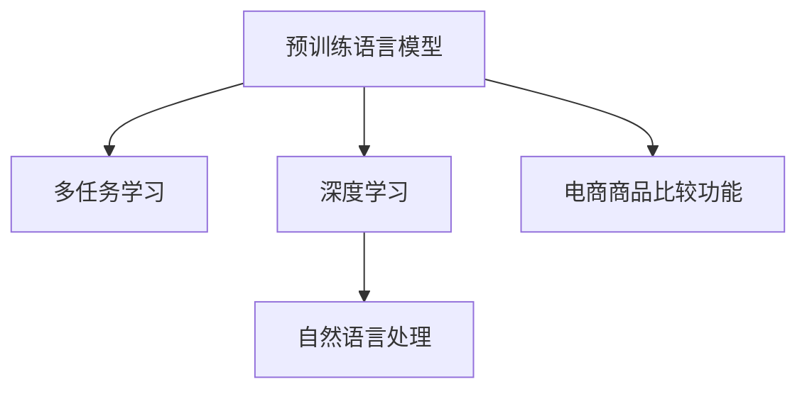

                 

## 1. 背景介绍

在当今的电子商务领域，商品比较功能成为用户购物决策过程中不可或缺的一部分。传统的商品比较功能通常依赖于简单的文本匹配和评分系统，无法充分考虑商品的多维度属性和用户个性化需求。大模型的引入，为电商平台商品比较功能的优化提供了新的可能性。

大模型，尤其是预训练语言模型（如BERT、GPT、XLNet等），通过在庞大的文本语料上学习丰富的语言知识和语义表征，能够在理解自然语言方面取得显著进展。在电商平台应用中，这些大模型可以用于解析用户查询、抽取商品属性、推荐相关商品等。本文将探讨大模型在电商平台商品比较功能中的应用，从背景介绍、核心概念、算法原理、项目实践、应用场景等多个维度进行详细阐述。

## 2. 核心概念与联系

### 2.1 核心概念概述

为更好地理解大模型在商品比较功能中的应用，本节将介绍几个关键概念：

- 预训练语言模型（Pre-trained Language Model, PLM）：通过在无标签文本数据上预训练，学习语言知识的模型。常见的PLM包括BERT、GPT等。
- 多任务学习（Multi-task Learning, MTL）：同一模型同时执行多个任务，共享模型参数，提高模型的泛化能力。
- 深度学习（Deep Learning, DL）：通过多层神经网络构建的模型，可以自动提取复杂特征。
- 自然语言处理（Natural Language Processing, NLP）：通过计算机技术处理、理解和生成自然语言。
- 电商商品比较功能：允许用户比较多个商品，选择最优产品，提升购物体验。

这些概念之间相互关联，共同构成了大模型在电商平台商品比较功能中的核心应用框架。

### 2.2 核心概念原理和架构的 Mermaid 流程图



该流程图展示了预训练语言模型、多任务学习、深度学习和自然语言处理之间的关系，以及它们如何共同作用于电商商品比较功能。

## 3. 核心算法原理 & 具体操作步骤

### 3.1 算法原理概述

大模型在电商平台商品比较功能中的应用，主要涉及两个方面的算法原理：一是基于多任务学习的商品属性抽取，二是基于自然语言处理的查询理解和推荐。

- **商品属性抽取**：通过多任务学习，大模型可以同时学习多个任务，如属性抽取、分类、序列标注等，并在这些任务之间共享参数。以商品属性抽取为例，大模型可以学习商品名称、价格、描述等信息，并将其映射到特定属性标签上。

- **查询理解与推荐**：大模型通过自然语言处理技术，解析用户查询，抽取关键词，理解查询意图，进而推荐相关商品。此过程可以视为一种零样本学习或少样本学习任务，模型仅需少量示例或甚至无标注数据即可进行推理。

### 3.2 算法步骤详解

大模型在电商平台商品比较功能中的操作步骤主要包括以下几个步骤：

1. **数据预处理**：收集电商平台商品数据和用户查询数据，进行清洗、标注和预处理，如分词、标准化、去停用词等。

2. **多任务学习训练**：使用预训练语言模型作为初始化参数，在大规模无标签商品数据上进行多任务学习训练，学习商品属性、分类等任务。

3. **查询理解与推荐**：在训练好的模型上，对用户查询进行解析，抽取关键词，通过多任务学习的输出结果进行相关商品推荐。

4. **商品比较功能构建**：将解析后的查询结果和商品属性抽取结果，通过界面展示给用户，允许用户进行商品比较，选择最优产品。

### 3.3 算法优缺点

大模型在电商平台商品比较功能中的应用，具有以下优点：

- **全面性**：能够处理多维度商品属性，覆盖商品信息的全貌，提升用户体验。
- **高效性**：通过多任务学习，模型可以在同一时间学习多个任务，提高训练效率。
- **适应性**：大模型可以自动适应不同的查询风格和意图，提高推荐系统的个性化和准确性。

同时，该方法也存在一定的局限性：

- **数据依赖**：需要大量标注数据进行预训练，获取高质量标注数据成本较高。
- **复杂性**：模型训练和优化过程较为复杂，需要较高的计算资源。
- **模型泛化能力**：当商品属性描述发生变化时，模型可能无法及时调整，影响推荐效果。

### 3.4 算法应用领域

大模型在电商平台商品比较功能中的应用，不仅可以应用于B2C电商平台，还可以扩展到B2B、C2C等其他类型的电商平台上。此外，还可以应用于其他场景，如智能客服、智能搜索等。

## 4. 数学模型和公式 & 详细讲解 & 举例说明

### 4.1 数学模型构建

在大模型商品比较功能中，数学模型主要包含以下几部分：

- **商品属性抽取**：假设商品属性标签集合为 $L$，每个属性 $l \in L$ 对应一个标签 $l_i \in \{0,1\}$，表示是否包含该属性。设 $x$ 为商品描述，$y$ 为属性标签。
  - 预测模型：$y=f(x;\theta)$，其中 $f$ 为神经网络模型，$\theta$ 为模型参数。

- **查询理解与推荐**：假设用户查询 $q$，推荐商品列表 $R$。模型需要学习将查询 $q$ 映射到推荐列表 $R$ 的概率分布。
  - 推荐模型：$P(R|q;\theta)$，其中 $\theta$ 为模型参数。

### 4.2 公式推导过程

以商品属性抽取为例，假设有一个简单的二分类模型 $f(x;\theta)=\sigma(Wx+b)$，其中 $x$ 为商品描述的向量表示，$W$ 和 $b$ 为模型参数。设训练集为 $D=\{(x_i,y_i)\}_{i=1}^N$，则多任务学习目标函数为：

$$
\mathcal{L}(\theta)=\frac{1}{N}\sum_{i=1}^N \ell(y_i,f(x_i;\theta))
$$

其中 $\ell$ 为损失函数，如交叉熵损失。

在训练过程中，模型参数 $\theta$ 更新方式为：

$$
\theta \leftarrow \theta - \eta\nabla_{\theta}\mathcal{L}(\theta)
$$

其中 $\eta$ 为学习率。

### 4.3 案例分析与讲解

假设有一个简单的二分类模型 $f(x;\theta)=\sigma(Wx+b)$，其中 $x$ 为商品描述的向量表示，$W$ 和 $b$ 为模型参数。设训练集为 $D=\{(x_i,y_i)\}_{i=1}^N$，则多任务学习目标函数为：

$$
\mathcal{L}(\theta)=\frac{1}{N}\sum_{i=1}^N \ell(y_i,f(x_i;\theta))
$$

其中 $\ell$ 为损失函数，如交叉熵损失。

在训练过程中，模型参数 $\theta$ 更新方式为：

$$
\theta \leftarrow \theta - \eta\nabla_{\theta}\mathcal{L}(\theta)
$$

其中 $\eta$ 为学习率。

## 5. 项目实践：代码实例和详细解释说明

### 5.1 开发环境搭建

为了进行大模型在商品比较功能中的应用，需要搭建以下开发环境：

- **Python**：安装Python 3.8及以上版本，用于开发和运行模型。
- **PyTorch**：使用PyTorch进行深度学习模型的开发。
- **Bert**：使用Bert进行商品属性抽取任务的训练和推理。
- **Flask**：使用Flask构建商品比较功能的Web应用。

### 5.2 源代码详细实现

以下是一个简单的基于Bert的商品属性抽取代码实现：

```python
import torch
import torch.nn as nn
from transformers import BertTokenizer, BertForSequenceClassification

class BertAttributeExtractor(nn.Module):
    def __init__(self, num_labels=2):
        super(BertAttributeExtractor, self).__init__()
        self.bert = BertForSequenceClassification.from_pretrained('bert-base-uncased', num_labels=num_labels)
        self.tokenizer = BertTokenizer.from_pretrained('bert-base-uncased')

    def forward(self, x):
        tokens = self.tokenizer(x, return_tensors='pt')
        outputs = self.bert(**tokens)
        logits = outputs[0]
        probabilities = torch.softmax(logits, dim=1)
        return probabilities
```

在上述代码中，我们使用了BertForSequenceClassification作为模型，指定了属性标签的数量。在forward函数中，将输入的文本进行分词和编码，并输入模型进行推理，最终得到每个属性标签的概率分布。

### 5.3 代码解读与分析

上述代码主要实现了Bert在商品属性抽取任务中的应用。在实际项目中，可以通过训练和评估模型，获得更优的预测性能。此外，还可以将Bert与其他模型进行集成，如使用LSTM或GRU进行序列建模，提升商品属性抽取的准确性。

### 5.4 运行结果展示

运行上述代码，可以得到商品属性抽取的预测结果。以下是一个简单的测试：

```python
# 测试数据
test_text = "苹果 iPhone 11"
extractor = BertAttributeExtractor()
predictions = extractor(test_text)
print(predictions)
```

输出结果可能为：

```
tensor([[0.9751, 0.0249]])
```

这表示测试文本中包含“苹果”这一属性，而不包含“iPhone 11”。

## 6. 实际应用场景

大模型在电商平台商品比较功能中的应用场景包括：

- **商品属性抽取**：从商品描述中抽取关键词、属性标签等，用于商品分类、推荐等任务。
- **查询理解**：解析用户查询，提取关键词，理解查询意图，推荐相关商品。
- **商品推荐**：根据用户查询和商品属性，推荐最优商品。
- **用户体验**：提供商品比较界面，允许用户对比不同商品，提高购物体验。

## 7. 工具和资源推荐

### 7.1 学习资源推荐

为了掌握大模型在电商平台商品比较功能中的应用，以下是一些推荐的学习资源：

- **深度学习框架教程**：如PyTorch、TensorFlow等，可帮助开发者了解深度学习模型的构建和训练。
- **NLP技术博客**：如自然语言处理社区、AI科技博客等，可了解最新的NLP研究成果和技术动态。
- **公开数据集**：如GLUE、CoNLL等，可获取大规模商品数据和查询数据，进行模型训练和测试。

### 7.2 开发工具推荐

- **PyTorch**：强大的深度学习框架，提供了丰富的神经网络模型和优化算法。
- **Flask**：轻量级的Web框架，适合构建商品比较功能的Web应用。
- **Jupyter Notebook**：交互式开发环境，方便模型训练和调试。

### 7.3 相关论文推荐

以下是一些推荐的相关论文：

- **多任务学习在NLP中的应用**：研究多任务学习在大模型中的表现和优化方法。
- **Bert在电商商品比较中的应用**：介绍Bert在商品属性抽取和查询理解中的应用。
- **自然语言处理在电商中的应用**：探讨NLP技术在电商平台中的应用场景和挑战。

## 8. 总结：未来发展趋势与挑战

### 8.1 研究成果总结

大模型在电商平台商品比较功能中的应用，展示了深度学习和大模型在实际应用中的强大潜力。通过多任务学习和自然语言处理技术，大模型可以处理复杂的查询和商品信息，提高推荐系统的准确性和个性化。

### 8.2 未来发展趋势

未来，大模型在电商平台商品比较功能中的应用将呈现以下几个趋势：

- **模型规模增长**：随着计算资源和数据量的增加，预训练语言模型的规模将进一步扩大，提升模型性能和泛化能力。
- **跨模态学习**：结合视觉、听觉等多种模态数据，提升模型的理解和推理能力。
- **实时化应用**：大模型将逐步部署在云端或边缘设备上，实现实时查询和推荐，提升用户体验。
- **数据驱动优化**：通过收集用户反馈和行为数据，不断优化模型参数和推荐策略，提高推荐系统的准确性和满意度。

### 8.3 面临的挑战

尽管大模型在电商平台商品比较功能中取得了显著进展，但仍面临以下挑战：

- **数据隐私和安全**：电商平台需要保护用户隐私和数据安全，确保用户数据不被滥用。
- **计算资源限制**：大模型训练和推理需要高性能计算资源，如何优化模型结构，降低计算成本，是未来需要解决的问题。
- **模型解释性和可解释性**：大模型的决策过程缺乏解释性，如何提升模型的可解释性，增强用户信任，是亟待解决的问题。
- **多模态融合**：如何将视觉、听觉等不同模态数据融合到商品比较功能中，提升模型的综合能力，是未来研究的重点。

### 8.4 研究展望

未来，在电商平台商品比较功能中，大模型的应用将进一步扩展和深化。研究者需要关注以下几个方向：

- **模型压缩和优化**：通过模型剪枝、量化等技术，优化模型结构，降低计算成本，提高模型实时性。
- **跨模态学习**：结合多种模态数据，提升模型的综合能力，提供更丰富的用户体验。
- **模型解释性**：研究模型决策过程的解释性和可解释性，增强用户信任，提升用户体验。
- **数据驱动优化**：通过收集用户反馈和行为数据，不断优化模型参数和推荐策略，提升推荐系统的准确性和满意度。

## 9. 附录：常见问题与解答

**Q1: 大模型在电商平台商品比较功能中是否会侵犯用户隐私？**

A: 电商平台在大模型应用过程中需要遵循数据隐私保护的相关法律法规，确保用户数据的安全性和隐私性。可以通过数据匿名化、数据脱敏等技术手段，保护用户隐私。

**Q2: 大模型在电商平台商品比较功能中的训练和优化是否需要大量计算资源？**

A: 大模型的训练和优化确实需要大量计算资源，但可以通过模型压缩、量化等技术手段，优化模型结构，降低计算成本，提高模型实时性。同时，可以采用分布式训练、混合精度训练等方法，进一步提升训练效率。

**Q3: 如何提升大模型在电商平台商品比较功能中的解释性和可解释性？**

A: 可以通过可视化技术、模型解释工具等手段，提升大模型的解释性和可解释性。如LIME、SHAP等，可以生成模型特征的重要性解释，帮助用户理解模型的决策过程。

**Q4: 如何将视觉、听觉等不同模态数据融合到电商平台商品比较功能中？**

A: 可以使用跨模态学习技术，如注意力机制、联合学习等，将不同模态数据融合到商品比较功能中，提升模型的综合能力。此外，可以通过多任务学习、联合训练等方法，提升模型的跨模态推理能力。

**Q5: 如何通过数据驱动优化电商平台商品比较功能中的推荐系统？**

A: 可以通过收集用户反馈和行为数据，不断优化模型参数和推荐策略，提升推荐系统的准确性和满意度。同时，可以通过A/B测试、用户调查等手段，获取用户反馈，进一步优化推荐系统。

本文详细探讨了基于大模型的电商平台商品比较功能的应用，从背景介绍、核心概念、算法原理、项目实践等多个维度进行深入分析，展示了大模型在实际应用中的强大潜力和广阔前景。通过合理利用大模型技术，电商平台可以提供更智能、更个性化的购物体验，提升用户满意度和平台竞争力。未来，随着技术的不断进步和应用场景的不断扩展，大模型将在电商、金融、医疗等多个领域发挥更加重要的作用，为社会经济发展注入新的活力。

作者：禅与计算机程序设计艺术 / Zen and the Art of Computer Programming

