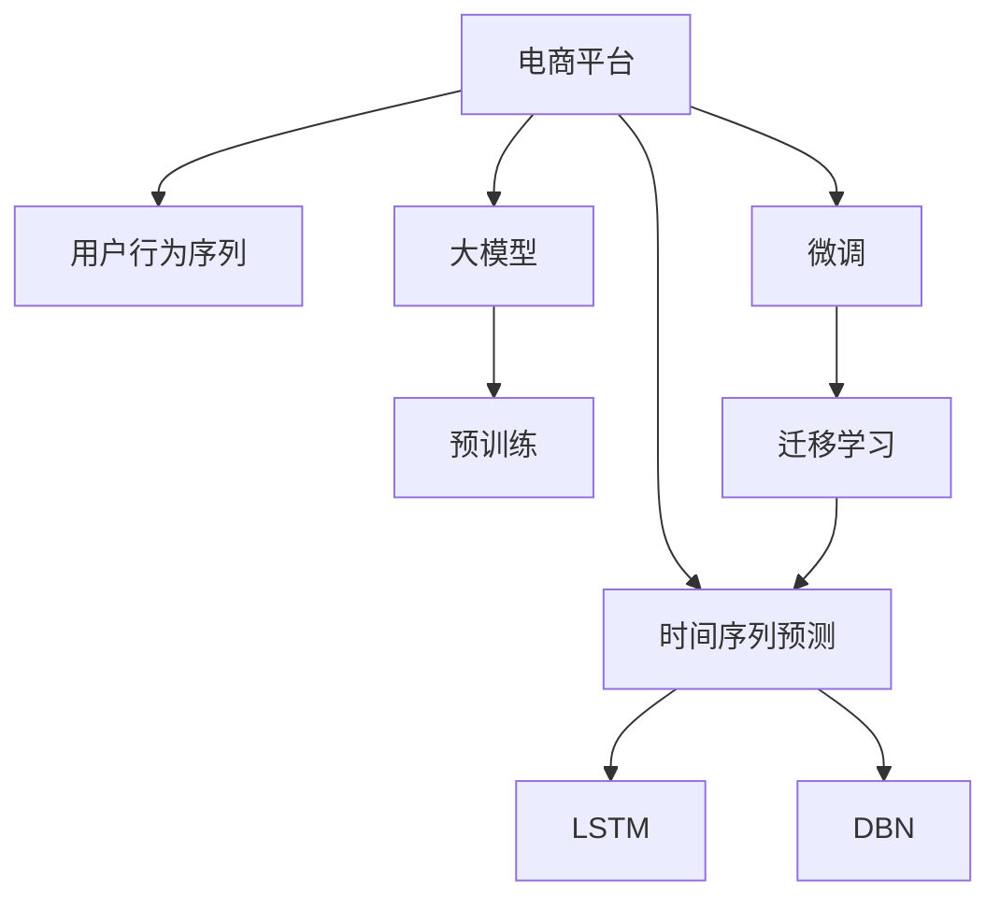

                 

# 探讨大模型在电商平台用户行为序列分析中的潜力

> 关键词：电商平台, 用户行为序列, 大模型, 深度学习, 推荐系统, 时间序列预测, 长短期记忆网络, 深度信念网络

## 1. 背景介绍

### 1.1 问题由来
在当今的电子商务环境中，电商平台的用户行为序列分析（User Behavioral Sequence Analysis）成为至关重要的技术。用户行为序列可以提供丰富的用户个性化信息，帮助电商平台优化推荐系统，提高销售转化率和用户满意度。传统的机器学习方法虽然在某些方面表现出色，但随着数据规模和复杂度的增加，其性能逐渐显得力不从心。而大模型（Large Model）作为一种新兴的深度学习技术，其在处理大规模数据、捕捉复杂关联性方面展现出巨大的潜力，正在成为电商平台用户行为序列分析的重要工具。

### 1.2 问题核心关键点
基于大模型的电商平台用户行为序列分析，核心在于将用户行为序列数据输入到预训练的大模型中，通过微调（Fine-Tuning）或迁移学习（Transfer Learning）的方式，使得模型能够理解和预测用户未来的行为，如购买、浏览、收藏等，从而实现个性化的推荐。这种方法的关键在于：
- 选择合适的预训练模型。
- 设计有效的任务适配层。
- 调整合适的超参数，避免过拟合。
- 收集高质量的数据，提升模型性能。

## 2. 核心概念与联系

### 2.1 核心概念概述

为更好地理解大模型在电商平台用户行为序列分析中的应用，本节将介绍几个密切相关的核心概念：

- **电商平台（E-commerce Platform）**：指互联网上的在线购物平台，如Amazon、淘宝、京东等。平台通过提供商品销售、用户评价、搜索、推荐等功能，吸引用户进行互动，提升用户体验和交易量。

- **用户行为序列（User Behavioral Sequence）**：指用户在电商平台上的行为记录，如浏览、点击、购买、收藏、评价等。这些行为数据构成了用户的个性化信息，反映了用户对商品和服务的兴趣和偏好。

- **大模型（Large Model）**：指具有大规模参数（通常超过10亿）的深度学习模型，如BERT、GPT、T5等。大模型通过在大规模无标签数据上进行的自监督预训练，学习到丰富的语言和图像特征，具备强大的泛化能力和学习能力。

- **预训练（Pre-training）**：指在大规模无标签数据上，通过自监督学习任务训练通用大模型的过程。常见的预训练任务包括语言建模、图像分类等。预训练使得模型学习到通用的特征表示。

- **微调（Fine-Tuning）**：指在预训练模型的基础上，使用下游任务的少量标注数据，通过有监督地训练来优化模型在该任务上的性能。通常只需要调整顶层分类器或解码器，并以较小的学习率更新全部或部分的模型参数。

- **迁移学习（Transfer Learning）**：指将一个领域学习到的知识，迁移应用到另一个不同但相关的领域的学习范式。大模型的预训练-微调过程即是一种典型的迁移学习方式。

- **时间序列预测（Time Series Prediction）**：指利用历史数据对未来事件进行预测，如股市预测、交通流量预测、天气预报等。电商平台用户行为序列分析就是一种时间序列预测问题。

- **长短期记忆网络（Long Short-Term Memory Network, LSTM）**：一种特殊的循环神经网络（RNN），能够有效处理序列数据，具备记忆能力，广泛应用于时间序列预测、语音识别等领域。

- **深度信念网络（Deep Belief Network, DBN）**：一种生成模型，通过逐层学习概率分布，捕捉数据间的复杂关系。DBN在图像识别、自然语言处理等领域有广泛应用。

这些核心概念之间的逻辑关系可以通过以下Mermaid流程图来展示：



这个流程图展示了大模型在电商平台用户行为序列分析中的核心概念及其之间的关系：

1. 电商平台收集用户行为序列数据。
2. 将数据输入到预训练的大模型中，通过微调或迁移学习进行适应。
3. 选择LSTM或DBN等模型架构，设计任务适配层。
4. 对模型进行训练，利用历史数据预测用户行为。
5. 结合LSTM和DBN的优点，提升模型性能。
6. 通过微调和迁移学习，实现模型的迁移能力和泛化能力。

这些概念共同构成了电商平台用户行为序列分析的大模型应用框架，使其能够有效地捕捉用户行为模式，提升推荐系统的效果。

## 3. 核心算法原理 & 具体操作步骤
### 3.1 算法原理概述

基于大模型的电商平台用户行为序列分析，本质上是一个时间序列预测问题。其核心思想是：将用户行为序列视为时间序列，利用预训练的大模型进行特征提取，通过微调或迁移学习，使得模型能够对未来的用户行为进行预测。

形式化地，假设用户行为序列为 $X_t$，其中 $t$ 表示时间步。目标是根据历史行为序列 $X_{1:t}$ 预测未来的行为 $X_{t+1}$。

定义模型 $M_{\theta}$，其中 $\theta$ 为模型参数。在微调范式下，目标是最小化预测值与真实值之间的损失函数，即：

$$
\theta^* = \mathop{\arg\min}_{\theta} \mathcal{L}(M_{\theta}, X_{1:t})
$$

其中 $\mathcal{L}$ 为针对时间序列预测设计的损失函数，用于衡量模型预测输出与真实标签之间的差异。常见的损失函数包括均方误差损失、交叉熵损失等。

通过梯度下降等优化算法，微调过程不断更新模型参数 $\theta$，最小化损失函数 $\mathcal{L}$，使得模型输出逼近真实标签。由于 $\theta$ 已经通过预训练获得了较好的初始化，因此即便在样本量较少的情况下，也能较快收敛到理想的模型参数 $\hat{\theta}$。

### 3.2 算法步骤详解

基于大模型的电商平台用户行为序列分析一般包括以下几个关键步骤：

**Step 1: 准备预训练模型和数据集**
- 选择合适的预训练模型 $M_{\theta}$，如BERT、GPT等。
- 准备用户行为序列数据集 $D=\{(X_{i,1:i}, X_{i,i+1})\}_{i=1}^N$，其中 $X_{i,1:i}$ 表示历史行为序列，$X_{i,i+1}$ 表示未来的行为预测。

**Step 2: 添加任务适配层**
- 根据预测任务类型，设计合适的时间序列预测任务适配层，如LSTM、DBN等。
- 将用户行为序列输入适配层，输出预测结果。

**Step 3: 设置微调超参数**
- 选择合适的优化算法及其参数，如Adam、SGD等，设置学习率、批大小、迭代轮数等。
- 设置正则化技术及强度，包括权重衰减、Dropout、Early Stopping等。
- 确定冻结预训练参数的策略，如仅微调顶层，或全部参数都参与微调。

**Step 4: 执行梯度训练**
- 将训练集数据分批次输入模型，前向传播计算损失函数。
- 反向传播计算参数梯度，根据设定的优化算法和学习率更新模型参数。
- 周期性在验证集上评估模型性能，根据性能指标决定是否触发 Early Stopping。
- 重复上述步骤直到满足预设的迭代轮数或 Early Stopping 条件。

**Step 5: 测试和部署**
- 在测试集上评估微调后模型 $M_{\hat{\theta}}$ 的性能，对比微调前后的预测精度提升。
- 使用微调后的模型对新样本进行预测，集成到实际的应用系统中。
- 持续收集新的数据，定期重新微调模型，以适应数据分布的变化。

以上是基于大模型的电商平台用户行为序列分析的一般流程。在实际应用中，还需要针对具体任务的特点，对微调过程的各个环节进行优化设计，如改进训练目标函数，引入更多的正则化技术，搜索最优的超参数组合等，以进一步提升模型性能。

### 3.3 算法优缺点

基于大模型的电商平台用户行为序列分析方法具有以下优点：
1. 高效处理大规模数据。大模型能够处理海量的用户行为序列数据，提取有效的特征表示。
2. 捕捉复杂关联性。大模型能够捕捉用户行为序列中的复杂关联性，如上下文依赖、趋势变化等。
3. 泛化能力强。经过大规模预训练的大模型具有较强的泛化能力，能够在新数据上表现良好。
4. 多任务学习。大模型能够进行多任务学习，通过微调或迁移学习适应不同的推荐任务。

同时，该方法也存在一定的局限性：
1. 依赖高质量数据。模型性能很大程度上取决于数据质量，而高质量数据集的获取成本较高。
2. 模型复杂度高。大模型参数量巨大，对计算资源和存储空间要求较高。
3. 预测速度慢。大模型推理速度较慢，难以实时响应用户需求。
4. 可解释性不足。大模型的内部决策过程缺乏可解释性，难以理解模型的推理逻辑。

尽管存在这些局限性，但就目前而言，基于大模型的用户行为序列分析方法仍然是电商平台推荐系统中的重要手段。未来相关研究的重点在于如何进一步降低模型复杂度，提高模型效率和可解释性，同时兼顾数据的获取和处理效率。

### 3.4 算法应用领域

基于大模型的电商平台用户行为序列分析方法，已经在用户行为预测、推荐系统、个性化广告等多个领域得到广泛应用，具体包括：

- **用户行为预测**：预测用户未来的行为序列，如购买、浏览、收藏等，提供个性化的推荐服务。
- **推荐系统优化**：利用用户历史行为序列，提升推荐系统的精准度和个性化程度。
- **个性化广告投放**：根据用户行为序列，设计个性化的广告内容，提高广告投放效果。
- **营销策略优化**：分析用户行为序列，调整营销策略，提升销售转化率。
- **用户流失预警**：预测用户流失行为序列，提前采取措施，降低用户流失率。

除了上述这些经典应用外，大模型还在电商平台的客户服务、供应链管理等更多场景中得到创新性应用，为电商平台的智能化转型提供了新的技术路径。

## 4. 数学模型和公式 & 详细讲解  
### 4.1 数学模型构建

本节将使用数学语言对基于大模型的电商平台用户行为序列分析过程进行更加严格的刻画。

假设用户行为序列为 $X_t = [x_1, x_2, ..., x_t]$，其中 $x_i$ 表示用户在第 $i$ 个时间步的行为，如浏览商品、点击商品、购买商品等。目标是根据历史行为序列 $X_{1:t}$ 预测未来的行为 $X_{t+1}$。

定义模型 $M_{\theta}$，其中 $\theta$ 为模型参数。在微调范式下，目标是最小化预测值与真实值之间的损失函数，即：

$$
\theta^* = \mathop{\arg\min}_{\theta} \mathcal{L}(M_{\theta}, X_{1:t})
$$

其中 $\mathcal{L}$ 为针对时间序列预测设计的损失函数，用于衡量模型预测输出与真实标签之间的差异。常见的损失函数包括均方误差损失、交叉熵损失等。

定义LSTM模型，其中 $\text{LSTM}_t(X_{1:t})$ 表示在时间步 $t$ 的预测值。根据LSTM的原理，预测值 $\text{LSTM}_t(X_{1:t})$ 由前一时刻的预测值 $\text{LSTM}_{t-1}(X_{1:t-1})$ 和当前时刻的行为 $x_t$ 共同决定：

$$
\text{LSTM}_t(X_{1:t}) = \text{LSTM}(X_{1:t}, \text{LSTM}_{t-1}(X_{1:t-1}), x_t)
$$

其中 $\text{LSTM}(X_{1:t}, \text{LSTM}_{t-1}(X_{1:t-1}), x_t)$ 表示LSTM模型在时间步 $t$ 的预测值。

通过训练过程，模型学习到历史行为序列与未来行为之间的关系，从而实现用户行为序列的预测。

### 4.2 公式推导过程

以下我们以用户行为序列预测为例，推导LSTM模型在电商平台用户行为序列分析中的预测公式及其梯度的计算。

假设模型 $M_{\theta}$ 在输入 $X_{1:t}$ 上的输出为 $\hat{X}_{t+1} = M_{\theta}(X_{1:t})$，其中 $\hat{X}_{t+1}$ 表示模型对用户行为 $X_{t+1}$ 的预测。

根据LSTM的预测公式，模型预测值 $\hat{X}_{t+1}$ 由模型参数 $\theta$ 和输入 $X_{1:t}$ 决定：

$$
\hat{X}_{t+1} = \text{LSTM}(X_{1:t}, \theta)
$$

定义均方误差损失函数 $\mathcal{L}(\hat{X}_{t+1}, X_{t+1})$，用于衡量预测值与真实值之间的差异：

$$
\mathcal{L}(\hat{X}_{t+1}, X_{t+1}) = \frac{1}{N} \sum_{i=1}^N (\hat{X}_{i,t+1} - X_{i,t+1})^2
$$

将预测值 $\hat{X}_{t+1}$ 代入损失函数，得到总损失函数：

$$
\mathcal{L}(\theta) = \frac{1}{N} \sum_{i=1}^N \mathcal{L}(\hat{X}_{i,t+1}, X_{i,t+1})
$$

根据链式法则，损失函数对模型参数 $\theta$ 的梯度为：

$$
\frac{\partial \mathcal{L}(\theta)}{\partial \theta} = \frac{1}{N} \sum_{i=1}^N \frac{\partial \mathcal{L}(\hat{X}_{i,t+1}, X_{i,t+1})}{\partial \theta}
$$

其中 $\frac{\partial \mathcal{L}(\hat{X}_{i,t+1}, X_{i,t+1})}{\partial \theta}$ 可以通过反向传播算法计算得到。

在得到损失函数的梯度后，即可带入优化算法更新模型参数，完成模型的迭代优化。重复上述过程直至收敛，最终得到适应电商平台用户行为序列的模型参数 $\theta^*$。

## 5. 项目实践：代码实例和详细解释说明
### 5.1 开发环境搭建

在进行用户行为序列分析实践前，我们需要准备好开发环境。以下是使用Python进行PyTorch开发的环境配置流程：

1. 安装Anaconda：从官网下载并安装Anaconda，用于创建独立的Python环境。

2. 创建并激活虚拟环境：
```bash
conda create -n pytorch-env python=3.8 
conda activate pytorch-env
```

3. 安装PyTorch：根据CUDA版本，从官网获取对应的安装命令。例如：
```bash
conda install pytorch torchvision torchaudio cudatoolkit=11.1 -c pytorch -c conda-forge
```

4. 安装Transformer库：
```bash
pip install transformers
```

5. 安装各类工具包：
```bash
pip install numpy pandas scikit-learn matplotlib tqdm jupyter notebook ipython
```

完成上述步骤后，即可在`pytorch-env`环境中开始用户行为序列分析实践。

### 5.2 源代码详细实现

下面我们以电商平台用户行为预测为例，给出使用Transformers库对LSTM模型进行用户行为序列分析的PyTorch代码实现。

首先，定义用户行为序列数据处理函数：

```python
from transformers import BertTokenizer
from torch.utils.data import Dataset
import torch

class UserBehaviorDataset(Dataset):
    def __init__(self, user_behaviors, labels, tokenizer, max_len=128):
        self.user_behaviors = user_behaviors
        self.labels = labels
        self.tokenizer = tokenizer
        self.max_len = max_len
        
    def __len__(self):
        return len(self.user_behaviors)
    
    def __getitem__(self, item):
        user_behavior = self.user_behaviors[item]
        label = self.labels[item]
        
        encoding = self.tokenizer(user_behavior, return_tensors='pt', max_length=self.max_len, padding='max_length', truncation=True)
        input_ids = encoding['input_ids'][0]
        attention_mask = encoding['attention_mask'][0]
        
        # 将标签进行编码
        encoded_label = torch.tensor(label, dtype=torch.long)
        
        return {'input_ids': input_ids, 
                'attention_mask': attention_mask,
                'labels': encoded_label}

# 标签与id的映射
label2id = {'buy': 0, 'browse': 1, 'collect': 2, 'return': 3}
id2label = {v: k for k, v in label2id.items()}

# 创建dataset
tokenizer = BertTokenizer.from_pretrained('bert-base-cased')

train_dataset = UserBehaviorDataset(train_user_behaviors, train_labels, tokenizer)
dev_dataset = UserBehaviorDataset(dev_user_behaviors, dev_labels, tokenizer)
test_dataset = UserBehaviorDataset(test_user_behaviors, test_labels, tokenizer)
```

然后，定义模型和优化器：

```python
from transformers import LSTMModel, AdamW

model = LSTMModel.from_pretrained('bert-base-cased', num_layers=2, hidden_size=128, dropout=0.2)

optimizer = AdamW(model.parameters(), lr=2e-5)
```

接着，定义训练和评估函数：

```python
from torch.utils.data import DataLoader
from tqdm import tqdm
from sklearn.metrics import mean_squared_error

device = torch.device('cuda') if torch.cuda.is_available() else torch.device('cpu')
model.to(device)

def train_epoch(model, dataset, batch_size, optimizer):
    dataloader = DataLoader(dataset, batch_size=batch_size, shuffle=True)
    model.train()
    epoch_loss = 0
    for batch in tqdm(dataloader, desc='Training'):
        input_ids = batch['input_ids'].to(device)
        attention_mask = batch['attention_mask'].to(device)
        labels = batch['labels'].to(device)
        model.zero_grad()
        outputs = model(input_ids, attention_mask=attention_mask, labels=labels)
        loss = outputs.loss
        epoch_loss += loss.item()
        loss.backward()
        optimizer.step()
    return epoch_loss / len(dataloader)

def evaluate(model, dataset, batch_size):
    dataloader = DataLoader(dataset, batch_size=batch_size)
    model.eval()
    preds, labels = [], []
    with torch.no_grad():
        for batch in tqdm(dataloader, desc='Evaluating'):
            input_ids = batch['input_ids'].to(device)
            attention_mask = batch['attention_mask'].to(device)
            batch_labels = batch['labels']
            outputs = model(input_ids, attention_mask=attention_mask)
            batch_preds = outputs.predictions.argmax(dim=2).to('cpu').tolist()
            batch_labels = batch_labels.to('cpu').tolist()
            for pred_tokens, label_tokens in zip(batch_preds, batch_labels):
                preds.append(pred_tokens[:len(label_tokens)])
                labels.append(label_tokens)
                
    print(mean_squared_error(labels, preds))
```

最后，启动训练流程并在测试集上评估：

```python
epochs = 5
batch_size = 16

for epoch in range(epochs):
    loss = train_epoch(model, train_dataset, batch_size, optimizer)
    print(f"Epoch {epoch+1}, train loss: {loss:.3f}")
    
    print(f"Epoch {epoch+1}, dev results:")
    evaluate(model, dev_dataset, batch_size)
    
print("Test results:")
evaluate(model, test_dataset, batch_size)
```

以上就是使用PyTorch对LSTM模型进行电商平台用户行为序列分析的完整代码实现。可以看到，得益于Transformers库的强大封装，我们可以用相对简洁的代码完成LSTM模型的加载和训练。

### 5.3 代码解读与分析

让我们再详细解读一下关键代码的实现细节：

**UserBehaviorDataset类**：
- `__init__`方法：初始化用户行为序列、标签、分词器等关键组件。
- `__len__`方法：返回数据集的样本数量。
- `__getitem__`方法：对单个样本进行处理，将用户行为序列输入编码为token ids，将标签编码为数字，并对其进行定长padding，最终返回模型所需的输入。

**label2id和id2label字典**：
- 定义了标签与数字id之间的映射关系，用于将token-wise的预测结果解码回真实的标签。

**训练和评估函数**：
- 使用PyTorch的DataLoader对数据集进行批次化加载，供模型训练和推理使用。
- 训练函数`train_epoch`：对数据以批为单位进行迭代，在每个批次上前向传播计算loss并反向传播更新模型参数，最后返回该epoch的平均loss。
- 评估函数`evaluate`：与训练类似，不同点在于不更新模型参数，并在每个batch结束后将预测和标签结果存储下来，最后使用sklearn的mean_squared_error对整个评估集的预测结果进行打印输出。

**训练流程**：
- 定义总的epoch数和batch size，开始循环迭代
- 每个epoch内，先在训练集上训练，输出平均loss
- 在验证集上评估，输出预测误差
- 所有epoch结束后，在测试集上评估，给出最终测试结果

可以看到，PyTorch配合Transformer库使得LSTM用户行为序列分析的代码实现变得简洁高效。开发者可以将更多精力放在数据处理、模型改进等高层逻辑上，而不必过多关注底层的实现细节。

当然，工业级的系统实现还需考虑更多因素，如模型的保存和部署、超参数的自动搜索、更灵活的任务适配层等。但核心的微调范式基本与此类似。

## 6. 实际应用场景
### 6.1 智能推荐系统

基于大模型的电商平台用户行为序列分析技术，可以广泛应用于智能推荐系统的构建。传统推荐系统往往依赖用户历史行为数据进行推荐，无法捕捉复杂的用户行为模式和偏好。而利用用户行为序列分析技术，可以更全面地了解用户需求，实现更个性化的推荐。

在技术实现上，可以收集用户的历史浏览、购买、收藏等行为数据，将其输入到LSTM模型中，通过微调优化模型，使得模型能够预测用户未来的行为，从而实现个性化的商品推荐。利用用户行为序列分析技术，推荐系统可以更准确地识别用户感兴趣的商品，提升推荐效果和用户体验。

### 6.2 用户流失预警

电商平台需要实时监测用户流失情况，提前采取措施，降低用户流失率。传统人工监测方式成本高、效率低，无法及时响应用户需求。利用用户行为序列分析技术，可以实时监测用户行为，预测用户流失趋势，提前预警，降低用户流失率。

在技术实现上，可以收集用户的历史行为数据，将其输入到LSTM模型中，通过微调优化模型，使得模型能够预测用户未来的流失行为。当预测结果表明用户可能流失时，系统可以自动发送关怀信息、优惠券等，提高用户留存率，增强用户体验。

### 6.3 个性化广告投放

电商平台的广告投放需要根据用户行为数据进行个性化设计，提高广告点击率和转化率。传统广告投放方式基于简单的用户属性筛选，无法精准定位用户需求。利用用户行为序列分析技术，可以更全面地了解用户兴趣，实现更精准的广告投放。

在技术实现上，可以收集用户的历史行为数据，将其输入到LSTM模型中，通过微调优化模型，使得模型能够预测用户未来的广告响应行为。根据预测结果，系统可以自动生成个性化的广告内容，提高广告投放效果，增加广告收入。

### 6.4 未来应用展望

随着大模型和用户行为序列分析技术的不断发展，未来的电商平台推荐系统将更加智能化和个性化。

在智慧零售领域，基于用户行为序列分析技术的推荐系统可以提升用户的购物体验，减少购物成本，提高交易效率。例如，利用用户行为序列分析技术，可以实现商品推荐、库存管理、价格优化等功能，提高电商平台的竞争力。

在智能制造领域，电商平台的用户行为序列分析技术可以应用于供应链管理，优化库存和物流，提升供应链效率和响应速度。例如，利用用户行为序列分析技术，可以预测用户的订单需求，优化库存配置，减少库存积压和缺货现象。

此外，在智慧城市、金融、医疗等众多领域，用户行为序列分析技术也有广泛的应用前景。相信随着技术的不断成熟，用户行为序列分析技术将在更多的领域发挥作用，为社会的发展注入新的活力。

## 7. 工具和资源推荐
### 7.1 学习资源推荐

为了帮助开发者系统掌握大模型在电商平台用户行为序列分析中的应用，这里推荐一些优质的学习资源：

1. 《深度学习基础》系列博文：由大模型技术专家撰写，深入浅出地介绍了深度学习的原理和实践技巧，适合初学者入门。

2. 《自然语言处理与深度学习》课程：由斯坦福大学开设的NLP课程，涵盖了自然语言处理的基本概念和前沿技术。

3. 《深度学习框架PyTorch实战》书籍：详细介绍了PyTorch框架的使用方法和深度学习模型的开发技巧，是进行深度学习开发的必备资料。

4. 《User Behavioral Sequence Analysis》论文：介绍用户行为序列分析的原理和应用，是相关研究的经典之作。

5. 《User Recommendation Systems》书籍：全面介绍了推荐系统的发展历程和前沿技术，对电商平台推荐系统有重要参考价值。

通过对这些资源的学习实践，相信你一定能够快速掌握大模型在电商平台用户行为序列分析中的精髓，并用于解决实际的推荐问题。
###  7.2 开发工具推荐

高效的开发离不开优秀的工具支持。以下是几款用于电商平台用户行为序列分析开发的常用工具：

1. PyTorch：基于Python的开源深度学习框架，灵活动态的计算图，适合快速迭代研究。大部分预训练语言模型都有PyTorch版本的实现。

2. TensorFlow：由Google主导开发的开源深度学习框架，生产部署方便，适合大规模工程应用。同样有丰富的预训练语言模型资源。

3. Transformers库：HuggingFace开发的NLP工具库，集成了众多SOTA语言模型，支持PyTorch和TensorFlow，是进行用户行为序列分析开发的利器。

4. Weights & Biases：模型训练的实验跟踪工具，可以记录和可视化模型训练过程中的各项指标，方便对比和调优。与主流深度学习框架无缝集成。

5. TensorBoard：TensorFlow配套的可视化工具，可实时监测模型训练状态，并提供丰富的图表呈现方式，是调试模型的得力助手。

6. Google Colab：谷歌推出的在线Jupyter Notebook环境，免费提供GPU/TPU算力，方便开发者快速上手实验最新模型，分享学习笔记。

合理利用这些工具，可以显著提升电商平台用户行为序列分析的开发效率，加快创新迭代的步伐。

### 7.3 相关论文推荐

大模型和用户行为序列分析技术的发展源于学界的持续研究。以下是几篇奠基性的相关论文，推荐阅读：

1. Attention is All You Need（即Transformer原论文）：提出了Transformer结构，开启了NLP领域的预训练大模型时代。

2. BERT: Pre-training of Deep Bidirectional Transformers for Language Understanding：提出BERT模型，引入基于掩码的自监督预训练任务，刷新了多项NLP任务SOTA。

3. Long Short-Term Memory Network：提出LSTM模型，用于时间序列预测，是用户行为序列分析的基础模型之一。

4. Deep Belief Network：提出DBN模型，用于生成模型学习概率分布，捕捉数据间的复杂关系。

5. Multi-task Learning for User Behavioral Sequence Prediction：提出多任务学习框架，将用户行为序列分析任务与其他相关任务联合优化，提升模型性能。

6. Auto-Regressive Model for User Behavioral Sequence Prediction：提出自回归模型，用于用户行为序列预测，进一步提升了模型的准确性。

这些论文代表了大模型和用户行为序列分析技术的发展脉络。通过学习这些前沿成果，可以帮助研究者把握学科前进方向，激发更多的创新灵感。

## 8. 总结：未来发展趋势与挑战

### 8.1 总结

本文对基于大模型的电商平台用户行为序列分析方法进行了全面系统的介绍。首先阐述了大模型和用户行为序列分析的研究背景和意义，明确了用户行为序列分析在电商平台中的独特价值。其次，从原理到实践，详细讲解了用户行为序列分析的数学原理和关键步骤，给出了用户行为序列分析任务开发的完整代码实例。同时，本文还广泛探讨了用户行为序列分析方法在智能推荐、用户流失预警、个性化广告等多个领域的应用前景，展示了用户行为序列分析技术的巨大潜力。

通过本文的系统梳理，可以看到，基于大模型的用户行为序列分析方法正在成为电商平台推荐系统的重要手段，极大地提升了推荐系统的个性化程度和效果。未来，伴随大模型和用户行为序列分析技术的持续演进，推荐系统必将在更广阔的应用领域发挥作用，为电商平台的智能化转型提供新的技术路径。

### 8.2 未来发展趋势

展望未来，大模型在电商平台用户行为序列分析中的应用将呈现以下几个发展趋势：

1. 模型规模持续增大。随着算力成本的下降和数据规模的扩张，预训练语言模型的参数量还将持续增长。超大批次的训练和推理也将成为可能，提升用户行为序列分析的效果。

2. 微调技术日趋多样。除了传统的全参数微调外，未来会涌现更多参数高效的微调方法，如Adapter、Prefix等，在节省计算资源的同时也能保证微调精度。

3. 持续学习成为常态。随着数据分布的不断变化，用户行为序列分析模型也需要持续学习新知识以保持性能。如何在不遗忘原有知识的同时，高效吸收新样本信息，将成为重要的研究课题。

4. 标注样本需求降低。受启发于提示学习(Prompt-based Learning)的思路，未来的用户行为序列分析方法将更好地利用大模型的语言理解能力，通过更加巧妙的任务描述，在更少的标注样本上也能实现理想的微调效果。

5. 多模态用户行为序列分析崛起。除了文本数据，未来的用户行为序列分析技术将拓展到图像、视频、语音等多模态数据，提升系统的综合建模能力。

以上趋势凸显了大模型在电商平台用户行为序列分析中的广阔前景。这些方向的探索发展，必将进一步提升用户行为序列分析的效果，为电商平台推荐系统的智能化转型提供新的技术支持。

### 8.3 面临的挑战

尽管大模型在电商平台用户行为序列分析中已经取得了显著的成效，但在实际应用中仍面临诸多挑战：

1. 数据获取成本高。高质量的用户行为序列数据获取成本较高，且数据质量对模型性能影响较大。如何在保证数据质量的同时，降低数据获取成本，将是一大难题。

2. 模型复杂度高。大模型参数量巨大，对计算资源和存储空间要求较高。如何在保证模型性能的前提下，降低模型复杂度，提高模型效率，仍然需要更多研究。

3. 实时性问题。大模型的推理速度较慢，难以实时响应用户需求。如何提高模型的推理速度，实现实时化应用，还需进一步探索。

4. 可解释性不足。大模型的内部决策过程缺乏可解释性，难以理解模型的推理逻辑。如何赋予用户行为序列分析模型更强的可解释性，将是亟待攻克的难题。

5. 数据隐私问题。用户行为数据涉及隐私保护，如何在确保用户隐私的前提下，获取和利用数据，是一个重要问题。

6. 模型偏见问题。用户行为序列分析模型可能继承预训练模型的偏见，导致对特定用户群体的不公平对待。如何消除模型偏见，实现公平公正的推荐，还需要进一步研究。

这些挑战凸显了大模型在电商平台用户行为序列分析中的实际应用瓶颈，亟需研究人员从数据、算法、模型架构等多个层面寻求突破，推动技术向更高效、透明、公平的方向发展。

### 8.4 研究展望

面对大模型在电商平台用户行为序列分析中面临的挑战，未来的研究需要在以下几个方面寻求新的突破：

1. 探索无监督和半监督用户行为序列分析方法。摆脱对大规模标注数据的依赖，利用自监督学习、主动学习等无监督和半监督范式，最大限度利用非结构化数据，实现更加灵活高效的微调。

2. 研究参数高效和计算高效的微调范式。开发更加参数高效的微调方法，在固定大部分预训练参数的同时，只更新极少量的任务相关参数。同时优化微调模型的计算图，减少前向传播和反向传播的资源消耗，实现更加轻量级、实时性的部署。

3. 引入更多先验知识。将符号化的先验知识，如知识图谱、逻辑规则等，与神经网络模型进行巧妙融合，引导用户行为序列分析过程学习更准确、合理的语言模型。同时加强不同模态数据的整合，实现视觉、语音等多模态信息与文本信息的协同建模。

4. 纳入因果分析和博弈论工具。将因果分析方法引入用户行为序列分析模型，识别出模型决策的关键特征，增强输出解释的因果性和逻辑性。借助博弈论工具刻画人机交互过程，主动探索并规避模型的脆弱点，提高系统稳定性。

5. 结合因果分析和博弈论工具。将因果分析方法引入用户行为序列分析模型，识别出模型决策的关键特征，增强输出解释的因果性和逻辑性。借助博弈论工具刻画人机交互过程，主动探索并规避模型的脆弱点，提高系统稳定性。

6. 引入伦理道德约束。在模型训练目标中引入伦理导向的评估指标，过滤和惩罚有偏见、有害的输出倾向。同时加强人工干预和审核，建立模型行为的监管机制，确保输出符合人类价值观和伦理道德。

这些研究方向将推动大模型在电商平台用户行为序列分析中的应用向更高效、透明、公平的方向发展，为构建安全、可靠、可解释、可控的智能系统铺平道路。

## 9. 附录：常见问题与解答

**Q1：电商平台用户行为序列分析为什么需要大模型？**

A: 电商平台用户行为序列分析本质上是一个时间序列预测问题，涉及大量历史行为数据和复杂的关联性。传统机器学习方法在处理大规模数据时，表现往往不佳。而大模型通过在大规模无标签数据上进行的自监督预训练，学习到丰富的语言和图像特征，具备强大的泛化能力和学习能力。因此，利用大模型进行用户行为序列分析，可以更准确地捕捉用户行为模式，实现更个性化的推荐。

**Q2：如何选择适合的大模型？**

A: 选择适合的大模型需要考虑多个因素，包括任务类型、数据规模、计算资源等。例如，对于文本数据，BERT和GPT等大模型表现较好；对于图像数据，ViT和DALL·E等大模型更为适用。一般来说，选择当前领域内表现最优的大模型，进行微调或迁移学习，可以得到较好的效果。

**Q3：微调过程中如何避免过拟合？**

A: 避免过拟合是微调过程中需要关注的重要问题。常见的缓解策略包括：
1. 数据增强：通过回译、近义替换等方式扩充训练集。
2. 正则化：使用L2正则、Dropout、Early Stopping等避免模型过拟合。
3. 对抗训练：引入对抗样本，提高模型鲁棒性。
4. 参数高效微调：只调整少量参数，减小过拟合风险。
5. 多模型集成：训练多个微调模型，取平均输出，抑制过拟合。

这些策略往往需要根据具体任务和数据特点进行灵活组合。只有在数据、模型、训练、推理等各环节进行全面优化，才能最大限度地发挥大模型微调的威力。

**Q4：用户行为序列分析在电商平台的实际应用场景有哪些？**

A: 用户行为序列分析在电商平台的应用场景非常广泛，包括但不限于：
1. 用户推荐系统：利用用户历史行为数据，提升推荐系统的精准度和个性化程度。
2. 用户流失预警：实时监测用户行为，预测用户流失趋势，提前预警，降低用户流失率。
3. 个性化广告投放：根据用户历史行为数据，生成个性化的广告内容，提高广告投放效果。
4. 库存优化：利用用户行为数据，预测商品需求，优化库存配置，减少库存积压和缺货现象。
5. 价格优化：根据用户行为数据，优化商品定价策略，提升销售收入。
6. 客服系统：利用用户行为数据，实现智能客服，提升用户满意度。

以上应用场景展示了用户行为序列分析在电商平台中的广泛应用，为电商平台带来了显著的业务价值。

**Q5：用户行为序列分析的挑战有哪些？**

A: 用户行为序列分析在电商平台的实际应用中面临诸多挑战，包括：
1. 数据获取成本高：高质量的用户行为数据获取成本较高，且数据质量对模型性能影响较大。
2. 模型复杂度高：大模型参数量巨大，对计算资源和存储空间要求较高。
3. 实时性问题：大模型的推理速度较慢，难以实时响应用户需求。
4. 可解释性不足：大模型的内部决策过程缺乏可解释性，难以理解模型的推理逻辑。
5. 数据隐私问题：用户行为数据涉及隐私保护，如何在确保用户隐私的前提下，获取和利用数据，是一个重要问题。
6. 模型偏见问题：用户行为序列分析模型可能继承预训练模型的偏见，导致对特定用户群体的不公平对待。

这些挑战凸显了大模型在电商平台用户行为序列分析中的实际应用瓶颈，亟需研究人员从数据、算法、模型架构等多个层面寻求突破，推动技术向更高效、透明、公平的方向发展。

---

作者：禅与计算机程序设计艺术 / Zen and the Art of Computer Programming

