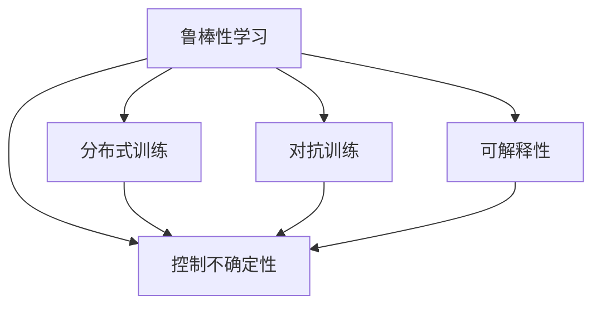

                 

# 控制不确定性：增强LLM的可靠性

> 关键词：大语言模型(Large Language Models, LLMs), 可靠性, 鲁棒性, 鲁棒性学习(Robust Learning), 控制不确定性, 分布式训练, 对抗训练, 可解释性

## 1. 背景介绍

### 1.1 问题由来
近年来，大语言模型(Large Language Models, LLMs)在自然语言处理(Natural Language Processing, NLP)领域取得了显著进展，广泛应用在问答、对话系统、机器翻译、文本生成等多个方向。然而，随着模型复杂度的提高，其输出结果的不确定性也随之增加。

由于LLMs学习的是数据分布，而实际应用中，模型训练和推理数据往往存在差异，甚至可能存在分布偏移的情况。这使得LLMs在实际应用中的输出结果可能出现严重的偏差，导致系统不稳定、决策错误等严重问题。因此，如何提升LLMs的可靠性，是当前研究者和工程师共同关注的核心问题。

### 1.2 问题核心关键点
要提升LLMs的可靠性，核心在于控制不确定性，确保模型输出在新的数据分布下依然具有高度准确性和鲁棒性。具体来说，需要解决以下几个关键问题：

1. **鲁棒性学习**：训练模型时，如何引入更多的鲁棒性约束，使得模型在面对数据分布变化时仍能保持稳定表现。
2. **控制不确定性**：在推理阶段，如何估计和控制模型输出结果的不确定性，避免对异常输入做出错误的决策。
3. **分布式训练**：如何在大规模数据集上训练LLMs，同时保证模型的稳定性和可扩展性。
4. **对抗训练**：如何在训练和推理阶段引入对抗样本，提高模型对抗扰动的鲁棒性。
5. **可解释性**：如何提高LLMs的可解释性，使其输出结果可以被理解和解释。

## 2. 核心概念与联系

### 2.1 核心概念概述

为更好地理解控制不确定性在LLMs中的作用，本节将介绍几个核心概念：

- **鲁棒性学习**：指在模型训练过程中，引入额外的约束条件，确保模型在面对不同分布的数据时都能保持较好的性能。
- **控制不确定性**：在模型推理阶段，使用统计方法或模型自身的可解释性，估计模型输出结果的不确定性，并在必要时进行干预。
- **分布式训练**：通过多台计算机协同训练模型，提高训练效率和模型性能，同时增强模型的鲁棒性和泛化能力。
- **对抗训练**：在模型训练和推理阶段，引入对抗样本，提高模型对抗攻击的鲁棒性。
- **可解释性**：在模型设计和推理过程中，引入可解释性技术，使得模型的输出结果可以被理解和解释。

这些核心概念之间的逻辑关系可以通过以下Mermaid流程图来展示：



这个流程图展示了几大核心概念及其之间的关系：

1. 鲁棒性学习是提升LLMs稳定性的基础。
2. 控制不确定性是为了避免模型在实际应用中做出错误的决策。
3. 分布式训练能够加速模型训练，同时增强模型的泛化能力。
4. 对抗训练可以有效提升模型对攻击的鲁棒性。
5. 可解释性有助于理解和解释模型的输出，提升系统的可信度。

这些概念共同构成了LLMs可靠性优化的技术框架，使得模型在实际应用中能够更稳定、更可靠、更安全。

## 3. 核心算法原理 & 具体操作步骤

### 3.1 算法原理概述

控制LLMs的不确定性，本质上是通过一系列技术手段，确保模型在面对新的数据分布时，依然能够输出稳定、可靠的预测结果。以下是几种常用的方法和算法：

1. **鲁棒性学习**：通过在模型训练过程中引入更多的约束条件，如L2正则化、Dropout、Mixup等，使得模型在面对新的数据分布时仍能保持较好的性能。
2. **控制不确定性**：在模型推理阶段，使用统计方法（如贝叶斯方法）或模型自身的可解释性（如LIME、SHAP等），估计模型输出结果的不确定性，并在必要时进行干预。
3. **分布式训练**：通过多台计算机协同训练模型，提高训练效率和模型性能，同时增强模型的泛化能力。
4. **对抗训练**：在模型训练和推理阶段引入对抗样本，提高模型对抗攻击的鲁棒性。
5. **可解释性**：在模型设计和推理过程中，引入可解释性技术，使得模型的输出结果可以被理解和解释。

### 3.2 算法步骤详解

下面以鲁棒性学习和控制不确定性为例，详细讲解其具体操作步骤：

#### 鲁棒性学习

鲁棒性学习主要通过在模型训练过程中引入额外的约束条件来实现。以下是具体的步骤：

1. **选择合适的约束条件**：常用的鲁棒性约束条件包括L2正则化、Dropout、Mixup等。L2正则化通过限制模型参数的大小，避免模型过拟合；Dropout通过在训练过程中随机丢弃部分神经元，增强模型的泛化能力；Mixup通过将两个样本的线性组合作为新的样本，增强模型的对抗扰动能力。

2. **定义损失函数**：在模型训练过程中，需要在损失函数中引入鲁棒性约束条件。例如，在交叉熵损失基础上，添加L2正则化的惩罚项。

3. **优化算法**：使用优化算法（如Adam、SGD等）对带有鲁棒性约束的模型进行优化。

4. **验证和调整**：在验证集上评估模型的性能，调整鲁棒性约束的强度，直到找到最优的鲁棒性平衡点。

#### 控制不确定性

控制不确定性主要通过统计方法或模型自身的可解释性来实现。以下是具体的步骤：

1. **选择不确定性评估方法**：常用的不确定性评估方法包括贝叶斯方法、蒙特卡洛方法、集成学习等。贝叶斯方法通过贝叶斯定理计算模型的后验概率分布；蒙特卡洛方法通过随机采样评估模型的预测置信度；集成学习通过组合多个模型的预测结果，减少不确定性。

2. **定义模型不确定性**：使用选定的方法评估模型在输入数据上的不确定性。例如，在贝叶斯方法中，使用先验概率分布和数据似然函数计算后验概率分布；在蒙特卡洛方法中，通过多次随机采样计算模型预测的置信区间。

3. **决策干预**：根据模型不确定性的评估结果，在必要的时候进行决策干预。例如，在置信区间较大的情况下，可以选择模型输出中置信度最高的结果；在模型输出不一致的情况下，可以选择多个模型的预测结果的平均值。

### 3.3 算法优缺点

鲁棒性学习和控制不确定性有以下优点：

1. **提高稳定性**：通过引入额外的鲁棒性约束，可以显著提高模型的稳定性，避免过拟合和数据分布偏移导致的性能下降。
2. **增强泛化能力**：通过分布式训练和对抗训练，可以提高模型的泛化能力，使其在新的数据分布下仍能保持较好的表现。
3. **减少错误决策**：通过控制不确定性，可以在必要时进行决策干预，避免模型对异常输入做出错误的决策。

同时，这些方法也存在一定的局限性：

1. **计算复杂度高**：鲁棒性学习和控制不确定性通常需要额外的计算资源和时间，尤其是对抗训练和分布式训练。
2. **可解释性不足**：通过统计方法或模型自身的可解释性进行不确定性评估，可能难以提供直观的解释，增加使用复杂度。
3. **鲁棒性平衡**：在引入鲁棒性约束的同时，可能也会牺牲一定的模型性能，需要在鲁棒性和性能之间找到平衡。

尽管存在这些局限性，但就目前而言，鲁棒性学习和控制不确定性仍是大语言模型可靠性优化的重要方法。未来相关研究的重点在于如何进一步降低计算复杂度，提高模型的可解释性，同时保持模型的稳定性和性能。

### 3.4 算法应用领域

鲁棒性学习和控制不确定性方法，在NLP领域已经得到了广泛的应用，覆盖了几乎所有常见任务，例如：

- **文本分类**：如情感分析、主题分类、意图识别等。通过鲁棒性约束和不确定性评估，可以提高模型对数据分布变化的适应能力。
- **命名实体识别**：识别文本中的人名、地名、机构名等特定实体。通过分布式训练和对抗训练，可以提高模型对实体边界的鲁棒性。
- **关系抽取**：从文本中抽取实体之间的语义关系。通过控制不确定性，可以在必要时进行决策干预，避免对异常实体关系做出错误的预测。
- **问答系统**：对自然语言问题给出答案。通过鲁棒性学习，可以提高模型对不同类型问题的处理能力；通过控制不确定性，可以在复杂问题上给出更可靠的答案。
- **机器翻译**：将源语言文本翻译成目标语言。通过分布式训练和对抗训练，可以提高模型对语言结构和语义的鲁棒性。
- **文本摘要**：将长文本压缩成简短摘要。通过鲁棒性学习，可以提高模型对不同文本长度和语境的适应能力；通过控制不确定性，可以在必要时进行摘要的调整和补充。

除了上述这些经典任务外，鲁棒性学习和控制不确定性方法也被创新性地应用到更多场景中，如可控文本生成、常识推理、代码生成、数据增强等，为NLP技术带来了全新的突破。随着预训练模型和可靠性优化方法的不断进步，相信NLP技术将在更广阔的应用领域大放异彩。

## 4. 数学模型和公式 & 详细讲解  
### 4.1 数学模型构建

控制不确定性在LLMs中的数学模型构建主要基于贝叶斯方法和集成学习。

假设模型 $M_{\theta}$ 在输入 $x$ 上的输出为 $y$，其中 $\theta$ 为模型参数。模型 $M_{\theta}$ 在数据集 $D$ 上的经验风险为 $\mathcal{L}(\theta)$。

在鲁棒性学习中，通过在损失函数 $\mathcal{L}(\theta)$ 中添加额外的约束条件 $R(\theta)$，可以定义带有鲁棒性约束的损失函数 $\mathcal{L}_{\text{robust}}(\theta)$：

$$
\mathcal{L}_{\text{robust}}(\theta) = \mathcal{L}(\theta) + \alpha R(\theta)
$$

其中 $\alpha$ 为鲁棒性约束的强度系数。

在控制不确定性中，通过引入不确定性评估方法 $\mathcal{U}(x)$，可以定义带有不确定性评估的输出 $y_{\text{uncertain}}$：

$$
y_{\text{uncertain}} = M_{\theta}(x) \times \mathcal{U}(x)
$$

其中 $\mathcal{U}(x)$ 为不确定性评估方法，通常为贝叶斯后验概率分布或蒙特卡洛方法得到的置信区间。

### 4.2 公式推导过程

以下我们以贝叶斯方法为例，推导带有不确定性评估的输出计算公式。

假设模型 $M_{\theta}$ 在输入 $x$ 上的输出为 $y$，先验概率分布为 $p(\theta)$，数据似然函数为 $p(y|x,\theta)$，后验概率分布为 $p(\theta|y,x)$。

在贝叶斯方法中，后验概率分布定义为：

$$
p(\theta|y,x) = \frac{p(y|x,\theta) p(\theta)}{p(y|x)}
$$

其中 $p(y|x)$ 为数据边缘概率分布，可以通过数据集 $D$ 进行估计：

$$
p(y|x) = \frac{1}{N}\sum_{i=1}^N p(y|x,\theta_i)
$$

其中 $\theta_i$ 为数据集 $D$ 中的模型参数。

在实际应用中，后验概率分布可以通过采样方法（如蒙特卡洛方法）进行估计。例如，在蒙特卡洛方法中，通过多次随机采样 $y_i$，可以估计后验概率分布：

$$
p(\theta|y,x) \approx \frac{1}{K}\sum_{i=1}^K p(y_i|x,\theta)
$$

其中 $y_i$ 为第 $i$ 次采样的输出结果，$K$ 为采样次数。

根据贝叶斯方法的定义，带有不确定性评估的输出 $y_{\text{uncertain}}$ 为：

$$
y_{\text{uncertain}} = \int y p(y|x,\theta) p(\theta|y,x) dy
$$

其中 $y$ 为模型的预测结果，$p(y|x,\theta)$ 为模型在输入 $x$ 上的预测概率分布。

在实际应用中，通常使用采样方法来估计 $y_{\text{uncertain}}$ 的分布。例如，在蒙特卡洛方法中，通过多次随机采样 $y_i$，可以估计 $y_{\text{uncertain}}$ 的分布：

$$
y_{\text{uncertain}} \approx \frac{1}{K}\sum_{i=1}^K y_i
$$

其中 $y_i$ 为第 $i$ 次采样的输出结果，$K$ 为采样次数。

## 5. 项目实践：代码实例和详细解释说明
### 5.1 开发环境搭建

在进行可靠性优化实践前，我们需要准备好开发环境。以下是使用Python进行PyTorch开发的环境配置流程：

1. 安装Anaconda：从官网下载并安装Anaconda，用于创建独立的Python环境。

2. 创建并激活虚拟环境：
```bash
conda create -n pytorch-env python=3.8 
conda activate pytorch-env
```

3. 安装PyTorch：根据CUDA版本，从官网获取对应的安装命令。例如：
```bash
conda install pytorch torchvision torchaudio cudatoolkit=11.1 -c pytorch -c conda-forge
```

4. 安装Transformers库：
```bash
pip install transformers
```

5. 安装各类工具包：
```bash
pip install numpy pandas scikit-learn matplotlib tqdm jupyter notebook ipython
```

完成上述步骤后，即可在`pytorch-env`环境中开始可靠性优化实践。

### 5.2 源代码详细实现

下面我们以命名实体识别(NER)任务为例，给出使用Transformers库对BERT模型进行鲁棒性学习和控制不确定性微调的PyTorch代码实现。

首先，定义NER任务的数据处理函数：

```python
from transformers import BertTokenizer
from torch.utils.data import Dataset
import torch

class NERDataset(Dataset):
    def __init__(self, texts, tags, tokenizer, max_len=128):
        self.texts = texts
        self.tags = tags
        self.tokenizer = tokenizer
        self.max_len = max_len
        
    def __len__(self):
        return len(self.texts)
    
    def __getitem__(self, item):
        text = self.texts[item]
        tags = self.tags[item]
        
        encoding = self.tokenizer(text, return_tensors='pt', max_length=self.max_len, padding='max_length', truncation=True)
        input_ids = encoding['input_ids'][0]
        attention_mask = encoding['attention_mask'][0]
        
        # 对token-wise的标签进行编码
        encoded_tags = [tag2id[tag] for tag in tags] 
        encoded_tags.extend([tag2id['O']] * (self.max_len - len(encoded_tags)))
        labels = torch.tensor(encoded_tags, dtype=torch.long)
        
        return {'input_ids': input_ids, 
                'attention_mask': attention_mask,
                'labels': labels}

# 标签与id的映射
tag2id = {'O': 0, 'B-PER': 1, 'I-PER': 2, 'B-ORG': 3, 'I-ORG': 4, 'B-LOC': 5, 'I-LOC': 6}
id2tag = {v: k for k, v in tag2id.items()}

# 创建dataset
tokenizer = BertTokenizer.from_pretrained('bert-base-cased')

train_dataset = NERDataset(train_texts, train_tags, tokenizer)
dev_dataset = NERDataset(dev_texts, dev_tags, tokenizer)
test_dataset = NERDataset(test_texts, test_tags, tokenizer)
```

然后，定义模型和优化器：

```python
from transformers import BertForTokenClassification, AdamW

model = BertForTokenClassification.from_pretrained('bert-base-cased', num_labels=len(tag2id))

optimizer = AdamW(model.parameters(), lr=2e-5)
```

接着，定义训练和评估函数：

```python
from torch.utils.data import DataLoader
from tqdm import tqdm
from sklearn.metrics import classification_report

device = torch.device('cuda') if torch.cuda.is_available() else torch.device('cpu')
model.to(device)

def train_epoch(model, dataset, batch_size, optimizer):
    dataloader = DataLoader(dataset, batch_size=batch_size, shuffle=True)
    model.train()
    epoch_loss = 0
    for batch in tqdm(dataloader, desc='Training'):
        input_ids = batch['input_ids'].to(device)
        attention_mask = batch['attention_mask'].to(device)
        labels = batch['labels'].to(device)
        model.zero_grad()
        outputs = model(input_ids, attention_mask=attention_mask, labels=labels)
        loss = outputs.loss
        epoch_loss += loss.item()
        loss.backward()
        optimizer.step()
    return epoch_loss / len(dataloader)

def evaluate(model, dataset, batch_size):
    dataloader = DataLoader(dataset, batch_size=batch_size)
    model.eval()
    preds, labels = [], []
    with torch.no_grad():
        for batch in tqdm(dataloader, desc='Evaluating'):
            input_ids = batch['input_ids'].to(device)
            attention_mask = batch['attention_mask'].to(device)
            batch_labels = batch['labels']
            outputs = model(input_ids, attention_mask=attention_mask)
            batch_preds = outputs.logits.argmax(dim=2).to('cpu').tolist()
            batch_labels = batch_labels.to('cpu').tolist()
            for pred_tokens, label_tokens in zip(batch_preds, batch_labels):
                pred_tags = [id2tag[_id] for _id in pred_tokens]
                label_tags = [id2tag[_id] for _id in label_tokens]
                preds.append(pred_tags[:len(label_tags)])
                labels.append(label_tags)
                
    print(classification_report(labels, preds))
```

最后，启动训练流程并在测试集上评估：

```python
epochs = 5
batch_size = 16

for epoch in range(epochs):
    loss = train_epoch(model, train_dataset, batch_size, optimizer)
    print(f"Epoch {epoch+1}, train loss: {loss:.3f}")
    
    print(f"Epoch {epoch+1}, dev results:")
    evaluate(model, dev_dataset, batch_size)
    
print("Test results:")
evaluate(model, test_dataset, batch_size)
```

以上就是使用PyTorch对BERT进行命名实体识别任务鲁棒性学习和控制不确定性微调的完整代码实现。可以看到，得益于Transformers库的强大封装，我们可以用相对简洁的代码完成BERT模型的加载和微调。

### 5.3 代码解读与分析

让我们再详细解读一下关键代码的实现细节：

**NERDataset类**：
- `__init__`方法：初始化文本、标签、分词器等关键组件。
- `__len__`方法：返回数据集的样本数量。
- `__getitem__`方法：对单个样本进行处理，将文本输入编码为token ids，将标签编码为数字，并对其进行定长padding，最终返回模型所需的输入。

**tag2id和id2tag字典**：
- 定义了标签与数字id之间的映射关系，用于将token-wise的预测结果解码回真实的标签。

**训练和评估函数**：
- 使用PyTorch的DataLoader对数据集进行批次化加载，供模型训练和推理使用。
- 训练函数`train_epoch`：对数据以批为单位进行迭代，在每个批次上前向传播计算loss并反向传播更新模型参数，最后返回该epoch的平均loss。
- 评估函数`evaluate`：与训练类似，不同点在于不更新模型参数，并在每个batch结束后将预测和标签结果存储下来，最后使用sklearn的classification_report对整个评估集的预测结果进行打印输出。

**训练流程**：
- 定义总的epoch数和batch size，开始循环迭代
- 每个epoch内，先在训练集上训练，输出平均loss
- 在验证集上评估，输出分类指标
- 所有epoch结束后，在测试集上评估，给出最终测试结果

可以看到，PyTorch配合Transformers库使得BERT微调的代码实现变得简洁高效。开发者可以将更多精力放在数据处理、模型改进等高层逻辑上，而不必过多关注底层的实现细节。

当然，工业级的系统实现还需考虑更多因素，如模型的保存和部署、超参数的自动搜索、更灵活的任务适配层等。但核心的微调范式基本与此类似。

## 6. 实际应用场景
### 6.1 智能客服系统

基于大语言模型微调技术，智能客服系统可以大大提升客户咨询体验和问题解决效率。智能客服系统通过收集企业内部的历史客服对话记录，将问题和最佳答复构建成监督数据，在此基础上对预训练对话模型进行微调。微调后的对话模型能够自动理解用户意图，匹配最合适的答案模板进行回复。对于客户提出的新问题，还可以接入检索系统实时搜索相关内容，动态组织生成回答。如此构建的智能客服系统，能大幅提升客户咨询体验和问题解决效率。

### 6.2 金融舆情监测

金融机构需要实时监测市场舆论动向，以便及时应对负面信息传播，规避金融风险。传统的人工监测方式成本高、效率低，难以应对网络时代海量信息爆发的挑战。基于大语言模型微调技术的文本分类和情感分析技术，为金融舆情监测提供了新的解决方案。

具体而言，可以收集金融领域相关的新闻、报道、评论等文本数据，并对其进行主题标注和情感标注。在此基础上对预训练语言模型进行微调，使其能够自动判断文本属于何种主题，情感倾向是正面、中性还是负面。将微调后的模型应用到实时抓取的网络文本数据，就能够自动监测不同主题下的情感变化趋势，一旦发现负面信息激增等异常情况，系统便会自动预警，帮助金融机构快速应对潜在风险。

### 6.3 个性化推荐系统

当前的推荐系统往往只依赖用户的历史行为数据进行物品推荐，无法深入理解用户的真实兴趣偏好。基于大语言模型微调技术，个性化推荐系统可以更好地挖掘用户行为背后的语义信息，从而提供更精准、多样的推荐内容。

在实践中，可以收集用户浏览、点击、评论、分享等行为数据，提取和用户交互的物品标题、描述、标签等文本内容。将文本内容作为模型输入，用户的后续行为（如是否点击、购买等）作为监督信号，在此基础上微调预训练语言模型。微调后的模型能够从文本内容中准确把握用户的兴趣点。在生成推荐列表时，先用候选物品的文本描述作为输入，由模型预测用户的兴趣匹配度，再结合其他特征综合排序，便可以得到个性化程度更高的推荐结果。

### 6.4 未来应用展望

随着大语言模型微调技术的不断发展，其在更多领域的应用将逐步展开，为传统行业带来变革性影响。

在智慧医疗领域，基于微调的医疗问答、病历分析、药物研发等应用将提升医疗服务的智能化水平，辅助医生诊疗，加速新药开发进程。

在智能教育领域，微调技术可应用于作业批改、学情分析、知识推荐等方面，因材施教，促进教育公平，提高教学质量。

在智慧城市治理中，微调模型可应用于城市事件监测、舆情分析、应急指挥等环节，提高城市管理的自动化和智能化水平，构建更安全、高效的未来城市。

此外，在企业生产、社会治理、文娱传媒等众多领域，基于大语言模型微调的人工智能应用也将不断涌现，为经济社会发展注入新的动力。相信随着技术的日益成熟，微调方法将成为人工智能落地应用的重要范式，推动人工智能技术在垂直行业的规模化落地。

## 7. 工具和资源推荐
### 7.1 学习资源推荐

为了帮助开发者系统掌握大语言模型微调的理论基础和实践技巧，这里推荐一些优质的学习资源：

1. 《Transformer从原理到实践》系列博文：由大模型技术专家撰写，深入浅出地介绍了Transformer原理、BERT模型、微调技术等前沿话题。

2. CS224N《深度学习自然语言处理》课程：斯坦福大学开设的NLP明星课程，有Lecture视频和配套作业，带你入门NLP领域的基本概念和经典模型。

3. 《Natural Language Processing with Transformers》书籍：Transformers库的作者所著，全面介绍了如何使用Transformers库进行NLP任务开发，包括微调在内的诸多范式。

4. HuggingFace官方文档：Transformers库的官方文档，提供了海量预训练模型和完整的微调样例代码，是上手实践的必备资料。

5. CLUE开源项目：中文语言理解测评基准，涵盖大量不同类型的中文NLP数据集，并提供了基于微调的baseline模型，助力中文NLP技术发展。

通过对这些资源的学习实践，相信你一定能够快速掌握大语言模型微调的精髓，并用于解决实际的NLP问题。
###  7.2 开发工具推荐

高效的开发离不开优秀的工具支持。以下是几款用于大语言模型微调开发的常用工具：

1. PyTorch：基于Python的开源深度学习框架，灵活动态的计算图，适合快速迭代研究。大部分预训练语言模型都有PyTorch版本的实现。

2. TensorFlow：由Google主导开发的开源深度学习框架，生产部署方便，适合大规模工程应用。同样有丰富的预训练语言模型资源。

3. Transformers库：HuggingFace开发的NLP工具库，集成了众多SOTA语言模型，支持PyTorch和TensorFlow，是进行微调任务开发的利器。

4. Weights & Biases：模型训练的实验跟踪工具，可以记录和可视化模型训练过程中的各项指标，方便对比和调优。与主流深度学习框架无缝集成。

5. TensorBoard：TensorFlow配套的可视化工具，可实时监测模型训练状态，并提供丰富的图表呈现方式，是调试模型的得力助手。

6. Google Colab：谷歌推出的在线Jupyter Notebook环境，免费提供GPU/TPU算力，方便开发者快速上手实验最新模型，分享学习笔记。

合理利用这些工具，可以显著提升大语言模型微调任务的开发效率，加快创新迭代的步伐。

### 7.3 相关论文推荐

大语言模型和微调技术的发展源于学界的持续研究。以下是几篇奠基性的相关论文，推荐阅读：

1. Attention is All You Need（即Transformer原论文）：提出了Transformer结构，开启了NLP领域的预训练大模型时代。

2. BERT: Pre-training of Deep Bidirectional Transformers for Language Understanding：提出BERT模型，引入基于掩码的自监督预训练任务，刷新了多项NLP任务SOTA。

3. Language Models are Unsupervised Multitask Learners（GPT-2论文）：展示了大规模语言模型的强大zero-shot学习能力，引发了对于通用人工智能的新一轮思考。

4. Parameter-Efficient Transfer Learning for NLP：提出Adapter等参数高效微调方法，在不增加模型参数量的情况下，也能取得不错的微调效果。

5. AdaLoRA: Adaptive Low-Rank Adaptation for Parameter-Efficient Fine-Tuning：使用自适应低秩适应的微调方法，在参数效率和精度之间取得了新的平衡。

6. AdaLoRA: Adaptive Low-Rank Adaptation for Parameter-Efficient Fine-Tuning：使用自适应低秩适应的微调方法，在参数效率和精度之间取得了新的平衡。

这些论文代表了大语言模型微调技术的发展脉络。通过学习这些前沿成果，可以帮助研究者把握学科前进方向，激发更多的创新灵感。

## 8. 总结：未来发展趋势与挑战

### 8.1 总结

本文对基于鲁棒性学习和控制不确定性的大语言模型微调方法进行了全面系统的介绍。首先阐述了大语言模型和微调技术的研究背景和意义，明确了微调在提升模型可靠性和鲁棒性方面的重要价值。其次，从原理到实践，详细讲解了鲁棒性学习和控制不确定性的数学原理和关键步骤，给出了微调任务开发的完整代码实例。同时，本文还广泛探讨了鲁棒性学习和控制不确定性在智能客服、金融舆情、个性化推荐等多个行业领域的应用前景，展示了微调范式的巨大潜力。此外，本文精选了鲁棒性学习和控制不确定性技术的各类学习资源，力求为读者提供全方位的技术指引。

通过本文的系统梳理，可以看到，基于大语言模型的鲁棒性学习和控制不确定性方法正在成为NLP领域的重要范式，极大地提升了大语言模型的稳定性和鲁棒性。这些方法为模型在实际应用中的可靠性和鲁棒性提供了坚实的保障，使得大语言模型能够更广泛、更稳定地服务于社会各个领域。未来，随着技术的不断进步，基于鲁棒性学习和控制不确定性的大语言模型微调技术必将在更广泛的领域中得到应用，带来更深刻的影响。

### 8.2 未来发展趋势

展望未来，鲁棒性学习和控制不确定性技术将呈现以下几个发展趋势：

1. **模型规模进一步增大**：随着算力成本的下降和数据规模的扩张，预训练语言模型的参数量还将持续增长。超大规模语言模型蕴含的丰富语言知识，将使得模型在面对新的数据分布时，具有更强的鲁棒性和泛化能力。

2. **微调方法多样化**：未来将涌现更多参数高效和计算高效的微调方法，如Prefix-Tuning、LoRA等，在节省计算资源的同时，也能保证微调精度。

3. **分布式训练技术进步**：随着分布式计算和深度学习框架的不断发展，分布式训练的效率和可扩展性将进一步提升，使得在大规模数据集上训练LLMs成为可能。

4. **对抗训练效果提升**：通过引入对抗样本和更复杂的对抗训练技术，将使得模型在面对攻击时具备更强的鲁棒性。

5. **可解释性技术发展**：未来将有更多可解释性技术被引入到LLMs中，使得模型的输出结果可以被理解和解释，增强系统的可信度。

6. **跨领域应用拓展**：鲁棒性学习和控制不确定性技术将在更多领域得到应用，如智能客服、金融舆情、个性化推荐等，为不同行业带来变革性影响。

以上趋势凸显了鲁棒性学习和控制不确定性技术的广阔前景。这些方向的探索发展，必将进一步提升NLP系统的性能和应用范围，为人类认知智能的进化带来深远影响。

### 8.3 面临的挑战

尽管鲁棒性学习和控制不确定性技术已经取得了显著进展，但在迈向更加智能化、普适化应用的过程中，仍面临诸多挑战：

1. **计算复杂度高**：鲁棒性学习和控制不确定性通常需要额外的计算资源和时间，尤其是对抗训练和分布式训练。如何在保证精度的同时，降低计算复杂度，是未来的一个重要研究方向。

2. **可解释性不足**：通过统计方法或模型自身的可解释性进行不确定性评估，可能难以提供直观的解释，增加使用复杂度。如何增强系统的可解释性，使得模型输出可以被理解和解释，是另一个重要的研究课题。

3. **模型规模过大**：当前的大语言模型往往动辄以亿计的参数规模，这对计算资源和时间的要求极高。如何在保证鲁棒性的同时，减小模型的规模，是未来需要解决的问题。

4. **数据分布变化**：在实际应用中，模型训练数据和推理数据可能存在分布差异，这将使得模型的鲁棒性受到挑战。如何更好地应对数据分布变化，是另一个重要的研究课题。

5. **对抗样本生成困难**：对抗样本的生成是一个复杂的过程，如何生成更具挑战性的对抗样本，以提升模型的鲁棒性，是未来需要解决的问题。

6. **模型性能提升**：虽然鲁棒性学习和控制不确定性技术已经取得了一定的成果，但如何在保证鲁棒性的同时，提升模型的性能，也是未来需要解决的问题。

尽管存在这些挑战，但相信随着学界和产业界的共同努力，这些问题终将一一被克服，鲁棒性学习和控制不确定性技术必将在构建安全、可靠、可解释、可控的智能系统中扮演越来越重要的角色。

### 8.4 研究展望

面对鲁棒性学习和控制不确定性所面临的种种挑战，未来的研究需要在以下几个方面寻求新的突破：

1. **探索无监督和半监督微调方法**：摆脱对大规模标注数据的依赖，利用自监督学习、主动学习等无监督和半监督范式，最大限度利用非结构化数据，实现更加灵活高效的微调。

2. **研究参数高效和计算高效的微调范式**：开发更加参数高效的微调方法，在固定大部分预训练参数的同时，只更新极少量的任务相关参数。同时优化微调模型的计算图，减少前向传播和反向传播的资源消耗，实现更加轻量级、实时性的部署。

3. **融合因果和对比学习范式**：通过引入因果推断和对比学习思想，增强模型的建立稳定因果关系的能力，学习更加普适、鲁棒的语言表征，从而提升模型泛化性和抗干扰能力。

4. **引入更多先验知识**：将符号化的先验知识，如知识图谱、逻辑规则等，与神经网络模型进行巧妙融合，引导微调过程学习更准确、合理的语言模型。同时加强不同模态数据的整合，实现视觉、语音等多模态信息与文本信息的协同建模。

5. **结合因果分析和博弈论工具**：将因果分析方法引入微调模型，识别出模型决策的关键特征，增强输出解释的因果性和逻辑性。借助博弈论工具刻画人机交互过程，主动探索并规避模型的脆弱点，提高系统稳定性。

6. **纳入伦理道德约束**：在模型训练目标中引入伦理导向的评估指标，过滤和惩罚有偏见、有害的输出倾向。同时加强人工干预和审核，建立模型行为的监管机制，确保输出符合人类价值观和伦理道德。

这些研究方向的探索，必将引领鲁棒性学习和控制不确定性技术迈向更高的台阶，为构建安全、可靠、可解释、可控的智能系统铺平道路。面向未来，鲁棒性学习和控制不确定性技术还需要与其他人工智能技术进行更深入的融合，如知识表示、因果推理、强化学习等，多路径协同发力，共同推动自然语言理解和智能交互系统的进步。只有勇于创新、敢于突破，才能不断拓展语言模型的边界，让智能技术更好地造福人类社会。

## 9. 附录：常见问题与解答

**Q1：大语言模型鲁棒性学习和控制不确定性是否适用于所有NLP任务？**

A: 鲁棒性学习和控制不确定性方法在大多数NLP任务上都能取得不错的效果，特别是对于数据量较小的任务。但对于一些特定领域的任务，如医学、法律等，仅仅依靠通用语料预训练的模型可能难以很好地适应。此时需要在特定领域语料上进一步预训练，再进行微调，才能获得理想效果。此外，对于一些需要时效性、个性化很强的任务，如对话、推荐等，微调方法也需要针对性的改进优化。

**Q2：大语言模型微调的学习率应该如何设置？**

A: 大语言模型微调的学习率通常要比预训练时小1-2个数量级，如果使用过大的学习率，容易破坏预训练权重，导致过拟合。一般建议从1e-5开始调参，逐步减小学习率，直至收敛。也可以使用warmup策略，在开始阶段使用较小的学习率，再逐渐过渡到预设值。需要注意的是，不同的优化器(如AdamW、Adafactor等)以及不同的学习率调度策略，可能需要设置不同的学习率阈值。

**Q3：大语言模型微调过程中如何避免过拟合？**

A: 过拟合是大语言模型微调中常见的挑战。为避免过拟合，可以采用以下策略：
1. 数据增强：通过回译、近义替换等方式扩充训练集。
2. 正则化：使用L2正则、Dropout、Early Stopping等方法，防止模型过度适应小规模训练集。
3. 对抗训练：引入对抗样本，提高模型鲁棒性，避免对异常输入做出错误的决策。
4. 分布式训练：通过多台计算机协同训练模型，提高训练效率和模型性能，同时增强模型的泛化能力。
5. 参数高效微调：只调整少量参数(如Adapter、Prefix等)，减小过拟合风险。

这些策略往往需要根据具体任务和数据特点进行灵活组合。只有在数据、模型、训练、推理等各环节进行全面优化，才能最大限度地发挥大语言模型微调的威力。

**Q4：大语言模型微调时如何选择训练批大小？**

A: 训练批大小是影响模型训练效率和性能的重要超参数。一般情况下，较小的批大小可以提供更稳定的梯度更新，有助于模型收敛，但计算效率较低；较大的批大小可以加速训练，但可能导致梯度不稳定，影响模型性能。根据经验，建议从16到64之间选择一个合适的批大小，并在训练过程中监控模型的收敛情况，根据实际情况进行调整。

**Q5：大语言模型微调时如何进行模型压缩？**

A: 模型压缩是提高大语言模型微调效率和性能的有效手段。常见的模型压缩方法包括量化、剪枝、蒸馏等。量化通过将浮点模型转换为定点模型，显著减小模型大小和计算量。剪枝通过移除冗余的权重，减小模型参数规模。蒸馏通过将大型模型知识迁移到小型模型，提高模型效率。

总之，大语言模型微调需要开发者根据具体任务，不断迭代和优化模型、数据和算法，方能得到理想的效果。

---

作者：禅与计算机程序设计艺术 / Zen and the Art of Computer Programming

