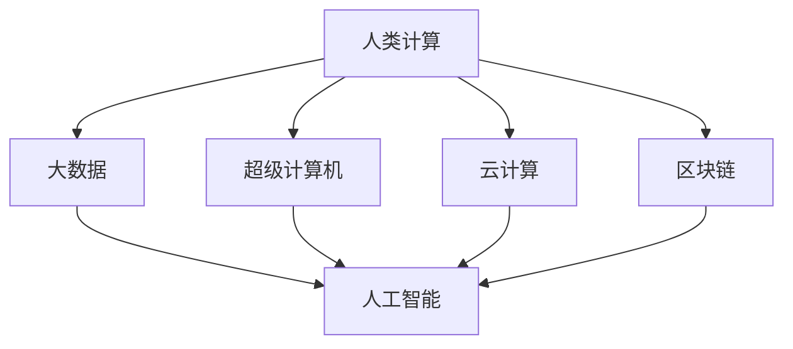

                 

# 推动社会进步的动力：人类计算的积极影响

## 1. 背景介绍

### 1.1 问题由来

随着科技的迅猛发展，人类计算能力正以不可思议的速度增长。从超级计算机到云计算，从大数据分析到人工智能，人类计算在各个领域发挥着越来越重要的作用。它不仅推动了科学研究的突破，也深刻影响了社会进步的步伐。本文旨在探讨人类计算对社会进步的积极影响，从多个角度深入分析这一过程。

### 1.2 问题核心关键点

人类计算对社会进步的积极影响主要体现在以下几个方面：

1. **科学研究的加速**：计算能力的提升大大加速了科学研究的步伐，使得研究人员能够处理和分析大量复杂数据，提出新的理论和算法。
2. **经济活动的优化**：人类计算在经济活动中的广泛应用，如物流优化、供应链管理、金融风险评估等，极大地提高了效率，降低了成本。
3. **社会治理的智能化**：计算技术在公共卫生、教育、公共安全等方面的应用，提升了社会治理的智能化水平，促进了社会公平与和谐。
4. **文化传承与创新**：计算技术在文化遗产保护、艺术创作、文学研究等领域的应用，丰富了文化内涵，促进了文化创新。

这些核心关键点展示了人类计算在推动社会进步中的多维度影响，我们将深入分析这些影响背后的机制和具体实现。

### 1.3 问题研究意义

探讨人类计算对社会进步的积极影响，有助于我们更好地理解计算技术在现代社会的角色，把握其发展方向，进一步推动科技与社会的深度融合。这不仅对科研工作者具有重要意义，也对政策制定者、企业家和社会公众提供了宝贵的视角和洞见。

## 2. 核心概念与联系

### 2.1 核心概念概述

为了更好地理解人类计算对社会进步的积极影响，本节将介绍几个关键概念：

- **人类计算**：指使用计算机等自动化工具，辅助或替代人类进行计算的过程。其核心在于利用算法和数据处理技术，提升计算效率和准确性。
- **大数据**：指规模庞大、复杂多样、实时动态的数据集合，通常涉及云计算、存储管理和数据分析等领域。
- **人工智能**：利用机器学习、深度学习等技术，使计算机具备类似于人类的学习和推理能力。
- **超级计算机**：指具备强大计算能力的计算机系统，能够处理大规模科学计算、模拟和数据分析任务。
- **云计算**：通过网络提供计算资源和服务，使用户能够按需获取计算能力，降低本地计算的成本和复杂性。
- **区块链**：一种分布式数据库技术，具有去中心化、透明性、不可篡改等特点，广泛应用于金融、供应链管理等领域。

这些概念之间通过计算能力、数据处理、算法优化等环节紧密联系，共同推动了人类计算的进步，进而对社会各个层面产生深远影响。

### 2.2 核心概念原理和架构的 Mermaid 流程图



这个流程图展示了人类计算在不同领域的应用路径：

1. 人类计算利用大数据提供的海量数据，驱动人工智能的发展。
2. 超级计算机和大数据技术为人工智能提供了计算和存储能力。
3. 云计算和大数据技术提供了弹性资源，使得人工智能模型能够按需部署和优化。
4. 区块链技术为数据安全和隐私保护提供了保障，增强了人工智能应用的可靠性。

## 3. 核心算法原理 & 具体操作步骤

### 3.1 算法原理概述

人类计算的核心算法原理可以概括为以下几个方面：

1. **并行计算**：通过多处理器并行计算，加速复杂计算任务的执行速度。
2. **分布式计算**：利用网络将计算任务分布在多个计算机上进行处理，提升计算效率。
3. **机器学习**：利用算法和数据，训练模型进行预测、分类和聚类等任务。
4. **深度学习**：利用多层次神经网络模型，学习复杂非线性关系，提升计算精度。
5. **优化算法**：如梯度下降、遗传算法等，用于优化模型参数，提升计算效率和准确性。

### 3.2 算法步骤详解

基于上述核心算法原理，人类计算的具体操作步骤可以概括为以下几个步骤：

1. **数据收集与预处理**：收集相关数据，并进行清洗、去噪、特征提取等预处理工作。
2. **模型选择与设计**：根据具体任务选择合适的算法模型，并进行参数调优和结构设计。
3. **计算资源分配**：选择合适的计算平台（如超级计算机、云计算等），分配计算资源。
4. **算法实现与训练**：使用编程语言（如Python、C++等）实现算法，并在计算平台上进行模型训练。
5. **结果验证与优化**：在测试集上验证模型效果，根据性能指标进行调整和优化。
6. **模型部署与应用**：将模型部署到生产环境，进行实际应用和维护。

### 3.3 算法优缺点

人类计算算法具有以下优点：

1. **高效性**：通过并行和分布式计算，能够显著提高计算效率，缩短任务执行时间。
2. **灵活性**：算法和模型可以根据具体任务进行调整和优化，适应不同的应用场景。
3. **可扩展性**：随着计算资源的增加，算法能够轻松扩展，支持更大规模的数据处理。

同时，这些算法也存在一些局限性：

1. **复杂性**：算法实现复杂，需要较强的数学和编程功底。
2. **数据依赖**：算法的性能高度依赖于数据的质量和数量，数据不足会影响结果。
3. **计算资源消耗**：一些高复杂度算法需要大量计算资源，成本较高。
4. **结果解释性不足**：部分算法（如深度学习）的决策过程不透明，难以解释和调试。

### 3.4 算法应用领域

人类计算算法广泛应用于多个领域，包括但不限于：

- **科学研究**：在物理学、生物学、天文学等领域，利用计算模拟和数据分析，推动科学发现。
- **工业生产**：在制造业、物流、能源等领域，利用计算优化生产流程、提高效率。
- **医疗健康**：在医学影像分析、药物研发、公共卫生等领域，利用计算提升诊疗效果和疾病防控。
- **金融服务**：在风险评估、投资分析、市场预测等领域，利用计算优化决策过程。
- **教育培训**：在个性化学习、智能辅导、虚拟实验等领域，利用计算提升教学效果。

## 4. 数学模型和公式 & 详细讲解 & 举例说明

### 4.1 数学模型构建

人类计算的数学模型构建通常包括以下几个步骤：

1. **问题建模**：将实际问题抽象为数学模型，定义输入变量和目标函数。
2. **算法选择**：根据问题特性选择合适的算法和模型。
3. **参数优化**：通过优化算法调整模型参数，提升模型性能。
4. **结果分析**：对模型结果进行分析，验证其有效性和可靠性。

### 4.2 公式推导过程

以线性回归模型为例，推导其在人类计算中的应用过程：

假设有一组样本数据 $(x_i, y_i)$，其中 $x_i$ 为自变量，$y_i$ 为因变量，目标是通过线性回归模型拟合数据，得到线性关系式 $y = \beta_0 + \beta_1x$。

最小二乘法的目标是最小化误差平方和 $SSE = \sum_{i=1}^n (y_i - \hat{y}_i)^2$，其中 $\hat{y}_i = \beta_0 + \beta_1x_i$。

通过求偏导数，可得参数估计值 $\beta_0 = \frac{\sum_{i=1}^n (x_i - \bar{x})(y_i - \bar{y})}{\sum_{i=1}^n (x_i - \bar{x})^2}$ 和 $\beta_1 = \frac{\sum_{i=1}^n (x_i - \bar{x})(y_i - \bar{y})}{\sum_{i=1}^n (x_i - \bar{x})^2}$。

通过计算，可以构建线性回归模型，并利用该模型对新样本进行预测。

### 4.3 案例分析与讲解

以深度学习在医疗图像分析中的应用为例，分析其数学模型构建和算法实现过程：

1. **问题建模**：将医疗图像中的肿瘤检测问题抽象为图像分类问题，定义输入为图像像素值，输出为肿瘤标签。
2. **算法选择**：选择卷积神经网络（CNN）作为图像分类算法，设计多层卷积、池化、激活等操作。
3. **参数优化**：使用随机梯度下降（SGD）等优化算法，调整网络参数，最小化损失函数。
4. **结果分析**：在测试集上验证模型效果，评估模型的准确率、召回率、F1分数等指标。

## 5. 项目实践：代码实例和详细解释说明

### 5.1 开发环境搭建

为了进行人类计算的项目实践，首先需要搭建开发环境。以下是使用Python进行TensorFlow开发的环境配置流程：

1. 安装Anaconda：从官网下载并安装Anaconda，用于创建独立的Python环境。
2. 创建并激活虚拟环境：
```bash
conda create -n tf-env python=3.8 
conda activate tf-env
```

3. 安装TensorFlow：根据CUDA版本，从官网获取对应的安装命令。例如：
```bash
conda install tensorflow -c tensorflow -c conda-forge
```

4. 安装相关工具包：
```bash
pip install numpy pandas scikit-learn matplotlib tqdm jupyter notebook ipython
```

完成上述步骤后，即可在`tf-env`环境中开始项目实践。

### 5.2 源代码详细实现

以下以医疗图像分析为例，给出使用TensorFlow进行深度学习的PyTorch代码实现。

首先，定义数据集处理函数：

```python
import tensorflow as tf
from tensorflow.keras.preprocessing.image import ImageDataGenerator

def load_and_preprocess_data(train_dir, test_dir, batch_size=32, img_height=256, img_width=256):
    train_datagen = ImageDataGenerator(rescale=1./255, shear_range=0.2, zoom_range=0.2, horizontal_flip=True)
    train_generator = train_datagen.flow_from_directory(train_dir, target_size=(img_height, img_width), batch_size=batch_size, class_mode='binary')
    
    test_datagen = ImageDataGenerator(rescale=1./255)
    test_generator = test_datagen.flow_from_directory(test_dir, target_size=(img_height, img_width), batch_size=batch_size, class_mode='binary')
    
    return train_generator, test_generator
```

然后，定义模型和训练函数：

```python
from tensorflow.keras.models import Sequential
from tensorflow.keras.layers import Conv2D, MaxPooling2D, Flatten, Dense, Dropout

def create_model(input_shape):
    model = Sequential([
        Conv2D(32, 3, activation='relu', input_shape=input_shape),
        MaxPooling2D(pool_size=(2, 2)),
        Conv2D(64, 3, activation='relu'),
        MaxPooling2D(pool_size=(2, 2)),
        Flatten(),
        Dense(128, activation='relu'),
        Dropout(0.5),
        Dense(1, activation='sigmoid')
    ])
    model.compile(optimizer='adam', loss='binary_crossentropy', metrics=['accuracy'])
    return model

def train_model(model, train_generator, test_generator, epochs=10, validation_steps=10):
    model.fit(train_generator, epochs=epochs, validation_data=test_generator, validation_steps=validation_steps)
```

接着，启动训练流程并评估模型：

```python
input_shape = (256, 256, 3)
train_dir = 'train/'
test_dir = 'test/'
model = create_model(input_shape)
train_generator, test_generator = load_and_preprocess_data(train_dir, test_dir)
train_model(model, train_generator, test_generator)
```

以上就是使用TensorFlow对医疗图像分析项目进行深度学习的完整代码实现。可以看到，TensorFlow提供了强大的高级API和工具，使得深度学习模型的构建和训练变得简洁高效。

### 5.3 代码解读与分析

让我们再详细解读一下关键代码的实现细节：

**load_and_preprocess_data函数**：
- 定义了数据加载和预处理的过程。使用`ImageDataGenerator`进行数据增强，包括缩放、旋转、翻转等操作，确保数据的多样性。

**create_model函数**：
- 定义了卷积神经网络的模型结构，包括卷积层、池化层、全连接层等。使用`Sequential`构建模型，便于逐层添加操作。

**train_model函数**：
- 使用`fit`方法对模型进行训练，设置训练轮数、验证集大小等参数。

**训练流程**：
- 定义输入数据的尺寸，加载数据集
- 创建和编译模型
- 调用数据加载函数，准备数据生成器
- 启动训练过程，并在测试集上评估模型

可以看到，TensorFlow提供了丰富且易用的工具和API，使得深度学习模型的开发和部署变得高效便捷。开发者可以将更多精力放在算法优化和应用实践上，而不必过多关注底层细节。

## 6. 实际应用场景

### 6.1 智能制造

智能制造是工业4.0的重要方向，利用人类计算技术，可以显著提升制造业的生产效率和质量。例如，通过传感器数据采集、实时数据分析和优化，实现生产线的动态调整和优化。

在具体应用中，可以利用大数据分析技术，实时监控生产线的运行状态，预测可能出现的故障，提前进行维护。通过优化生产计划，合理安排资源，减少浪费，提高生产效率。

### 6.2 智慧城市

智慧城市是未来城市治理的重要方向，人类计算技术在其中发挥了重要作用。例如，通过智能交通系统、环境监测系统、公共安全系统等，实现城市的智能化管理。

在智能交通系统中，可以利用大数据分析技术，优化交通流量，减少拥堵。通过实时监控，及时发现和处理交通事故，提高交通安全性。在环境监测系统中，利用传感器数据和机器学习算法，预测空气质量、水质等环境指标，及时采取措施改善环境质量。

### 6.3 智慧医疗

智慧医疗是医疗健康领域的重要趋势，利用人类计算技术，可以实现医疗数据的智能化分析和管理，提升诊疗效率和质量。

在医学影像分析中，利用深度学习技术，自动识别和分类肿瘤、病变等异常区域，辅助医生进行诊断。在药物研发中，利用计算机模拟和大数据分析，预测药物的药效和副作用，加速新药研发进程。在公共卫生领域，利用大数据分析技术，预测疾病流行趋势，提前采取防控措施。

## 7. 工具和资源推荐

### 7.1 学习资源推荐

为了帮助开发者系统掌握人类计算的理论基础和实践技巧，这里推荐一些优质的学习资源：

1. 《深度学习》系列博文：由大模型技术专家撰写，深入浅出地介绍了深度学习的原理、算法和应用。
2. CS229《机器学习》课程：斯坦福大学开设的机器学习明星课程，涵盖机器学习的基本概念和算法，适合初学者入门。
3. 《TensorFlow实战》书籍：TensorFlow官方团队编写的实战指南，详细介绍了TensorFlow的使用方法和最佳实践。
4. Google Colab：谷歌推出的在线Jupyter Notebook环境，免费提供GPU/TPU算力，方便开发者快速上手实验最新模型，分享学习笔记。
5. Kaggle竞赛平台：提供丰富的数据集和竞赛题目，帮助开发者实践数据处理、模型训练和结果验证。

通过对这些资源的学习实践，相信你一定能够快速掌握人类计算的精髓，并用于解决实际的计算问题。

### 7.2 开发工具推荐

高效的开发离不开优秀的工具支持。以下是几款用于人类计算开发的常用工具：

1. TensorFlow：由Google主导开发的开源深度学习框架，生产部署方便，适合大规模工程应用。
2. PyTorch：基于Python的开源深度学习框架，灵活动态的计算图，适合快速迭代研究。
3. Jupyter Notebook：支持多语言编程的交互式开发环境，方便进行实验和分享。
4. Weights & Biases：模型训练的实验跟踪工具，可以记录和可视化模型训练过程中的各项指标，方便对比和调优。
5. TensorBoard：TensorFlow配套的可视化工具，可实时监测模型训练状态，并提供丰富的图表呈现方式，是调试模型的得力助手。

合理利用这些工具，可以显著提升人类计算任务的开发效率，加快创新迭代的步伐。

### 7.3 相关论文推荐

人类计算的发展源于学界的持续研究。以下是几篇奠基性的相关论文，推荐阅读：

1. 《分布式计算的突破》：探讨了分布式计算的原理和应用，展示了其在高性能计算中的重要作用。
2. 《深度学习在自然语言处理中的应用》：展示了深度学习在语言处理任务中的广泛应用，推动了NLP技术的进步。
3. 《大数据在金融风险评估中的应用》：展示了大数据分析在金融风险评估中的应用，提升了金融决策的科学性和精确性。
4. 《区块链技术及其在金融领域的应用》：探讨了区块链技术的原理和应用，展示了其在金融领域的安全和透明优势。
5. 《智能制造的未来展望》：探讨了智能制造的未来发展方向，展示了人类计算在工业4.0中的重要作用。

这些论文代表了大数据和人工智能技术的发展脉络。通过学习这些前沿成果，可以帮助研究者把握学科前进方向，激发更多的创新灵感。

## 8. 总结：未来发展趋势与挑战

### 8.1 总结

本文对人类计算对社会进步的积极影响进行了全面系统的介绍。首先阐述了人类计算的发展背景和意义，明确了其对科学研究、经济活动、社会治理等方面的重要影响。其次，从原理到实践，详细讲解了人类计算的数学模型和具体实现步骤，给出了人类计算任务开发的完整代码实例。同时，本文还广泛探讨了人类计算技术在智能制造、智慧城市、智慧医疗等多个行业领域的应用前景，展示了人类计算技术的巨大潜力。最后，精选了人类计算技术的各类学习资源，力求为读者提供全方位的技术指引。

通过本文的系统梳理，可以看到，人类计算技术在推动社会进步中的多维度影响，这些影响不仅体现在科技领域，更深刻地影响了经济、社会、文化等多个层面。未来，随着计算技术的不断进步，人类计算必将在更多领域发挥更大的作用，成为推动社会进步的重要动力。

### 8.2 未来发展趋势

展望未来，人类计算技术的发展趋势如下：

1. **计算能力的持续提升**：随着算力成本的下降和计算架构的创新，计算能力将持续提升，支持更复杂、更大规模的计算任务。
2. **数据获取的广泛化**：随着传感器和物联网技术的发展，数据获取将更加便捷和多样化，数据驱动的计算将更加广泛应用。
3. **计算平台的多样化**：云计算、边缘计算、量子计算等多样化计算平台将提供更灵活、更高效的计算资源。
4. **算法和模型的创新**：新算法和新模型不断涌现，如深度强化学习、量子计算等，将进一步推动人类计算的发展。
5. **计算与大数据的融合**：计算与大数据的深度融合，将推动数据驱动的决策分析和智能应用的发展。
6. **计算与人工智能的结合**：计算与人工智能的结合，将推动更加智能、更加高效的人类计算系统。

这些趋势展示了人类计算技术未来发展的广阔前景，推动社会进步的潜力将进一步释放。

### 8.3 面临的挑战

尽管人类计算技术已经取得了显著成就，但在迈向更加智能化、普适化应用的过程中，仍面临诸多挑战：

1. **计算资源的需求**：随着计算任务的复杂性增加，对计算资源的需求也在增加，如何高效利用计算资源是一个重要挑战。
2. **数据质量和隐私保护**：数据质量和隐私保护问题是人类计算面临的主要挑战之一，如何在数据收集、处理和应用过程中保护用户隐私，确保数据质量，是必须解决的难题。
3. **计算系统的可扩展性**：计算系统如何在大规模数据和复杂计算任务下保持高效、可扩展，是未来计算技术发展的关键问题。
4. **计算系统的鲁棒性和可靠性**：如何提高计算系统的鲁棒性和可靠性，避免计算过程中的错误和故障，是提高计算系统可靠性的重要挑战。
5. **计算系统的安全性**：如何保障计算系统的安全性，避免数据泄露、系统攻击等问题，是计算系统安全性的重要保障。
6. **计算系统的可解释性**：计算系统的决策过程如何解释，如何保障其透明性和可解释性，是计算系统可靠性和可信性的重要保障。

这些挑战需要不断探索和解决，推动人类计算技术的持续发展和进步。

### 8.4 研究展望

面对人类计算技术面临的挑战，未来的研究需要在以下几个方面寻求新的突破：

1. **高效计算架构的创新**：开发更加高效、可扩展的计算架构，如量子计算、边缘计算等，推动计算能力的进一步提升。
2. **智能化数据处理技术**：开发更加智能、高效的数据处理技术，如自动数据清洗、数据增强等，提升数据质量和处理效率。
3. **智能算法和模型的开发**：开发更加智能、高效、可解释的算法和模型，如深度学习、深度强化学习等，提升计算系统的智能性和可靠性。
4. **跨学科合作**：推动计算技术与其他学科的深度融合，如人工智能、数学、物理等，推动多学科的协同创新。
5. **安全性和隐私保护技术**：开发更加安全、可靠的计算系统，如区块链技术、隐私计算等，保障计算系统的安全性。
6. **计算系统的可解释性**：开发更加透明、可解释的计算系统，如因果推理、可解释人工智能等，提升计算系统的可信性和可靠性。

这些研究方向将推动人类计算技术的持续进步，推动社会进步的不断前进。

## 9. 附录：常见问题与解答

**Q1：如何提升人类计算系统的计算能力？**

A: 提升人类计算系统的计算能力可以从以下几个方面入手：

1. **计算架构的创新**：如量子计算、边缘计算等，能够提供更高效的计算能力。
2. **数据分布式处理**：通过分布式计算，提高数据处理效率。
3. **算法优化**：如采用更加高效的算法，如深度学习、深度强化学习等，提高计算效率。
4. **硬件升级**：如增加计算资源、优化硬件配置等，提高计算性能。

**Q2：人类计算在数据隐私保护方面有哪些策略？**

A: 在数据隐私保护方面，人类计算可以采取以下策略：

1. **数据匿名化**：通过数据匿名化技术，减少数据的敏感信息。
2. **差分隐私**：采用差分隐私技术，在数据使用过程中保护用户隐私。
3. **区块链技术**：利用区块链的不可篡改性，保障数据安全。
4. **数据加密**：采用数据加密技术，保护数据在传输和存储过程中的安全。
5. **联邦学习**：采用联邦学习技术，在保护用户隐私的前提下进行模型训练。

**Q3：人类计算在计算系统的可扩展性方面有哪些挑战？**

A: 人类计算在计算系统的可扩展性方面面临以下挑战：

1. **计算资源的需求**：随着计算任务的复杂性增加，对计算资源的需求也在增加，如何高效利用计算资源是一个重要挑战。
2. **计算系统的设计**：如何设计高效的计算系统，使其在大规模数据和复杂计算任务下保持高效、可扩展，是未来计算技术发展的关键问题。
3. **计算系统的故障恢复**：如何提高计算系统的故障恢复能力，避免计算过程中的错误和故障，是提高计算系统可靠性的重要挑战。

**Q4：人类计算在计算系统的安全性方面有哪些策略？**

A: 在计算系统的安全性方面，人类计算可以采取以下策略：

1. **数据加密**：采用数据加密技术，保护数据在传输和存储过程中的安全。
2. **安全计算平台**：使用安全计算平台，如区块链、多方安全计算等，保障计算系统的安全性。
3. **安全算法和协议**：使用安全算法和协议，如加密算法、安全通信协议等，保障计算系统的安全性。
4. **安全监控和审计**：建立安全监控和审计机制，及时发现和处理安全威胁，保障计算系统的安全性。

**Q5：人类计算在计算系统的可解释性方面有哪些策略？**

A: 在计算系统的可解释性方面，人类计算可以采取以下策略：

1. **透明算法设计**：设计透明、可解释的算法，如因果推理、可解释人工智能等，提升计算系统的可信性和可靠性。
2. **可解释模型的开发**：开发可解释的模型，如决策树、规则模型等，提升计算系统的可解释性。
3. **解释性工具的开发**：开发解释性工具，如解释性模型、解释性数据可视化等，提升计算系统的可解释性。

---

作者：禅与计算机程序设计艺术 / Zen and the Art of Computer Programming

