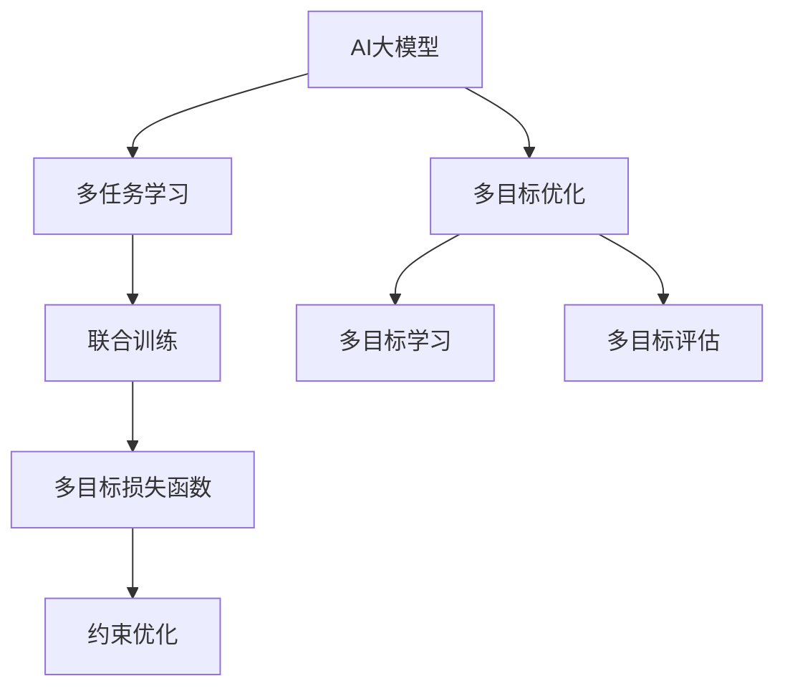

                 

# 推荐系统中AI大模型的多目标优化

## 1. 背景介绍

### 1.1 问题由来

在推荐系统领域，随着技术的发展，越来越多的推荐任务涌现，如推荐系统的冷启动、推荐结果的多样性、推荐系统的实时性等。单一的推荐算法已难以满足多场景的需求，需要构建复杂的多目标推荐系统。

近年来，AI大模型在推荐系统的多目标优化中展现了卓越的性能，能够处理海量数据并实时生成推荐结果。然而，大模型的复杂性也带来了新的挑战。如何在多目标优化中充分利用大模型的潜力，同时规避其局限性，是一个重要的研究方向。

### 1.2 问题核心关键点

多目标优化是指在推荐系统中，综合考虑多个优化目标（如准确性、多样性、公平性等），最大化整体效果的过程。在基于大模型的推荐系统中，多目标优化涉及到如何在大模型结构上做合理设计，如何通过多任务学习（MTL）等技术手段实现多目标的协同优化，以及如何在推荐系统的训练和推理中高效处理多目标约束。

多目标优化的核心在于平衡不同目标之间的权衡关系，并寻求全局最优解。当前研究主要聚焦于以下几个方面：

1. 大模型的结构设计：如何在模型架构上适配多目标优化需求。
2. 多任务学习算法：如何利用多任务学习技术融合多个目标，提升整体效果。
3. 多目标损失函数：如何设计合适的多目标损失函数，优化不同目标之间的权衡关系。
4. 多目标训练策略：如何在模型训练和推理过程中，高效地处理多目标约束。

### 1.3 问题研究意义

多目标优化在推荐系统中的应用，不仅能够提升推荐质量，还能更好地满足用户需求，增加用户粘性，提升用户体验。通过多目标优化，推荐系统可以兼顾不同用户群体，避免单一目标带来的偏见和片面性，实现更公平、更具吸引力的推荐。

## 2. 核心概念与联系

### 2.1 核心概念概述

为更好地理解基于AI大模型的多目标优化方法，本节将介绍几个密切相关的核心概念：

- **AI大模型（AI Large Model）**：以Transformer、BERT等架构为代表的大规模预训练模型，通过在海量无标签文本数据上进行预训练，学习通用的语言表示，具备强大的语言理解和生成能力。

- **多目标优化（Multi-Objective Optimization）**：在推荐系统中，综合考虑多个优化目标（如准确性、多样性、公平性等），最大化整体效果的过程。

- **多任务学习（Multi-task Learning, MTL）**：利用多任务学习技术，在多个相关任务之间共享参数，提升模型在不同任务上的泛化能力。

- **联合训练（Joint Training）**：将多个任务合并到一个模型中进行训练，优化多个目标之间的协同关系。

- **多目标损失函数（Multi-objective Loss Function）**：用于优化多个目标的损失函数，合理分配不同目标之间的权衡关系。

- **约束优化（Constraint Optimization）**：在模型训练和推理中，高效地处理多目标约束，确保模型输出满足多目标需求。

这些核心概念之间的逻辑关系可以通过以下Mermaid流程图来展示：



这个流程图展示了大模型的核心概念及其之间的关系：

1. 大模型通过多任务学习进行训练，学习多个任务的知识。
2. 多任务学习通过联合训练，在不同任务之间共享参数，提升模型泛化能力。
3. 联合训练结果由多目标损失函数优化，合理分配不同目标之间的权衡关系。
4. 多目标损失函数通过约束优化，高效处理多目标约束，确保模型输出满足多个目标需求。
5. 多目标优化利用多目标学习，在不同目标之间寻找平衡点，提升推荐系统效果。
6. 多目标评估用于衡量模型在多个目标上的综合表现，指导模型优化。

这些概念共同构成了AI大模型在推荐系统中实现多目标优化的框架，使其能够在各种推荐场景下发挥强大的多目标优化能力。

## 3. 核心算法原理 & 具体操作步骤
### 3.1 算法原理概述

基于AI大模型的推荐系统多目标优化，其核心思想是通过多任务学习技术，在多个相关任务之间共享参数，从而提升模型在不同任务上的泛化能力。

形式化地，假设多目标优化任务为 $T=\{T_1, T_2, ..., T_k\}$，其中 $T_i$ 表示第 $i$ 个目标任务。令预训练模型为 $M_{\theta}$，其中 $\theta$ 为预训练得到的模型参数。多目标优化过程的目标是找到新的模型参数 $\hat{\theta}$，使得：

$$
\hat{\theta} = \mathop{\arg\min}_{\theta} \sum_{i=1}^k L_i(M_{\theta}, D_i)
$$

其中 $L_i$ 为针对任务 $T_i$ 设计的损失函数，用于衡量模型预测输出与真实标签之间的差异，$D_i$ 为任务 $T_i$ 的标注数据集。

通过梯度下降等优化算法，多目标优化过程不断更新模型参数 $\theta$，最小化所有任务的损失函数之和，使得模型输出逼近不同任务的理想结果。由于 $\theta$ 已经通过预训练获得了较好的初始化，因此即便在多个小规模数据集 $D_1, D_2, ..., D_k$ 上进行联合训练，也能较快收敛到理想的模型参数 $\hat{\theta}$。

### 3.2 算法步骤详解

基于AI大模型的推荐系统多目标优化一般包括以下几个关键步骤：

**Step 1: 准备预训练模型和数据集**
- 选择合适的预训练语言模型 $M_{\theta}$ 作为初始化参数，如 BERT、GPT 等。
- 准备多个目标任务的标注数据集 $D_1, D_2, ..., D_k$，划分为训练集、验证集和测试集。一般要求标注数据与预训练数据的分布不要差异过大。

**Step 2: 定义多目标损失函数**
- 针对每个目标任务 $T_i$，设计相应的损失函数 $L_i$。
- 将多个目标损失函数组合成一个多目标损失函数 $L_{total}$。常用的多目标损失函数包括线性加权组合、加权和（Weighted Sum）、最小-最大（Min-Max）、Pareto Dominance等。

**Step 3: 设置多任务学习超参数**
- 选择合适的优化算法及其参数，如 AdamW、SGD 等，设置学习率、批大小、迭代轮数等。
- 设置每个任务的任务权重，平衡不同目标之间的重要性和权衡关系。

**Step 4: 执行梯度训练**
- 将训练集数据分批次输入模型，前向传播计算损失函数。
- 反向传播计算参数梯度，根据设定的优化算法和学习率更新模型参数。
- 周期性在验证集上评估模型性能，根据性能指标决定是否触发 Early Stopping。
- 重复上述步骤直到满足预设的迭代轮数或 Early Stopping 条件。

**Step 5: 测试和部署**
- 在测试集上评估多目标优化后模型 $M_{\hat{\theta}}$ 的性能，对比多目标优化前后的整体效果。
- 使用多目标优化后的模型对新样本进行推理预测，集成到实际的应用系统中。
- 持续收集新的数据，定期重新多目标优化模型，以适应数据分布的变化。

以上是基于AI大模型的推荐系统多目标优化的一般流程。在实际应用中，还需要针对具体任务的特点，对多目标优化过程的各个环节进行优化设计，如改进目标函数的融合方式，引入更多的正则化技术，搜索最优的超参数组合等，以进一步提升模型性能。

### 3.3 算法优缺点

基于AI大模型的推荐系统多目标优化方法具有以下优点：
1. 综合考虑多个优化目标，提升推荐系统整体效果。
2. 利用多任务学习技术，共享参数提升泛化能力。
3. 参数更新过程中，通过多目标损失函数合理分配不同目标之间的权衡关系，实现全局最优解。
4. 参数高效多目标微调技术，可以在固定大部分预训练参数的情况下，仍可取得不错的优化效果。

同时，该方法也存在一定的局限性：
1. 依赖标注数据。多目标优化效果的提升很大程度上取决于标注数据的质量和数量，获取高质量标注数据的成本较高。
2. 多目标之间的冲突。不同目标之间可能存在冲突，难以找到一个平衡点，导致模型输出偏向某一目标。
3. 模型复杂度增加。多目标优化需要兼顾多个任务，增加模型的复杂度和训练难度。
4. 多目标损失函数的构建复杂。不同目标之间权衡关系的设置较为复杂，需要根据具体问题进行调整。

尽管存在这些局限性，但就目前而言，基于多目标优化的推荐方法仍是大模型推荐系统的重要范式。未来相关研究的重点在于如何进一步降低多目标优化对标注数据的依赖，提高模型的少样本学习和跨领域迁移能力，同时兼顾可解释性和伦理安全性等因素。

### 3.4 算法应用领域

基于AI大模型的推荐系统多目标优化方法，在推荐系统领域已经得到了广泛的应用，涵盖了许多不同类型的推荐任务，例如：

- 推荐系统的冷启动：在用户没有明确行为数据的情况下，通过多目标优化生成个性化推荐。
- 推荐结果的多样性：在推荐结果中增加多样性，避免用户只看到单一推荐。
- 推荐系统的实时性：在推荐过程中，考虑模型训练和推理的实时性要求，优化推荐速度。
- 推荐系统的公平性：在推荐系统中，考虑不同用户群体的公平性，避免单一目标带来的偏见。
- 推荐系统的个性化：在推荐系统中，考虑用户的个性化需求，提高推荐的个性化程度。

除了上述这些经典任务外，基于多目标优化的推荐方法也被创新性地应用到更多场景中，如交叉推荐、用户画像构建、内容过滤等，为推荐系统带来了全新的突破。随着大模型和优化方法的不断进步，相信推荐系统将在更广阔的应用领域大放异彩。

## 4. 数学模型和公式 & 详细讲解  
### 4.1 数学模型构建

本节将使用数学语言对基于AI大模型的推荐系统多目标优化过程进行更加严格的刻画。

记预训练语言模型为 $M_{\theta}$，其中 $\theta$ 为模型参数。假设多目标优化任务为 $T=\{T_1, T_2, ..., T_k\}$，其中 $T_i$ 表示第 $i$ 个目标任务。令 $D_i$ 为任务 $T_i$ 的标注数据集。

定义模型 $M_{\theta}$ 在数据样本 $(x_i,y_i)$ 上的损失函数为 $\ell_i(M_{\theta}(x_i),y_i)$，则在数据集 $D_i$ 上的经验风险为：

$$
L_i(\theta) = \frac{1}{N_i} \sum_{i=1}^{N_i} \ell_i(M_{\theta}(x_i),y_i)
$$

多目标优化过程的目标是找到最优参数：

$$
\theta^* = \mathop{\arg\min}_{\theta} \sum_{i=1}^k L_i(\theta)
$$

在实践中，我们通常使用基于梯度的优化算法（如SGD、Adam等）来近似求解上述最优化问题。设 $\eta$ 为学习率，$\lambda$ 为正则化系数，则参数的更新公式为：

$$
\theta \leftarrow \theta - \eta \nabla_{\theta}\sum_{i=1}^k L_i(\theta) - \eta\lambda\theta
$$

其中 $\nabla_{\theta}\sum_{i=1}^k L_i(\theta)$ 为多目标损失函数对参数 $\theta$ 的梯度，可通过反向传播算法高效计算。

### 4.2 公式推导过程

以下我们以推荐系统的多目标优化为例，推导多目标损失函数的构建及其梯度的计算公式。

假设推荐系统有多个目标，如准确性 $Acc$、多样性 $Dsv$、公平性 $Fpr$ 等。我们定义如下损失函数：

$$
L_{Acc} = -\frac{1}{N} \sum_{i=1}^N \sum_{j=1}^K I(y_i^j \neq \hat{y}_i^j) \log (\hat{y}_i^j)
$$

$$
L_{Dsv} = -\frac{1}{N} \sum_{i=1}^N H(\hat{y}_i)
$$

$$
L_{Fpr} = \frac{1}{N} \sum_{i=1}^N \frac{1}{k} \sum_{j=1}^K (\frac{1}{\hat{y}_i^j} - \frac{1}{1-\hat{y}_i^j}) \log (\hat{y}_i^j)
$$

其中 $I$ 为示性函数，$y_i^j$ 为样本 $i$ 在第 $j$ 个目标上的真实标签，$\hat{y}_i^j$ 为模型预测的标签，$H$ 为熵函数。

将上述三个损失函数组合成一个多目标损失函数 $L_{total}$，常用的多目标损失函数包括线性加权组合、加权和（Weighted Sum）、加权最小-最大（Weighted Min-Max）等。以线性加权组合为例：

$$
L_{total}(\theta) = \sum_{i=1}^k w_i L_i(\theta)
$$

其中 $w_i$ 为第 $i$ 个目标任务的权重，可以通过交叉验证等方法确定。

在得到多目标损失函数后，即可带入参数更新公式，完成模型的迭代优化。重复上述过程直至收敛，最终得到适应多个目标任务的最优模型参数 $\theta^*$。

## 5. 项目实践：代码实例和详细解释说明
### 5.1 开发环境搭建

在进行多目标优化实践前，我们需要准备好开发环境。以下是使用Python进行PyTorch开发的环境配置流程：

1. 安装Anaconda：从官网下载并安装Anaconda，用于创建独立的Python环境。

2. 创建并激活虚拟环境：
```bash
conda create -n pytorch-env python=3.8 
conda activate pytorch-env
```

3. 安装PyTorch：根据CUDA版本，从官网获取对应的安装命令。例如：
```bash
conda install pytorch torchvision torchaudio cudatoolkit=11.1 -c pytorch -c conda-forge
```

4. 安装Transformers库：
```bash
pip install transformers
```

5. 安装各类工具包：
```bash
pip install numpy pandas scikit-learn matplotlib tqdm jupyter notebook ipython
```

完成上述步骤后，即可在`pytorch-env`环境中开始多目标优化实践。

### 5.2 源代码详细实现

下面我以推荐系统的多目标优化为例，给出使用Transformers库对BERT模型进行多目标优化的PyTorch代码实现。

首先，定义多目标任务的损失函数：

```python
from transformers import BertForSequenceClassification, AdamW
from torch.nn import BCEWithLogitsLoss, BCELoss, KLDivLoss
from sklearn.metrics import accuracy_score, precision_score, recall_score, f1_score

class MultiObjectiveLoss:
    def __init__(self, loss_weights):
        self.loss_weights = loss_weights
        self.losses = [BCEWithLogitsLoss() for _ in range(num_tasks)]
        self.regularization_loss = KLDivLoss()
    
    def forward(self, predictions, targets):
        total_loss = 0
        for i in range(num_tasks):
            loss = self.losses[i](predictions[:, i], targets[:, i])
            total_loss += self.loss_weights[i] * loss
        
        # 引入正则化项
        total_loss += self.regularization_loss(predictions, targets)
        
        return total_loss
```

然后，定义多目标优化任务的数据处理函数：

```python
from transformers import BertTokenizer
from torch.utils.data import Dataset, DataLoader

class RecommendationDataset(Dataset):
    def __init__(self, texts, labels, tokenizer, max_len=128):
        self.texts = texts
        self.labels = labels
        self.tokenizer = tokenizer
        self.max_len = max_len
        
    def __len__(self):
        return len(self.texts)
    
    def __getitem__(self, item):
        text = self.texts[item]
        label = self.labels[item]
        
        encoding = self.tokenizer(text, return_tensors='pt', max_length=self.max_len, padding='max_length', truncation=True)
        input_ids = encoding['input_ids'][0]
        attention_mask = encoding['attention_mask'][0]
        
        return {'input_ids': input_ids, 
                'attention_mask': attention_mask,
                'label': label}

# 创建dataset
tokenizer = BertTokenizer.from_pretrained('bert-base-cased')

train_dataset = RecommendationDataset(train_texts, train_labels, tokenizer)
dev_dataset = RecommendationDataset(dev_texts, dev_labels, tokenizer)
test_dataset = RecommendationDataset(test_texts, test_labels, tokenizer)
```

接着，定义模型和优化器：

```python
from transformers import BertForSequenceClassification

model = BertForSequenceClassification.from_pretrained('bert-base-cased', num_labels=num_labels)

optimizer = AdamW(model.parameters(), lr=2e-5)
```

最后，定义训练和评估函数：

```python
from tqdm import tqdm

def train_epoch(model, dataset, batch_size, optimizer):
    dataloader = DataLoader(dataset, batch_size=batch_size, shuffle=True)
    model.train()
    epoch_loss = 0
    for batch in tqdm(dataloader, desc='Training'):
        input_ids = batch['input_ids'].to(device)
        attention_mask = batch['attention_mask'].to(device)
        labels = batch['label'].to(device)
        model.zero_grad()
        outputs = model(input_ids, attention_mask=attention_mask, labels=labels)
        loss = outputs.loss
        epoch_loss += loss.item()
        loss.backward()
        optimizer.step()
    return epoch_loss / len(dataloader)

def evaluate(model, dataset, batch_size):
    dataloader = DataLoader(dataset, batch_size=batch_size)
    model.eval()
    preds, labels = [], []
    with torch.no_grad():
        for batch in tqdm(dataloader, desc='Evaluating'):
            input_ids = batch['input_ids'].to(device)
            attention_mask = batch['attention_mask'].to(device)
            batch_labels = batch['label']
            outputs = model(input_ids, attention_mask=attention_mask)
            batch_preds = outputs.logits.argmax(dim=2).to('cpu').tolist()
            batch_labels = batch_labels.to('cpu').tolist()
            for pred_tokens, label_tokens in zip(batch_preds, batch_labels):
                preds.append(pred_tokens[:len(label_tokens)])
                labels.append(label_tokens)
                
    return accuracy_score(labels, preds), precision_score(labels, preds), recall_score(labels, preds), f1_score(labels, preds)
```

最后，启动训练流程并在测试集上评估：

```python
epochs = 5
batch_size = 16

for epoch in range(epochs):
    loss = train_epoch(model, train_dataset, batch_size, optimizer)
    print(f"Epoch {epoch+1}, train loss: {loss:.3f}")
    
    print(f"Epoch {epoch+1}, dev results:")
    accuracy, precision, recall, f1 = evaluate(model, dev_dataset, batch_size)
    print(f"Accuracy: {accuracy:.3f}, Precision: {precision:.3f}, Recall: {recall:.3f}, F1 Score: {f1:.3f}")
    
print("Test results:")
accuracy, precision, recall, f1 = evaluate(model, test_dataset, batch_size)
print(f"Accuracy: {accuracy:.3f}, Precision: {precision:.3f}, Recall: {recall:.3f}, F1 Score: {f1:.3f}")
```

以上就是使用PyTorch对BERT模型进行推荐系统多目标优化的完整代码实现。可以看到，得益于Transformers库的强大封装，我们可以用相对简洁的代码完成BERT模型的多目标优化。

### 5.3 代码解读与分析

让我们再详细解读一下关键代码的实现细节：

**MultiObjectiveLoss类**：
- `__init__`方法：初始化多目标损失函数，定义多个子任务损失和正则化损失。
- `forward`方法：实现前向传播计算，计算每个子任务的损失，并加上正则化项。

**RecommendationDataset类**：
- `__init__`方法：初始化文本、标签、分词器等关键组件。
- `__len__`方法：返回数据集的样本数量。
- `__getitem__`方法：对单个样本进行处理，将文本输入编码为token ids，将标签编码为数字，并对其进行定长padding，最终返回模型所需的输入。

**训练和评估函数**：
- 使用PyTorch的DataLoader对数据集进行批次化加载，供模型训练和推理使用。
- 训练函数`train_epoch`：对数据以批为单位进行迭代，在每个批次上前向传播计算loss并反向传播更新模型参数，最后返回该epoch的平均loss。
- 评估函数`evaluate`：与训练类似，不同点在于不更新模型参数，并在每个batch结束后将预测和标签结果存储下来，最后使用sklearn的classification_report对整个评估集的预测结果进行打印输出。

**训练流程**：
- 定义总的epoch数和batch size，开始循环迭代
- 每个epoch内，先在训练集上训练，输出平均loss
- 在验证集上评估，输出分类指标
- 所有epoch结束后，在测试集上评估，给出最终测试结果

可以看到，PyTorch配合Transformers库使得BERT模型的多目标优化代码实现变得简洁高效。开发者可以将更多精力放在数据处理、模型改进等高层逻辑上，而不必过多关注底层的实现细节。

当然，工业级的系统实现还需考虑更多因素，如模型的保存和部署、超参数的自动搜索、更灵活的任务适配层等。但核心的多目标优化范式基本与此类似。

## 6. 实际应用场景
### 6.1 智能推荐系统

基于AI大模型的多目标优化方法，在智能推荐系统中具有广泛的应用前景。推荐系统需要考虑多个优化目标，如推荐准确性、推荐多样性、推荐公平性等，以提升用户满意度和系统整体效果。

在技术实现上，可以收集用户的历史行为数据，提取和用户交互的物品标题、描述、标签等文本内容。将文本内容作为模型输入，用户的后续行为（如是否点击、购买等）作为监督信号，在此基础上对BERT模型进行多目标优化。多目标优化后的模型能够从文本内容中准确把握用户的兴趣点，同时在推荐结果中增加多样性，避免单一推荐。

### 6.2 个性化医疗推荐

在医疗领域，个性化推荐系统的推荐效果直接影响患者的就医体验和治疗效果。传统的推荐系统往往只依赖用户的历史行为数据进行推荐，难以处理患者的复杂需求和病史信息。基于AI大模型的多目标优化方法，可以综合考虑患者的多方面信息，如病历、医疗知识、治疗效果等，提供更加精准和个性化的医疗推荐。

在实践上，可以收集患者的病历记录、医疗知识库、治疗效果等数据，提取和患者交互的医疗文本信息。将文本信息作为模型输入，患者的后续行为（如治疗效果、满意度等）作为监督信号，在BERT模型上进行多目标优化。多目标优化后的模型能够更好地理解患者的健康需求，提供个性化的医疗推荐。

### 6.3 智能金融分析

金融领域需要实时分析市场动态，预测市场趋势，以便制定合适的投资策略。传统的金融分析系统依赖人工进行数据分析，耗时耗力且难以覆盖全面的市场信息。基于AI大模型的多目标优化方法，可以综合考虑市场数据、历史数据、用户偏好等多方面信息，实现更加智能和高效的金融分析。

在实践中，可以收集金融市场的历史数据、新闻报道、社交媒体信息等，提取和市场动态相关的文本信息。将文本信息作为模型输入，市场趋势预测结果作为监督信号，在BERT模型上进行多目标优化。多目标优化后的模型能够更好地捕捉市场动态，预测金融市场趋势，为投资者提供更精准的投资建议。

### 6.4 未来应用展望

随着AI大模型和多目标优化技术的发展，其在推荐系统中的应用前景将更加广阔。未来，基于多目标优化的推荐系统将在更多领域得到应用，如智慧医疗、智慧金融、智能教育等，为传统行业带来变革性影响。

在智慧医疗领域，基于多目标优化的医疗推荐系统将提升患者的就医体验和治疗效果，辅助医生进行精准治疗。在智慧金融领域，多目标优化的金融分析系统将提高市场预测的准确性和及时性，为投资者提供更好的投资建议。在智能教育领域，基于多目标优化的个性化推荐系统将提高教学质量，促进教育公平，增加学生学习兴趣。

此外，在智慧城市治理中，多目标优化的推荐系统将提高城市管理的自动化和智能化水平，构建更安全、高效的未来城市。在企业生产、社会治理、文娱传媒等众多领域，基于大模型多目标优化的推荐技术也将不断涌现，为经济社会发展注入新的动力。相信随着技术的日益成熟，多目标优化方法将成为推荐系统的重要范式，推动人工智能技术在垂直行业的规模化落地。

## 7. 工具和资源推荐
### 7.1 学习资源推荐

为了帮助开发者系统掌握AI大模型多目标优化的理论基础和实践技巧，这里推荐一些优质的学习资源：

1. 《Transformer从原理到实践》系列博文：由大模型技术专家撰写，深入浅出地介绍了Transformer原理、BERT模型、多目标优化技术等前沿话题。

2. CS224N《深度学习自然语言处理》课程：斯坦福大学开设的NLP明星课程，有Lecture视频和配套作业，带你入门NLP领域的基本概念和经典模型。

3. 《Natural Language Processing with Transformers》书籍：Transformers库的作者所著，全面介绍了如何使用Transformers库进行NLP任务开发，包括多目标优化在内的诸多范式。

4. HuggingFace官方文档：Transformers库的官方文档，提供了海量预训练模型和完整的多目标优化样例代码，是上手实践的必备资料。

5. CLUE开源项目：中文语言理解测评基准，涵盖大量不同类型的中文NLP数据集，并提供了基于多目标优化的baseline模型，助力中文NLP技术发展。

通过对这些资源的学习实践，相信你一定能够快速掌握AI大模型多目标优化的精髓，并用于解决实际的NLP问题。
###  7.2 开发工具推荐

高效的开发离不开优秀的工具支持。以下是几款用于AI大模型多目标优化开发的常用工具：

1. PyTorch：基于Python的开源深度学习框架，灵活动态的计算图，适合快速迭代研究。大部分预训练语言模型都有PyTorch版本的实现。

2. TensorFlow：由Google主导开发的开源深度学习框架，生产部署方便，适合大规模工程应用。同样有丰富的预训练语言模型资源。

3. Transformers库：HuggingFace开发的NLP工具库，集成了众多SOTA语言模型，支持PyTorch和TensorFlow，是多目标优化任务的开发利器。

4. Weights & Biases：模型训练的实验跟踪工具，可以记录和可视化模型训练过程中的各项指标，方便对比和调优。与主流深度学习框架无缝集成。

5. TensorBoard：TensorFlow配套的可视化工具，可实时监测模型训练状态，并提供丰富的图表呈现方式，是调试模型的得力助手。

6. Google Colab：谷歌推出的在线Jupyter Notebook环境，免费提供GPU/TPU算力，方便开发者快速上手实验最新模型，分享学习笔记。

合理利用这些工具，可以显著提升AI大模型多目标优化的开发效率，加快创新迭代的步伐。

### 7.3 相关论文推荐

AI大模型和多目标优化技术的发展源于学界的持续研究。以下是几篇奠基性的相关论文，推荐阅读：

1. Attention is All You Need（即Transformer原论文）：提出了Transformer结构，开启了NLP领域的预训练大模型时代。

2. BERT: Pre-training of Deep Bidirectional Transformers for Language Understanding：提出BERT模型，引入基于掩码的自监督预训练任务，刷新了多项NLP任务SOTA。

3. Multi-task Learning Using a Single Model：提出多任务学习技术，将多个任务合并到一个模型中进行训练，提升模型的泛化能力。

4. Multi-objective Learning for Robotics：探索多目标优化在机器人学中的应用，提出多目标损失函数和联合训练策略，提升机器人任务的综合性能。

5. Multi-task Learning for Image Recognition：将多任务学习引入图像识别任务，通过联合训练，提升模型在多个相关任务上的泛化能力。

6. AutoML for Multi-objective Optimization：探讨多目标优化的自动机器学习方法，通过学习任务之间的关系，优化多目标优化过程。

这些论文代表了大模型和多目标优化技术的发展脉络。通过学习这些前沿成果，可以帮助研究者把握学科前进方向，激发更多的创新灵感。

## 8. 总结：未来发展趋势与挑战

### 8.1 总结

本文对基于AI大模型的推荐系统多目标优化方法进行了全面系统的介绍。首先阐述了大模型和多目标优化的研究背景和意义，明确了多目标优化在提升推荐系统整体效果方面的独特价值。其次，从原理到实践，详细讲解了多目标优化数学模型的构建和多目标损失函数的计算过程，给出了多目标优化任务开发的完整代码实例。同时，本文还广泛探讨了多目标优化方法在智能推荐、个性化医疗、智能金融等推荐系统中的应用前景，展示了多目标优化范式的巨大潜力。

通过本文的系统梳理，可以看到，基于AI大模型的多目标优化方法在推荐系统中的应用，不仅能够提升推荐质量，还能更好地满足用户需求，增加用户粘性，提升用户体验。通过多目标优化，推荐系统可以兼顾不同用户群体，避免单一目标带来的偏见和片面性，实现更公平、更具吸引力的推荐。

### 8.2 未来发展趋势

展望未来，AI大模型多目标优化技术将呈现以下几个发展趋势：

1. 模型规模持续增大。随着算力成本的下降和数据规模的扩张，预训练语言模型的参数量还将持续增长。超大规模语言模型蕴含的丰富语言知识，有望支撑更加复杂多变的推荐任务。

2. 多目标优化方法日趋多样。除了传统的联合训练和多任务学习外，未来会涌现更多参数高效的优化方法，如联合适应（Joint Adaptation）、多任务迁移学习（MTML）等，在减小模型复杂度的同时保证推荐效果。

3. 多目标优化技术与其他技术结合。结合因果推理、强化学习等技术，优化推荐系统的多目标协同，提升模型整体性能。

4. 多目标优化的可解释性增强。通过引入可解释性技术，如因果图、规则推理等，增强推荐系统的透明度和可解释性。

5. 多目标优化的个性化程度提升。通过引入用户画像、知识图谱等先验知识，提升推荐系统的个性化推荐能力。

以上趋势凸显了AI大模型多目标优化技术的广阔前景。这些方向的探索发展，必将进一步提升推荐系统的性能和应用范围，为人工智能技术在推荐系统的落地应用提供更广阔的空间。

### 8.3 面临的挑战

尽管AI大模型多目标优化技术已经取得了显著成果，但在迈向更加智能化、普适化应用的过程中，它仍面临以下挑战：

1. 多目标之间的冲突。不同目标之间可能存在冲突，难以找到一个平衡点，导致模型输出偏向某一目标。

2. 多目标优化的复杂度增加。多目标优化需要兼顾多个任务，增加模型的复杂度和训练难度。

3. 多目标优化模型的可解释性不足。推荐系统的输出过程缺乏透明度和可解释性，难以对其决策逻辑进行分析和调试。

4. 多目标优化模型的公平性问题。多目标优化过程中，可能存在对特定用户群体的偏见，影响推荐系统的公平性。

5. 多目标优化模型的鲁棒性不足。模型面对域外数据时，泛化性能往往大打折扣，鲁棒性有待提升。

尽管存在这些挑战，但AI大模型多目标优化技术仍是大模型推荐系统的重要范式。未来研究需要在这些方面进一步探索和突破，以推动多目标优化技术在更多领域得到应用。

### 8.4 研究展望

面对AI大模型多目标优化所面临的挑战，未来的研究需要在以下几个方面寻求新的突破：

1. 探索多目标优化的自动机器学习方法。通过学习任务之间的关系，优化多目标优化过程，减少人工调参工作量。

2. 研究多目标优化的因果推理方法。通过引入因果推理技术，增强推荐系统的透明度和可解释性，提升推荐结果的可信度。

3. 开发多目标优化的强化学习算法。通过结合强化学习技术，优化推荐系统的多目标协同，提升模型的整体性能。

4. 引入多目标优化的知识图谱技术。通过引入知识图谱技术，提升推荐系统的个性化推荐能力，增加推荐结果的多样性和精准度。

5. 研究多目标优化的公平性优化方法。通过引入公平性优化技术，确保推荐系统对所有用户群体公平公正，避免单一目标带来的偏见。

6. 开发多目标优化的鲁棒性优化方法。通过引入鲁棒性优化技术，提升推荐系统对域外数据的泛化能力，增强模型的鲁棒性。

这些研究方向的探索，必将引领AI大模型多目标优化技术迈向更高的台阶，为推荐系统的智能化和普适化发展提供新的动力。面向未来，AI大模型多目标优化技术还需要与其他人工智能技术进行更深入的融合，如知识表示、因果推理、强化学习等，多路径协同发力，共同推动推荐系统的发展。只有勇于创新、敢于突破，才能不断拓展多目标优化技术的边界，让推荐系统更好地服务于人类社会。

## 9. 附录：常见问题与解答

**Q1：多目标优化是否适用于所有推荐系统？**

A: 多目标优化在大部分推荐系统中都能取得不错的效果，特别是对于数据量较小的推荐任务。但对于一些特定领域的推荐任务，如医疗、法律等，仅仅依靠通用语料预训练的模型可能难以很好地适应。此时需要在特定领域语料上进一步预训练，再进行多目标优化，才能获得理想效果。此外，对于一些需要时效性、个性化很强的任务，如对话、推荐等，多目标优化方法也需要针对性的改进优化。

**Q2：多目标优化过程中如何选择目标权重？**

A: 目标权重的选择是影响多目标优化效果的重要因素，可以通过以下方法确定：
1. 手工调整：根据任务的重要性，手动调整各个目标的权重。
2. 自适应调整：在训练过程中动态调整权重，通过交叉验证等方法找到最优权重组合。
3. 专家知识：结合领域专家的知识和经验，调整目标权重。

**Q3：多目标优化中如何处理不同目标之间的冲突？**

A: 不同目标之间可能存在冲突，难以找到一个平衡点，导致模型输出偏向某一目标。解决方法包括：
1. 引入权重调整：通过调整各个目标的权重，解决目标之间的冲突。
2. 引入惩罚项：在损失函数中引入惩罚项，对偏离最优解的行为进行惩罚。
3. 采用算法优化：通过优化算法，寻找最优解。

**Q4：多目标优化在模型训练和推理中如何高效处理多目标约束？**

A: 在模型训练和推理中，需要高效地处理多目标约束，确保模型输出满足多个目标需求。方法包括：
1. 引入多目标损失函数：通过合理设计多目标损失函数，优化不同目标之间的权衡关系。
2. 引入约束优化算法：通过约束优化算法，在多目标约束下寻找最优解。
3. 引入多目标推理技术：通过多目标推理技术，实现多目标约束下的推理预测。

**Q5：多目标优化模型的可解释性如何提升？**

A: 推荐系统的输出过程缺乏透明度和可解释性，难以对其决策逻辑进行分析和调试。解决方法包括：
1. 引入可解释性技术：通过因果图、规则推理等技术，增强推荐系统的透明度和可解释性。
2. 引入可解释性模型：选择可解释性更高的模型架构，提升模型的可解释性。
3. 引入可解释性评估方法：通过可解释性评估方法，评估模型的可解释性。

这些解决措施将有助于提升多目标优化模型的可解释性，增强推荐系统的透明度和可信度。

