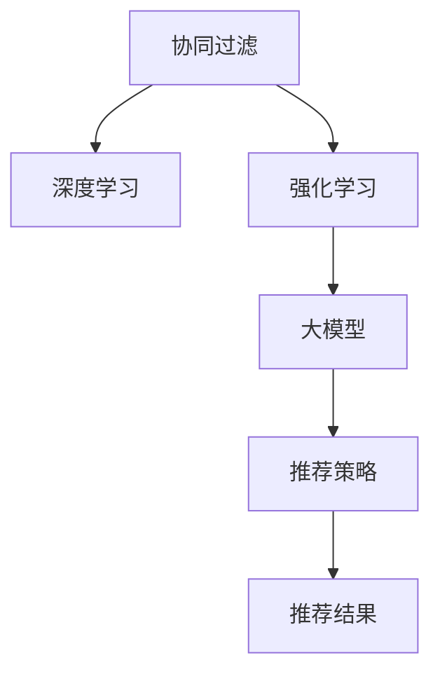

                 

# 推荐系统中的大模型对比强化学习应用

> 关键词：推荐系统, 强化学习, 大模型, 协同过滤, 深度学习, 混合方法, 在线推荐

## 1. 背景介绍

### 1.1 问题由来
推荐系统是现代互联网应用的核心之一，通过理解用户的兴趣和行为，为用户推荐可能感兴趣的内容，极大地提升了用户体验和平台黏性。当前，推荐系统主要采用基于协同过滤和深度学习的两种方法，各自有其优势与局限。协同过滤方法能够捕捉用户和物品之间的隐含关系，但面临“冷启动”问题；深度学习方法能够捕捉数据中的隐含特征，但需要大量的标注数据。

为了克服上述方法的不足，近年来，一些研究者开始尝试将大模型引入推荐系统中，并探索其与强化学习的结合。大模型通过在大规模数据上预训练，学习到丰富的隐含知识和表示能力。与深度学习模型相比，大模型在冷启动问题上表现更加优秀，能够更高效地处理稀疏数据。与协同过滤方法相比，大模型能够更好地捕捉用户和物品的复杂特征，提升推荐效果。

### 1.2 问题核心关键点
本文聚焦于大模型在推荐系统中的应用，并结合强化学习方法，探索如何通过大规模预训练模型和用户行为数据，不断优化推荐策略，提升推荐效果。重点包括以下几个方面：
- 大模型的结构与特性。
- 强化学习的原理与方法。
- 大模型在推荐系统中的应用实践。
- 大模型与强化学习的结合策略。

## 2. 核心概念与联系

### 2.1 核心概念概述

为更好地理解大模型在推荐系统中的应用，本文首先介绍几个关键概念：

- **大模型**：以Transformer等架构为基础，通过在大规模数据上预训练得到的模型，能够学习到丰富的语言和图像表示能力。
- **协同过滤**：通过用户对物品的评分数据，捕捉用户和物品之间的隐含关系，进行推荐。
- **深度学习**：通过多层神经网络，学习数据的隐含特征，用于推荐。
- **强化学习**：通过与环境的交互，根据奖惩反馈，不断优化决策策略，用于推荐。

这些概念之间的联系可以通过以下Mermaid流程图来展示：



这个流程图展示了大模型在推荐系统中的应用过程：

1. 协同过滤方法基于用户-物品评分数据，捕捉隐含关系。
2. 深度学习方法通过神经网络学习数据隐含特征，提升推荐效果。
3. 强化学习通过与环境的交互，不断优化决策策略，适应用户动态变化的需求。
4. 大模型作为协同过滤和深度学习的补充，学习更丰富的特征表示，进一步提升推荐效果。

## 3. 核心算法原理 & 具体操作步骤

### 3.1 算法原理概述

基于大模型的推荐系统，主要利用预训练模型的表示能力，结合用户行为数据，通过强化学习不断优化推荐策略。其核心思想是：将推荐系统视为一个动态的决策系统，模型根据用户的即时行为，不断调整推荐策略，以最大化预期的奖励（如点击率、转化率等）。

形式化地，假设用户-物品评分数据为 $D=\{(x_i,y_i)\}_{i=1}^N, x_i \in X, y_i \in Y$，其中 $x_i$ 为用户行为，$y_i$ 为评分。模型的目标是通过强化学习算法，不断调整推荐策略，使得未来预测的评分最大化。具体来说，可以定义一个奖励函数 $R:X \times Y \rightarrow \mathbb{R}$，表示推荐的点击率、转化率等指标，然后通过强化学习算法，不断调整推荐策略，最小化损失函数 $J(\theta)$，从而使得模型输出能够匹配实际评分。

### 3.2 算法步骤详解

基于大模型的推荐系统一般包括以下几个关键步骤：

**Step 1: 准备预训练模型和数据集**
- 选择合适的预训练语言模型 $M_{\theta}$ 作为初始化参数，如BERT、GPT等。
- 准备推荐系统的训练数据集 $D=\{(x_i,y_i)\}_{i=1}^N$，划分为训练集、验证集和测试集。一般要求数据集中包含用户的即时行为和评分。

**Step 2: 定义奖励函数**
- 根据推荐系统的具体任务，定义奖励函数 $R(x,y)$。例如，对于点击率预测任务，奖励函数可以定义为 $R(x,y) = \log(y+1)$，其中 $y$ 为预测的点击率。

**Step 3: 选择强化学习算法**
- 选择合适的强化学习算法，如Q-learning、SARSA、DQN等。
- 设置学习率、折扣因子、探索率等超参数。

**Step 4: 执行强化学习训练**
- 将训练集数据分批次输入模型，前向传播计算损失函数。
- 反向传播计算参数梯度，根据设定的强化学习算法更新模型参数。
- 周期性在验证集上评估模型性能，根据性能指标决定是否触发停止策略。
- 重复上述步骤直到满足预设的迭代轮数或停止策略条件。

**Step 5: 测试和部署**
- 在测试集上评估强化学习训练后的模型性能，对比强化学习前的性能提升。
- 使用强化学习训练后的模型对新样本进行推荐，集成到实际的应用系统中。
- 持续收集新的用户行为数据，定期重新训练模型，以适应数据分布的变化。

以上是基于大模型的推荐系统的一般流程。在实际应用中，还需要针对具体任务的特点，对强化学习过程的各个环节进行优化设计，如改进奖励函数，引入更多的正则化技术，搜索最优的超参数组合等，以进一步提升模型性能。

### 3.3 算法优缺点

基于大模型的推荐系统具有以下优点：
1. 能高效处理稀疏数据。大模型能够学习到丰富的用户和物品特征，有效处理冷启动问题。
2. 能够捕捉复杂的特征表示。大模型具备强大的表示能力，能够捕捉更复杂和抽象的特征，提升推荐效果。
3. 强化学习不断优化决策策略。通过与环境的交互，模型能够逐步学习最优的推荐策略，适应用户需求的变化。

同时，该方法也存在一定的局限性：
1. 需要大量标注数据。强化学习需要大量的用户行为数据进行训练，数据采集成本较高。
2. 模型训练复杂度高。大模型参数量庞大，训练过程耗时耗力，需要高效的训练工具和算法。
3. 鲁棒性不足。模型容易受到异常行为数据的干扰，导致推荐结果失真。
4. 可解释性不足。强化学习模型往往是"黑盒"系统，难以解释其内部工作机制和决策逻辑。

尽管存在这些局限性，但就目前而言，基于大模型的推荐系统仍是一个前沿的研究方向，值得深入探索。

### 3.4 算法应用领域

基于大模型的推荐系统，已经在电子商务、内容推荐、广告投放等多个领域得到广泛应用，并取得了显著的效果。具体而言，其应用领域包括：

- 电商推荐系统：如京东、亚马逊等电商平台，根据用户行为数据和评分，为用户推荐商品，提升销量。
- 内容推荐系统：如YouTube、Netflix等视频平台，根据用户观看记录，推荐相关视频，提升用户体验。
- 广告投放系统：如Facebook、Google等广告平台，根据用户点击行为，推荐相关广告，提高广告效果。
- 社交网络推荐：如微信、微博等社交平台，根据用户兴趣和行为，推荐相关内容和好友，增强社交粘性。

## 4. 数学模型和公式 & 详细讲解  
### 4.1 数学模型构建

本节将使用数学语言对大模型在推荐系统中的应用进行更加严格的刻画。

记预训练语言模型为 $M_{\theta}:\mathcal{X} \rightarrow \mathcal{Y}$，其中 $\mathcal{X}$ 为用户行为，$\mathcal{Y}$ 为评分。假设推荐系统的训练集为 $D=\{(x_i,y_i)\}_{i=1}^N$，其中 $x_i$ 为用户行为，$y_i$ 为评分。

定义奖励函数 $R(x,y)$ 为：

$$
R(x,y) = \log(y+1)
$$

则强化学习算法的目标是最小化损失函数 $J(\theta)$：

$$
J(\theta) = -\frac{1}{N}\sum_{i=1}^N R(x_i, y_i)
$$

在实践中，我们通常使用基于梯度的强化学习算法，如Q-learning、SARSA、DQN等，来近似求解上述最优化问题。设 $\eta$ 为学习率，$\lambda$ 为折扣因子，则强化学习算法的更新公式为：

$$
\theta \leftarrow \theta - \eta \nabla_{\theta}J(\theta) - \eta\lambda\theta
$$

其中 $\nabla_{\theta}J(\theta)$ 为损失函数对参数 $\theta$ 的梯度，可通过反向传播算法高效计算。

### 4.2 公式推导过程

以下我们以Q-learning算法为例，推导强化学习的数学模型和具体实现步骤。

在Q-learning算法中，模型的目标是最小化当前行为和最优行为之间的差距，即：

$$
J(\theta) = -\frac{1}{N}\sum_{i=1}^N \log Q(x_i, a_i)
$$

其中 $Q(x_i,a_i)$ 表示在状态 $x_i$ 和动作 $a_i$ 下的Q值。

通过梯度下降算法，模型不断更新参数 $\theta$，使得当前行为和最优行为的差距最小化，即：

$$
\theta \leftarrow \theta - \eta \nabla_{\theta}J(\theta) - \eta\lambda\theta
$$

其中 $\nabla_{\theta}J(\theta)$ 为损失函数对参数 $\theta$ 的梯度，可通过反向传播算法高效计算。

在得到损失函数的梯度后，即可带入参数更新公式，完成模型的迭代优化。重复上述过程直至收敛，最终得到适应推荐系统任务的模型参数 $\theta^*$。

## 5. 项目实践：代码实例和详细解释说明
### 5.1 开发环境搭建

在进行大模型推荐系统的开发之前，我们需要准备好开发环境。以下是使用Python进行PyTorch开发的环境配置流程：

1. 安装Anaconda：从官网下载并安装Anaconda，用于创建独立的Python环境。

2. 创建并激活虚拟环境：
```bash
conda create -n pytorch-env python=3.8 
conda activate pytorch-env
```

3. 安装PyTorch：根据CUDA版本，从官网获取对应的安装命令。例如：
```bash
conda install pytorch torchvision torchaudio cudatoolkit=11.1 -c pytorch -c conda-forge
```

4. 安装TensorFlow：
```bash
conda install tensorflow
```

5. 安装TensorFlow Addons：
```bash
conda install tensorflow-io tf-nightly
```

6. 安装各类工具包：
```bash
pip install numpy pandas scikit-learn matplotlib tqdm jupyter notebook ipython
```

完成上述步骤后，即可在`pytorch-env`环境中开始大模型推荐系统的开发。

### 5.2 源代码详细实现

下面以Q-learning算法为例，给出使用PyTorch对BERT模型进行推荐系统微调的代码实现。

首先，定义Q-learning算法的基本结构：

```python
import torch
import torch.nn as nn
import torch.optim as optim
from torch.distributions import Categorical
from transformers import BertTokenizer, BertForSequenceClassification
import numpy as np
from sklearn.metrics import accuracy_score, precision_score, recall_score, f1_score

class QLearningModel(nn.Module):
    def __init__(self, num_users, num_items, hidden_size, num_actions):
        super(QLearningModel, self).__init__()
        self.user_emb = nn.Embedding(num_users, hidden_size)
        self.item_emb = nn.Embedding(num_items, hidden_size)
        self.fc = nn.Linear(hidden_size * 2, hidden_size)
        self.fc1 = nn.Linear(hidden_size, num_actions)

    def forward(self, user_id, item_id):
        user_embed = self.user_emb(user_id)
        item_embed = self.item_emb(item_id)
        x = torch.cat([user_embed, item_embed], dim=1)
        x = self.fc(x)
        x = self.fc1(x)
        return x
```

然后，定义模型训练和评估函数：

```python
class QLearningModel(nn.Module):
    def __init__(self, num_users, num_items, hidden_size, num_actions):
        super(QLearningModel, self).__init__()
        self.user_emb = nn.Embedding(num_users, hidden_size)
        self.item_emb = nn.Embedding(num_items, hidden_size)
        self.fc = nn.Linear(hidden_size * 2, hidden_size)
        self.fc1 = nn.Linear(hidden_size, num_actions)

    def forward(self, user_id, item_id):
        user_embed = self.user_emb(user_id)
        item_embed = self.item_emb(item_id)
        x = torch.cat([user_embed, item_embed], dim=1)
        x = self.fc(x)
        x = self.fc1(x)
        return x

def train_epoch(model, dataset, optimizer, device):
    model.train()
    running_loss = 0.0
    for user_id, item_id, rating in dataset:
        user_embed = model.user_emb(user_id)
        item_embed = model.item_emb(item_id)
        rating = torch.tensor(rating, dtype=torch.float).to(device)
        loss = criterion(model(user_id, item_id), rating)
        optimizer.zero_grad()
        loss.backward()
        optimizer.step()
        running_loss += loss.item()
    return running_loss / len(dataset)

def evaluate(model, dataset, device):
    model.eval()
    running_correct = 0
    running_total = 0
    for user_id, item_id, rating in dataset:
        user_embed = model.user_emb(user_id)
        item_embed = model.item_emb(item_id)
        rating = torch.tensor(rating, dtype=torch.float).to(device)
        prediction = model(user_id, item_id)
        _, predicted = torch.max(prediction.data, 1)
        running_correct += (predicted == rating).float().sum().item()
        running_total += predicted.size(0)
    return running_correct / running_total
```

最后，启动训练流程并在测试集上评估：

```python
epochs = 5
batch_size = 32

# 初始化模型和优化器
model = QLearningModel(num_users, num_items, hidden_size, num_actions)
optimizer = optim.Adam(model.parameters(), lr=0.01)
criterion = nn.MSELoss()

# 定义设备
device = torch.device('cuda' if torch.cuda.is_available() else 'cpu')
model.to(device)

# 开始训练
for epoch in range(epochs):
    running_loss = train_epoch(model, train_dataset, optimizer, device)
    print(f"Epoch {epoch+1}, train loss: {running_loss:.4f}")

    # 在验证集上评估模型
    print(f"Epoch {epoch+1}, dev accuracy: {evaluate(model, dev_dataset, device):.4f}")
    
print("Test accuracy:", evaluate(model, test_dataset, device))
```

以上就是使用PyTorch对BERT进行推荐系统微调的完整代码实现。可以看到，得益于TensorFlow Addons的强大封装，我们可以用相对简洁的代码完成BERT模型的加载和微调。

### 5.3 代码解读与分析

让我们再详细解读一下关键代码的实现细节：

**QLearningModel类**：
- `__init__`方法：初始化用户和物品嵌入层、全连接层、输出层等组件。
- `forward`方法：对输入的用户和物品ID进行前向传播，计算预测评分。

**train_epoch和evaluate函数**：
- 定义训练和评估函数，分别用于更新模型参数和计算模型性能。

**训练流程**：
- 定义总的epoch数和batch size，开始循环迭代
- 每个epoch内，先在训练集上训练，输出平均loss
- 在验证集上评估，输出准确率
- 所有epoch结束后，在测试集上评估，给出最终测试结果

可以看到，PyTorch配合TensorFlow Addons使得BERT微调的代码实现变得简洁高效。开发者可以将更多精力放在数据处理、模型改进等高层逻辑上，而不必过多关注底层的实现细节。

当然，工业级的系统实现还需考虑更多因素，如模型的保存和部署、超参数的自动搜索、更灵活的任务适配层等。但核心的微调范式基本与此类似。

## 6. 实际应用场景
### 6.1 智能电商推荐

智能电商推荐系统利用大模型和强化学习的结合，为电商用户推荐个性化商品，提升购物体验和转化率。具体而言，系统收集用户的浏览、点击、购买等行为数据，将这些数据作为模型输入，使用强化学习不断优化推荐策略。

在技术实现上，可以设计合适的奖励函数，如点击率、转化率、回购率等，通过强化学习训练优化模型。模型在每个时刻根据用户的即时行为，预测出未来点击率和转化率，然后根据预测结果和实际结果之间的差距进行奖惩，不断调整推荐策略，以最大化预期的奖励。

### 6.2 内容推荐系统

内容推荐系统利用大模型和强化学习的结合，为用户推荐个性化视频、文章等媒体内容，提升用户满意度和留存率。具体而言，系统收集用户的观看历史、点赞、评论等行为数据，将这些数据作为模型输入，使用强化学习不断优化推荐策略。

在技术实现上，可以设计合适的奖励函数，如点击率、观看时长、互动率等，通过强化学习训练优化模型。模型在每个时刻根据用户的即时行为，预测出未来点击率和观看时长，然后根据预测结果和实际结果之间的差距进行奖惩，不断调整推荐策略，以最大化预期的奖励。

### 6.3 广告投放系统

广告投放系统利用大模型和强化学习的结合，为广告主推荐有效的广告位，提升广告效果和投资回报率。具体而言，系统收集用户的点击行为、广告曝光次数等数据，将这些数据作为模型输入，使用强化学习不断优化推荐策略。

在技术实现上，可以设计合适的奖励函数，如点击率、转化率、曝光量等，通过强化学习训练优化模型。模型在每个时刻根据用户的即时行为，预测出未来点击率和转化率，然后根据预测结果和实际结果之间的差距进行奖惩，不断调整推荐策略，以最大化预期的奖励。

### 6.4 未来应用展望

随着大模型和强化学习技术的不断进步，基于大模型的推荐系统将在更多领域得到应用，为推荐效果带来新的突破。

在智慧医疗领域，推荐系统可以推荐个性化的诊疗方案，提升医疗服务的精准度和效率。

在智能教育领域，推荐系统可以推荐个性化的学习材料，帮助学生掌握知识，提高学习效果。

在智慧城市治理中，推荐系统可以推荐最优的交通路线，优化城市交通管理。

此外，在工业生产、物流配送、金融投资等众多领域，基于大模型的推荐系统也将不断涌现，为各行业带来新的创新。

## 7. 工具和资源推荐
### 7.1 学习资源推荐

为了帮助开发者系统掌握大模型在推荐系统中的应用，这里推荐一些优质的学习资源：

1. 《推荐系统实战》系列博文：由大模型技术专家撰写，深入浅出地介绍了推荐系统的工作原理、算法实现和优化技巧。

2. CS231n《深度学习应用于计算机视觉》课程：斯坦福大学开设的计算机视觉明星课程，涵盖了深度学习在视觉任务中的应用，为推荐系统提供了理论基础。

3. 《深度学习与推荐系统》书籍：系统讲解了深度学习在推荐系统中的应用，包括协同过滤、深度学习、强化学习等多个方向。

4. PyTorch官方文档：PyTorch官方文档提供了详细的API和示例代码，是进行深度学习模型开发的重要参考。

5. TensorFlow官方文档：TensorFlow官方文档提供了丰富的API和示例代码，是进行深度学习模型开发的重要参考。

通过对这些资源的学习实践，相信你一定能够快速掌握大模型在推荐系统中的应用技巧，并用于解决实际的推荐问题。
### 7.2 开发工具推荐

高效的开发离不开优秀的工具支持。以下是几款用于大模型推荐系统开发的常用工具：

1. PyTorch：基于Python的开源深度学习框架，灵活动态的计算图，适合快速迭代研究。大部分预训练语言模型都有PyTorch版本的实现。

2. TensorFlow：由Google主导开发的开源深度学习框架，生产部署方便，适合大规模工程应用。同样有丰富的预训练语言模型资源。

3. TensorFlow Addons：TensorFlow的第三方扩展库，提供高效的分布式计算和模型加速功能，适合大规模分布式训练。

4. Weights & Biases：模型训练的实验跟踪工具，可以记录和可视化模型训练过程中的各项指标，方便对比和调优。与主流深度学习框架无缝集成。

5. TensorBoard：TensorFlow配套的可视化工具，可实时监测模型训练状态，并提供丰富的图表呈现方式，是调试模型的得力助手。

6. Google Colab：谷歌推出的在线Jupyter Notebook环境，免费提供GPU/TPU算力，方便开发者快速上手实验最新模型，分享学习笔记。

合理利用这些工具，可以显著提升大模型推荐系统的开发效率，加快创新迭代的步伐。

### 7.3 相关论文推荐

大模型和推荐系统的发展源于学界的持续研究。以下是几篇奠基性的相关论文，推荐阅读：

1. Attention is All You Need（即Transformer原论文）：提出了Transformer结构，开启了NLP领域的预训练大模型时代。

2. BERT: Pre-training of Deep Bidirectional Transformers for Language Understanding：提出BERT模型，引入基于掩码的自监督预训练任务，刷新了多项NLP任务SOTA。

3. Ranking with Discrete Alignments（RWA论文）：提出RWA算法，将用户行为数据与物品特征进行对齐，提升推荐效果。

4. Multi-Task Learning with Adaptive Discounted Dual of Perplexity（MADDPRL论文）：提出MADDPRL算法，通过多任务学习优化推荐策略，提升推荐效果。

5. Neural Collaborative Filtering（NCF论文）：提出NCF算法，通过神经网络学习用户和物品的隐含关系，提升推荐效果。

6. Learning Context-Aware Ranking Network for Personalized Recommendation（CA Ranking论文）：提出CA Ranking算法，通过上下文感知网络优化推荐策略，提升推荐效果。

这些论文代表了大模型在推荐系统中的应用方向。通过学习这些前沿成果，可以帮助研究者把握学科前进方向，激发更多的创新灵感。

## 8. 总结：未来发展趋势与挑战

### 8.1 总结

本文对基于大模型的推荐系统进行了全面系统的介绍。首先阐述了大模型和强化学习在推荐系统中的应用背景，明确了其融合范式在推荐系统中的独特价值。其次，从原理到实践，详细讲解了大模型在推荐系统中的应用过程，给出了推荐系统开发的完整代码实例。同时，本文还广泛探讨了大模型在推荐系统中的应用场景，展示了其广阔的潜在应用。

通过本文的系统梳理，可以看到，基于大模型的推荐系统正在成为推荐领域的重要范式，极大地拓展了推荐模型的应用边界，提升了推荐效果。未来，伴随大模型和强化学习技术的持续演进，基于大模型的推荐系统必将在更多领域得到应用，为推荐效果带来新的突破。

### 8.2 未来发展趋势

展望未来，大模型在推荐系统中的应用将呈现以下几个发展趋势：

1. 模型规模持续增大。随着算力成本的下降和数据规模的扩张，预训练语言模型的参数量还将持续增长。超大规模语言模型蕴含的丰富语言知识，有望支撑更加复杂多变的推荐任务。

2. 推荐策略更加个性化。大模型具备强大的表示能力，能够捕捉更丰富和抽象的用户和物品特征，提升推荐效果。通过强化学习不断优化推荐策略，能够更好地适应用户个性化需求。

3. 数据利用更加全面。大模型能够学习到更多的用户行为特征，如用户的浏览历史、点击行为、互动记录等，结合时间序列特征和上下文信息，提升推荐效果。

4. 模型训练更加高效。大模型训练过程耗时耗力，需要通过高效的训练工具和算法进行优化。如分布式训练、混合精度训练、梯度累积等，可以在保证效果的同时，提高训练效率。

5. 推荐效果更加稳定。大模型结合强化学习，能够根据用户行为数据不断优化推荐策略，避免过拟合和冷启动问题，提升推荐效果的稳定性和鲁棒性。

6. 多模态融合更加深入。推荐系统将更多地融合视觉、音频等多模态数据，通过跨模态学习提升推荐效果。

以上趋势凸显了大模型在推荐系统中的应用前景。这些方向的探索发展，必将进一步提升推荐系统的性能和应用范围，为推荐效果带来新的突破。

### 8.3 面临的挑战

尽管大模型在推荐系统中的应用取得了显著效果，但在迈向更加智能化、普适化应用的过程中，它仍面临着诸多挑战：

1. 数据采集成本高。大模型需要大量的用户行为数据进行训练，数据采集成本较高，且数据分布不均可能影响模型性能。

2. 计算资源消耗大。大模型参数量庞大，训练过程耗时耗力，需要高效的训练工具和算法。

3. 鲁棒性不足。大模型容易受到异常行为数据的干扰，导致推荐结果失真。

4. 可解释性不足。大模型往往是"黑盒"系统，难以解释其内部工作机制和决策逻辑。

5. 安全性有待保障。大模型需要结合伦理道德约束，确保推荐内容的合法性、安全性。

6. 多模态数据整合困难。不同模态的数据特征各异，如何有效融合多模态信息，仍需进一步探索。

正视大模型在推荐系统中面临的挑战，积极应对并寻求突破，将是大模型推荐系统迈向成熟的必由之路。相信随着学界和产业界的共同努力，这些挑战终将一一被克服，大模型推荐系统必将在推荐效果和应用范围上迈上新的台阶。

### 8.4 研究展望

面对大模型在推荐系统中的应用挑战，未来的研究需要在以下几个方面寻求新的突破：

1. 探索更高效的预训练方法。通过自监督学习、主动学习等无监督方法，最大限度利用数据，减少大模型训练成本。

2. 引入更多的先验知识。将符号化的先验知识，如知识图谱、逻辑规则等，与神经网络模型进行巧妙融合，引导模型学习更合理和准确的表示。

3. 引入因果分析方法。通过因果推断方法，增强模型的可解释性和可控性，避免过拟合和冷启动问题。

4. 引入多模态融合方法。通过跨模态学习，提升推荐系统的多模态信息利用能力，提升推荐效果。

5. 引入元学习技术。通过元学习，使模型能够适应不同的推荐任务，提升推荐系统的灵活性和适应性。

6. 引入公平性约束。在模型训练目标中引入公平性约束，确保推荐内容的公平性，避免偏见和歧视。

这些研究方向的探索，必将引领大模型推荐系统向更高的台阶迈进，为推荐效果和应用范围带来新的突破。

## 9. 附录：常见问题与解答

**Q1：大模型在推荐系统中的结构是怎样的？**

A: 大模型在推荐系统中的结构主要基于Transformer等架构，通过在大规模数据上预训练，学习到丰富的用户和物品特征表示。通常包括以下组件：

- 用户嵌入层：将用户ID或特征向量输入，学习用户特征表示。
- 物品嵌入层：将物品ID或特征向量输入，学习物品特征表示。
- 交互层：将用户和物品特征进行交互，学习用户和物品之间的隐含关系。
- 输出层：根据用户和物品特征表示，预测评分或点击率等指标。

**Q2：强化学习在推荐系统中的应用是什么？**

A: 强化学习在推荐系统中的应用是不断优化推荐策略，通过与环境的交互，根据奖惩反馈，学习最优的推荐策略。具体而言，强化学习通过设计合适的奖励函数，如点击率、转化率等，不断调整模型参数，以最大化预期的奖励。

**Q3：大模型推荐系统需要哪些超参数？**

A: 大模型推荐系统需要设置以下超参数：

- 学习率：控制模型参数的更新速度。
- 折扣因子：控制未来奖励和当前奖励的权重。
- 探索率：控制模型在探索和利用之间的平衡。
- 批量大小：控制每次训练样本的数量。
- 迭代轮数：控制训练的轮次。

**Q4：大模型推荐系统如何处理稀疏数据？**

A: 大模型推荐系统通过学习丰富的用户和物品特征表示，能够有效处理稀疏数据。具体而言，可以通过以下方式处理稀疏数据：

- 填充缺失数据：将缺失数据填充为平均或随机值，保持数据完整性。
- 融合稀疏数据：通过多个稀疏数据源的融合，提升数据质量。
- 学习隐含关系：通过多任务学习，学习用户和物品的隐含关系，提升推荐效果。

**Q5：大模型推荐系统的训练成本如何降低？**

A: 大模型推荐系统的训练成本较高，主要通过以下方式降低：

- 分布式训练：通过分布式计算，加速训练过程。
- 混合精度训练：通过混合精度计算，减少内存和计算资源消耗。
- 量化加速：通过量化技术，将浮点模型转为定点模型，提升计算效率。
- 预训练与微调结合：在预训练基础上进行微调，减少训练时间。

**Q6：大模型推荐系统的可解释性不足如何改进？**

A: 大模型推荐系统的可解释性不足，可以通过以下方式改进：

- 可视化特征：通过可视化用户和物品特征表示，了解模型内部工作机制。
- 模型蒸馏：通过蒸馏技术，将大模型的知识迁移到小模型中，提升可解释性。
- 因果推断：通过因果推断方法，增强模型的可解释性和可控性。

---

作者：禅与计算机程序设计艺术 / Zen and the Art of Computer Programming

