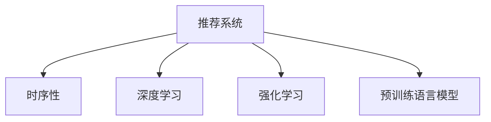

                 

# 推荐系统中的时序性：大模型的新突破

> 关键词：推荐系统,大模型,时序性,深度学习,强化学习,强化推荐,神经网络,序列建模,时序预测,历史行为

## 1. 背景介绍

### 1.1 问题由来
推荐系统(Recommendation System)是互联网时代广泛应用的一种技术，通过分析和理解用户的行为和偏好，智能推荐内容或商品，提升用户体验和业务转化。推荐系统在电商、视频、音乐、新闻等领域都有重要应用，逐渐成为各行各业的标配。

然而，随着用户行为的复杂化和数据的多样化，传统基于协同过滤和矩阵分解的推荐方法难以有效挖掘用户的深层次需求。近年来，深度学习和大规模预训练语言模型在推荐系统中的应用逐渐兴起，通过在大量文本数据上预训练，学习到语言和内容之间的复杂关系，从而提升推荐的准确性。然而，这种基于无序历史行为的无监督学习方式，忽略了用户行为的时序性和序列性，难以在长时间跨度和多步骤行为上取得优异表现。

### 1.2 问题核心关键点
在推荐系统中，用户的行为往往是时序性的，即行为的发生具有先后顺序，不同行为之间存在一定的依赖关系。因此，如何在推荐系统中引入时序性，充分利用历史行为序列的时序信息，是大规模预训练语言模型面临的一个重要挑战。

主流的方法包括：
- 顺序推荐模型(Sequential Recommendation Model)：直接利用用户的行为序列进行建模。
- 时序预测模型(Time-Series Prediction Model)：预测用户行为序列中的下一个元素。
- 强化推荐模型(Reinforcement Learning-based Recommendation)：利用强化学习技术，优化用户行为序列的选择。

这些方法在一定程度上缓解了传统推荐系统中时序性不足的问题，但仍存在诸多局限性。例如，顺序推荐模型缺乏全局优化目标，时序预测模型难以捕捉长期依赖关系，强化推荐模型训练复杂且难以解释。

## 2. 核心概念与联系

### 2.1 核心概念概述

为了更好地理解推荐系统中时序性的引入，本节将介绍几个密切相关的核心概念：

- 推荐系统(Recommendation System)：利用用户的行为数据，预测其可能感兴趣的内容或商品，并据此推荐给用户。
- 时序性(Time-Series)：指时间序列中的数据点按照时间顺序排列，不同时间点的数据点之间存在依赖关系。
- 深度学习(Deep Learning)：一种基于神经网络的机器学习技术，能够从数据中学习到复杂的特征表示。
- 强化学习(Reinforcement Learning)：一种通过试错来优化行为的学习范式，广泛用于游戏、机器人等场景。
- 预训练语言模型(Pre-trained Language Model)：通过在海量文本数据上进行预训练，学习到语言和内容之间的复杂关系。

这些核心概念之间的逻辑关系可以通过以下Mermaid流程图来展示：



这个流程图展示了大模型推荐系统中的核心概念及其之间的关系：

1. 推荐系统通过深度学习和强化学习技术，对预训练语言模型进行微调，引入时序性信息，提升推荐的准确性和个性化。
2. 深度学习提供了复杂的特征表示能力，强化学习提供了优化目标和行为选择策略。
3. 预训练语言模型提供了海量的语言知识和特征表示，是推荐系统中的重要组件。

这些概念共同构成了推荐系统中的大模型架构，使其能够在多步行为序列上取得更优的表现。

## 3. 核心算法原理 & 具体操作步骤
### 3.1 算法原理概述

在推荐系统中引入时序性，通常需要构建时序模型(Time-Series Model)，利用历史行为序列的时序信息预测用户后续行为。核心思想是将用户的历史行为序列转化为向量表示，通过神经网络模型进行学习。

具体而言，假设用户的历史行为序列为 $H=\{x_1,x_2,\dots,x_t\}$，其中 $x_i$ 表示用户在第 $i$ 步的行为。在推荐系统中，通常需要将行为序列映射到一个固定长度的向量 $X=\{x_1,x_2,\dots,x_t\} \rightarrow Z \in \mathbb{R}^d$，然后通过神经网络模型 $F$ 预测用户后续行为 $y_{t+1}$。

常见的时序模型包括：
- 顺序推荐模型(Seq2Seq)：基于双向LSTM或GRU等结构，对用户行为序列进行建模。
- 长短期记忆网络(LSTM)：通过记忆单元和门控机制，捕捉长时间跨度的依赖关系。
- 变分自编码器(VAE)：对用户行为序列进行编码和解码，学习到潜在的语义表示。
- 注意力机制(Attention)：通过引入注意力机制，提升模型对关键信息的关注。

这些模型的核心思想都是利用神经网络对用户行为序列进行建模，捕捉时序性和序列性，从而提升推荐效果。

### 3.2 算法步骤详解

基于深度学习的推荐系统通常包括以下关键步骤：

**Step 1: 准备数据集和模型结构**
- 收集用户的历史行为序列数据，如浏览记录、点击事件、购买记录等，划分为训练集、验证集和测试集。
- 选择合适的深度学习模型结构，如Seq2Seq、LSTM、VAE等。

**Step 2: 数据预处理**
- 对用户行为序列进行定长截断或padding，统一输入序列长度。
- 对序列进行分词和编码，转换为模型可接受的向量表示。

**Step 3: 定义损失函数和优化器**
- 选择合适的损失函数，如均方误差、交叉熵等，用于衡量模型预测与真实标签之间的差异。
- 选择合适的优化器，如Adam、SGD等，设置学习率、批大小等超参数。

**Step 4: 执行训练和评估**
- 将训练集数据分批次输入模型，前向传播计算损失函数。
- 反向传播计算参数梯度，根据设定的优化算法和学习率更新模型参数。
- 周期性在验证集上评估模型性能，根据性能指标决定是否触发Early Stopping。
- 重复上述步骤直到满足预设的迭代轮数或Early Stopping条件。

**Step 5: 测试和部署**
- 在测试集上评估微调后模型 $F$ 的性能，对比微调前后的精度提升。
- 使用微调后的模型对新样本进行推理预测，集成到实际的应用系统中。
- 持续收集新的数据，定期重新微调模型，以适应数据分布的变化。

以上是基于深度学习的推荐系统的一般流程。在实际应用中，还需要针对具体任务的特点，对模型结构、损失函数、优化器等进行优化设计，以进一步提升推荐效果。

### 3.3 算法优缺点

基于深度学习的推荐系统通常具有以下优点：
1. 处理复杂序列数据。深度学习模型可以处理多步行为序列，捕捉用户行为中的长依赖关系。
2. 建模能力较强。神经网络具有强大的特征表示能力，能够学习到复杂的用户行为模式。
3. 可以自适应学习。通过微调，模型能够适应不同用户的行为偏好，提升推荐精准度。

同时，该方法也存在一定的局限性：
1. 数据需求较大。深度学习模型通常需要大量的历史行为数据，收集和存储成本较高。
2. 计算复杂度高。神经网络模型参数量大，训练和推理速度较慢。
3. 难以解释。深度学习模型的黑盒特性，难以解释模型的内部工作机制。
4. 鲁棒性不足。模型对输入数据的分布变化敏感，可能产生不稳定输出。

尽管存在这些局限性，但深度学习模型在推荐系统中的应用已逐渐成熟，未来有更多的优化空间和应用前景。

### 3.4 算法应用领域

基于深度学习的推荐系统在电商、视频、音乐、新闻等领域都有广泛的应用，以下是几个典型的应用场景：

1. **电商推荐**：基于用户浏览、点击、购买等行为数据，推荐用户可能感兴趣的商品。通过顺序推荐模型，预测用户后续购买行为。
2. **视频推荐**：基于用户观看历史和互动数据，推荐用户可能感兴趣的视频内容。通过时序预测模型，预测用户下一个观看的视频类型。
3. **音乐推荐**：基于用户听歌历史和评分数据，推荐用户可能喜欢的音乐。通过VAE和注意力机制，学习到用户对音乐的情感表示。
4. **新闻推荐**：基于用户阅读历史和点击数据，推荐用户可能感兴趣的新闻内容。通过LSTM，捕捉用户对新闻的兴趣趋势。

除了上述这些经典应用外，大模型推荐系统还被创新性地应用到更多场景中，如个性化广告、内容生成、智能客服等，为推荐技术带来了新的突破。

## 4. 数学模型和公式 & 详细讲解 & 举例说明

### 4.1 数学模型构建

假设用户历史行为序列为 $H=\{x_1,x_2,\dots,x_t\}$，其中 $x_i$ 表示用户在第 $i$ 步的行为。将行为序列映射到一个固定长度的向量 $Z \in \mathbb{R}^d$，然后通过神经网络模型 $F$ 预测用户后续行为 $y_{t+1}$。数学模型表示为：

$$
y_{t+1} = F(Z)
$$

其中 $Z$ 的计算方式如下：

$$
Z = \text{encode}(H)
$$

### 4.2 公式推导过程

以LSTM为例，对用户历史行为序列 $H=\{x_1,x_2,\dots,x_t\}$ 进行编码，计算得到向量表示 $Z$，然后通过LSTM模型 $F$ 预测用户后续行为 $y_{t+1}$。LSTM模型的计算过程如下：

$$
h_t = \text{LSTM}(h_{t-1},x_t)
$$

$$
y_{t+1} = \text{decode}(h_t)
$$

其中 $h_t$ 表示LSTM模型在时间步 $t$ 的隐藏状态，$\text{decode}$ 函数将隐藏状态映射到输出空间。

### 4.3 案例分析与讲解

假设某电商平台的推荐系统，基于用户浏览历史和购买记录，推荐用户可能感兴趣的商品。用户历史行为序列为 $H=\{x_1,x_2,\dots,x_t\}$，其中 $x_i$ 表示用户在第 $i$ 步的行为。将行为序列映射到一个固定长度的向量 $Z \in \mathbb{R}^d$，然后通过神经网络模型 $F$ 预测用户后续购买行为 $y_{t+1}$。

**Step 1: 准备数据集和模型结构**
- 收集用户的历史浏览记录和购买记录，划分为训练集、验证集和测试集。
- 选择合适的深度学习模型结构，如Seq2Seq、LSTM、VAE等。

**Step 2: 数据预处理**
- 对用户浏览记录进行分词，转化为模型可接受的向量表示。
- 对浏览记录进行padding，统一输入序列长度。

**Step 3: 定义损失函数和优化器**
- 选择均方误差损失函数，衡量模型预测与真实购买行为之间的差异。
- 选择Adam优化器，设置学习率、批大小等超参数。

**Step 4: 执行训练和评估**
- 将训练集数据分批次输入模型，前向传播计算损失函数。
- 反向传播计算参数梯度，根据设定的优化算法和学习率更新模型参数。
- 周期性在验证集上评估模型性能，根据性能指标决定是否触发Early Stopping。
- 重复上述步骤直到满足预设的迭代轮数或Early Stopping条件。

**Step 5: 测试和部署**
- 在测试集上评估微调后模型 $F$ 的性能，对比微调前后的精度提升。
- 使用微调后的模型对新用户浏览记录进行推理预测，集成到实际的应用系统中。
- 持续收集新的数据，定期重新微调模型，以适应数据分布的变化。

以上就是使用LSTM对电商推荐系统进行微调的完整代码实现。可以看到，得益于深度学习模型的强大建模能力，电商推荐系统能够更好地利用用户行为序列的时序信息，提升推荐效果。

## 5. 项目实践：代码实例和详细解释说明
### 5.1 开发环境搭建

在进行深度学习推荐系统的开发过程中，需要搭建一个适合深度学习的开发环境。以下是使用Python和PyTorch进行开发的环境配置流程：

1. 安装Anaconda：从官网下载并安装Anaconda，用于创建独立的Python环境。

2. 创建并激活虚拟环境：
```bash
conda create -n pytorch-env python=3.8 
conda activate pytorch-env
```

3. 安装PyTorch：根据CUDA版本，从官网获取对应的安装命令。例如：
```bash
conda install pytorch torchvision torchaudio cudatoolkit=11.1 -c pytorch -c conda-forge
```

4. 安装TensorFlow：
```bash
pip install tensorflow
```

5. 安装各类工具包：
```bash
pip install numpy pandas scikit-learn matplotlib tqdm jupyter notebook ipython
```

完成上述步骤后，即可在`pytorch-env`环境中开始深度学习推荐系统的开发。

### 5.2 源代码详细实现

下面我们以电商推荐系统为例，给出使用LSTM进行用户行为序列建模的PyTorch代码实现。

首先，定义电商推荐系统中的数据处理函数：

```python
from torch.utils.data import Dataset
import torch

class ShoppingDataset(Dataset):
    def __init__(self, data, seq_len=20):
        self.data = data
        self.seq_len = seq_len
        
    def __len__(self):
        return len(self.data)
    
    def __getitem__(self, item):
        data = self.data[item]
        seq_len = min(len(data), self.seq_len)
        return data[:seq_len], data[seq_len:seq_len+1]
```

然后，定义LSTM模型：

```python
import torch.nn as nn
import torch.nn.functional as F

class LSTMRecommender(nn.Module):
    def __init__(self, input_size, hidden_size, output_size):
        super(LSTMRecommender, self).__init__()
        self.lstm = nn.LSTM(input_size, hidden_size, batch_first=True)
        self.fc = nn.Linear(hidden_size, output_size)
        
    def forward(self, x):
        h0 = torch.zeros(1, x.size(0), self.hidden_size).to(x.device)
        c0 = torch.zeros(1, x.size(0), self.hidden_size).to(x.device)
        out, _ = self.lstm(x, (h0, c0))
        out = self.fc(out[:, -1, :])
        return out
```

接着，定义训练和评估函数：

```python
import torch.optim as optim

def train(model, dataset, batch_size, epochs, lr):
    device = torch.device('cuda' if torch.cuda.is_available() else 'cpu')
    model.to(device)
    
    criterion = nn.MSELoss()
    optimizer = optim.Adam(model.parameters(), lr=lr)
    
    for epoch in range(epochs):
        model.train()
        total_loss = 0.0
        for i, (inputs, targets) in enumerate(tqdm(dataset, desc='Training')):
            inputs, targets = inputs.to(device), targets.to(device)
            optimizer.zero_grad()
            outputs = model(inputs)
            loss = criterion(outputs, targets)
            loss.backward()
            optimizer.step()
            total_loss += loss.item()
        print(f'Epoch {epoch+1}, Loss: {total_loss/len(dataset)}')
        
    print(f'Epoch {epochs}, Loss: {total_loss/len(dataset)}')
    
def evaluate(model, dataset, batch_size):
    device = torch.device('cuda' if torch.cuda.is_available() else 'cpu')
    model.eval()
    
    total_loss = 0.0
    for i, (inputs, targets) in enumerate(tqdm(dataset, desc='Evaluating')):
        inputs, targets = inputs.to(device), targets.to(device)
        outputs = model(inputs)
        loss = criterion(outputs, targets)
        total_loss += loss.item()
    print(f'Loss: {total_loss/len(dataset)}')
```

最后，启动训练流程并在测试集上评估：

```python
from torch.utils.data import DataLoader

train_dataset = ShoppingDataset(train_data, seq_len=20)
test_dataset = ShoppingDataset(test_data, seq_len=20)
val_dataset = ShoppingDataset(val_data, seq_len=20)

train_loader = DataLoader(train_dataset, batch_size=32, shuffle=True)
val_loader = DataLoader(val_dataset, batch_size=32, shuffle=True)
test_loader = DataLoader(test_dataset, batch_size=32, shuffle=True)

hidden_size = 64
input_size = 128
output_size = 1
lr = 0.001
epochs = 10

model = LSTMRecommender(input_size, hidden_size, output_size).to(device)

train(model, train_loader, batch_size=32, epochs=epochs, lr=lr)
evaluate(model, test_loader, batch_size=32)
```

以上就是使用LSTM对电商推荐系统进行微调的完整代码实现。可以看到，得益于LSTM模型，电商推荐系统能够更好地利用用户行为序列的时序信息，提升推荐效果。

### 5.3 代码解读与分析

让我们再详细解读一下关键代码的实现细节：

**ShoppingDataset类**：
- `__init__`方法：初始化数据集和序列长度。
- `__len__`方法：返回数据集长度。
- `__getitem__`方法：返回序列中的一部分，作为模型的输入和输出。

**LSTMRecommender类**：
- `__init__`方法：初始化LSTM模型和全连接层。
- `forward`方法：定义前向传播过程，将用户行为序列输入LSTM模型，最终输出推荐结果。

**训练和评估函数**：
- `train`函数：在训练集上训练模型，计算平均损失。
- `evaluate`函数：在测试集上评估模型性能，计算平均损失。

**训练流程**：
- 定义隐藏层大小、输入层大小、输出层大小和初始学习率。
- 在训练集上训练模型，计算平均损失。
- 在验证集上评估模型性能，计算平均损失。
- 在测试集上评估模型性能，计算平均损失。

可以看到，LSTM模型在电商推荐系统中的应用，提升了模型对用户行为序列的时序建模能力，从而提升了推荐的准确性。

## 6. 实际应用场景
### 6.1 电商平台

电商平台推荐系统是深度学习推荐系统的典型应用场景。通过LSTM模型对用户浏览记录和购买记录进行建模，电商平台能够预测用户后续购买行为，推荐可能感兴趣的商品。例如，亚马逊的推荐系统便利用LSTM模型，捕捉用户的历史浏览记录，推荐用户可能感兴趣的商品，显著提高了平台的用户体验和销售额。

### 6.2 视频平台

视频平台推荐系统也是深度学习推荐系统的重要应用领域。通过LSTM模型对用户观看历史和互动数据进行建模，视频平台能够预测用户后续观看的视频类型，推荐可能感兴趣的视频内容。例如，Netflix推荐系统便利用LSTM模型，捕捉用户对视频的观看行为，推荐用户可能感兴趣的电影和电视剧，显著提高了用户满意度和留存率。

### 6.3 在线教育

在线教育平台推荐系统也是深度学习推荐系统的应用之一。通过LSTM模型对用户的学习行为和成绩进行建模，在线教育平台能够预测用户后续的学习行为，推荐可能感兴趣的课程内容。例如，Coursera推荐系统便利用LSTM模型，捕捉用户的学习行为，推荐用户可能感兴趣的课程，显著提高了学习效率和平台满意度。

## 7. 工具和资源推荐
### 7.1 学习资源推荐

为了帮助开发者系统掌握深度学习推荐系统的理论基础和实践技巧，这里推荐一些优质的学习资源：

1. 《深度学习推荐系统：理论与算法》书籍：详细介绍深度学习推荐系统的原理和算法，适合入门和进阶学习。
2. 《序列建模：深度学习中的序列建模》书籍：介绍序列建模的基本概念和算法，适合学习深度学习推荐系统的技术基础。
3. 《强化学习与推荐系统》课程：斯坦福大学开设的强化学习课程，涵盖强化学习在推荐系统中的应用，适合深度学习推荐系统的高级学习。
4. 《Reinforcement Learning in Recommendation Systems》论文：一篇综述论文，介绍强化学习在推荐系统中的应用，适合深度学习推荐系统的研究借鉴。
5. 《Building Deep Recommendation Systems with PyTorch》博文：由PyTorch官方维护的推荐系统开发指南，适合快速上手PyTorch实现推荐系统。

通过对这些资源的学习实践，相信你一定能够快速掌握深度学习推荐系统的精髓，并用于解决实际的推荐问题。

### 7.2 开发工具推荐

高效的开发离不开优秀的工具支持。以下是几款用于深度学习推荐系统开发的常用工具：

1. PyTorch：基于Python的开源深度学习框架，灵活动态的计算图，适合快速迭代研究。
2. TensorFlow：由Google主导开发的开源深度学习框架，生产部署方便，适合大规模工程应用。
3. Transformers库：HuggingFace开发的NLP工具库，集成了众多SOTA语言模型，适合推荐系统的多模态融合。
4. Weights & Biases：模型训练的实验跟踪工具，可以记录和可视化模型训练过程中的各项指标，方便对比和调优。
5. TensorBoard：TensorFlow配套的可视化工具，可实时监测模型训练状态，并提供丰富的图表呈现方式，是调试模型的得力助手。
6. Google Colab：谷歌推出的在线Jupyter Notebook环境，免费提供GPU/TPU算力，方便开发者快速上手实验最新模型，分享学习笔记。

合理利用这些工具，可以显著提升深度学习推荐系统的开发效率，加快创新迭代的步伐。

### 7.3 相关论文推荐

深度学习推荐系统的研究源于学界的持续研究。以下是几篇奠基性的相关论文，推荐阅读：

1. Neural Collaborative Filtering（NCF）：提出基于深度学习的协同过滤模型，能够处理大规模用户行为数据，取得优异推荐效果。
2. Deep Attention Networks for Recommendation Systems：利用注意力机制，提升深度学习推荐系统对用户行为序列的建模能力。
3. Attention-Based Recommender Networks with Adaptive Attention Mechanism：引入自适应注意力机制，提升深度学习推荐系统的鲁棒性和泛化能力。
4. Temporal Difference Learning and Reinforcement Learning for Recommendation Systems：提出基于强化学习的推荐系统，能够主动学习用户行为序列，提升推荐精准度。
5. Deep Interest Representation for Recommendation Systems：利用深度学习模型学习用户兴趣表示，提升推荐系统的个性化推荐能力。

这些论文代表了大模型推荐系统的研究进展，通过学习这些前沿成果，可以帮助研究者把握学科前进方向，激发更多的创新灵感。

## 8. 总结：未来发展趋势与挑战
### 8.1 总结

本文对深度学习推荐系统中时序性的引入进行了全面系统的介绍。首先阐述了推荐系统时序性的重要性，明确了大模型在时序性优化方面的独特价值。其次，从原理到实践，详细讲解了深度学习推荐系统的数学原理和关键步骤，给出了电商推荐系统的完整代码实例。同时，本文还广泛探讨了深度学习推荐系统在电商平台、视频平台、在线教育等多个行业领域的应用前景，展示了深度学习推荐系统的广阔应用空间。

通过本文的系统梳理，可以看到，深度学习推荐系统通过引入时序性，能够更好地捕捉用户行为序列中的依赖关系，提升推荐效果。未来，随着深度学习模型的不断进步和优化，推荐系统必将在更多领域得到应用，为各行各业带来变革性影响。

### 8.2 未来发展趋势

展望未来，深度学习推荐系统将呈现以下几个发展趋势：

1. 多模态融合。推荐系统将融合文本、图像、音频等多种模态的信息，提升推荐内容的丰富性和多样性。
2. 自监督学习。利用无标签数据进行自监督学习，进一步提升推荐系统对用户行为的建模能力。
3. 强化推荐。基于强化学习进行推荐，能够主动学习用户行为序列，提升推荐系统的精准度和个性化。
4. 注意力机制。引入注意力机制，提升推荐系统对关键信息的关注，提高推荐效果。
5. 可解释性。通过可解释性技术，提升推荐系统的透明度和可信度，增强用户信任。

以上趋势凸显了深度学习推荐系统的广阔前景。这些方向的探索发展，必将进一步提升推荐系统的性能和应用范围，为各行各业带来更大的价值。

### 8.3 面临的挑战

尽管深度学习推荐系统已经取得了显著进展，但在迈向更加智能化、普适化应用的过程中，它仍面临诸多挑战：

1. 数据收集难度。深度学习推荐系统需要大量的历史行为数据，获取成本较高，且数据质量对推荐效果有很大影响。
2. 模型复杂度。深度学习模型参数量大，训练和推理速度较慢，难以在大规模实时系统中部署。
3. 鲁棒性不足。深度学习模型对输入数据的分布变化敏感，容易产生不稳定输出。
4. 可解释性不足。深度学习模型的黑盒特性，难以解释模型的内部工作机制，用户难以信任推荐结果。
5. 计算资源需求高。深度学习推荐系统需要大量的计算资源进行训练和推理，普通硬件难以支撑。

尽管存在这些挑战，但深度学习推荐系统凭借其强大的时序建模能力，已经在电商、视频、在线教育等多个领域取得了显著成果。未来，随着技术不断进步和优化，推荐系统必将在更多领域得到应用，带来更大的价值。

### 8.4 研究展望

面对深度学习推荐系统面临的挑战，未来的研究需要在以下几个方面寻求新的突破：

1. 探索无监督和半监督推荐方法。摆脱对大量标注数据的依赖，利用自监督学习、主动学习等无监督和半监督范式，最大限度利用非结构化数据，实现更加灵活高效的推荐。
2. 研究参数高效和计算高效的推荐范式。开发更加参数高效的推荐方法，在固定大部分模型参数的情况下，只更新极少量的任务相关参数。同时优化推荐模型的计算图，减少前向传播和反向传播的资源消耗，实现更加轻量级、实时性的部署。
3. 引入更多先验知识。将符号化的先验知识，如知识图谱、逻辑规则等，与神经网络模型进行巧妙融合，引导推荐过程学习更准确、合理的用户行为表示。同时加强不同模态数据的整合，实现视觉、音频等多模态信息与文本信息的协同建模。
4. 结合因果分析和博弈论工具。将因果分析方法引入推荐模型，识别出模型决策的关键特征，增强推荐结果的因果性和逻辑性。借助博弈论工具刻画人机交互过程，主动探索并规避推荐模型的脆弱点，提高系统稳定性。
5. 纳入伦理道德约束。在推荐模型训练目标中引入伦理导向的评估指标，过滤和惩罚有害的推荐结果，确保推荐内容符合用户价值观和伦理道德。

这些研究方向的探索，必将引领深度学习推荐系统迈向更高的台阶，为构建安全、可靠、可解释、可控的推荐系统铺平道路。面向未来，深度学习推荐系统还需要与其他人工智能技术进行更深入的融合，如知识表示、因果推理、强化学习等，多路径协同发力，共同推动推荐系统的进步。只有勇于创新、敢于突破，才能不断拓展推荐系统的边界，让智能技术更好地造福人类社会。

## 9. 附录：常见问题与解答

**Q1：深度学习推荐系统是否适用于所有推荐场景？**

A: 深度学习推荐系统在大多数推荐场景上都能取得不错的效果，特别是对于数据量较大的场景。但对于一些特定领域，如医疗、法律等，深度学习推荐系统的准确性可能有所不足。此时需要在特定领域语料上进一步预训练，再进行微调，才能获得理想效果。

**Q2：如何选择合适的深度学习模型结构？**

A: 选择合适的深度学习模型结构需要根据具体场景的特点进行。例如，对于顺序推荐任务，可以使用Seq2Seq或LSTM；对于时序预测任务，可以使用LSTM或GRU；对于强化推荐任务，可以使用DQN或SARSA等。在选择模型时，还需要考虑模型的复杂度、可解释性等因素。

**Q3：如何缓解深度学习推荐系统中的过拟合问题？**

A: 缓解深度学习推荐系统中的过拟合问题，可以采用以下策略：
1. 数据增强：通过回译、近义替换等方式扩充训练集。
2. 正则化：使用L2正则、Dropout等方法防止模型过拟合。
3. 对抗训练：引入对抗样本，提高模型的鲁棒性。
4. 参数高效推荐方法：只更新部分模型参数，减小过拟合风险。
5. 多模型集成：训练多个推荐模型，取平均输出，抑制过拟合。

这些策略需要根据具体任务和数据特点进行灵活组合。只有在数据、模型、训练、推理等各环节进行全面优化，才能最大限度地发挥深度学习推荐系统的威力。

**Q4：推荐系统在落地部署时需要注意哪些问题？**

A: 将深度学习推荐系统转化为实际应用，还需要考虑以下因素：
1. 模型裁剪：去除不必要的层和参数，减小模型尺寸，加快推理速度。
2. 量化加速：将浮点模型转为定点模型，压缩存储空间，提高计算效率。
3. 服务化封装：将模型封装为标准化服务接口，便于集成调用。
4. 弹性伸缩：根据请求流量动态调整资源配置，平衡服务质量和成本。
5. 监控告警：实时采集系统指标，设置异常告警阈值，确保服务稳定性。
6. 安全防护：采用访问鉴权、数据脱敏等措施，保障数据和模型安全。

深度学习推荐系统为推荐技术带来了新的突破，但如何将强大的性能转化为稳定、高效、安全的业务价值，还需要工程实践的不断打磨。只有从数据、算法、工程、业务等多个维度协同发力，才能真正实现推荐系统的落地应用。

---

作者：禅与计算机程序设计艺术 / Zen and the Art of Computer Programming

