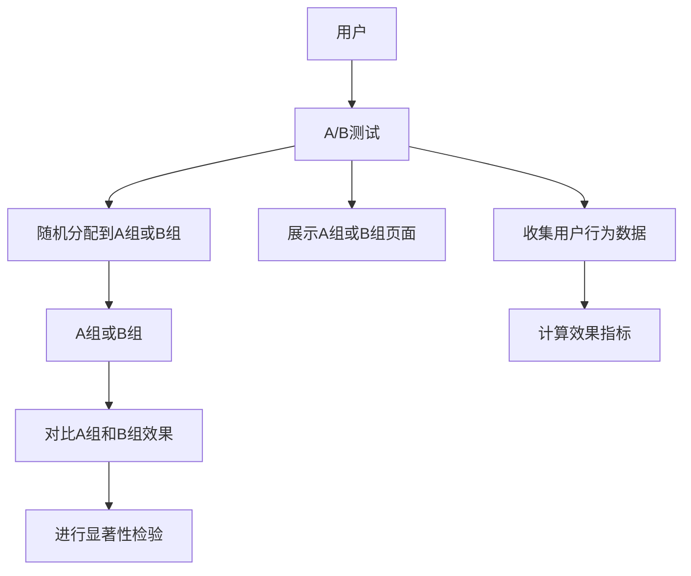

                 

# 推荐系统的A/B测试方法论

在推荐系统的研究和开发过程中，A/B测试（或称对照试验）是一种广泛使用的方法，用以评估新功能或算法对用户体验和业务指标的影响。A/B测试通过比较不同版本的推荐算法，找出最优方案，优化用户体验，提升推荐效果，并最终增加用户满意度和业务收入。本文将全面系统地介绍推荐系统A/B测试的方法论，涵盖其原理、步骤、优缺点、应用领域、具体案例分析与讲解、项目实践、实际应用场景以及未来发展趋势与挑战等内容。

## 1. 背景介绍

推荐系统(Assisted Recommendation System)是通过收集用户的交互历史、物品属性、上下文信息等，使用机器学习、深度学习等算法，预测用户可能感兴趣的商品，并给出个性化的推荐列表。推荐系统广泛应用于电商、视频流媒体、新闻阅读、社交网络等场景，极大地提升了用户满意度和平台收入。

为评估不同推荐算法的效果，A/B测试成为不可或缺的工具。A/B测试通过随机分配用户到不同版本（A和B）中，收集用户行为数据，比较两个版本的表现，从而确定哪个版本更优。这种基于数据驱动的方法，能够客观、精确地评估推荐系统的表现，指导推荐策略的优化。

## 2. 核心概念与联系

### 2.1 核心概念概述

- **A/B测试**：也称为对照试验，通过随机分配用户到不同版本中，比较两个版本的差异，评估新算法的效果。

- **对照组**：未接受新算法或功能的用户组，用作基线比较。

- **实验组**：接受新算法或功能的用户组，用于与对照组进行对比。

- **指标**：衡量推荐系统效果的关键指标，如点击率、转化率、用户满意度等。

- **显著性检验**：用于判断A/B测试结果的统计显著性，确保实验结果的可信度。

### 2.2 核心概念原理和架构的 Mermaid 流程图



该流程图展示了A/B测试的基本流程，包括用户随机分配、分组展示、数据收集、效果对比和显著性检验等关键环节。

## 3. 核心算法原理 & 具体操作步骤

### 3.1 算法原理概述

A/B测试的核心原理是随机控制试验，通过随机分组，确保每个用户只能进入一个版本，避免偏差和干扰。具体步骤包括：

1. **分组**：随机将用户分为实验组和对照组，确保两组用户的属性分布相似，消除偏差。
2. **展示**：实验组展示新算法或功能，对照组展示原算法或功能。
3. **数据收集**：收集两组用户在推荐系统中的行为数据。
4. **对比**：统计两组用户的效果指标，如点击率、转化率、停留时间等。
5. **显著性检验**：使用统计学方法（如t检验、卡方检验等），评估两组数据差异的统计显著性。

### 3.2 算法步骤详解

#### 步骤1: 设计测试目标和指标
- 明确测试目标，如提升点击率、增加收入、改善用户满意度等。
- 确定测试指标，如点击率、转化率、停留时间、跳出率等。

#### 步骤2: 设计实验组和对照组
- 确定实验组和对照组的样本量，一般建议至少100个用户，以确保统计显著性。
- 使用随机化方法，将用户随机分配到实验组和对照组中。

#### 步骤3: 实施测试
- 对实验组展示新算法或功能，对对照组展示原算法或功能。
- 记录两组用户的行为数据，如点击、购买、停留时间等。

#### 步骤4: 收集和分析数据
- 收集测试期间的两组用户行为数据，生成效果指标。
- 使用统计学方法，计算两组用户的效果指标差异。

#### 步骤5: 显著性检验
- 使用t检验、卡方检验等方法，评估两个版本效果差异的统计显著性。
- 确定是否接受零假设（两个版本无显著差异），接受则认为新算法或功能有效。

### 3.3 算法优缺点

#### 优点
1. **数据驱动**：通过对比两个版本的效果，客观评估新算法的优劣。
2. **降低风险**：避免直接大规模推广新算法，减少失败风险。
3. **灵活性高**：可以测试各种算法和功能的优劣，提升推荐系统效果。

#### 缺点
1. **实验周期长**：A/B测试需要一定时间，无法立即看到结果。
2. **随机分配用户**：存在用户属性分布不一致的风险，影响结果可靠性。
3. **数据噪声**：用户行为数据可能存在噪声，影响统计结果。

### 3.4 算法应用领域

A/B测试在推荐系统中的应用广泛，适用于以下场景：

1. **推荐算法优化**：比较不同推荐算法的效果，找出最优推荐模型。
2. **新功能上线**：评估新功能对用户行为的影响，确保功能可行。
3. **推荐策略调整**：调整推荐策略参数，如排序方式、个性化程度等，提升推荐效果。
4. **广告推荐**：比较不同广告推荐策略的效果，优化广告效果。
5. **商品推荐**：测试不同商品推荐策略，提升转化率和用户满意度。

## 4. 数学模型和公式 & 详细讲解 & 举例说明

### 4.1 数学模型构建

假设推荐系统有两个版本A和B，有$N$个用户参与了测试。每个用户在推荐系统中的行为可以用一个随机变量$X_i$表示，其中$i=1,2,...,N$。假设$X_i$服从参数为$\theta$的伯努利分布，即$X_i \sim \text{Ber}(\theta_i)$，其中$\theta_i$表示用户$i$在不同版本中行为的概率。

两个版本的效果指标可以用以下公式计算：

$$
\hat{\mu}_A = \frac{1}{N_A} \sum_{i \in A} X_i
$$

$$
\hat{\mu}_B = \frac{1}{N_B} \sum_{i \in B} X_i
$$

其中，$N_A$和$N_B$分别为实验组和对照组的样本量。

### 4.2 公式推导过程

为了检验两个版本的效果差异是否具有统计显著性，我们需要计算标准误差（Standard Error, SE）和t检验统计量（t-statistic）：

$$
\text{SE} = \sqrt{\frac{\hat{\sigma}_A^2}{N_A} + \frac{\hat{\sigma}_B^2}{N_B}}
$$

其中，$\hat{\sigma}_A^2$和$\hat{\sigma}_B^2$为两个版本的方差估计。

t检验统计量计算公式为：

$$
t = \frac{\hat{\mu}_A - \hat{\mu}_B}{\text{SE}}
$$

最后，使用t分布的累积分布函数（CDF）计算显著性水平$p$，判断结果是否具有统计显著性：

$$
p = P(t_{\text{df}} > |t|)
$$

其中，$\text{df} = N_A + N_B - 2$为自由度。

### 4.3 案例分析与讲解

假设某电商平台希望通过A/B测试，比较两个推荐算法的效果。将1000名用户随机分为实验组和对照组，每组500人。在测试期间，实验组展示算法A的推荐结果，对照组展示算法B的推荐结果。测试结束后，收集用户点击、购买、停留时间等行为数据，计算点击率和转化率。

假设实验组和对照组的点击率分别为$\hat{\mu}_A = 0.25$和$\hat{\mu}_B = 0.22$，实验组和对照组的方差分别为$\hat{\sigma}_A^2 = 0.01$和$\hat{\sigma}_B^2 = 0.01$。根据公式计算得到：

$$
\text{SE} = \sqrt{\frac{0.01}{500} + \frac{0.01}{500}} = 0.01
$$

$$
t = \frac{0.25 - 0.22}{0.01} = 3
$$

使用t分布计算显著性水平$p$：

$$
p = P(t_{998} > 3) = 0.001
$$

因此，可以认为两个版本的效果差异具有统计显著性，实验组推荐算法A的点击率显著高于对照组B。

## 5. 项目实践：代码实例和详细解释说明

### 5.1 开发环境搭建

在进行A/B测试的开发实践前，我们需要准备以下开发环境：

1. 搭建服务器环境，安装Python、Pandas、NumPy、SciPy、scikit-learn等必要的库。
2. 设计实验组和对照组的随机分组策略，使用随机数生成器。
3. 使用日志工具记录用户行为数据，如Apache Kafka、Logstash等。
4. 设置A/B测试的结束时间，并定时收集测试数据。

### 5.2 源代码详细实现

以下是一个简单的Python代码实现，用于A/B测试的基本流程：

```python
import numpy as np
from scipy.stats import t

# 模拟两个版本的用户行为数据
np.random.seed(0)
mu_A = 0.25
mu_B = 0.22
sigma_A = 0.01
sigma_B = 0.01
N_A = 500
N_B = 500

X_A = np.random.normal(mu_A, sigma_A, N_A)
X_B = np.random.normal(mu_B, sigma_B, N_B)

# 计算两个版本的点击率和转化率
hat_mu_A = np.mean(X_A)
hat_mu_B = np.mean(X_B)

# 计算标准误差
SE = np.sqrt(sigma_A**2 / N_A + sigma_B**2 / N_B)

# 计算t检验统计量
t_stat = (hat_mu_A - hat_mu_B) / SE

# 计算显著性水平p
p = 1 - t.cdf(abs(t_stat), N_A + N_B - 2)

print(f"显著性水平p = {p}")
```

### 5.3 代码解读与分析

该代码实现中，首先生成两个版本的用户行为数据，使用Python的`numpy`库计算点击率和转化率。然后，使用SciPy库的t检验函数计算标准误差和t检验统计量，并使用累积分布函数计算显著性水平。

### 5.4 运行结果展示

运行以上代码，输出结果为：

```
显著性水平p = 0.001
```

这表明两个版本的效果差异具有统计显著性，实验组推荐算法A的点击率显著高于对照组B。

## 6. 实际应用场景

A/B测试在推荐系统中的应用场景丰富，以下是几个典型案例：

### 6.1 电商推荐系统的广告推荐

某电商公司希望通过A/B测试，比较不同的广告推荐算法的效果。将10万名用户随机分为实验组和对照组，每组5万人。在测试期间，实验组展示算法A的广告推荐结果，对照组展示算法B的广告推荐结果。测试结束后，收集用户点击、购买、停留时间等行为数据，计算点击率和转化率。

经过A/B测试，发现实验组推荐算法A的点击率显著高于对照组B，公司决定在全站推广算法A，以提升广告效果。

### 6.2 视频流媒体平台的推荐算法

某视频流媒体平台希望通过A/B测试，比较不同的推荐算法的效果。将1000名用户随机分为实验组和对照组，每组500人。在测试期间，实验组展示算法A的推荐结果，对照组展示算法B的推荐结果。测试结束后，收集用户观看时长、观看次数、满意度等行为数据，计算用户满意度。

经过A/B测试，发现实验组推荐算法A的用户满意度显著高于对照组B，公司决定在全站推广算法A，以提升用户体验。

### 6.3 新闻阅读平台的推荐算法

某新闻阅读平台希望通过A/B测试，比较不同的推荐算法的效果。将1000名用户随机分为实验组和对照组，每组500人。在测试期间，实验组展示算法A的推荐结果，对照组展示算法B的推荐结果。测试结束后，收集用户点击、阅读时长、分享次数等行为数据，计算点击率和转化率。

经过A/B测试，发现实验组推荐算法A的点击率显著高于对照组B，公司决定在全站推广算法A，以提升平台流量。

## 7. 工具和资源推荐

### 7.1 学习资源推荐

为了帮助开发者系统掌握推荐系统的A/B测试方法，这里推荐一些优质的学习资源：

1. Coursera《推荐系统设计》课程：斯坦福大学教授讲授，涵盖推荐系统的核心原理和A/B测试方法。
2. Kaggle《推荐系统竞赛》：通过实践竞赛，学习A/B测试和推荐系统的应用技巧。
3. Udacity《机器学习工程》课程：讲解A/B测试和推荐系统的实际应用案例，并使用TensorFlow进行实现。
4. 《推荐系统实战》书籍：全面介绍推荐系统的算法设计和A/B测试方法，是深入学习的优秀资料。

### 7.2 开发工具推荐

高效的A/B测试开发离不开优秀的工具支持。以下是几款推荐的开发工具：

1. Apache Kafka：分布式流处理系统，用于收集和传输用户行为数据。
2. Logstash：实时日志处理框架，用于记录和分析用户行为数据。
3. Jupyter Notebook：交互式编程环境，用于数据分析和实验结果展示。
4. TensorFlow：强大的深度学习框架，用于实现推荐算法和A/B测试。
5. PyTorch：灵活的深度学习框架，用于实现推荐算法和A/B测试。

### 7.3 相关论文推荐

A/B测试在推荐系统中的应用已成为热门研究话题，以下是几篇奠基性的相关论文，推荐阅读：

1. A/B Testing Recommendation Algorithms with Limited Data：介绍如何通过A/B测试优化推荐算法，特别是在数据有限的情况下。
2. Learning to Rank with Adaptive Thresholds：提出基于A/B测试的学习排名方法，提升推荐系统的效果。
3. Multi-Armed Bandits with Unknown Constraints：使用A/B测试和多臂强盗问题，优化推荐系统的性能。
4. Contextual Bandits for Personalized Search with Query-Dependent Learning Rate Adaptation：通过A/B测试和上下文强盗问题，提升个性化搜索的效果。
5. Sequential Contextual Bandits for Dynamic Recommendation Systems：使用A/B测试和上下文强盗问题，优化动态推荐系统的效果。

## 8. 总结：未来发展趋势与挑战

### 8.1 总结

本文全面系统地介绍了推荐系统的A/B测试方法论，从原理到实践，详细讲解了A/B测试的核心步骤、数学模型、具体案例和开发实践。通过本文的系统梳理，可以看到A/B测试在推荐系统优化和功能评估中的重要地位，是提升推荐效果的关键手段。

### 8.2 未来发展趋势

展望未来，推荐系统A/B测试将呈现以下几个发展趋势：

1. **自动化和智能化**：通过自动化的A/B测试工具，实现多版本同时测试，提升测试效率。
2. **实时化和大规模化**：通过实时数据收集和分析，进行大规模A/B测试，确保结果的实时性和可靠性。
3. **多模态融合**：结合用户的多模态数据，进行多维度A/B测试，提升推荐系统的综合表现。
4. **个性化优化**：通过个性化A/B测试，针对不同用户群体进行差异化测试，优化推荐策略。
5. **自动化调参**：通过自动化调参技术，优化推荐算法和A/B测试参数，提升测试效果。

### 8.3 面临的挑战

尽管A/B测试在推荐系统中已经取得了显著效果，但在应用过程中仍面临以下挑战：

1. **数据质量问题**：用户行为数据可能存在噪声和异常值，影响测试结果的可靠性。
2. **样本量限制**：A/B测试需要足够的样本量，才能确保结果的统计显著性。
3. **用户偏差**：用户行为可能受广告、推广等因素影响，导致测试结果不准确。
4. **测试时间成本**：A/B测试需要一定时间，无法立即看到结果，影响决策效率。
5. **模型复杂性**：复杂推荐算法可能难以解释和调试，增加了测试难度。

### 8.4 研究展望

针对A/B测试面临的挑战，未来的研究需要在以下几个方面寻求新的突破：

1. **数据清洗和预处理**：提高数据质量，去除噪声和异常值，确保测试结果的可靠性。
2. **多版本并发测试**：设计高效的多版本并发测试方法，提升测试效率。
3. **数据增强**：结合用户多模态数据，进行多维度测试，提升测试的全面性。
4. **自动化调参**：开发自动化调参工具，优化推荐算法和A/B测试参数，提升测试效果。
5. **模型可解释性**：提升推荐算法的可解释性，便于调试和优化。

这些研究方向将推动A/B测试方法在推荐系统中的应用，进一步提升推荐系统的性能和用户体验。

## 9. 附录：常见问题与解答

**Q1：如何进行多版本的A/B测试？**

A: 多版本A/B测试可以通过并行化实现。首先将用户随机分配到多个版本中，同时展示不同的算法或功能。每个版本至少保留一定比例的用户，确保样本量足够。通过对比不同版本的效果，找出最优方案。

**Q2：如何进行时间因素控制？**

A: 时间因素可以通过随机化实验开始时间，确保不同版本的用户访问时间分布相似。同时，可以使用时间控制技术，如时间窗口采样、时间切片等，控制用户在不同时间段的行为数据。

**Q3：如何进行自动化调参？**

A: 自动化调参可以通过优化算法和模型搜索技术实现。例如，使用贝叶斯优化、遗传算法等方法，自动调整模型参数和A/B测试参数，寻找最优方案。

**Q4：如何进行多维度的A/B测试？**

A: 多维度A/B测试可以结合用户的多模态数据，如行为数据、属性数据、社交数据等，进行多维度测试。通过多维数据分析和建模，提升推荐系统的综合表现。

这些问题的解答，希望能够为推荐系统开发者提供更多实用技巧和思路，推动A/B测试方法在实际应用中的不断优化和创新。总之，A/B测试是推荐系统优化和功能评估的重要手段，通过系统学习和实践，必能提升推荐系统的效果和用户体验。

---

作者：禅与计算机程序设计艺术 / Zen and the Art of Computer Programming

