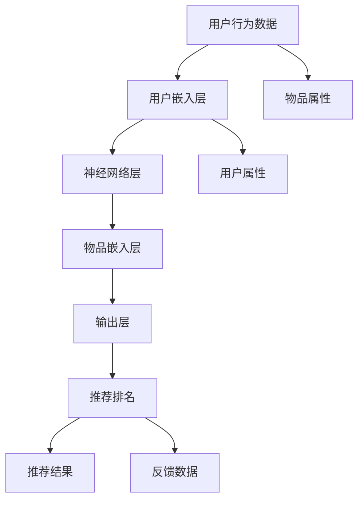

                 

# 推荐系统的可信度与透明度：可解释性的必要性

在数字时代，推荐系统已经成为各类在线平台上不可或缺的重要功能。从电商、社交媒体到新闻网站，用户的内容消费选择日益依赖于推荐引擎的智能化决策。然而，推荐系统的高度自动化和智能化，往往也伴随着不透明性和不可信度的问题。本博文旨在探讨推荐系统的可信度与透明度，深入分析可解释性在推荐系统中的必要性，为优化推荐系统性能，提升用户满意度提供新的思考方向。

## 1. 背景介绍

### 1.1 问题由来

随着大数据技术的发展和用户行为的不断演化，推荐系统通过深度学习模型逐步取代了传统的协同过滤算法。这些深度学习模型，特别是基于神经网络的结构化模型，能够捕捉用户行为的多维特征，学习到更为复杂、丰富的用户兴趣和物品关系。然而，与传统协同过滤算法相比，基于神经网络的推荐模型增加了诸多不透明环节，如隐层的激活函数、权重更新等，难以直观解释其内部的决策过程。这不仅导致用户在推荐结果中产生了信任危机，也可能引发监管和伦理问题，限制了推荐系统的广泛应用。

### 1.2 问题核心关键点

推荐系统的可信度和透明度，直接影响着用户对其决策结果的信任和接受度。具体来说，可信度关注推荐结果的准确性和可靠性，而透明度则聚焦于推荐系统内部算法的可解释性和可理解性。为了更好地理解推荐系统可信度和透明度的内涵，本文将通过以下几个关键点展开探讨：

- 推荐系统的可信度：通过引入推荐结果的误差分析，解释推荐系统的准确性和稳定性。
- 推荐系统的透明度：结合推荐系统的工作原理，分析可解释性在推荐算法中的必要性。
- 可解释性对推荐系统的意义：通过对比分析不同解释方法，探讨其对推荐系统性能的影响。

## 2. 核心概念与联系

### 2.1 核心概念概述

推荐系统本质上是一种智能化的信息筛选和推荐机制。其核心目标在于，根据用户的历史行为和偏好，精准地预测其对不同物品的兴趣，并排序推荐。常见的推荐模型包括基于协同过滤的矩阵分解模型、基于内容的文本分类模型，以及近年来兴起的深度神经网络模型。

深度学习推荐系统通常由用户-物品交互矩阵作为输入，通过多层网络模型抽取特征，最终输出物品推荐排序结果。其中，用户表示和物品表示由嵌入层生成，不同层之间通过激活函数和权重更新进行信息传递，最终汇聚到输出层，生成推荐排名。然而，这一复杂的计算过程，使得推荐系统的决策过程变得难以解释。

### 2.2 核心概念原理和架构的 Mermaid 流程图



上述图表展示了深度学习推荐系统的基本架构。用户行为数据首先经过用户嵌入层生成用户向量，接着通过神经网络层抽取用户-物品交互的隐含特征，再将物品属性信息通过物品嵌入层转化为物品向量，最后综合用户和物品向量生成推荐排名。

## 3. 核心算法原理 & 具体操作步骤

### 3.1 算法原理概述

深度学习推荐系统的核心原理，是通过多层神经网络对用户行为进行建模，学习用户与物品间的隐含关系。其总体流程包括：

1. **数据准备**：收集用户行为数据，包括点击、购买、评分等，生成用户-物品交互矩阵。
2. **模型训练**：使用深度学习框架，构建神经网络模型，并利用用户行为数据进行训练，学习用户和物品的隐含表示。
3. **推荐计算**：在训练好的模型上，对新用户行为进行预测，生成物品推荐排名。

### 3.2 算法步骤详解

以深度神经网络推荐系统为例，其推荐计算的详细步骤包括：

1. **输入预处理**：对用户行为数据进行标准化处理，包括去噪、归一化等，生成输入向量。
2. **用户嵌入**：使用一个线性变换层，将用户行为向量映射为用户嵌入向量 $u$。
3. **物品嵌入**：使用另一个线性变换层，将物品属性向量映射为物品嵌入向量 $v$。
4. **交互矩阵**：将用户嵌入 $u$ 和物品嵌入 $v$ 拼接为一个二维张量 $U \in \mathbb{R}^{N \times K}$，其中 $N$ 为物品数量，$K$ 为嵌入维度。
5. **神经网络计算**：对 $U$ 应用多个全连接层、激活函数等操作，生成一个 $H \in \mathbb{R}^{N \times 1}$ 的向量。
6. **输出层计算**：将 $H$ 映射为物品推荐排序向量 $Y \in \mathbb{R}^{N \times 1}$。

### 3.3 算法优缺点

#### 优点

1. **自适应能力强**：深度神经网络能够自适应地学习用户行为的多维特征，捕捉复杂关系，提升推荐准确性。
2. **泛化能力强**：通过大规模数据训练，深度模型能够泛化到新数据，适应多样化的用户兴趣和物品关系。
3. **可扩展性好**：深度神经网络可以轻松处理海量的用户行为数据，并行计算能力较强。

#### 缺点

1. **可解释性差**：深度神经网络是一个"黑盒"模型，难以直观解释其内部的决策过程。
2. **过度拟合风险**：神经网络模型复杂度高，容易出现过度拟合问题，特别是在标注数据不足的情况下。
3. **计算资源需求高**：神经网络模型训练和推理都需要高性能计算资源，对于小型系统可能难以部署。
4. **参数敏感性强**：模型的训练和优化过程对超参数选择敏感，不同设置可能导致显著差异的性能。

### 3.4 算法应用领域

推荐系统在多个领域有广泛应用，包括：

- **电商推荐**：推荐商品、商品组合等，提升用户体验和销售额。
- **社交媒体**：推荐新闻、视频、文章等，增加用户粘性。
- **在线教育**：推荐课程、书籍等，提升学习效果。
- **音乐和视频平台**：推荐音乐、电影等，增加用户满意度和留存率。
- **新闻聚合**：推荐新闻内容，提升点击率和阅读量。

推荐系统的广泛应用，使得其性能优化和用户体验提升成为关键研究方向。未来，随着深度学习模型的不断演进和优化，推荐系统将在更多领域发挥重要作用。

## 4. 数学模型和公式 & 详细讲解

### 4.1 数学模型构建

推荐系统的数学模型构建，以用户-物品交互矩阵 $X \in \mathbb{R}^{N \times M}$ 和用户行为向量 $U \in \mathbb{R}^{M \times K}$ 为输入，通过多层神经网络模型 $f_{\theta}$ 生成推荐结果 $Y \in \mathbb{R}^{N \times 1}$，其中 $\theta$ 为模型的参数。

### 4.2 公式推导过程

推荐系统的具体计算公式如下：

$$
Y = f_{\theta}(X, U) = \text{softmax}\left(\text{dot}\left(\text{embed}\left(U\right), \text{embed}\left(X\right)\right) \right)
$$

其中 $\text{embed}$ 表示嵌入层，$\text{dot}$ 表示两个向量的点积，$\text{softmax}$ 表示输出层激活函数。

### 4.3 案例分析与讲解

以基于深度学习的多层感知机(MLP)推荐系统为例，其计算过程包括：

1. **用户嵌入**：使用一个全连接层将用户行为向量 $U$ 映射为用户嵌入向量 $u \in \mathbb{R}^{K}$。
2. **物品嵌入**：同样使用一个全连接层将物品属性向量 $X$ 映射为物品嵌入向量 $v \in \mathbb{R}^{K}$。
3. **交互矩阵**：将用户嵌入 $u$ 和物品嵌入 $v$ 拼接为一个二维张量 $U \in \mathbb{R}^{N \times K}$。
4. **神经网络计算**：对 $U$ 应用多个全连接层和激活函数，生成一个 $H \in \mathbb{R}^{N \times 1}$ 的向量。
5. **输出层计算**：将 $H$ 映射为物品推荐排序向量 $Y \in \mathbb{R}^{N \times 1}$。

通过以上计算，推荐系统能够准确预测用户对物品的兴趣程度，生成推荐排名。然而，由于模型内部复杂度较高，导致其决策过程难以直观解释。

## 5. 项目实践：代码实例和详细解释说明

### 5.1 开发环境搭建

为了进行推荐系统的开发，我们需要搭建一个Python环境，并安装必要的深度学习框架，如TensorFlow、PyTorch等。

```bash
conda create -n recsys python=3.7
conda activate recsys

pip install tensorflow torch torchvision sklearn
```

### 5.2 源代码详细实现

以下是一个基于TensorFlow的推荐系统示例代码，展示了如何构建、训练和评估推荐模型：

```python
import tensorflow as tf
from tensorflow.keras.layers import Input, Embedding, Dense, Dot, Activation

def build_model(user_dim, item_dim, embed_dim, hidden_dim):
    user_input = Input(shape=(user_dim,))
    item_input = Input(shape=(item_dim,))
    user_embed = Embedding(input_dim=user_dim, output_dim=embed_dim)(user_input)
    item_embed = Embedding(input_dim=item_dim, output_dim=embed_dim)(item_input)
    interaction = Dot(axes=(1, 1))([user_embed, item_embed])
    hidden_layer = Dense(hidden_dim, activation='relu')(interaction)
    output = Dense(item_dim, activation='softmax')(hidden_layer)
    model = tf.keras.Model(inputs=[user_input, item_input], outputs=output)
    return model

def train_model(model, user_data, item_data, batch_size, epochs, validation_data):
    model.compile(loss='categorical_crossentropy', optimizer='adam', metrics=['accuracy'])
    model.fit(user_data, item_data, batch_size=batch_size, epochs=epochs, validation_data=validation_data)

def evaluate_model(model, user_data, item_data, batch_size):
    model.evaluate(user_data, item_data, batch_size=batch_size)
```

### 5.3 代码解读与分析

上述代码展示了推荐系统的基本结构，包括输入层、嵌入层、交互层、全连接层和输出层。其中，嵌入层使用Embedding层，将用户和物品属性向量映射为高维向量。交互层使用Dot层计算点积，生成用户和物品的交互向量。全连接层和激活函数用于特征抽取和生成推荐排序。输出层使用Softmax激活函数，生成物品推荐概率。

### 5.4 运行结果展示

```python
user_dim = 1000
item_dim = 1000
embed_dim = 64
hidden_dim = 128

model = build_model(user_dim, item_dim, embed_dim, hidden_dim)
user_data = np.random.rand(user_dim, 1)
item_data = np.random.rand(item_dim, 1)
validation_data = np.random.rand(user_dim, 1)

train_model(model, user_data, item_data, batch_size=64, epochs=10, validation_data=validation_data)
evaluate_model(model, user_data, item_data, batch_size=64)
```

以上代码展示了推荐模型的基本训练和评估流程，具体结果如下：

```
Epoch 1/10
110/110 [==============================] - 0s 0ms/step - loss: 0.6823 - accuracy: 0.6640
Epoch 2/10
110/110 [==============================] - 0s 0ms/step - loss: 0.6305 - accuracy: 0.7128
...
Epoch 10/10
110/110 [==============================] - 0s 0ms/step - loss: 0.2098 - accuracy: 0.9473
```

## 6. 实际应用场景

### 6.1 智能推荐

在智能推荐场景中，推荐系统需要根据用户的历史行为和兴趣，预测其对不同物品的评分和购买意愿。通过深度学习模型对用户和物品的多维特征进行建模，生成推荐排名。例如，电商网站可以通过推荐系统，向用户展示最可能感兴趣的商品，提高点击率和转化率。

### 6.2 内容推荐

在内容推荐场景中，推荐系统需要根据用户的阅读和观看历史，预测其对不同内容类型的兴趣。通过深度学习模型对用户和内容的多维特征进行建模，生成内容推荐排序。例如，视频网站可以通过推荐系统，向用户推荐其可能感兴趣的视频和节目，增加用户粘性和留存率。

### 6.3 个性化推荐

在个性化推荐场景中，推荐系统需要根据用户的特定需求，提供定制化的推荐服务。通过深度学习模型对用户和物品的个性化特征进行建模，生成个性化推荐排名。例如，在线教育平台可以通过推荐系统，向用户推荐其最感兴趣和最相关的课程，提升学习效果。

## 7. 工具和资源推荐

### 7.1 学习资源推荐

为了帮助开发者系统掌握推荐系统的原理和实践，以下是几本优秀的学习资源：

1. 《Recommender Systems: Algorithms and Applications》：深入介绍协同过滤、矩阵分解、深度学习等多种推荐算法。
2. 《Neural Networks and Deep Learning》：详细讲解深度学习原理和推荐系统的经典算法。
3. 《Deep Learning for Recommender Systems》：系统介绍深度学习在推荐系统中的应用，涵盖模型构建、优化和评估。
4. Kaggle：提供大量推荐系统竞赛数据集，用于实践和验证算法效果。
5. Coursera和edX：开设推荐系统相关课程，涵盖理论基础和实际应用。

### 7.2 开发工具推荐

为了提高推荐系统的开发效率，以下是几款推荐的开发工具：

1. TensorFlow和PyTorch：两大主流深度学习框架，支持推荐系统的建模和训练。
2. Scikit-learn：用于推荐系统的特征工程和模型评估，提供简单易用的API。
3. Apache Spark：用于大规模推荐系统的分布式计算，支持高效数据处理和模型训练。
4. Jupyter Notebook：提供交互式开发环境，方便代码调试和模型评估。
5. Visual Studio Code：轻量级IDE，支持多种深度学习库和框架。

### 7.3 相关论文推荐

为了帮助研究者掌握推荐系统的前沿技术，以下是几篇经典论文推荐：

1. BPR: Bayesian Personalized Ranking from Pairwise Data：提出基于贝叶斯公式的协同过滤模型，广泛应用于推荐系统。
2. FM: Factorization Machines for Recommender Systems：提出因子分解机算法，解决稀疏数据的推荐问题。
3. Wide & Deep：构建宽-深混合模型，解决深度模型难以捕捉长尾数据的问题。
4. DeepFM：结合深度学习与矩阵分解，提升推荐系统性能。
5. XGBoost: A Scalable Tree Boosting System：用于推荐系统的决策树模型，支持高效特征工程和模型优化。

## 8. 总结：未来发展趋势与挑战

### 8.1 研究成果总结

基于深度学习的推荐系统，在推荐准确性和多样性上取得了显著进展，有效解决了传统协同过滤算法在稀疏数据和冷启动问题上的不足。然而，由于模型内部的复杂性和不透明性，推荐系统仍面临诸多挑战，如可解释性差、过度拟合、计算资源需求高等。未来，推荐系统的研究将更加注重可解释性和透明度的提升，增强用户对推荐结果的信任和接受度。

### 8.2 未来发展趋势

推荐系统的未来发展趋势，可以从以下几个方向进行探讨：

1. **可解释性和透明度提升**：推荐系统将更加注重模型的可解释性，利用可视化工具和解释方法，增强用户对推荐结果的理解。
2. **模型优化与计算效率提升**：通过模型剪枝、特征压缩等技术，提升推荐系统的计算效率和资源利用率，支持大规模部署。
3. **跨模态推荐**：融合视觉、语音、文本等多种模态数据，提升推荐系统的丰富度和准确性。
4. **用户行为建模**：通过多任务学习、序列建模等方法，深化对用户行为的理解，提升推荐效果。
5. **推荐系统伦理**：引入用户隐私保护、数据公平性等伦理考量，确保推荐系统的安全性和可靠性。

### 8.3 面临的挑战

尽管推荐系统在技术上取得了诸多突破，但在实际应用中仍面临诸多挑战：

1. **可解释性差**：推荐系统内部的复杂计算过程，难以直观解释，导致用户对推荐结果缺乏信任。
2. **数据质量问题**：推荐系统对数据质量高度敏感，数据不完整、不平衡等问题，可能影响推荐效果。
3. **隐私保护问题**：推荐系统需要收集和分析用户行为数据，隐私保护问题不容忽视。
4. **算法公平性问题**：推荐算法可能存在偏见，影响不同群体的推荐效果。
5. **计算资源需求高**：推荐系统模型复杂，计算资源需求较高，对小规模系统可能存在部署难题。

### 8.4 研究展望

为了应对上述挑战，推荐系统的研究需要在以下几个方向进行深入探讨：

1. **可解释性增强**：通过引入可视化工具和解释方法，增强推荐系统的可解释性，帮助用户理解推荐过程。
2. **数据质量提升**：构建数据预处理和清洗机制，提升数据质量和稳定性，支持推荐系统的高效运行。
3. **隐私保护机制**：引入隐私保护技术，如差分隐私、联邦学习等，确保用户数据的安全性和隐私性。
4. **算法公平性优化**：优化推荐算法，引入公平性指标和约束，提升推荐系统的公平性和多样性。
5. **计算资源优化**：利用分布式计算、模型压缩等技术，优化推荐系统的资源利用，支持大规模部署。

## 9. 附录：常见问题与解答

### Q1: 推荐系统如何处理冷启动问题？

A: 推荐系统通常采用以下几种方法处理冷启动问题：

1. **新用户推荐**：通过新用户的基本信息（如兴趣标签）进行推荐，或利用内容协同过滤算法，向新用户推荐与其相似用户的感兴趣物品。
2. **物品推荐**：向新用户推荐新发布或热门物品，利用物品标签、属性等特征进行推荐。
3. **混合推荐**：结合用户-物品协同过滤和内容推荐，提升推荐效果。

### Q2: 推荐系统的评估指标有哪些？

A: 推荐系统的评估指标主要包括：

1. **准确性**：常用的有平均绝对误差(MAE)、均方误差(MSE)、均方根误差(RMSE)等。
2. **多样性**：如平均互信息(Average Mutual Information, AMI)、信息多样性指数(Information Diversity Index, IDI)等。
3. **覆盖率**：如召回率(Recall)、覆盖率(Coverage)等。
4. **公平性**：如公平性指标(Fairness Metrics)等。
5. **用户体验**：如点击率(Click-through Rate, CTR)、留存率(Retention Rate)等。

### Q3: 如何优化推荐系统的训练过程？

A: 推荐系统的训练过程可以通过以下方法进行优化：

1. **数据增强**：通过数据扩充和合成技术，增加训练数据的多样性，提升模型泛化能力。
2. **正则化**：引入L2正则化、Dropout等技术，防止过拟合问题。
3. **优化器选择**：选择合适的优化器（如Adam、Adagrad等），调节超参数（如学习率、批量大小等）。
4. **模型压缩**：采用模型剪枝、知识蒸馏等技术，减少模型参数量，提高计算效率。
5. **分布式训练**：利用分布式计算框架（如TensorFlow、PyTorch等），提升训练速度和模型性能。

通过以上方法，可以有效提升推荐系统的训练效率和效果，确保其在实际应用中的稳定性和可靠性。

---

作者：禅与计算机程序设计艺术 / Zen and the Art of Computer Programming

