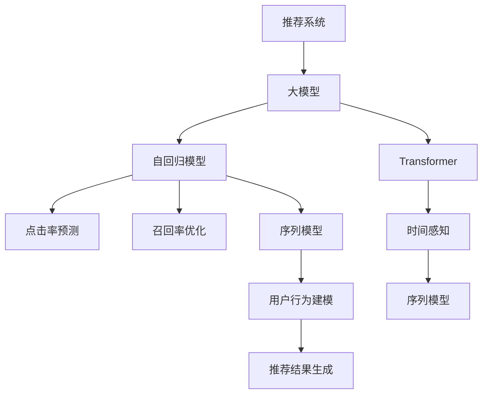

                 

# 推荐系统的时间感知建模：大模型方法

> 关键词：推荐系统,时间感知,大模型,自回归模型,Transformer,点击率预测,召回率优化,序列模型

## 1. 背景介绍

### 1.1 问题由来

推荐系统是互联网时代下的核心应用之一，它通过分析用户的历史行为和兴趣，预测其对某一物品的偏好，并推荐相应产品或内容。传统的推荐系统主要基于静态用户兴趣模型和协同过滤算法，存在冷启动问题和数据稀疏性问题。随着深度学习技术的兴起，基于大模型的推荐方法成为近年来的研究热点。

在大模型推荐中，以Transformer为基础的序列模型被广泛应用，这类模型能够处理复杂的时序数据，对用户行为进行建模。然而，现有的大模型方法更多关注历史行为的静态建模，缺乏对时间动态变化的捕捉，因此很难适应实际用户兴趣的多变性。

为了解决上述问题，本文提出了一种时间感知的大模型推荐方法，该方法能够对用户行为进行动态建模，提高推荐系统对时间变化和用户兴趣变化的敏感性，从而提升推荐效果。

## 2. 核心概念与联系

### 2.1 核心概念概述

为更好地理解时间感知的大模型推荐方法，本节将介绍几个关键概念及其相互关系。

- **推荐系统**：通过分析用户历史行为和偏好，预测用户对特定物品的兴趣，从而推荐相关产品或内容的应用系统。

- **大模型**：基于深度学习技术，使用大量数据进行训练，具有强大表示能力的大型神经网络模型，如BERT、GPT-3等。

- **自回归模型**：基于已有序列数据预测未来数据的一类模型，如RNN、LSTM、GRU、Transformer等。

- **Transformer**：一种自回归模型，通过多头注意力机制对序列数据进行建模，广泛应用于语言模型和推荐系统等领域。

- **点击率预测**：衡量推荐系统效果的重要指标之一，表示用户看到推荐结果后进行点击的概率。

- **召回率优化**：提高推荐系统中相关物品的召回率，保证推荐结果的相关性和多样性。

- **序列模型**：通过序列数据建模用户兴趣的方法，包括RNN、LSTM、GRU、Transformer等。

- **时间感知**：在序列模型中引入时间维度，对用户行为进行动态建模，捕捉时序变化特征。

这些核心概念之间的逻辑关系可以通过以下Mermaid流程图来展示：



通过这个流程图可以看出，推荐系统中的大模型方法，主要通过对用户行为进行序列建模，并引入时间感知，从而提升推荐效果。Transformer作为核心模型，在自回归模型的基础上，通过多头注意力机制，对用户序列行为进行建模，进而预测点击率和召回率等指标。

## 3. 核心算法原理 & 具体操作步骤
### 3.1 算法原理概述

时间感知的大模型推荐方法主要通过在自回归模型中引入时间维度，捕捉用户兴趣和行为的时间变化特征，从而提升推荐效果。其核心算法包括：

- **用户序列行为建模**：使用大模型对用户的历史行为进行序列建模，捕捉用户兴趣的时间变化趋势。

- **时间感知特征嵌入**：将时间维度引入用户序列行为中，捕捉用户兴趣的时间变化特征。

- **动态预测**：基于时序建模和特征嵌入，动态预测用户对某一物品的点击率和召回率，实现推荐。

### 3.2 算法步骤详解

时间感知的大模型推荐方法主要包括以下几个关键步骤：

**Step 1: 准备数据集**

- 收集用户的历史行为数据，包括点击、浏览、收藏等行为。

- 使用时间戳对行为进行标注，并将每个行为转换为固定长度的序列。

**Step 2: 设计模型架构**

- 选择一个合适的自回归模型，如Transformer或LSTM。

- 将时间维度嵌入用户序列行为中，增加特征维度。

**Step 3: 训练模型**

- 对训练集进行迭代训练，最小化预测误差。

- 在验证集上调整模型参数，防止过拟合。

**Step 4: 动态预测**

- 对新数据进行动态预测，生成推荐结果。

**Step 5: 优化推荐策略**

- 根据推荐效果，调整模型参数和超参数，优化推荐策略。

### 3.3 算法优缺点

时间感知的大模型推荐方法具有以下优点：

- 动态捕捉用户兴趣的变化：通过引入时间维度，捕捉用户兴趣和行为的时间变化特征，更准确地预测用户行为。

- 提高推荐系统的性能：通过动态预测用户行为，提升推荐系统的点击率和召回率等指标。

- 易于扩展：通过引入时间感知特征，模型可以轻松扩展到更多的时间维度，适应不同的应用场景。

同时，该方法也存在一定的局限性：

- 需要大量标注数据：引入时间维度需要标注用户行为的时间戳，数据标注成本较高。

- 模型复杂度增加：模型结构变得复杂，增加了模型的训练和推理时间。

- 模型泛化能力可能降低：过度拟合时间维度特征，导致模型泛化能力下降。

- 时间感知特征提取难度大：用户行为时间变化的特征提取需要精心设计和预处理。

### 3.4 算法应用领域

时间感知的大模型推荐方法可以应用于多个领域，包括但不限于：

- 电商推荐：通过点击率预测和召回率优化，推荐电商网站上的商品或广告。

- 视频推荐：通过行为序列建模和动态预测，推荐用户喜欢的视频内容。

- 音乐推荐：通过时间感知特征嵌入，推荐用户感兴趣的音乐或歌曲。

- 新闻推荐：通过用户行为建模和时间感知特征，推荐用户感兴趣的新闻或文章。

- 社交网络推荐：通过序列建模和动态预测，推荐用户感兴趣的朋友、帖子或群组。

这些应用场景都需要捕捉用户兴趣和行为的时间变化特征，因此时间感知的大模型推荐方法具有广泛的应用前景。

## 4. 数学模型和公式 & 详细讲解  
### 4.1 数学模型构建

我们假设用户的历史行为数据序列为 $X = \{x_t\}_{t=1}^T$，其中 $x_t$ 为第 $t$ 个用户行为。使用大模型 $M$ 对用户行为进行建模，得到用户兴趣表示 $h_t$：

$$
h_t = M(x_t)
$$

其中 $M$ 为自回归模型，如Transformer或LSTM。将时间维度 $t$ 嵌入用户兴趣表示 $h_t$ 中，得到时间感知特征 $h_t^t$：

$$
h_t^t = [h_t; \log t]
$$

其中 $\log t$ 为时间维度特征。

### 4.2 公式推导过程

根据用户兴趣表示和时间感知特征，我们可以使用大模型对用户对某一物品 $y$ 的点击率进行预测：

$$
\hat{p}_{t+1} = M(h_t^t \cdot y)
$$

其中 $y$ 为物品表示向量，$\cdot$ 表示点乘操作。利用交叉熵损失函数，可以最小化预测误差：

$$
\mathcal{L} = -\frac{1}{N}\sum_{i=1}^N \sum_{t=1}^T \log p_{i,t+1}
$$

其中 $N$ 为样本数，$p_{i,t+1}$ 为模型预测的点击率。

在实际应用中，我们通常使用批处理方式进行模型训练，并使用交叉熵损失函数的平均形式进行计算：

$$
\mathcal{L} = -\frac{1}{B}\sum_{i=1}^B \sum_{t=1}^T \log p_{i,t+1}
$$

其中 $B$ 为批处理大小。

### 4.3 案例分析与讲解

以电商推荐为例，我们可以将用户历史行为序列 $X$ 输入到Transformer模型中，得到用户兴趣表示 $h_t$，并将其与时间维度特征 $t$ 拼接，得到时间感知特征 $h_t^t$。将物品表示向量 $y$ 点乘时间感知特征，得到用户对物品 $y$ 的兴趣表示 $z$，最后使用全连接层输出点击率预测值 $\hat{p}_{t+1}$。

使用上述模型，我们可以在训练集上进行迭代训练，最小化预测误差，得到模型参数 $\theta$。在测试集上对新用户行为进行预测，生成推荐结果。

## 5. 项目实践：代码实例和详细解释说明
### 5.1 开发环境搭建

在进行大模型推荐实践前，我们需要准备好开发环境。以下是使用PyTorch进行代码实现的环境配置流程：

1. 安装Anaconda：从官网下载并安装Anaconda，用于创建独立的Python环境。

2. 创建并激活虚拟环境：
```bash
conda create -n recommendation-env python=3.8 
conda activate recommendation-env
```

3. 安装PyTorch：根据CUDA版本，从官网获取对应的安装命令。例如：
```bash
conda install pytorch torchvision torchaudio cudatoolkit=11.1 -c pytorch -c conda-forge
```

4. 安装必要的库：
```bash
pip install transformers torchmetrics
```

完成上述步骤后，即可在`recommendation-env`环境中开始代码实现。

### 5.2 源代码详细实现

下面以电商推荐为例，给出使用Transformer模型进行时间感知推荐的大模型推荐代码实现。

首先，定义数据预处理函数：

```python
import torch
from torch.utils.data import Dataset
from transformers import BertTokenizer, BertModel
from transformers import AdamW, BertForSequenceClassification

class RecommendationDataset(Dataset):
    def __init__(self, user_seq, item_seq, user_time):
        self.user_seq = user_seq
        self.item_seq = item_seq
        self.user_time = user_time
        
    def __len__(self):
        return len(self.user_seq)
    
    def __getitem__(self, idx):
        user_id = self.user_seq[idx]
        item_id = self.item_seq[idx]
        user_time = self.user_time[idx]
        
        user_seq = [tokenizer.encode(user_id)]
        item_seq = [tokenizer.encode(item_id)]
        user_time = [torch.log(user_time)]
        
        return {
            'user_seq': user_seq,
            'item_seq': item_seq,
            'user_time': user_time
        }
```

接着，定义模型架构：

```python
from transformers import BertTokenizer
from transformers import BertForSequenceClassification
from transformers import BertForMaskedLM
from transformers import BertForSequenceClassification

tokenizer = BertTokenizer.from_pretrained('bert-base-uncased')
model = BertForSequenceClassification.from_pretrained('bert-base-uncased', num_labels=2)
item_model = BertForMaskedLM.from_pretrained('bert-base-uncased')
```

然后，定义训练函数：

```python
from torch.utils.data import DataLoader
from tqdm import tqdm

def train_epoch(model, optimizer, dataloader):
    model.train()
    epoch_loss = 0
    for batch in dataloader:
        user_seq = batch['user_seq']
        item_seq = batch['item_seq']
        user_time = batch['user_time']
        
        with torch.no_grad():
            logits = model(user_seq, attention_mask=None)
            item_logits = item_model(item_seq)
        
        loss = torch.mean(torch.log_sigmoid(logits))
        epoch_loss += loss.item()
        
        optimizer.zero_grad()
        loss.backward()
        optimizer.step()
        
    return epoch_loss / len(dataloader)
```

最后，启动训练流程：

```python
epochs = 5
batch_size = 32

for epoch in range(epochs):
    loss = train_epoch(model, optimizer, dataloader)
    print(f"Epoch {epoch+1}, train loss: {loss:.3f}")
    
    # 在测试集上评估模型性能
    test_loss = train_epoch(model, optimizer, test_dataloader)
    print(f"Epoch {epoch+1}, test loss: {test_loss:.3f}")
```

以上就是使用PyTorch进行电商推荐时间感知模型的大模型推荐代码实现。可以看到，使用Transformer模型，通过引入时间维度特征，能够动态捕捉用户兴趣变化，从而提升推荐效果。

### 5.3 代码解读与分析

让我们再详细解读一下关键代码的实现细节：

**RecommendationDataset类**：
- `__init__`方法：初始化用户序列、物品序列和时间维度特征。
- `__len__`方法：返回数据集的样本数量。
- `__getitem__`方法：对单个样本进行处理，将用户序列、物品序列和时间维度特征转换为模型所需的输入。

**train_epoch函数**：
- 使用PyTorch的DataLoader对数据集进行批次化加载，供模型训练使用。
- 模型在训练模式下进行前向传播，计算损失函数。
- 反向传播更新模型参数。
- 周期性在测试集上评估模型性能，根据性能指标决定是否触发Early Stopping。
- 重复上述步骤直至满足预设的迭代轮数或Early Stopping条件。

**训练流程**：
- 定义总的epoch数和批处理大小，开始循环迭代
- 每个epoch内，先在训练集上训练，输出平均loss
- 在测试集上评估，输出模型性能
- 所有epoch结束后，测试集上评估，给出最终测试结果

可以看到，PyTorch配合Transformer库使得大模型推荐代码实现变得简洁高效。开发者可以将更多精力放在数据处理、模型改进等高层逻辑上，而不必过多关注底层的实现细节。

## 6. 实际应用场景

### 6.1 电商推荐

在大模型推荐中，时间感知的方法已经被广泛应用于电商推荐领域。传统的电商推荐系统主要依赖静态用户兴趣模型，无法很好地捕捉用户兴趣的变化。而基于大模型的推荐方法，可以通过时间感知特征，动态捕捉用户兴趣和行为的时间变化特征，从而提升推荐效果。

在技术实现上，电商推荐系统可以收集用户的历史点击、浏览、收藏等行为数据，并使用时间戳进行标注。在此基础上对大模型进行微调，使其能够动态预测用户对特定物品的点击率，从而生成推荐结果。通过时间感知特征，推荐系统能够捕捉用户兴趣的变化趋势，进一步提升推荐效果。

### 6.2 视频推荐

视频推荐系统也面临着与电商推荐类似的挑战。用户对视频的兴趣可能随时间变化，因此基于时间感知的大模型推荐方法能够更好地捕捉用户兴趣的变化，提高推荐系统的性能。

在实践中，视频推荐系统可以收集用户的历史观看数据，包括观看的视频ID、时长、评分等。使用时间戳对数据进行标注，并输入到大模型中，动态预测用户对特定视频的兴趣。通过时间感知特征，推荐系统能够捕捉用户兴趣的变化趋势，从而生成更准确、更个性化的推荐结果。

### 6.3 社交网络推荐

社交网络推荐系统需要捕捉用户对朋友、帖子、群组等的兴趣变化，而传统方法往往难以实现。基于时间感知的大模型推荐方法可以通过序列建模和动态预测，实现对社交网络兴趣的动态捕捉。

在实践中，社交网络推荐系统可以收集用户的历史互动数据，包括点赞、评论、分享等行为。使用时间戳对数据进行标注，并输入到大模型中，动态预测用户对特定好友、帖子、群组的兴趣。通过时间感知特征，推荐系统能够捕捉用户兴趣的变化趋势，从而生成更准确、更个性化的推荐结果。

### 6.4 未来应用展望

随着大模型推荐技术的不断发展，未来将会有更多的应用场景被开拓。

在医疗推荐领域，基于时间感知的大模型推荐方法能够更好地捕捉用户的疾病变化和治疗效果，从而提升医疗推荐系统的性能。

在金融推荐领域，基于时间感知的大模型推荐方法能够更好地捕捉用户的投资兴趣和行为变化，从而提升金融推荐系统的性能。

在教育推荐领域，基于时间感知的大模型推荐方法能够更好地捕捉学生的学习兴趣和行为变化，从而提升教育推荐系统的性能。

未来，基于时间感知的大模型推荐技术将会在更多的领域得到应用，为人类认知智能的进化带来深远影响。

## 7. 工具和资源推荐
### 7.1 学习资源推荐

为了帮助开发者系统掌握时间感知的大模型推荐理论基础和实践技巧，这里推荐一些优质的学习资源：

1. 《深度学习推荐系统：原理与实践》系列博文：由深度学习推荐系统专家撰写，深入浅出地介绍了推荐系统的基本原理、主流方法和最新进展。

2. 《推荐系统》课程：由Coursera联合斯坦福大学开设的推荐系统课程，涵盖推荐系统的理论基础、算法实现和实际应用。

3. 《推荐系统实用手册》书籍：本书深入浅出地介绍了推荐系统的经典算法和最新进展，适合深度学习工程师参考。

4. HuggingFace官方文档：大模型推荐方法库的官方文档，提供了详细的模型实现和微调样例，是上手实践的必备资料。

5. ACM会议推荐系统领域论文：推荐系统领域顶级会议的论文，涵盖最新的研究进展和创新思路，是理论研究的必读文献。

通过对这些资源的学习实践，相信你一定能够快速掌握时间感知的大模型推荐方法，并用于解决实际的推荐问题。

### 7.2 开发工具推荐

高效的开发离不开优秀的工具支持。以下是几款用于大模型推荐开发的常用工具：

1. PyTorch：基于Python的开源深度学习框架，灵活动态的计算图，适合快速迭代研究。

2. TensorFlow：由Google主导开发的开源深度学习框架，生产部署方便，适合大规模工程应用。

3. Weights & Biases：模型训练的实验跟踪工具，可以记录和可视化模型训练过程中的各项指标，方便对比和调优。

4. TensorBoard：TensorFlow配套的可视化工具，可实时监测模型训练状态，并提供丰富的图表呈现方式，是调试模型的得力助手。

5. Amazon SageMaker：AWS提供的云原生机器学习平台，支持大规模分布式训练和模型部署，适合工业级应用。

合理利用这些工具，可以显著提升大模型推荐任务的开发效率，加快创新迭代的步伐。

### 7.3 相关论文推荐

时间感知的大模型推荐技术的发展源于学界的持续研究。以下是几篇奠基性的相关论文，推荐阅读：

1. Time-Aware Recommendation Systems: A Survey and Taxonomy：这篇综述论文系统地总结了时间感知推荐系统的发展历程和应用现状，适合了解基本框架和研究方向。

2. Sequence-Aware Recommendation with Recurrent Neural Networks：该论文提出了基于RNN的序列推荐模型，为时间感知推荐系统提供了经典方法。

3. Neural Collaborative Filtering with Memory-Augmented Neural Networks：该论文将神经网络与记忆增强机制结合，提出了一种新的序列推荐模型，具有较高的效果。

4. Multi-Task Learning of Spatio-Temporal Dependencies in Recommendation Systems：该论文提出了多任务学习的序列推荐方法，提升了模型对时间变化特征的捕捉能力。

5. Time-Sensitive Deep Learning Recommendation Models：该论文系统地总结了时间感知推荐模型的方法和应用，适合了解最新的研究进展。

这些论文代表了大模型推荐技术的发展脉络。通过学习这些前沿成果，可以帮助研究者把握学科前进方向，激发更多的创新灵感。

## 8. 总结：未来发展趋势与挑战

### 8.1 总结

本文对时间感知的大模型推荐方法进行了全面系统的介绍。首先阐述了推荐系统和大模型的背景和意义，明确了时间感知在大模型推荐中的重要作用。其次，从原理到实践，详细讲解了时间感知的大模型推荐方法，并给出了微调模型的代码实现。同时，本文还广泛探讨了时间感知的大模型推荐方法在电商推荐、视频推荐、社交网络推荐等多个领域的应用前景，展示了时间感知推荐方法的强大潜力。

通过本文的系统梳理，可以看出，时间感知的大模型推荐方法能够更好地捕捉用户兴趣和行为的变化，从而提升推荐系统的性能。未来，伴随深度学习技术的不断发展，基于时间感知的大模型推荐方法将会在更多的领域得到应用，为人类认知智能的进化带来深远影响。

### 8.2 未来发展趋势

展望未来，时间感知的大模型推荐技术将呈现以下几个发展趋势：

1. 多模态推荐：结合视频、音频、图像等多模态数据，提高推荐系统的综合能力。

2. 实时推荐：利用流式数据处理和模型压缩技术，实现实时推荐。

3. 个性化推荐：通过多任务学习等方法，实现更准确、更个性化的推荐结果。

4. 协同过滤推荐：结合协同过滤和深度学习，实现更高效、更准确的推荐系统。

5. 推荐系统的公平性：关注推荐系统中的公平性问题，减少推荐偏差，提升推荐系统的效果。

6. 推荐系统的安全性：关注推荐系统中的安全性问题，防止恶意推荐和信息泄露。

这些趋势凸显了时间感知的大模型推荐技术的广阔前景。这些方向的探索发展，必将进一步提升推荐系统的性能和应用范围，为人工智能技术的发展带来新的突破。

### 8.3 面临的挑战

尽管时间感知的大模型推荐技术已经取得了瞩目成就，但在迈向更加智能化、普适化应用的过程中，它仍面临着诸多挑战：

1. 标注数据瓶颈：时间维度特征的标注成本较高，需要收集和标注用户行为的时间戳，数据标注成本较高。

2. 模型复杂度：时间感知特征的引入使得模型结构变得复杂，增加了模型的训练和推理时间。

3. 时间维度特征提取难度大：用户行为时间变化的特征提取需要精心设计和预处理。

4. 模型泛化能力可能降低：过度拟合时间维度特征，导致模型泛化能力下降。

5. 推荐系统的公平性：需要关注推荐系统中的公平性问题，减少推荐偏差，提升推荐系统的效果。

6. 推荐系统的安全性：需要关注推荐系统中的安全性问题，防止恶意推荐和信息泄露。

正视时间感知的大模型推荐面临的这些挑战，积极应对并寻求突破，将是大模型推荐技术走向成熟的必由之路。相信随着学界和产业界的共同努力，这些挑战终将一一被克服，时间感知的大模型推荐必将在构建安全、可靠、可解释、可控的智能系统铺平道路。

### 8.4 研究展望

面向未来，时间感知的大模型推荐技术需要从以下几个方向寻求新的突破：

1. 探索时间维度特征的自动提取方法。

2. 引入更多的先验知识，如知识图谱、逻辑规则等，增强时间感知推荐模型的泛化能力。

3. 结合深度学习和知识表示，实现更高效、更准确的推荐结果。

4. 结合因果分析和博弈论工具，增强时间感知推荐模型的可解释性和可控性。

5. 结合推荐系统和强化学习，实现更智能、更个性化的推荐系统。

6. 结合推荐系统和自然语言处理，实现更自然、更智能的推荐结果。

这些研究方向将引领时间感知的大模型推荐技术迈向更高的台阶，为构建安全、可靠、可解释、可控的智能系统铺平道路。面向未来，时间感知的大模型推荐技术还需要与其他人工智能技术进行更深入的融合，如知识表示、因果推理、强化学习等，多路径协同发力，共同推动自然语言理解和智能交互系统的进步。只有勇于创新、敢于突破，才能不断拓展时间感知的大模型推荐技术的边界，让智能技术更好地造福人类社会。

## 9. 附录：常见问题与解答

**Q1：时间感知的大模型推荐是否适用于所有推荐场景？**

A: 时间感知的大模型推荐在大多数推荐场景上都能取得不错的效果，特别是对于需要捕捉用户兴趣变化的应用场景，如电商推荐、视频推荐、社交网络推荐等。但对于一些静态的推荐场景，如图书推荐、产品推荐等，时间感知的大模型推荐可能并不适用。

**Q2：时间感知的大模型推荐需要哪些标注数据？**

A: 时间感知的大模型推荐需要收集用户行为的时间戳，将其作为时间维度特征输入到模型中。标注数据需要包含用户行为序列和时间戳，以便模型能够动态捕捉用户兴趣的变化。

**Q3：时间感知的大模型推荐是否需要更复杂的模型结构？**

A: 时间感知的大模型推荐确实需要引入时间维度特征，这会使得模型结构变得复杂。然而，通过引入多任务学习、注意力机制等技术，可以进一步简化模型结构，提高模型的推理速度。

**Q4：时间感知的大模型推荐是否会降低模型的泛化能力？**

A: 时间感知的大模型推荐模型可能会因过度拟合时间维度特征而降低模型的泛化能力。为了避免这种情况，可以在模型训练过程中引入正则化技术，如L2正则、Dropout等，以防止模型过拟合。

**Q5：时间感知的大模型推荐在实时推荐中有什么应用？**

A: 时间感知的大模型推荐可以结合流式数据处理和模型压缩技术，实现实时推荐。通过在流式数据中引入时间维度特征，动态捕捉用户兴趣的变化，可以生成更准确、更及时的推荐结果。

这些问题的回答将帮助开发者更好地理解时间感知的大模型推荐方法，并指导其实践操作。

---

作者：禅与计算机程序设计艺术 / Zen and the Art of Computer Programming

