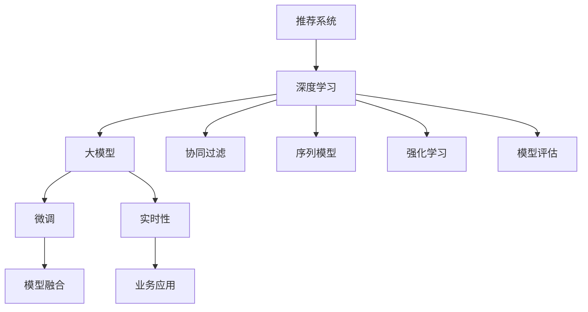

                 

# 推荐系统的未来发展方向：大模型的主流化

> 关键词：推荐系统, 大模型, 深度学习, 协同过滤, 序列模型, 强化学习, 优化算法, 用户行为, 点击率预测, 用户兴趣, 模型评估, 业务场景

## 1. 背景介绍

### 1.1 问题由来

推荐系统是互联网时代最重要的技术之一，它通过预测用户对商品的兴趣，并根据这些兴趣为用户推荐可能感兴趣的商品。推荐系统已经在电商、视频、新闻等多个领域实现了广泛应用，显著提升了用户体验和满意度。

随着数据的积累和计算能力的提升，推荐系统的发展也经历了多个阶段。早期基于协同过滤的方法通过分析用户之间的相似性来推荐商品。随后，基于内容的推荐方法通过分析商品之间的相似性来推荐。这些方法主要依赖于历史数据和静态特征，难以应对用户兴趣的多变性。

为了更好地适应用户兴趣的动态变化，深度学习逐渐成为推荐系统的主流技术。深度学习可以通过复杂的神经网络结构，从用户行为数据中挖掘深层次的特征，并学习动态的推荐模型。深度学习模型包括序列模型和协同过滤模型，分别通过神经网络学习用户和商品的表示，以及用户与商品的交互序列。

尽管深度学习模型取得了显著的进展，但在大规模数据和复杂业务场景下，深度学习模型的训练和推理开销巨大，难以快速响应。为了解决这些问题，大模型推荐系统应运而生。

### 1.2 问题核心关键点

大模型推荐系统通过在大规模数据上进行预训练，学习到丰富的用户和商品特征，然后在特定业务场景中进行微调，以获得更加精准的推荐结果。大模型推荐系统主要有以下几个关键点：

1. 预训练：通过大规模数据训练大模型，学习用户和商品的表示。
2. 微调：在特定业务场景下对大模型进行微调，学习特定的推荐目标。
3. 模型融合：通过融合多个大模型的输出，提升推荐的准确性和鲁棒性。
4. 实时性：在微调模型和模型融合的基础上，通过优化算法实现实时推荐。
5. 业务应用：将推荐模型部署到业务场景中，实现精准推荐。

这些关键点共同构成了大模型推荐系统的核心技术框架，使其能够在复杂业务场景中实现高效精准的推荐。

### 1.3 问题研究意义

大模型推荐系统在推荐精度、实时性和业务适用性等方面均具有显著优势，是推荐系统未来的重要发展方向。

1. 推荐精度：大模型通过预训练学习到丰富的特征，能够更好地捕捉用户和商品的动态变化，提升推荐精度。
2. 实时性：大模型的推理速度相对较慢，但通过模型融合和实时优化算法，能够快速响应业务需求，实现实时推荐。
3. 业务适用性：大模型能够处理复杂多变的业务场景，通过微调和融合技术，适应不同的推荐业务。

此外，大模型推荐系统还能在广告投放、内容推荐、个性化服务等多个业务场景中发挥重要作用，提升用户体验和业务收益。

## 2. 核心概念与联系

### 2.1 核心概念概述

为更好地理解大模型推荐系统，本节将介绍几个关键概念：

- 推荐系统：通过预测用户对商品的兴趣，为用户推荐可能感兴趣的商品。
- 深度学习：通过神经网络模型学习用户和商品的特征，构建复杂的推荐模型。
- 大模型：在大规模数据上进行预训练，学习到丰富的用户和商品特征的深度学习模型。
- 协同过滤：通过分析用户和商品之间的相似性，为用户推荐商品。
- 序列模型：通过神经网络学习用户与商品的交互序列，预测用户对商品的兴趣。
- 强化学习：通过奖励机制优化推荐策略，提升推荐精度。
- 模型评估：通过各种指标评估推荐模型的性能，如精确度、召回率、F1值等。

这些核心概念之间的逻辑关系可以通过以下Mermaid流程图来展示：



这个流程图展示了推荐系统的核心概念及其之间的联系：

1. 推荐系统通过深度学习技术，构建复杂的推荐模型。
2. 深度学习使用大模型进行预训练，学习丰富的用户和商品特征。
3. 协同过滤、序列模型和强化学习等技术，是深度学习的具体实现方法。
4. 模型评估用于评估推荐模型的性能，指导模型优化。
5. 微调和模型融合技术，进一步提升推荐精度和实时性。
6. 实时性是推荐系统的重要特性，需要优化算法支持。
7. 业务应用是将推荐模型部署到实际业务场景中，实现精准推荐。

这些概念共同构成了推荐系统的技术框架，使其能够在多个业务场景中发挥重要作用。

## 3. 核心算法原理 & 具体操作步骤
### 3.1 算法原理概述

大模型推荐系统的核心思想是：通过大规模数据预训练大模型，学习到丰富的用户和商品特征，然后在特定业务场景中进行微调，获得精准的推荐结果。

形式化地，假设推荐系统为用户 $u$ 推荐商品 $i$，用户 $u$ 的兴趣表示为 $x_u$，商品 $i$ 的特征表示为 $x_i$，用户和商品的交互表示为 $y_{ui}$。大模型推荐系统的目标是最大化推荐效果，即：

$$
\max_{x_u,x_i} P(y_{ui}|x_u,x_i)
$$

其中 $P$ 为条件概率，$y_{ui}$ 表示用户 $u$ 对商品 $i$ 的兴趣评分。

为了最大化推荐效果，大模型推荐系统通过预训练和微调两个阶段进行优化。在预训练阶段，通过大规模无标签数据训练大模型，学习到用户和商品的表示。在微调阶段，通过特定业务场景下的标注数据，对大模型进行微调，学习到特定的推荐目标。

### 3.2 算法步骤详解

大模型推荐系统主要包括以下几个关键步骤：

**Step 1: 准备预训练数据和模型**

- 准备大规模无标签数据，用于训练大模型。通常使用电商数据、社交数据、新闻数据等。
- 选择合适的深度学习框架，如TensorFlow、PyTorch等。
- 设计合适的神经网络结构，如循环神经网络(RNN)、卷积神经网络(CNN)、深度神经网络(DNN)等。
- 在无标签数据上训练大模型，学习到用户和商品的表示。

**Step 2: 数据预处理**

- 对数据进行清洗、去重、归一化等预处理操作。
- 将用户和商品的特征表示转化为模型可接受的格式，如one-hot编码、词嵌入等。
- 设计合适的损失函数，如交叉熵损失、均方误差损失等。

**Step 3: 微调**

- 在特定业务场景下准备标注数据，用于微调大模型。
- 对大模型进行微调，学习到特定业务场景下的推荐目标。
- 使用小批量随机梯度下降(SGD)等优化算法进行模型训练。
- 在微调过程中，选择合适的学习率、批大小、迭代轮数等超参数。

**Step 4: 模型融合**

- 通过融合多个微调模型的输出，提升推荐效果。
- 设计合适的融合策略，如加权平均、投票融合等。
- 使用实时优化算法，提升推荐系统的实时性。

**Step 5: 部署和测试**

- 将微调模型和融合模型部署到实际业务场景中。
- 在实际数据上测试推荐效果，评估推荐系统的性能。
- 根据测试结果进行优化，提升推荐系统的效果和实时性。

以上是大模型推荐系统的典型流程。在实际应用中，还需要根据具体业务场景，对预训练、微调、模型融合等环节进行优化设计，以进一步提升推荐效果。

### 3.3 算法优缺点

大模型推荐系统具有以下优点：

1. 推荐精度高：大模型通过预训练学习到丰富的用户和商品特征，能够更好地捕捉用户兴趣的多变性，提升推荐精度。
2. 实时性好：通过优化算法，大模型推荐系统可以实现实时推荐，满足用户实时查询的需求。
3. 业务适用性强：大模型推荐系统可以处理复杂多变的业务场景，适应不同的推荐业务。
4. 可扩展性强：大模型推荐系统可以通过模型融合等技术，轻松扩展到多个业务场景中。

同时，该方法也存在以下缺点：

1. 数据需求高：大模型推荐系统需要大量无标签数据进行预训练，数据获取和处理成本较高。
2. 计算资源消耗大：大模型推理速度较慢，需要消耗大量的计算资源。
3. 模型复杂度高：大模型结构复杂，训练和微调过程中容易过拟合。
4. 解释性差：大模型的内部机制复杂，难以解释推荐结果的逻辑。

尽管存在这些缺点，但就目前而言，大模型推荐系统仍然是推荐系统的主流技术。未来相关研究的重点在于如何进一步降低大模型的计算资源消耗，提升其实时性和可解释性，以及如何在大规模数据上训练高效的大模型。

### 3.4 算法应用领域

大模型推荐系统在多个业务场景中得到了广泛应用，主要包括：

- 电商推荐：为电商平台用户推荐商品，提升用户购买率和满意度。
- 视频推荐：为用户推荐视频内容，提升用户观看时间和观看体验。
- 新闻推荐：为用户推荐新闻内容，提升用户阅读量和阅读体验。
- 广告推荐：为广告主推荐广告，提升广告投放效果和用户点击率。
- 个性化服务：为不同用户提供个性化服务，提升用户满意度和体验。

除了这些经典应用外，大模型推荐系统还在智能家居、智能交通、智慧城市等多个领域中得到应用，为用户带来了更加智能化和个性化的服务体验。

## 4. 数学模型和公式 & 详细讲解  
### 4.1 数学模型构建

本节将使用数学语言对大模型推荐系统的核心数学模型进行更加严格的刻画。

假设用户 $u$ 的兴趣表示为 $x_u \in \mathbb{R}^d$，商品 $i$ 的特征表示为 $x_i \in \mathbb{R}^d$，用户和商品的交互表示为 $y_{ui}$。大模型推荐系统的目标函数为：

$$
\max_{x_u,x_i} \sum_{i=1}^N P(y_{ui}|x_u,x_i)
$$

其中 $P$ 为条件概率，$N$ 为商品数量。

在预训练阶段，通过大规模无标签数据训练大模型，学习到用户和商品的表示。在微调阶段，通过标注数据 $D=\{(x_{ui},y_{ui})\}_{i=1}^N$，对大模型进行微调，学习到特定业务场景下的推荐目标。

在微调过程中，大模型的优化目标函数为：

$$
\min_{x_u,x_i} \sum_{i=1}^N \ell(y_{ui},x_u,x_i)
$$

其中 $\ell$ 为损失函数，如交叉熵损失、均方误差损失等。

### 4.2 公式推导过程

以下我们以二分类任务为例，推导交叉熵损失函数及其梯度的计算公式。

假设用户 $u$ 对商品 $i$ 的兴趣评分 $y_{ui}$ 为二分类，即 $y_{ui} \in \{0,1\}$。则二分类交叉熵损失函数定义为：

$$
\ell(y_{ui},x_u,x_i) = -[y_{ui}\log \hat{y}_{ui} + (1-y_{ui})\log (1-\hat{y}_{ui})]
$$

将其代入优化目标函数，得：

$$
\min_{x_u,x_i} \sum_{i=1}^N \ell(y_{ui},x_u,x_i) = \min_{x_u,x_i} \sum_{i=1}^N [-y_{ui}\log \hat{y}_{ui} - (1-y_{ui})\log (1-\hat{y}_{ui})]
$$

在得到损失函数的梯度后，即可带入优化算法，完成模型的迭代优化。重复上述过程直至收敛，最终得到适应特定业务场景的最优模型参数 $x_u,x_i$。

## 5. 项目实践：代码实例和详细解释说明
### 5.1 开发环境搭建

在进行推荐系统开发前，我们需要准备好开发环境。以下是使用Python进行TensorFlow开发的环境配置流程：

1. 安装Anaconda：从官网下载并安装Anaconda，用于创建独立的Python环境。

2. 创建并激活虚拟环境：
```bash
conda create -n tf-env python=3.8 
conda activate tf-env
```

3. 安装TensorFlow：根据CUDA版本，从官网获取对应的安装命令。例如：
```bash
conda install tensorflow=2.7.0
```

4. 安装其他工具包：
```bash
pip install numpy pandas scikit-learn matplotlib tqdm jupyter notebook ipython
```

完成上述步骤后，即可在`tf-env`环境中开始推荐系统开发。

### 5.2 源代码详细实现

下面我们以电商推荐系统为例，给出使用TensorFlow对大模型进行推荐训练的代码实现。

首先，定义推荐系统的数据处理函数：

```python
import tensorflow as tf
from tensorflow.keras.layers import Input, Dense, Embedding
from tensorflow.keras.models import Model

def create_dataset():
    # 定义训练数据集
    train_data = tf.data.Dataset.from_tensor_slices((train_user_ids, train_item_ids, train_labels))
    train_data = train_data.shuffle(buffer_size=10000).batch(batch_size=32)

    # 定义验证数据集
    valid_data = tf.data.Dataset.from_tensor_slices((valid_user_ids, valid_item_ids, valid_labels))
    valid_data = valid_data.shuffle(buffer_size=10000).batch(batch_size=32)

    # 定义测试数据集
    test_data = tf.data.Dataset.from_tensor_slices((test_user_ids, test_item_ids, test_labels))
    test_data = test_data.batch(batch_size=32)

    return train_data, valid_data, test_data

# 定义模型参数
embedding_dim = 100
hidden_units = [64, 32]

# 定义用户和商品嵌入层
user_embedding = Input(shape=(1,), name='user_embedding')
item_embedding = Input(shape=(1,), name='item_embedding')

# 定义深度神经网络模型
x = tf.keras.layers.concatenate([user_embedding, item_embedding])
x = tf.keras.layers.Dense(units=hidden_units[0], activation='relu')(x)
x = tf.keras.layers.Dense(units=hidden_units[1], activation='relu')(x)
y = tf.keras.layers.Dense(units=1, activation='sigmoid')(x)

# 定义推荐模型
model = Model(inputs=[user_embedding, item_embedding], outputs=y)
model.compile(optimizer='adam', loss='binary_crossentropy', metrics=['accuracy'])

# 加载数据集
train_data, valid_data, test_data = create_dataset()

# 训练模型
history = model.fit(train_data, validation_data=valid_data, epochs=10)
```

然后，定义评估函数：

```python
def evaluate(model, data):
    # 在测试集上评估模型性能
    test_loss, test_accuracy = model.evaluate(data)
    print('Test loss:', test_loss)
    print('Test accuracy:', test_accuracy)

# 在测试集上评估模型性能
evaluate(model, test_data)
```

以上就是使用TensorFlow对大模型进行推荐训练的完整代码实现。可以看到，TensorFlow提供了丰富的深度学习组件，可以方便地构建和训练复杂的大模型。

### 5.3 代码解读与分析

让我们再详细解读一下关键代码的实现细节：

**create_dataset函数**：
- 定义训练数据集、验证数据集和测试数据集，并使用TFData的API进行数据批处理和打乱。

**model定义**：
- 定义用户和商品的嵌入层，每个嵌入层的维度为1，表示用户和商品的特征。
- 定义深度神经网络模型，使用Dense层构建多层感知机(MLP)结构。
- 定义推荐模型的输出层，使用Sigmoid激活函数进行二分类预测。
- 编译模型，使用Adam优化器和二分类交叉熵损失函数。

**模型训练**：
- 加载数据集，使用fit方法进行模型训练。
- 在训练过程中，使用EarlyStopping回调函数监控验证集的性能，防止过拟合。

**模型评估**：
- 在测试集上评估模型性能，输出测试集的损失和准确率。

可以看到，TensorFlow的深度学习组件使得构建和训练大模型推荐系统变得简单高效。开发者可以将更多精力放在数据处理、模型优化等高层逻辑上，而不必过多关注底层实现细节。

当然，工业级的系统实现还需考虑更多因素，如模型的保存和部署、超参数的自动搜索、更灵活的任务适配层等。但核心的推荐系统开发流程基本与此类似。

## 6. 实际应用场景
### 6.1 智能家居推荐系统

基于大模型推荐系统的智能家居推荐系统，可以根据用户的行为习惯和偏好，为用户推荐合适的家居产品，提升用户的生活质量。

在技术实现上，可以收集用户的使用数据，如开关灯、调节温度、播放音乐等，并根据这些数据对预训练模型进行微调。微调后的模型可以学习到用户的兴趣点，并为用户推荐适合的家居产品。例如，当用户频繁打开卧室的灯光，推荐系统可以为用户推荐一款智能台灯。

### 6.2 视频推荐系统

视频推荐系统可以为视频平台用户推荐感兴趣的视频内容，提升用户的观看体验和平台的用户留存率。

在技术实现上，可以收集用户观看视频的行为数据，如播放时间、跳过次数、评论内容等，并根据这些数据对预训练模型进行微调。微调后的模型可以学习到用户对视频的兴趣评分，并为用户推荐适合的视频内容。例如，当用户频繁观看科技类视频，推荐系统可以为用户推荐科技资讯类视频。

### 6.3 智能交通推荐系统

智能交通推荐系统可以为驾驶者推荐最佳的行车路线和停车场，提升用户的出行体验和交通效率。

在技术实现上，可以收集驾驶者的行驶数据，如导航路线、油耗、停车信息等，并根据这些数据对预训练模型进行微调。微调后的模型可以学习到驾驶者的偏好路线和停车需求，并为用户推荐最佳的行车路线和停车场。例如，当驾驶者频繁选择某条路线，推荐系统可以推荐类似的路线。

### 6.4 未来应用展望

随着大模型推荐系统的发展，其在更多领域中的应用前景将更加广阔。

在智慧医疗领域，推荐系统可以根据用户的健康数据和偏好，为用户推荐适合的健康方案和医生，提升医疗服务的精准度和用户满意度。

在智能教育领域，推荐系统可以根据学生的学习数据和偏好，为用户推荐适合的课程和学习资源，提升学习效果和用户体验。

在智慧城市治理中，推荐系统可以根据市民的需求和偏好，为用户推荐公共服务设施，提升城市管理和市民生活质量。

此外，在广告投放、内容推荐、个性化服务等多个领域，大模型推荐系统也将发挥重要作用，提升业务效果和用户体验。

## 7. 工具和资源推荐
### 7.1 学习资源推荐

为了帮助开发者系统掌握大模型推荐系统的理论基础和实践技巧，这里推荐一些优质的学习资源：

1. 《深度学习》课程：斯坦福大学开设的深度学习课程，系统讲解深度学习的基础知识和应用场景。
2. 《推荐系统实践》书籍：介绍推荐系统的基本概念和经典算法，包含协同过滤、序列模型、深度学习等多种推荐方法。
3. TensorFlow官方文档：提供丰富的TensorFlow组件和API，帮助开发者快速构建和训练推荐系统。
4 《Recommender Systems: The Textbook》书籍：全面介绍推荐系统的理论基础和实践方法，适合深入学习。
5 《Data-Driven Recommendation Engines》书籍：介绍推荐系统的数据驱动方法和实验设计，适合实践应用。

通过对这些资源的学习实践，相信你一定能够快速掌握大模型推荐系统的精髓，并用于解决实际的推荐问题。
### 7.2 开发工具推荐

高效的开发离不开优秀的工具支持。以下是几款用于大模型推荐系统开发的常用工具：

1. TensorFlow：由Google主导开发的开源深度学习框架，生产部署方便，适合大规模工程应用。
2. PyTorch：基于Python的开源深度学习框架，灵活便捷，适合研究和快速原型开发。
3. Keras：高级深度学习API，提供易于使用的深度学习组件，适合初学者和快速原型开发。
4. Scikit-learn：常用的机器学习库，提供丰富的算法和工具，适合模型评估和特征工程。
5. Weights & Biases：模型训练的实验跟踪工具，可以记录和可视化模型训练过程中的各项指标，方便对比和调优。
6. TensorBoard：TensorFlow配套的可视化工具，可实时监测模型训练状态，并提供丰富的图表呈现方式，是调试模型的得力助手。

合理利用这些工具，可以显著提升大模型推荐系统的开发效率，加快创新迭代的步伐。

### 7.3 相关论文推荐

大模型推荐系统的发展源于学界的持续研究。以下是几篇奠基性的相关论文，推荐阅读：

1. Implicit Recommendation Systems：介绍基于协同过滤和序列模型的推荐系统，以及数据驱动的推荐方法。
2. Neural Collaborative Filtering：介绍神经网络在协同过滤推荐系统中的应用，提升推荐精度和实时性。
3. Matrix Factorization for Recommender Systems：介绍矩阵分解在推荐系统中的应用，提升推荐效果。
4. Learning Deep Architectures for Latent Variable Models：介绍深度学习在推荐系统中的应用，提升推荐精度和泛化能力。
5. Attention Mechanisms for Recommender Systems：介绍注意力机制在推荐系统中的应用，提升推荐模型的鲁棒性和解释性。

这些论文代表了大模型推荐系统的发展脉络。通过学习这些前沿成果，可以帮助研究者把握学科前进方向，激发更多的创新灵感。

## 8. 总结：未来发展趋势与挑战

### 8.1 总结

本文对大模型推荐系统进行了全面系统的介绍。首先阐述了推荐系统的研究背景和意义，明确了大模型推荐系统在推荐精度、实时性和业务适用性等方面的优势。其次，从原理到实践，详细讲解了大模型推荐系统的数学模型和关键步骤，给出了推荐系统开发的完整代码实例。同时，本文还广泛探讨了大模型推荐系统在多个行业领域的应用前景，展示了其在推荐精度、实时性和业务适用性等方面的优势。

通过本文的系统梳理，可以看到，大模型推荐系统是推荐系统未来的重要发展方向，其基于深度学习的大模型预训练和微调技术，能够更好地适应用户兴趣的多变性，提升推荐精度和实时性，满足复杂多变的业务需求。

### 8.2 未来发展趋势

展望未来，大模型推荐系统将呈现以下几个发展趋势：

1. 模型规模持续增大。随着算力成本的下降和数据规模的扩张，大模型推荐系统的参数量还将持续增长。超大规模语言模型蕴含的丰富语言知识，有望支撑更加复杂多变的推荐场景。
2. 微调方法日趋多样。除了传统的全参数微调外，未来会涌现更多参数高效的微调方法，如Transformer-based微调、Adapter等，在节省计算资源的同时也能保证微调精度。
3. 持续学习成为常态。随着数据分布的不断变化，大模型推荐系统需要持续学习新知识以保持性能。如何在不遗忘原有知识的同时，高效吸收新样本信息，将成为重要的研究课题。
4. 标注样本需求降低。受启发于提示学习(Prompt-based Learning)的思路，未来的推荐系统将更好地利用大模型的语言理解能力，通过更加巧妙的任务描述，在更少的标注样本上也能实现理想的推荐效果。
5. 模型通用性增强。经过海量数据的预训练和多领域任务的微调，未来的推荐系统将具备更强大的常识推理和跨领域迁移能力，逐步迈向通用推荐系统。

以上趋势凸显了大模型推荐系统的广阔前景。这些方向的探索发展，必将进一步提升推荐系统的性能和应用范围，为推荐系统带来革命性的突破。

### 8.3 面临的挑战

尽管大模型推荐系统已经取得了显著的进展，但在迈向更加智能化、普适化应用的过程中，它仍面临诸多挑战：

1. 标注成本瓶颈。尽管微调降低了标注数据的需求，但对于长尾应用场景，难以获得充足的高质量标注数据，成为制约推荐系统性能的瓶颈。如何进一步降低推荐系统对标注样本的依赖，将是一大难题。
2. 模型鲁棒性不足。当前推荐系统面对域外数据时，泛化性能往往大打折扣。对于测试样本的微小扰动，推荐系统的预测也容易发生波动。如何提高推荐系统的鲁棒性，避免灾难性遗忘，还需要更多理论和实践的积累。
3. 推理效率有待提高。大模型推荐系统的推理速度较慢，在大规模数据上训练和微调时，资源消耗巨大。如何在保证性能的同时，简化模型结构，提升推理速度，优化资源占用，将是重要的优化方向。
4. 可解释性亟需加强。当前推荐系统的内部机制复杂，难以解释推荐结果的逻辑。对于医疗、金融等高风险应用，算法的可解释性和可审计性尤为重要。如何赋予推荐系统更强的可解释性，将是亟待攻克的难题。
5. 安全性有待保障。推荐系统难免会学习到有偏见、有害的信息，通过推荐传递到实际应用，产生误导性、歧视性的输出，给实际应用带来安全隐患。如何从数据和算法层面消除推荐系统的偏见，避免恶意用途，确保输出的安全性，也将是重要的研究课题。

这些挑战凸显了大模型推荐系统仍需进一步优化和完善。相信随着学界和产业界的共同努力，这些挑战终将一一被克服，大模型推荐系统必将在推荐系统领域继续发挥重要作用。

### 8.4 研究展望

面对大模型推荐系统所面临的挑战，未来的研究需要在以下几个方面寻求新的突破：

1. 探索无监督和半监督推荐方法。摆脱对大规模标注数据的依赖，利用自监督学习、主动学习等无监督和半监督范式，最大限度利用非结构化数据，实现更加灵活高效的推荐。
2. 研究参数高效和计算高效的推荐范式。开发更加参数高效的推荐方法，在固定大部分预训练参数的同时，只更新极少量的任务相关参数。同时优化推荐模型的计算图，减少前向传播和反向传播的资源消耗，实现更加轻量级、实时性的部署。
3. 融合因果和对比学习范式。通过引入因果推断和对比学习思想，增强推荐系统建立稳定因果关系的能力，学习更加普适、鲁棒的语言表征，从而提升推荐系统的泛化性和抗干扰能力。
4. 引入更多先验知识。将符号化的先验知识，如知识图谱、逻辑规则等，与神经网络模型进行巧妙融合，引导推荐系统学习更准确、合理的用户和商品特征。同时加强不同模态数据的整合，实现视觉、语音等多模态信息与文本信息的协同建模。
5. 结合因果分析和博弈论工具。将因果分析方法引入推荐系统，识别出推荐系统的关键特征，增强推荐结果的因果性和逻辑性。借助博弈论工具刻画人机交互过程，主动探索并规避推荐系统的脆弱点，提高系统稳定性。
6. 纳入伦理道德约束。在推荐系统的训练目标中引入伦理导向的评估指标，过滤和惩罚有偏见、有害的输出倾向。同时加强人工干预和审核，建立推荐系统的监管机制，确保输出符合人类价值观和伦理道德。

这些研究方向的探索，必将引领大模型推荐系统迈向更高的台阶，为推荐系统带来革命性的突破。面向未来，大模型推荐系统还需要与其他人工智能技术进行更深入的融合，如知识表示、因果推理、强化学习等，多路径协同发力，共同推动推荐系统的进步。只有勇于创新、敢于突破，才能不断拓展推荐系统的边界，让推荐系统更好地服务于用户和社会。

## 9. 附录：常见问题与解答

**Q1：大模型推荐系统是否适用于所有推荐场景？**

A: 大模型推荐系统在大多数推荐场景中都能取得不错的效果，特别是对于数据量较小的场景。但对于一些特定领域的推荐场景，如医疗、法律等，仅仅依靠通用数据训练的模型可能难以很好地适应。此时需要在特定领域数据上进一步预训练，再进行微调，才能获得理想效果。此外，对于一些需要时效性、个性化很强的推荐场景，如对话推荐、实时推荐等，推荐系统也需要针对性的改进优化。

**Q2：微调过程中如何选择合适的学习率？**

A: 微调的学习率一般要比预训练时小1-2个数量级，如果使用过大的学习率，容易破坏预训练权重，导致过拟合。一般建议从1e-5开始调参，逐步减小学习率，直至收敛。也可以使用warmup策略，在开始阶段使用较小的学习率，再逐渐过渡到预设值。需要注意的是，不同的优化器(如Adam、SGD等)以及不同的学习率调度策略，可能需要设置不同的学习率阈值。

**Q3：推荐系统如何处理长尾数据？**

A: 长尾数据是推荐系统中的一个重要问题，推荐系统需要特别关注长尾数据的处理。以下是几种常见的处理方法：

1. 数据增强：通过数据增强技术，生成更多的长尾数据，提高长尾数据的覆盖率。例如，对于用户观看历史中的长尾视频，可以使用迁移学习的方法，利用用户对相似视频的好感度来预测长尾视频的好感度。
2. 采样技术：采用采样技术，将长尾数据随机采样到训练集中，避免长尾数据在训练集中的影响。例如，可以使用FTRL(Follow The Regularized Leader)算法，对长尾数据进行稀疏采样。
3. 模型融合：通过融合多个模型的输出，提高长尾数据的覆盖率。例如，可以使用Bagging、Boosting等集成学习方法，提高长尾数据的推荐精度。

这些方法可以结合使用，根据具体场景选择合适的处理方法。

**Q4：推荐系统如何处理用户隐私问题？**

A: 用户隐私是推荐系统中的重要问题，推荐系统需要特别关注用户隐私的保护。以下是几种常见的隐私处理方法：

1. 数据匿名化：在数据处理阶段，对用户数据进行匿名化处理，保护用户隐私。例如，可以使用K-匿名技术，将用户数据进行泛化，避免用户被识别。
2. 差分隐私：在数据处理阶段，使用差分隐私技术，对用户数据进行扰动，保护用户隐私。例如，可以使用Laplace机制，对用户数据进行扰动，避免用户被识别。
3. 用户控制：在推荐系统设计中，让用户控制自己的隐私信息，例如，让用户选择是否展示推荐结果，避免用户被推荐敏感信息。

这些方法可以结合使用，根据具体场景选择合适的处理方法。

**Q5：推荐系统如何处理用户个性化需求？**

A: 推荐系统需要特别关注用户个性化需求的处理，以下是几种常见的处理方法：

1. 用户画像：在推荐系统设计中，构建用户画像，了解用户的基本信息和兴趣偏好。例如，可以使用用户的基本信息、行为数据、社交数据等，构建用户画像。
2. 个性化推荐：在推荐系统中，采用个性化推荐技术，根据用户画像，为用户推荐个性化商品。例如，可以使用协同过滤、序列模型、深度学习等多种方法，构建个性化推荐系统。
3. 用户反馈：在推荐系统中，收集用户反馈，了解用户的满意度和需求变化。例如，可以使用用户评分、用户评论等，反馈推荐系统的性能。

这些方法可以结合使用，根据具体场景选择合适的处理方法。

---

作者：禅与计算机程序设计艺术 / Zen and the Art of Computer Programming

