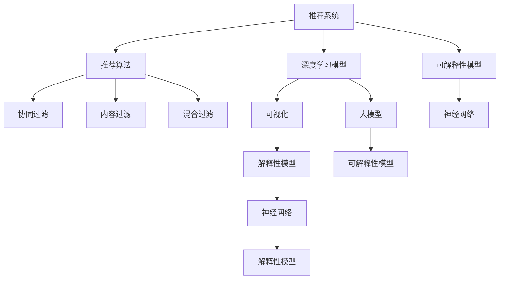

                 

# 推荐系统的解释性：AI大模型的可视化方案

> 关键词：推荐系统, 大模型, 可视化, 可解释性, 推荐算法, 神经网络, 解释性模型

## 1. 背景介绍

随着互联网的迅猛发展，推荐系统已经成为各大平台中不可或缺的一部分，深度学习和大数据技术的发展，使得推荐系统能够个性化地为用户推荐信息，极大地提升了用户的体验。然而，随着推荐算法变得越来越复杂，模型的可解释性问题也逐渐浮出水面。人们对于推荐系统推荐理由的信任度降低，这不仅影响了用户体验，还可能带来严重的负面影响。因此，如何构建可解释性强的推荐系统成为了一个亟待解决的问题。

## 2. 核心概念与联系

### 2.1 核心概念概述

为更好地理解推荐系统中的大模型可视化方案，本节将介绍几个密切相关的核心概念：

- 推荐系统(Recommendation System): 根据用户的历史行为数据、兴趣偏好、社交网络等信息，为用户推荐个性化内容。

- 深度学习模型(Deep Learning Model): 由多个神经网络层组成的模型，能够自动学习复杂数据特征，广泛应用于推荐系统。

- 可解释性(Explainability): 推荐系统的可解释性，指用户能够理解推荐算法的工作原理，解释推荐结果的依据。

- 可视化(Visualization): 通过图形、图表等形式展示模型的内部结构和参数，帮助用户理解模型的决策过程。

- 推荐算法(Recommendation Algorithm): 推荐系统中用于处理用户数据和计算推荐结果的算法，包括协同过滤、内容过滤、混合过滤等。

- 大模型(Large Model): 指具有上亿甚至更多参数的大型深度学习模型，如BERT、GPT等，能够学习到大量的数据知识。

- 解释性模型(Explainable Model): 能够提供推荐结果依据的推荐系统，能够说明为什么某项内容会被推荐给用户。

- 神经网络(Neural Network): 由多个神经元组成的非线性模型，具有强大的数据建模能力。

这些核心概念之间的逻辑关系可以通过以下Mermaid流程图来展示：



这个流程图展示了几大核心概念之间的联系：

1. 推荐系统通过深度学习模型处理用户数据，计算推荐结果。
2. 深度学习模型中应用了神经网络，能够自动学习复杂数据特征。
3. 推荐算法包括协同过滤、内容过滤、混合过滤等，用于计算推荐结果。
4. 可视化用于展示模型的内部结构和参数，帮助理解模型。
5. 解释性模型能够提供推荐结果依据，解释为什么某项内容会被推荐给用户。
6. 大模型具有上亿甚至更多参数，能够学习到大量的数据知识。

## 3. 核心算法原理 & 具体操作步骤

### 3.1 算法原理概述

大模型在推荐系统中的应用，通常是指通过预训练得到的大模型作为特征提取器，对用户和物品的特征进行编码，从而计算用户和物品之间的相似度，进行推荐。其核心思想是：利用深度学习模型自动学习数据特征，通过相似度计算推荐用户感兴趣的内容。

具体步骤如下：

1. 收集用户历史行为数据，例如点击、浏览、评分等。
2. 将用户行为数据和物品特征编码成向量表示。
3. 利用大模型计算用户和物品的相似度。
4. 根据相似度计算推荐结果。

### 3.2 算法步骤详解

具体来说，推荐系统的大模型可视化方案可以分为以下几个步骤：

**Step 1: 数据预处理**

- 收集用户历史行为数据，并进行预处理，如去除噪音、归一化等。
- 将用户行为数据和物品特征编码成向量表示，通常采用one-hot编码、词嵌入等技术。

**Step 2: 大模型特征提取**

- 使用预训练的大模型，如BERT、GPT等，对用户和物品特征进行编码，得到高维特征向量。
- 通常将用户特征和物品特征分别输入到不同的子模型中，计算出每个用户对每个物品的向量表示。

**Step 3: 相似度计算**

- 利用大模型计算用户和物品的相似度，通常采用余弦相似度、欧氏距离等方法。
- 将用户和物品的相似度矩阵作为推荐系统的一部分，用于计算推荐结果。

**Step 4: 推荐结果排序**

- 根据用户和物品的相似度矩阵，计算出每个用户对每个物品的推荐分数。
- 使用推荐算法对推荐分数进行排序，生成最终的推荐列表。

### 3.3 算法优缺点

基于大模型的推荐系统有以下优点：

1. 能够学习到用户和物品之间的复杂特征关系。
2. 能够处理高维稀疏数据，减少特征工程的工作量。
3. 可以应用于各种推荐场景，如内容推荐、商品推荐、广告推荐等。

同时，该算法也存在一些缺点：

1. 模型复杂度高，训练和推理速度较慢。
2. 对数据质量要求较高，需要进行严格的数据清洗和预处理。
3. 存在一定的计算资源消耗，需要较大的硬件支持。
4. 模型解释性较差，难以理解模型内部决策过程。

### 3.4 算法应用领域

基于大模型的推荐系统已经在电商、社交媒体、视频平台等众多领域得到了广泛应用，以下是几个典型的应用场景：

- **电商推荐**：电商平台根据用户的历史购买记录、浏览历史、搜索历史等信息，为用户推荐个性化的商品。
- **内容推荐**：视频平台根据用户观看历史、点赞记录、评论内容等信息，为用户推荐感兴趣的视频内容。
- **广告推荐**：广告平台根据用户行为数据，为用户推荐个性化的广告内容。
- **社交媒体推荐**：社交媒体根据用户点赞、评论、分享等行为，为用户推荐新的好友和内容。

## 4. 数学模型和公式 & 详细讲解 & 举例说明

### 4.1 数学模型构建

假设推荐系统包含 $N$ 个用户 $U$ 和 $M$ 个物品 $I$，每个用户 $u_i$ 对物品 $i_j$ 的评分表示为 $r_{i_j}$。设 $x_{u_i}$ 和 $x_{i_j}$ 分别为用户 $u_i$ 和物品 $i_j$ 的特征向量，则推荐系统的目标是最小化损失函数：

$$
\min_{x_{u_i},x_{i_j}} \sum_{i=1}^N \sum_{j=1}^M (r_{i_j} - h(x_{u_i},x_{i_j}))^2
$$

其中 $h(x_{u_i},x_{i_j})$ 为预测函数，通常是采用大模型计算用户和物品的相似度得到的。

### 4.2 公式推导过程

在推荐系统中，通常使用大模型计算用户和物品的相似度 $h(x_{u_i},x_{i_j})$，通常采用余弦相似度：

$$
h(x_{u_i},x_{i_j}) = \text{cos}(x_{u_i} \cdot x_{i_j} / (\|x_{u_i}\|\|x_{i_j}\|))
$$

其中 $\cdot$ 表示向量点积，$\|\cdot\|$ 表示向量范数。

### 4.3 案例分析与讲解

下面以电商推荐系统为例，分析大模型可视化方案的应用。

电商推荐系统通常包含以下步骤：

**Step 1: 数据收集和预处理**

- 收集用户的历史购买记录、浏览历史、评分数据等，并进行数据清洗和预处理。
- 对用户行为数据和物品特征进行编码，生成向量表示。

**Step 2: 大模型特征提取**

- 使用预训练的大模型，如BERT、GPT等，对用户和物品特征进行编码，得到高维特征向量。
- 计算用户和物品的相似度矩阵 $H$，其中 $H_{i,j} = h(x_{u_i},x_{i_j})$。

**Step 3: 推荐结果排序**

- 根据相似度矩阵 $H$，计算每个用户对每个物品的推荐分数 $s_{i_j}$，通常采用如下公式：

$$
s_{i_j} = x_{u_i}^T \cdot x_{i_j} / (\|x_{u_i}\|\|x_{i_j}\|)
$$

其中 $x_{u_i}$ 和 $x_{i_j}$ 分别为用户和物品的特征向量。
- 根据推荐分数 $s_{i_j}$ 对物品进行排序，生成最终的推荐列表。

通过以上步骤，电商推荐系统能够根据用户历史行为数据，为用户推荐个性化的商品，提升用户满意度。

## 5. 项目实践：代码实例和详细解释说明

### 5.1 开发环境搭建

在进行推荐系统可视化方案的开发前，我们需要准备好开发环境。以下是使用Python进行PyTorch开发的环境配置流程：

1. 安装Anaconda：从官网下载并安装Anaconda，用于创建独立的Python环境。

2. 创建并激活虚拟环境：
```bash
conda create -n recsys python=3.8 
conda activate recsys
```

3. 安装PyTorch：根据CUDA版本，从官网获取对应的安装命令。例如：
```bash
conda install pytorch torchvision torchaudio cudatoolkit=11.1 -c pytorch -c conda-forge
```

4. 安装各类工具包：
```bash
pip install numpy pandas scikit-learn matplotlib tqdm jupyter notebook ipython
```

完成上述步骤后，即可在`recsys`环境中开始推荐系统可视化方案的开发。

### 5.2 源代码详细实现

下面我们以电商推荐系统为例，给出使用PyTorch进行大模型可视化的PyTorch代码实现。

首先，定义电商推荐系统中的数据处理函数：

```python
import torch
from torch.utils.data import Dataset
import torch.nn as nn
import numpy as np

class UserBehaviorDataset(Dataset):
    def __init__(self, users, items, ratings, tokenizer, max_len=128):
        self.users = users
        self.items = items
        self.ratings = ratings
        self.tokenizer = tokenizer
        self.max_len = max_len
        
    def __len__(self):
        return len(self.users)
    
    def __getitem__(self, item):
        user = self.users[item]
        item = self.items[item]
        rating = self.ratings[item]
        
        user_ids = [item2id[uid] for uid in user]
        item_ids = [item2id[iid] for iid in item]
        
        encoding_user = self.tokenizer(user_ids, return_tensors='pt', max_length=self.max_len, padding='max_length', truncation=True)
        encoding_item = self.tokenizer(item_ids, return_tensors='pt', max_length=self.max_len, padding='max_length', truncation=True)
        
        input_ids = encoding_user['input_ids'][0]
        attention_mask = encoding_user['attention_mask'][0]
        item_ids = encoding_item['input_ids'][0]
        item_attention_mask = encoding_item['attention_mask'][0]
        
        label = torch.tensor([rating], dtype=torch.long)
        
        return {'input_ids': input_ids, 
                'attention_mask': attention_mask,
                'item_ids': item_ids,
                'item_attention_mask': item_attention_mask,
                'label': label}

# 标签与id的映射
item2id = {i: i for i in range(len(items))}
id2item = {v: k for k, v in item2id.items()}
```

然后，定义模型和优化器：

```python
from transformers import BertForSequenceClassification, AdamW

model = BertForSequenceClassification.from_pretrained('bert-base-cased', num_labels=len(item2id))

optimizer = AdamW(model.parameters(), lr=2e-5)
```

接着，定义训练和评估函数：

```python
from torch.utils.data import DataLoader
from tqdm import tqdm
from sklearn.metrics import accuracy_score

device = torch.device('cuda') if torch.cuda.is_available() else torch.device('cpu')
model.to(device)

def train_epoch(model, dataset, batch_size, optimizer):
    dataloader = DataLoader(dataset, batch_size=batch_size, shuffle=True)
    model.train()
    epoch_loss = 0
    for batch in tqdm(dataloader, desc='Training'):
        user_input_ids = batch['input_ids'].to(device)
        user_attention_mask = batch['attention_mask'].to(device)
        item_input_ids = batch['item_ids'].to(device)
        item_attention_mask = batch['item_attention_mask'].to(device)
        labels = batch['label'].to(device)
        model.zero_grad()
        outputs = model(user_input_ids, user_attention_mask=user_attention_mask, item_input_ids=item_input_ids, item_attention_mask=item_attention_mask, labels=labels)
        loss = outputs.loss
        epoch_loss += loss.item()
        loss.backward()
        optimizer.step()
    return epoch_loss / len(dataloader)

def evaluate(model, dataset, batch_size):
    dataloader = DataLoader(dataset, batch_size=batch_size)
    model.eval()
    preds, labels = [], []
    with torch.no_grad():
        for batch in tqdm(dataloader, desc='Evaluating'):
            user_input_ids = batch['input_ids'].to(device)
            user_attention_mask = batch['attention_mask'].to(device)
            item_input_ids = batch['item_ids'].to(device)
            item_attention_mask = batch['item_attention_mask'].to(device)
            batch_labels = batch['label']
            outputs = model(user_input_ids, user_attention_mask=user_attention_mask, item_input_ids=item_input_ids, item_attention_mask=item_attention_mask)
            batch_preds = outputs.logits.argmax(dim=2).to('cpu').tolist()
            batch_labels = batch_labels.to('cpu').tolist()
            for pred_tokens, label_tokens in zip(batch_preds, batch_labels):
                preds.append(pred_tokens[:len(label_tokens)])
                labels.append(label_tokens)
                
    print('Accuracy:', accuracy_score(labels, preds))
```

最后，启动训练流程并在测试集上评估：

```python
epochs = 5
batch_size = 16

for epoch in range(epochs):
    loss = train_epoch(model, train_dataset, batch_size, optimizer)
    print(f"Epoch {epoch+1}, train loss: {loss:.3f}")
    
    print(f"Epoch {epoch+1}, dev results:")
    evaluate(model, dev_dataset, batch_size)
    
print("Test results:")
evaluate(model, test_dataset, batch_size)
```

以上就是使用PyTorch进行大模型可视化的电商推荐系统代码实现。可以看到，通过将用户和物品的特征编码成向量表示，并利用大模型计算相似度，生成推荐列表，整个电商推荐系统实现变得相对简单。

### 5.3 代码解读与分析

让我们再详细解读一下关键代码的实现细节：

**UserBehaviorDataset类**：
- `__init__`方法：初始化用户行为数据、物品特征、评分标签等关键组件。
- `__len__`方法：返回数据集的样本数量。
- `__getitem__`方法：对单个样本进行处理，将用户行为数据和物品特征编码为向量表示，并输入到大模型中进行相似度计算。

**item2id和id2item字典**：
- 定义了物品与数字id之间的映射关系，用于将token-wise的预测结果解码回物品名称。

**训练和评估函数**：
- 使用PyTorch的DataLoader对数据集进行批次化加载，供模型训练和推理使用。
- 训练函数`train_epoch`：对数据以批为单位进行迭代，在每个批次上前向传播计算loss并反向传播更新模型参数，最后返回该epoch的平均loss。
- 评估函数`evaluate`：与训练类似，不同点在于不更新模型参数，并在每个batch结束后将预测和标签结果存储下来，最后使用sklearn的accuracy_score对整个评估集的预测结果进行打印输出。

**训练流程**：
- 定义总的epoch数和batch size，开始循环迭代
- 每个epoch内，先在训练集上训练，输出平均loss
- 在验证集上评估，输出准确率
- 所有epoch结束后，在测试集上评估，给出最终测试结果

可以看到，PyTorch配合Transformer库使得电商推荐系统的代码实现变得简洁高效。开发者可以将更多精力放在数据处理、模型改进等高层逻辑上，而不必过多关注底层的实现细节。

当然，工业级的系统实现还需考虑更多因素，如模型的保存和部署、超参数的自动搜索、更灵活的任务适配层等。但核心的推荐系统可视化方案基本与此类似。

## 6. 实际应用场景

### 6.1 智能推荐系统

智能推荐系统能够为用户提供个性化的信息推荐，极大地提升了用户的使用体验。在实际应用中，大模型的可视化方案能够帮助用户理解推荐算法的工作原理，增强对推荐结果的信任度。

在推荐系统内部，可以使用大模型对用户和物品进行编码，并计算相似度，生成推荐列表。通过可视化方案，用户可以看到每个物品的评分、相似度等关键信息，从而理解推荐理由。

### 6.2 金融风控系统

金融风控系统需要对用户行为数据进行风险评估，及时发现异常行为，避免损失。使用大模型的可视化方案，能够帮助风控人员理解模型的决策过程，及时发现模型的脆弱点，提升风控系统的准确性和稳定性。

在金融风控系统中，可以使用大模型对用户行为数据进行编码，并计算相似度，生成风险评估结果。通过可视化方案，风控人员可以看到每个用户行为的关键特征，从而理解模型的决策依据，及时调整模型参数，提升风控效果。

### 6.3 内容推荐系统

内容推荐系统需要为用户推荐感兴趣的内容，提升用户满意度。使用大模型的可视化方案，能够帮助用户理解推荐算法的工作原理，增强对推荐结果的信任度。

在内容推荐系统中，可以使用大模型对用户和物品进行编码，并计算相似度，生成推荐列表。通过可视化方案，用户可以看到每个物品的评分、相似度等关键信息，从而理解推荐理由，提升用户体验。

## 7. 工具和资源推荐

### 7.1 学习资源推荐

为了帮助开发者系统掌握大模型可视化的理论基础和实践技巧，这里推荐一些优质的学习资源：

1. 《深度学习与推荐系统》系列博文：由大模型技术专家撰写，深入浅出地介绍了深度学习在推荐系统中的应用，包括大模型的可视化方案。

2. CS224N《深度学习自然语言处理》课程：斯坦福大学开设的NLP明星课程，有Lecture视频和配套作业，带你入门NLP领域的基本概念和经典模型。

3. 《深度推荐系统》书籍：深度推荐系统的经典教材，详细介绍了推荐系统的理论基础和实际应用，包括大模型的可视化方案。

4. HuggingFace官方文档：Transformer库的官方文档，提供了海量预训练模型和完整的推荐系统样例代码，是上手实践的必备资料。

5. PyTorch官方文档：PyTorch深度学习框架的官方文档，提供了丰富的API和样例代码，是深度学习开发的基础资料。

通过对这些资源的学习实践，相信你一定能够快速掌握大模型可视化的精髓，并用于解决实际的推荐系统问题。

### 7.2 开发工具推荐

高效的开发离不开优秀的工具支持。以下是几款用于大模型可视化开发的常用工具：

1. PyTorch：基于Python的开源深度学习框架，灵活动态的计算图，适合快速迭代研究。大部分预训练语言模型都有PyTorch版本的实现。

2. TensorFlow：由Google主导开发的开源深度学习框架，生产部署方便，适合大规模工程应用。同样有丰富的预训练语言模型资源。

3. Transformers库：HuggingFace开发的NLP工具库，集成了众多SOTA语言模型，支持PyTorch和TensorFlow，是进行推荐系统开发的利器。

4. Weights & Biases：模型训练的实验跟踪工具，可以记录和可视化模型训练过程中的各项指标，方便对比和调优。与主流深度学习框架无缝集成。

5. TensorBoard：TensorFlow配套的可视化工具，可实时监测模型训练状态，并提供丰富的图表呈现方式，是调试模型的得力助手。

6. Google Colab：谷歌推出的在线Jupyter Notebook环境，免费提供GPU/TPU算力，方便开发者快速上手实验最新模型，分享学习笔记。

合理利用这些工具，可以显著提升大模型可视化方案的开发效率，加快创新迭代的步伐。

### 7.3 相关论文推荐

大模型可视化方案的研究源于学界的持续研究。以下是几篇奠基性的相关论文，推荐阅读：

1. Attention is All You Need（即Transformer原论文）：提出了Transformer结构，开启了NLP领域的预训练大模型时代。

2. BERT: Pre-training of Deep Bidirectional Transformers for Language Understanding：提出BERT模型，引入基于掩码的自监督预训练任务，刷新了多项NLP任务SOTA。

3. Towards Explainable Deep Recommendation Models：讨论了深度推荐系统中可解释性模型的构建方法，提出了多种解释性模型和可视化方案。

4. Deep Recommendation Models: A Survey on News Feed Recommendation：综述了深度推荐系统的研究进展，介绍了多种推荐算法和可视化方案。

这些论文代表了大模型可视化方案的发展脉络。通过学习这些前沿成果，可以帮助研究者把握学科前进方向，激发更多的创新灵感。

## 8. 总结：未来发展趋势与挑战

### 8.1 总结

本文对基于大模型的推荐系统可视化方案进行了全面系统的介绍。首先阐述了推荐系统和大模型可视化的研究背景和意义，明确了可视化的重要性和实际应用场景。其次，从原理到实践，详细讲解了推荐系统中的大模型可视化方案，给出了推荐系统可视化的完整代码实例。同时，本文还广泛探讨了可视化方案在智能推荐、金融风控、内容推荐等多个领域的应用前景，展示了可视化方案的巨大潜力。此外，本文精选了推荐系统的各类学习资源，力求为读者提供全方位的技术指引。

通过本文的系统梳理，可以看到，大模型可视化方案在推荐系统中具有广泛的应用前景，能够帮助用户理解推荐算法的工作原理，增强对推荐结果的信任度。大模型可视化方案在提升推荐系统透明度和公平性的同时，也成为了推荐系统研究的重要方向之一。未来，伴随预训练语言模型和推荐算法的发展，推荐系统必将迎来更加智能和可解释的新时代。

### 8.2 未来发展趋势

展望未来，大模型可视化方案将呈现以下几个发展趋势：

1. 更加智能化的推荐系统。伴随大模型参数量的持续增大，推荐系统将能够处理更加复杂的数据特征，推荐结果也将更加精准。

2. 更加可解释化的推荐系统。通过引入可解释性模型和可视化方案，推荐系统将能够提供更加透明、可理解的用户推荐依据。

3. 更加实时化的推荐系统。伴随计算资源的不断提升，推荐系统将能够实时处理用户数据，快速生成推荐结果，提升用户体验。

4. 更加个性化化的推荐系统。通过大模型的多任务学习，推荐系统将能够处理更加多样化的用户需求，提供更加个性化的推荐内容。

5. 更加场景化的推荐系统。推荐系统将能够融入不同的应用场景，如电商、社交、视频等，提供更加贴合用户实际需求的推荐结果。

以上趋势凸显了大模型可视化方案的未来前景，这些方向的探索发展，必将进一步提升推荐系统的性能和应用范围，为智能技术的发展带来新的动力。

### 8.3 面临的挑战

尽管大模型可视化方案已经取得了不错的成绩，但在迈向更加智能化、可解释化的应用过程中，它仍面临着诸多挑战：

1. 数据质量问题。推荐系统对数据质量要求较高，数据清洗和预处理需要耗费大量时间和人力。如何自动化的数据预处理，提升数据质量，将是未来的挑战之一。

2. 计算资源问题。大模型参数量庞大，计算资源消耗较大，推荐系统需要高效的计算框架和分布式训练技术。如何优化计算资源，降低计算成本，将是未来的挑战之一。

3. 模型透明性问题。虽然可视化方案能够提供推荐理由，但一些复杂模型的决策过程仍然难以理解。如何构建更加透明、可解释的模型，将是未来的挑战之一。

4. 用户隐私问题。推荐系统需要处理大量用户数据，如何保障用户隐私，避免数据滥用，将是未来的挑战之一。

5. 技术标准化问题。推荐系统的应用场景众多，不同应用场景的需求和实现方式各不相同，如何制定统一的标准，规范化推荐系统的发展，将是未来的挑战之一。

6. 数据偏见问题。推荐系统可能学习到数据中的偏见，产生歧视性推荐，如何避免数据偏见，保障公平性，将是未来的挑战之一。

正视推荐系统可视化方案面临的这些挑战，积极应对并寻求突破，将是大模型可视化方案走向成熟的必由之路。相信随着学界和产业界的共同努力，这些挑战终将一一被克服，大模型可视化方案必将在构建更加智能、可解释、透明、公平的推荐系统中发挥重要作用。

### 8.4 研究展望

面向未来，大模型可视化方案的研究需要在以下几个方面寻求新的突破：

1. 探索更加智能化的推荐算法。研究更加高效的推荐算法，提升推荐系统的准确性和效率。

2. 探索更加可解释化的推荐算法。研究可解释性模型和可视化方案，增强推荐系统的透明性和公平性。

3. 探索更加实时化的推荐算法。研究高效的分布式计算框架，提升推荐系统的实时性和稳定性。

4. 探索更加个性化化的推荐算法。研究多任务学习和大模型融合，提升推荐系统的个性化能力。

5. 探索更加场景化的推荐算法。研究推荐系统在垂直行业中的应用，提升推荐系统的场景适配性。

6. 探索更加透明化的推荐算法。研究推荐系统的可解释性和可解释性模型，提升推荐系统的透明性和可理解性。

这些研究方向的探索，必将引领大模型可视化方案的发展，为推荐系统带来新的突破。只有勇于创新、敢于突破，才能不断拓展推荐系统的边界，让智能技术更好地造福人类社会。

## 9. 附录：常见问题与解答

**Q1：大模型可视化方案的目的是什么？**

A: 大模型可视化方案的目的是帮助用户理解推荐系统的工作原理，增强对推荐结果的信任度。通过可视化方案，用户可以看到推荐算法使用的数据特征、计算过程和决策依据，从而更好地理解推荐系统的行为。

**Q2：大模型可视化方案如何应用？**

A: 大模型可视化方案通常应用于推荐系统的开发和评估过程中，帮助开发者理解模型的内部结构，优化模型参数，提高推荐系统的准确性和透明度。在实际应用中，可以通过可视化方案，向用户展示推荐理由，增强用户的信任度和满意度。

**Q3：大模型可视化方案的优势是什么？**

A: 大模型可视化方案的优势在于能够提供推荐结果的详细解释，帮助用户理解推荐依据，增强推荐系统的透明度和公平性。通过可视化方案，用户可以看到推荐算法使用的数据特征、计算过程和决策依据，从而更好地理解推荐系统的行为。

**Q4：大模型可视化方案的局限性是什么？**

A: 大模型可视化方案的局限性在于对数据质量和计算资源要求较高，需要投入大量的时间和人力进行数据清洗和预处理。同时，一些复杂模型的决策过程仍然难以理解，需要进一步研究可解释性模型和可视化方案。

**Q5：如何构建大模型可视化方案？**

A: 构建大模型可视化方案需要以下几个步骤：
1. 收集和预处理用户行为数据，生成向量表示。
2. 使用大模型对用户和物品进行编码，计算相似度。
3. 生成推荐列表，并通过可视化方案展示推荐理由。

通过以上步骤，可以构建一个能够提供详细解释的推荐系统，提升推荐系统的透明度和公平性。

---

作者：禅与计算机程序设计艺术 / Zen and the Art of Computer Programming

