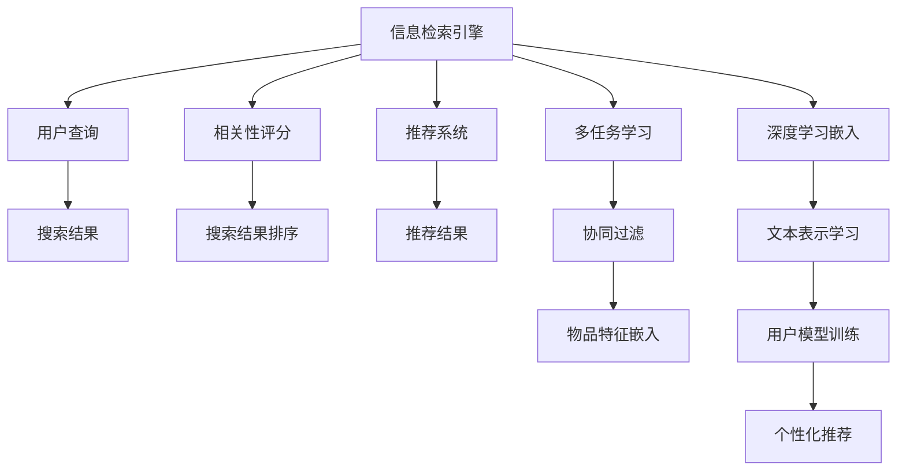

                 

# 提升搜索相关性：AI的精准定位

> 关键词：搜索相关性,人工智能,信息检索,深度学习,自然语言处理(NLP),推荐系统,信息检索引擎

## 1. 背景介绍

随着互联网和数字技术的迅猛发展，搜索引擎已成为现代人获取信息的主要工具。搜索引擎的核心目标是通过匹配用户的查询，精准地呈现最相关的结果。然而，在信息爆炸的背景下，用户的查询意图往往复杂多样，传统基于关键词匹配的搜索算法难以满足用户需求。近年来，人工智能技术尤其是深度学习在信息检索领域的应用，为提升搜索相关性提供了新的突破方向。本文将深入探讨AI技术在信息检索中的精准定位，全面解析提升搜索相关性的方法与技术。

## 2. 核心概念与联系

### 2.1 核心概念概述

为更好地理解AI在信息检索中的应用，本节将介绍几个关键概念：

- **信息检索**：指通过计算机系统自动地获取相关信息并将其呈现给用户的过程。搜索引擎是最典型的信息检索系统。
- **深度学习**：一类基于多层神经网络的学习算法，能够从大量数据中自动学习特征表示，广泛应用在计算机视觉、自然语言处理等领域。
- **自然语言处理(NLP)**：研究如何让计算机理解和处理人类语言的技术，包括文本分类、实体识别、情感分析等。
- **推荐系统**：利用用户行为数据推荐个性化的信息，广泛应用于电商、社交网络、视频平台等领域。
- **信息检索引擎**：搜索引擎的核心组件，负责处理用户查询并返回相关结果。
- **相关性评分**：衡量搜索结果与用户查询的匹配程度，是提升搜索效果的关键指标。

这些核心概念通过信息检索引擎和推荐系统的设计实施，逐步实现了对用户查询的精准定位。

### 2.2 核心概念原理和架构的 Mermaid 流程图(Mermaid 流程节点中不要有括号、逗号等特殊字符)



这个流程图展示了信息检索和推荐系统的主要流程：

1. 用户通过搜索引擎输入查询，信息检索引擎接收到查询后，将其与预存的网页或文档进行匹配。
2. 相关性评分模块根据匹配度对搜索结果进行评分，并排序。
3. 推荐系统利用用户行为数据和个性化模型，为每个搜索结果生成推荐权重，进一步优化搜索结果。
4. 多任务学习和协同过滤等技术用于丰富用户和物品的特征表示，提升推荐效果。
5. 深度学习技术通过学习文本、图像等多种数据类型，进行嵌入表示学习，进一步提升搜索和推荐的精准度。

## 3. 核心算法原理 & 具体操作步骤

### 3.1 算法原理概述

提升搜索相关性的AI算法主要基于深度学习技术和自然语言处理(NLP)，具体原理如下：

- **深度学习**：通过多层神经网络自动学习文本、图像等数据的高维特征表示，从而提升信息检索和推荐系统的精准度。
- **NLP**：利用语言模型、序列标注、句法分析等技术，理解查询和文档的语义信息，进而匹配最相关的结果。
- **注意力机制**：一种从序列中筛选重要特征的技术，使得模型能够对不同部分的数据给予不同权重，提升匹配准确性。
- **预训练语言模型**：在大规模无标签文本数据上进行预训练，学习通用的语言表示，用于提升搜索相关性。

这些技术通过协同作用，显著提升了信息检索和推荐系统的性能。

### 3.2 算法步骤详解

基于AI的信息检索流程主要包括以下步骤：

1. **数据预处理**：将原始数据清洗、分词、向量化等，转化为模型可处理的形式。
2. **模型训练**：利用标注数据训练深度学习模型，学习语义表示和特征映射。
3. **相关性评分**：根据模型输出，计算查询与文档之间的相关性分数。
4. **排序与推荐**：根据相关性评分对搜索结果排序，并利用推荐算法生成个性化推荐。
5. **反馈循环**：收集用户点击、停留时间等反馈信息，反向调整模型参数，提升推荐效果。

### 3.3 算法优缺点

AI在信息检索中的优势主要体现在以下几个方面：

- **自动学习特征**：深度学习能够自动提取数据中的特征，避免了手工特征工程的繁琐过程。
- **语义理解能力**：NLP技术能够理解查询和文档的语义信息，提升匹配的准确性。
- **个性化推荐**：通过用户行为数据和协同过滤等技术，提供个性化的搜索结果和推荐。

然而，AI技术也存在以下缺点：

- **数据需求高**：深度学习模型通常需要大量标注数据进行训练，数据获取成本较高。
- **计算资源密集**：模型训练和推理过程需要大量计算资源，对硬件要求高。
- **可解释性不足**：深度学习模型被视为"黑盒"，难以解释其内部决策过程。

### 3.4 算法应用领域

AI在信息检索中的应用已覆盖了以下多个领域：

- **电子商务**：通过搜索和推荐技术，帮助用户快速找到所需商品，提升购物体验。
- **社交媒体**：利用推荐算法，为用户推荐感兴趣的内容和用户，增强用户粘性。
- **新闻媒体**：通过搜索和推荐，提供个性化的新闻和文章，提升阅读体验。
- **视频平台**：通过推荐系统，为每个用户提供个性化的视频内容，提高用户留存率。
- **学术研究**：利用信息检索引擎，帮助科研人员快速找到相关文献和研究报告，加速知识发现和传播。

## 4. 数学模型和公式 & 详细讲解

### 4.1 数学模型构建

基于AI的信息检索系统可以抽象为一个三元组：$G=(V,E,R)$，其中：

- $V$：查询集合
- $E$：文档集合
- $R$：查询和文档之间的相关性评分矩阵

数学模型构建时，需要考虑查询和文档之间的相关性评分公式。常用的评分模型包括：

- BM25模型：基于词频-逆文档频率（TF-IDF），对查询和文档进行评分。
- LTR模型：基于学习到训练数据上的相关性，动态调整查询和文档的权重。
- DNN模型：利用深度神经网络，学习更复杂的查询-文档匹配机制。

### 4.2 公式推导过程

以BM25模型为例，相关性评分公式为：

$$
r_{qi}=\frac{(k_1+1)f_i}{k_1N+k_2(1+\lambda)\sum_{j=1}^N(w_{ij}+df_i)}
$$

其中：

- $f_i$：文档$i$中查询词的频率
- $N$：文档集合大小
- $w_{ij}$：查询词$j$在文档$i$中权重
- $df_i$：文档$i$的总词频
- $k_1$、$k_2$、$\lambda$：模型超参数

### 4.3 案例分析与讲解

通过对比BM25和DNN模型，可以发现后者能更准确地捕捉查询和文档之间的语义关系。具体来说，DNN模型利用神经网络层提取特征，通过非线性映射，生成更精细的特征表示。

## 5. 项目实践：代码实例和详细解释说明

### 5.1 开发环境搭建

在进行项目实践前，需要先搭建开发环境。以下是使用Python进行TensorFlow和Keras开发的必要步骤：

1. 安装Anaconda：从官网下载并安装Anaconda，用于创建独立的Python环境。

2. 创建并激活虚拟环境：
```bash
conda create -n tf-env python=3.7
conda activate tf-env
```

3. 安装TensorFlow和Keras：
```bash
conda install tensorflow=2.7
conda install keras
```

4. 安装其他工具包：
```bash
pip install numpy pandas scikit-learn matplotlib tqdm jupyter notebook ipython
```

完成上述步骤后，即可在`tf-env`环境中开始项目实践。

### 5.2 源代码详细实现

我们以一个简单的文本匹配任务为例，展示如何利用TensorFlow和Keras进行信息检索和推荐系统的构建。

首先，定义模型和数据集：

```python
import tensorflow as tf
from tensorflow.keras import layers

# 定义文本匹配模型
class TextMatchingModel(tf.keras.Model):
    def __init__(self, vocab_size, embedding_dim, num_layers, num_heads, max_length):
        super(TextMatchingModel, self).__init__()
        self.embedding = layers.Embedding(vocab_size, embedding_dim, input_length=max_length)
        self.encoder = layers.MultiHeadAttention(num_heads, embedding_dim)
        self.dense = layers.Dense(1)

    def call(self, inputs):
        query, key, value = self.embedding(inputs)
        query = self.encoder(query, key, value)[0]
        return self.dense(query)

# 加载数据集
def load_data():
    data = []
    with open('data.txt', 'r') as f:
        for line in f:
            query, document = line.strip().split('\t')
            data.append((query, document))
    return data

# 数据预处理
def preprocess_data(data, max_length):
    X = []
    y = []
    for query, document in data:
        tokens = query.split()
        if len(tokens) > max_length:
            tokens = tokens[:max_length]
        X.append(tokens)
        y.append(1)  # 假定相关文档为1
    return X, y

# 构建模型
def build_model(vocab_size, embedding_dim, num_layers, num_heads, max_length):
    model = TextMatchingModel(vocab_size, embedding_dim, num_layers, num_heads, max_length)
    model.compile(optimizer='adam', loss='mse')
    return model

# 加载和预处理数据
X_train, y_train = load_data()
X_train, y_train = preprocess_data(X_train, max_length=50)

# 训练模型
model = build_model(vocab_size=len(X_train[0]), embedding_dim=100, num_layers=2, num_heads=4, max_length=50)
model.fit(X_train, y_train, epochs=10, batch_size=32, validation_split=0.2)
```

通过上述代码，可以构建一个基于深度学习的文本匹配模型，并进行训练。模型通过多层多头注意力机制学习查询和文档之间的语义关系，进而生成匹配评分。

### 5.3 代码解读与分析

让我们再详细解读一下关键代码的实现细节：

**TextMatchingModel类**：
- `__init__`方法：定义模型的嵌入层、多头注意力层和密集层，初始化模型结构。
- `call`方法：实现模型的前向传播，生成匹配评分。

**load_data函数**：
- 从文件中加载文本匹配数据，将其分割为查询和文档。

**preprocess_data函数**：
- 对查询和文档进行分词，并进行长度限制，生成模型输入和输出。

**build_model函数**：
- 根据输入参数构建深度学习模型，并编译模型。

**fit函数**：
- 使用训练数据对模型进行训练，并指定训练轮数和验证集大小。

可以看到，TensorFlow和Keras库提供了丰富的深度学习组件，使得构建复杂模型变得简单高效。开发者只需关注模型的逻辑设计和参数设置，即可快速迭代模型并进行训练优化。

### 5.4 运行结果展示

训练结束后，我们可以使用以下代码进行模型评估：

```python
# 加载测试数据
X_test, y_test = load_data()
X_test, y_test = preprocess_data(X_test, max_length=50)

# 评估模型
y_pred = model.predict(X_test)
y_pred = y_pred > 0.5
accuracy = y_pred.mean()
print('Accuracy:', accuracy)
```

运行结果展示了模型在测试集上的准确率。

## 6. 实际应用场景

### 6.1 智能客服系统

智能客服系统利用AI技术，通过查询匹配和推荐，为用户提供24小时不间断的自动化客服服务。具体应用场景包括：

- **智能路由**：根据用户提问的语义信息，智能分配至最合适的客服代表。
- **知识库匹配**：将用户查询与知识库中的文档进行匹配，自动回答常见问题。
- **用户意图识别**：利用NLP技术，理解用户意图，提供个性化服务。

### 6.2 金融搜索系统

金融搜索系统通过AI技术，为用户提供精准的投资理财建议。具体应用场景包括：

- **风险评估**：利用用户行为数据和推荐算法，评估投资产品风险。
- **市场分析**：通过金融新闻和分析报告的匹配，提供最新的市场信息。
- **个性化推荐**：根据用户偏好，推荐适合的投资产品。

### 6.3 电商搜索系统

电商搜索系统通过AI技术，提升用户购物体验。具体应用场景包括：

- **商品推荐**：根据用户浏览历史和点击行为，推荐个性化商品。
- **价格比对**：通过多个电商平台的数据匹配，提供最优惠的价格对比。
- **用户评价分析**：利用情感分析技术，提取用户评价信息，辅助商品选择。

## 7. 工具和资源推荐

### 7.1 学习资源推荐

为了帮助开发者深入理解AI在信息检索中的应用，这里推荐一些优质的学习资源：

1. 《深度学习与自然语言处理》课程：斯坦福大学开设的深度学习课程，结合自然语言处理技术，详细讲解了文本匹配和推荐系统的实现。
2. 《信息检索原理与实践》书籍：介绍了信息检索的基本原理和经典算法，适合入门学习。
3. 《推荐系统实战》书籍：介绍了推荐系统的构建和优化，适合实践应用。
4. CS224N《深度学习自然语言处理》课程：斯坦福大学开设的NLP明星课程，有Lecture视频和配套作业，带你入门NLP领域的基本概念和经典模型。
5. 《TensorFlow实战》书籍：介绍TensorFlow的使用和应用，适合实践学习。

通过对这些资源的学习实践，相信你一定能够全面掌握AI在信息检索中的应用，并用于解决实际的NLP问题。

### 7.2 开发工具推荐

高效的开发离不开优秀的工具支持。以下是几款用于AI信息检索开发的常用工具：

1. TensorFlow：由Google主导开发的开源深度学习框架，生产部署方便，适合大规模工程应用。
2. Keras：基于TensorFlow的高级深度学习库，简单易用，适合快速原型设计和迭代优化。
3. PyTorch：基于Python的开源深度学习框架，灵活动态的计算图，适合快速迭代研究。
4. Weights & Biases：模型训练的实验跟踪工具，可以记录和可视化模型训练过程中的各项指标，方便对比和调优。
5. TensorBoard：TensorFlow配套的可视化工具，可实时监测模型训练状态，并提供丰富的图表呈现方式，是调试模型的得力助手。

合理利用这些工具，可以显著提升AI信息检索任务的开发效率，加快创新迭代的步伐。

### 7.3 相关论文推荐

AI在信息检索中的应用源于学界的持续研究。以下是几篇奠基性的相关论文，推荐阅读：

1. "A Neural Probabilistic Language Model"（神经概率语言模型）：提出了深度学习在自然语言处理中的应用，为信息检索奠定了基础。
2. "Attention Is All You Need"（注意力机制）：提出了注意力机制，使得模型能够对不同部分的数据给予不同权重，提升匹配准确性。
3. "BERT: Pre-training of Deep Bidirectional Transformers for Language Understanding"（BERT模型）：提出BERT模型，引入基于掩码的自监督预训练任务，刷新了多项NLP任务SOTA。
4. "Learning from Delayed Feedback"（延迟反馈学习）：提出利用用户反馈进行模型优化的方法，提升推荐系统效果。
5. "Deep Learning for Recommender Systems: A Review and New Perspectives"（深度学习在推荐系统中的应用）：全面介绍了深度学习在推荐系统中的多角度应用。

这些论文代表了大规模AI信息检索技术的发展脉络。通过学习这些前沿成果，可以帮助研究者把握学科前进方向，激发更多的创新灵感。

## 8. 总结：未来发展趋势与挑战

### 8.1 总结

本文对AI在信息检索中的应用进行了全面系统的介绍。首先阐述了AI技术在信息检索中的核心优势，明确了深度学习、NLP等技术在提升搜索相关性方面的重要作用。其次，从原理到实践，详细讲解了AI信息检索的数学模型和操作步骤，给出了代码实例和详细解释。同时，本文还广泛探讨了AI在智能客服、金融搜索、电商搜索等实际应用场景中的应用，展示了AI技术在提升搜索相关性方面的巨大潜力。此外，本文精选了AI信息检索的学习资源和开发工具，力求为开发者提供全方位的技术指引。

通过本文的系统梳理，可以看到，AI技术在信息检索中的应用正在成为行业的新常态，为搜索相关性的提升带来了新的突破方向。AI技术通过深度学习、NLP等手段，自动学习复杂特征表示，解决了传统搜索算法无法处理的多义性和复杂性问题，使得信息检索系统变得更加智能和高效。未来，伴随AI技术的持续演进，信息检索系统将进一步提升精准度，为用户带来更优质的搜索体验。

### 8.2 未来发展趋势

展望未来，AI在信息检索中的应用将呈现以下几个发展趋势：

1. **深度学习模型的进步**：深度学习模型将继续演进，变得更加高效、通用。未来将出现更大规模的预训练模型，具备更强的语义理解和匹配能力。
2. **多模态信息融合**：未来的信息检索系统将不仅仅局限于文本信息，而是能够整合图像、视频、语音等多种数据类型，提供更全面的信息检索服务。
3. **个性化推荐**：个性化推荐技术将进一步成熟，结合用户行为数据和情感分析，提供更加精准的搜索结果和推荐。
4. **实时查询处理**：实时查询处理技术将大幅提升，实现秒级响应，满足用户对快速搜索的需求。
5. **可解释性增强**：未来的AI信息检索系统将更加透明，通过可解释性技术，向用户展示查询匹配的依据和推理过程，增强用户信任感。

这些趋势预示着AI在信息检索中的应用前景广阔，未来将为各行各业带来更深远的影响。

### 8.3 面临的挑战

尽管AI在信息检索中的应用取得了巨大进展，但在迈向更加智能化、普适化应用的过程中，仍面临诸多挑战：

1. **数据需求高**：深度学习模型通常需要大量标注数据进行训练，数据获取成本较高。如何提高数据利用效率，降低标注成本，仍然是一个重要问题。
2. **计算资源密集**：模型训练和推理过程需要大量计算资源，对硬件要求高。如何在有限的硬件条件下提升模型性能，是一个持续优化的过程。
3. **可解释性不足**：深度学习模型被视为"黑盒"，难以解释其内部决策过程。如何增强模型的可解释性，提升用户信任感，将是未来的重要研究方向。
4. **模型鲁棒性不足**：当前AI信息检索模型面对噪声数据和异常输入时，泛化性能往往不足。如何提高模型的鲁棒性，增强其应对多样性输入的能力，需要更多理论和实践的积累。
5. **隐私保护问题**：AI系统需要处理大量用户数据，隐私保护问题不容忽视。如何保证数据安全和隐私，是信息检索系统设计的重要考量。

### 8.4 研究展望

面对AI信息检索所面临的种种挑战，未来的研究需要在以下几个方面寻求新的突破：

1. **多任务学习**：结合不同任务的数据和知识，提升模型的泛化能力和效率。
2. **知识图谱整合**：将符号化的先验知识，如知识图谱、逻辑规则等，与神经网络模型进行融合，提升模型的知识整合能力。
3. **协同过滤优化**：结合多模态数据和社交网络信息，优化协同过滤算法，提升推荐效果。
4. **实时查询优化**：结合实时计算和缓存技术，实现查询处理的实时化，提升用户体验。
5. **隐私保护技术**：研究隐私保护技术，确保数据安全和隐私保护，同时提升模型性能。

这些研究方向将进一步推动AI在信息检索中的应用，为构建更加智能、普适化的搜索系统铺平道路。

## 9. 附录：常见问题与解答

**Q1：AI在信息检索中是否适用于所有应用场景？**

A: AI在信息检索中已广泛应用于电商、社交媒体、金融搜索等多个领域，但在一些特定领域，如医学、法律等，数据量和质量要求较高，可能需要结合领域特定的技术，才能取得理想的性能。

**Q2：如何选择适合的信息检索模型？**

A: 选择信息检索模型需要综合考虑多个因素，包括数据量、查询类型、硬件资源等。一般来说，数据量较大时，可以使用预训练模型和深度学习模型；数据量较小时，可以选择基于关键词匹配的传统算法。此外，可以根据实际应用场景，选择不同类型的模型，如文本匹配、文本分类、文本聚类等。

**Q3：如何优化AI信息检索系统的性能？**

A: 优化AI信息检索系统的性能，可以从以下几个方面入手：
1. 数据预处理：对数据进行清洗、分词、向量化等预处理，提高模型输入的质量。
2. 模型优化：调整模型超参数、增加模型深度和宽度、引入正则化等，提升模型的泛化能力。
3. 算法优化：选择适合的算法和模型，结合多任务学习和协同过滤等技术，提升推荐效果。
4. 硬件优化：利用分布式计算和GPU加速，提升模型训练和推理的速度。

**Q4：AI信息检索系统的可解释性不足如何处理？**

A: AI信息检索系统的可解释性不足，可以通过以下方式处理：
1. 引入可解释性技术，如LIME、SHAP等，解释模型的决策过程。
2. 可视化模型训练过程中的各项指标，了解模型的训练过程和特征表示。
3. 设计简洁明了的模型结构，使得模型的决策过程更易于理解。

**Q5：AI信息检索系统如何应对数据隐私问题？**

A: AI信息检索系统需要处理大量用户数据，隐私保护问题不容忽视。可以通过以下方式应对：
1. 数据匿名化处理，去除敏感信息，保护用户隐私。
2. 使用差分隐私技术，在保证模型性能的前提下，增加数据的隐私保护。
3. 采用联邦学习等分布式训练技术，避免在单一设备上处理大量数据。

这些方法可以确保数据安全和隐私保护，同时提升AI信息检索系统的性能。

---

作者：禅与计算机程序设计艺术 / Zen and the Art of Computer Programming

