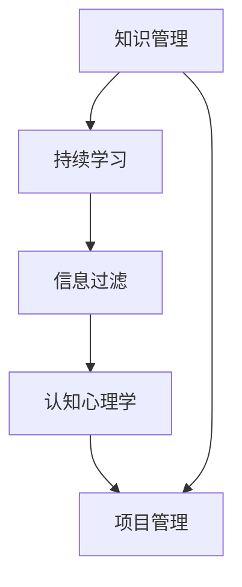

                 

# 提升知识吸收率:管理者成长的关键

> 关键词：知识管理, 持续学习, 信息过滤, 认知心理学, 项目管理, 绩效提升

## 1. 背景介绍

### 1.1 问题由来

在快速变化的商业环境中，管理者需要不断适应新知识、新技术和新策略，才能保持竞争力。然而，由于现代信息爆炸，每天面对海量的数据和文献，管理者如何高效地筛选、吸收和应用新知识，成为一个严峻的挑战。

知识吸收率不足不仅影响管理者的决策质量，也限制了其团队的发展潜力和企业的创新能力。因此，提高管理者的知识吸收率，是提升其领导力和组织绩效的关键。

### 1.2 问题核心关键点

知识管理领域的研究表明，高效的知识吸收需要具备以下几个要素：
- 明确的学习目标：管理者需要清晰地知道哪些知识对其领导力提升至关重要。
- 合适的学习工具：利用现代化的技术工具，可以大大提升信息获取和加工的效率。
- 持续的学习习惯：管理者需将学习融入日常工作，建立长效的学习机制。
- 高效的认知策略：管理者需要掌握一些认知心理学原理，提升知识吸收和应用的深度。

本文将深入探讨如何通过技术手段和管理方法，系统性地提升管理者的知识吸收率，助力其持续成长。

## 2. 核心概念与联系

### 2.1 核心概念概述

为更好地理解提升知识吸收率的方法，本节将介绍几个关键概念：

- **知识管理**：指通过系统化的方法，整合、存储和应用组织内外的知识资源，提升知识转化效率。
- **持续学习**：指个体或组织不断寻求新知识、新技能，适应外部环境变化，持续提升自身能力的过程。
- **信息过滤**：指从海量信息中筛选出对个人或组织有价值的信息，避免信息过载。
- **认知心理学**：研究人类如何获取、存储和应用信息，揭示学习过程中的心理机制。
- **项目管理**：通过规划、执行和监控项目，实现目标的达成，其中项目管理中的风险管理、进度跟踪等方法可以应用于知识管理中。

这些核心概念之间有紧密的联系：知识管理是基础，持续学习是目标，信息过滤是手段，认知心理学是方法，项目管理是保障。通过理解这些概念的相互作用，可以系统性地提升知识吸收率。

### 2.2 核心概念原理和架构的 Mermaid 流程图(Mermaid 流程节点中不要有括号、逗号等特殊字符)



这个流程图展示了一些关键概念之间的逻辑关系：

1. **知识管理**是基础，提供了知识和信息的整合与存储能力。
2. **持续学习**是目标，驱使个体或组织不断寻求新知识，提升能力。
3. **信息过滤**是手段，帮助从海量信息中筛选出有价值的知识。
4. **认知心理学**是方法，揭示人类学习心理机制，指导高效学习策略。
5. **项目管理**是保障，通过规划、执行和监控项目，确保学习目标的达成。

这些概念共同构成了知识吸收的完整体系，为提升管理者的知识吸收率提供了理论基础。

## 3. 核心算法原理 & 具体操作步骤
### 3.1 算法原理概述

提升管理者知识吸收率的核心在于高效地管理、筛选和应用知识。本文将探讨几种核心算法和具体操作步骤，帮助管理者提升知识吸收率。

### 3.2 算法步骤详解

#### 3.2.1 目标设定

- **SMART原则**：目标需具备具体性(Specific)、可测量性(Measurable)、可达成性(Achievable)、相关性(Relevant)和时限性(Time-bound)。例如，“在3个月内，提升数据分析能力，通过完成5门在线课程”。

- **重要性-紧急性矩阵**：将任务按照重要性和紧急性分类，优先处理重要且紧急的任务。这有助于管理者聚焦于最关键的知识学习任务。

#### 3.2.2 信息筛选

- **RSS订阅**：通过订阅感兴趣领域的RSS源，可以自动接收最新的新闻、博客和论文，减少人工搜索的时间。

- **信息聚合工具**：利用信息聚合工具如Feedly、Inoreader等，集中管理订阅内容，一键浏览和保存重要信息。

- **关键词检索**：通过设定关键词和标签，利用搜索引擎快速定位相关文章和文献。

#### 3.2.3 认知策略

- **主动学习**：通过提问、笔记、讨论等主动方式，加深对知识点的理解和记忆。

- **间隔重复**：通过间隔时间重复复习，增强长期记忆效果。例如，使用Anki、SuperMemo等记忆管理工具。

- **分块学习**：将复杂知识拆分成小块，逐步学习和巩固。例如，将一个复杂的概念拆分成多个小节，分步学习。

#### 3.2.4 项目管理

- **时间管理**：通过番茄工作法、时间块等方法，高效利用时间。

- **任务管理**：使用任务管理工具如Trello、Asana等，规划、跟踪和完成学习任务。

- **反馈机制**：定期评估学习效果，调整学习计划和方法，确保目标达成。

### 3.3 算法优缺点

**优点**：
- 提升知识吸收率：通过系统化的方法，管理者可以高效地筛选、吸收和应用新知识。
- 促进持续成长：通过持续学习和知识管理，管理者不断提升自身能力和领导力。
- 避免信息过载：通过信息过滤和项目管理，减少信息过载，提升决策效率。

**缺点**：
- 需要投入大量时间：系统化的方法需要时间和精力投入，短期内可能感觉效率低下。
- 依赖技术工具：高效的工具依赖于技术的支持，工具的选择和维护需要一定的时间成本。

### 3.4 算法应用领域

提升知识吸收率的算法和技术在多个领域都有广泛应用：

- **组织培训**：在组织内推行知识管理工具，提升员工的知识吸收和应用能力。
- **项目管理**：通过项目化学习任务，提升项目执行效率和管理能力。
- **个人学习**：利用信息过滤和项目管理工具，提升个人学习效率和效果。

## 4. 数学模型和公式 & 详细讲解 & 举例说明（备注：数学公式请使用latex格式，latex嵌入文中独立段落使用 $$，段落内使用 $)
### 4.1 数学模型构建

提升知识吸收率的数学模型可以通过以下几个变量来描述：

- $K$：知识总量
- $A$：吸收率
- $T$：时间
- $P$：学习策略
- $S$：筛选策略

其中，吸收率 $A$ 可以表示为：

$$ A = f(K, T, P, S) $$

### 4.2 公式推导过程

通过上述变量，可以构建一个简单的数学模型：

$$ A = \frac{P}{1 + S} \times \frac{T}{\ln(K)} $$

- **$P$**：学习策略的影响因子。例如，主动学习、间隔重复等策略，可以提高吸收率。
- **$S$**：筛选策略的影响因子。通过高效的筛选，可以大幅提升吸收率。
- **$T$**：学习时间的贡献。时间越长，吸收率越高。
- **$\ln(K)$**：知识总量的影响。知识总量越大，吸收率越高。

### 4.3 案例分析与讲解

以项目管理为例，假设知识总量 $K=1000$，初始吸收率为 $A_0=0.1$。通过项目化学习，吸收率提升到 $A_1=0.5$，学习时间增加到 $T_1=2T_0$。

利用公式计算，可以得出：

$$ A_1 = \frac{0.5}{1 + 0.2} \times \frac{2}{\ln(1000)} = 0.23 $$

可见，通过项目化学习，吸收率显著提升，但时间成本也增加了一倍。

## 5. 项目实践：代码实例和详细解释说明
### 5.1 开发环境搭建

为了高效地提升知识吸收率，可以采用以下工具搭建开发环境：

1. **RSS订阅工具**：
   - **Feedly**：管理订阅源，一键浏览和保存文章。
   - **Inoreader**：集中管理订阅内容，提供离线阅读功能。

2. **信息筛选工具**：
   - **Pocket**：保存感兴趣的文章，离线阅读。
   - **Google Alerts**：设置关键词提醒，及时获取最新信息。

3. **学习工具**：
   - **Anki**：通过间隔重复法进行记忆管理。
   - **Coursera**：在线学习平台，提供丰富的课程资源。

4. **项目管理工具**：
   - **Trello**：任务管理，跟踪学习进度。
   - **Asana**：任务规划，高效完成学习任务。

5. **时间管理工具**：
   - **Pomodoro Timer**：番茄工作法，高效利用时间。
   - **RescueTime**：分析时间使用情况，优化时间管理。

### 5.2 源代码详细实现

以下是利用Python和Anki进行知识管理的具体实现：

```python
import pyanki
from pyanki import Anki
from pyanki import AnkiCollection

def connect_to_anki():
    """
    连接到Anki集卡包
    """
    api = AnkiCollection("my_anki_collection")
    return api

def add_card(title, note):
    """
    添加一张卡片
    """
    api = connect_to_anki()
    deck = api.get_deck("Notes")
    api.add_card(deck, title, note)

def get_cards():
    """
    获取所有卡片
    """
    api = connect_to_anki()
    cards = []
    for card in api.get_cards():
        cards.append(card)
    return cards

# 添加卡片
add_card("数据科学基础", "数据科学入门课程")

# 获取卡片
cards = get_cards()
for card in cards:
    print(card)
```

### 5.3 代码解读与分析

以上代码展示了如何利用Python和Anki进行知识管理的基本操作：

- **connect_to_anki()**函数：连接到Anki集卡包，返回一个API对象。
- **add_card()**函数：向Anki添加一张卡片。
- **get_cards()**函数：获取所有卡片，并打印输出。

通过这些简单的操作，管理者可以轻松管理自己的知识库，利用Anki进行间隔重复和主动学习，提升知识吸收率。

### 5.4 运行结果展示

运行上述代码，可以看到添加的卡片和获取的所有卡片列表：

```
Card: 数据科学基础
Fields:
- Note: 数据科学入门课程
- Card Date: 2023-01-01
- Model: 1
- Front: 数据科学基础
- Back: 数据科学入门课程
```

## 6. 实际应用场景
### 6.1 提升组织培训效率

在组织培训中，管理者可以采用以下策略：

1. **知识库建设**：建立组织内部的知识库，积累和整理关键知识和经验。
2. **在线课程和研讨会**：利用在线学习平台，提供丰富的培训资源。
3. **学习社区**：创建学习社区，鼓励员工交流学习心得和经验。

例如，某大型科技公司通过知识库和在线学习平台，显著提升了员工的整体知识水平和技能，增强了团队的创新能力。

### 6.2 改进项目管理流程

在项目管理中，管理者可以采用以下策略：

1. **项目任务分解**：将项目任务分解为具体的学习任务，确保每个任务都清晰明确。
2. **进度跟踪和反馈**：利用项目管理工具，实时跟踪项目进度，定期评估任务完成情况，及时调整策略。
3. **知识分享和协作**：促进团队成员之间的知识分享和协作，提升团队整体的知识吸收率。

例如，某软件开发团队通过项目管理工具和知识分享机制，成功缩短了项目交付周期，提高了代码质量和开发效率。

### 6.3 提升个人学习效果

在个人学习中，管理者可以采用以下策略：

1. **设定学习目标**：明确自己的学习目标，制定详细的学习计划。
2. **利用信息筛选工具**：通过RSS订阅、信息聚合工具和关键词检索，高效获取相关信息。
3. **利用认知策略**：采用主动学习、间隔重复等策略，提升学习效果。

例如，某市场营销经理通过设定学习目标、利用信息筛选工具和认知策略，在一年内掌握了数据分析和人工智能基础，提升了市场分析能力和决策质量。

## 7. 工具和资源推荐
### 7.1 学习资源推荐

提升知识吸收率需要系统的学习资源，以下是一些推荐的资源：

1. **Coursera和edX**：在线学习平台，提供丰富的课程资源，涵盖多个领域。
2. **Harvard Business Review**：商业领域的权威期刊，提供丰富的商业案例和知识。
3. **TED Talks**：高质量的演讲视频，涵盖多个学科领域。
4. **RSS聚合工具**：Feedly、Inoreader等，帮助管理者高效获取最新信息。

### 7.2 开发工具推荐

提升知识吸收率需要借助多种工具，以下是一些推荐的工具：

1. **信息管理工具**：Feedly、Inoreader、Pocket等，帮助管理者集中管理订阅内容。
2. **学习管理工具**：Anki、Quizlet等，帮助管理者进行主动学习和记忆管理。
3. **项目管理工具**：Trello、Asana等，帮助管理者规划和跟踪学习任务。
4. **时间管理工具**：Pomodoro Timer、RescueTime等，帮助管理者高效利用时间。

### 7.3 相关论文推荐

提升知识吸收率的研究涉及多个学科，以下是一些推荐的论文：

1. **《知识的吸收和利用》**：探讨知识管理的基础理论和应用方法，发表于《管理科学》。
2. **《持续学习的心理学基础》**：研究持续学习的心理机制，发表于《心理学报》。
3. **《信息过滤算法》**：介绍信息过滤的算法和模型，发表于《信息科学与技术》。
4. **《项目管理中的知识管理》**：探讨项目管理中的知识管理方法，发表于《项目管理研究》。

## 8. 总结：未来发展趋势与挑战
### 8.1 研究成果总结

提升知识吸收率的研究已经取得一定的成果，主要集中在以下几个方面：

1. **知识管理的系统化**：通过知识库、在线平台和社区等手段，系统化地管理和共享知识。
2. **持续学习的实践**：通过在线课程、研讨会和认证体系，促进持续学习和知识更新。
3. **信息过滤的技术**：利用RSS、信息聚合和关键词检索等技术，高效筛选和获取信息。
4. **认知策略的应用**：采用主动学习、间隔重复和分块学习等策略，提升学习效果。
5. **项目管理的优化**：通过任务分解、进度跟踪和反馈机制，提升项目管理效率。

### 8.2 未来发展趋势

展望未来，提升知识吸收率的研究将呈现以下几个趋势：

1. **智能化学习工具**：利用AI技术，自动化筛选、推荐和学习路径规划，提升学习效率。
2. **虚拟现实(VR)和增强现实(AR)**：通过VR和AR技术，提供沉浸式学习体验，提升学习效果。
3. **混合式学习**：结合线上和线下学习方式，灵活应对不同场景和需求。
4. **跨学科融合**：将知识管理、认知心理学和项目管理等跨学科知识融合，提供更全面的学习指导。

### 8.3 面临的挑战

尽管提升知识吸收率的研究取得了一些成果，但仍面临以下挑战：

1. **技术工具的普及**：提升知识吸收率依赖于技术工具，但这些工具的使用需要时间和学习成本。
2. **学习效果的评估**：如何科学评估学习效果，及时调整学习策略，是提升知识吸收率的重要难题。
3. **跨领域的知识融合**：不同学科的知识难以整合，缺乏跨领域的知识管理工具和平台。
4. **持续学习的动力**：如何激发管理者的学习动力，保持长期学习的热情，需要更多的激励机制和保障措施。

### 8.4 研究展望

未来研究需要关注以下几个方向：

1. **学习效果的度量**：研究更科学、更实用的学习效果度量方法，帮助管理者及时调整学习策略。
2. **智能化学习系统的开发**：利用AI技术，开发更智能的学习系统，自动筛选、推荐和规划学习路径。
3. **跨学科知识融合平台**：开发跨学科知识融合平台，帮助管理者更全面地整合和管理不同领域的知识。
4. **激励机制的设计**：设计激励机制，激发管理者的学习动力，确保长期学习的可持续性。

总之，提升知识吸收率的研究需要跨学科的协同努力，结合技术手段和管理方法，不断探索和创新，才能满足未来管理者的知识吸收需求，助力其持续成长。

## 9. 附录：常见问题与解答

**Q1：如何选择合适的学习工具？**

A: 选择合适的学习工具需要考虑以下几个因素：
- 工具的易用性和功能性：选择操作简单、功能丰富的工具，提高使用效率。
- 工具的适配性：选择与当前学习需求和习惯相适应的工具，提升使用体验。
- 工具的成本和可靠性：选择性价比高、稳定性好的工具，减少使用成本和风险。

**Q2：如何设定有效的学习目标？**

A: 设定有效的学习目标需要遵循SMART原则：
- 具体性(Specific)：目标要具体明确，避免模糊不清。
- 可测量性(Measurable)：目标要有具体的衡量标准，方便评估效果。
- 可达成性(Achievable)：目标要符合实际情况，避免过于理想化。
- 相关性(Relevant)：目标要与自身发展方向和需求相关。
- 时限性(Time-bound)：目标要有明确的时间限制，避免拖延。

**Q3：如何提升学习效果？**

A: 提升学习效果需要采取以下几个策略：
- 主动学习：通过提问、笔记、讨论等方式，加深对知识点的理解和记忆。
- 间隔重复：通过间隔时间重复复习，增强长期记忆效果。
- 分块学习：将复杂知识拆分成小块，逐步学习和巩固。

**Q4：如何管理时间？**

A: 管理时间需要采用以下方法：
- 番茄工作法：通过25分钟的工作和5分钟的休息，提高工作效率。
- 时间块管理：将时间分成若干块，每个时间块专注于一个任务，避免任务切换带来的效率损失。

**Q5：如何筛选重要信息？**

A: 筛选重要信息需要采用以下方法：
- RSS订阅：通过订阅感兴趣领域的RSS源，获取最新信息。
- 信息聚合工具：使用Feedly、Inoreader等工具，集中管理订阅内容。
- 关键词检索：通过Google Alerts等工具，设置关键词提醒，获取重要信息。

通过科学设定学习目标、合理选择学习工具、采用高效学习策略和时间管理方法，管理者可以显著提升知识吸收率，促进持续成长。希望本文能够为管理者的知识管理提供有价值的参考，助力其在快速变化的商业环境中不断提升自己，实现个人和组织的卓越发展。

---

作者：禅与计算机程序设计艺术 / Zen and the Art of Computer Programming

