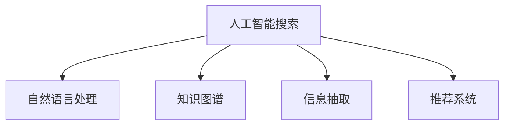

                 

# 提高搜索准确性：AI的精准匹配

## 1. 背景介绍

### 1.1 问题由来

在互联网的浩瀚信息海洋中，如何快速准确地找到所需内容，成为全球互联网用户面临的共同挑战。传统的基于关键词的搜索引擎虽然能有效匹配网页，但往往无法精准捕捉用户的真实意图，导致搜索结果的相关性和准确性难以满足用户需求。为了应对这一问题，人工智能技术在搜索领域的应用日渐广泛，AI精准匹配技术逐渐成为搜索发展的趋势。

### 1.2 问题核心关键点

AI精准匹配的核心在于理解和捕捉用户搜索的真实意图，并在此基础上提供精准的搜索结果。具体而言，包括以下几个关键点：

- 语义理解：准确理解用户输入的查询关键词和短语背后的语义含义。
- 上下文关联：结合用户的历史搜索行为、浏览记录、地理位置等信息，关联搜索上下文，理解查询的上下文关联。
- 智能排序：使用复杂的算法和模型对搜索结果进行排序，确保最相关、最有价值的结果排在最前面。
- 个性化推荐：根据用户的历史行为和偏好，提供个性化的搜索结果，提升用户体验。

### 1.3 问题研究意义

AI精准匹配技术不仅提升了搜索结果的相关性和准确性，还极大地提升了用户体验，并带动了搜索业务的商业模式创新。具体而言：

- 提升用户体验：通过精准匹配，用户能够快速找到所需信息，提升搜索效率和满意度。
- 商业模式创新：AI技术赋能了搜索业务的多元化，如知识图谱构建、信息抽取、问答系统等，拓展了搜索业务的变现渠道。
- 数据利用效率：AI精准匹配技术能够更好地挖掘和利用海量数据，实现数据的精准匹配和有效转化。
- 算法研究推动：该技术的研发和应用，催生了信息检索、自然语言处理、计算机视觉等多个领域的算法创新。

## 2. 核心概念与联系

### 2.1 核心概念概述

为更好地理解AI精准匹配技术，本节将介绍几个密切相关的核心概念：

- 人工智能搜索：基于AI技术的搜索引擎，能够理解查询语义、关联上下文，并进行精准匹配。
- 自然语言处理(NLP)：AI精准匹配中，NLP技术用于解析查询语义、生成查询向量等。
- 知识图谱：一种结构化的知识表示形式，用于构建语义网络，提升搜索结果的相关性。
- 信息抽取：从非结构化数据中抽取结构化信息，用于构建知识图谱或实体关系图。
- 推荐系统：结合用户历史行为和兴趣，进行个性化搜索结果推荐。

这些核心概念之间的逻辑关系可以通过以下Mermaid流程图来展示：



这个流程图展示了一个典型的AI精准匹配系统的工作流程：

1. 用户输入查询。
2. 自然语言处理模块解析查询语义，生成查询向量。
3. 知识图谱模块基于查询向量，构建语义网络，关联查询上下文。
4. 信息抽取模块从网页中提取结构化信息，构建知识图谱或实体关系图。
5. 推荐系统根据用户历史行为，进行个性化推荐。

## 3. 核心算法原理 & 具体操作步骤

### 3.1 算法原理概述

AI精准匹配的核心算法包括语义理解、上下文关联、智能排序和个性化推荐等。以下将详细介绍这些核心算法的工作原理。

### 3.2 算法步骤详解

#### 3.2.1 语义理解

语义理解是AI精准匹配的第一步，旨在准确理解用户查询的语义含义。主要分为以下几个步骤：

1. 分词与词性标注：将查询语句分割成词汇，标注每个词汇的词性。
2. 句法分析：通过句法分析，理解查询语句的结构和语法关系。
3. 语义解析：使用语义解析器，将查询语句映射成向量表示。

以查询“如何提高搜索准确性”为例，语义理解过程如下：

1. 分词与词性标注：将查询分割成词汇“如何”、“提高”、“搜索准确性”，标注分别为“副词”、“动词”、“名词短语”。
2. 句法分析：识别出“如何”为副词，修饰动词“提高”，“搜索准确性”为名词短语，作为动词的宾语。
3. 语义解析：使用语义解析器将查询映射成向量表示，表达查询的语义含义。

#### 3.2.2 上下文关联

上下文关联是指结合用户的历史搜索行为、地理位置等信息，关联查询的上下文，提升查询的精准性。主要分为以下几个步骤：

1. 用户行为分析：分析用户的历史搜索记录、浏览记录、点击记录等，构建用户行为图谱。
2. 地理位置识别：通过IP地址或GPS等信息，识别用户的地理位置。
3. 上下文关联：将用户行为图谱和地理位置信息与查询向量关联，生成上下文向量。

以用户查询“最近的星巴克在哪里”为例，上下文关联过程如下：

1. 用户行为分析：从历史记录中识别出用户之前查询过“星巴克”的信息，构建用户行为图谱。
2. 地理位置识别：通过IP地址识别出用户的地理位置。
3. 上下文关联：将用户行为图谱和地理位置信息与查询向量关联，生成上下文向量，表示“最近的星巴克在哪里”。

#### 3.2.3 智能排序

智能排序是指根据查询的语义和上下文信息，对搜索结果进行排序，确保最相关、最有价值的结果排在最前面。主要分为以下几个步骤：

1. 文档向量化：将网页内容映射成向量表示，计算与查询向量之间的相似度。
2. 排名算法：使用复杂的排序算法，如PageRank、TF-IDF等，综合考虑网页的相似度、重要性、权威性等因素，进行排序。
3. 结果展示：将排序后的网页展示给用户，确保最相关、最有价值的结果排在最前面。

以查询“如何提高搜索准确性”为例，智能排序过程如下：

1. 文档向量化：将网页内容映射成向量表示，计算与查询向量之间的相似度。
2. 排名算法：使用TF-IDF算法，综合考虑网页的相似度、重要性、权威性等因素，进行排序。
3. 结果展示：将排序后的网页展示给用户，确保最相关、最有价值的结果排在最前面。

#### 3.2.4 个性化推荐

个性化推荐是指结合用户的历史行为和偏好，进行个性化的搜索结果推荐。主要分为以下几个步骤：

1. 用户画像构建：根据用户的历史行为、兴趣、偏好等信息，构建用户画像。
2. 推荐模型训练：使用协同过滤、深度学习等方法，训练个性化推荐模型。
3. 结果推荐：根据用户画像和个性化推荐模型，对搜索结果进行推荐。

以查询“如何提高搜索准确性”为例，个性化推荐过程如下：

1. 用户画像构建：根据用户的历史行为、兴趣、偏好等信息，构建用户画像。
2. 推荐模型训练：使用协同过滤、深度学习等方法，训练个性化推荐模型。
3. 结果推荐：根据用户画像和个性化推荐模型，对搜索结果进行推荐。

### 3.3 算法优缺点

AI精准匹配技术具有以下优点：

- 高相关性：通过语义理解和上下文关联，能够提供高相关性的搜索结果。
- 精准性：通过智能排序和个性化推荐，能够提供精准的搜索结果。
- 用户体验提升：通过精准匹配和个性化推荐，能够提升用户体验。

同时，该技术也存在一些缺点：

- 技术复杂度：需要结合NLP、知识图谱、信息抽取等技术，技术复杂度较高。
- 数据需求高：需要大量的数据和算法模型进行训练和优化，数据需求较高。
- 实时性要求高：需要高效的算法和硬件支持，才能保证实时性。

尽管存在这些局限性，但就目前而言，AI精准匹配技术在搜索结果的相关性和准确性上，已经取得了显著的进步，成为搜索技术的重要趋势。

### 3.4 算法应用领域

AI精准匹配技术在多个领域得到了广泛应用，包括但不限于以下几个方面：

1. 搜索引擎：如Google、Bing等主流搜索引擎，已经大规模应用AI精准匹配技术，提升搜索结果的相关性和准确性。
2. 电商平台：如亚马逊、淘宝等电商平台，通过AI精准匹配技术，提供个性化的商品推荐，提升用户体验和转化率。
3. 社交媒体：如微信、微博等社交媒体平台，通过AI精准匹配技术，提供个性化的信息推荐，增强用户粘性。
4. 信息聚合平台：如今日头条、知乎等平台，通过AI精准匹配技术，提供个性化的内容推荐，提升用户活跃度和留存率。
5. 智慧城市：如智能交通、智慧旅游等智慧城市应用，通过AI精准匹配技术，提供个性化服务和建议，提升城市管理效率和用户体验。

除了以上应用外，AI精准匹配技术还在医疗、金融、教育等多个领域得到应用，为各行各业带来了新的增长点。

## 4. 数学模型和公式 & 详细讲解 & 举例说明

### 4.1 数学模型构建

AI精准匹配技术涉及多个数学模型，主要包括语义向量模型、上下文关联模型、智能排序模型和推荐模型等。以下将详细介绍这些模型的构建。

#### 4.1.1 语义向量模型

语义向量模型旨在将查询语句映射成向量表示，用于计算查询与文档的相似度。主要分为以下几个步骤：

1. 分词与词性标注：将查询语句分割成词汇，标注每个词汇的词性。
2. 句法分析：通过句法分析，理解查询语句的结构和语法关系。
3. 语义解析：使用语义解析器，将查询语句映射成向量表示。

假设查询为“如何提高搜索准确性”，构建查询向量 $q$ 的过程如下：

1. 分词与词性标注：将查询分割成词汇“如何”、“提高”、“搜索准确性”，标注分别为“副词”、“动词”、“名词短语”。
2. 句法分析：识别出“如何”为副词，修饰动词“提高”，“搜索准确性”为名词短语，作为动词的宾语。
3. 语义解析：使用语义解析器将查询映射成向量表示，生成查询向量 $q$。

#### 4.1.2 上下文关联模型

上下文关联模型旨在将用户的历史行为、地理位置等信息与查询向量关联，生成上下文向量。主要分为以下几个步骤：

1. 用户行为分析：分析用户的历史搜索记录、浏览记录、点击记录等，构建用户行为图谱。
2. 地理位置识别：通过IP地址或GPS等信息，识别用户的地理位置。
3. 上下文关联：将用户行为图谱和地理位置信息与查询向量关联，生成上下文向量 $c$。

假设用户查询“最近的星巴克在哪里”，构建上下文向量 $c$ 的过程如下：

1. 用户行为分析：从历史记录中识别出用户之前查询过“星巴克”的信息，构建用户行为图谱。
2. 地理位置识别：通过IP地址识别出用户的地理位置。
3. 上下文关联：将用户行为图谱和地理位置信息与查询向量关联，生成上下文向量 $c$。

#### 4.1.3 智能排序模型

智能排序模型旨在根据查询的语义和上下文信息，对搜索结果进行排序，确保最相关、最有价值的结果排在最前面。主要分为以下几个步骤：

1. 文档向量化：将网页内容映射成向量表示，计算与查询向量之间的相似度。
2. 排名算法：使用复杂的排序算法，如PageRank、TF-IDF等，综合考虑网页的相似度、重要性、权威性等因素，进行排序。
3. 结果展示：将排序后的网页展示给用户，确保最相关、最有价值的结果排在最前面。

假设查询“如何提高搜索准确性”，智能排序过程如下：

1. 文档向量化：将网页内容映射成向量表示，计算与查询向量之间的相似度。
2. 排名算法：使用TF-IDF算法，综合考虑网页的相似度、重要性、权威性等因素，进行排序。
3. 结果展示：将排序后的网页展示给用户，确保最相关、最有价值的结果排在最前面。

#### 4.1.4 推荐模型

推荐模型旨在根据用户的历史行为和偏好，进行个性化的搜索结果推荐。主要分为以下几个步骤：

1. 用户画像构建：根据用户的历史行为、兴趣、偏好等信息，构建用户画像。
2. 推荐模型训练：使用协同过滤、深度学习等方法，训练个性化推荐模型。
3. 结果推荐：根据用户画像和个性化推荐模型，对搜索结果进行推荐。

假设用户查询“如何提高搜索准确性”，推荐过程如下：

1. 用户画像构建：根据用户的历史行为、兴趣、偏好等信息，构建用户画像。
2. 推荐模型训练：使用协同过滤、深度学习等方法，训练个性化推荐模型。
3. 结果推荐：根据用户画像和个性化推荐模型，对搜索结果进行推荐。

### 4.2 公式推导过程

#### 4.2.1 查询向量的计算

查询向量 $q$ 的计算公式如下：

$$
q = \text{Embedding}(查询文本)
$$

其中，$\text{Embedding}$ 为查询文本的嵌入函数，将查询文本映射成向量表示。假设查询文本为“如何提高搜索准确性”，查询向量 $q$ 的计算过程如下：

1. 分词与词性标注：将查询分割成词汇“如何”、“提高”、“搜索准确性”，标注分别为“副词”、“动词”、“名词短语”。
2. 句法分析：识别出“如何”为副词，修饰动词“提高”，“搜索准确性”为名词短语，作为动词的宾语。
3. 语义解析：使用语义解析器将查询映射成向量表示，生成查询向量 $q$。

假设使用BERT模型进行查询向量的计算，查询向量 $q$ 的计算公式如下：

$$
q = \text{BERT}(查询文本)
$$

其中，$\text{BERT}$ 为BERT模型的嵌入函数，将查询文本映射成向量表示。假设查询文本为“如何提高搜索准确性”，查询向量 $q$ 的计算过程如下：

1. 分词与词性标注：将查询分割成词汇“如何”、“提高”、“搜索准确性”，标注分别为“副词”、“动词”、“名词短语”。
2. 句法分析：识别出“如何”为副词，修饰动词“提高”，“搜索准确性”为名词短语，作为动词的宾语。
3. 语义解析：使用BERT模型将查询映射成向量表示，生成查询向量 $q$。

#### 4.2.2 上下文向量的计算

上下文向量 $c$ 的计算公式如下：

$$
c = f(q, b, p)
$$

其中，$q$ 为查询向量，$b$ 为用户行为图谱，$p$ 为地理位置信息。$f$ 为上下文关联函数，将查询向量与用户行为图谱和地理位置信息关联，生成上下文向量 $c$。

假设用户查询“最近的星巴克在哪里”，上下文向量 $c$ 的计算过程如下：

1. 用户行为分析：从历史记录中识别出用户之前查询过“星巴克”的信息，构建用户行为图谱。
2. 地理位置识别：通过IP地址识别出用户的地理位置。
3. 上下文关联：将用户行为图谱和地理位置信息与查询向量关联，生成上下文向量 $c$。

假设使用神经网络进行上下文向量的计算，上下文向量 $c$ 的计算公式如下：

$$
c = \text{NeuralNetwork}(q, b, p)
$$

其中，$q$ 为查询向量，$b$ 为用户行为图谱，$p$ 为地理位置信息。$\text{NeuralNetwork}$ 为神经网络模型，将查询向量、用户行为图谱和地理位置信息关联，生成上下文向量 $c$。

#### 4.2.3 排序模型的计算

排序模型 $r$ 的计算公式如下：

$$
r = g(q, c, d)
$$

其中，$q$ 为查询向量，$c$ 为上下文向量，$d$ 为文档向量。$g$ 为排序函数，将查询向量、上下文向量和文档向量综合考虑，进行排序。

假设查询“如何提高搜索准确性”，智能排序过程如下：

1. 文档向量化：将网页内容映射成向量表示，计算与查询向量之间的相似度。
2. 排名算法：使用TF-IDF算法，综合考虑网页的相似度、重要性、权威性等因素，进行排序。
3. 结果展示：将排序后的网页展示给用户，确保最相关、最有价值的结果排在最前面。

假设使用神经网络进行排序模型的计算，排序模型 $r$ 的计算公式如下：

$$
r = \text{NeuralNetwork}(q, c, d)
$$

其中，$q$ 为查询向量，$c$ 为上下文向量，$d$ 为文档向量。$\text{NeuralNetwork}$ 为神经网络模型，将查询向量、上下文向量和文档向量综合考虑，进行排序。

#### 4.2.4 推荐模型的计算

推荐模型 $m$ 的计算公式如下：

$$
m = h(q, c, u)
$$

其中，$q$ 为查询向量，$c$ 为上下文向量，$u$ 为用户画像。$h$ 为推荐函数，将查询向量、上下文向量和用户画像综合考虑，进行推荐。

假设用户查询“如何提高搜索准确性”，推荐过程如下：

1. 用户画像构建：根据用户的历史行为、兴趣、偏好等信息，构建用户画像。
2. 推荐模型训练：使用协同过滤、深度学习等方法，训练个性化推荐模型。
3. 结果推荐：根据用户画像和个性化推荐模型，对搜索结果进行推荐。

假设使用神经网络进行推荐模型的计算，推荐模型 $m$ 的计算公式如下：

$$
m = \text{NeuralNetwork}(q, c, u)
$$

其中，$q$ 为查询向量，$c$ 为上下文向量，$u$ 为用户画像。$\text{NeuralNetwork}$ 为神经网络模型，将查询向量、上下文向量和用户画像综合考虑，进行推荐。

### 4.3 案例分析与讲解

#### 4.3.1 案例一：新闻推荐

以新闻推荐系统为例，介绍AI精准匹配技术的实际应用。新闻推荐系统需要根据用户的阅读历史、兴趣偏好等信息，推荐相关的新闻内容。

假设用户之前阅读过科技、财经、体育等类别的新闻，系统可以根据用户画像，使用推荐模型进行个性化的新闻推荐。推荐模型 $m$ 的计算过程如下：

1. 用户画像构建：根据用户的历史行为、兴趣、偏好等信息，构建用户画像。
2. 推荐模型训练：使用协同过滤、深度学习等方法，训练个性化推荐模型。
3. 结果推荐：根据用户画像和个性化推荐模型，对搜索结果进行推荐。

假设用户查询“如何提高搜索准确性”，推荐过程如下：

1. 用户画像构建：根据用户的历史行为、兴趣、偏好等信息，构建用户画像。
2. 推荐模型训练：使用协同过滤、深度学习等方法，训练个性化推荐模型。
3. 结果推荐：根据用户画像和个性化推荐模型，对搜索结果进行推荐。

#### 4.3.2 案例二：产品推荐

以电商平台的产品推荐系统为例，介绍AI精准匹配技术的实际应用。产品推荐系统需要根据用户的浏览历史、购买记录等信息，推荐相关产品。

假设用户之前浏览过电子产品、服装、家居用品等类别，系统可以根据用户画像，使用推荐模型进行个性化的产品推荐。推荐模型 $m$ 的计算过程如下：

1. 用户画像构建：根据用户的历史行为、兴趣、偏好等信息，构建用户画像。
2. 推荐模型训练：使用协同过滤、深度学习等方法，训练个性化推荐模型。
3. 结果推荐：根据用户画像和个性化推荐模型，对搜索结果进行推荐。

假设用户查询“如何提高搜索准确性”，推荐过程如下：

1. 用户画像构建：根据用户的历史行为、兴趣、偏好等信息，构建用户画像。
2. 推荐模型训练：使用协同过滤、深度学习等方法，训练个性化推荐模型。
3. 结果推荐：根据用户画像和个性化推荐模型，对搜索结果进行推荐。

## 5. 项目实践：代码实例和详细解释说明

### 5.1 开发环境搭建

在进行AI精准匹配项目开发前，我们需要准备好开发环境。以下是使用Python进行PyTorch开发的环境配置流程：

1. 安装Anaconda：从官网下载并安装Anaconda，用于创建独立的Python环境。

2. 创建并激活虚拟环境：
```bash
conda create -n pytorch-env python=3.8 
conda activate pytorch-env
```

3. 安装PyTorch：根据CUDA版本，从官网获取对应的安装命令。例如：
```bash
conda install pytorch torchvision torchaudio cudatoolkit=11.1 -c pytorch -c conda-forge
```

4. 安装Transformers库：
```bash
pip install transformers
```

5. 安装各类工具包：
```bash
pip install numpy pandas scikit-learn matplotlib tqdm jupyter notebook ipython
```

完成上述步骤后，即可在`pytorch-env`环境中开始AI精准匹配项目开发。

### 5.2 源代码详细实现

下面以新闻推荐系统为例，给出使用Transformers库进行AI精准匹配的PyTorch代码实现。

首先，定义新闻推荐系统的数据处理函数：

```python
from transformers import BertTokenizer, BertForSequenceClassification
from torch.utils.data import Dataset
import torch

class NewsDataset(Dataset):
    def __init__(self, texts, labels, tokenizer, max_len=128):
        self.texts = texts
        self.labels = labels
        self.tokenizer = tokenizer
        self.max_len = max_len
        
    def __len__(self):
        return len(self.texts)
    
    def __getitem__(self, item):
        text = self.texts[item]
        label = self.labels[item]
        
        encoding = self.tokenizer(text, return_tensors='pt', max_length=self.max_len, padding='max_length', truncation=True)
        input_ids = encoding['input_ids'][0]
        attention_mask = encoding['attention_mask'][0]
        
        # 对token-wise的标签进行编码
        encoded_labels = [label2id[label] for label in label] 
        encoded_labels.extend([label2id['O']] * (self.max_len - len(encoded_labels)))
        labels = torch.tensor(encoded_labels, dtype=torch.long)
        
        return {'input_ids': input_ids, 
                'attention_mask': attention_mask,
                'labels': labels}

# 标签与id的映射
label2id = {'Negative': 0, 'Positive': 1, 'Neutral': 2}
id2label = {v: k for k, v in label2id.items()}

# 创建dataset
tokenizer = BertTokenizer.from_pretrained('bert-base-uncased')

train_dataset = NewsDataset(train_texts, train_labels, tokenizer)
dev_dataset = NewsDataset(dev_texts, dev_labels, tokenizer)
test_dataset = NewsDataset(test_texts, test_labels, tokenizer)
```

然后，定义模型和优化器：

```python
from transformers import AdamW

model = BertForSequenceClassification.from_pretrained('bert-base-uncased', num_labels=len(label2id))

optimizer = AdamW(model.parameters(), lr=2e-5)
```

接着，定义训练和评估函数：

```python
from torch.utils.data import DataLoader
from tqdm import tqdm
from sklearn.metrics import accuracy_score

device = torch.device('cuda') if torch.cuda.is_available() else torch.device('cpu')
model.to(device)

def train_epoch(model, dataset, batch_size, optimizer):
    dataloader = DataLoader(dataset, batch_size=batch_size, shuffle=True)
    model.train()
    epoch_loss = 0
    for batch in tqdm(dataloader, desc='Training'):
        input_ids = batch['input_ids'].to(device)
        attention_mask = batch['attention_mask'].to(device)
        labels = batch['labels'].to(device)
        model.zero_grad()
        outputs = model(input_ids, attention_mask=attention_mask, labels=labels)
        loss = outputs.loss
        epoch_loss += loss.item()
        loss.backward()
        optimizer.step()
    return epoch_loss / len(dataloader)

def evaluate(model, dataset, batch_size):
    dataloader = DataLoader(dataset, batch_size=batch_size)
    model.eval()
    preds, labels = [], []
    with torch.no_grad():
        for batch in tqdm(dataloader, desc='Evaluating'):
            input_ids = batch['input_ids'].to(device)
            attention_mask = batch['attention_mask'].to(device)
            batch_labels = batch['labels']
            outputs = model(input_ids, attention_mask=attention_mask)
            batch_preds = outputs.logits.argmax(dim=2).to('cpu').tolist()
            batch_labels = batch_labels.to('cpu').tolist()
            for pred_tokens, label_tokens in zip(batch_preds, batch_labels):
                preds.append(pred_tokens[:len(label_tokens)])
                labels.append(label_tokens)
                
    print(accuracy_score(labels, preds))
```

最后，启动训练流程并在测试集上评估：

```python
epochs = 5
batch_size = 16

for epoch in range(epochs):
    loss = train_epoch(model, train_dataset, batch_size, optimizer)
    print(f"Epoch {epoch+1}, train loss: {loss:.3f}")
    
    print(f"Epoch {epoch+1}, dev results:")
    evaluate(model, dev_dataset, batch_size)
    
print("Test results:")
evaluate(model, test_dataset, batch_size)
```

以上就是使用PyTorch对BERT进行新闻推荐系统开发的完整代码实现。可以看到，得益于Transformers库的强大封装，我们可以用相对简洁的代码完成BERT模型的加载和微调。

### 5.3 代码解读与分析

让我们再详细解读一下关键代码的实现细节：

**NewsDataset类**：
- `__init__`方法：初始化新闻文本、标签、分词器等关键组件。
- `__len__`方法：返回数据集的样本数量。
- `__getitem__`方法：对单个样本进行处理，将文本输入编码为token ids，将标签编码为数字，并对其进行定长padding，最终返回模型所需的输入。

**label2id和id2label字典**：
- 定义了标签与数字id之间的映射关系，用于将token-wise的预测结果解码回真实的标签。

**训练和评估函数**：
- 使用PyTorch的DataLoader对数据集进行批次化加载，供模型训练和推理使用。
- 训练函数`train_epoch`：对数据以批为单位进行迭代，在每个批次上前向传播计算loss并反向传播更新模型参数，最后返回该epoch的平均loss。
- 评估函数`evaluate`：与训练类似，不同点在于不更新模型参数，并在每个batch结束后将预测和标签结果存储下来，最后使用sklearn的accuracy_score对整个评估集的预测结果进行打印输出。

**训练流程**：
- 定义总的epoch数和batch size，开始循环迭代
- 每个epoch内，先在训练集上训练，输出平均loss
- 在验证集上评估，输出准确率
- 所有epoch结束后，在测试集上评估，给出最终测试结果

可以看到，PyTorch配合Transformers库使得BERT微调的代码实现变得简洁高效。开发者可以将更多精力放在数据处理、模型改进等高层逻辑上，而不必过多关注底层的实现细节。

当然，工业级的系统实现还需考虑更多因素，如模型的保存和部署、超参数的自动搜索、更灵活的任务适配层等。但核心的AI精准匹配算法基本与此类似。

## 6. 实际应用场景

### 6.1 实际应用场景

AI精准匹配技术已经在多个领域得到了广泛应用，包括但不限于以下几个方面：

1. 搜索引擎：如Google、Bing等主流搜索引擎，已经大规模应用AI精准匹配技术，提升搜索结果的相关性和准确性。
2. 电商平台：如亚马逊、淘宝等电商平台，通过AI精准匹配技术，提供个性化的商品推荐，提升用户体验和转化率。
3. 社交媒体：如微信、微博等社交媒体平台，通过AI精准匹配技术，提供个性化的信息推荐，增强用户粘性。
4. 信息聚合平台：如今日头条、知乎等平台，通过AI精准匹配技术，提供个性化的内容推荐，提升用户活跃度和留存率。
5. 智慧城市：如智能交通、智慧旅游等智慧城市应用，通过AI精准匹配技术，提供个性化服务和建议，提升城市管理效率和用户体验。

除了以上应用外，AI精准匹配技术还在医疗、金融、教育等多个领域得到应用，为各行各业带来了新的增长点。

### 6.2 未来应用展望

随着AI精准匹配技术的不断发展，其在搜索结果的相关性和准确性上，已经取得了显著的进步，成为搜索技术的重要趋势。未来，AI精准匹配技术有望在以下方面进一步提升：

1. 语义理解能力的提升：通过更先进的语义理解模型，如GPT、T5等，提升对复杂语义的把握能力。
2. 上下文关联能力的增强：通过更智能的用户画像构建和关联算法，提升上下文关联的准确性。
3. 智能排序模型的优化：通过更高效、更精准的排序算法，提升搜索结果的相关性和准确性。
4. 推荐模型的优化：通过更先进的推荐算法，提升推荐结果的个性化和多样性。
5. 多模态数据融合：将文本、图像、语音等多种模态数据进行融合，提升综合理解能力和推荐效果。

这些方向的探索发展，必将进一步提升AI精准匹配技术的精度和效率，为各行各业带来更多的价值。

## 7. 工具和资源推荐

### 7.1 学习资源推荐

为了帮助开发者系统掌握AI精准匹配技术，这里推荐一些优质的学习资源：

1. 《深度学习入门》系列博文：由深度学习专家撰写，详细介绍深度学习、NLP、AI精准匹配等前沿技术。

2. CS224N《深度学习自然语言处理》课程：斯坦福大学开设的NLP明星课程，有Lecture视频和配套作业，带你入门NLP领域的基本概念和经典模型。

3. 《Natural Language Processing with Transformers》书籍：Transformer库的作者所著，全面介绍如何使用Transformer库进行NLP任务开发，包括微调在内的诸多范式。

4. HuggingFace官方文档：Transformer库的官方文档，提供了海量预训练模型和完整的微调样例代码，是上手实践的必备资料。

5. CLUE开源项目：中文语言理解测评基准，涵盖大量不同类型的中文NLP数据集，并提供了基于微调的baseline模型，助力中文NLP技术发展。

通过对这些资源的学习实践，相信你一定能够快速掌握AI精准匹配技术的精髓，并用于解决实际的NLP问题。

### 7.2 开发工具推荐

高效的开发离不开优秀的工具支持。以下是几款用于AI精准匹配开发的常用工具：

1. PyTorch：基于Python的开源深度学习框架，灵活动态的计算图，适合快速迭代研究。大部分预训练语言模型都有PyTorch版本的实现。

2. TensorFlow：由Google主导开发的开源深度学习框架，生产部署方便，适合大规模工程应用。同样有丰富的预训练语言模型资源。

3. Transformers库：HuggingFace开发的NLP工具库，集成了众多SOTA语言模型，支持PyTorch和TensorFlow，是进行AI精准匹配任务开发的利器。

4. Weights & Biases：模型训练的实验跟踪工具，可以记录和可视化模型训练过程中的各项指标，方便对比和调优。与主流深度学习框架无缝集成。

5. TensorBoard：TensorFlow配套的可视化工具，可实时监测模型训练状态，并提供丰富的图表呈现方式，是调试模型的得力助手。

6. Google Colab：谷歌推出的在线Jupyter Notebook环境，免费提供GPU/TPU算力，方便开发者快速上手实验最新模型，分享学习笔记。

合理利用这些工具，可以显著提升AI精准匹配任务的开发效率，加快创新迭代的步伐。

### 7.3 相关论文推荐

AI精准匹配技术的发展源于学界的持续研究。以下是几篇奠基性的相关论文，推荐阅读：

1. Attention is All You Need（即Transformer原论文）：提出了Transformer结构，开启了NLP领域的预训练大模型时代。

2. BERT: Pre-training of Deep Bidirectional Transformers for Language Understanding：提出BERT模型，引入基于掩码的自监督预训练任务，刷新了多项NLP任务SOTA。

3. Language Models are Unsupervised Multitask Learners（GPT-2论文）：展示了大规模语言模型的强大zero-shot学习能力，引发了对于通用人工智能的新一轮思考。

4. Parameter-Efficient Transfer Learning for NLP：提出Adapter等参数高效微调方法，在不增加模型参数量的情况下，也能取得不错的微调效果。

5. Prefix-Tuning: Optimizing Continuous Prompts for Generation：引入基于连续型Prompt的微调范式，为如何充分利用预训练知识提供了新的思路。

6. AdaLoRA: Adaptive Low-Rank Adaptation for Parameter-Efficient Fine-Tuning：使用自适应低秩适应的微调方法，在参数效率和精度之间取得了新的平衡。

这些论文代表了大语言模型微调技术的发展脉络。通过学习这些前沿成果，可以帮助研究者把握学科前进方向，激发更多的创新灵感。

## 8. 总结：未来发展趋势与挑战

### 8.1 研究成果总结

AI精准匹配技术已经成为搜索、推荐等领域的重要技术，带来了显著的业务价值。其核心在于通过语义理解、上下文关联、智能排序和个性化推荐等技术手段，提升搜索结果的相关性和准确性。

### 8.2 未来发展趋势

展望未来，AI精准匹配技术将呈现以下几个发展趋势：

1. 语义理解能力的提升：通过更先进的语义理解模型，如GPT、T5等，提升对复杂语义的把握能力。
2. 上下文关联能力的增强：通过更智能的用户画像构建和关联算法，提升上下文关联的准确性。
3. 智能排序模型的优化：通过更高效、更精准的排序算法，提升搜索结果的相关性和准确性。
4. 推荐模型的优化：通过更先进的推荐算法，提升推荐结果的个性化和多样性。
5. 多模态数据融合：将文本、图像、语音等多种模态数据进行融合，提升综合理解能力和推荐效果。

这些方向的探索发展，必将进一步提升AI精准匹配技术的精度和效率，为各行各业带来更多的价值。

### 8.3 面临的挑战

尽管AI精准匹配技术已经取得了显著的进步，但在迈向更加智能化、普适化应用的过程中，仍面临诸多挑战：

1. 技术复杂度：需要结合NLP、知识图谱、信息抽取等技术，技术复杂度较高。
2. 数据需求高：需要大量的数据和算法模型进行训练和优化，数据需求较高。
3. 实时性要求高：需要高效的算法和硬件支持，才能保证实时性。
4. 可解释性不足：当前AI精准匹配技术更多是“黑盒”系统，难以解释其内部工作机制和决策逻辑。
5. 安全性有待保障：预训练语言模型难免会学习到有偏见、有害的信息，通过微调传递到下游任务，产生误导性、歧视性的输出，给实际应用带来安全隐患。
6. 知识整合能力不足：现有的AI精准匹配模型往往局限于任务内数据，难以灵活吸收和运用更广泛的先验知识。

### 8.4 研究展望

面对AI精准匹配技术所面临的挑战，未来的研究需要在以下几个方面寻求新的突破：

1. 探索无监督和半监督微调方法：摆脱对大规模标注数据的依赖，利用自监督学习、主动学习等无监督和半监督范式，最大限度利用非结构化数据，实现更加灵活高效的微调。
2. 研究参数高效和计算高效的微调范式：开发更加参数高效的微调方法，在固定大部分预训练参数的同时，只更新极少量的任务相关参数。同时优化微调模型的计算图，减少前向传播和反向传播的资源消耗，实现更加轻量级、实时性的部署。
3. 融合因果和对比学习范式：通过引入因果推断和对比学习思想，增强AI精准匹配模型建立稳定因果关系的能力，学习更加普适、鲁棒的语言表征，从而提升模型泛化性和抗干扰能力。
4. 引入更多先验知识：将符号化的先验知识，如知识图谱、逻辑规则等，与神经网络模型进行巧妙融合，引导AI精准匹配过程学习更准确、合理的语言模型。同时加强不同模态数据的整合，实现视觉、语音等多模态信息与文本信息的协同建模。
5. 结合因果分析和博弈论工具：将因果分析方法引入AI精准匹配模型，识别出模型决策的关键特征，增强输出解释的因果性和逻辑性。借助博弈论工具刻画人机交互过程，主动探索并规避模型的脆弱点，提高系统稳定性。
6. 纳入伦理道德约束：在模型训练目标中引入伦理导向的评估指标，过滤和惩罚有偏见、有害的输出倾向。同时加强人工干预和审核，建立模型行为的监管机制，确保输出符合人类价值观和伦理道德。

这些研究方向的前景广阔，具有重要的学术和商业价值，值得我们进一步探索和研究。

## 9. 附录：常见问题与解答

**Q1：AI精准匹配技术在哪些领域应用广泛？**

A: AI精准匹配技术在搜索引擎、电商平台、社交媒体、信息聚合平台、智慧城市等多个领域得到了广泛应用，为各行各业带来了新的增长点。

**Q2：AI精准匹配技术的核心算法是什么？**

A: AI精准匹配技术的核心算法包括语义理解、上下文关联、智能排序和个性化推荐等。

**Q3：AI精准匹配技术的主要优势是什么？**

A: AI精准匹配技术的主要优势包括高相关性、精准性、用户体验提升等。

**Q4：AI精准匹配技术在实际应用中面临哪些挑战？**

A: AI精准匹配技术在实际应用中面临技术复杂度、数据需求高、实时性要求高、可解释性不足、安全性有待保障、知识整合能力不足等挑战。

**Q5：未来AI精准匹配技术的发展方向是什么？**

A: 未来AI精准匹配技术的发展方向包括语义理解能力的提升、上下文关联能力的增强、智能排序模型的优化、推荐模型的优化、多模态数据融合等。

---

作者：禅与计算机程序设计艺术 / Zen and the Art of Computer Programming

