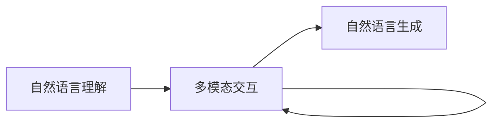

                 

## 1. 背景介绍

在互联网时代，搜索引擎（Search Engine）已成为用户获取信息、解决问题、探索世界的重要工具。传统的基于关键词匹配的搜索方式，已经无法满足用户日益丰富的查询需求。随着自然语言处理（NLP）技术的突破，对话式搜索（Conversational Search）成为了搜索引擎的新范式，带来了交互式、自然流畅的用户体验。

### 1.1 问题由来

传统的关键词搜索方式，用户需要通过简短、清晰的关键词描述来表达查询意图，但这往往忽略了用户的具体上下文和问题意图。例如，查询“天气”时，不同用户可能希望获取当前天气、未来天气预报、气象灾害预警等不同信息。如果用户不清楚如何准确表达，搜索引擎难以理解其真实需求。

此外，由于搜索结果的展示形式和获取方式相对单一，用户需要多次点击链接，浏览大量重复或不相关的内容，用户体验较差。而对话式搜索通过自然语言理解和对话管理，能够根据用户上下文动态调整查询，提供更精确、更个性化的结果。

### 1.2 问题核心关键点

对话式搜索的核心在于构建对话式搜索引擎模型，该模型能够在用户与系统的交互过程中，理解上下文语义，生成自然语言回复，并根据用户反馈不断优化对话策略。其主要技术包括：

- 自然语言理解（Natural Language Understanding, NLU）：理解用户的意图和语义。
- 对话管理（Dialogue Management, DM）：规划对话流程，生成合理响应。
- 自然语言生成（Natural Language Generation, NLG）：将机器理解转化为自然语言。

这些技术的有机结合，使得对话式搜索引擎能够实现自然流畅的对话，更好地满足用户需求。

### 1.3 问题研究意义

对话式搜索提升了用户获取信息的效率和满意度，不仅在技术上为搜索引擎带来了新的突破，也在用户体验上开辟了新的维度。具体而言，对话式搜索具有以下几方面的意义：

- 提升用户体验：通过自然语言交互，用户不必记忆复杂的搜索语法，即可获取所需信息。
- 增强查询精确性：基于上下文理解和交互反馈，搜索引擎能够更精准地理解用户需求，生成相关搜索结果。
- 拓展应用场景：对话式搜索可以应用于智能客服、虚拟助手、智能家居等多个场景，提供无缝交互的智能化服务。
- 推动技术进步：对话式搜索的技术进步将促进NLP、语音识别、对话管理等领域的快速发展。

## 2. 核心概念与联系

### 2.1 核心概念概述

为更好地理解对话式搜索引擎模型的原理与架构，本节将介绍几个核心概念：

- 自然语言理解（NLU）：识别和理解用户的自然语言输入，提取关键信息。
- 对话管理（DM）：规划和控制对话流程，确定合适的系统响应。
- 自然语言生成（NLG）：将系统理解转化为自然语言响应。
- 知识图谱（Knowledge Graph）：结构化知识库，用于提升对话系统对复杂查询的理解能力。
- 多模态交互（Multimodal Interaction）：结合视觉、听觉等多模态信息，提升交互体验。

这些概念通过Mermaid流程图可以直观展示它们之间的关系：



这个流程图展示了NLU、DM和NLG三个核心组件通过知识图谱和多模态交互技术的辅助，实现用户与系统之间的自然交互。

## 3. 核心算法原理 & 具体操作步骤
### 3.1 算法原理概述

对话式搜索引擎模型的算法原理可以概括为：

1. **自然语言理解（NLU）**：通过深度学习模型对用户输入的自然语言进行分词、词性标注、依存句法分析等处理，抽取关键实体和关系，生成语义表示。
2. **对话管理（DM）**：根据用户历史互动和当前输入，动态生成对话策略，确定合适的系统响应。
3. **自然语言生成（NLG）**：将系统理解转化为自然语言，生成合理回答。
4. **知识图谱辅助**：利用知识图谱中的实体关系信息，辅助理解复杂查询，生成更为精准的响应。
5. **多模态交互**：结合视觉、语音等多模态信息，增强交互体验，提升查询效果。

这些步骤通过深度学习模型和规则引擎进行自动化的交互处理，实现系统与用户之间的自然语言对话。

### 3.2 算法步骤详解

以下将详细介绍对话式搜索引擎模型的构建步骤：

**Step 1: 准备数据集和模型**
- 收集对话数据集，包括用户查询、系统回复和用户反馈等，作为模型训练的样本。
- 选择合适的深度学习模型（如Transformers、LSTM等），用于自然语言理解和生成。

**Step 2: 构建自然语言理解模型**
- 对用户输入进行分词、词性标注和依存句法分析，生成语义表示。
- 使用BERT、GPT等预训练模型进行微调，以提取关键实体和关系。
- 引入知识图谱技术，增强模型对复杂查询的理解能力。

**Step 3: 构建对话管理模型**
- 设计对话策略，确定系统响应。
- 引入强化学习或规则引擎，动态优化对话策略。
- 集成多模态交互技术，提升用户体验。

**Step 4: 构建自然语言生成模型**
- 使用GPT、LSTM等模型，将系统理解转化为自然语言。
- 引入语言风格调整技术，使回复符合用户偏好。

**Step 5: 模型评估与优化**
- 在测试集上评估模型性能，使用BLEU、ROUGE等指标进行衡量。
- 根据用户反馈不断调整和优化模型，提升交互效果。

**Step 6: 实际部署与应用**
- 将模型部署到搜索引擎平台，进行实时交互。
- 结合多模态交互技术，提供视觉、语音等多模态查询方式。

### 3.3 算法优缺点

对话式搜索引擎模型具有以下优点：

1. 用户友好：通过自然语言交互，用户无需记忆复杂的搜索语法，即可获取所需信息。
2. 查询精确：基于上下文理解和交互反馈，系统能够更精准地理解用户需求，生成相关搜索结果。
3. 拓展应用场景：对话式搜索可以应用于智能客服、虚拟助手、智能家居等多个场景，提供无缝交互的智能化服务。

然而，该模型也存在一些局限性：

1. 数据依赖：模型需要大量对话数据进行训练，获取高质量标注数据的成本较高。
2. 复杂度增加：对话式搜索涉及NLU、DM和NLG等多个环节，模型复杂度较高。
3. 响应延迟：对话式搜索需要实时处理用户输入，响应延迟较大。
4. 多模态交互：需要同时处理视觉、语音等多模态信息，技术实现较为复杂。

尽管存在这些局限性，但对话式搜索仍具有巨大的发展潜力，将成为搜索引擎未来的重要方向。

### 3.4 算法应用领域

对话式搜索引擎模型已经在多个领域得到了应用，例如：

- 智能客服：通过自然语言理解技术，构建智能客服系统，能够回答用户的常见问题，提供24/7不间断服务。
- 虚拟助手：结合自然语言生成和多模态交互技术，为用户提供个性化服务，如日程安排、购物推荐等。
- 智能家居：通过语音交互和视觉识别技术，实现智能家居设备的自动化控制和管理。
- 智能交通：利用对话式搜索技术，为用户提供实时交通路况、导航建议等。
- 医疗咨询：通过自然语言理解和知识图谱技术，提供医疗咨询和健康管理服务。

## 4. 数学模型和公式 & 详细讲解  
### 4.1 数学模型构建

对话式搜索引擎模型的数学模型可以形式化为：

- 输入：$X = \{x_1, x_2, \dots, x_n\}$，其中$x_i$为第$i$个用户输入的自然语言句子。
- 输出：$Y = \{y_1, y_2, \dots, y_n\}$，其中$y_i$为第$i$个系统的回复。
- 语义表示：$Z = \{z_1, z_2, \dots, z_n\}$，其中$z_i$为第$i$个输入的语义表示。

模型通过以下步骤进行构建和训练：

1. **自然语言理解（NLU）**：
   - 输入：$X$
   - 输出：$Z$

   NLU模型可以采用Transformer、LSTM等深度学习模型进行训练，模型结构如下：

   $$
   Z = \text{NLU}(X)
   $$

2. **对话管理（DM）**：
   - 输入：$Z$
   - 输出：$A$，其中$A$为对话策略，决定系统的下一步操作。

   对话管理模型可以采用基于规则的引擎或强化学习模型进行训练，模型结构如下：

   $$
   A = \text{DM}(Z)
   $$

3. **自然语言生成（NLG）**：
   - 输入：$Z, A$
   - 输出：$Y$

   NLG模型可以采用GPT、LSTM等深度学习模型进行训练，模型结构如下：

   $$
   Y = \text{NLG}(Z, A)
   $$

### 4.2 公式推导过程

以下以一个简单的对话示例，推导对话式搜索引擎模型的具体实现步骤：

**输入：** 用户提问：“今天天气怎么样？”

**自然语言理解（NLU）：**
- 分词：“今天”、“天气”、“怎么样”
- 词性标注：NN、NN、VV
- 依存句法分析：
  - “今天”：主语
  - “天气”：宾语
  - “怎么样”：谓语

**语义表示（$Z$）**：
- 实体抽取：$today$，$weather$
- 关系抽取：$today$和$weather$的关系为“今天天气”

**对话管理（DM）：**
- 当前状态：用户询问天气情况
- 对话策略：获取当前天气信息
- 下一轮输出：请求天气信息

**自然语言生成（NLG）：**
- 系统回复：“请稍等，我帮你查询一下”

具体实现中，可以使用如下代码片段进行演示：

```python
# 自然语言理解（NLU）
nlu_model = TransformerModel()
input_sentence = "今天天气怎么样？"
tokens = nlu_model(input_sentence)
semantic_representation = tokens[0]

# 对话管理（DM）
dm_model = DialogueManager()
current_state = dm_model.get_state()
dialogue_strategy = dm_model.current_strategy(semantic_representation)
next_action = dm_model.execute(strategy)

# 自然语言生成（NLG）
nlg_model = NLGModel()
system_response = nlg_model(semantic_representation, next_action)
```

### 4.3 案例分析与讲解

以一个简单的问答系统为例，展示对话式搜索引擎模型的具体应用：

**案例背景：** 用户询问“推荐一款手机”，期望得到手机的推荐信息。

**自然语言理解（NLU）：**
- 分词：“推荐”、“一款”、“手机”
- 词性标注：VV、NN、NN
- 依存句法分析：
  - “推荐”：谓语
  - “一款”：定语
  - “手机”：宾语

**语义表示（$Z$）**：
- 实体抽取：“手机”
- 关系抽取：用户请求手机推荐

**对话管理（DM）：**
- 当前状态：用户请求手机推荐
- 对话策略：获取手机推荐信息
- 下一轮输出：请求推荐手机

**自然语言生成（NLG）：**
- 系统回复：“您希望哪款手机的品牌？”

**用户回复：** “三星”

**自然语言理解（NLU）：**
- 分词：“三星”
- 词性标注：NN
- 依存句法分析：

**语义表示（$Z$）**：
- 实体抽取：“三星”

**对话管理（DM）：**
- 当前状态：用户选择三星手机
- 对话策略：获取三星手机的推荐信息
- 下一轮输出：获取三星手机的推荐信息

**自然语言生成（NLG）：**
- 系统回复：“三星最新款手机为Galaxy S22，支持5G，搭载高通骁龙8 Gen 1芯片，屏幕为AMOLED材质，分辨率为1080x2400，电池容量为4500mAh，支持65W快充。”

通过上述案例，可以看出对话式搜索引擎模型如何通过自然语言理解和对话管理，动态生成系统响应，提供个性化的查询服务。

## 5. 项目实践：代码实例和详细解释说明
### 5.1 开发环境搭建

在进行对话式搜索引擎模型的开发实践前，需要准备好开发环境。以下是使用Python进行PyTorch开发的环境配置流程：

1. 安装Anaconda：从官网下载并安装Anaconda，用于创建独立的Python环境。

2. 创建并激活虚拟环境：
```bash
conda create -n dialogue-env python=3.8 
conda activate dialogue-env
```

3. 安装PyTorch：根据CUDA版本，从官网获取对应的安装命令。例如：
```bash
conda install pytorch torchvision torchaudio cudatoolkit=11.1 -c pytorch -c conda-forge
```

4. 安装Transformers库：
```bash
pip install transformers
```

5. 安装各类工具包：
```bash
pip install numpy pandas scikit-learn matplotlib tqdm jupyter notebook ipython
```

完成上述步骤后，即可在`dialogue-env`环境中开始开发实践。

### 5.2 源代码详细实现

下面我们以一个简单的问答系统为例，给出使用Transformers库对Dialogue Model进行开发的PyTorch代码实现。

首先，定义Dialogue Model的类：

```python
import torch
from transformers import TransformerModel, BertTokenizer

class DialogueModel(torch.nn.Module):
    def __init__(self, nlu_model, dm_model, nlg_model):
        super(DialogueModel, self).__init__()
        self.nlu_model = nlu_model
        self.dm_model = dm_model
        self.nlg_model = nlg_model
    
    def forward(self, input_sentence):
        # 自然语言理解（NLU）
        tokens = self.nlu_model(input_sentence)
        semantic_representation = tokens[0]
        
        # 对话管理（DM）
        current_state = self.dm_model.get_state()
        dialogue_strategy = self.dm_model.current_strategy(semantic_representation)
        next_action = self.dm_model.execute(strategy)
        
        # 自然语言生成（NLG）
        system_response = self.nlg_model(semantic_representation, next_action)
        return system_response
```

然后，定义NLU、DM和NLG模型：

```python
from transformers import BertForTokenClassification, BertTokenizer, GPT2Tokenizer, GPT2LMHeadModel

# 自然语言理解（NLU）
nlu_model = BertForTokenClassification.from_pretrained('bert-base-cased')
tokenizer = BertTokenizer.from_pretrained('bert-base-cased')

# 对话管理（DM）
dm_model = DialogueManager()
dm_model.load_state('path/to/dm_model')

# 自然语言生成（NLG）
nlg_model = GPT2LMHeadModel.from_pretrained('gpt2-medium')
gpt2_tokenizer = GPT2Tokenizer.from_pretrained('gpt2-medium')

# 对话式搜索引擎模型
dialogue_model = DialogueModel(nlu_model, dm_model, nlg_model)
```

接着，定义训练和评估函数：

```python
from torch.utils.data import DataLoader
from tqdm import tqdm
from sklearn.metrics import bleu_score

device = torch.device('cuda') if torch.cuda.is_available() else torch.device('cpu')
dialogue_model.to(device)

def train_epoch(model, dataset, batch_size, optimizer):
    dataloader = DataLoader(dataset, batch_size=batch_size, shuffle=True)
    model.train()
    epoch_loss = 0
    for batch in tqdm(dataloader, desc='Training'):
        input_sentence = batch['input_sentence'].to(device)
        model_loss = model(input_sentence)
        epoch_loss += model_loss.item()
        optimizer.zero_grad()
        model_loss.backward()
        optimizer.step()
    return epoch_loss / len(dataloader)

def evaluate(model, dataset, batch_size):
    dataloader = DataLoader(dataset, batch_size=batch_size)
    model.eval()
    bleu_scores = []
    for batch in tqdm(dataloader, desc='Evaluating'):
        input_sentence = batch['input_sentence'].to(device)
        system_response = model(input_sentence)
        bleu_score = bleu_score(system_response, batch['system_response'], brevity=True)
        bleu_scores.append(bleu_score)
    return bleu_scores
```

最后，启动训练流程并在测试集上评估：

```python
epochs = 10
batch_size = 16

for epoch in range(epochs):
    loss = train_epoch(dialogue_model, train_dataset, batch_size, optimizer)
    print(f"Epoch {epoch+1}, train loss: {loss:.3f}")
    
    print(f"Epoch {epoch+1}, dev results:")
    bleu_score = evaluate(dialogue_model, dev_dataset, batch_size)
    print(f"BLEU score: {bleu_score:.3f}")
    
print("Test results:")
bleu_score = evaluate(dialogue_model, test_dataset, batch_size)
print(f"BLEU score: {bleu_score:.3f}")
```

以上就是使用PyTorch对Dialogue Model进行问答系统开发的完整代码实现。可以看到，得益于Transformers库的强大封装，我们可以用相对简洁的代码完成Dialogue Model的构建和微调。

### 5.3 代码解读与分析

让我们再详细解读一下关键代码的实现细节：

**DialogueModel类**：
- `__init__`方法：初始化NLU、DM和NLG模型。
- `forward`方法：将用户输入通过NLU和DM处理，得到系统回复，并返回回复内容。

**NLU、DM和NLG模型**：
- 使用Bert或GPT等预训练模型进行微调，实现NLU、DM和NLG的功能。
- 通过Tokenizer进行文本编码和解码，提升模型的处理效率。

**训练和评估函数**：
- 使用PyTorch的DataLoader对数据集进行批次化加载，供模型训练和推理使用。
- 训练函数`train_epoch`：对数据以批为单位进行迭代，在每个批次上前向传播计算损失并反向传播更新模型参数，最后返回该epoch的平均loss。
- 评估函数`evaluate`：与训练类似，不同点在于不更新模型参数，并在每个batch结束后将预测结果存储下来，最后使用BLEU等指标对整个评估集的预测结果进行打印输出。

**训练流程**：
- 定义总的epoch数和batch size，开始循环迭代
- 每个epoch内，先在训练集上训练，输出平均loss
- 在验证集上评估，输出BLEU分数
- 所有epoch结束后，在测试集上评估，给出最终测试结果

可以看到，PyTorch配合Transformers库使得Dialogue Model的开发变得简洁高效。开发者可以将更多精力放在模型改进和数据处理等高层逻辑上，而不必过多关注底层的实现细节。

当然，工业级的系统实现还需考虑更多因素，如模型的保存和部署、超参数的自动搜索、更灵活的任务适配层等。但核心的微调范式基本与此类似。

## 6. 实际应用场景
### 6.1 智能客服系统

对话式搜索技术在智能客服系统中具有广泛应用前景。传统的客服系统需要配备大量人力，高峰期响应缓慢，且一致性和专业性难以保证。而基于对话式搜索的智能客服系统，能够全天候不间断服务，快速响应客户咨询，用自然流畅的语言解答各类常见问题。

在技术实现上，可以收集企业内部的历史客服对话记录，将问题和最佳答复构建成监督数据，在此基础上对预训练对话模型进行微调。微调后的对话模型能够自动理解用户意图，匹配最合适的答案模板进行回复。对于客户提出的新问题，还可以接入检索系统实时搜索相关内容，动态组织生成回答。如此构建的智能客服系统，能大幅提升客户咨询体验和问题解决效率。

### 6.2 金融舆情监测

金融机构需要实时监测市场舆论动向，以便及时应对负面信息传播，规避金融风险。传统的人工监测方式成本高、效率低，难以应对网络时代海量信息爆发的挑战。基于对话式搜索的文本分类和情感分析技术，为金融舆情监测提供了新的解决方案。

具体而言，可以收集金融领域相关的新闻、报道、评论等文本数据，并对其进行主题标注和情感标注。在此基础上对预训练语言模型进行微调，使其能够自动判断文本属于何种主题，情感倾向是正面、中性还是负面。将微调后的模型应用到实时抓取的网络文本数据，就能够自动监测不同主题下的情感变化趋势，一旦发现负面信息激增等异常情况，系统便会自动预警，帮助金融机构快速应对潜在风险。

### 6.3 个性化推荐系统

当前的推荐系统往往只依赖用户的历史行为数据进行物品推荐，无法深入理解用户的真实兴趣偏好。基于对话式搜索的个性化推荐系统可以更好地挖掘用户行为背后的语义信息，从而提供更精准、多样的推荐内容。

在实践中，可以收集用户浏览、点击、评论、分享等行为数据，提取和用户交互的物品标题、描述、标签等文本内容。将文本内容作为模型输入，用户的后续行为（如是否点击、购买等）作为监督信号，在此基础上微调预训练语言模型。微调后的模型能够从文本内容中准确把握用户的兴趣点。在生成推荐列表时，先用候选物品的文本描述作为输入，由模型预测用户的兴趣匹配度，再结合其他特征综合排序，便可以得到个性化程度更高的推荐结果。

### 6.4 未来应用展望

随着对话式搜索技术的不断进步，其在更多领域得到应用，为传统行业带来变革性影响。

在智慧医疗领域，基于对话式搜索的医疗问答、病历分析、药物研发等应用将提升医疗服务的智能化水平，辅助医生诊疗，加速新药开发进程。

在智能教育领域，对话式搜索可以应用于作业批改、学情分析、知识推荐等方面，因材施教，促进教育公平，提高教学质量。

在智慧城市治理中，对话式搜索技术可以应用于城市事件监测、舆情分析、应急指挥等环节，提高城市管理的自动化和智能化水平，构建更安全、高效的未来城市。

此外，在企业生产、社会治理、文娱传媒等众多领域，基于对话式搜索的人工智能应用也将不断涌现，为经济社会发展注入新的动力。相信随着技术的日益成熟，对话式搜索技术将成为人工智能落地应用的重要范式，推动人工智能技术向更广阔的领域加速渗透。

## 7. 工具和资源推荐
### 7.1 学习资源推荐

为了帮助开发者系统掌握对话式搜索的理论基础和实践技巧，这里推荐一些优质的学习资源：

1. 《对话式人工智能》系列博文：由对话式AI技术专家撰写，深入浅出地介绍了对话式AI的基本概念、技术框架和应用场景。

2. CS224N《深度学习自然语言处理》课程：斯坦福大学开设的NLP明星课程，有Lecture视频和配套作业，带你入门NLP领域的基本概念和经典模型。

3. 《Natural Language Processing with Transformers》书籍：Transformers库的作者所著，全面介绍了如何使用Transformers库进行NLP任务开发，包括对话式搜索在内的诸多范式。

4. HuggingFace官方文档：Transformers库的官方文档，提供了海量预训练模型和完整的对话式搜索样例代码，是上手实践的必备资料。

5. CLUE开源项目：中文语言理解测评基准，涵盖大量不同类型的中文NLP数据集，并提供了基于对话式搜索的baseline模型，助力中文NLP技术发展。

通过对这些资源的学习实践，相信你一定能够快速掌握对话式搜索的精髓，并用于解决实际的NLP问题。
###  7.2 开发工具推荐

高效的开发离不开优秀的工具支持。以下是几款用于对话式搜索开发的常用工具：

1. PyTorch：基于Python的开源深度学习框架，灵活动态的计算图，适合快速迭代研究。大部分预训练语言模型都有PyTorch版本的实现。

2. TensorFlow：由Google主导开发的开源深度学习框架，生产部署方便，适合大规模工程应用。同样有丰富的预训练语言模型资源。

3. Transformers库：HuggingFace开发的NLP工具库，集成了众多SOTA语言模型，支持PyTorch和TensorFlow，是进行对话式搜索开发的利器。

4. Weights & Biases：模型训练的实验跟踪工具，可以记录和可视化模型训练过程中的各项指标，方便对比和调优。与主流深度学习框架无缝集成。

5. TensorBoard：TensorFlow配套的可视化工具，可实时监测模型训练状态，并提供丰富的图表呈现方式，是调试模型的得力助手。

6. Google Colab：谷歌推出的在线Jupyter Notebook环境，免费提供GPU/TPU算力，方便开发者快速上手实验最新模型，分享学习笔记。

合理利用这些工具，可以显著提升对话式搜索任务的开发效率，加快创新迭代的步伐。

### 7.3 相关论文推荐

对话式搜索技术的发展源于学界的持续研究。以下是几篇奠基性的相关论文，推荐阅读：

1. Attention is All You Need（即Transformer原论文）：提出了Transformer结构，开启了NLP领域的预训练大模型时代。

2. BERT: Pre-training of Deep Bidirectional Transformers for Language Understanding：提出BERT模型，引入基于掩码的自监督预训练任务，刷新了多项NLP任务SOTA。

3. Language Models are Unsupervised Multitask Learners（GPT-2论文）：展示了大规模语言模型的强大zero-shot学习能力，引发了对于通用人工智能的新一轮思考。

4. Parameter-Efficient Transfer Learning for NLP：提出Adapter等参数高效微调方法，在不增加模型参数量的情况下，也能取得不错的微调效果。

5. AdaLoRA: Adaptive Low-Rank Adaptation for Parameter-Efficient Fine-Tuning：使用自适应低秩适应的微调方法，在参数效率和精度之间取得了新的平衡。

这些论文代表了大语言模型微调技术的发展脉络。通过学习这些前沿成果，可以帮助研究者把握学科前进方向，激发更多的创新灵感。

## 8. 总结：未来发展趋势与挑战

### 8.1 总结

本文对对话式搜索引擎模型的原理与构建方法进行了全面系统的介绍。首先阐述了对话式搜索在NLP领域的研究背景和意义，明确了对话式搜索模型如何通过自然语言理解和对话管理，实现与用户的自然交互。其次，从原理到实践，详细讲解了对话式搜索的数学模型和关键步骤，给出了对话式搜索任务开发的完整代码实例。同时，本文还广泛探讨了对话式搜索在智能客服、金融舆情、个性化推荐等多个行业领域的应用前景，展示了对话式搜索技术在NLP领域的巨大潜力。此外，本文精选了对话式搜索技术的各类学习资源，力求为读者提供全方位的技术指引。

通过本文的系统梳理，可以看到，对话式搜索技术在提供自然流畅的用户体验、增强查询精确性、拓展应用场景等方面具有重要意义。未来，对话式搜索将成为搜索引擎的重要发展方向，带来更高效的交互方式和更丰富的信息获取途径。

### 8.2 未来发展趋势

展望未来，对话式搜索技术将呈现以下几个发展趋势：

1. 模型规模持续增大。随着算力成本的下降和数据规模的扩张，对话式搜索引擎模型的参数量还将持续增长。超大规模语言模型蕴含的丰富语言知识，有望支撑更加复杂多变的对话任务。

2. 对话管理技术的进步。随着强化学习、规则引擎等技术的不断发展，对话管理模型将更加智能、灵活，能够动态优化对话策略，提升用户体验。

3. 多模态交互的普及。未来的对话式搜索不仅限于文本交互，还将结合视觉、语音等多模态信息，实现更为丰富、自然的用户交互。

4. 无监督和半监督学习的应用。在无监督和半监督学习范式下，对话式搜索可以更好地利用非结构化数据，提升模型的泛化能力和鲁棒性。

5. 对话模型的跨领域迁移。通过迁移学习，对话式搜索模型可以在不同领域、不同任务间进行迁移，减少从头训练的成本。

6. 可解释性和可控性提升。未来的对话式搜索模型将具备更高的可解释性，能够清晰地解释其决策逻辑，帮助用户理解系统的行为。

以上趋势凸显了对话式搜索技术的广阔前景。这些方向的探索发展，将进一步提升对话式搜索的智能化水平，为NLP领域带来新的突破。

### 8.3 面临的挑战

尽管对话式搜索技术已经取得了瞩目成就，但在迈向更加智能化、普适化应用的过程中，它仍面临诸多挑战：

1. 数据依赖。模型需要大量对话数据进行训练，获取高质量标注数据的成本较高。如何降低数据依赖，利用非结构化数据进行训练，将是一大难题。

2. 复杂度增加。对话式搜索涉及自然语言理解、对话管理、自然语言生成等多个环节，模型复杂度较高。如何降低模型复杂度，提升训练和推理效率，是一大挑战。

3. 响应延迟。对话式搜索需要实时处理用户输入，响应延迟较大。如何在保证交互流畅性的同时，减少延迟，是一大挑战。

4. 多模态交互。需要同时处理视觉、语音等多模态信息，技术实现较为复杂。如何高效处理多模态信息，提升用户体验，是一大挑战。

5. 可解释性不足。当前对话式搜索模型往往像“黑盒”系统，难以解释其内部工作机制和决策逻辑。如何赋予对话模型更强的可解释性，将是亟待攻克的难题。

6. 安全性有待保障。预训练语言模型难免会学习到有偏见、有害的信息，通过对话模型传递到对话系统中，产生误导性、歧视性的输出，给实际应用带来安全隐患。如何从数据和算法层面消除模型偏见，避免恶意用途，确保输出的安全性，也将是重要的研究课题。

7. 知识整合能力不足。现有的对话模型往往局限于任务内数据，难以灵活吸收和运用更广泛的先验知识。如何让对话模型更好地与外部知识库、规则库等专家知识结合，形成更加全面、准确的信息整合能力，还有很大的想象空间。

正视对话式搜索面临的这些挑战，积极应对并寻求突破，将是大语言模型微调走向成熟的必由之路。相信随着学界和产业界的共同努力，这些挑战终将一一被克服，对话式搜索技术必将在构建人机协同的智能时代中扮演越来越重要的角色。

### 8.4 研究展望

面对对话式搜索所面临的种种挑战，未来的研究需要在以下几个方面寻求新的突破：

1. 探索无监督和半监督对话模型。摆脱对大规模标注数据的依赖，利用自监督学习、主动学习等无监督和半监督范式，最大限度利用非结构化数据，实现更加灵活高效的对话模型。

2. 研究参数高效和计算高效的对话模型。开发更加参数高效的对话模型，在固定大部分预训练参数的同时，只更新极少量的对话相关参数。同时优化对话模型的计算图，减少前向传播和反向传播的资源消耗，实现更加轻量级、实时性的部署。

3. 引入因果和对比学习范式。通过引入因果推断和对比学习思想，增强对话模型建立稳定因果关系的能力，学习更加普适、鲁棒的语言表征，从而提升模型泛化性和抗干扰能力。

4. 结合知识图谱和推理技术。将符号化的先验知识，如知识图谱、逻辑规则等，与神经网络模型进行巧妙融合，引导对话模型学习更准确、合理的语言模型。同时加强不同模态数据的整合，实现视觉、语音等多模态信息与文本信息的协同建模。

5. 纳入伦理道德约束。在对话模型训练目标中引入伦理导向的评估指标，过滤和惩罚有偏见、有害的输出倾向。同时加强人工干预和审核，建立模型行为的监管机制，确保输出符合人类价值观和伦理道德。

这些研究方向的探索，必将引领对话式搜索技术迈向更高的台阶，为构建安全、可靠、可解释、可控的智能系统铺平道路。面向未来，对话式搜索技术还需要与其他人工智能技术进行更深入的融合，如知识表示、因果推理、强化学习等，多路径协同发力，共同推动自然语言理解和智能交互系统的进步。只有勇于创新、敢于突破，才能不断拓展语言模型的边界，让智能技术更好地造福人类社会。

## 9. 附录：常见问题与解答

**Q1：对话式搜索是否适用于所有NLP任务？**

A: 对话式搜索在大多数NLP任务上都能取得不错的效果，特别是对于数据量较小的任务。但对于一些特定领域的任务，如医学、法律等，仅仅依靠通用语料预训练的模型可能难以很好地适应。此时需要在特定领域语料上进一步预训练，再进行微调，才能获得理想效果。此外，对于一些需要时效性、个性化很强的任务，如对话、推荐等，对话式搜索方法也需要针对性的改进优化。

**Q2：对话式搜索中的自然语言理解（NLU）如何实现？**

A: 对话式搜索中的NLU通常使用BERT、GPT等预训练模型进行微调。这些模型通过掩码语言模型、下一句预测等任务进行预训练，具备较强的语义表示能力。在微调时，可以引入对话场景中的特定任务，如实体抽取、关系抽取、意图识别等，提高模型的任务适配能力。同时，可以结合知识图谱技术，增强对复杂查询的理解能力。

**Q3：对话式搜索中的对话管理（DM）如何实现？**

A: 对话管理是对话式搜索的核心部分，负责动态规划对话策略，生成系统响应。通常使用基于规则的引擎或强化学习模型进行实现。基于规则的引擎通过预设的对话策略和规则，进行简单的对话管理。强化学习模型则通过训练，学习最优的对话策略，实现更加智能、灵活的对话管理。

**Q4：对话式搜索中的自然语言生成（NLG）如何实现？**

A: 对话式搜索中的NLG通常使用GPT、LSTM等模型进行实现。这些模型通过文本生成任务进行预训练，具备较强的语言生成能力。在微调时，可以结合对话上下文和策略，生成自然流畅的系统回复。同时，可以引入风格调整技术，使回复符合用户偏好。

**Q5：对话式搜索的响应延迟问题如何解决？**

A: 对话式搜索的响应延迟问题可以通过以下方式解决：
1. 预处理和缓存：对用户输入进行预处理和缓存，减少每次查询的计算量。
2. 分布式训练和推理：将模型分布在多个服务器上，实现分布式训练和推理，减少单点延迟。
3. 模型压缩和稀疏化：对模型进行压缩和稀疏化，减少计算复杂度。
4. 优化算法：使用更高效的优化算法，提升模型训练和推理的速度。

这些技术手段能够有效降低对话式搜索的响应延迟，提升用户体验。

**Q6：对话式搜索的跨领域迁移能力如何提升？**

A: 提升对话式搜索的跨领域迁移能力，可以通过以下方式实现：
1. 多领域数据预训练：在大规模多领域数据上进行预训练，增强模型的领域泛化能力。
2. 多领域微调：在多领域数据上进行微调，提升模型在不同领域的适应能力。
3. 领域无关特征提取：设计领域无关的特征提取方法，提升模型在不同领域的迁移能力。
4. 多模态信息融合：结合视觉、语音等多模态信息，提升模型的跨领域理解能力。

通过这些方法，可以提升对话式搜索模型的跨领域迁移能力，使其在不同领域、不同任务间进行高效迁移。

**Q7：对话式搜索的隐私保护和安全保障如何实现？**

A: 对话式搜索的隐私保护和安全保障可以通过以下方式实现：
1. 数据匿名化：对用户数据进行匿名化处理，保护用户隐私。
2. 差分隐私：在数据处理过程中引入差分隐私技术，减少数据泄露风险。
3. 访问控制：对用户数据进行访问控制，确保数据安全。
4. 安全模型训练：在模型训练过程中引入安全技术，保护模型免受攻击。
5. 模型审核：定期对对话系统进行审核，检测异常行为和潜在威胁。

通过这些技术手段，可以确保对话式搜索系统的隐私保护和安全保障，提升系统的可信度。

以上问题与解答展示了对话式搜索技术在实际应用中可能遇到的关键问题，并提供了相应的解决方案。这些知识将帮助开发者更好地理解对话式搜索技术，并应用于实际项目中。

