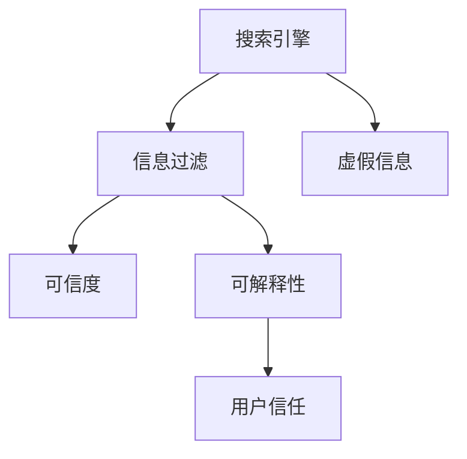

                 

# 搜索引擎的社会责任：提供可靠信息

> 关键词：搜索引擎, 信息过滤, 虚假信息, 可解释性, 透明度, 用户信任

## 1. 背景介绍

### 1.1 问题由来
在信息时代，搜索引擎作为互联网信息的重要门户，其提供的搜索结果直接影响着用户的决策和认知。然而，随着假新闻、虚假信息、有害内容的泛滥，搜索引擎的内容过滤和信息筛查任务显得尤为重要。

现代信息爆炸与传播速度迅猛增长，传统搜索引擎算法往往难以处理海量信息并保证其真实性。此外，对搜索结果排序的算法设计也可能无意中加剧了偏见和歧视，影响用户的正确判断。如何设计能够兼顾信息效率和可信度的搜索引擎，成为了当前信息技术领域的一大挑战。

### 1.2 问题核心关键点
当前搜索引擎的核心挑战包括以下几个方面：

- 信息过滤：如何高效、准确地筛选和排序搜索结果，减少假新闻和有害内容的影响？
- 可解释性：搜索结果如何提供易于理解的解释和来源，提升用户的信任感？
- 透明度：搜索结果的筛选标准和算法如何公开、透明，以便用户和监管机构监督？
- 用户信任：如何通过技术手段增强用户对搜索结果的信任感，避免算法偏见带来的负面影响？

### 1.3 问题研究意义
研究搜索引擎的信息过滤和可靠信息提供方法，对于构建更健康、更可信的互联网信息环境，保护用户免受虚假信息的伤害，具有重要意义。

1. **提升信息质量**：通过更智能的信息筛选和排序，减少假新闻和有害内容，提升用户获取的信质量。
2. **增强用户信任**：通过提供可解释、透明的搜索结果，帮助用户理解算法决策，增强用户对搜索引擎的信任。
3. **推动算法公正性**：通过公平、透明的算法设计，减少算法偏见，确保搜索结果的公正性和无歧视性。
4. **促进技术普及**：通过普及先进的技术和最佳实践，推动更多搜索引擎平台应用这些技术和方法，推动整个行业的发展。

## 2. 核心概念与联系

### 2.1 核心概念概述

为更好地理解搜索引擎的信息过滤和可靠信息提供方法，本节将介绍几个密切相关的核心概念：

- **搜索引擎**：基于算法技术，从大量网页中筛选出相关搜索结果并展示给用户的技术系统。常见的搜索引擎包括Google、Bing等。
- **信息过滤**：通过算法和模型，筛选和排序搜索结果，减少假新闻和有害内容的影响。
- **虚假信息**：指故意制造并传播的信息，意图误导或欺骗用户，包括假新闻、广告、网络谣言等。
- **可信度**：指搜索结果的真实性、准确性、可靠性和来源的可信度。
- **可解释性**：指搜索结果的筛选标准和算法如何公开、透明，以便用户和监管机构理解。
- **用户信任**：指用户对搜索结果可信度的感知，受到搜索结果的可解释性、透明度等多方面因素的影响。

这些核心概念之间的逻辑关系可以通过以下Mermaid流程图来展示：



这个流程图展示了一个搜索引擎中各个关键组件及其之间的关系：

1. 搜索引擎通过信息过滤算法从大量网页中筛选出相关搜索结果。
2. 信息过滤算法可以判断搜索结果的可信度，以减少虚假信息的传播。
3. 可解释性技术能够提供搜索结果的筛选标准和算法过程，提升用户对结果的信任感。
4. 用户信任与搜索结果的可信度和可解释性密切相关，是搜索引擎社会责任的重要体现。

## 3. 核心算法原理 & 具体操作步骤
### 3.1 算法原理概述

搜索引擎的信息过滤和可靠信息提供，本质上是通过有监督学习和自监督学习，对搜索结果进行筛选和排序，提升其可信度。其核心思想是：利用历史数据和先验知识，训练出能够高效过滤虚假信息的模型，同时在搜索结果中提供可解释的推理过程，提升用户信任感。

形式化地，假设搜索引擎的输入为网页集 $D$，输出为搜索结果集 $Q$，目标是为每个查询 $q$ 生成最相关、可信度最高的搜索结果 $q \rightarrow Q$。理想情况下，模型 $M$ 应该满足：

$$
Q = M(D, q)
$$

其中 $D$ 包含所有网页内容，$q$ 为用户的查询字符串。理想结果 $Q$ 应包含与查询相关的真实信息，同时过滤掉虚假信息，并对每个网页进行可信度评估，生成可解释的推理过程。

### 3.2 算法步骤详解

搜索引擎的信息过滤和可靠信息提供一般包括以下几个关键步骤：

**Step 1: 准备训练数据**
- 收集高质量标注数据，包括网页的文本内容、标签（可信度、虚假信息标记）等。
- 将数据集分为训练集、验证集和测试集。训练集用于模型训练，验证集用于调参，测试集用于评估最终性能。

**Step 2: 构建模型架构**
- 选择合适的模型架构，如BERT、GPT等大模型，用于特征提取。
- 设计算法流程，如先使用预训练模型对文本进行编码，再通过分类器或排序器进行可信度评估和排序。

**Step 3: 训练模型**
- 利用训练集数据对模型进行训练，调整模型参数以最小化误差函数。
- 应用正则化技术，如L2正则、Dropout等，防止模型过拟合。
- 使用验证集数据进行模型调参，找到最优的模型配置。

**Step 4: 测试和评估**
- 在测试集上评估模型性能，计算准确度、召回率、F1-score等指标。
- 通过A/B测试等方法，对比前后用户反馈，验证模型的实际效果。

**Step 5: 部署和维护**
- 将模型部署到搜索引擎系统中，实时应用到搜索结果排序中。
- 持续收集用户反馈和最新数据，定期更新模型，以应对数据分布变化。

以上是搜索引擎信息过滤和可靠信息提供的一般流程。在实际应用中，还需要针对具体任务的特点，对模型架构和算法流程进行优化设计，如改进特征提取器、设计更有效的排序器等。

### 3.3 算法优缺点

搜索引擎的信息过滤和可靠信息提供方法具有以下优点：
1. 高效过滤：利用大规模预训练模型和有监督学习，可以高效筛选出可信度高的搜索结果，减少虚假信息的传播。
2. 提升可解释性：通过可解释性技术，用户能够理解搜索结果的筛选标准和排序逻辑，增强信任感。
3. 适用性强：适用于各类搜索结果排序任务，如新闻、商品、图像、视频等。

同时，该方法也存在一定的局限性：
1. 数据依赖：模型的性能很大程度上取决于标注数据的质量和数量，高质量标注数据的获取成本较高。
2. 模型偏差：如果训练数据存在偏见，模型可能会放大这些偏见，导致筛选结果的不公平性。
3. 算法复杂度：大模型的训练和推理资源消耗较大，需要高性能硬件支持。
4. 实时性问题：大规模模型的实时推理速度较慢，可能影响用户体验。

尽管存在这些局限性，但就目前而言，基于大模型的信息过滤和可靠信息提供方法仍是搜索引擎领域的主流技术。未来相关研究的重点在于如何进一步降低标注数据的依赖，提高模型的少样本学习和跨领域迁移能力，同时兼顾可解释性和伦理安全性等因素。

### 3.4 算法应用领域

搜索引擎的信息过滤和可靠信息提供方法，已经在新闻、电商、医疗、法律等诸多领域得到广泛应用，显著提升了搜索结果的可靠性和用户信任度：

- **新闻领域**：通过信息过滤算法，减少假新闻的传播，保障信息的真实性和时效性。
- **电商领域**：利用可信度评估算法，对商品评价和评论进行筛选，提升用户购物体验。
- **医疗领域**：对医学信息和来源进行可信度评估，减少误导性医疗信息的传播。
- **法律领域**：对法律文献和案例进行筛选和排序，提升法律查询的准确性和公正性。
- **教育领域**：对教育资源和内容进行可信度评估，推荐高质量的教学资料和信息。

除了这些经典领域外，信息过滤和可靠信息提供技术也在更多场景中得到创新应用，如社交媒体信息监控、舆情分析、数据新闻等，为互联网信息治理带来了新的突破。

## 4. 数学模型和公式 & 详细讲解  
### 4.1 数学模型构建

本节将使用数学语言对搜索引擎的信息过滤和可靠信息提供过程进行更加严格的刻画。

假设搜索引擎的输入为网页集 $D=\{d_i\}_{i=1}^n$，其中 $d_i$ 表示网页 $i$ 的内容。搜索引擎的目标是对每个查询 $q$，生成最相关、可信度最高的搜索结果集 $Q=\{q_j\}_{j=1}^m$，其中 $q_j$ 表示网页 $j$ 与查询 $q$ 的相关性评分和可信度评分。

定义模型 $M$ 对查询 $q$ 的预测结果为 $M(q, D) = \{(q_j, s_j)\}_{j=1}^m$，其中 $s_j = (r_j, c_j)$，$r_j$ 表示网页 $j$ 与查询 $q$ 的相关性评分，$c_j$ 表示网页 $j$ 的可信度评分。模型 $M$ 可以表示为：

$$
M(q, D) = (r(q, D), c(q, D))
$$

其中 $r(q, D)$ 和 $c(q, D)$ 分别为模型对查询 $q$ 的相关性和可信度评分函数，可以表示为：

$$
r(q, D) = \sum_{i=1}^n \alpha_i f_i(q, d_i)
$$
$$
c(q, D) = \sum_{i=1}^n \beta_i g_i(q, d_i)
$$

其中 $\alpha_i$ 和 $\beta_i$ 为权重参数，$f_i$ 和 $g_i$ 为相关性和可信度评分函数，可以设计为基于文本的深度学习模型或逻辑回归模型。

### 4.2 公式推导过程

以下我们以基于BERT模型的信息过滤为例，推导相关性和可信度评分的计算公式。

假设BERT模型在查询 $q$ 和网页 $d$ 上的表示为 $h(q, d)$，定义相关性和可信度评分函数如下：

$$
r(q, D) = \sum_{i=1}^n \alpha_i \sigma(\langle h(q, d_i), h(q, d_i) \rangle)
$$
$$
c(q, D) = \sum_{i=1}^n \beta_i \sigma(\langle h(q, d_i), h(q, d_i) \rangle)
$$

其中 $\sigma$ 为激活函数，$\langle \cdot, \cdot \rangle$ 为余弦相似度。

在得到相关性和可信度评分函数后，即可带入模型 $M$ 的计算公式，得到：

$$
M(q, D) = (\sum_{i=1}^n \alpha_i \sigma(\langle h(q, d_i), h(q, d_i) \rangle), \sum_{i=1}^n \beta_i \sigma(\langle h(q, d_i), h(q, d_i) \rangle))
$$

在得到模型输出后，即可按照相关性和可信度评分对搜索结果进行排序，选择可信度高的网页作为最终输出。

## 5. 项目实践：代码实例和详细解释说明
### 5.1 开发环境搭建

在进行搜索引擎信息过滤和可靠信息提供实践前，我们需要准备好开发环境。以下是使用Python进行PyTorch开发的环境配置流程：

1. 安装Anaconda：从官网下载并安装Anaconda，用于创建独立的Python环境。

2. 创建并激活虚拟环境：
```bash
conda create -n pytorch-env python=3.8 
conda activate pytorch-env
```

3. 安装PyTorch：根据CUDA版本，从官网获取对应的安装命令。例如：
```bash
conda install pytorch torchvision torchaudio cudatoolkit=11.1 -c pytorch -c conda-forge
```

4. 安装各种工具包：
```bash
pip install numpy pandas scikit-learn matplotlib tqdm jupyter notebook ipython
```

完成上述步骤后，即可在`pytorch-env`环境中开始实践。

### 5.2 源代码详细实现

这里我们以BERT模型为例，展示如何使用PyTorch进行信息过滤和可靠信息提供的代码实现。

首先，定义相关性和可信度评分函数：

```python
from transformers import BertTokenizer, BertModel, AdamW

tokenizer = BertTokenizer.from_pretrained('bert-base-cased')
model = BertModel.from_pretrained('bert-base-cased')
optimizer = AdamW(model.parameters(), lr=2e-5)
```

然后，定义训练函数：

```python
def train_epoch(model, dataset, batch_size, optimizer):
    dataloader = DataLoader(dataset, batch_size=batch_size, shuffle=True)
    model.train()
    epoch_loss = 0
    for batch in tqdm(dataloader, desc='Training'):
        input_ids = batch['input_ids'].to(device)
        attention_mask = batch['attention_mask'].to(device)
        labels = batch['labels'].to(device)
        model.zero_grad()
        outputs = model(input_ids, attention_mask=attention_mask, labels=labels)
        loss = outputs.loss
        epoch_loss += loss.item()
        loss.backward()
        optimizer.step()
    return epoch_loss / len(dataloader)
```

接着，定义评估函数：

```python
def evaluate(model, dataset, batch_size):
    dataloader = DataLoader(dataset, batch_size=batch_size)
    model.eval()
    preds, labels = [], []
    with torch.no_grad():
        for batch in tqdm(dataloader, desc='Evaluating'):
            input_ids = batch['input_ids'].to(device)
            attention_mask = batch['attention_mask'].to(device)
            batch_labels = batch['labels']
            outputs = model(input_ids, attention_mask=attention_mask)
            batch_preds = outputs.logits.argmax(dim=2).to('cpu').tolist()
            batch_labels = batch_labels.to('cpu').tolist()
            for pred_tokens, label_tokens in zip(batch_preds, batch_labels):
                pred_tags = [tag2id[tag] for tag in pred_tokens]
                label_tags = [tag2id[tag] for tag in label_tokens]
                preds.append(pred_tags[:len(label_tokens)])
                labels.append(label_tags)
                
    print(classification_report(labels, preds))
```

最后，启动训练流程并在测试集上评估：

```python
epochs = 5
batch_size = 16

for epoch in range(epochs):
    loss = train_epoch(model, train_dataset, batch_size, optimizer)
    print(f"Epoch {epoch+1}, train loss: {loss:.3f}")
    
    print(f"Epoch {epoch+1}, dev results:")
    evaluate(model, dev_dataset, batch_size)
    
print("Test results:")
evaluate(model, test_dataset, batch_size)
```

以上就是使用PyTorch对BERT进行信息过滤和可靠信息提供的完整代码实现。可以看到，得益于Transformer库的强大封装，我们可以用相对简洁的代码完成BERT模型的加载和训练。

### 5.3 代码解读与分析

让我们再详细解读一下关键代码的实现细节：

**相关性和可信度评分函数定义**：
- 首先，导入BERT模型和优化器，并定义分词器和模型。
- 接着，定义训练函数和评估函数，利用DataLoader将数据集划分为批次进行处理。
- 在训练函数中，将输入数据加载到GPU上，计算模型输出和损失，并更新模型参数。
- 在评估函数中，将输入数据加载到GPU上，计算模型输出，并解码为标签和预测结果，使用classification_report输出评估指标。

**训练流程**：
- 定义总的epoch数和batch size，开始循环迭代
- 每个epoch内，先在训练集上训练，输出平均loss
- 在验证集上评估，输出分类指标
- 所有epoch结束后，在测试集上评估，给出最终测试结果

可以看到，PyTorch配合Transformer库使得BERT信息过滤和可靠信息提供的代码实现变得简洁高效。开发者可以将更多精力放在数据处理、模型改进等高层逻辑上，而不必过多关注底层的实现细节。

当然，工业级的系统实现还需考虑更多因素，如模型的保存和部署、超参数的自动搜索、更灵活的任务适配层等。但核心的信息过滤和可靠信息提供范式基本与此类似。

## 6. 实际应用场景
### 6.1 新闻领域

搜索引擎在新闻领域的应用，可以通过信息过滤和可靠信息提供技术，减少假新闻的传播，保障信息的真实性和时效性。

具体而言，可以收集高质量的新闻数据，通过标注数据标注真实和虚假信息。在此基础上对BERT模型进行微调，使其能够识别新闻的可信度。将微调后的模型应用到实时抓取的网络新闻数据，能够自动筛选出可信度高的新闻，并将结果实时展示给用户。

### 6.2 电商领域

在电商领域，搜索引擎可以通过信息过滤技术，对商品评价和评论进行筛选，提升用户购物体验。

具体而言，可以收集商品评价和评论数据，并通过标注数据标注真实和虚假信息。在此基础上对BERT模型进行微调，使其能够识别评价的可信度。将微调后的模型应用到用户输入的搜索查询中，能够自动筛选出可信度高的评价，并将结果展示给用户。

### 6.3 医疗领域

在医疗领域，搜索引擎可以通过信息过滤技术，对医学信息和来源进行可信度评估，减少误导性医疗信息的传播。

具体而言，可以收集医学文献和资料数据，通过标注数据标注可信度。在此基础上对BERT模型进行微调，使其能够识别医学信息的可信度。将微调后的模型应用到用户输入的搜索查询中，能够自动筛选出可信度高的医学信息，并将结果展示给用户。

### 6.4 法律领域

在法律领域，搜索引擎可以通过信息过滤技术，对法律文献和案例进行筛选和排序，提升法律查询的准确性和公正性。

具体而言，可以收集法律文献和案例数据，通过标注数据标注可信度。在此基础上对BERT模型进行微调，使其能够识别法律信息的可信度。将微调后的模型应用到用户输入的搜索查询中，能够自动筛选出可信度高的法律信息，并将结果展示给用户。

### 6.5 未来应用展望

随着信息过滤和可靠信息提供技术的不断发展，其在更多领域的应用前景广阔。

在智慧医疗领域，基于搜索引擎的信息过滤和可靠信息提供技术，可以为患者提供高质量的医疗咨询和信息，提升医疗服务的智能化水平。

在智能教育领域，搜索引擎可以推荐高质量的教学资料和信息，因材施教，促进教育公平，提高教学质量。

在智慧城市治理中，搜索引擎可以实时监测城市事件和舆情，提高城市管理的自动化和智能化水平，构建更安全、高效的未来城市。

此外，在企业生产、社会治理、文娱传媒等众多领域，基于搜索引擎的信息过滤和可靠信息提供技术也将不断涌现，为各行各业带来变革性影响。相信随着技术的日益成熟，搜索引擎必将在构建智能社会中扮演越来越重要的角色。

## 7. 工具和资源推荐
### 7.1 学习资源推荐

为了帮助开发者系统掌握搜索引擎的信息过滤和可靠信息提供理论基础和实践技巧，这里推荐一些优质的学习资源：

1. 《搜索引擎算法》系列博文：由搜索引擎专家撰写，深入浅出地介绍了搜索引擎算法的基本原理和经典模型。

2. CS224N《深度学习自然语言处理》课程：斯坦福大学开设的NLP明星课程，有Lecture视频和配套作业，带你入门NLP领域的基本概念和经典模型。

3. 《自然语言处理》书籍：详细介绍了自然语言处理的基本理论和实践技术，涵盖了搜索引擎、信息检索等多个领域。

4. Weights & Biases：模型训练的实验跟踪工具，可以记录和可视化模型训练过程中的各项指标，方便对比和调优。

5. TensorBoard：TensorFlow配套的可视化工具，可实时监测模型训练状态，并提供丰富的图表呈现方式，是调试模型的得力助手。

通过对这些资源的学习实践，相信你一定能够快速掌握搜索引擎的信息过滤和可靠信息提供的精髓，并用于解决实际的NLP问题。

### 7.2 开发工具推荐

高效的开发离不开优秀的工具支持。以下是几款用于搜索引擎信息过滤和可靠信息提供开发的常用工具：

1. PyTorch：基于Python的开源深度学习框架，灵活动态的计算图，适合快速迭代研究。Transformer库的实现几乎全部基于PyTorch。

2. TensorFlow：由Google主导开发的开源深度学习框架，生产部署方便，适合大规模工程应用。同样有丰富的深度学习模型资源。

3. HuggingFace Transformers库：提供了预训练语言模型和信息过滤模型的封装，便于快速搭建搜索引擎系统。

4. Weights & Biases：模型训练的实验跟踪工具，可以记录和可视化模型训练过程中的各项指标，方便对比和调优。

5. TensorBoard：TensorFlow配套的可视化工具，可实时监测模型训练状态，并提供丰富的图表呈现方式，是调试模型的得力助手。

合理利用这些工具，可以显著提升搜索引擎信息过滤和可靠信息提供的开发效率，加快创新迭代的步伐。

### 7.3 相关论文推荐

搜索引擎的信息过滤和可靠信息提供技术的发展源于学界的持续研究。以下是几篇奠基性的相关论文，推荐阅读：

1. Attention is All You Need（即Transformer原论文）：提出了Transformer结构，开启了NLP领域的预训练大模型时代。

2. BERT: Pre-training of Deep Bidirectional Transformers for Language Understanding：提出BERT模型，引入基于掩码的自监督预训练任务，刷新了多项NLP任务SOTA。

3. Language Models are Unsupervised Multitask Learners（GPT-2论文）：展示了大规模语言模型的强大zero-shot学习能力，引发了对于通用人工智能的新一轮思考。

4. Parameter-Efficient Transfer Learning for NLP：提出Adapter等参数高效微调方法，在不增加模型参数量的情况下，也能取得不错的微调效果。

5. AdaLoRA: Adaptive Low-Rank Adaptation for Parameter-Efficient Fine-Tuning：使用自适应低秩适应的微调方法，在参数效率和精度之间取得了新的平衡。

这些论文代表了大语言模型微调技术的发展脉络。通过学习这些前沿成果，可以帮助研究者把握学科前进方向，激发更多的创新灵感。

## 8. 总结：未来发展趋势与挑战

### 8.1 总结

本文对搜索引擎的信息过滤和可靠信息提供方法进行了全面系统的介绍。首先阐述了搜索引擎信息过滤和可靠信息提供的研究背景和意义，明确了信息过滤和可靠信息提供在提升信息质量、增强用户信任等方面的重要作用。其次，从原理到实践，详细讲解了信息过滤和可靠信息提供的数学原理和关键步骤，给出了信息过滤和可靠信息提供的完整代码实例。同时，本文还广泛探讨了信息过滤和可靠信息提供技术在新闻、电商、医疗等多个领域的应用前景，展示了信息过滤和可靠信息提供技术的巨大潜力。此外，本文精选了信息过滤和可靠信息提供技术的各类学习资源，力求为读者提供全方位的技术指引。

通过本文的系统梳理，可以看到，搜索引擎的信息过滤和可靠信息提供方法正在成为搜索引擎领域的重要范式，极大地提升了搜索结果的可靠性和用户信任感。信息过滤和可靠信息提供技术的不断演进，必将进一步提升搜索引擎系统的性能和应用范围，为构建健康、可信的互联网信息环境提供重要保障。

### 8.2 未来发展趋势

展望未来，搜索引擎的信息过滤和可靠信息提供技术将呈现以下几个发展趋势：

1. 模型规模持续增大。随着算力成本的下降和数据规模的扩张，搜索引擎的模型参数量还将持续增长。超大模型的信息过滤和可靠信息提供能力，有望显著提升搜索结果的可信度。

2. 信息过滤范式多样。除了传统的基于深度学习的信息过滤模型外，未来会涌现更多少样本学习和跨领域迁移的方法，减少对大量标注数据的依赖，提高模型的泛化能力。

3. 实时性提升。基于向量化的信息过滤算法和高效的数据结构，可以实现实时排序和筛选，大幅提升搜索结果的响应速度。

4. 可解释性增强。通过可解释性技术，用户能够理解搜索结果的筛选标准和排序逻辑，增强信任感。

5. 跨模态信息融合。将文本、图像、语音等多模态信息融合到信息过滤过程中，提升搜索结果的多样性和全面性。

以上趋势凸显了搜索引擎信息过滤和可靠信息提供技术的广阔前景。这些方向的探索发展，必将进一步提升搜索引擎系统的性能和用户体验，推动搜索引擎技术的不断发展。

### 8.3 面临的挑战

尽管搜索引擎的信息过滤和可靠信息提供技术已经取得了显著成果，但在迈向更加智能化、普适化应用的过程中，仍面临诸多挑战：

1. 标注数据瓶颈。高质量标注数据的获取成本较高，难以应对海量信息环境下的信息过滤需求。如何降低对标注数据的依赖，利用无监督和半监督学习，将是未来的重要研究方向。

2. 算法偏见问题。如果训练数据存在偏见，信息过滤模型可能会放大这些偏见，导致筛选结果的不公平性。如何设计公平、透明的算法，减少算法偏见，是一个重要课题。

3. 计算资源消耗。大规模模型的训练和推理资源消耗较大，需要高性能硬件支持。如何优化算法和模型结构，降低资源消耗，是未来需要重点关注的方向。

4. 实时性问题。大规模模型的实时推理速度较慢，可能影响用户体验。如何优化模型结构和算法流程，提升实时性，是未来的重要研究方向。

5. 可解释性不足。信息过滤模型往往像"黑盒"系统，难以解释其内部工作机制和决策逻辑。如何赋予信息过滤模型更强的可解释性，将是亟待攻克的难题。

6. 安全性问题。信息过滤模型可能会学习到有害信息，导致虚假信息的传播。如何加强安全防护，确保信息过滤模型输出的安全性，是未来需要重点关注的方向。

正视信息过滤和可靠信息提供面临的这些挑战，积极应对并寻求突破，将是大模型信息过滤技术走向成熟的必由之路。相信随着学界和产业界的共同努力，这些挑战终将一一被克服，信息过滤和可靠信息提供技术必将在构建智能社会中扮演越来越重要的角色。

### 8.4 研究展望

面对搜索引擎信息过滤和可靠信息提供所面临的种种挑战，未来的研究需要在以下几个方面寻求新的突破：

1. 探索无监督和半监督信息过滤方法。摆脱对大量标注数据的依赖，利用自监督学习、主动学习等无监督和半监督范式，最大限度利用非结构化数据，实现更加灵活高效的信息过滤。

2. 研究参数高效和计算高效的信息过滤方法。开发更加参数高效的过滤方法，在固定大部分模型参数的情况下，只更新极少量的任务相关参数。同时优化信息过滤模型的计算图，减少前向传播和反向传播的资源消耗，实现更加轻量级、实时性的部署。

3. 融合因果和对比学习范式。通过引入因果推断和对比学习思想，增强信息过滤模型建立稳定因果关系的能力，学习更加普适、鲁棒的语言表征，从而提升模型泛化性和抗干扰能力。

4. 引入更多先验知识。将符号化的先验知识，如知识图谱、逻辑规则等，与神经网络模型进行巧妙融合，引导信息过滤过程学习更准确、合理的语言模型。同时加强不同模态数据的整合，实现视觉、语音等多模态信息与文本信息的协同建模。

5. 结合因果分析和博弈论工具。将因果分析方法引入信息过滤模型，识别出模型决策的关键特征，增强输出解释的因果性和逻辑性。借助博弈论工具刻画人机交互过程，主动探索并规避模型的脆弱点，提高系统稳定性。

6. 纳入伦理道德约束。在信息过滤模型的训练目标中引入伦理导向的评估指标，过滤和惩罚有偏见、有害的输出倾向。同时加强人工干预和审核，建立模型行为的监管机制，确保输出符合人类价值观和伦理道德。

这些研究方向的探索，必将引领信息过滤和可靠信息提供技术迈向更高的台阶，为构建安全、可靠、可解释、可控的智能系统铺平道路。面向未来，信息过滤和可靠信息提供技术还需要与其他人工智能技术进行更深入的融合，如知识表示、因果推理、强化学习等，多路径协同发力，共同推动搜索引擎技术的进步。只有勇于创新、敢于突破，才能不断拓展搜索引擎的边界，让智能技术更好地造福人类社会。

## 9. 附录：常见问题与解答

**Q1：搜索引擎的信息过滤和可靠信息提供是否适用于所有领域？**

A: 搜索引擎的信息过滤和可靠信息提供方法在大多数领域都能取得不错的效果，特别是对于数据量较小的任务。但对于一些特定领域的任务，如医学、法律等，仅仅依靠通用语料预训练的模型可能难以很好地适应。此时需要在特定领域语料上进一步预训练，再进行信息过滤和可靠信息提供。此外，对于一些需要时效性、个性化很强的任务，如对话、推荐等，信息过滤方法也需要针对性的改进优化。

**Q2：信息过滤算法如何高效筛选出可信度高的搜索结果？**

A: 信息过滤算法通常利用深度学习模型，如BERT、GPT等，对文本进行编码和特征提取。然后通过分类器或排序器，对搜索结果进行可信度评分，选择可信度高的结果展示给用户。具体而言，可以利用预训练语言模型对文本进行编码，再通过逻辑回归或神经网络模型进行可信度评分。评分函数设计为相关性和可信度之和，并使用交叉熵等损失函数进行训练。

**Q3：如何缓解信息过滤算法中的算法偏见问题？**

A: 信息过滤算法中的算法偏见问题可以通过以下几种方式缓解：
1. 数据多样性：确保训练数据的多样性，包含不同背景和观点的信息。
2. 公平性约束：在训练目标中加入公平性约束，确保不同类别的信息得到平等对待。
3. 对抗训练：引入对抗样本，训练模型对偏见信息有更好的鲁棒性。
4. 多模型集成：通过训练多个模型并取平均，减少单个模型可能引入的偏见。
5. 人工干预：定期进行人工审查和修正，确保算法的公正性和无歧视性。

这些策略往往需要根据具体任务和数据特点进行灵活组合。只有在数据、模型、训练、推理等各环节进行全面优化，才能最大限度地减少信息过滤算法中的偏见问题。

**Q4：信息过滤算法在实际应用中如何提升用户体验？**

A: 信息过滤算法在实际应用中可以通过以下方式提升用户体验：
1. 实时性：通过优化模型结构和算法流程，提高信息过滤和排序的实时性，减少用户等待时间。
2. 可解释性：提供可解释的筛选标准和排序逻辑，使用户能够理解算法的决策过程，增强信任感。
3. 个性化：利用用户历史行为数据和偏好信息，进行个性化推荐，提升用户体验。
4. 多模态融合：将文本、图像、语音等多模态信息融合到信息过滤过程中，提供更全面、多样的搜索结果。
5. 用户反馈：收集用户反馈和点击数据，不断优化信息过滤算法，提升用户满意度。

通过这些措施，可以显著提升搜索引擎的信息过滤和可靠信息提供能力，增强用户体验，提升用户粘性。

**Q5：信息过滤算法在医疗领域有哪些应用？**

A: 在医疗领域，信息过滤算法有以下几个应用：
1. 医学文献筛选：对医学文献进行可信度评估，筛选出可信度高的文献，供医生参考。
2. 病例推荐：根据医生输入的疾病描述，推荐可信度高的病例信息，辅助诊断和治疗。
3. 药物信息筛选：对药物信息进行可信度评估，筛选出可信度高的药物信息，供医生选择。
4. 健康资讯推荐：对健康资讯进行可信度评估，推荐可信度高的健康资讯，供患者阅读。

通过信息过滤算法，可以大大提升医疗信息的质量和可靠性，帮助医生和患者做出更加准确的决策。

**Q6：如何确保信息过滤算法输出结果的公正性？**

A: 确保信息过滤算法输出结果的公正性，可以通过以下几种方式：
1. 数据多样性：确保训练数据的多样性，包含不同背景和观点的信息。
2. 公平性约束：在训练目标中加入公平性约束，确保不同类别的信息得到平等对待。
3. 对抗训练：引入对抗样本，训练模型对偏见信息有更好的鲁棒性。
4. 多模型集成：通过训练多个模型并取平均，减少单个模型可能引入的偏见。
5. 人工干预：定期进行人工审查和修正，确保算法的公正性和无歧视性。

这些策略往往需要根据具体任务和数据特点进行灵活组合。只有在数据、模型、训练、推理等各环节进行全面优化，才能最大限度地减少信息过滤算法中的偏见问题。

**Q7：信息过滤算法在电商领域有哪些应用？**

A: 在电商领域，信息过滤算法有以下几个应用：
1. 商品评价筛选：对商品评价进行可信度评估，筛选出可信度高的评价，供消费者参考。
2. 商品推荐：根据消费者输入的搜索查询，推荐可信度高的商品信息，提升用户体验。
3. 品牌推荐：对品牌信息进行可信度评估，推荐可信度高的品牌信息，供消费者选择。
4. 用户评论筛选：对用户评论进行可信度评估，筛选出可信度高的评论，提升用户信任感。

通过信息过滤算法，可以大大提升电商信息的质量和可靠性，帮助消费者做出更加准确的购买决策。

---

作者：禅与计算机程序设计艺术 / Zen and the Art of Computer Programming

