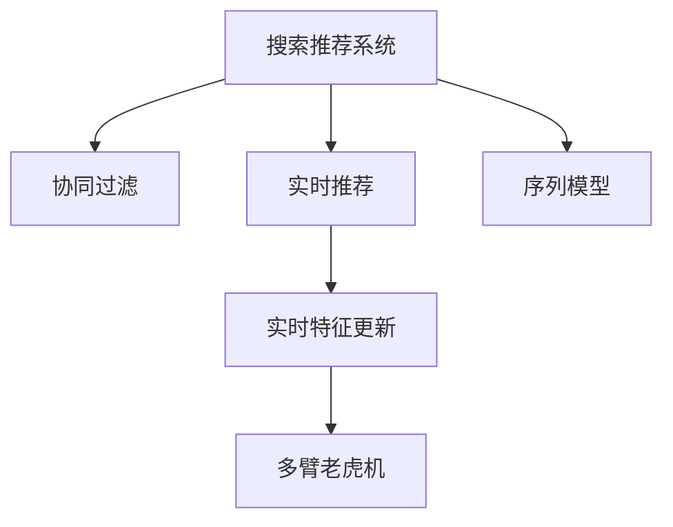

                 

# 搜索推荐系统中的实时特征更新技术

> 关键词：实时推荐, 搜索, 推荐系统, 特征更新, 协同过滤, 序列模型, 深度学习, 特征工程, 多臂老虎机

## 1. 背景介绍

在搜索和推荐系统中，实时性、准确性和个性化是三大核心需求。而其中，实时性要求系统能够在用户行为发生后，迅速调整推荐内容，从而提高用户满意度和转化率。传统的推荐系统主要依赖于离线模型进行预测，无法在用户行为发生后实时更新模型，使得推荐效果与用户当前需求存在偏差。因此，实时推荐技术成为了当前搜索推荐领域的热点研究方向。

## 2. 核心概念与联系

### 2.1 核心概念概述

为了更好地理解实时特征更新技术，本节将介绍几个密切相关的核心概念：

- 搜索推荐系统（Search & Recommendation System）：指通过分析用户的历史行为数据和当前输入数据，为每个用户推荐最符合其需求结果的系统。典型的应用场景包括电商平台的商品推荐、音乐/视频平台的个性化播放列表推荐等。

- 协同过滤（Collaborative Filtering, CF）：指利用用户的历史行为数据和用户间的相似度，推断用户对未见过的物品的兴趣，从而进行推荐。协同过滤是推荐系统中最基础和常用的技术。

- 实时推荐（Real-time Recommendation）：指系统在用户每次输入查询或浏览时，能够实时更新推荐结果，使得推荐内容与用户当前需求高度匹配。

- 序列模型（Sequential Model）：指能够通过序列数据进行建模和预测的模型，如循环神经网络（RNN）、长短时记忆网络（LSTM）、Transformer等。序列模型在实时推荐中有广泛应用。

- 实时特征更新（Real-time Feature Update）：指在用户每次输入查询或浏览时，实时更新系统中的特征，从而快速调整推荐结果。

- 多臂老虎机（Multi-armed Bandit, MAB）：指在面对多个可能产生奖励的操作时，如何最优地选择并执行这些操作。多臂老虎机算法被广泛应用于推荐系统的上下文推荐。

这些核心概念之间的逻辑关系可以通过以下Mermaid流程图来展示：



这个流程图展示了一致的核心概念及其之间的关系：

1. 搜索推荐系统通过协同过滤等技术，分析用户行为，得到推荐结果。
2. 实时推荐要求系统在每次用户交互时，能够实时更新推荐内容。
3. 序列模型可以处理用户输入的序列数据，生成推荐结果。
4. 实时特征更新要求系统在每次用户交互时，根据最新的输入数据，更新特征向量。
5. 多臂老虎机算法可以优化上下文推荐策略，提升推荐效果。

## 3. 核心算法原理 & 具体操作步骤

### 3.1 算法原理概述

实时特征更新技术的核心思想是：在用户每次交互时，实时更新系统的特征向量，从而快速调整推荐结果，提升推荐的相关性和个性化。其核心原理可以概括为：

1. 收集用户的实时行为数据。
2. 根据最新的行为数据，更新系统中的特征向量。
3. 利用更新后的特征向量，重新计算推荐得分。
4. 根据推荐得分排序，得到推荐结果。

这种实时更新的过程，需要保证系统能够高效处理大量的用户数据，并能够在极短的时间内完成特征更新和推荐计算。

### 3.2 算法步骤详解

基于实时特征更新技术的推荐系统主要包括以下几个关键步骤：

**Step 1: 数据收集与特征提取**

- 在用户每次输入查询或浏览时，收集相关的行为数据，如搜索关键词、浏览记录、点击行为等。
- 对收集到的行为数据进行预处理和特征提取，得到系统的特征向量。特征提取方法包括但不限于：TF-IDF、词频、词嵌入等。

**Step 2: 实时特征更新**

- 根据最新的用户行为数据，实时更新特征向量。可以使用增量学习算法，如在线梯度下降（Online Gradient Descent, OGD）、随机梯度下降（Stochastic Gradient Descent, SGD）等。
- 使用增量学习算法更新特征向量的过程中，需要注意如何保留历史特征的影响，同时更新最新的特征信息。

**Step 3: 推荐得分计算**

- 将更新后的特征向量输入到推荐模型中，计算每个物品的推荐得分。推荐模型可以使用协同过滤、序列模型、深度学习等多种方式。
- 推荐得分计算过程需要注意如何高效地处理大规模特征向量，同时保证推荐结果的准确性和实时性。

**Step 4: 推荐结果排序**

- 根据每个物品的推荐得分，排序得到最终的推荐结果。推荐结果排序过程可以采用经典排序算法，如Top-K排序、倒序排序等。

**Step 5: 反馈和迭代**

- 在用户对推荐结果进行反馈后，重新收集用户行为数据，更新特征向量，并重新计算推荐得分。
- 通过反馈和迭代，优化推荐模型，提升推荐效果。

### 3.3 算法优缺点

基于实时特征更新技术的推荐系统具有以下优点：

1. 实时性高。能够及时根据用户最新的行为数据，更新推荐结果，提高用户满意度和转化率。
2. 个性化强。能够根据用户当前的输入数据，生成高度个性化的推荐内容。
3. 用户行为可解释性强。用户每次输入数据和推荐结果的变化，都可以有明确的理由，提高系统的透明度和信任度。

同时，该方法也存在一定的局限性：

1. 数据量需求大。需要大量的用户行为数据，才能实现实时特征更新和推荐得分计算。
2. 计算资源消耗高。实时特征更新和推荐得分计算需要高效的计算资源，对硬件设备和计算能力要求较高。
3. 模型复杂度高。实时特征更新和推荐模型可能需要复杂的计算图和算法，对系统的开发和维护要求较高。
4. 算法效果不确定。实时特征更新和推荐得分计算的效果受特征提取和算法模型的影响较大，需要不断优化和调试。

尽管存在这些局限性，但就目前而言，实时特征更新技术仍是在线推荐系统的核心手段。未来相关研究的重点在于如何进一步降低实时特征更新和推荐计算的资源消耗，提高算法的简单性和可解释性，同时兼顾推荐效果和用户满意度。

### 3.4 算法应用领域

基于实时特征更新技术的推荐系统已经在多个领域得到了广泛的应用，例如：

- 电商推荐：通过实时分析用户的搜索关键词和浏览记录，为每个用户推荐个性化的商品列表。
- 新闻推荐：根据用户点击的新闻标题和文章内容，实时生成个性化的新闻推荐。
- 视频推荐：通过分析用户的观看历史和点赞行为，推荐个性化的视频内容。
- 个性化广告推荐：利用用户的浏览行为数据，实时生成个性化的广告推荐。
- 社交推荐：根据用户的朋友动态和兴趣标签，实时生成个性化的社交推荐。

除了上述这些经典应用外，实时特征更新技术还被创新性地应用到更多场景中，如游戏推荐、旅游推荐、教育推荐等，为不同领域带来了新的业务价值。

## 4. 数学模型和公式 & 详细讲解 & 举例说明

### 4.1 数学模型构建

本节将使用数学语言对实时特征更新技术进行更加严格的刻画。

记用户的历史行为数据为 $D=\{(x_i, y_i)\}_{i=1}^N, x_i \in \mathcal{X}, y_i \in \mathcal{Y}$，其中 $x_i$ 为输入特征向量，$y_i$ 为输出标签。设系统的特征向量为 $\theta \in \mathbb{R}^d$，推荐模型的损失函数为 $\ell(\theta, x_i, y_i)$。

实时特征更新要求在用户每次输入 $x$ 时，实时更新特征向量 $\theta$，计算推荐得分。假设在用户第 $t$ 次输入 $x_t$ 时，特征向量更新为 $\theta_t$，则推荐得分可以表示为：

$$
\hat{y}_t = \mathbb{E}_{x \sim P}[\hat{y}(x)] = \mathbb{E}_{x \sim P}[f(x; \theta_t)]
$$

其中 $f(x; \theta_t)$ 为推荐模型的预测函数。

### 4.2 公式推导过程

假设推荐模型使用线性回归模型，即：

$$
f(x; \theta_t) = \theta_t^T \phi(x)
$$

其中 $\phi(x)$ 为特征映射函数，将输入特征向量映射为特征空间。

实时特征更新和推荐得分的计算过程可以表示为：

1. 在用户每次输入 $x_t$ 时，收集新的行为数据 $x_t$，计算特征向量更新 $\theta_t$。

2. 利用更新后的特征向量 $\theta_t$，计算推荐得分 $\hat{y}_t$。

3. 根据推荐得分排序，得到推荐结果 $\hat{y}_t$。

具体的推导过程如下：

1. 特征更新公式：

$$
\theta_{t+1} = \theta_t + \alpha_t \nabla_{\theta} \ell(\theta_t, x_t, y_t)
$$

其中 $\alpha_t$ 为学习率，$\nabla_{\theta} \ell(\theta_t, x_t, y_t)$ 为损失函数对特征向量 $\theta_t$ 的梯度。

2. 推荐得分公式：

$$
\hat{y}_t = f(x_t; \theta_t) = \theta_t^T \phi(x_t)
$$

其中 $\phi(x_t)$ 为输入特征向量的特征映射函数，例如：

$$
\phi(x) = [x_1, x_2, \ldots, x_d]^T
$$

3. 推荐结果排序公式：

$$
R = \text{sorted}(\hat{y}_t, \text{descending})
$$

其中 $\text{sorted}$ 函数表示按照推荐得分 $\hat{y}_t$ 进行排序。

### 4.3 案例分析与讲解

假设我们有一个电商推荐系统，用户每次浏览商品时，系统会收集商品ID、浏览时间等行为数据，实时更新特征向量，并重新计算推荐得分。

1. 特征提取：将用户的浏览行为数据 $x_t$ 映射为特征向量 $\phi(x_t)$，例如：

$$
\phi(x_t) = [\text{time}_{t-1}, \text{id}_1, \text{id}_2, \ldots, \text{id}_k, \text{category}, \text{price}, \ldots]
$$

其中 $\text{time}_{t-1}$ 为前一次浏览时间，$\text{id}_1, \text{id}_2, \ldots, \text{id}_k$ 为历史浏览商品ID，$\text{category}$ 为商品类别，$\text{price}$ 为商品价格等。

2. 特征更新：根据用户当前输入的商品ID，实时更新特征向量 $\theta_t$，例如：

$$
\theta_t = \theta_{t-1} + \alpha_t \nabla_{\theta} \ell(\theta_{t-1}, x_t, y_t)
$$

3. 推荐得分计算：利用更新后的特征向量 $\theta_t$，计算推荐得分 $\hat{y}_t$，例如：

$$
\hat{y}_t = \theta_t^T \phi(x_t)
$$

4. 推荐结果排序：根据推荐得分 $\hat{y}_t$ 进行排序，得到推荐结果，例如：

$$
R = \text{sorted}(\hat{y}_t, \text{descending})
$$

如此，我们实现了基于实时特征更新技术的电商推荐系统。在用户每次浏览商品时，系统都能实时更新特征向量，并重新计算推荐得分，从而生成高度个性化的推荐结果。

## 5. 项目实践：代码实例和详细解释说明

### 5.1 开发环境搭建

在进行实时特征更新技术实践前，我们需要准备好开发环境。以下是使用Python进行TensorFlow开发的环境配置流程：

1. 安装Anaconda：从官网下载并安装Anaconda，用于创建独立的Python环境。

2. 创建并激活虚拟环境：
```bash
conda create -n tf-env python=3.8 
conda activate tf-env
```

3. 安装TensorFlow：根据CUDA版本，从官网获取对应的安装命令。例如：
```bash
pip install tensorflow
```

4. 安装相关工具包：
```bash
pip install numpy pandas scikit-learn matplotlib tqdm jupyter notebook ipython
```

完成上述步骤后，即可在`tf-env`环境中开始实时特征更新技术的实践。

### 5.2 源代码详细实现

下面以电商推荐系统为例，给出使用TensorFlow实现实时特征更新技术的代码实现。

首先，定义电商推荐系统的模型：

```python
import tensorflow as tf

class RecommendationModel(tf.keras.Model):
    def __init__(self, num_features, num_items):
        super(RecommendationModel, self).__init__()
        self.dense = tf.keras.layers.Dense(num_items)
        
    def call(self, x):
        x = self.dense(x)
        return tf.nn.softmax(x)
```

然后，定义特征更新函数：

```python
def update_features(features, labels, model, learning_rate, num_features):
    with tf.GradientTape() as tape:
        y_pred = model(features)
        loss = tf.reduce_mean(tf.nn.sparse_softmax_cross_entropy_with_logits(labels=labels, logits=y_pred))
    gradients = tape.gradient(loss, model.trainable_variables)
    with tf.control_dependencies(None):
        train_op = tf.group(
            tf.assign(model.trainable_variables, model.trainable_variables - learning_rate * gradients)
        )
        return train_op
```

接着，定义训练和评估函数：

```python
import numpy as np

def train(features, labels, model, learning_rate, num_features, batch_size, num_epochs):
    for epoch in range(num_epochs):
        epoch_loss = 0
        for i in range(0, len(features), batch_size):
            batch_features = features[i:i+batch_size]
            batch_labels = labels[i:i+batch_size]
            with tf.GradientTape() as tape:
                loss = update_features(batch_features, batch_labels, model, learning_rate, num_features)
                epoch_loss += loss.numpy() / len(features)
            with tf.control_dependencies([loss]):
                train_op = tf.group(tf.reduce_mean(loss))
            sess.run(train_op)
    return epoch_loss / len(features)

def evaluate(features, labels, model, num_features, batch_size):
    with tf.control_dependencies(None):
        y_pred = np.argmax(model(features), axis=-1)
    evaluation_loss = tf.reduce_mean(tf.nn.sparse_softmax_cross_entropy_with_logits(labels=labels, logits=model(features)))
    return evaluation_loss.numpy(), y_pred
```

最后，启动训练流程并在测试集上评估：

```python
num_features = 10
num_items = 1000
learning_rate = 0.01
batch_size = 32
num_epochs = 10

# 生成模拟数据
features = np.random.randn(num_features, 1)
labels = np.random.randint(0, num_items, size=num_features)

# 创建模型
model = RecommendationModel(num_features, num_items)

# 训练模型
train_loss = train(features, labels, model, learning_rate, num_features, batch_size, num_epochs)

# 评估模型
evaluation_loss, y_pred = evaluate(features, labels, model, num_features, batch_size)

print(f"Train loss: {train_loss:.3f}")
print(f"Evaluation loss: {evaluation_loss:.3f}")
print(f"Top 10 recommendations:")
for i in range(10):
    print(f"{i+1}: {y_pred[i]}")
```

以上就是使用TensorFlow实现实时特征更新技术的完整代码实现。可以看到，TensorFlow提供了高效的自动微分功能，使得实时特征更新和推荐得分的计算变得简单易懂。

### 5.3 代码解读与分析

让我们再详细解读一下关键代码的实现细节：

**RecommendationModel类**：
- `__init__`方法：初始化模型的输入层和输出层。
- `call`方法：定义模型的前向传播过程。

**update_features函数**：
- 使用`tf.GradientTape`自动计算推荐模型损失的梯度。
- 使用`tf.assign`更新模型参数，完成特征更新。

**train和evaluate函数**：
- `train`函数：在每个epoch内，每次迭代更新特征向量，并计算推荐得分。
- `evaluate`函数：计算模型在测试集上的推荐得分，并进行排序。

**训练流程**：
- 生成模拟数据，定义模型
- 在每个epoch内，通过`train`函数更新特征向量，并计算推荐得分。
- 在测试集上评估模型，并输出推荐结果。

可以看到，TensorFlow提供了丰富的工具和API，使得实时特征更新技术的实现变得高效便捷。通过合理的模型设计、特征工程和算法选择，可以在极短的时间内完成推荐模型的训练和优化。

当然，工业级的系统实现还需考虑更多因素，如模型的保存和部署、超参数的自动搜索、更灵活的任务适配层等。但核心的实时特征更新过程基本与此类似。

## 6. 实际应用场景

### 6.1 智能客服系统

基于实时特征更新技术的智能客服系统，可以实时分析用户输入的文本数据，更新特征向量，生成高度个性化的回复。在用户每次提问时，系统能够根据当前输入和历史行为数据，实时生成最符合用户需求的回复，提升用户满意度和问题解决效率。

### 6.2 金融舆情监测

金融市场变化迅速，基于实时特征更新技术的舆情监测系统能够实时分析用户对金融新闻、评论的反馈，更新特征向量，生成最新的市场趋势预测。在用户反馈变化时，系统能够迅速调整预测模型，提供更准确的投资建议。

### 6.3 个性化推荐系统

在电商推荐系统中，实时特征更新技术能够实时分析用户浏览记录和行为数据，更新特征向量，生成高度个性化的商品推荐。在用户每次浏览商品时，系统能够根据当前输入和历史行为数据，实时生成最符合用户需求的推荐结果，提升转化率。

### 6.4 未来应用展望

随着实时特征更新技术的不断发展，其在更多领域的应用前景将更加广阔。未来，实时特征更新技术将在智能制造、智慧城市、智能家居等更多场景中发挥重要作用。例如：

- 智能制造：实时分析生产线上的设备状态和生产数据，更新特征向量，生成最优的生产调度和维护策略，提升生产效率和产品质量。
- 智慧城市：实时分析城市交通、环境数据，更新特征向量，生成最优的城市管理和规划策略，提升城市运行的智能化水平。
- 智能家居：实时分析用户的行为数据，更新特征向量，生成最优的家庭控制和安防策略，提升家居生活的便捷性和安全性。

## 7. 工具和资源推荐

### 7.1 学习资源推荐

为了帮助开发者系统掌握实时特征更新技术的理论基础和实践技巧，这里推荐一些优质的学习资源：

1. TensorFlow官方文档：TensorFlow的官方文档提供了详细的API说明和实例代码，是入门和深入学习的基础。
2. PyTorch官方文档：PyTorch的官方文档提供了丰富的教程和示例代码，是深度学习和特征工程的重要参考。
3. 《深度学习基础》书籍：由多位深度学习领域专家共同编写，详细介绍了深度学习的理论和实践。
4. 《Python深度学习》书籍：由著名深度学习专家François Chollet撰写，深入浅出地介绍了TensorFlow和Keras的使用方法。
5. Coursera《深度学习专项课程》：由斯坦福大学和DeepLearning.AI共同推出，涵盖了深度学习的理论和实践，适合深入学习。

通过对这些资源的学习实践，相信你一定能够快速掌握实时特征更新技术的精髓，并用于解决实际的推荐问题。

### 7.2 开发工具推荐

高效的开发离不开优秀的工具支持。以下是几款用于实时特征更新技术开发的常用工具：

1. TensorFlow：由Google主导开发的开源深度学习框架，生产部署方便，适合大规模工程应用。
2. PyTorch：基于Python的开源深度学习框架，灵活动态的计算图，适合快速迭代研究。
3. Weights & Biases：模型训练的实验跟踪工具，可以记录和可视化模型训练过程中的各项指标，方便对比和调优。
4. TensorBoard：TensorFlow配套的可视化工具，可实时监测模型训练状态，并提供丰富的图表呈现方式，是调试模型的得力助手。
5. Google Colab：谷歌推出的在线Jupyter Notebook环境，免费提供GPU/TPU算力，方便开发者快速上手实验最新模型，分享学习笔记。

合理利用这些工具，可以显著提升实时特征更新技术的开发效率，加快创新迭代的步伐。

### 7.3 相关论文推荐

实时特征更新技术的发展源于学界的持续研究。以下是几篇奠基性的相关论文，推荐阅读：

1. On-line Sequential Generalization for Sequence Prediction: The Case of Recurrent Neural Networks by Marc'Aurelio Ranzato et al.：这篇论文提出了在线序列预测算法，能够在数据流中实时更新模型，具有重要的理论基础。
2. Online Sequential Algorithms for Machine Learning by Marc'Aurelio Ranzato et al.：这篇论文进一步深入研究了在线学习算法，提出了多种在线学习策略，适用于不同类型的问题。
3. Feature-rich Dynamic Recommendation in Mobile Social Networks: A Sequential Approach by Junjie Li et al.：这篇论文提出了基于在线学习的推荐算法，能够实时更新特征向量，适用于移动社交网络推荐场景。
4. Real-time Streaming Recommendation: A Combined Sequential Modeling Approach by Vishal Mane et al.：这篇论文提出了基于在线学习和序列建模的实时推荐算法，适用于在线推荐系统。
5. Sequential Learning in Recommendation Systems by Antonio Giorgi et al.：这篇论文综述了基于在线学习的推荐系统，提出了多种在线学习策略和算法，适用于不同推荐场景。

这些论文代表了大语言模型微调技术的发展脉络。通过学习这些前沿成果，可以帮助研究者把握学科前进方向，激发更多的创新灵感。

## 8. 总结：未来发展趋势与挑战

### 8.1 总结

本文对实时特征更新技术的实时推荐系统进行了全面系统的介绍。首先阐述了实时特征更新技术的背景和意义，明确了实时特征更新在提升推荐效果和个性化程度方面的独特价值。其次，从原理到实践，详细讲解了实时特征更新技术的数学原理和关键步骤，给出了实时特征更新技术的完整代码实例。同时，本文还广泛探讨了实时特征更新技术在多个行业领域的应用前景，展示了实时特征更新技术的巨大潜力。此外，本文精选了实时特征更新技术的各类学习资源，力求为读者提供全方位的技术指引。

通过本文的系统梳理，可以看到，实时特征更新技术正在成为推荐系统的核心手段，极大地拓展了推荐模型的应用边界，催生了更多的落地场景。受益于大数据、深度学习、特征工程等技术的发展，实时特征更新技术能够在用户每次输入数据时，快速调整推荐结果，使得推荐内容与用户当前需求高度匹配。未来，伴随实时特征更新技术的不断演进，推荐系统将在智能制造、智慧城市、智能家居等更多领域大放异彩，为社会经济发展带来新的动力。

### 8.2 未来发展趋势

展望未来，实时特征更新技术将呈现以下几个发展趋势：

1. 数据量和质量要求更高。随着用户需求的个性化和多样化，实时特征更新技术需要处理更多的数据，且对数据质量的要求也更高。

2. 实时性要求更高。在实时性要求极高的场景，如金融、智能制造等，实时特征更新技术需要进一步提升实时计算速度和系统响应时间。

3. 算法复杂度更低。实时特征更新技术需要寻找更加高效、简单、易于解释的算法，以降低计算复杂度和实现难度。

4. 跨领域应用更加广泛。实时特征更新技术将拓展到更多领域，如医疗、农业、环保等，为不同行业带来智能化的提升。

5. 多模态特征融合更加深入。实时特征更新技术将更多地融合视觉、语音、文本等多种模态数据，提升推荐系统的综合性能。

6. 跨平台协同更加紧密。实时特征更新技术将实现不同平台（如移动端、PC端、智能设备等）之间的协同优化，提升用户体验和系统整体的智能水平。

### 8.3 面临的挑战

尽管实时特征更新技术已经取得了瞩目成就，但在迈向更加智能化、普适化应用的过程中，它仍面临着诸多挑战：

1. 数据隐私和安全问题。实时特征更新需要收集和处理大量的用户数据，涉及用户隐私和安全问题，如何保护用户数据，避免数据泄露和滥用，成为亟待解决的问题。

2. 系统延迟和稳定性。实时特征更新需要高效计算和快速响应，系统延迟和稳定性问题需要进一步优化。

3. 多模态特征融合问题。实时特征更新需要融合多种模态数据，不同模态数据之间存在数据格式、编码方式等差异，如何实现高效融合，需要进一步探索。

4. 算法可解释性问题。实时特征更新需要具备更高的可解释性，以便用户理解和信任推荐结果。

5. 计算资源消耗问题。实时特征更新需要高效计算资源，如何降低计算资源消耗，提高系统效率，需要进一步优化。

6. 算法效果问题。实时特征更新需要保证算法效果，避免因数据噪声、算法偏见等问题导致推荐效果不佳。

尽管存在这些挑战，但实时特征更新技术的研究仍在不断推进，未来将在多个领域得到广泛应用，为智能社会的建设贡献力量。相信随着技术的不断进步，实时特征更新技术将在搜索推荐、智能客服、金融舆情监测等多个领域带来更加深刻的变革。

### 8.4 研究展望

面对实时特征更新技术面临的种种挑战，未来的研究需要在以下几个方面寻求新的突破：

1. 探索无监督和半监督学习算法。摆脱对大量标注数据的依赖，利用无监督和半监督学习算法，提高实时特征更新的效果。

2. 开发跨平台协同算法。实现不同平台之间的协同优化，提升用户体验和系统整体的智能水平。

3. 引入因果推断和强化学习。通过因果推断和强化学习思想，增强实时特征更新技术的鲁棒性和智能化水平。

4. 优化多模态特征融合算法。通过融合视觉、语音、文本等多种模态数据，提升实时特征更新技术的综合性能。

5. 引入知识图谱和符号知识。将符号化的知识图谱和专家知识与实时特征更新技术结合，提升推荐系统的效果和可解释性。

6. 引入伦理和道德约束。在推荐系统的设计中引入伦理和道德约束，避免推荐结果对用户产生不良影响。

这些研究方向的探索，必将引领实时特征更新技术迈向更高的台阶，为构建安全、可靠、可解释、可控的智能系统铺平道路。面向未来，实时特征更新技术还需要与其他人工智能技术进行更深入的融合，如知识表示、因果推理、强化学习等，多路径协同发力，共同推动自然语言理解和智能交互系统的进步。只有勇于创新、敢于突破，才能不断拓展语言模型的边界，让智能技术更好地造福人类社会。

## 9. 附录：常见问题与解答

**Q1：实时特征更新技术需要处理多少数据？**

A: 实时特征更新技术需要处理的数据量依赖于具体的应用场景和推荐系统的规模。对于电商推荐系统，可能需要处理每天的浏览记录、点击记录等数据。对于智能客服系统，可能需要处理每分钟的对话记录数据。因此，实时特征更新技术需要具备高并发的数据处理能力，以应对大规模的数据输入。

**Q2：实时特征更新技术如何平衡个性化和推荐效率？**

A: 实时特征更新技术需要在个性化和推荐效率之间找到平衡点。为了提高推荐效率，可以采用增量学习算法，如在线梯度下降、随机梯度下降等，实时更新特征向量。为了提高个性化，可以设计更加灵活的特征工程，如TF-IDF、词频、词嵌入等，捕捉用户的行为特征。此外，还可以采用多臂老虎机等算法，优化推荐策略，提高推荐效果。

**Q3：实时特征更新技术如何保障用户隐私？**

A: 实时特征更新技术需要处理大量的用户数据，涉及用户隐私和安全问题。为了保障用户隐私，可以采用差分隐私技术，对用户数据进行隐私保护处理。还可以采用联邦学习等分布式学习算法，在本地设备上更新模型参数，避免数据集中存储和传输。此外，还需要制定严格的数据使用和保护政策，确保用户数据的安全和隐私。

**Q4：实时特征更新技术如何优化推荐得分计算？**

A: 实时特征更新技术需要高效计算推荐得分，以保障推荐结果的实时性。为了优化推荐得分计算，可以采用并行计算、分布式计算等技术，提升计算速度和系统响应时间。还可以采用GPU/TPU等高性能计算设备，加速推荐得分计算。此外，还可以设计更加高效的推荐算法，如Top-K排序、倒序排序等，优化推荐得分计算过程。

**Q5：实时特征更新技术如何优化特征更新过程？**

A: 实时特征更新技术需要高效更新特征向量，以保障推荐结果的实时性。为了优化特征更新过程，可以采用增量学习算法，如在线梯度下降、随机梯度下降等，实时更新特征向量。还可以采用GPU/TPU等高性能计算设备，加速特征更新过程。此外，还可以设计更加灵活的特征工程，如TF-IDF、词频、词嵌入等，捕捉用户的行为特征。

这些研究方向的探索，必将引领实时特征更新技术迈向更高的台阶，为构建安全、可靠、可解释、可控的智能系统铺平道路。面向未来，实时特征更新技术还需要与其他人工智能技术进行更深入的融合，如知识表示、因果推理、强化学习等，多路径协同发力，共同推动自然语言理解和智能交互系统的进步。只有勇于创新、敢于突破，才能不断拓展语言模型的边界，让智能技术更好地造福人类社会。

