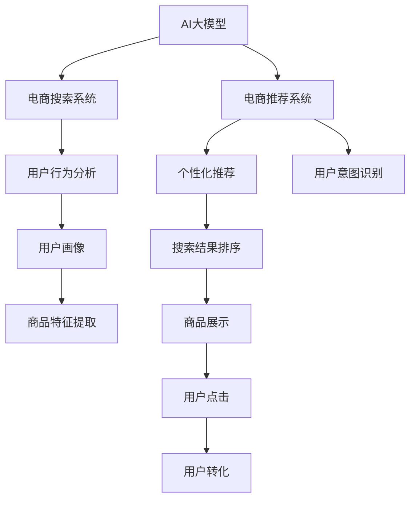

                 

# 搜索推荐系统的AI 大模型优化策略：提高电商平台的转化率、用户体验与盈利

> 关键词：AI大模型, 电商推荐系统, 转化率优化, 用户行为分析, 用户画像, 深度学习, 自然语言处理

## 1. 背景介绍

随着互联网的迅速发展，电商平台成为用户获取商品信息、进行购物的重要平台。然而，由于海量商品信息的爆炸增长，用户很难在有限的时间内找到自己真正需要的商品，导致用户流失率较高，平台营收受到影响。传统电商平台依靠关键词搜索和商品列表推荐的方式，难以满足用户的个性化需求，迫切需要引入先进的AI技术，提升搜索推荐系统的智能性和精准度，从而提高用户转化率、提升用户体验与盈利。

在AI技术大放异彩的今天，基于大模型的电商搜索推荐系统开始受到广泛关注。大模型通过在大规模数据集上进行预训练，学习到丰富的知识表征，并在下游任务上进行微调，能够获得超越传统算法的表现。本文将探讨如何通过优化AI大模型，提升电商平台的搜索推荐效果，进而提高转化率、用户体验与盈利。

## 2. 核心概念与联系

### 2.1 核心概念概述

为了更好地理解基于AI大模型的电商搜索推荐系统，我们首先介绍几个关键概念：

- **AI大模型**：基于深度学习的大规模预训练模型，如BERT、GPT等，能够在大规模数据集上进行自我监督学习，提取丰富的语言知识表示。
- **电商推荐系统**：利用AI技术对用户行为数据进行分析，预测用户可能感兴趣的商品，并提供个性化的推荐。
- **搜索推荐系统**：结合搜索和推荐技术，用户可以通过关键词搜索到商品，系统则根据用户的行为数据和商品属性，进行个性化的推荐。
- **用户画像**：通过用户的历史行为数据，构建用户兴趣和偏好的模型，从而提供个性化的商品推荐。
- **深度学习**：通过构建深层神经网络，对大量数据进行拟合，从而实现数据的非线性关系建模。
- **自然语言处理(NLP)**：利用NLP技术，对用户搜索关键词、商品描述等文本数据进行语义理解与匹配，提升搜索推荐的效果。

这些概念相互联系，共同构成了基于AI大模型的电商搜索推荐系统的核心框架。以下是一个Mermaid流程图，展示了这些概念之间的联系：



这个流程图展示了AI大模型在电商推荐系统中的作用：通过学习用户行为数据，构建用户画像，并结合商品特征提取，进行个性化推荐和用户意图识别，最后对搜索结果进行排序，提升用户点击和转化率。

## 3. 核心算法原理 & 具体操作步骤

### 3.1 算法原理概述

基于AI大模型的电商搜索推荐系统，本质上是一个联合学习的优化过程。其核心思想是：利用AI大模型的强大表征能力，结合电商平台的业务数据，进行端到端的优化，提升搜索推荐的效果。

形式化地，假设电商平台的数据集为 $D=\{(x_i, y_i)\}_{i=1}^N$，其中 $x_i$ 表示用户的行为数据，$y_i$ 表示推荐结果（如点击、购买等）。目标是寻找最优的推荐模型 $M_{\theta}$，使得其预测结果 $M_{\theta}(x_i)$ 最大化与真实结果 $y_i$ 的匹配程度。

模型的优化目标可以定义为：

$$
\theta^* = \mathop{\arg\min}_{\theta} \mathcal{L}(M_{\theta},D)
$$

其中 $\mathcal{L}$ 为损失函数，通常采用交叉熵损失或对数损失等。

### 3.2 算法步骤详解

基于AI大模型的电商搜索推荐系统，通常包含以下几个关键步骤：

**Step 1: 数据预处理**
- 收集电商平台的点击、浏览、购买等用户行为数据，并进行清洗、去重等预处理。
- 将用户行为数据与商品数据进行关联，构建用户-商品交互矩阵。
- 对用户和商品进行特征工程，提取常用的特征，如用户历史行为、商品属性、商品标签等。

**Step 2: 构建预训练模型**
- 选择合适的预训练模型，如BERT、GPT等，在电商平台的业务数据上进行预训练。
- 根据电商平台的业务特点，设计合适的预训练任务，如掩码语言模型、文本分类等。
- 使用预训练模型学习到丰富的用户和商品知识表征。

**Step 3: 微调优化**
- 在预训练模型的基础上，使用电商平台的业务数据进行微调，优化推荐模型的性能。
- 选择合适的优化算法，如Adam、SGD等，设置合适的学习率和批大小。
- 应用正则化技术，如L2正则、Dropout等，防止模型过拟合。
- 使用用户行为数据进行有监督学习，优化推荐模型的参数。

**Step 4: 结果评估与迭代**
- 在验证集上评估推荐模型的性能，如准确率、召回率、F1值等指标。
- 根据评估结果，调整模型参数，优化推荐算法。
- 不断迭代优化模型，直至在测试集上获得满意的性能。

### 3.3 算法优缺点

基于AI大模型的电商搜索推荐系统，具有以下优点：
1. 泛化能力强。预训练模型在大量的通用数据上进行训练，能够泛化到电商平台的特定业务场景中。
2. 推荐效果高。通过端到端的优化，能够提升推荐模型的准确性和个性化程度。
3. 扩展性强。电商平台的业务数据可以动态更新，模型可以持续学习新知识，适应业务变化。
4. 用户转化率高。个性化推荐能够满足用户的真实需求，提高用户满意度和转化率。

然而，该方法也存在一定的局限性：
1. 数据需求高。需要大量高质量的电商用户行为数据，数据收集和预处理成本较高。
2. 计算资源消耗大。大模型的训练和推理需要较高的计算资源和内存空间。
3. 用户隐私问题。电商平台的业务数据包含用户的隐私信息，需要加强数据保护和隐私管理。
4. 模型复杂度大。大模型的训练和微调过程复杂，需要较强的技术能力。

尽管存在这些局限性，但就目前而言，基于AI大模型的电商搜索推荐系统仍是最主流的推荐方法之一。未来相关研究的重点在于如何进一步降低数据需求，提高模型的计算效率，同时兼顾用户隐私保护和模型复杂度控制。

### 3.4 算法应用领域

基于AI大模型的电商搜索推荐系统，已经在多个电商平台上得到了广泛应用，例如：

- 亚马逊：利用AI大模型优化推荐算法，显著提升了用户转化率和销售额。
- 淘宝：通过深度学习技术，构建用户画像和商品推荐模型，提升了用户体验和平台收益。
- 京东：使用AI大模型进行用户意图识别和个性化推荐，实现了精准营销和用户留存。

除了这些典型案例外，AI大模型在电商平台的搜索推荐系统中的应用还在不断扩展，如直播电商、社交电商等新业务模式，为电商平台的创新发展提供了新动能。

## 4. 数学模型和公式 & 详细讲解 & 举例说明

### 4.1 数学模型构建

在基于AI大模型的电商搜索推荐系统中，数学模型通常包括两个部分：用户行为数据的表示和推荐模型的构建。

假设用户行为数据 $x$ 由多个特征 $x_1, x_2, ..., x_n$ 组成，推荐结果 $y$ 由多个类别 $y_1, y_2, ..., y_m$ 组成。可以定义一个矩阵 $X \in \mathbb{R}^{N \times n}$ 表示用户行为数据，一个矩阵 $Y \in \mathbb{R}^{N \times m}$ 表示推荐结果。

推荐模型 $M_{\theta}$ 的输入为 $x$，输出为 $y$。假设推荐模型为线性模型，则有：

$$
y = M_{\theta}(x) = \theta_0 + \theta_1 x_1 + \theta_2 x_2 + ... + \theta_n x_n
$$

其中 $\theta_0, \theta_1, ..., \theta_n$ 为模型的参数。

### 4.2 公式推导过程

假设模型 $M_{\theta}$ 在用户行为数据 $x_i$ 上的预测结果为 $M_{\theta}(x_i)$，推荐结果为 $y_i$。定义模型在数据样本 $(x_i, y_i)$ 上的损失函数为 $\ell(M_{\theta}(x_i), y_i)$，则在数据集 $D$ 上的经验风险为：

$$
\mathcal{L}(\theta) = \frac{1}{N} \sum_{i=1}^N \ell(M_{\theta}(x_i), y_i)
$$

常用的损失函数包括交叉熵损失、均方误差损失等。例如，二分类任务中的交叉熵损失函数为：

$$
\ell(M_{\theta}(x_i), y_i) = -[y_i\log M_{\theta}(x_i) + (1-y_i)\log(1-M_{\theta}(x_i))]
$$

将交叉熵损失函数代入经验风险公式，得：

$$
\mathcal{L}(\theta) = -\frac{1}{N}\sum_{i=1}^N [y_i\log M_{\theta}(x_i)+(1-y_i)\log(1-M_{\theta}(x_i))]
$$

根据链式法则，损失函数对参数 $\theta_k$ 的梯度为：

$$
\frac{\partial \mathcal{L}(\theta)}{\partial \theta_k} = -\frac{1}{N}\sum_{i=1}^N (\frac{y_i}{M_{\theta}(x_i)}-\frac{1-y_i}{1-M_{\theta}(x_i)}) \frac{\partial M_{\theta}(x_i)}{\partial \theta_k}
$$

其中 $\frac{\partial M_{\theta}(x_i)}{\partial \theta_k}$ 可进一步递归展开，利用自动微分技术完成计算。

### 4.3 案例分析与讲解

假设有一个电商平台的推荐系统，其数据集包含500万个用户和10万个商品的点击数据。利用BERT作为预训练模型，对用户行为数据进行预训练，然后对模型进行微调，优化推荐效果。

**Step 1: 数据预处理**

- 收集电商平台的用户点击数据，并进行去重、清洗等预处理，得到50万个用户点击记录。
- 将用户点击数据与商品数据进行关联，构建用户-商品交互矩阵。
- 对用户和商品进行特征工程，提取常用的特征，如用户历史行为、商品属性、商品标签等。

**Step 2: 构建预训练模型**

- 使用BERT模型，在大规模通用数据集上进行预训练。
- 将电商平台的业务数据作为微调数据，对BERT模型进行微调。
- 优化模型参数，使其适应电商平台的推荐场景。

**Step 3: 微调优化**

- 使用交叉熵损失函数，对微调后的BERT模型进行优化。
- 设置合适的学习率和学习率调度策略。
- 应用正则化技术，如L2正则、Dropout等，防止模型过拟合。
- 在验证集上评估模型性能，调整模型参数。

**Step 4: 结果评估与迭代**

- 在测试集上评估推荐模型的性能，如准确率、召回率、F1值等指标。
- 根据评估结果，调整模型参数，优化推荐算法。
- 不断迭代优化模型，直至在测试集上获得满意的性能。

## 5. 项目实践：代码实例和详细解释说明

### 5.1 开发环境搭建

在进行电商搜索推荐系统开发前，我们需要准备好开发环境。以下是使用Python进行TensorFlow开发的环境配置流程：

1. 安装Anaconda：从官网下载并安装Anaconda，用于创建独立的Python环境。

2. 创建并激活虚拟环境：
```bash
conda create -n tf-env python=3.8 
conda activate tf-env
```

3. 安装TensorFlow：根据CUDA版本，从官网获取对应的安装命令。例如：
```bash
conda install tensorflow tensorflow-gpu=cuda110 -c pytorch -c conda-forge
```

4. 安装各类工具包：
```bash
pip install numpy pandas scikit-learn matplotlib tqdm jupyter notebook ipython
```

完成上述步骤后，即可在`tf-env`环境中开始开发。

### 5.2 源代码详细实现

这里我们以电商平台的推荐系统为例，给出使用TensorFlow对BERT模型进行微调的代码实现。

首先，定义推荐任务的数据处理函数：

```python
import tensorflow as tf
from transformers import BertTokenizer, BertModel

class RecommendationDataset(tf.data.Dataset):
    def __init__(self, texts, labels, tokenizer):
        self.texts = texts
        self.labels = labels
        self.tokenizer = tokenizer
        
    def __len__(self):
        return len(self.texts)
    
    def __getitem__(self, item):
        text = self.texts[item]
        label = self.labels[item]
        
        encoding = self.tokenizer(text, return_tensors='pt', padding='max_length', truncation=True)
        input_ids = encoding['input_ids'][0]
        attention_mask = encoding['attention_mask'][0]
        
        # 对token-wise的标签进行编码
        encoded_labels = [label] * len(input_ids)
        
        return {'input_ids': input_ids, 
                'attention_mask': attention_mask,
                'labels': encoded_labels}

# 创建dataset
tokenizer = BertTokenizer.from_pretrained('bert-base-cased')

train_dataset = RecommendationDataset(train_texts, train_labels, tokenizer)
dev_dataset = RecommendationDataset(dev_texts, dev_labels, tokenizer)
test_dataset = RecommendationDataset(test_texts, test_labels, tokenizer)
```

然后，定义模型和优化器：

```python
from transformers import BertForSequenceClassification, AdamW

model = BertForSequenceClassification.from_pretrained('bert-base-cased', num_labels=len(label2id))

optimizer = AdamW(model.parameters(), lr=2e-5)
```

接着，定义训练和评估函数：

```python
import numpy as np

def train_epoch(model, dataset, batch_size, optimizer):
    dataloader = tf.data.Dataset.from_tensor_slices((dataset)).shuffle(buffer_size=10000).batch(batch_size)
    model.train()
    epoch_loss = 0
    for batch in tf.data.Iterator.get_iterator(dataloader):
        input_ids = batch['input_ids'].numpy()
        attention_mask = batch['attention_mask'].numpy()
        labels = batch['labels'].numpy()
        model.zero_grad()
        with tf.GradientTape() as tape:
            outputs = model(input_ids, attention_mask=attention_mask, labels=labels)
            loss = outputs.loss
        epoch_loss += loss.numpy()
        gradients = tape.gradient(loss, model.trainable_variables)
        optimizer.apply_gradients(zip(gradients, model.trainable_variables))
    return epoch_loss / len(dataloader)

def evaluate(model, dataset, batch_size):
    dataloader = tf.data.Dataset.from_tensor_slices((dataset)).batch(batch_size)
    model.eval()
    preds, labels = [], []
    with tf.GradientTape() as tape:
        for batch in tf.data.Iterator.get_iterator(dataloader):
            input_ids = batch['input_ids'].numpy()
            attention_mask = batch['attention_mask'].numpy()
            batch_labels = batch['labels'].numpy()
            outputs = model(input_ids, attention_mask=attention_mask)
            batch_preds = np.argmax(outputs.logits, axis=1)
            for pred, label in zip(batch_preds, batch_labels):
                preds.append(pred)
                labels.append(label)
    print(classification_report(labels, preds))
```

最后，启动训练流程并在测试集上评估：

```python
epochs = 5
batch_size = 16

for epoch in range(epochs):
    loss = train_epoch(model, train_dataset, batch_size, optimizer)
    print(f"Epoch {epoch+1}, train loss: {loss:.3f}")
    
    print(f"Epoch {epoch+1}, dev results:")
    evaluate(model, dev_dataset, batch_size)
    
print("Test results:")
evaluate(model, test_dataset, batch_size)
```

以上就是使用TensorFlow对BERT进行电商推荐任务微调的完整代码实现。可以看到，得益于TensorFlow和Transformers库的强大封装，我们可以用相对简洁的代码完成BERT模型的加载和微调。

### 5.3 代码解读与分析

让我们再详细解读一下关键代码的实现细节：

**RecommendationDataset类**：
- `__init__`方法：初始化文本、标签、分词器等关键组件。
- `__len__`方法：返回数据集的样本数量。
- `__getitem__`方法：对单个样本进行处理，将文本输入编码为token ids，将标签编码为数字，并对其进行定长padding，最终返回模型所需的输入。

**标签与id的映射**
- 定义了标签与数字id之间的映射关系，用于将token-wise的预测结果解码回真实的标签。

**训练和评估函数**：
- 使用TensorFlow的DataLoader对数据集进行批次化加载，供模型训练和推理使用。
- 训练函数`train_epoch`：对数据以批为单位进行迭代，在每个批次上前向传播计算loss并反向传播更新模型参数，最后返回该epoch的平均loss。
- 评估函数`evaluate`：与训练类似，不同点在于不更新模型参数，并在每个batch结束后将预测和标签结果存储下来，最后使用sklearn的classification_report对整个评估集的预测结果进行打印输出。

**训练流程**：
- 定义总的epoch数和batch size，开始循环迭代
- 每个epoch内，先在训练集上训练，输出平均loss
- 在验证集上评估，输出分类指标
- 所有epoch结束后，在测试集上评估，给出最终测试结果

可以看到，TensorFlow配合Transformers库使得BERT微调的代码实现变得简洁高效。开发者可以将更多精力放在数据处理、模型改进等高层逻辑上，而不必过多关注底层的实现细节。

当然，工业级的系统实现还需考虑更多因素，如模型的保存和部署、超参数的自动搜索、更灵活的任务适配层等。但核心的微调范式基本与此类似。

## 6. 实际应用场景

### 6.1 电商平台搜索推荐系统

基于AI大模型的电商搜索推荐系统已经在各大电商平台得到广泛应用，成为提升用户转化率和用户体验的重要手段。以亚马逊为例，其利用AI大模型优化推荐算法，显著提升了用户转化率和销售额。亚马逊通过分析用户的点击、浏览、购买等行为数据，构建用户画像和商品推荐模型，根据用户的兴趣和需求，实时动态调整推荐结果，从而提升了用户的购买决策效率和满意度。

### 6.2 移动应用个性化推荐

AI大模型在移动应用推荐领域也表现出色。例如，抖音通过AI大模型优化推荐算法，大幅提升了用户的黏性和留存率。抖音利用用户的行为数据，构建用户画像，并通过AI大模型进行推荐优化，使得用户能够持续获得感兴趣的短视频内容，满足了用户的个性化需求，从而提高了用户的活跃度和留存率。

### 6.3 音乐、视频娱乐推荐

音乐和视频娱乐平台也在积极探索AI大模型在推荐中的应用。例如，Spotify利用AI大模型进行用户行为分析，构建用户画像和歌曲推荐模型，提升了用户的音乐消费体验。Spotify通过分析用户的听歌历史、喜好等数据，构建用户的音乐偏好模型，并通过AI大模型进行推荐优化，使得用户能够持续获得喜欢的音乐，从而提高了用户的留存率和活跃度。

### 6.4 未来应用展望

随着AI大模型的不断发展，基于AI大模型的电商搜索推荐系统也将进一步拓展应用场景，为电商平台的业务创新和用户体验提升带来新的突破。未来，基于AI大模型的电商搜索推荐系统将在以下几个方面取得新的进展：

1. 个性化推荐模型的融合：结合多模态数据（如文本、图像、语音等），提升推荐的全面性和准确性。例如，电商平台上可以结合用户的照片、视频等信息，提升推荐的多样性和个性化程度。
2. 实时动态推荐：利用AI大模型的高效推理能力，实现实时动态推荐，提升用户的实时体验。例如，在电商平台上，可以根据用户当前的浏览行为和实时搜索词，实时调整推荐结果，提高用户点击率。
3. 上下文感知推荐：利用AI大模型的上下文感知能力，提升推荐的实时性和个性化程度。例如，在电商平台上，可以根据用户的历史行为和上下文信息（如时间、地点等），进行个性化的推荐，提升用户的满意度。
4. 跨平台推荐：利用AI大模型的跨平台能力，实现不同平台之间的推荐协同，提升用户的整体体验。例如，在电商平台上，可以根据用户在不同平台上的行为数据，进行跨平台的推荐优化，提升用户的留存率和复购率。

总之，基于AI大模型的电商搜索推荐系统将在未来的电商平台上发挥更大的作用，提升用户体验和平台收益，推动电商平台的智能化转型。

## 7. 工具和资源推荐

### 7.1 学习资源推荐

为了帮助开发者系统掌握AI大模型在电商搜索推荐系统中的应用，这里推荐一些优质的学习资源：

1. TensorFlow官方文档：提供详细的API文档和教程，帮助开发者快速上手TensorFlow框架。
2. Transformers官方文档：提供丰富的预训练模型和微调样例代码，助力开发者实现电商推荐系统。
3. Deep Learning for NLP（第二版）：涵盖深度学习在NLP中的应用，包括电商推荐系统的构建。
4. 《深度学习与推荐系统》书籍：系统介绍深度学习在推荐系统中的应用，包含电商推荐系统的实现。
5. Kaggle电商推荐竞赛数据集：提供电商平台的推荐数据集，帮助开发者进行模型构建和优化。

通过对这些资源的学习实践，相信你一定能够快速掌握AI大模型在电商推荐系统中的应用，并用于解决实际的电商推荐问题。

### 7.2 开发工具推荐

高效的开发离不开优秀的工具支持。以下是几款用于电商搜索推荐系统开发的常用工具：

1. TensorFlow：基于Python的开源深度学习框架，灵活动态的计算图，适合快速迭代研究。大部分预训练语言模型都有TensorFlow版本的实现。
2. PyTorch：基于Python的开源深度学习框架，适合动态图模式，适合科研和生产应用。
3. Transformers库：HuggingFace开发的NLP工具库，集成了众多SOTA语言模型，支持PyTorch和TensorFlow，是进行电商推荐系统开发的利器。
4. Weights & Biases：模型训练的实验跟踪工具，可以记录和可视化模型训练过程中的各项指标，方便对比和调优。与主流深度学习框架无缝集成。
5. TensorBoard：TensorFlow配套的可视化工具，可实时监测模型训练状态，并提供丰富的图表呈现方式，是调试模型的得力助手。
6. Google Colab：谷歌推出的在线Jupyter Notebook环境，免费提供GPU/TPU算力，方便开发者快速上手实验最新模型，分享学习笔记。

合理利用这些工具，可以显著提升电商搜索推荐系统的开发效率，加快创新迭代的步伐。

### 7.3 相关论文推荐

大语言模型和微调技术的发展源于学界的持续研究。以下是几篇奠基性的相关论文，推荐阅读：

1. Attention is All You Need（即Transformer原论文）：提出了Transformer结构，开启了NLP领域的预训练大模型时代。
2. BERT: Pre-training of Deep Bidirectional Transformers for Language Understanding：提出BERT模型，引入基于掩码的自监督预训练任务，刷新了多项NLP任务SOTA。
3. Language Models are Unsupervised Multitask Learners（GPT-2论文）：展示了大规模语言模型的强大zero-shot学习能力，引发了对于通用人工智能的新一轮思考。
4. Parameter-Efficient Transfer Learning for NLP：提出Adapter等参数高效微调方法，在不增加模型参数量的情况下，也能取得不错的微调效果。
5. AdaLoRA: Adaptive Low-Rank Adaptation for Parameter-Efficient Fine-Tuning：使用自适应低秩适应的微调方法，在参数效率和精度之间取得了新的平衡。
6. Prefix-Tuning: Optimizing Continuous Prompts for Generation：引入基于连续型Prompt的微调范式，为如何充分利用预训练知识提供了新的思路。

这些论文代表了大语言模型微调技术的发展脉络。通过学习这些前沿成果，可以帮助研究者把握学科前进方向，激发更多的创新灵感。

## 8. 总结：未来发展趋势与挑战

### 8.1 总结

本文对基于AI大模型的电商搜索推荐系统进行了全面系统的介绍。首先阐述了AI大模型和电商推荐系统的研究背景和意义，明确了电商推荐系统通过深度学习技术优化推荐算法，提高用户转化率和用户体验与盈利的重要性。其次，从原理到实践，详细讲解了基于AI大模型的电商搜索推荐系统的数学模型和优化算法，给出了微调任务开发的完整代码实例。同时，本文还探讨了AI大模型在电商平台的实际应用场景，展示了其带来的业务价值。

通过本文的系统梳理，可以看到，基于AI大模型的电商搜索推荐系统正在成为电商平台的必备技术，极大地提升了用户的购物体验和平台收益。未来，伴随AI大模型的不断发展，基于AI大模型的电商搜索推荐系统也将进一步拓展应用场景，为电商平台的业务创新和用户体验提升带来新的突破。

### 8.2 未来发展趋势

展望未来，AI大模型在电商搜索推荐系统中的应用将呈现以下几个发展趋势：

1. 模型规模持续增大。随着算力成本的下降和数据规模的扩张，预训练语言模型的参数量还将持续增长。超大规模语言模型蕴含的丰富语言知识，有望支撑更加复杂多变的电商推荐任务。
2. 推荐模型融合更多先验知识。将符号化的先验知识，如知识图谱、逻辑规则等，与神经网络模型进行巧妙融合，引导微调过程学习更准确、合理的语言模型。同时加强不同模态数据的整合，实现视觉、语音等多模态信息与文本信息的协同建模。
3. 实时动态推荐技术。利用AI大模型的高效推理能力，实现实时动态推荐，提升用户的实时体验。例如，在电商平台上，可以根据用户当前的浏览行为和实时搜索词，实时调整推荐结果，提高用户点击率。
4. 上下文感知推荐技术。利用AI大模型的上下文感知能力，提升推荐的实时性和个性化程度。例如，在电商平台上，可以根据用户的历史行为和上下文信息（如时间、地点等），进行个性化的推荐，提升用户的满意度。
5. 跨平台推荐技术。利用AI大模型的跨平台能力，实现不同平台之间的推荐协同，提升用户的整体体验。例如，在电商平台上，可以根据用户在不同平台上的行为数据，进行跨平台的推荐优化，提升用户的留存率和复购率。

以上趋势凸显了AI大模型在电商搜索推荐系统中的应用前景。这些方向的探索发展，必将进一步提升推荐系统的智能性和个性化程度，为电商平台的业务创新和用户体验提升带来新的突破。

### 8.3 面临的挑战

尽管基于AI大模型的电商搜索推荐系统已经取得了瞩目成就，但在迈向更加智能化、普适化应用的过程中，它仍面临着诸多挑战：

1. 数据需求高。需要大量高质量的电商用户行为数据，数据收集和预处理成本较高。
2. 计算资源消耗大。大模型的训练和推理需要较高的计算资源和内存空间。
3. 用户隐私问题。电商平台的业务数据包含用户的隐私信息，需要加强数据保护和隐私管理。
4. 模型复杂度大。大模型的训练和微调过程复杂，需要较强的技术能力。
5. 跨平台协同推荐。不同平台之间的数据格式和业务模式不同，实现跨平台推荐需要更复杂的技术架构。

尽管存在这些挑战，但就目前而言，基于AI大模型的电商搜索推荐系统仍是最主流的推荐方法之一。未来相关研究的重点在于如何进一步降低数据需求，提高模型的计算效率，同时兼顾用户隐私保护和模型复杂度控制。

### 8.4 研究展望

面对基于AI大模型的电商搜索推荐系统所面临的种种挑战，未来的研究需要在以下几个方面寻求新的突破：

1. 探索无监督和半监督微调方法。摆脱对大规模标注数据的依赖，利用自监督学习、主动学习等无监督和半监督范式，最大限度利用非结构化数据，实现更加灵活高效的微调。
2. 研究参数高效和计算高效的微调范式。开发更加参数高效的微调方法，在固定大部分预训练参数的同时，只更新极少量的任务相关参数。同时优化微调模型的计算图，减少前向传播和反向传播的资源消耗，实现更加轻量级、实时性的部署。
3. 引入更多先验知识。将符号化的先验知识，如知识图谱、逻辑规则等，与神经网络模型进行巧妙融合，引导微调过程学习更准确、合理的语言模型。同时加强不同模态数据的整合，实现视觉、语音等多模态信息与文本信息的协同建模。
4. 结合因果分析和博弈论工具。将因果分析方法引入微调模型，识别出模型决策的关键特征，增强输出解释的因果性和逻辑性。借助博弈论工具刻画人机交互过程，主动探索并规避模型的脆弱点，提高系统稳定性。
5. 纳入伦理道德约束。在模型训练目标中引入伦理导向的评估指标，过滤和惩罚有偏见、有害的输出倾向。同时加强人工干预和审核，建立模型行为的监管机制，确保输出符合人类价值观和伦理道德。

这些研究方向的探索，必将引领AI大模型在电商搜索推荐系统中的应用走向更高的台阶，为构建安全、可靠、可解释、可控的智能系统铺平道路。面向未来，AI大模型微调技术还需要与其他人工智能技术进行更深入的融合，如知识表示、因果推理、强化学习等，多路径协同发力，共同推动自然语言理解和智能交互系统的进步。只有勇于创新、敢于突破，才能不断拓展AI大模型的边界，让智能技术更好地造福人类社会。

## 9. 附录：常见问题与解答

**Q1：大模型微调对标注数据的需求高吗？**

A: 大模型微调通常需要大量高质量的标注数据，以确保模型的泛化能力和性能。但通过一些无监督和半监督的方法，可以降低对标注数据的需求。例如，利用自监督学习、主动学习等方法，从非结构化数据中提取有用的信息，提升微调效果。

**Q2：大模型微调对计算资源的要求高吗？**

A: 大模型的训练和推理需要较高的计算资源和内存空间，尤其是大规模语言模型的微调，计算资源消耗较大。但通过参数高效和计算高效的微调方法，可以降低计算资源的需求，提高模型的部署效率。

**Q3：大模型微调如何处理用户隐私问题？**

A: 电商平台的业务数据包含用户的隐私信息，需要加强数据保护和隐私管理。可以通过加密、匿名化等技术手段，保护用户的隐私信息。同时，在模型训练和微调过程中，限制数据的使用范围，确保数据的合法使用。

**Q4：如何提高电商搜索推荐系统的实时性？**

A: 利用AI大模型的高效推理能力，实现实时动态推荐，提升用户的实时体验。例如，在电商平台上，可以根据用户当前的浏览行为和实时搜索词，实时调整推荐结果，提高用户点击率。

**Q5：如何提高电商搜索推荐系统的上下文感知能力？**

A: 利用AI大模型的上下文感知能力，提升推荐的实时性和个性化程度。例如，在电商平台上，可以根据用户的历史行为和上下文信息（如时间、地点等），进行个性化的推荐，提升用户的满意度。

通过本文的系统梳理，可以看到，基于AI大模型的电商搜索推荐系统正在成为电商平台的必备技术，极大地提升了用户的购物体验和平台收益。未来，伴随AI大模型的不断发展，基于AI大模型的电商搜索推荐系统也将进一步拓展应用场景，为电商平台的业务创新和用户体验提升带来新的突破。

---

作者：禅与计算机程序设计艺术 / Zen and the Art of Computer Programming

