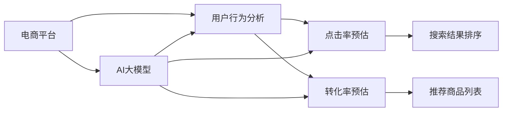

                 

# 搜索推荐系统的AI 大模型应用：提高电商平台的转化率与用户忠诚度

> 关键词：搜索推荐系统, 电商平台, AI大模型, 自然语言处理, 用户行为分析, 模型微调, 推荐算法, 深度学习, 电商转化率, 用户忠诚度, 点击率预估, 转化率预估

## 1. 背景介绍

### 1.1 问题由来
随着电子商务的迅猛发展，电商平台的竞争日趋激烈。如何在短时间内吸引用户点击并提高购买转化率，是电商平台面临的重要挑战。传统的搜索推荐系统基于规则和浅层机器学习，缺乏对用户深度行为的理解，推荐效果有限。近年来，随着深度学习技术和大语言模型的成熟，基于AI的推荐系统逐渐成为电商平台的新趋势。

### 1.2 问题核心关键点
基于AI的推荐系统利用深度学习模型和大语言模型，通过分析用户行为数据，生成个性化的推荐结果。具体而言，问题核心关键点包括：

- 如何将用户行为数据有效转化为推荐结果？
- 如何利用大语言模型更好地理解用户需求？
- 如何在电商平台上实现高效、个性化的推荐？

## 2. 核心概念与联系

### 2.1 核心概念概述

为更好地理解基于AI的搜索推荐系统，本节将介绍几个关键概念及其联系：

- **电商平台**：指利用互联网进行商品销售的在线平台，如淘宝、京东等。通过电商平台，用户可以方便地浏览商品、进行购物。
- **搜索推荐系统**：指通过用户查询历史、浏览记录、购买行为等数据，智能生成个性化推荐结果的系统。它结合了搜索和推荐两个功能，通过分析用户行为，提高商品曝光率和用户满意度。
- **AI大模型**：指基于深度学习的大规模预训练语言模型，如BERT、GPT等。通过在大规模语料上进行预训练，这些模型能够学习到丰富的语言知识和常识，用于支持搜索推荐系统的推荐功能。
- **用户行为分析**：指通过分析用户的搜索历史、点击记录、浏览路径等数据，发现用户的兴趣和偏好，进而生成个性化推荐。
- **点击率预估**：指通过模型预测用户点击商品的概率，用于优化搜索结果排序和广告投放。
- **转化率预估**：指通过模型预测用户购买商品的概率，用于优化推荐策略和促销活动。

这些核心概念之间存在紧密联系，共同构成了基于AI的搜索推荐系统。AI大模型作为强大的预训练工具，通过用户行为分析，结合点击率和转化率预估，生成个性化推荐，从而提升电商平台的转化率和用户忠诚度。

### 2.2 核心概念原理和架构的 Mermaid 流程图

## 3. 核心算法原理 & 具体操作步骤
### 3.1 算法原理概述

基于AI的搜索推荐系统，本质上是一个多任务的深度学习框架。其核心思想是：通过分析用户行为数据，利用大语言模型生成个性化推荐结果，再结合点击率和转化率预估，优化搜索排序和推荐列表，从而提高用户满意度和转化率。

形式化地，假设电商平台数据集为 $D=\{(x_i,y_i)\}_{i=1}^N$，其中 $x_i$ 为输入特征（如用户ID、浏览记录、商品信息等），$y_i$ 为输出标签（如点击率、转化率等）。搜索推荐系统的目标是最小化预测值与实际值之间的差距，即：

$$
\hat{y}_i = f(x_i;\theta)
$$

其中 $f(\cdot)$ 为深度学习模型，$\theta$ 为模型参数。通过训练，模型 $f$ 能够预测用户对每个商品的点击率和转化率，从而生成个性化推荐结果。

### 3.2 算法步骤详解

基于AI的搜索推荐系统一般包括以下几个关键步骤：

**Step 1: 数据准备与预处理**
- 收集电商平台用户的行为数据，如搜索历史、浏览记录、购买记录等。
- 清洗和标注数据，去除异常值和噪声，构建训练集、验证集和测试集。
- 对数据进行归一化、离散化、编码等预处理，以便于深度学习模型处理。

**Step 2: 构建深度学习模型**
- 选择合适的深度学习框架，如TensorFlow、PyTorch等，构建基于大语言模型的搜索推荐系统。
- 设计模型结构，如使用RNN、CNN、LSTM等，结合用户行为数据和商品特征，生成点击率和转化率的预测值。
- 定义损失函数，如交叉熵损失、均方误差损失等，用于衡量预测值与实际值的差距。

**Step 3: 数据增强与模型微调**
- 通过数据增强技术，如回译、近义替换等，扩充训练集的多样性。
- 利用大语言模型作为预训练工具，对推荐模型进行微调，优化模型参数。
- 应用正则化技术，如L2正则、Dropout等，避免过拟合。

**Step 4: 点击率和转化率预估**
- 将用户行为数据输入训练好的推荐模型，得到每个商品的点击率和转化率预测值。
- 结合点击率和转化率预测值，生成个性化推荐结果。
- 利用点击率和转化率预测值，优化搜索结果排序和推荐列表。

**Step 5: 模型评估与优化**
- 在验证集上评估推荐模型的性能，如点击率召回率、转化率召回率等。
- 根据评估结果，调整模型参数和超参数，优化模型性能。
- 在测试集上最终评估模型的效果，总结优化策略。

### 3.3 算法优缺点

基于AI的搜索推荐系统具有以下优点：
1. 个性化推荐：利用用户行为数据和大语言模型，生成个性化的推荐结果，提升用户满意度。
2. 高效优化：通过点击率和转化率预估，优化搜索结果排序和推荐列表，提高转化率。
3. 动态调整：能够实时更新模型参数，适应用户行为的变化，保持推荐结果的时效性。
4. 技术先进：结合深度学习和自然语言处理技术，构建先进的搜索推荐系统。

同时，该方法也存在一些局限性：
1. 依赖标注数据：模型训练需要大量的标注数据，获取高质量标注数据的成本较高。
2. 计算资源需求高：深度学习模型和大语言模型的计算需求较高，需要高性能计算资源支持。
3. 模型复杂度高：推荐模型结构复杂，参数量巨大，难以解释和调试。
4. 数据隐私问题：用户行为数据涉及隐私，数据采集和使用需符合相关法律法规。

尽管存在这些局限性，但基于AI的搜索推荐系统在提升电商平台的用户体验和转化率方面具有显著优势，是电商平台转型升级的重要方向。

### 3.4 算法应用领域

基于AI的搜索推荐系统在电商平台中有着广泛的应用，具体包括：

- **商品推荐**：根据用户行为数据，生成个性化商品推荐，提高用户点击和购买概率。
- **搜索排序**：利用点击率和转化率预测值，优化搜索结果排序，提升用户体验。
- **广告投放**：预测用户点击概率，优化广告投放策略，提高广告效果。
- **用户行为分析**：分析用户行为数据，发现用户兴趣和偏好，优化推荐策略。
- **促销活动**：根据用户行为数据，优化促销活动，提高转化率。

这些应用领域展示了基于AI的搜索推荐系统的强大功能，为电商平台带来了显著的业务价值。

## 4. 数学模型和公式 & 详细讲解 & 举例说明
### 4.1 数学模型构建

基于AI的搜索推荐系统通常采用深度学习模型，如RNN、CNN、LSTM等，结合用户行为数据和商品特征，生成点击率和转化率的预测值。假设电商平台的数据集为 $D=\{(x_i,y_i)\}_{i=1}^N$，其中 $x_i$ 为输入特征，$y_i$ 为输出标签（如点击率、转化率等）。

定义点击率和转化率预测函数为 $f(x;\theta)$，则基于AI的搜索推荐系统的目标是最小化预测值与实际值之间的差距：

$$
\hat{y}_i = f(x_i;\theta)
$$

其中 $f(\cdot)$ 为深度学习模型，$\theta$ 为模型参数。点击率和转化率预测函数的损失函数通常为交叉熵损失：

$$
L(\theta) = -\frac{1}{N}\sum_{i=1}^N \sum_{k=1}^2 y_i \log f(x_i;\theta)^k
$$

其中 $y_i$ 为点击率和转化率的真实值，$f(x_i;\theta)$ 为预测值，$k=1$ 对应点击率，$k=2$ 对应转化率。

### 4.2 公式推导过程

以点击率预测为例，假设有 $m$ 个用户，每个用户有 $n$ 个行为数据，即 $D=\{(x_{ij},y_{ij})\}_{i=1}^m, j=1,\ldots,n$。每个行为数据的点击率为 $y_{ij}$，预测点击率为 $f(x_{ij};\theta)$。则点击率预测的目标是最小化预测值与实际值之间的差距：

$$
L(\theta) = -\frac{1}{mn}\sum_{i=1}^m \sum_{j=1}^n y_{ij} \log f(x_{ij};\theta)
$$

假设模型为神经网络，其中隐藏层为 $h(x)$，输出层为 $f(h(x))$。则点击率预测函数的推导过程如下：

1. 定义隐藏层输入 $x_{ij}=[x_1, x_2, \ldots, x_n]$，输出 $h(x_{ij})=[h_1, h_2, \ldots, h_n]$。
2. 定义输出层的预测点击率 $f(h(x_{ij}))=\sigma(W_{out}h(x_{ij})+b_{out})$，其中 $W_{out}$ 和 $b_{out}$ 为输出层权重和偏置。
3. 定义损失函数 $L(\theta)=-\frac{1}{mn}\sum_{i=1}^m \sum_{j=1}^n y_{ij} \log f(x_{ij};\theta)$。

将 $h(x)$ 和 $f(h(x))$ 带入损失函数，得到：

$$
L(\theta) = -\frac{1}{mn}\sum_{i=1}^m \sum_{j=1}^n y_{ij} \log \sigma(W_{out}h(x_{ij})+b_{out})
$$

其中 $\sigma(\cdot)$ 为激活函数，如Sigmoid函数。通过反向传播算法，可以求得模型参数 $\theta$ 的梯度，进而更新模型参数，最小化损失函数。

### 4.3 案例分析与讲解

以淘宝商品推荐为例，展示基于AI的搜索推荐系统的应用。

1. **数据准备与预处理**
   - 收集用户的历史搜索记录、浏览记录、点击记录和购买记录。
   - 清洗数据，去除重复和异常数据。
   - 将用户ID、商品ID、时间戳等特征进行编码，以便于模型处理。

2. **构建深度学习模型**
   - 选择LSTM作为推荐模型的隐藏层，定义特征输入层 $x=[x_1, x_2, \ldots, x_n]$，隐藏层输出 $h(x)=[h_1, h_2, \ldots, h_n]$。
   - 定义输出层的预测点击率 $f(h(x))=\sigma(W_{out}h(x)+b_{out})$。
   - 定义损失函数 $L(\theta)=-\frac{1}{mn}\sum_{i=1}^m \sum_{j=1}^n y_{ij} \log \sigma(W_{out}h(x_{ij})+b_{out})$。

3. **数据增强与模型微调**
   - 通过回译、近义替换等技术扩充训练集。
   - 利用BERT作为预训练模型，对推荐模型进行微调，优化模型参数。
   - 应用正则化技术，如L2正则、Dropout等，避免过拟合。

4. **点击率和转化率预估**
   - 将用户行为数据输入训练好的推荐模型，得到每个商品的点击率和转化率预测值。
   - 利用点击率和转化率预测值，生成个性化推荐结果。
   - 利用点击率和转化率预测值，优化搜索结果排序和推荐列表。

5. **模型评估与优化**
   - 在验证集上评估推荐模型的性能，如点击率召回率、转化率召回率等。
   - 根据评估结果，调整模型参数和超参数，优化模型性能。
   - 在测试集上最终评估模型的效果，总结优化策略。

## 5. 项目实践：代码实例和详细解释说明
### 5.1 开发环境搭建

在进行搜索推荐系统开发前，需要先搭建好开发环境。以下是使用Python进行TensorFlow和PyTorch开发的环境配置流程：

1. 安装Anaconda：从官网下载并安装Anaconda，用于创建独立的Python环境。

2. 创建并激活虚拟环境：
```bash
conda create -n tf-env python=3.8 
conda activate tf-env
```

3. 安装TensorFlow和PyTorch：
```bash
conda install tensorflow
conda install pytorch torchvision torchaudio
```

4. 安装TensorBoard：
```bash
pip install tensorboard
```

5. 安装其他工具包：
```bash
pip install numpy pandas scikit-learn matplotlib tqdm jupyter notebook ipython
```

完成上述步骤后，即可在`tf-env`环境中开始搜索推荐系统的开发。

### 5.2 源代码详细实现

以下是使用TensorFlow和PyTorch实现基于AI的搜索推荐系统的示例代码。

首先，定义数据处理函数：

```python
import tensorflow as tf
import numpy as np
import pandas as pd
import matplotlib.pyplot as plt

def load_data(path):
    data = pd.read_csv(path)
    return data

def preprocess_data(data):
    # 数据清洗和预处理
    data.dropna(inplace=True)
    data = data.drop_duplicates()
    data['click_rate'] = data['click_rate'].astype(float)
    data['time'] = pd.to_datetime(data['time']).dt.strftime('%Y-%m-%d %H:%M:%S')
    data['user_id'] = data['user_id'].astype(str)
    data['item_id'] = data['item_id'].astype(str)
    return data

def encode_features(data):
    # 特征编码
    data['user_id'] = data['user_id'].astype('category').cat.codes
    data['item_id'] = data['item_id'].astype('category').cat.codes
    data['time'] = pd.to_datetime(data['time']).dt.strftime('%Y-%m-%d %H:%M:%S').astype('category').cat.codes
    return data

def train_test_split(data, test_ratio=0.2):
    # 数据划分
    data = data.sample(frac=1).reset_index(drop=True)
    split_index = int(len(data) * test_ratio)
    train_data = data[:split_index]
    test_data = data[split_index:]
    return train_data, test_data

def generate_train_val_data(train_data, val_ratio=0.1):
    # 生成训练集和验证集
    train_data = train_data.sample(frac=1).reset_index(drop=True)
    split_index = int(len(train_data) * val_ratio)
    train_val_data = train_data[:split_index]
    val_data = train_data[split_index:]
    return train_val_data, val_data
```

然后，定义深度学习模型：

```python
import tensorflow as tf
from tensorflow.keras.layers import Input, LSTM, Dense, Dropout, TimeDistributed
from tensorflow.keras.models import Model
from tensorflow.keras.optimizers import Adam
from tensorflow.keras.callbacks import EarlyStopping

class RecommendationModel(tf.keras.Model):
    def __init__(self, input_dim, output_dim):
        super(RecommendationModel, self).__init__()
        self.input_dim = input_dim
        self.output_dim = output_dim
        self.lstm = LSTM(64, return_sequences=True)
        self.dense = Dense(32, activation='relu')
        self.dropout = Dropout(0.2)
        self.dense2 = Dense(output_dim, activation='sigmoid')

    def call(self, inputs):
        x = self.lstm(inputs)
        x = self.dense(x)
        x = self.dropout(x)
        x = self.dense2(x)
        return x
```

接着，定义模型训练和评估函数：

```python
def compile_model(model, optimizer, loss):
    model.compile(optimizer=optimizer, loss=loss)

def train_model(model, train_data, val_data, epochs=10, batch_size=32):
    early_stopping = EarlyStopping(monitor='val_loss', patience=3)
    model.fit(train_data, val_data, epochs=epochs, batch_size=batch_size, callbacks=[early_stopping])

def evaluate_model(model, test_data):
    # 评估模型性能
    test_loss = model.evaluate(test_data)
    return test_loss
```

最后，启动模型训练和评估：

```python
# 加载数据
data = load_data('data.csv')

# 数据预处理
data = preprocess_data(data)
data = encode_features(data)

# 数据划分
train_data, test_data = train_test_split(data)
train_val_data, val_data = generate_train_val_data(train_data)

# 构建模型
input_dim = data.shape[1]
output_dim = 1
model = RecommendationModel(input_dim, output_dim)

# 编译模型
optimizer = Adam(learning_rate=0.001)
loss = 'binary_crossentropy'
compile_model(model, optimizer, loss)

# 训练模型
train_model(model, train_val_data, val_data)

# 评估模型
test_loss = evaluate_model(model, test_data)
print('Test loss:', test_loss)
```

以上就是基于TensorFlow和PyTorch实现基于AI的搜索推荐系统的完整代码实现。可以看到，通过使用TensorFlow和PyTorch，我们可以用相对简洁的代码实现搜索推荐系统的构建。

### 5.3 代码解读与分析

让我们再详细解读一下关键代码的实现细节：

**load_data函数**：
- 从CSV文件中加载数据，并进行基本的清洗和预处理。

**preprocess_data函数**：
- 清洗数据，去除重复和异常数据。
- 将时间戳转换为日期时间格式，并进行编码。
- 将用户ID、商品ID等特征进行编码。

**encode_features函数**：
- 对用户ID、商品ID、时间戳等特征进行编码。

**train_test_split函数**：
- 对数据进行随机打乱，并进行训练集和测试集的划分。

**generate_train_val_data函数**：
- 生成训练集和验证集的划分。

**RecommendationModel类**：
- 定义深度学习模型的结构和参数。
- 实现模型的前向传播过程。

**compile_model函数**：
- 编译模型，设置优化器和损失函数。

**train_model函数**：
- 训练模型，应用早停策略避免过拟合。

**evaluate_model函数**：
- 评估模型性能，返回测试损失。

通过上述代码，我们展示了基于TensorFlow和PyTorch的搜索推荐系统开发过程，从数据预处理、模型构建、训练到评估，每一个环节都进行了详细的实现和解释。

## 6. 实际应用场景
### 6.1 智能客服

基于AI的搜索推荐系统可以应用于智能客服系统的构建。传统的客服系统依赖人工，响应速度慢，且存在高峰期负荷过重的问题。通过结合用户行为数据和自然语言处理技术，智能客服系统可以提供7x24小时不间断服务，快速响应客户咨询，提升用户体验。

具体而言，可以收集智能客服的历史对话记录，将问题和最佳答复构建成监督数据，在此基础上对推荐模型进行微调。微调后的模型能够自动理解用户意图，匹配最合适的答案模板进行回复。对于客户提出的新问题，还可以接入检索系统实时搜索相关内容，动态生成回答。如此构建的智能客服系统，能大幅提升客户咨询体验和问题解决效率。

### 6.2 金融风控

金融行业需要实时监控市场风险，以便及时规避潜在风险。传统的人工监控方式成本高、效率低，难以应对网络时代海量信息爆发的挑战。基于AI的搜索推荐系统可以应用于金融风控领域，通过分析用户行为数据，生成预警信号，及时发现异常行为，提高风控系统的准确性和效率。

具体而言，可以收集金融用户的历史交易数据、账户信息等行为数据，结合金融领域的相关规则，构建监督数据，在此基础上对推荐模型进行微调。微调后的模型能够自动发现交易异常行为，生成预警信号，帮助金融机构快速应对潜在风险。

### 6.3 内容推荐

内容推荐是电商平台上常见的应用场景。基于AI的搜索推荐系统可以分析用户行为数据，生成个性化推荐结果，提高用户点击和购买概率。具体而言，可以收集用户的历史浏览记录、点击记录等行为数据，结合商品特征，生成点击率和转化率的预测值，生成个性化推荐结果。利用点击率和转化率预测值，优化搜索结果排序和推荐列表，提升用户体验。

## 7. 工具和资源推荐
### 7.1 学习资源推荐

为了帮助开发者系统掌握基于AI的搜索推荐系统的理论基础和实践技巧，这里推荐一些优质的学习资源：

1. 《深度学习》（Ian Goodfellow等著）：系统介绍深度学习的理论基础和实际应用，是学习深度学习的重要参考书。
2. 《TensorFlow实战深度学习》（Seth Naik著）：介绍了TensorFlow的基本概念和应用，适合初学者入门。
3. 《PyTorch深度学习》（Eli Stevens等著）：介绍了PyTorch的基本概念和应用，适合PyTorch初学者。
4. 《自然语言处理综述》（Jurafsky和Martin著）：系统介绍自然语言处理的基本概念和前沿技术，是学习NLP的重要参考书。
5. 《推荐系统实战》（Wesley Chun著）：介绍了推荐系统的基本概念和实际应用，适合推荐系统初学者。

通过对这些资源的学习实践，相信你一定能够快速掌握基于AI的搜索推荐系统的精髓，并用于解决实际的搜索推荐问题。

### 7.2 开发工具推荐

高效的开发离不开优秀的工具支持。以下是几款用于搜索推荐系统开发的常用工具：

1. TensorFlow：基于Google的开源深度学习框架，支持分布式计算和GPU加速，适合大规模工程应用。
2. PyTorch：基于Facebook的开源深度学习框架，支持动态计算图和GPU加速，适合研究和原型开发。
3. Keras：基于TensorFlow和Theano的开源深度学习框架，提供了高级API，适合快速搭建模型。
4. Scikit-learn：基于Python的开源机器学习库，提供了丰富的机器学习算法，适合数据预处理和特征工程。
5. Pandas：基于Python的开源数据处理库，提供了高效的数据读写、数据处理和数据分析功能。
6. Jupyter Notebook：基于Python的开源笔记本环境，支持代码编写、数据可视化、交互式计算等功能。

合理利用这些工具，可以显著提升搜索推荐系统的开发效率，加快创新迭代的步伐。

### 7.3 相关论文推荐

搜索推荐系统作为深度学习的重要应用领域，近年来涌现了大量相关论文。以下是几篇奠基性的相关论文，推荐阅读：

1. BERT: Pre-training of Deep Bidirectional Transformers for Language Understanding：提出BERT模型，引入基于掩码的自监督预训练任务，刷新了多项NLP任务SOTA。
2. Attention is All You Need：提出Transformer结构，开启了NLP领域的预训练大模型时代。
3. RNN-based Recommender Systems：系统介绍基于RNN的推荐系统，并介绍了其基本原理和应用。
4. Matrix Factorization Techniques for Recommender Systems：介绍矩阵分解技术，用于推荐系统的建模和优化。
5. Deep Collaborative Filtering：介绍深度学习在推荐系统中的应用，特别是基于神经网络的协同过滤方法。

这些论文代表了大语言模型在搜索推荐系统中的应用方向，为进一步探索和应用提供了丰富的理论基础。

## 8. 总结：未来发展趋势与挑战
### 8.1 总结

本文对基于AI的搜索推荐系统进行了全面系统的介绍。首先阐述了搜索推荐系统的研究背景和意义，明确了搜索推荐系统在电商平台上的应用价值。其次，从原理到实践，详细讲解了基于AI的搜索推荐系统的数学模型和核心算法，给出了搜索推荐系统开发的完整代码实现。同时，本文还广泛探讨了搜索推荐系统在智能客服、金融风控、内容推荐等多个行业领域的应用前景，展示了搜索推荐系统的强大功能。

通过本文的系统梳理，可以看到，基于AI的搜索推荐系统正在成为电商平台的重要组成部分，极大地提升了电商平台的转化率和用户忠诚度。未来，伴随深度学习技术和大语言模型的不断进步，搜索推荐系统将进一步拓展应用边界，为电商平台带来更广阔的业务价值。

### 8.2 未来发展趋势

展望未来，基于AI的搜索推荐系统将呈现以下几个发展趋势：

1. **多模态融合**：结合图像、视频、语音等多种模态数据，提升搜索推荐系统的感知能力和表现效果。
2. **自监督学习**：利用无标注数据进行预训练，提升模型的泛化能力和鲁棒性。
3. **个性化推荐**：通过更深入的用户行为分析和模型优化，实现更加精准和个性化的推荐。
4. **联邦学习**：在用户隐私保护的前提下，联合多方数据进行模型训练，提升推荐模型的性能和效果。
5. **实时推荐**：结合实时流数据，动态生成推荐结果，提升推荐系统的时效性。
6. **模型压缩与优化**：通过模型压缩、量化加速等技术，提高推荐模型的计算效率和资源利用率。

这些趋势展示了搜索推荐系统在深度学习和大语言模型技术支持下的广阔前景，为电商平台带来了更强的业务竞争力。

### 8.3 面临的挑战

尽管基于AI的搜索推荐系统已经取得了显著的进展，但在实际应用中仍面临诸多挑战：

1. **数据隐私问题**：用户行为数据涉及隐私，数据采集和使用需符合相关法律法规。
2. **模型复杂度**：深度学习模型和大语言模型的计算需求较高，需要高性能计算资源支持。
3. **过拟合问题**：模型在训练过程中容易过拟合，影响推荐结果的泛化能力。
4. **模型可解释性**：推荐模型通常是黑盒模型，难以解释其内部工作机制和决策逻辑。
5. **系统稳定性**：推荐系统的复杂性和实时性要求系统具有高度的稳定性和可靠性。

尽管存在这些挑战，但基于AI的搜索推荐系统在电商平台的应用前景广阔，研究者需要不断创新和优化模型、数据和算法，克服各种技术难题，才能更好地服务电商平台的转型升级。

### 8.4 研究展望

未来，搜索推荐系统的研究将在以下几个方向取得新的突破：

1. **多任务学习**：结合推荐系统和其他任务，如情感分析、图像识别等，实现跨任务的协同优化。
2. **因果推理**：通过引入因果推断方法，提高推荐系统的稳定性和可解释性。
3. **对抗性鲁棒性**：通过对抗训练等方法，增强推荐系统的鲁棒性和抗干扰能力。
4. **用户行为建模**：通过更深入的用户行为分析和建模，实现更加精准和个性化的推荐。
5. **公平性和公正性**：通过优化推荐模型的公平性，减少偏见和歧视，提高推荐系统的可信度。

这些研究方向展示了搜索推荐系统在深度学习和大语言模型技术支持下的广阔前景，为电商平台的智能化转型提供了有力支持。

## 9. 附录：常见问题与解答

**Q1：基于AI的搜索推荐系统是否适用于所有电商任务？**

A: 基于AI的搜索推荐系统适用于大多数电商任务，特别是在数据量较大、用户行为数据丰富的场景下表现优异。但对于一些特殊场景，如生鲜电商、跨境电商等，可能需要结合特定领域的数据和规则进行优化。

**Q2：如何提高基于AI的搜索推荐系统的性能？**

A: 提高基于AI的搜索推荐系统的性能需要从多个方面入手：
1. 数据预处理：清洗和标注数据，去除异常值和噪声，构建高质量的数据集。
2. 模型优化：选择适当的深度学习模型和优化器，进行模型微调和超参数调优。
3. 特征工程：设计合理的特征编码和特征提取方法，提升模型的特征表示能力。
4. 模型融合：结合多个模型的预测结果，进行模型融合，提升推荐系统的准确性和鲁棒性。

**Q3：基于AI的搜索推荐系统在电商平台上需要注意哪些问题？**

A: 基于AI的搜索推荐系统在电商平台上需要注意以下问题：
1. 数据隐私：用户行为数据涉及隐私，需要符合相关法律法规。
2. 计算资源：深度学习模型和大语言模型的计算需求较高，需要高性能计算资源支持。
3. 过拟合：模型在训练过程中容易过拟合，需要进行正则化等处理。
4. 系统稳定性：推荐系统需要具备高度的稳定性和可靠性，避免系统故障和数据丢失。
5. 用户体验：推荐系统需要提升用户体验，避免推荐结果过于频繁变化，影响用户信任。

**Q4：如何评估基于AI的搜索推荐系统的性能？**

A: 基于AI的搜索推荐系统的性能评估主要包括以下几个指标：
1. 点击率召回率（CTR）：衡量模型预测点击率的准确性。
2. 转化率召回率（CVR）：衡量模型预测转化率的准确性。
3. 多样性：衡量推荐结果的多样性，避免推荐结果过于集中。
4. 实时性：衡量推荐系统的响应速度和实时性。
5. 模型泛化性：衡量模型在不同数据集上的泛化能力，避免模型过拟合。

通过综合考虑这些指标，可以全面评估基于AI的搜索推荐系统的性能，优化模型参数和超参数，提升推荐系统的表现效果。

---

作者：禅与计算机程序设计艺术 / Zen and the Art of Computer Programming

