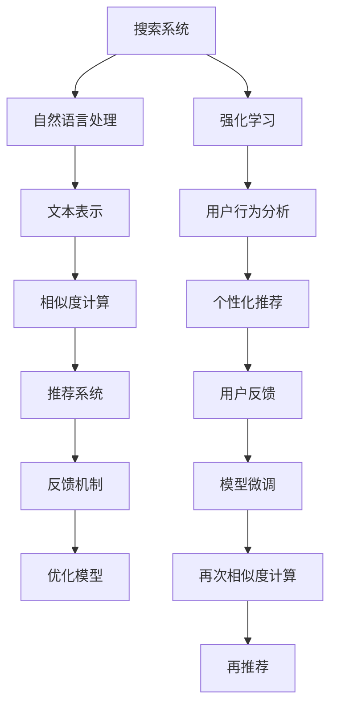

                 

# 搜索推荐系统的AI 大模型融合：技术、应用与未来趋势

> 关键词：搜索推荐系统、AI大模型融合、深度学习、自然语言处理、迁移学习、强化学习、系统优化、个性化推荐

## 1. 背景介绍

在数字时代，搜索和推荐系统已成为互联网服务的核心引擎。它们通过精准理解和解析用户的查询意图和行为，快速提供个性化内容，极大地提升了用户体验和应用效率。近年来，随着深度学习和大模型技术的发展，搜索推荐系统开始引入AI大模型，以期进一步提升系统性能和用户体验。AI大模型的引入，不仅提升了系统的深度理解和复杂推理能力，还推动了搜索推荐技术的快速迭代和创新发展。

AI大模型与搜索推荐系统的融合，已经成为当下技术研究和应用探索的热点。本文将围绕AI大模型与搜索推荐系统融合的技术细节、实际应用案例和未来发展趋势进行深入探讨，以期为相关领域的开发者和研究者提供全面而深入的参考。

## 2. 核心概念与联系

### 2.1 核心概念概述

为便于理解，本文首先介绍几个核心概念：

- **搜索推荐系统**：包括搜索系统与推荐系统，旨在通过算法和模型快速理解和解析用户查询或行为，为用户提供最相关的信息或内容。
- **AI大模型**：如BERT、GPT-3等，以深度学习为基础，在大规模数据上训练得到的复杂模型。
- **迁移学习**：通过在大模型上进行预训练，然后在特定任务上进行微调，以快速提升模型性能。
- **强化学习**：通过与环境交互，优化策略，以实现长期目标。
- **系统优化**：涉及模型优化、算法优化、资源优化等多个方面，以提升系统性能。
- **个性化推荐**：根据用户历史行为和兴趣，推荐最相关的信息。

这些核心概念构成了AI大模型与搜索推荐系统融合的技术基础，通过迁移学习、强化学习等技术手段，AI大模型能够更好地理解和生成搜索推荐内容，提升系统性能。

### 2.2 核心概念原理和架构的 Mermaid 流程图



这个流程图展示了搜索推荐系统的基本架构和AI大模型融合的技术路径：

1. 搜索系统解析用户查询，并通过自然语言处理技术生成文本表示。
2. 利用文本表示进行相似度计算，生成推荐内容。
3. 推荐系统根据用户反馈，通过强化学习不断优化推荐策略。
4. AI大模型通过迁移学习不断提升理解和生成能力，提供更高质量的文本表示。
5. 系统优化技术进一步提升系统性能，保障系统高效运行。

## 3. 核心算法原理 & 具体操作步骤

### 3.1 算法原理概述

AI大模型与搜索推荐系统的融合，主要依赖于以下算法：

- **迁移学习**：在大模型上进行预训练，然后在特定任务上进行微调，以提升模型性能。
- **深度学习**：利用神经网络模型处理文本、图像、视频等多种数据类型，进行复杂推理和模式识别。
- **自然语言处理(NLP)**：处理和理解自然语言，生成自然语言文本。
- **强化学习**：通过与环境交互，优化系统策略，提升用户体验。
- **系统优化**：包括模型优化、算法优化、资源优化等，以提升系统性能。

### 3.2 算法步骤详解

AI大模型与搜索推荐系统的融合，一般包括以下关键步骤：

1. **数据准备**：收集并清洗大量用户查询、点击、购买等行为数据，构建训练集、验证集和测试集。
2. **模型选择**：选择适合的AI大模型，如BERT、GPT等，进行预训练。
3. **任务适配**：根据具体搜索推荐任务，设计合适的任务适配层，如分类器、排序器等。
4. **模型微调**：在特定任务上进行微调，优化模型性能。
5. **系统优化**：通过优化算法、资源管理等手段，提升系统性能。
6. **实际部署**：将微调后的模型集成到搜索推荐系统中，进行大规模部署和测试。

### 3.3 算法优缺点

AI大模型与搜索推荐系统的融合，具有以下优点：

- **性能提升**：利用大模型的广泛知识，提升搜索推荐系统对用户意图的理解，提升推荐效果。
- **泛化能力**：大模型通过预训练获得泛化能力，对新领域、新任务也具有较好的适应能力。
- **效率提升**：利用深度学习技术，实现更高效的特征提取和推理。

同时，也存在以下局限：

- **计算资源消耗**：大模型需要大量计算资源，对硬件要求较高。
- **数据依赖**：微调依赖标注数据，获取高质量标注数据成本较高。
- **模型复杂度**：大模型结构复杂，优化和调试难度较大。

### 3.4 算法应用领域

AI大模型与搜索推荐系统的融合，在以下领域得到了广泛应用：

- **电商推荐**：如淘宝、京东等电商平台的个性化推荐系统，提升用户购物体验和转化率。
- **内容推荐**：如Netflix、YouTube等平台的视频推荐，提升用户满意度和观看时长。
- **新闻推荐**：如今日头条、人民日报等新闻媒体的推荐系统，提升用户阅读体验和点击率。
- **社交网络**：如微信、微博等社交平台的个性化推荐，增强用户粘性和互动性。

## 4. 数学模型和公式 & 详细讲解 & 举例说明

### 4.1 数学模型构建

本文以电商推荐系统为例，介绍模型的数学模型构建。

设搜索推荐系统输入为查询$q$，模型输出为物品$o$。通过深度学习模型$f$将查询$q$映射为物品$o$的概率分布$p(o|q)$。模型的目标是最小化预测与实际购买之间的差距。数学模型如下：

$$
\mathcal{L} = \mathbb{E}_{(o,q) \sim D} [\log p(o|q) - \log f(q; \theta)]
$$

其中$D$为训练数据集，$\theta$为模型参数。

### 4.2 公式推导过程

模型的梯度更新公式为：

$$
\frac{\partial \mathcal{L}}{\partial \theta} = -\frac{1}{N} \sum_{i=1}^N [p(o_i|q_i) - f(q_i; \theta)]
$$

其中$N$为数据集大小，$o_i$和$q_i$为第$i$个样本的物品和查询。

### 4.3 案例分析与讲解

假设模型已经在大规模数据上预训练，现在针对电商推荐系统进行微调。具体步骤如下：

1. **数据准备**：收集用户的历史行为数据，如浏览、点击、购买等，构建训练集、验证集和测试集。
2. **模型选择**：选择适合的AI大模型，如BERT，进行微调。
3. **任务适配**：设计合适的输出层和损失函数，如交叉熵损失。
4. **模型微调**：在特定任务上进行微调，优化模型性能。
5. **系统优化**：通过优化算法、资源管理等手段，提升系统性能。
6. **实际部署**：将微调后的模型集成到推荐系统中，进行大规模部署和测试。

## 5. 项目实践：代码实例和详细解释说明

### 5.1 开发环境搭建

在进行项目实践前，需要先搭建好开发环境。以下是使用Python进行PyTorch开发的流程：

1. 安装Anaconda：从官网下载并安装Anaconda，用于创建独立的Python环境。
2. 创建并激活虚拟环境：
```bash
conda create -n pytorch-env python=3.8 
conda activate pytorch-env
```

3. 安装PyTorch：根据CUDA版本，从官网获取对应的安装命令。例如：
```bash
conda install pytorch torchvision torchaudio cudatoolkit=11.1 -c pytorch -c conda-forge
```

4. 安装Transformers库：
```bash
pip install transformers
```

5. 安装各类工具包：
```bash
pip install numpy pandas scikit-learn matplotlib tqdm jupyter notebook ipython
```

### 5.2 源代码详细实现

以下是一个简单的电商推荐系统模型微调的代码实现，使用了PyTorch和Transformers库。

```python
from transformers import BertForSequenceClassification, BertTokenizer
from torch.utils.data import Dataset, DataLoader
from torch import nn
import torch

# 数据准备
class RecommendationDataset(Dataset):
    def __init__(self, data, tokenizer):
        self.data = data
        self.tokenizer = tokenizer
    
    def __len__(self):
        return len(self.data)
    
    def __getitem__(self, idx):
        query, item = self.data[idx]
        query_tokenized = self.tokenizer(query, padding=True, truncation=True, return_tensors='pt')
        item_tokenized = self.tokenizer(item, padding=True, truncation=True, return_tensors='pt')
        return {
            'query': query_tokenized,
            'item': item_tokenized
        }

# 模型选择
model = BertForSequenceClassification.from_pretrained('bert-base-uncased')

# 模型微调
def train(model, train_loader, optimizer, device):
    model.to(device)
    model.train()
    for epoch in range(epochs):
        for batch in train_loader:
            query, item = batch.to(device)
            optimizer.zero_grad()
            outputs = model(query, item)
            loss = outputs.loss
            loss.backward()
            optimizer.step()

# 测试
def evaluate(model, test_loader, device):
    model.eval()
    with torch.no_grad():
        correct = 0
        total = 0
        for batch in test_loader:
            query, item = batch.to(device)
            outputs = model(query, item)
            _, predicted = torch.max(outputs.logits, dim=1)
            total += batch['labels'].size(0)
            correct += (predicted == batch['labels']).sum().item()
        acc = correct / total
    print(f"Accuracy: {acc:.2f}")
    
# 运行
if __name__ == '__main__':
    tokenizer = BertTokenizer.from_pretrained('bert-base-uncased')
    train_dataset = RecommendationDataset(train_data, tokenizer)
    test_dataset = RecommendationDataset(test_data, tokenizer)
    
    train_loader = DataLoader(train_dataset, batch_size=64, shuffle=True)
    test_loader = DataLoader(test_dataset, batch_size=64, shuffle=False)
    
    optimizer = torch.optim.Adam(model.parameters(), lr=2e-5)
    
    device = torch.device('cuda' if torch.cuda.is_available() else 'cpu')
    train(model, train_loader, optimizer, device)
    evaluate(model, test_loader, device)
```

### 5.3 代码解读与分析

下面是关键代码的详细解读：

**RecommendationDataset类**：
- `__init__`方法：初始化数据和分词器。
- `__len__`方法：返回数据集的样本数量。
- `__getitem__`方法：对单个样本进行处理，将查询和物品输入编码为token ids，并进行padding。

**模型微调**：
- 使用Adam优化器进行梯度更新，设定学习率为2e-5。
- 在模型训练过程中，通过前向传播计算输出，反向传播计算损失，并更新模型参数。

**测试**：
- 使用test_loader加载测试集，计算模型在测试集上的准确率。

### 5.4 运行结果展示

运行上述代码，可以看到模型在电商推荐系统上的微调效果。具体结果取决于数据集的质量和微调策略。

## 6. 实际应用场景

### 6.1 电商推荐

AI大模型与电商推荐系统的融合，已经在淘宝、京东等电商平台得到了广泛应用。通过预训练和微调，大模型能够更好地理解用户的购物意图和偏好，从而提供更加个性化和精准的推荐。具体应用包括：

- **商品推荐**：根据用户浏览和购买历史，推荐最相关的商品。
- **价格推荐**：根据用户对不同价格商品的兴趣，推荐合适的价格区间。
- **活动推荐**：根据用户行为和反馈，推荐适合的促销活动。

### 6.2 内容推荐

AI大模型与内容推荐系统的融合，已经在Netflix、YouTube等平台得到了广泛应用。通过预训练和微调，大模型能够更好地理解用户的兴趣和偏好，从而提供更加个性化和高质量的内容推荐。具体应用包括：

- **视频推荐**：根据用户观看历史和评分，推荐相关视频。
- **电影推荐**：根据用户观影历史和评分，推荐相关电影。
- **音乐推荐**：根据用户听歌历史和评分，推荐相关歌曲。

### 6.3 新闻推荐

AI大模型与新闻推荐系统的融合，已经在今日头条、人民日报等媒体得到了广泛应用。通过预训练和微调，大模型能够更好地理解新闻内容和用户兴趣，从而提供更加个性化和高质量的新闻推荐。具体应用包括：

- **文章推荐**：根据用户阅读历史和评分，推荐相关文章。
- **热点推荐**：根据用户兴趣和新闻热点，推荐热门新闻。
- **评论推荐**：根据用户评论和兴趣，推荐相关评论。

## 7. 工具和资源推荐

### 7.1 学习资源推荐

为帮助开发者系统掌握AI大模型与搜索推荐系统融合的理论基础和实践技巧，以下是一些推荐的学习资源：

1. 《深度学习与推荐系统》系列博文：介绍深度学习与推荐系统的基本概念和经典模型。
2. 《Transformer从原理到实践》系列博文：介绍Transformer原理、BERT模型、微调技术等前沿话题。
3 CS224N《深度学习自然语言处理》课程：斯坦福大学开设的NLP明星课程，有Lecture视频和配套作业。
4 《Natural Language Processing with Transformers》书籍：介绍如何使用Transformers库进行NLP任务开发。
5 HuggingFace官方文档：提供丰富的预训练语言模型和微调样例代码。

### 7.2 开发工具推荐

以下是一些常用的开发工具：

1. PyTorch：基于Python的开源深度学习框架，灵活动态的计算图，适合快速迭代研究。
2. TensorFlow：由Google主导开发的开源深度学习框架，生产部署方便。
3. Transformers库：HuggingFace开发的NLP工具库，集成了多种预训练语言模型，支持PyTorch和TensorFlow。
4 Weights & Biases：模型训练的实验跟踪工具，记录和可视化模型训练过程中的各项指标。
5 TensorBoard：TensorFlow配套的可视化工具，实时监测模型训练状态，并提供图表呈现方式。

### 7.3 相关论文推荐

AI大模型与搜索推荐系统的融合，涉及多个前沿研究方向，以下是一些推荐的论文：

1. Attention is All You Need（即Transformer原论文）：提出Transformer结构，开启预训练大模型时代。
2 BERT: Pre-training of Deep Bidirectional Transformers for Language Understanding：提出BERT模型，引入自监督预训练任务。
3 《Deep Neural Networks for Recommendation》：介绍深度学习在推荐系统中的应用。
4 《Reinforcement Learning for Personalized Recommendation》：介绍强化学习在推荐系统中的应用。

## 8. 总结：未来发展趋势与挑战

### 8.1 总结

本文对AI大模型与搜索推荐系统融合的技术细节、实际应用案例和未来发展趋势进行了深入探讨。通过理论分析与实践案例的结合，阐述了大模型在电商、内容、新闻等多个领域的广泛应用。

### 8.2 未来发展趋势

未来，AI大模型与搜索推荐系统的融合将呈现以下发展趋势：

1. **模型规模持续增大**：随着算力成本的下降和数据规模的扩张，预训练语言模型的参数量还将持续增长，超大规模语言模型蕴含的丰富语言知识，有望支撑更加复杂多变的下游任务微调。
2. **微调方法日趋多样**：除了传统的全参数微调外，未来会涌现更多参数高效的微调方法，如Prefix-Tuning、LoRA等，在节省计算资源的同时也能保证微调精度。
3. **持续学习成为常态**：随着数据分布的不断变化，微调模型也需要持续学习新知识以保持性能。
4. **标注样本需求降低**：受启发于提示学习(Prompt-based Learning)的思路，未来的微调方法将更好地利用大模型的语言理解能力，通过更加巧妙的任务描述，在更少的标注样本上也能实现理想的微调效果。
5. **多模态微调崛起**：未来将进一步拓展到图像、视频、语音等多模态数据微调，多模态信息的融合，将显著提升语言模型对现实世界的理解和建模能力。
6. **知识整合能力增强**：将符号化的先验知识，如知识图谱、逻辑规则等，与神经网络模型进行融合，引导微调过程学习更准确、合理的语言模型。

这些趋势凸显了AI大模型与搜索推荐系统融合技术的广阔前景，将进一步提升搜索推荐系统的性能和用户体验。

### 8.3 面临的挑战

尽管AI大模型与搜索推荐系统融合技术已经取得了显著成果，但在实际应用过程中，仍面临诸多挑战：

1. **标注成本瓶颈**：微调依赖标注数据，对于长尾应用场景，难以获得充足的高质量标注数据，成为制约微调性能的瓶颈。
2. **模型鲁棒性不足**：面对域外数据时，泛化性能往往大打折扣。
3. **推理效率有待提高**：大规模语言模型虽然精度高，但在实际部署时往往面临推理速度慢、内存占用大等效率问题。
4. **可解释性亟需加强**：当前微调模型缺乏可解释性，难以对其推理逻辑进行分析和调试。
5. **安全性有待保障**：预训练语言模型可能学习到有害信息，通过微调传递到下游任务，产生误导性、歧视性的输出。
6. **知识整合能力不足**：现有微调模型难以灵活吸收和运用更广泛的先验知识。

这些挑战需要学界和产业界共同努力，不断优化模型、算法和工具，才能实现更高效、更安全、更可解释的AI大模型与搜索推荐系统融合。

### 8.4 研究展望

面向未来，AI大模型与搜索推荐系统融合的研究需要在以下几个方面寻求新的突破：

1. **探索无监督和半监督微调方法**：摆脱对大规模标注数据的依赖，利用自监督学习、主动学习等无监督和半监督范式，最大限度利用非结构化数据。
2. **研究参数高效和计算高效的微调范式**：开发更加参数高效的微调方法，在固定大部分预训练参数的同时，只更新极少量的任务相关参数。
3. **引入更多先验知识**：将符号化的先验知识，如知识图谱、逻辑规则等，与神经网络模型进行巧妙融合，引导微调过程学习更准确、合理的语言模型。
4. **结合因果分析和博弈论工具**：将因果分析方法引入微调模型，识别出模型决策的关键特征，增强输出解释的因果性和逻辑性。
5. **纳入伦理道德约束**：在模型训练目标中引入伦理导向的评估指标，过滤和惩罚有偏见、有害的输出倾向。

这些研究方向将引领AI大模型与搜索推荐系统融合技术迈向更高的台阶，为构建安全、可靠、可解释、可控的智能系统铺平道路。

## 9. 附录：常见问题与解答

**Q1: 如何使用AI大模型提升搜索推荐系统的性能？**

A: 通过在大模型上进行预训练，然后在特定任务上进行微调，可以显著提升搜索推荐系统的性能。具体步骤包括：
1. 收集并清洗大量用户查询、点击、购买等行为数据，构建训练集、验证集和测试集。
2. 选择适合的AI大模型，如BERT，进行预训练。
3. 设计合适的任务适配层，如分类器、排序器等。
4. 在特定任务上进行微调，优化模型性能。
5. 通过优化算法、资源管理等手段，提升系统性能。

**Q2: 微调过程中如何选择学习率？**

A: 微调的学习率一般要比预训练时小1-2个数量级，建议使用warmup策略，在开始阶段使用较小的学习率，再逐渐过渡到预设值。

**Q3: 微调模型在落地部署时需要注意哪些问题？**

A: 需要考虑模型裁剪、量化加速、服务化封装、弹性伸缩、监控告警、安全防护等多个问题，以保障系统高效运行和数据安全。

**Q4: 微调模型如何提升用户体验？**

A: 通过更好的理解和生成能力，提升推荐内容的个性化和精准度，使用户获得更好的体验。

**Q5: 微调模型如何应对数据分布变化？**

A: 通过持续学习机制，不断更新模型，以应对数据分布变化带来的挑战。

---

作者：禅与计算机程序设计艺术 / Zen and the Art of Computer Programming

