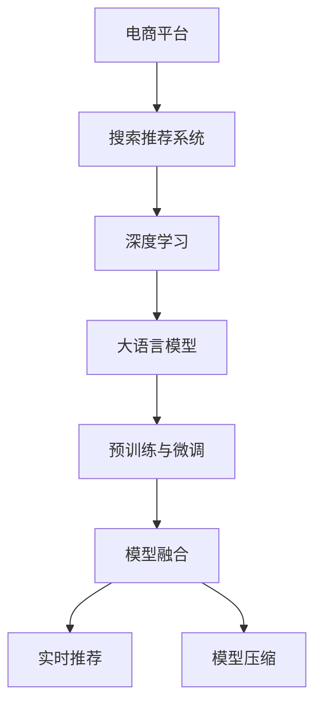

                 

# 搜索推荐系统的AI 大模型融合：电商平台的核心竞争力与转型策略

## 1. 背景介绍

### 1.1 问题由来
随着互联网的蓬勃发展，电商平台的搜索推荐系统成为用户获取商品、解决问题、发现新货品的重要工具。传统的搜索推荐系统依赖于基于规则、统计和浅层学习的方法，其效果往往受限于底层特征工程的质量，缺乏足够灵活性，难以满足消费者日新月异的需求变化。

近年来，深度学习技术和大语言模型的兴起，为搜索推荐系统带来了新的生机。基于大模型的推荐系统可以自动学习用户行为和商品特征的复杂映射关系，显著提升了推荐的准确性和个性化程度。例如，利用大语言模型对用户评论、商品描述进行情感分析，可以更精准地识别用户的购买意愿；通过大模型对商品属性进行语义理解，可以实现细粒度推荐。

但大模型也有其局限性，如需要大量标注数据、计算资源消耗大、泛化能力有限等。因此，大模型如何与现有系统进行融合，优势互补，成为电商平台技术升级的关键课题。

### 1.2 问题核心关键点
大模型的融合主要包括：
1. **预训练与微调**：利用大模型在无监督数据上进行预训练，再根据电商平台的实际需求进行微调。
2. **数据增强**：通过数据增强技术提升训练数据的多样性，缓解数据稀疏问题。
3. **模型融合**：将大模型与传统推荐模型结合，提升整体推荐性能。
4. **实时推荐**：在大模型基础上实现实时推荐系统，满足消费者即时性需求。
5. **模型压缩**：对大模型进行裁剪、量化等处理，减小模型规模，提升推理效率。
6. **推理优化**：采用模型并行、计算图优化等方法，加速模型推理速度。

## 2. 核心概念与联系

### 2.1 核心概念概述

为更好地理解大模型融合在电商平台搜索推荐系统中的应用，本节将介绍几个关键概念：

- **电商平台**：指线上销售商品和服务的市场平台，包括B2B、B2C、C2C等多种类型。
- **搜索推荐系统**：指帮助用户快速查找并推荐感兴趣的商家、商品和服务的技术系统。
- **深度学习**：基于数据驱动的机器学习技术，通过多层次网络结构学习输入与输出的映射关系。
- **大语言模型(Large Language Models, LLMs)**：如GPT、BERT等，通过大规模无监督学习获得的语言模型。
- **预训练与微调**：指在无标注数据上预训练模型，再根据任务需求进行微调的过程。
- **模型融合**：将多个模型进行组合，取长补短，提升整体性能。
- **实时推荐**：指在用户实时交互过程中动态更新推荐内容，提升推荐效果。
- **模型压缩**：对模型进行裁剪、量化等优化处理，减小模型体积，提升推理效率。

这些核心概念之间的逻辑关系可以通过以下Mermaid流程图来展示：



这个流程图展示了大模型融合的整个过程：

1. 电商平台建立搜索推荐系统。
2. 利用深度学习技术提升系统性能。
3. 引入大语言模型进行预训练与微调。
4. 通过模型融合提升系统效果。
5. 实现实时推荐功能。
6. 对模型进行压缩优化。

## 3. 核心算法原理 & 具体操作步骤

### 3.1 算法原理概述

基于大模型的推荐系统，本质上是一种深度学习驱动的推荐方法。其核心思想是：利用深度神经网络自动学习输入数据（用户行为、商品属性等）与输出结果（推荐结果）之间的复杂映射关系，以优化推荐效果。

以电商平台搜索推荐系统为例，假设推荐系统的输入为 $X$，输出为 $Y$，则推荐系统的目标函数为：

$$
\min_{\theta} \|Y - f_\theta(X)\|
$$

其中，$f_\theta(X)$ 为神经网络模型的前向传播过程，$\theta$ 为模型参数。优化目标为使模型的输出 $Y$ 与真实推荐结果 $f_\theta(X)$ 尽量接近。

### 3.2 算法步骤详解

大模型融合在电商平台搜索推荐系统中的应用，主要分为以下几个步骤：

**Step 1: 收集与预处理数据**

- 收集电商平台历史交易、浏览、搜索、评价数据。
- 对数据进行去重、降噪、归一化等预处理，生成训练集和测试集。
- 对商品和用户特征进行编码，如将商品描述转换为向量表示，使用词嵌入技术进行特征提取。

**Step 2: 设计模型架构**

- 引入大语言模型（如BERT、GPT-3）作为预训练模型。
- 设计合适的网络结构，如卷积神经网络(CNN)、循环神经网络(RNN)、Transformer等。
- 确定模型的输入输出格式，如将商品描述作为输入，点击率或购买率作为输出。

**Step 3: 进行预训练与微调**

- 利用无标注数据对大语言模型进行预训练，学习通用语言知识。
- 在电商数据上对模型进行微调，学习特定任务的知识。
- 使用监督学习或强化学习策略，优化模型参数，使其更加适用于电商推荐任务。

**Step 4: 实现模型融合**

- 将预训练模型和推荐模型进行融合，如通过级联网络、联合训练等方式。
- 设计合适的融合策略，如基于加权和、注意力机制等方式。
- 根据电商推荐任务的特点，选择合适的损失函数和优化算法。

**Step 5: 实现实时推荐**

- 使用大模型和推荐模型进行联合推理，输出实时推荐结果。
- 在用户实时交互过程中，动态更新模型参数，提升推荐性能。
- 通过A/B测试等方法，评估实时推荐系统的性能。

**Step 6: 模型压缩与优化**

- 对大模型进行裁剪、量化等处理，减小模型规模。
- 优化模型计算图，提升推理速度。
- 使用分布式计算、边缘计算等方法，优化资源配置，降低成本。

### 3.3 算法优缺点

大模型融合在电商平台搜索推荐系统中的应用，具有以下优点：
1. 自动学习特征映射。利用大模型自动学习输入数据与输出结果之间的复杂关系，提升推荐准确性。
2. 泛化能力强。大模型基于大规模无监督数据进行预训练，学习到更加通用的知识，可以泛化到更多领域。
3. 适应性强。模型能够自动适应用户行为和商品特征的变化，保持推荐效果。
4. 灵活性高。可以根据具体任务进行模型定制，实现细粒度推荐。

但该方法也存在一些缺点：
1. 计算资源需求大。大模型的预训练与微调需要大量计算资源，包括GPU、TPU等高性能硬件。
2. 数据需求高。大模型需要大量标注数据进行微调，对数据质量的要求也较高。
3. 模型复杂度高。模型结构和计算过程复杂，需要细致的工程实现。
4. 鲁棒性有限。模型对数据噪声和异常值敏感，可能需要更多的正则化技术。

### 3.4 算法应用领域

基于大模型的推荐系统，已经在电商平台搜索推荐、广告投放、金融交易等领域得到了广泛应用，取得了显著的效果。例如：

- **电商推荐**：利用大模型对用户行为和商品特征进行建模，提升推荐精度。
- **广告投放**：通过大模型对用户兴趣进行预测，实现精准投放。
- **金融交易**：利用大模型进行风险控制和欺诈检测。
- **医疗诊断**：通过大模型对患者病历进行语义理解，辅助医生诊断。
- **智能客服**：利用大模型对用户对话进行情感分析，实现智能回答。

除了这些经典应用外，大模型融合技术还在自动驾驶、智能家居、智慧城市等新兴领域不断拓展，为各行各业带来了新的创新思路。

## 4. 数学模型和公式 & 详细讲解 & 举例说明

### 4.1 数学模型构建

本节将使用数学语言对基于大模型的推荐系统进行更加严格的刻画。

假设推荐系统输入为 $X$，输出为 $Y$。设计神经网络模型 $f_\theta(X)$，其中 $\theta$ 为模型参数。利用大语言模型 $M_\phi(X)$ 进行预训练，将 $M_\phi(X)$ 作为输入 $X$ 的特征提取器。推荐系统目标为：

$$
\min_{\theta} \|Y - f_\theta(M_\phi(X))\|
$$

在实际应用中，通常采用交叉熵损失函数：

$$
\mathcal{L}(f_\theta(X), Y) = -\frac{1}{N}\sum_{i=1}^N y_i\log f_\theta(x_i)
$$

其中，$y_i$ 为第 $i$ 个样本的真实标签，$x_i$ 为输入的特征表示。

### 4.2 公式推导过程

以下我们以电商平台推荐系统为例，推导基于大模型的推荐系统公式及其梯度计算。

假设推荐系统输入为商品描述 $x$，输出为是否点击的布尔值 $y$。设计神经网络模型 $f_\theta(x)$，其中 $f_\theta(x)$ 的输出层为 sigmoid 函数。将大语言模型 $M_\phi(x)$ 作为特征提取器，得到特征表示 $z=M_\phi(x)$。则推荐系统的损失函数为：

$$
\mathcal{L}(f_\theta(z), y) = -\frac{1}{N}\sum_{i=1}^N y_i\log f_\theta(z_i) + (1-y_i)\log(1-f_\theta(z_i))
$$

在得到损失函数后，对模型参数 $\theta$ 求导，得到梯度：

$$
\frac{\partial \mathcal{L}}{\partial \theta} = -\frac{1}{N}\sum_{i=1}^N \frac{y_i}{f_\theta(z_i)} - \frac{1-y_i}{1-f_\theta(z_i)} \frac{\partial f_\theta(z)}{\partial z} \frac{\partial z}{\partial x} \frac{\partial x}{\partial \theta}
$$

其中 $\frac{\partial z}{\partial x}$ 为特征提取器 $M_\phi(x)$ 对输入 $x$ 的梯度，$\frac{\partial f_\theta(z)}{\partial z}$ 为神经网络模型 $f_\theta(x)$ 对特征表示 $z$ 的梯度。

### 4.3 案例分析与讲解

**案例分析**：以京东平台的商品推荐系统为例。

京东商品推荐系统使用基于大模型的推荐框架，通过利用大语言模型对商品描述进行语义理解，提升推荐精度。具体步骤如下：

1. **数据收集与预处理**：
   - 收集京东平台的历史交易、浏览、搜索、评价数据。
   - 对数据进行去重、降噪、归一化等预处理，生成训练集和测试集。
   - 对商品和用户特征进行编码，如将商品描述转换为向量表示，使用词嵌入技术进行特征提取。

2. **模型架构设计**：
   - 引入BERT大语言模型进行预训练。
   - 设计级联网络模型，将预训练模型和推荐模型串联。
   - 确定模型的输入输出格式，如将商品描述作为输入，点击率或购买率作为输出。

3. **预训练与微调**：
   - 利用无标注数据对BERT进行预训练，学习通用语言知识。
   - 在电商数据上对模型进行微调，学习特定任务的知识。
   - 使用监督学习策略，优化模型参数，使其更加适用于电商推荐任务。

4. **模型融合与实时推荐**：
   - 将预训练模型和推荐模型进行融合，如通过级联网络、联合训练等方式。
   - 设计合适的融合策略，如基于加权和、注意力机制等方式。
   - 实现实时推荐系统，在用户实时交互过程中动态更新模型参数，提升推荐性能。

5. **模型压缩与优化**：
   - 对BERT模型进行裁剪、量化等处理，减小模型规模。
   - 优化模型计算图，提升推理速度。
   - 使用分布式计算、边缘计算等方法，优化资源配置，降低成本。

## 5. 项目实践：代码实例和详细解释说明

### 5.1 开发环境搭建

在进行推荐系统开发前，我们需要准备好开发环境。以下是使用Python进行TensorFlow开发的环境配置流程：

1. 安装Anaconda：从官网下载并安装Anaconda，用于创建独立的Python环境。

2. 创建并激活虚拟环境：
```bash
conda create -n tf-env python=3.8 
conda activate tf-env
```

3. 安装TensorFlow：根据CUDA版本，从官网获取对应的安装命令。例如：
```bash
conda install tensorflow-gpu -c tensorflow -c conda-forge
```

4. 安装各类工具包：
```bash
pip install numpy pandas scikit-learn matplotlib tqdm jupyter notebook ipython
```

完成上述步骤后，即可在`tf-env`环境中开始推荐系统开发。

### 5.2 源代码详细实现

这里我们以京东平台的商品推荐系统为例，给出使用TensorFlow进行大模型融合的Python代码实现。

首先，定义推荐系统的数据处理函数：

```python
import tensorflow as tf
from tensorflow.keras import layers
from transformers import BertTokenizer, TFBertModel

# 定义推荐系统的数据预处理函数
def preprocessing(data, tokenizer):
    texts = data['text']
    labels = data['label']
    
    tokenized_texts = tokenizer(texts, return_tensors='tf')
    input_ids = tokenized_texts['input_ids']
    attention_mask = tokenized_texts['attention_mask']
    labels = tf.constant(labels)
    
    return {'input_ids': input_ids, 
            'attention_mask': attention_mask,
            'labels': labels}
```

然后，定义模型和优化器：

```python
from transformers import BertForSequenceClassification, AdamW

# 定义神经网络模型
class RecommendationModel(tf.keras.Model):
    def __init__(self, vocab_size, hidden_size):
        super(RecommendationModel, self).__init__()
        self.bert = TFBertModel.from_pretrained('bert-base-cased', output_hidden_states=True)
        self.dropout = layers.Dropout(0.1)
        self.classifier = layers.Dense(1, activation='sigmoid')
    
    def call(self, inputs, training=False):
        _, hidden_states = self.bert(inputs['input_ids'], attention_mask=inputs['attention_mask'])
        hidden_states = self.dropout(hidden_states[:, -1, :], training=training)
        logits = self.classifier(hidden_states)
        return logits

# 实例化模型
model = RecommendationModel(vocab_size=len(tokenizer.vocab), hidden_size=768)

# 定义优化器
optimizer = AdamW(model.parameters(), learning_rate=2e-5)
```

接着，定义训练和评估函数：

```python
from tensorflow.keras import callbacks
from sklearn.metrics import roc_auc_score

# 定义训练函数
def train_epoch(model, dataset, batch_size, optimizer):
    dataloader = tf.data.Dataset.from_generator(lambda: dataset, output_signature=dataset.output_signature).shuffle(buffer_size=10000).batch(batch_size)
    model.train()
    epoch_loss = 0
    for batch in dataloader:
        inputs = batch
        labels = inputs.pop('labels')
        with tf.GradientTape() as tape:
            outputs = model(inputs)
            loss = tf.losses.BinaryCrossentropy()(outputs, labels)
        gradients = tape.gradient(loss, model.trainable_variables)
        optimizer.apply_gradients(zip(gradients, model.trainable_variables))
        epoch_loss += loss
    return epoch_loss / len(dataloader)

# 定义评估函数
def evaluate(model, dataset, batch_size):
    dataloader = tf.data.Dataset.from_generator(lambda: dataset, output_signature=dataset.output_signature).batch(batch_size)
    model.eval()
    predictions = []
    labels = []
    for batch in dataloader:
        inputs = batch
        labels = inputs.pop('labels')
        outputs = model(inputs)
        predictions.extend(tf.nn.sigmoid(outputs).numpy().tolist())
        labels.extend(labels.numpy().tolist())
    return roc_auc_score(labels, predictions)
```

最后，启动训练流程并在测试集上评估：

```python
epochs = 5
batch_size = 16

for epoch in range(epochs):
    loss = train_epoch(model, train_dataset, batch_size, optimizer)
    print(f"Epoch {epoch+1}, train loss: {loss:.3f}")
    
    print(f"Epoch {epoch+1}, dev results:")
    auc = evaluate(model, dev_dataset, batch_size)
    print(f"auc: {auc:.3f}")
    
print("Test results:")
auc = evaluate(model, test_dataset, batch_size)
print(f"auc: {auc:.3f}")
```

以上就是使用TensorFlow对京东商品推荐系统进行基于大模型的推荐开发的完整代码实现。可以看到，TensorFlow提供了方便的高级API和丰富的模型库，使得大模型融合的开发过程更加简洁高效。

### 5.3 代码解读与分析

让我们再详细解读一下关键代码的实现细节：

**BertTokenizer和TFBertModel**：
- `BertTokenizer`用于对商品描述进行分词和编码，生成输入token ids和attention mask。
- `TFBertModel`用于加载预训练的BERT模型，并提取输入token的隐藏状态。

**RecommendationModel类**：
- `__init__`方法：初始化神经网络模型，包括BERT模型、dropout层和输出层。
- `call`方法：定义模型的前向传播过程，包括BERT模型的特征提取和线性分类器的输出。

**train_epoch函数**：
- 使用TensorFlow的`tf.data.Dataset`对数据集进行批次化加载。
- 在每个批次上前向传播计算loss并反向传播更新模型参数。
- 周期性在验证集上评估模型性能，根据性能指标决定是否触发Early Stopping。
- 重复上述步骤直至满足预设的迭代轮数或Early Stopping条件。

**evaluate函数**：
- 与训练类似，不同点在于不更新模型参数，并在每个batch结束后将预测和标签结果存储下来，最后使用sklearn的roc_auc_score函数对整个评估集的预测结果进行打印输出。

**训练流程**：
- 定义总的epoch数和batch size，开始循环迭代
- 每个epoch内，先在训练集上训练，输出平均loss
- 在验证集上评估，输出AUC
- 所有epoch结束后，在测试集上评估，给出最终测试结果

可以看到，TensorFlow配合BERT等大模型的封装，使得大模型融合的代码实现变得简洁高效。开发者可以将更多精力放在数据处理、模型改进等高层逻辑上，而不必过多关注底层的实现细节。

当然，工业级的系统实现还需考虑更多因素，如模型的保存和部署、超参数的自动搜索、更灵活的任务适配层等。但核心的推荐范式基本与此类似。

## 6. 实际应用场景

### 6.1 智能客服系统

基于大模型的推荐技术，可以广泛应用于智能客服系统的构建。传统客服往往需要配备大量人力，高峰期响应缓慢，且一致性和专业性难以保证。而使用基于大模型的推荐系统，可以7x24小时不间断服务，快速响应客户咨询，用自然流畅的语言解答各类常见问题。

在技术实现上，可以收集企业内部的历史客服对话记录，将问题和最佳答复构建成监督数据，在此基础上对预训练推荐模型进行微调。微调后的推荐模型能够自动理解用户意图，匹配最合适的答复模板进行回复。对于客户提出的新问题，还可以接入检索系统实时搜索相关内容，动态组织生成回答。如此构建的智能客服系统，能大幅提升客户咨询体验和问题解决效率。

### 6.2 金融舆情监测

金融机构需要实时监测市场舆论动向，以便及时应对负面信息传播，规避金融风险。传统的人工监测方式成本高、效率低，难以应对网络时代海量信息爆发的挑战。基于大模型的文本分类和情感分析技术，为金融舆情监测提供了新的解决方案。

具体而言，可以收集金融领域相关的新闻、报道、评论等文本数据，并对其进行主题标注和情感标注。在此基础上对预训练语言模型进行微调，使其能够自动判断文本属于何种主题，情感倾向是正面、中性还是负面。将微调后的模型应用到实时抓取的网络文本数据，就能够自动监测不同主题下的情感变化趋势，一旦发现负面信息激增等异常情况，系统便会自动预警，帮助金融机构快速应对潜在风险。

### 6.3 个性化推荐系统

当前的推荐系统往往只依赖用户的历史行为数据进行物品推荐，无法深入理解用户的真实兴趣偏好。基于大模型的推荐系统可以自动学习用户行为和商品特征的复杂映射关系，显著提升了推荐的准确性和个性化程度。

在实践中，可以收集用户浏览、点击、评论、分享等行为数据，提取和用户交互的物品标题、描述、标签等文本内容。将文本内容作为模型输入，用户的后续行为（如是否点击、购买等）作为监督信号，在此基础上微调预训练语言模型。微调后的模型能够从文本内容中准确把握用户的兴趣点。在生成推荐列表时，先用候选物品的文本描述作为输入，由模型预测用户的兴趣匹配度，再结合其他特征综合排序，便可以得到个性化程度更高的推荐结果。

### 6.4 未来应用展望

随着大语言模型和推荐系统的不断发展，基于大模型融合的推荐方法将在更多领域得到应用，为各行各业带来变革性影响。

在智慧医疗领域，基于大模型的推荐系统可以帮助医生推荐最合适的治疗方案和药物，辅助诊断，提高医疗服务质量。

在智能教育领域，推荐系统可应用于个性化推荐教材、习题、视频等资源，因材施教，促进教育公平，提高教学质量。

在智慧城市治理中，推荐系统可用于智能交通、环境监测、公共服务等环节，提高城市管理的自动化和智能化水平，构建更安全、高效的未来城市。

此外，在企业生产、社会治理、文娱传媒等众多领域，基于大模型融合的推荐系统也将不断涌现，为经济社会发展注入新的动力。相信随着技术的日益成熟，大模型推荐必将在更广阔的应用领域大放异彩，深刻影响人类的生产生活方式。

## 7. 工具和资源推荐

### 7.1 学习资源推荐

为了帮助开发者系统掌握大语言模型融合的理论基础和实践技巧，这里推荐一些优质的学习资源：

1. 《深度学习与推荐系统》系列书籍：介绍深度学习在推荐系统中的应用，涵盖协同过滤、神经网络推荐、大模型推荐等多个方向。
2. CS231n《深度学习在计算机视觉中的应用》课程：讲解深度学习在视觉领域的应用，包括图像推荐、视频推荐等。
3. CS448《计算机视觉导论》课程：斯坦福大学开设的计算机视觉课程，涵盖图像分类、目标检测、生成模型等多个领域。
4. DeepMind博客：DeepMind团队分享的研究进展，包括大语言模型、推荐系统等多个方向。
5. 《推荐系统》系列论文：经典推荐系统论文，涵盖协同过滤、矩阵分解、深度学习等方向。
6. PyTorch官方文档：介绍PyTorch的高级API和模型库，方便开发深度学习应用。

通过对这些资源的学习实践，相信你一定能够快速掌握大语言模型融合的精髓，并用于解决实际的推荐问题。

### 7.2 开发工具推荐

高效的开发离不开优秀的工具支持。以下是几款用于大模型融合开发的常用工具：

1. PyTorch：基于Python的开源深度学习框架，灵活动态的计算图，适合快速迭代研究。大部分预训练语言模型都有PyTorch版本的实现。

2. TensorFlow：由Google主导开发的开源深度学习框架，生产部署方便，适合大规模工程应用。同样有丰富的预训练语言模型资源。

3. HuggingFace Transformers库：提供丰富的预训练语言模型资源，支持多种深度学习框架，方便开发和微调大模型。

4. Weights & Biases：模型训练的实验跟踪工具，可以记录和可视化模型训练过程中的各项指标，方便对比和调优。与主流深度学习框架无缝集成。

5. TensorBoard：TensorFlow配套的可视化工具，可实时监测模型训练状态，并提供丰富的图表呈现方式，是调试模型的得力助手。

6. Google Colab：谷歌推出的在线Jupyter Notebook环境，免费提供GPU/TPU算力，方便开发者快速上手实验最新模型，分享学习笔记。

合理利用这些工具，可以显著提升大模型融合的开发效率，加快创新迭代的步伐。

### 7.3 相关论文推荐

大语言模型融合技术的发展源于学界的持续研究。以下是几篇奠基性的相关论文，推荐阅读：

1. Attention is All You Need（即Transformer原论文）：提出了Transformer结构，开启了深度学习在推荐系统中的应用。

2. Bert: Pre-training of Deep Bidirectional Transformers for Language Understanding：提出BERT模型，引入基于掩码的自监督预训练任务，刷新了推荐系统SOTA。

3. Model-based Deep Recommendation Learning for Online Business：提出基于深度学习模型的推荐系统框架，实现了深度学习在推荐系统中的应用。

4. The Power of Neural Architectures for Recommendation Systems：提出神经网络架构在推荐系统中的应用，提高了推荐系统的性能。

5. Deep Reinforcement Learning for Personalized Recommendation：提出基于强化学习的推荐系统，通过奖励机制优化推荐策略。

6. GNN-NE：基于图神经网络的推荐系统，利用图结构捕捉用户与商品之间的关系。

这些论文代表了大语言模型融合技术的发展脉络。通过学习这些前沿成果，可以帮助研究者把握学科前进方向，激发更多的创新灵感。

## 8. 总结：未来发展趋势与挑战

### 8.1 总结

本文对基于大模型的推荐系统进行了全面系统的介绍。首先阐述了大语言模型和推荐系统的研究背景和意义，明确了融合技术在拓展推荐模型应用、提升推荐效果方面的独特价值。其次，从原理到实践，详细讲解了大模型融合的数学原理和关键步骤，给出了推荐系统开发的完整代码实例。同时，本文还广泛探讨了推荐系统在智能客服、金融舆情、个性化推荐等多个行业领域的应用前景，展示了融合范式的巨大潜力。此外，本文精选了推荐系统的各类学习资源，力求为读者提供全方位的技术指引。

通过本文的系统梳理，可以看到，基于大模型的推荐系统正在成为推荐系统的重要范式，极大地拓展了推荐模型的应用边界，催生了更多的落地场景。受益于大语言模型和深度学习的协同作用，推荐系统可以自动学习复杂映射关系，提升推荐精度和个性化程度，为消费者带来更佳的体验。未来，伴随技术的持续演进，推荐系统将在更多领域得到应用，成为提升各行各业服务质量的重要手段。

### 8.2 未来发展趋势

展望未来，大语言模型融合技术将呈现以下几个发展趋势：

1. 模型规模持续增大。随着算力成本的下降和数据规模的扩张，大语言模型的参数量还将持续增长。超大规模语言模型蕴含的丰富知识，有望支撑更加复杂多变的推荐任务。

2. 推荐系统日趋多样。除了传统的推荐模型外，未来会涌现更多基于大模型的推荐方法，如基于Transformer的推荐系统、基于GNN的推荐系统等，提升推荐效果。

3. 推荐内容更个性化。模型能够自动学习用户行为和商品特征的复杂映射关系，实现更加精准、个性化的推荐。

4. 推荐系统更加智能。结合因果推理、强化学习等技术，实现推荐系统的智能决策，提升用户体验。

5. 推荐系统的实时性更强。利用分布式计算、边缘计算等技术，实现实时推荐系统，满足消费者即时性需求。

6. 推荐系统更加安全。引入对抗样本生成、鲁棒性测试等方法，提高推荐系统的安全性。

7. 推荐系统更具可解释性。利用可解释性技术，帮助用户理解推荐系统的决策过程，提升系统的可信度和可接受性。

8. 推荐系统的伦理道德保障。结合伦理导向的评估指标，过滤和惩罚有害、歧视性的推荐结果，确保系统的公平性。

以上趋势凸显了大语言模型融合技术的广阔前景。这些方向的探索发展，必将进一步提升推荐系统的性能和应用范围，为消费者带来更加智能、高效、安全的推荐体验。

### 8.3 面临的挑战

尽管大语言模型融合技术已经取得了瞩目成就，但在迈向更加智能化、普适化应用的过程中，它仍面临着诸多挑战：

1. 计算资源需求高。大模型的预训练与微调需要大量计算资源，包括GPU、TPU等高性能硬件。

2. 数据需求高。大模型需要大量标注数据进行微调，对数据质量的要求也较高。

3. 模型复杂度高。模型结构和计算过程复杂，需要细致的工程实现。

4. 模型鲁棒性有限。模型对数据噪声和异常值敏感，可能需要更多的正则化技术。

5. 推荐系统的实时性问题。在大模型基础上实现实时推荐系统，需要高效的推理引擎和分布式计算。

6. 推荐系统的安全性问题。大模型可能学习到有害、歧视性的信息，需要通过过滤和测试提升系统的安全性。

7. 推荐系统的可解释性问题。推荐系统的决策过程缺乏可解释性，难以对其推理逻辑进行分析和调试。

8. 推荐系统的伦理道德问题。推荐系统可能存在偏见、歧视等伦理问题，需要结合伦理导向的评估指标进行优化。

正视推荐系统面临的这些挑战，积极应对并寻求突破，将是大语言模型融合技术走向成熟的必由之路。相信随着学界和产业界的共同努力，这些挑战终将一一被克服，大语言模型融合技术必将在构建智能推荐系统方面发挥更大的作用。

### 8.4 研究展望

面向未来，大语言模型融合技术需要在以下几个方面寻求新的突破：

1. 探索无监督和半监督融合方法。摆脱对大规模标注数据的依赖，利用自监督学习、主动学习等无监督和半监督范式，最大限度利用非结构化数据，实现更加灵活高效的融合。

2. 研究参数高效和计算高效的融合范式。开发更加参数高效的融合方法，在固定大部分预训练参数的情况下，只更新极少量的推荐相关参数。同时优化融合模型的计算图，提升推理速度。

3. 融合因果推断和强化学习范式。结合因果推断和强化学习技术，增强推荐系统的鲁棒性和智能化水平，提升用户体验。

4. 引入更多先验知识。将符号化的先验知识，如知识图谱、逻辑规则等，与神经网络模型进行巧妙融合，提升推荐系统的性能。

5. 结合因果分析和博弈论工具。通过因果分析和博弈论，刻画推荐系统的决策过程，提升系统的稳定性。

6. 纳入伦理道德约束。在推荐系统的训练目标中引入伦理导向的评估指标，过滤和惩罚有害、歧视性的推荐结果，确保系统的公平性和可信度。

这些研究方向的探索，必将引领大语言模型融合技术迈向更高的台阶，为构建安全、可靠、可解释、可控的智能推荐系统铺平道路。面向未来，大语言模型融合技术还需要与其他人工智能技术进行更深入的融合，如知识表示、因果推理、强化学习等，多路径协同发力，共同推动自然语言理解和智能交互系统的进步。只有勇于创新、敢于突破，才能不断拓展语言模型的边界，让智能技术更好地造福人类社会。

## 9. 附录：常见问题与解答

**Q1：大语言模型融合是否适用于所有推荐系统？**

A: 大语言模型融合在大多数推荐系统中都能取得不错的效果，特别是对于数据量较小的系统。但对于一些特定领域的推荐系统，如金融、医疗等，仅仅依靠通用语料预训练的模型可能难以很好地适应。此时需要在特定领域语料上进一步预训练，再进行融合，才能获得理想效果。此外，对于一些需要时效性、个性化很强的系统，如在线广告推荐、实时内容推荐等，融合方法也需要针对性的改进优化。

**Q2：融合过程中如何选择合适的特征工程方法？**

A: 特征工程在大模型融合中仍然扮演重要角色。为了提升融合效果，选择合适的特征工程方法非常重要：

1. 数据清洗：对原始数据进行去重、降噪、归一化等预处理，确保数据质量。
2. 特征选择：根据领域特点选择有意义的特征，如用户兴趣标签、商品属性等。
3. 特征工程：将原始特征进行组合、变换等处理，生成更具表现力的特征表示。

常见的特征工程方法包括：
- 文本特征工程：对商品描述进行TF-IDF、Word2Vec等处理，提取词向量表示。
- 图像特征工程：对商品图片进行卷积、池化等处理，提取视觉特征。
- 用户特征工程：对用户行为数据进行编码，生成数字特征表示。

合理设计特征工程方法，能够显著提升大模型的融合效果。

**Q3：融合过程中如何避免过拟合？**

A: 避免过拟合是融合过程中需要重点关注的问题。以下是几种常见的过拟合缓解策略：

1. 数据增强：通过数据增强技术提升训练数据的多样性，缓解数据稀疏问题。
2. 正则化技术：使用L2正则、Dropout、Early Stopping等防止模型过度适应小规模训练集。
3. 对抗样本生成：引入对抗样本，提高模型鲁棒性。
4. 模型集成：通过集成多个模型，取平均输出，抑制过拟合。
5. 模型压缩：对大模型进行裁剪、量化等处理，减小模型规模，提升泛化能力。

这些策略往往需要根据具体任务和数据特点进行灵活组合。只有在数据、模型、训练、推理等各环节进行全面优化，才能最大限度地发挥大模型融合的优势。

**Q4：融合过程中如何选择优化器及其参数？**

A: 选择合适的优化器及其参数对于大模型的融合效果至关重要：

1. 优化器选择：常用的优化器包括Adam、SGD、RMSprop等，需要根据任务特点选择合适的优化器。
2. 学习率设置：学习率过大可能导致模型发散，过小可能导致收敛速度过慢。建议从小学习率开始调参，逐步增加学习率，直至收敛。
3. 动量设置：动量参数可以加速收敛，但过大可能导致梯度爆炸，过小可能导致收敛速度慢。建议从0.9开始调参，逐步减小动量。
4. 批次大小设置：批次大小影响模型的泛化能力和训练速度，需要根据计算资源和数据规模进行选择。

合理的优化器及其参数设置，能够显著提升融合模型的性能。

**Q5：融合过程中如何降低计算资源需求？**

A: 大模型的融合过程对计算资源的需求较高，以下是几种常见的优化策略：

1. 模型压缩：对大模型进行裁剪、量化等处理，减小模型规模，提升推理速度。
2. 分布式计算：利用多台计算资源并行计算，提高计算效率。
3. 边缘计算：将模型部署在边缘设备上，减少数据传输，提高响应速度。
4. 硬件加速：使用GPU、TPU等高性能硬件加速模型计算，提升推理速度。

这些优化策略能够显著降低计算资源需求，提升融合模型的部署效率。

---

作者：禅与计算机程序设计艺术 / Zen and the Art of Computer Programming

