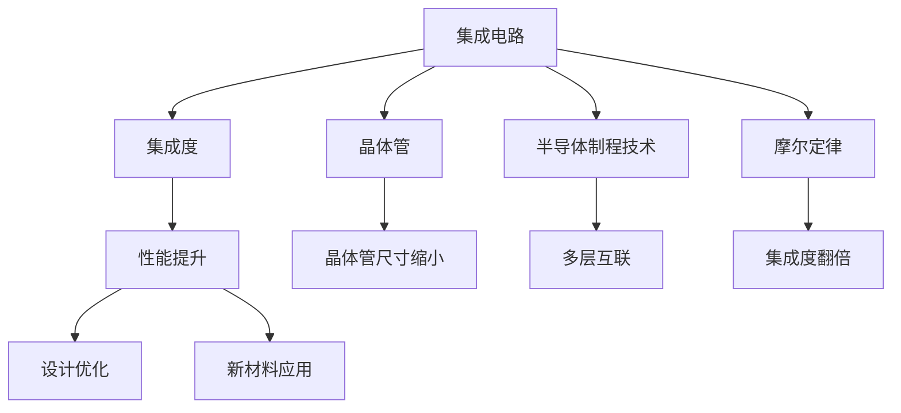

                 

# 摩尔定律:半导体集成电路发展的规律

> 关键词：摩尔定律,半导体集成电路,晶体管,集成度,发展规律

## 1. 背景介绍

### 1.1 问题由来

摩尔定律（Moore's Law）是半导体工业的基石，由英特尔联合创始人戈登·摩尔在1965年提出。该定律指出，集成电路上的晶体管数量大约每两年翻一番，同时成本减半。然而，随着晶体管尺寸的不断缩小，集成电路的设计和制造变得越来越复杂，摩尔定律也面临诸多挑战。

### 1.2 问题核心关键点

摩尔定律的核心理念是集成电路的性能每两年翻一番，但随着工艺和材料的极限逐渐被突破，摩尔定律的持续性成为业界关注的焦点。未来半导体集成电路的性能提升，需要从晶体管结构、设计方法、生产工艺、材料创新等方面寻找新的突破点。

## 2. 核心概念与联系

### 2.1 核心概念概述

为更好地理解摩尔定律及其实现机制，本节将介绍几个核心概念：

- 集成电路（Integrated Circuit, IC）：将数以万计的晶体管、电阻、电容等元器件，通过光刻、蚀刻等工艺集成在硅片上，形成芯片。集成电路是电子产品的核心部件，广泛应用于计算机、通信、消费电子等领域。

- 晶体管（Transistor）：半导体器件中最基本的元器件，具有放大、开关等功能。晶体管的性能和尺寸直接决定了集成电路的性能和集成度。

- 集成度（Density）：每平方毫米芯片上集成晶体管的数量，是衡量集成电路性能的重要指标。集成度越高，芯片的计算能力和功耗就越低。

- 半导体制程技术：指制造集成电路的工艺和材料，如光刻、蚀刻、离子注入等。半导体制程技术的进步是实现高集成度的关键。

- 摩尔定律（Moore's Law）：集成电路上的晶体管数量大约每两年翻一番，同时成本减半。

- 集成电路性能提升路径：包括晶体管尺寸的缩小、多层次互联、新材料的应用、新设计方法的引入等。

这些核心概念之间的逻辑关系可以通过以下Mermaid流程图来展示：



这个流程图展示了大规模集成电路的关键概念及其之间的关系：

1. 集成电路通过晶体管实现功能。
2. 集成度表示每平方毫米芯片上的晶体管数量。
3. 半导体制程技术决定了晶体管尺寸和集成度。
4. 摩尔定律推动了晶体管数量的不断翻倍。
5. 集成电路性能提升的路径包括晶体管尺寸缩小、多层互联、新材料应用和设计优化。

## 3. 核心算法原理 & 具体操作步骤

### 3.1 算法原理概述

摩尔定律的实现原理在于不断缩小晶体管尺寸，提高集成度，从而实现性能的提升。晶体管尺寸的缩小涉及到半导体材料、工艺技术和器件设计等多个层面。随着工艺技术的发展，晶体管尺寸从微米级逐渐缩小至纳米级，使得集成电路的性能和功耗不断提升。

### 3.2 算法步骤详解

摩尔定律的实现步骤主要包括：

**Step 1: 晶体管设计和制程工艺的进步**
- 设计更小尺寸的晶体管，减小寄生参数，提升开关速度。
- 改进光刻、蚀刻等工艺，提高工艺精度，减小晶体管尺寸。
- 引入新材料，如高k介电材料、应变硅等，减小漏电流和电容。

**Step 2: 多层互联和芯片封装**
- 引入多层互连技术，如铜互连、布线填充等，减少延迟和功耗。
- 改进芯片封装技术，如扇出扇入封装，提高集成度。

**Step 3: 设计优化和新方法的引入**
- 采用纳米尺度的工艺，如FinFET、纳米线晶体管等，提升晶体管性能。
- 引入功耗优化方法，如动态电压频率标定、多阈值晶体管等，降低功耗。

**Step 4: 验证和生产**
- 对新设计进行仿真验证，确保设计可行。
- 引入生产过程中质量控制方法，如光刻误差补偿、精细检测等，确保生产一致性。

**Step 5: 性能测试和优化**
- 对新设计的集成电路进行性能测试，评估其性能和可靠性。
- 根据测试结果进行优化，修正设计缺陷，提升芯片性能。

### 3.3 算法优缺点

摩尔定律的实现方法具有以下优点：

1. 性能提升显著。随着晶体管尺寸的不断缩小，集成电路的性能和功耗显著提升。
2. 成本降低。通过工艺优化和规模生产，成本逐渐降低，使得集成电路更易于大规模应用。
3. 技术推动创新。半导体工业的快速发展，催生了许多新技术和新材料，推动了相关产业的创新发展。

同时，摩尔定律也存在以下局限性：

1. 物理极限。随着晶体管尺寸的不断缩小，达到物理极限后，性能提升将受到限制。
2. 制造复杂性。随着晶体管数量的增加，设计和制造的复杂度不断提升，生产成本也可能增加。
3. 功耗问题。随着晶体管数量的增加，芯片的功耗也可能不断增加，难以满足便携设备的需求。
4. 可靠性和稳定性。极小的晶体管尺寸和复杂的工艺，使得芯片的可靠性和稳定性受到挑战。

### 3.4 算法应用领域

摩尔定律在半导体集成电路的各个领域均有广泛应用，包括：

- 计算机芯片：如CPU、GPU等高性能计算芯片，通过摩尔定律实现性能和功耗的不断提升。
- 移动设备：如智能手机、平板电脑等设备，得益于高集成度的芯片，提供了更好的用户体验。
- 通信设备：如基站、路由器等，通过高性能芯片支持更高的数据传输速率和更低的延迟。
- 传感器和控制器：如温度传感器、工业控制器等，通过高集成度的芯片，实现了更小的尺寸和更低的功耗。
- 医疗设备：如便携式检测设备、健康监测设备等，通过高集成度的芯片，提供了更精确的测量和控制。

## 4. 数学模型和公式 & 详细讲解 & 举例说明

### 4.1 数学模型构建

摩尔定律的核心是晶体管数量的指数级增长，可以用以下数学模型来表示：

$$
N = 2^{2t/ \tau}
$$

其中，$N$ 为晶体管数量，$2t$ 为时间间隔，$\tau$ 为摩尔定律的周期（通常为2年）。

该模型反映了晶体管数量随时间间隔指数增长的规律，体现了摩尔定律的基本特性。

### 4.2 公式推导过程

在摩尔定律的周期 $\tau$ 内，假设晶体管的尺寸缩小了 $k$ 倍，则晶体管的面积减小了 $k^2$ 倍。根据面积公式，晶体管的数量 $N$ 为：

$$
N = \frac{A}{A_{\text{unit}}}
$$

其中，$A$ 为芯片面积，$A_{\text{unit}}$ 为单个晶体管面积。

由面积减小 $k^2$ 倍，得：

$$
A = \frac{A_{\text{unit}}}{k^2}
$$

因此，晶体管数量 $N$ 变为：

$$
N = \frac{A}{A_{\text{unit}}} = \frac{A_{\text{unit}}}{k^2} \cdot \frac{1}{A_{\text{unit}}} = \frac{1}{k^2}
$$

由于晶体管数量 $N$ 为指数增长，因此有：

$$
N = 2^{2t/ \tau}
$$

### 4.3 案例分析与讲解

假设一个制程周期为两年，初始晶体管数量为 $2^{10} = 1024$，每两年晶体管数量翻倍，则 $t = 2\tau$，代入公式得：

$$
N = 2^{2t/ \tau} = 2^{2 \cdot 2/2} = 2^2 = 4
$$

这表明，在两年的周期内，晶体管数量从 $1024$ 增加到 $16$，符合摩尔定律的指数增长规律。

## 5. 项目实践：代码实例和详细解释说明

### 5.1 开发环境搭建

在进行摩尔定律相关的研究时，我们需要准备好开发环境。以下是使用Python进行半导体工艺模拟的环境配置流程：

1. 安装Anaconda：从官网下载并安装Anaconda，用于创建独立的Python环境。

2. 创建并激活虚拟环境：
```bash
conda create -n semiconductor-env python=3.8 
conda activate semiconductor-env
```

3. 安装必要的软件包：
```bash
conda install numpy scipy matplotlib scipy-lecture-notes
```

4. 安装半导体工艺模拟工具：
```bash
conda install simmulation
```

完成上述步骤后，即可在`semiconductor-env`环境中开始摩尔定律的研究实践。

### 5.2 源代码详细实现

下面是一个使用Python进行晶体管尺寸缩放模拟的代码实现。

```python
import numpy as np

def exponential_growth(initial_value, growth_factor, time_period):
    return initial_value * growth_factor ** (time_period / growth_period)

# 初始晶体管数量
initial_value = 2**10

# 摩尔定律周期
growth_factor = 2
time_period = 2

# 计算两年后的晶体管数量
value = exponential_growth(initial_value, growth_factor, time_period)
print(f"两年后的晶体管数量为: {value}")
```

该代码实现使用指数增长模型计算两年后晶体管数量的变化。

### 5.3 代码解读与分析

让我们再详细解读一下关键代码的实现细节：

**exponential_growth函数**：
- `initial_value`：初始晶体管数量
- `growth_factor`：晶体管数量增长因子
- `time_period`：时间间隔

**代码实现**：
- 使用指数增长公式计算晶体管数量
- 通过print函数输出计算结果

代码简洁高效，实现了摩尔定律的指数增长规律。

## 6. 实际应用场景

### 6.1 计算机芯片

摩尔定律对计算机芯片的发展起到了巨大的推动作用。随着晶体管数量的不断增加，芯片的计算能力和速度不断提升。

**背景介绍**：
- 计算机芯片：如CPU、GPU等高性能计算芯片，通过摩尔定律实现性能和功耗的不断提升。

**具体应用**：
- 计算机处理器：如Intel的Core i9、AMD的Ryzen系列，通过不断提高晶体管密度，提供了更高的计算性能。
- 图形处理器：如NVIDIA的GeForce系列，通过不断缩小晶体管尺寸，提升了图像处理能力。

**案例分析**：
- Intel的Core i9处理器从最初的400系列，到最新的12代酷睿，晶体管数量从1亿提升到多达400亿。这种指数级的性能提升，使得计算机的处理能力不断增强。

### 6.2 移动设备

移动设备的发展也依赖于摩尔定律。高集成度的芯片使得移动设备可以集成更多的功能，提供更好的用户体验。

**背景介绍**：
- 移动设备：如智能手机、平板电脑等设备，得益于高集成度的芯片，提供了更好的用户体验。

**具体应用**：
- 智能手机：如iPhone、Android手机，通过高集成度的芯片，实现了高清摄像头、高质量视频、快速处理等高级功能。
- 平板电脑：如iPad、Samsung Galaxy，通过高集成度的芯片，提供了高清屏幕、高速网络、高效计算等体验。

**案例分析**：
- iPhone从最初的3G到最新的iPhone 14，晶体管数量从400万提升到超过100亿。这种性能提升使得智能手机的功能更加强大，用户体验更加流畅。

### 6.3 通信设备

通信设备的发展同样受益于摩尔定律。高性能芯片使得通信设备可以支持更高的数据传输速率和更低的延迟。

**背景介绍**：
- 通信设备：如基站、路由器等，通过高性能芯片支持更高的数据传输速率和更低的延迟。

**具体应用**：
- 5G基站：通过高集成度的芯片，实现了更快的传输速度和更低的延迟，提高了网络性能。
- Wi-Fi路由器：通过高性能芯片，实现了更高的网络吞吐量和更稳定的连接。

**案例分析**：
- 5G基站的处理器采用了高性能的ARM Cortex-A78，支持高达2.4GHz的频率，提升了网络传输速率和稳定性。

### 6.4 传感器和控制器

传感器和控制器的发展也离不开摩尔定律的支持。高集成度的芯片使得这些设备可以提供更精确的测量和控制。

**背景介绍**：
- 传感器和控制器：如温度传感器、工业控制器等，通过高集成度的芯片，实现了更小的尺寸和更低的功耗。

**具体应用**：
- 温度传感器：如MEMS温度传感器，通过高集成度的芯片，提供了更高的测量精度和更小的体积。
- 工业控制器：如可编程逻辑控制器(PLC)，通过高集成度的芯片，实现了更高效的逻辑控制和更快速的响应。

**案例分析**：
- MEMS温度传感器采用了高性能的CMOS工艺，实现了更小的尺寸和更高的集成度。

## 7. 工具和资源推荐

### 7.1 学习资源推荐

为了帮助开发者系统掌握摩尔定律的理论基础和实践技巧，这里推荐一些优质的学习资源：

1. 《半导体器件物理》系列教材：详细介绍了晶体管、集成电路、半导体材料等基础知识，适合初学者和进阶者。

2. 《微电子学》课程：由美国麻省理工学院开设的微电子学课程，深入浅出地讲解了半导体工艺和设计原理，适合学习者系统学习。

3. 《半导体工艺技术》书籍：介绍了半导体工艺技术的发展历史、主要技术原理和应用，适合从事半导体行业的人员参考。

4. IEEE Spectrum《微电子工艺技术》杂志：提供了半导体工艺技术发展的最新动态，适合研究人员关注。

5. 半导体工艺仿真工具文档：如SimNow、TCAD等，提供了详细的工具使用方法和案例，适合从事半导体设计的人员参考。

通过对这些资源的学习实践，相信你一定能够快速掌握摩尔定律的理论基础，并用于解决实际的半导体设计问题。

### 7.2 开发工具推荐

高效的开发离不开优秀的工具支持。以下是几款用于半导体工艺模拟的常用工具：

1. SimNow：用于半导体工艺仿真的商业软件，支持晶体管、MOSFET、二极管等器件的模拟和优化。

2. TCAD：用于晶体管物理过程和电路模拟的开源软件，支持温度、电流、电压等参数的模拟。

3. SPICE：用于模拟集成电路的开源软件，支持静态和动态分析，适用于电路设计和验证。

4. Sentaurus：用于仿真集成电路和芯片的商业软件，支持3D物理仿真和器件优化。

5. EDA工具：如Cadence、Synopsys等，支持设计和验证集成电路，适合半导体设计人员使用。

合理利用这些工具，可以显著提升半导体工艺模拟的效率和精度，加快创新迭代的步伐。

### 7.3 相关论文推荐

摩尔定律的研究涉及多个领域，以下是几篇奠基性的相关论文，推荐阅读：

1. "MOS Transistor Scaling: Its Phasen diagram and Scaling Rules"（莫尔：MOS晶体管缩小规律）：戈登·摩尔的经典论文，奠定了半导体工艺发展的理论基础。

2. "Scaling Effects in Si Integrated Circuits"（硅集成电路的缩放效应）：Carver Mead和David Divelbiss的论文，研究了晶体管尺寸缩小的效果和影响。

3. "The Limits of Moore's Law"（摩尔定律的极限）：Carver Mead的论文，探讨了摩尔定律的物理极限和未来发展方向。

4. "Two-Dimensional Electron Gas in a Metal-Oxide-Semiconductor Field Effect Transistor"（MOSFET中二维电子气）：John R. Kroemer和Robert N. Hall的论文，介绍了二维电子气在MOSFET中的应用。

5. "The Electrostatics of Nanoscale Semiconductor Devices"（纳米尺度半导体器件的静电学）：Henry I. Smith的论文，研究了纳米尺度器件的静电学特性和建模方法。

这些论文代表了大规模集成电路发展的理论和技术基础，通过学习这些前沿成果，可以帮助研究者把握学科前进方向，激发更多的创新灵感。

## 8. 总结：未来发展趋势与挑战

### 8.1 总结

本文对摩尔定律及其实现机制进行了全面系统的介绍。首先阐述了摩尔定律的历史背景和核心理念，明确了集成电路性能提升的指数级规律。其次，从原理到实践，详细讲解了摩尔定律的实现步骤和具体方法，给出了相关计算代码的实例。同时，本文还广泛探讨了摩尔定律在计算机芯片、移动设备、通信设备、传感器和控制器等多个领域的应用前景，展示了摩尔定律的广泛影响。此外，本文精选了摩尔定律的研究资源，力求为读者提供全方位的理论支持。

通过本文的系统梳理，可以看到，摩尔定律在半导体集成电路的发展中起到了关键作用。其推动了晶体管尺寸的不断缩小和集成度的不断提升，从而实现了集成电路性能的持续增长。未来，随着半导体工艺和材料的不断进步，摩尔定律仍将持续发挥其威力，引领集成电路技术的进一步发展。

### 8.2 未来发展趋势

展望未来，摩尔定律在半导体集成电路的各个领域将继续发挥重要作用。未来技术的发展趋势包括：

1. 量子计算：随着量子计算技术的发展，未来半导体集成电路将可能进入量子计算时代，量子比特的集成将带来全新的性能突破。

2. 3D集成电路：通过堆叠多层芯片，实现三维集成电路的制造，从而在有限的物理空间内进一步提升集成度。

3. 新材料应用：如二维材料、新型半导体等新材料的出现，将可能带来更为优秀的电学和光学特性，提升集成电路的性能和可靠性。

4. 异构集成：通过将不同工艺和不同功能的芯片进行异构集成，实现性能和功耗的最佳组合。

5. 自适应设计：通过自适应设计技术，实现对工艺变异和制造不确定性的补偿，提升芯片的可靠性和稳定性。

6. 新制造工艺：如极端紫外光刻、纳米压印等新型制造工艺，可能进一步提升晶体管密度和集成度。

以上趋势凸显了摩尔定律在未来技术发展中的重要地位。这些方向的探索发展，必将进一步提升集成电路的性能和应用范围，推动半导体行业的持续创新。

### 8.3 面临的挑战

尽管摩尔定律在过去几十年中取得了巨大的成功，但在迈向更加智能化、普适化应用的过程中，它仍面临诸多挑战：

1. 物理极限：随着晶体管尺寸的不断缩小，达到物理极限后，性能提升将受到限制。如何进一步缩小晶体管尺寸，实现更高集成度，是未来技术面临的重大挑战。

2. 制造复杂性：随着晶体管数量的增加，设计和制造的复杂度不断提升，生产成本也可能增加。如何降低制造复杂性，提高生产效率，需要更多的技术创新和工艺改进。

3. 功耗问题：随着晶体管数量的增加，芯片的功耗也可能不断增加，难以满足便携设备的需求。如何降低功耗，提高能效，是未来技术必须解决的问题。

4. 可靠性和稳定性：极小的晶体管尺寸和复杂的工艺，使得芯片的可靠性和稳定性受到挑战。如何提高芯片的可靠性和稳定性，确保长期稳定运行，是未来技术的重要课题。

5. 成本控制：随着集成度的不断提升，生产成本也逐渐增加。如何控制成本，确保技术可行，也是未来技术需要关注的方面。

6. 生态系统协调：随着集成电路的复杂性不断增加，如何协调生态系统的各个环节，包括设计、制造、封装、测试等，将是未来技术需要解决的问题。

### 8.4 研究展望

面对摩尔定律面临的诸多挑战，未来的研究需要在以下几个方面寻求新的突破：

1. 探索新工艺和新材料：开发新的半导体材料和制造工艺，如二维材料、纳米压印、量子点等，以突破物理极限，实现更高集成度。

2. 优化设计方法：研究新的设计和验证方法，如自适应设计、异构集成、智能设计等，提升芯片的性能和可靠性。

3. 降低功耗：研究新的功耗优化技术，如动态电压频率标定、多阈值晶体管、功耗感知设计等，降低芯片功耗，提高能效。

4. 提高制造精度：开发新的制造技术和工艺，如极端紫外光刻、多曝光技术等，提升工艺精度，降低制造成本。

5. 改善芯片结构：研究新的芯片结构和封装技术，如3D集成电路、纳米级封装等，提升芯片的集成度和性能。

6. 优化生态系统：协调生态系统的各个环节，推动跨学科合作，确保技术的协同发展。

这些研究方向的探索，必将引领摩尔定律的持续发展，推动半导体集成电路技术的进一步进步。只有勇于创新、敢于突破，才能不断拓展半导体集成电路的边界，为电子产品的智能化、普适化提供更坚实的技术基础。

## 9. 附录：常见问题与解答

**Q1: 摩尔定律是否会失效？**

A: 摩尔定律面临物理极限，随着晶体管尺寸的不断缩小，性能提升将受到限制。但是，通过新工艺、新材料和新设计方法，可以在物理极限的框架内实现性能的进一步提升。未来，量子计算和3D集成电路等新兴技术，也可能带来新的性能突破。

**Q2: 摩尔定律对未来的影响是什么？**

A: 摩尔定律将继续推动半导体集成电路的发展，带来更高性能和更低功耗的芯片。未来，量子计算、3D集成电路、新材料应用等新技术将进一步推动摩尔定律的发展。

**Q3: 如何克服摩尔定律的挑战？**

A: 通过探索新工艺和新材料，优化设计方法和降低功耗等技术创新，可以在物理极限的框架内克服摩尔定律的挑战。同时，跨学科合作和生态系统协调也是克服挑战的关键。

**Q4: 摩尔定律的未来趋势是什么？**

A: 未来，摩尔定律将继续推动半导体集成电路的发展，带来更高性能和更低功耗的芯片。新兴技术如量子计算、3D集成电路、新材料应用等，将进一步推动摩尔定律的发展。

总之，摩尔定律在半导体集成电路的发展中起到了关键作用，其推动的晶体管数量指数级增长，带来了性能和功耗的持续提升。未来，在物理极限、制造复杂性、功耗控制、可靠性和稳定性等诸多挑战面前，摩尔定律仍需不断创新和突破，才能继续引领半导体集成电路技术的进步。

