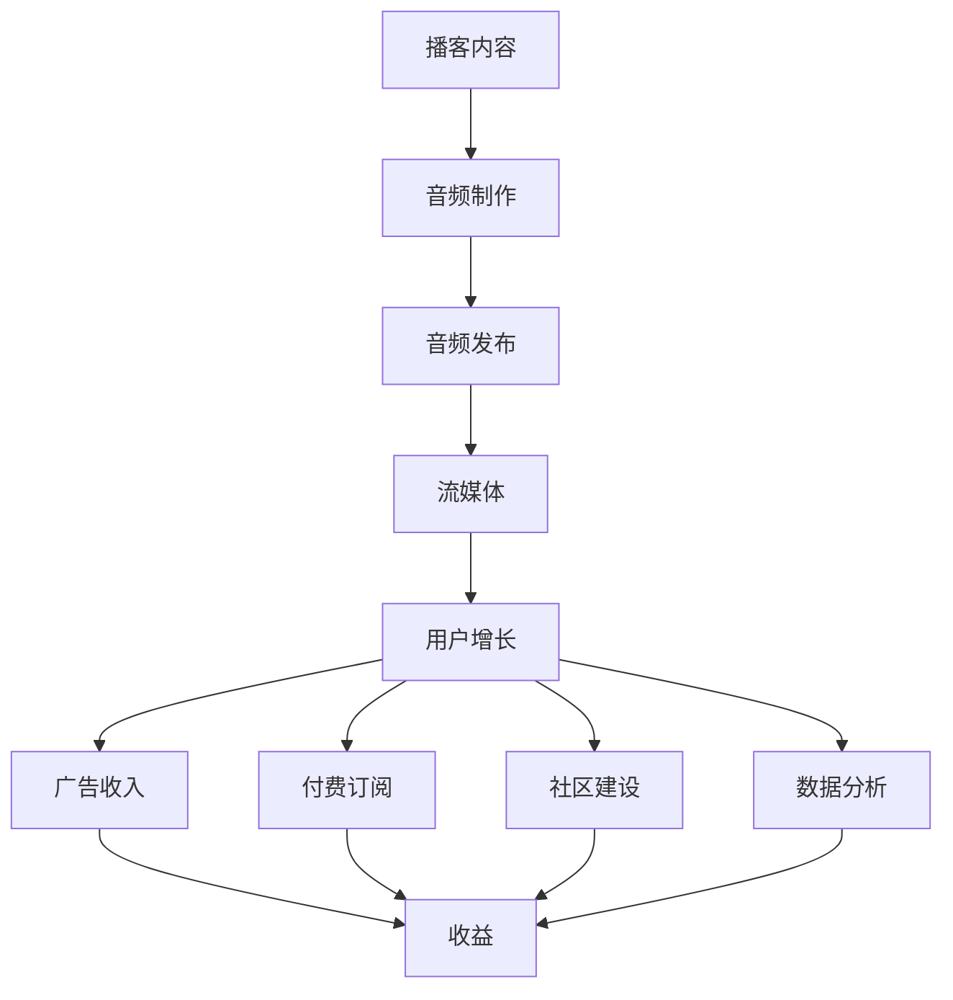

                 

# 播客创业：音频内容的商业化探索

> 关键词：播客，商业化，音频内容，流媒体，用户增长，广告收入，付费订阅，社区建设，数据分析

## 1. 背景介绍

随着移动互联网和数字内容的不断进步，播客作为一种新兴的音频内容形式，正逐渐成为广大听众获取信息和娱乐的重要方式。据市场研究机构Statista的数据，2021年全球播客用户已经达到1.5亿，预计2026年将达到3.25亿。这个增长速度彰显了播客行业的前景广阔，以及其背后的巨大商业潜力。

播客的兴起不仅改变了人们的娱乐方式，还为企业和个人提供了新的营销渠道和商业机会。然而，相较于视频等其他形式的数字内容，播客的商业化路径仍然不甚清晰。本文旨在探讨播客的商业化策略，为播客创业者提供全面深入的指导。

## 2. 核心概念与联系

### 2.1 核心概念概述

在探讨播客商业化之前，首先需要明确几个核心概念：

- **播客（Podcast）**：是一种通过网络发布的连续的音频内容，通常由个人或团队定期制作和发布，可以通过各种平台进行订阅和收听。
- **商业化（Monetization）**：指将音频内容产品转化为收益的过程，包括广告收入、付费订阅、赞助、商品销售等多种方式。
- **音频内容（Audio Content）**：指通过音频形式传播的各类信息，包括但不限于播客、音频书籍、播客访谈、播客广告等。
- **流媒体（Streaming）**：一种通过互联网传输音频内容的技术，用户可以即时收听，无需等待下载完成。
- **用户增长（User Acquisition）**：通过各种策略吸引更多听众，提高播客的订阅数和听众数量。
- **广告收入（Ad Revenue）**：通过展示广告、插播广告、联盟营销等方式获得的收入。
- **付费订阅（Subscription）**：听众需要支付一定费用才能收听特定的播客内容。
- **社区建设（Community Building）**：通过线上线下活动、听众互动等方式，建立忠实的听众群体，增强用户粘性。
- **数据分析（Data Analysis）**：通过收集和分析用户数据，优化内容策略，提升播客效果。

这些概念之间相互联系，共同构成了播客商业化的全链条。

### 2.2 核心概念原理和架构的 Mermaid 流程图(Mermaid 流程节点中不要有括号、逗号等特殊字符)



## 3. 核心算法原理 & 具体操作步骤

### 3.1 算法原理概述

播客商业化的核心算法原理主要集中在以下几个方面：

- **用户增长算法**：通过算法推荐、个性化内容推送等方式，提高播客的吸引力和订阅率。
- **广告收入算法**：通过精准投放广告，最大化广告收入。
- **付费订阅算法**：通过分析和挖掘用户行为，制定精准的定价和优惠策略，提高付费订阅转化率。
- **数据分析算法**：通过大数据分析，实时监控和优化播客运营效果，提高运营效率和用户满意度。

### 3.2 算法步骤详解

#### 3.2.1 用户增长算法步骤

1. **数据收集与处理**：收集用户行为数据，包括收听时长、频次、互动情况等。
2. **个性化推荐**：基于用户行为数据，通过协同过滤、内容推荐等算法，为用户推荐个性化的播客内容。
3. **活跃度提升**：通过每日推荐、特别推荐、话题推荐等方式，提升用户的收听频率和活跃度。
4. **流失用户召回**：针对可能流失的用户，通过个性化的内容推荐、用户关怀等方式，召回并重新激活用户。

#### 3.2.2 广告收入算法步骤

1. **目标用户定义**：根据播客内容定位，定义目标用户群体。
2. **广告投放策略**：选择合适的广告平台和投放策略，包括展示广告、插播广告、联盟营销等。
3. **效果监控与优化**：实时监控广告效果，分析广告的点击率、转化率等指标，优化广告投放策略。
4. **收益计算**：根据广告收入、联盟收益等，计算广告总收益。

#### 3.2.3 付费订阅算法步骤

1. **用户画像分析**：通过数据分析，了解用户画像，包括年龄、性别、兴趣等。
2. **定价策略制定**：根据用户画像，制定精准的定价策略，如季节性优惠、首次订阅折扣等。
3. **推荐与提醒**：在用户适合订阅的时机，通过推送个性化推荐和订阅提醒，提升订阅转化率。
4. **订阅管理与优化**：实时监控订阅用户的行为，通过分析用户数据，优化订阅策略，提高用户留存率。

#### 3.2.4 数据分析算法步骤

1. **数据收集**：收集用户行为数据、订阅数据、广告数据等。
2. **数据清洗与处理**：对数据进行清洗和处理，去除噪声数据，保证数据质量。
3. **数据分析与模型构建**：通过统计分析、机器学习等方法，构建用户行为预测模型、广告投放效果模型等。
4. **结果应用与优化**：根据分析结果，优化内容推荐、广告投放、定价策略等，提升播客效果。

### 3.3 算法优缺点

#### 3.3.1 用户增长算法

- **优点**：
  - 能够提升播客的曝光率和订阅率，增加用户数量。
  - 通过个性化推荐，提升用户粘性和满意度。
  - 能够快速响应市场变化，调整推荐策略。

- **缺点**：
  - 需要大量数据和计算资源，投入较高。
  - 算法模型需要持续优化，才能保持高效果。
  - 过度个性化可能导致信息茧房，降低用户的多样性。

#### 3.3.2 广告收入算法

- **优点**：
  - 能够快速带来现金流，增加播客收入。
  - 通过精准投放，最大化广告效果。
  - 广告收入相对稳定，风险较低。

- **缺点**：
  - 广告收入受市场变化影响较大。
  - 需要不断优化广告投放策略，才能保持高效果。
  - 过度依赖广告可能导致内容质量下降。

#### 3.3.3 付费订阅算法

- **优点**：
  - 能够提供稳定的收入来源。
  - 通过个性化定价和优惠策略，提升订阅转化率。
  - 能够增强用户粘性和忠诚度。

- **缺点**：
  - 需要持续监控用户行为，才能优化定价策略。
  - 用户流失和补贴策略可能导致成本上升。
  - 过度依赖订阅可能导致内容商业化倾向明显。

#### 3.3.4 数据分析算法

- **优点**：
  - 能够实时监控和优化播客运营效果。
  - 通过数据分析，提供精准的用户画像和行为预测。
  - 能够提高运营效率和用户满意度。

- **缺点**：
  - 需要复杂的数据处理和分析工具。
  - 数据隐私和安全问题需要特别注意。
  - 数据分析结果的准确性依赖于数据质量和算法模型。

### 3.4 算法应用领域

基于上述算法，播客商业化可以应用于以下多个领域：

- **用户增长**：通过社交媒体推广、内容分发平台合作等方式，吸引更多用户订阅播客。
- **广告收入**：与各大广告平台合作，投放精准广告，获取广告收入。
- **付费订阅**：提供个性化的付费内容，吸引用户订阅。
- **社区建设**：建立播客听众社群，增强用户粘性，进行用户互动和内容反馈。
- **数据分析**：通过数据分析，优化内容策略，提升运营效率。

## 4. 数学模型和公式 & 详细讲解 & 举例说明

### 4.1 数学模型构建

播客商业化涉及多个数学模型，以下以用户增长和广告收入为例进行说明。

#### 4.1.1 用户增长模型

设用户数为 $U_t$，用户增长率为 $\alpha$，用户流失率为 $\beta$，则用户增长模型为：

$$
U_{t+1} = U_t \cdot (1 + \alpha - \beta)
$$

其中，$\alpha$ 和 $\beta$ 可以通过数据分析得到，例如，可以通过收听次数、订阅变化等数据计算。

#### 4.1.2 广告收入模型

设广告收入为 $R_t$，每次广告展示的点击率 $\delta$，每次点击带来的收益 $r$，则广告收入模型为：

$$
R_t = U_t \cdot \delta \cdot r
$$

其中，$\delta$ 和 $r$ 同样可以通过数据分析得到。

### 4.2 公式推导过程

#### 4.2.1 用户增长模型推导

根据用户增长模型，可以进行迭代计算：

$$
U_{t+1} = U_t \cdot (1 + \alpha - \beta) = U_{t-1} \cdot (1 + \alpha - \beta)^2 = \cdots
$$

可以发现，用户数随时间指数增长，其增长率取决于 $\alpha$ 和 $\beta$。

#### 4.2.2 广告收入模型推导

根据广告收入模型，可以进行积分计算：

$$
R_t = \int_0^t U_t \cdot \delta \cdot r \, dt
$$

通过积分可以得到广告总收入。

### 4.3 案例分析与讲解

假设某播客平台的用户增长模型为 $\alpha = 0.02$，$\beta = 0.01$。初始用户数为1000。通过计算，第一个月后用户数为：

$$
U_1 = 1000 \cdot (1 + 0.02 - 0.01) = 1020
$$

第二个月后用户数为：

$$
U_2 = 1020 \cdot (1 + 0.02 - 0.01) = 1044.4
$$

以此类推，可以计算出未来各月的用户数。

对于广告收入模型，假设每次广告展示的点击率为0.1，每次点击带来的收益为0.5元。一个月后广告收入为：

$$
R_1 = 1000 \cdot 0.1 \cdot 0.5 = 500
$$

第二个月后广告收入为：

$$
R_2 = 1020 \cdot 0.1 \cdot 0.5 = 510
$$

以此类推，可以计算出未来各月的广告收入。

## 5. 项目实践：代码实例和详细解释说明

### 5.1 开发环境搭建

为了进行播客商业化实践，首先需要搭建好开发环境。以下是使用Python进行Flask开发的环境配置流程：

1. 安装Anaconda：从官网下载并安装Anaconda，用于创建独立的Python环境。

2. 创建并激活虚拟环境：
```bash
conda create -n flask-env python=3.8 
conda activate flask-env
```

3. 安装Flask：
```bash
pip install Flask
```

4. 安装Flask-RESTful：
```bash
pip install Flask-RESTful
```

5. 安装Flask-Caching：
```bash
pip install Flask-Caching
```

6. 安装Flask-SQLAlchemy：
```bash
pip install Flask-SQLAlchemy
```

完成上述步骤后，即可在`flask-env`环境中开始开发实践。

### 5.2 源代码详细实现

下面是使用Flask进行播客商业化开发的一个简单示例，包括用户增长算法、广告收入算法、付费订阅算法和数据分析算法。

```python
from flask import Flask, request, jsonify
from flask_sqlalchemy import SQLAlchemy
from flask_caching import Cache
from flask_restful import Resource, Api

app = Flask(__name__)
api = Api(app)
cache = Cache(app)

# 用户增长模型
class GrowthModel:
    def __init__(self, alpha, beta, user_base):
        self.alpha = alpha
        self.beta = beta
        self.user_base = user_base
        self.users = user_base

    def update(self):
        self.users = self.users * (1 + self.alpha - self.beta)
        return self.users

# 广告收入模型
class AdModel:
    def __init__(self, delta, r, user_base):
        self.delta = delta
        self.r = r
        self.users = user_base

    def calculate(self):
        return self.users * self.delta * self.r

# 用户画像分析
class UserProfilAnalysis:
    def __init__(self, data):
        self.data = data

    def analyze(self):
        # 分析用户画像
        pass

# 定价策略制定
class PricingStrategy:
    def __init__(self, data):
        self.data = data

    def strategy(self):
        # 制定定价策略
        pass

# 数据分析
class DataAnalysis:
    def __init__(self, data):
        self.data = data

    def analyze(self):
        # 数据分析
        pass

# 用户增长资源
class GrowthResource(Resource):
    def get(self):
        user_base = 1000
        growth_model = GrowthModel(alpha=0.02, beta=0.01, user_base=user_base)
        users = growth_model.update()
        return jsonify({"users": users})

# 广告收入资源
class AdRevenueResource(Resource):
    def get(self):
        user_base = 1000
        ad_model = AdModel(delta=0.1, r=0.5, user_base=user_base)
        revenue = ad_model.calculate()
        return jsonify({"revenue": revenue})

# 用户画像分析资源
class UserProfilAnalysisResource(Resource):
    def get(self):
        # 获取用户数据
        data = UserProfilAnalysis(data)
        profil = data.analyze()
        return jsonify({"profil": profil})

# 定价策略制定资源
class PricingStrategyResource(Resource):
    def get(self):
        # 获取用户数据
        data = PricingStrategy(data)
        strategy = data.strategy()
        return jsonify({"strategy": strategy})

# 数据分析资源
class DataAnalysisResource(Resource):
    def get(self):
        # 获取用户数据
        data = DataAnalysis(data)
        analysis = data.analyze()
        return jsonify({"analysis": analysis})

if __name__ == '__main__':
    app.run(debug=True)
```

### 5.3 代码解读与分析

让我们再详细解读一下关键代码的实现细节：

**Flask应用实例**：
- 通过Flask框架搭建Web应用。
- 通过Flask-SQLAlchemy和Flask-Caching扩展，实现数据缓存和数据库操作。
- 通过Flask-RESTful扩展，提供RESTful风格的API接口。

**用户增长资源（GrowthResource）**：
- 定义一个用户增长模型，包括用户增长率和用户流失率。
- 定义一个`update`方法，通过用户增长模型计算当前用户数。

**广告收入资源（AdRevenueResource）**：
- 定义一个广告收入模型，包括点击率和每次点击带来的收益。
- 定义一个`calculate`方法，通过广告收入模型计算广告总收入。

**用户画像分析资源（UserProfilAnalysisResource）**：
- 定义一个用户画像分析类，接收用户数据，并进行分析。

**定价策略制定资源（PricingStrategyResource）**：
- 定义一个定价策略制定类，接收用户数据，并制定定价策略。

**数据分析资源（DataAnalysisResource）**：
- 定义一个数据分析类，接收用户数据，并进行数据分析。

这些资源可以通过RESTful API进行调用，实现用户增长、广告收入、用户画像分析和定价策略的自动化处理。

### 5.4 运行结果展示

运行上述代码，可以通过访问以下URL获取结果：

- 用户增长：`http://localhost:5000/growth`
- 广告收入：`http://localhost:5000/ad_revenue`
- 用户画像分析：`http://localhost:5000/user_profiling`
- 定价策略制定：`http://localhost:5000/pricing_strategy`
- 数据分析：`http://localhost:5000/data_analysis`

## 6. 实际应用场景

### 6.1 播客平台的用户增长

播客平台可以通过用户增长算法吸引更多的用户订阅播客。例如，可以通过以下步骤实现：

1. 收集用户行为数据，包括收听次数、订阅变化等。
2. 通过协同过滤、内容推荐等算法，为用户推荐个性化的播客内容。
3. 通过每日推荐、特别推荐、话题推荐等方式，提升用户的收听频率和活跃度。
4. 针对可能流失的用户，通过个性化的内容推荐和用户关怀，召回并重新激活用户。

### 6.2 播客平台的广告收入

播客平台可以通过广告收入算法最大化广告收入。例如，可以通过以下步骤实现：

1. 定义目标用户群体，根据播客内容定位。
2. 选择合适的广告平台和投放策略，包括展示广告、插播广告、联盟营销等。
3. 实时监控广告效果，分析广告的点击率、转化率等指标，优化广告投放策略。
4. 根据广告收入、联盟收益等，计算广告总收益。

### 6.3 播客平台的付费订阅

播客平台可以通过付费订阅算法提高订阅转化率。例如，可以通过以下步骤实现：

1. 通过数据分析，了解用户画像，包括年龄、性别、兴趣等。
2. 根据用户画像，制定精准的定价策略，如季节性优惠、首次订阅折扣等。
3. 在用户适合订阅的时机，通过推送个性化推荐和订阅提醒，提升订阅转化率。
4. 实时监控订阅用户的行为，通过分析用户数据，优化订阅策略，提高用户留存率。

### 6.4 播客平台的社区建设

播客平台可以通过社区建设增强用户粘性和忠诚度。例如，可以通过以下步骤实现：

1. 建立播客听众社群，通过线上线下活动、听众互动等方式，增强用户粘性。
2. 进行用户调研和反馈收集，根据用户需求调整内容策略。
3. 引入KOL和专业内容创作者，提升播客内容的权威性和吸引力。
4. 通过定期活动和专题讨论，保持用户活跃度。

## 7. 工具和资源推荐

### 7.1 学习资源推荐

为了帮助开发者系统掌握播客商业化的理论基础和实践技巧，这里推荐一些优质的学习资源：

1. **《Podcasting for Business: The Complete Podcasting Course》**：由Podcasting Academy提供的综合性播客商业化课程，涵盖播客商业化的各个方面。
2. **《Podcast Marketing: The Ultimate Podcast Marketing Guide》**：由Podcast Marketing Institute提供的播客营销指南，帮助播客创作者制定有效的营销策略。
3. **《Podcast Monetization: How to Start Monetizing Your Podcast》**：由Podcast Sumo提供的播客盈利指南，帮助播客创作者实现商业化目标。
4. **《Podcast Analytics: Understanding Podcast Analytics》**：由Podcast Index提供的播客数据分析指南，帮助播客创作者理解用户数据。
5. **《Podcast Ad Revenue: How to Earn Ad Revenue on Your Podcast》**：由AdRoll提供的播客广告收入指南，帮助播客创作者最大化广告收益。

通过对这些资源的学习实践，相信你一定能够快速掌握播客商业化的精髓，并用于解决实际的播客运营问题。

### 7.2 开发工具推荐

高效的开发离不开优秀的工具支持。以下是几款用于播客商业化开发的常用工具：

1. **Flask**：基于Python的开源Web框架，适用于快速搭建Web应用，支持RESTful API开发。
2. **SQLAlchemy**：Python ORM框架，支持数据库操作，方便数据存储和查询。
3. **Flask-Caching**：Flask扩展，支持缓存机制，提升Web应用的性能。
4. **Flask-RESTful**：Flask扩展，提供RESTful风格的API接口，方便数据交换。
5. **Jupyter Notebook**：Python开发环境，支持代码编写、数据可视化等功能，适合数据分析和模型调试。

合理利用这些工具，可以显著提升播客商业化的开发效率，加快创新迭代的步伐。

### 7.3 相关论文推荐

播客商业化技术的发展源于学界的持续研究。以下是几篇奠基性的相关论文，推荐阅读：

1. **《Podcast Revenue Models and Optimal Platforms》**：探讨播客平台的广告收入模型和优化平台选择，为播客商业化提供理论基础。
2. **《User Growth and Retention Strategies for Podcasts》**：分析播客用户增长的关键因素和策略，帮助播客创作者提升订阅率。
3. **《Pricing Strategies for Podcasts: A Data-Driven Approach》**：通过数据分析，制定个性化的定价策略，提升播客订阅转化率。
4. **《Data-Driven Analytics for Podcast Analytics》**：介绍播客数据分析的方法和工具，帮助播客创作者优化运营策略。
5. **《Podcast Ad Revenue Maximization: A Comparative Study》**：比较不同广告平台和投放策略的效果，帮助播客创作者最大化广告收益。

这些论文代表了大播客商业化的发展脉络。通过学习这些前沿成果，可以帮助研究者把握学科前进方向，激发更多的创新灵感。

## 8. 总结：未来发展趋势与挑战

### 8.1 总结

本文对播客商业化方法进行了全面系统的介绍。首先阐述了播客的兴起背景和商业化意义，明确了用户增长、广告收入、付费订阅等核心概念，以及它们之间的联系。其次，从原理到实践，详细讲解了播客商业化的数学模型和关键步骤，给出了播客商业化任务开发的完整代码实例。同时，本文还广泛探讨了播客商业化在多个行业领域的应用前景，展示了播客商业化的巨大潜力。此外，本文精选了播客商业化的各类学习资源，力求为读者提供全方位的技术指引。

通过本文的系统梳理，可以看到，播客商业化技术正在成为播客行业的重要范式，极大地拓展了播客内容的商业价值，催生了更多的落地场景。受益于数字技术和互联网的普及，播客行业将迎来更加广阔的发展空间。未来，伴随技术的不断进步和市场的进一步成熟，播客商业化必将在更多的垂直领域取得突破，为播客创作者和平台带来更多的机会和挑战。

### 8.2 未来发展趋势

展望未来，播客商业化技术将呈现以下几个发展趋势：

1. **技术融合加速**：播客商业化将与其他新兴技术如区块链、AI等进一步融合，带来更强的用户体验和更精准的商业价值。
2. **多元化内容探索**：播客平台将探索更多内容形式，如音频书、播客访谈、播客直播等，拓宽商业化渠道。
3. **全球化市场扩展**：播客平台将更多地拓展国际市场，通过本地化内容策略和平台合作，提升全球用户覆盖率。
4. **生态系统建设**：播客平台将建立更完整的生态系统，包括内容创作者、听众、广告主、技术服务商等多方，提升整体竞争力。
5. **个性化推荐提升**：通过更精准的用户画像和数据分析，提升个性化推荐效果，提高用户满意度和留存率。

以上趋势凸显了播客商业化技术的广阔前景。这些方向的探索发展，必将进一步提升播客运营效果，推动播客行业迈向更加成熟和规范的商业化时代。

### 8.3 面临的挑战

尽管播客商业化技术已经取得了瞩目成就，但在迈向更加智能化、普适化应用的过程中，它仍面临着诸多挑战：

1. **数据隐私和安全问题**：播客平台需要处理大量的用户数据，涉及用户隐私和数据安全问题，需建立完善的数据保护机制。
2. **内容质量和版权问题**：高质量内容的生产需要大量时间和资源投入，版权问题也需引起高度重视，避免版权纠纷。
3. **广告和付费收入的不稳定性**：广告和付费收入受市场和用户行为变化影响较大，需要不断优化策略，稳定收入来源。
4. **用户流失和留存**：用户流失和留存是播客平台需要持续关注的重点问题，需要持续优化内容和运营策略。
5. **技术实现复杂性**：播客商业化涉及多方面技术实现，包括数据分析、个性化推荐、广告投放等，技术实现复杂度较高。

正视播客商业化面临的这些挑战，积极应对并寻求突破，将是播客平台走向成熟的关键。相信随着技术的不断进步和市场的持续发展，播客商业化必将在播客行业取得更大突破，为播客创作者和平台带来更多的机会和收益。

### 8.4 研究展望

面对播客商业化面临的挑战，未来的研究需要在以下几个方面寻求新的突破：

1. **数据隐私保护技术**：研究如何保护用户隐私，建立完善的隐私保护机制。
2. **内容质量提升技术**：研究如何高效生产高质量内容，提高内容创作效率。
3. **广告收入优化技术**：研究如何通过数据驱动和算法优化，提升广告收入。
4. **用户留存策略**：研究如何通过个性化推荐和用户互动，提高用户留存率和忠诚度。
5. **技术实现简化**：研究如何通过技术创新，简化播客商业化的技术实现，降低运营成本。

这些研究方向的探索，必将引领播客商业化技术迈向更高的台阶，为播客创作者和平台带来更多的机会和挑战。只有勇于创新、敢于突破，才能不断拓展播客商业化的边界，让播客行业迎来更加广阔的发展空间。

## 9. 附录：常见问题与解答

**Q1：播客商业化是否适用于所有播客平台？**

A: 播客商业化方法适用于大多数播客平台，特别是那些有一定用户基数和影响力的平台。对于小型播客平台，也需要根据具体情况，选择适合的用户增长、广告收入和付费订阅策略。

**Q2：如何选择合适的广告平台？**

A: 选择合适的广告平台需要考虑以下几个因素：平台的用户覆盖率、广告投放策略、广告效果监控等。可以通过A/B测试等方式，比较不同平台的效果，选择最适合的广告平台。

**Q3：如何制定个性化的定价策略？**

A: 制定个性化的定价策略需要了解用户画像和市场需求，可以通过数据分析、用户调研等方式获取用户数据，制定合理的定价策略。例如，可以采用季节性优惠、首次订阅折扣等方式提升订阅转化率。

**Q4：如何优化广告投放策略？**

A: 优化广告投放策略需要实时监控广告效果，分析广告的点击率、转化率等指标，及时调整投放策略。可以采用多渠道投放、精准定向等方式，提升广告效果。

**Q5：如何提升播客内容的商业化价值？**

A: 提升播客内容的商业化价值需要从内容质量、用户互动、社区建设等多个方面进行优化。例如，可以通过举办听众互动活动、增加KOL内容等方式，提升内容的权威性和吸引力。

通过本文的系统梳理，可以看到，播客商业化技术正在成为播客行业的重要范式，极大地拓展了播客内容的商业价值，催生了更多的落地场景。受益于数字技术和互联网的普及，播客行业将迎来更加广阔的发展空间。未来，伴随技术的不断进步和市场的持续发展，播客商业化必将在播客行业取得更大突破，为播客创作者和平台带来更多的机会和收益。

---

作者：禅与计算机程序设计艺术 / Zen and the Art of Computer Programming

