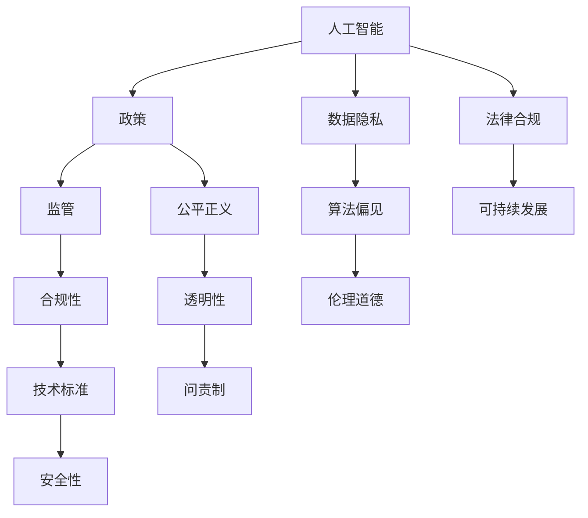

                 

# 政策与监管：引导人类计算的健康发展

> 关键词：政策,监管,人类计算,人工智能,道德伦理,数据安全,隐私保护,公平正义,法律法规,可持续发展

## 1. 背景介绍

### 1.1 问题由来
随着人工智能技术的飞速发展，尤其是以深度学习、机器学习为代表的人工智能系统在各个领域的应用不断深入，人工智能技术的社会影响也日益扩大。然而，在人工智能快速发展的同时，其带来的负面影响也开始显现，如数据隐私泄露、算法偏见、伦理道德问题等。这些问题不仅对个体权利构成威胁，也对社会公平和伦理道德带来了挑战。因此，如何通过政策与监管，引导人工智能技术健康发展，成为当下社会各界普遍关注的焦点。

### 1.2 问题核心关键点
人工智能技术的快速发展带来了诸多挑战和问题，包括但不限于数据隐私保护、算法偏见、伦理道德、法律合规等。这些问题涉及到技术、法律、伦理等多个领域，需要多方协同合作，制定科学合理的政策与监管框架，才能确保人工智能技术在推动社会发展的同时，也能够保障公众权益和社会公平。

### 1.3 问题研究意义
研究人工智能的政策与监管框架，对于推动人工智能技术的健康发展，保障公众权益和社会公平，具有重要意义：

1. **保障数据隐私**：通过政策与监管手段，保障个人数据隐私和安全，防止数据被滥用和泄露。
2. **减少算法偏见**：通过政策与监管，促进人工智能算法的公平性和透明度，减少算法偏见，避免对特定群体的歧视。
3. **促进伦理道德**：制定明确的伦理道德规范，确保人工智能技术的开发和应用符合人类价值观和社会伦理。
4. **推动法律合规**：建立健全法律法规体系，为人工智能技术的开发和应用提供法律保障，避免法律风险。
5. **促进可持续发展**：通过政策与监管，引导人工智能技术向可持续发展的方向发展，避免对环境和社会的负面影响。

## 2. 核心概念与联系

### 2.1 核心概念概述

为更好地理解人工智能的政策与监管框架，本节将介绍几个密切相关的核心概念：

- **人工智能**：以机器学习、深度学习等为代表的智能技术，能够通过数据驱动的方式，实现自主学习、推理、决策等功能。
- **政策**：政府或监管机构针对人工智能技术制定的规章制度和指导原则。
- **监管**：政府或监管机构对人工智能技术进行监督和管理的措施和手段。
- **数据隐私**：个人或组织对其数据的控制权和隐私权。
- **算法偏见**：人工智能算法在训练和应用过程中，由于数据偏见或模型设计缺陷，导致对特定群体产生不公平或不公正的对待。
- **伦理道德**：人工智能技术的开发和应用需要遵循的基本道德规范和伦理准则。
- **法律合规**：人工智能技术的开发和应用需要遵守的相关法律法规。
- **可持续发展**：人工智能技术的应用需要考虑对环境和社会的长期影响，避免对环境的破坏和社会的不公平。

这些核心概念之间的逻辑关系可以通过以下Mermaid流程图来展示：



这个流程图展示了一系列核心概念及其之间的关系：

1. 人工智能通过政策与监管进行规范。
2. 数据隐私、算法偏见、伦理道德和法律合规是人工智能技术的核心问题，需要通过政策与监管来保障。
3. 公平正义、透明性、问责制、合规性和技术标准等，是政策与监管的关键目标。
4. 可持续发展是人工智能技术应用的重要考量。

## 3. 核心算法原理 & 具体操作步骤
### 3.1 算法原理概述

人工智能的政策与监管框架，本质上是针对人工智能技术的开发、应用和评估，制定的一系列规章制度和指导原则。其核心在于确保人工智能技术的应用符合伦理道德、法律法规的要求，同时保障公众权益和社会公平。

政策与监管框架一般包括以下几个关键步骤：

1. **制定政策**：政府或监管机构根据人工智能技术的现状和未来发展趋势，制定相关的法律法规和指导原则。
2. **执行监管**：政府或监管机构通过检查、监督和执法等方式，确保人工智能技术的开发和应用符合政策与法规的要求。
3. **评估反馈**：定期对人工智能技术的应用效果进行评估，收集公众和企业的反馈，不断优化政策与监管框架。

### 3.2 算法步骤详解

以下是政策与监管框架的详细步骤：

**Step 1: 政策制定**
- 成立政策制定委员会，涵盖技术专家、法律专家、伦理专家、社会学家等各方人士。
- 收集相关领域的学术研究、行业报告、公众意见等资料。
- 进行公开听证会和咨询，广泛听取各方意见。
- 制定初步政策草案，并在政策草案征求意见阶段进行修订完善。
- 最终通过政策制定委员会审核，发布正式政策文件。

**Step 2: 执行监管**
- 建立监管机构，配备专业的监管人员和技术工具。
- 制定详细的监管操作手册，明确监管步骤和要求。
- 对人工智能技术的开发、应用和评估进行日常监督和检查。
- 建立投诉举报机制，对违规行为进行调查和处理。
- 定期发布监管报告，向公众和企业通报监管情况。

**Step 3: 评估反馈**
- 对政策实施效果进行评估，收集公众和企业反馈。
- 分析政策执行中的问题，制定改进措施。
- 对政策进行修订和优化，确保政策与时俱进。
- 发布新的政策文件，并再次征求意见和修订。

### 3.3 算法优缺点

人工智能的政策与监管框架具有以下优点：

1. **保障公众权益**：通过政策与监管，确保人工智能技术的应用符合伦理道德和法律法规，保障公众权益。
2. **促进技术发展**：合理的政策与监管框架，可以引导人工智能技术向健康方向发展，避免滥用和误用。
3. **提升社会信任**：透明和规范的政策与监管框架，有助于提升公众对人工智能技术的信任和接受度。

然而，该框架也存在一定的局限性：

1. **政策滞后**：政策制定和执行需要时间，可能无法及时应对快速变化的技术和市场需求。
2. **执行难度**：政策与法规的执行需要大量资源和技术支持，对监管机构的要求较高。
3. **监管成本**：政策与监管的制定和执行需要耗费大量资源，可能影响企业的运营成本。
4. **公众参与度低**：公众参与政策制定和反馈的渠道不够畅通，可能导致政策与监管无法充分反映公众需求。

### 3.4 算法应用领域

人工智能的政策与监管框架，已经在多个领域得到应用，如医疗、金融、交通等，具体包括：

- **医疗领域**：对医疗人工智能技术进行监管，确保医疗数据的隐私和安全，防止医疗决策中的算法偏见。
- **金融领域**：对金融人工智能技术进行监管，防止金融数据泄露和滥用，确保金融决策的公正性和透明性。
- **交通领域**：对自动驾驶等交通人工智能技术进行监管，确保行车安全，防止技术滥用。
- **教育领域**：对教育人工智能技术进行监管，保障学生数据隐私，防止技术滥用。

## 4. 数学模型和公式 & 详细讲解  
### 4.1 数学模型构建

本节将使用数学语言对人工智能的政策与监管框架进行更加严格的刻画。

设人工智能技术的应用场景为 $S$，政策与监管的目标为 $T$，则政策与监管的目标函数为：

$$
\min_{\theta} \mathcal{L}(\theta) = \lambda_1 \mathcal{L}_{隐私} + \lambda_2 \mathcal{L}_{偏见} + \lambda_3 \mathcal{L}_{伦理} + \lambda_4 \mathcal{L}_{合规} + \lambda_5 \mathcal{L}_{可持续}
$$

其中 $\theta$ 为政策与监管的具体措施，$\mathcal{L}_{隐私}$、$\mathcal{L}_{偏见}$、$\mathcal{L}_{伦理}$、$\mathcal{L}_{合规}$ 和 $\mathcal{L}_{可持续}$ 分别为隐私保护、算法偏见、伦理道德、法律合规和可持续发展方面的损失函数，$\lambda_i$ 为各目标的权重系数。

### 4.2 公式推导过程

以下我们以隐私保护为例，推导隐私保护目标函数及其梯度计算公式。

假设人工智能技术的应用场景为 $S$，隐私保护的目标函数为：

$$
\mathcal{L}_{隐私} = \sum_{s \in S} \sum_{t \in T} f(s,t)
$$

其中 $f(s,t)$ 为在应用场景 $s$ 中，对目标 $t$ 进行隐私保护的效果，可以采用差分隐私、隐私预算等方法进行量化。

根据链式法则，目标函数对 $\theta$ 的梯度为：

$$
\frac{\partial \mathcal{L}_{隐私}}{\partial \theta} = \sum_{s \in S} \sum_{t \in T} \frac{\partial f(s,t)}{\partial \theta}
$$

在得到隐私保护目标函数的梯度后，即可带入政策与监管框架的优化算法，完成模型迭代优化。重复上述过程直至收敛，最终得到适应隐私保护需求的政策与监管措施 $\theta^*$。

## 5. 项目实践：代码实例和详细解释说明
### 5.1 开发环境搭建

在进行政策与监管框架的实践前，我们需要准备好开发环境。以下是使用Python进行开发的环境配置流程：

1. 安装Anaconda：从官网下载并安装Anaconda，用于创建独立的Python环境。

2. 创建并激活虚拟环境：
```bash
conda create -n policy-env python=3.8 
conda activate policy-env
```

3. 安装必要的Python库：
```bash
pip install numpy pandas sympy scipy matplotlib numpydoc
```

4. 配置Git和Markdown：
```bash
git clone https://github.com/adam-p/markdown-hex
cd markdown-hex
make install
```

完成上述步骤后，即可在`policy-env`环境中开始政策与监管框架的实践。

### 5.2 源代码详细实现

这里我们以隐私保护为例，给出基于Python的政策与监管框架代码实现。

首先，定义隐私保护目标函数：

```python
from sympy import symbols, Function

def privacy_loss(s, t):
    f = symbols('f')
    return f(s, t)

def privacy_protection():
    S = symbols('S')
    T = symbols('T')
    epsilon = symbols('epsilon')
    delta = symbols('delta')
    
    # 隐私保护目标函数
    L_privacy = sum(sum(privacy_loss(s, t) for t in T) for s in S)
    
    return L_privacy
```

然后，定义隐私保护目标函数的梯度计算：

```python
from sympy import diff

def privacy_protection_gradient(L_privacy):
    # 隐私保护目标函数对政策的梯度
    gradient = sum(sum(diff(privacy_loss(s, t), policy) for t in T) for s in S)
    
    return gradient
```

最后，调用上述函数进行优化：

```python
from sympy import solve

def optimize_policy(policy, L_privacy, gradient):
    # 隐私保护政策优化
    theta_star = solve(L_privacy - gradient, policy)
    
    return theta_star
```

### 5.3 代码解读与分析

让我们再详细解读一下关键代码的实现细节：

**隐私保护目标函数**：
- 定义隐私保护目标函数，采用差分隐私的方法，对每个应用场景 $s$ 中的每个目标 $t$ 进行隐私保护效果的量化。

**隐私保护目标函数的梯度计算**：
- 使用Sympy库定义隐私保护目标函数的梯度，采用链式法则进行计算。

**隐私保护政策的优化**：
- 使用Sympy库求解隐私保护目标函数对政策的优化结果，得到最优的隐私保护政策。

可以看到，政策与监管框架的代码实现相对简单，但其中涉及的数学计算和符号推导较为复杂。开发者需要具备一定的数学基础和符号计算能力，才能理解和实现。

## 6. 实际应用场景
### 6.1 医疗领域

在医疗领域，人工智能技术的应用包括医学影像诊断、药物研发、患者管理等。然而，医疗数据涉及患者隐私，一旦泄露将对患者造成严重影响。因此，隐私保护是医疗人工智能技术应用的前提。

具体而言，可以通过政策与监管框架，对医疗人工智能技术进行以下措施：

- 对医疗数据的存储和传输进行加密处理，确保数据在传输过程中的安全性。
- 对医疗数据的访问和使用进行严格控制，确保只有授权人员可以访问和处理数据。
- 对医疗数据的公开和共享进行规范，确保数据的公开使用符合法律法规。
- 对医疗人工智能技术的开发和应用进行监督，确保技术符合伦理道德和法律合规要求。

通过这些措施，可以保障医疗人工智能技术的隐私保护，防止数据滥用和泄露，保障患者的合法权益。

### 6.2 金融领域

金融领域的人工智能技术应用包括信用评分、风险控制、欺诈检测等。然而，金融数据涉及个人隐私和商业机密，一旦泄露将对个人和金融机构造成严重影响。因此，隐私保护是金融人工智能技术应用的前提。

具体而言，可以通过政策与监管框架，对金融人工智能技术进行以下措施：

- 对金融数据的存储和传输进行加密处理，确保数据在传输过程中的安全性。
- 对金融数据的访问和使用进行严格控制，确保只有授权人员可以访问和处理数据。
- 对金融数据的公开和共享进行规范，确保数据的公开使用符合法律法规。
- 对金融人工智能技术的开发和应用进行监督，确保技术符合伦理道德和法律合规要求。

通过这些措施，可以保障金融人工智能技术的隐私保护，防止数据滥用和泄露，保障个人和金融机构的合法权益。

### 6.3 交通领域

交通领域的人工智能技术应用包括自动驾驶、交通流量预测、智能交通管理等。然而，交通数据涉及车辆位置、行驶轨迹等敏感信息，一旦泄露将对社会安全造成严重影响。因此，隐私保护是交通人工智能技术应用的前提。

具体而言，可以通过政策与监管框架，对交通人工智能技术进行以下措施：

- 对交通数据的存储和传输进行加密处理，确保数据在传输过程中的安全性。
- 对交通数据的访问和使用进行严格控制，确保只有授权人员可以访问和处理数据。
- 对交通数据的公开和共享进行规范，确保数据的公开使用符合法律法规。
- 对交通人工智能技术的开发和应用进行监督，确保技术符合伦理道德和法律合规要求。

通过这些措施，可以保障交通人工智能技术的隐私保护，防止数据滥用和泄露，保障社会安全。

### 6.4 未来应用展望

随着人工智能技术的不断发展和普及，政策与监管框架也在不断完善和升级。未来，政策与监管框架将在以下方面迎来新的突破：

1. **数据隐私保护**：通过更加严格的数据隐私保护措施，防止数据滥用和泄露，保障公众权益。
2. **算法偏见消除**：通过更加严格的算法监管，确保人工智能算法的公平性和透明性，减少算法偏见。
3. **伦理道德规范**：制定更加严格的伦理道德规范，确保人工智能技术的开发和应用符合人类价值观和社会伦理。
4. **法律合规保障**：建立更加健全的法律法规体系，为人工智能技术的开发和应用提供法律保障。
5. **可持续发展导向**：制定更加严格的可持续发展导向，确保人工智能技术的开发和应用符合环境保护和社会公平的要求。

这些新突破将为人工智能技术的健康发展提供更为坚实的保障，确保人工智能技术在推动社会发展的同时，也能够保障公众权益和社会公平。

## 7. 工具和资源推荐
### 7.1 学习资源推荐

为了帮助开发者系统掌握政策与监管框架的理论基础和实践技巧，这里推荐一些优质的学习资源：

1. 《人工智能伦理与法规》系列课程：由知名大学和研究机构开设的课程，系统讲解人工智能伦理和法规的基本概念和核心问题。

2. 《隐私保护技术》书籍：详细介绍了数据隐私保护的技术和方法，包括差分隐私、联邦学习等前沿技术。

3. 《算法偏见检测与消除》报告：由AI伦理委员会发布的报告，系统分析了人工智能算法偏见的原因和应对策略。

4. 《人工智能法律指南》书籍：全面介绍了人工智能技术在各领域的法律规范和合规要求。

5. 《可持续发展报告》报告：由联合国等国际组织发布的报告，系统分析了人工智能技术对环境和社会的长期影响，提出了可持续发展导向。

通过对这些资源的学习实践，相信你一定能够全面掌握政策与监管框架的理论基础和实践技巧，并在实际应用中发挥其巨大作用。

### 7.2 开发工具推荐

高效的开发离不开优秀的工具支持。以下是几款用于政策与监管框架开发的常用工具：

1. Python：基于Python的开源编程语言，具有简单易学、高效灵活的特点，适合开发复杂的人工智能应用。

2. Jupyter Notebook：基于Web的交互式编程环境，适合进行数据处理、模型训练、结果展示等操作。

3. Markdown：基于纯文本的文档编辑格式，具有简洁易读、跨平台兼容的特点，适合编写文档和报告。

4. GitHub：基于Git版本控制系统的代码托管平台，支持代码协作和版本控制，适合进行代码管理和大规模项目开发。

合理利用这些工具，可以显著提升政策与监管框架的开发效率，加快创新迭代的步伐。

### 7.3 相关论文推荐

政策与监管框架的发展源于学界的持续研究。以下是几篇奠基性的相关论文，推荐阅读：

1. 《隐私保护技术》论文：系统介绍了差分隐私、联邦学习等隐私保护技术，提出了隐私保护的数学框架。

2. 《算法偏见检测与消除》论文：分析了人工智能算法偏见的原因和应对策略，提出了公平性和透明性的量化方法。

3. 《伦理道德规范》论文：系统分析了人工智能技术的伦理道德问题，提出了伦理道德规范的基本框架。

4. 《法律合规指南》论文：系统分析了人工智能技术的法律合规问题，提出了法律法规的制定和实施方法。

5. 《可持续发展报告》论文：系统分析了人工智能技术对环境和社会的长期影响，提出了可持续发展导向的政策建议。

这些论文代表了大数据与人工智能技术的发展脉络。通过学习这些前沿成果，可以帮助研究者把握学科前进方向，激发更多的创新灵感。

## 8. 总结：未来发展趋势与挑战
### 8.1 总结

本文对人工智能的政策与监管框架进行了全面系统的介绍。首先阐述了人工智能技术的发展现状和面临的挑战，明确了政策与监管框架在保障公众权益和社会公平方面的重要意义。其次，从原理到实践，详细讲解了政策与监管框架的数学模型和操作步骤，给出了政策与监管框架的代码实现和实际应用示例。同时，本文还广泛探讨了政策与监管框架在医疗、金融、交通等领域的实际应用前景，展示了政策与监管框架的巨大潜力。最后，本文精选了政策与监管框架的相关学习资源和开发工具，力求为读者提供全方位的技术指引。

通过本文的系统梳理，可以看到，人工智能的政策与监管框架正在成为人工智能技术健康发展的重要保障，为人工智能技术的广泛应用提供了坚实的政策与法律保障。未来，伴随政策与监管框架的持续演进和完善，人工智能技术必将实现更加健康、有序的发展，为人类社会的进步和繁荣做出更大贡献。

### 8.2 未来发展趋势

展望未来，政策与监管框架将在以下方面迎来新的突破：

1. **数据隐私保护**：通过更加严格的数据隐私保护措施，防止数据滥用和泄露，保障公众权益。
2. **算法偏见消除**：通过更加严格的算法监管，确保人工智能算法的公平性和透明性，减少算法偏见。
3. **伦理道德规范**：制定更加严格的伦理道德规范，确保人工智能技术的开发和应用符合人类价值观和社会伦理。
4. **法律合规保障**：建立更加健全的法律法规体系，为人工智能技术的开发和应用提供法律保障。
5. **可持续发展导向**：制定更加严格的可持续发展导向，确保人工智能技术的开发和应用符合环境保护和社会公平的要求。

这些新突破将为人工智能技术的健康发展提供更为坚实的保障，确保人工智能技术在推动社会发展的同时，也能够保障公众权益和社会公平。

### 8.3 面临的挑战

尽管政策与监管框架正在不断完善和升级，但在迈向更加智能化、普适化应用的过程中，仍面临诸多挑战：

1. **政策滞后**：政策制定和执行需要时间，可能无法及时应对快速变化的技术和市场需求。
2. **执行难度**：政策与法规的执行需要大量资源和技术支持，对监管机构的要求较高。
3. **监管成本**：政策与监管的制定和执行需要耗费大量资源，可能影响企业的运营成本。
4. **公众参与度低**：公众参与政策制定和反馈的渠道不够畅通，可能导致政策与监管无法充分反映公众需求。
5. **技术复杂性**：人工智能技术的发展日新月异，政策与监管框架需要不断更新和完善，以应对技术进步带来的新问题。

### 8.4 研究展望

面对政策与监管框架面临的种种挑战，未来的研究需要在以下几个方面寻求新的突破：

1. **技术进步与政策升级**：及时跟踪人工智能技术的最新进展，推动政策与监管框架的不断升级，确保其与时俱进。
2. **公众参与与透明度**：建立公众参与机制，增加政策与监管框架的透明度，确保其反映公众需求。
3. **多边协同与国际合作**：推动政府、企业、学术界等多边协同，促进国际合作，共同制定国际公认的政策与监管框架。
4. **法律合规与伦理道德**：制定更加完善的法律法规和伦理道德规范，确保政策与监管框架的合法性和伦理性。
5. **可持续发展与环境保护**：制定更加严格的可持续发展导向，确保政策与监管框架符合环境保护和社会公平的要求。

这些研究方向和突破将为政策与监管框架的进一步完善提供新的思路和方法，确保其能够更好地引导人工智能技术的健康发展。

## 9. 附录：常见问题与解答
### 9.1 问题与解答

**Q1: 政策与监管框架的制定和执行需要耗费大量资源，是否值得？**

A: 政策与监管框架的制定和执行确实需要耗费大量资源，但其长远价值和意义是显而易见的。通过政策与监管框架，可以确保人工智能技术的健康发展，保障公众权益和社会公平，避免技术滥用和误用。这些社会效益远大于短期的资源投入。

**Q2: 如何平衡政策与技术的发展？**

A: 政策与技术的发展需要平衡。政策需要紧跟技术进步，及时更新和升级，以适应新的技术需求。技术需要遵循政策导向，确保技术发展符合社会道德和法律法规的要求。只有政策与技术协同发展，才能确保人工智能技术的健康发展。

**Q3: 政策与监管框架能否完全防止技术滥用？**

A: 政策与监管框架可以显著降低技术滥用的风险，但无法完全杜绝技术滥用。技术滥用需要多方协作，包括政策、技术、伦理、法律等多方面的共同努力。政策与监管框架是其中的重要一环，但需要与其他措施协同发挥作用。

**Q4: 如何提升公众对政策与监管框架的参与度？**

A: 提升公众参与度需要多方面的努力。可以通过公开听证会、公众咨询等方式，广泛听取公众意见，增强政策与监管框架的透明度和可理解性。同时，建立有效的反馈机制，及时收集公众意见，并根据反馈不断优化政策与监管框架。

**Q5: 政策与监管框架是否能够覆盖所有领域？**

A: 政策与监管框架需要不断扩展和完善，以覆盖更多的领域和应用场景。但受限于资源和时间，不可能完全覆盖所有领域。需要在优先保障关键领域的基础上，逐步扩展到其他领域，确保政策与监管框架的全面性和有效性。

总之，政策与监管框架是引导人工智能技术健康发展的重要保障。只有通过不断的努力和改进，才能确保其在推动技术进步的同时，也能够保障公众权益和社会公平。

