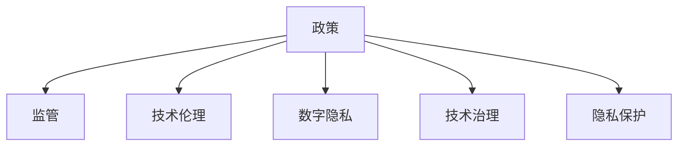

                 

# 政策与监管：引导人类计算的健康发展

> 关键词：政策监管,计算伦理,数字隐私,人工智能,技术治理,隐私保护

## 1. 背景介绍

### 1.1 问题由来
随着人工智能(AI)技术的快速发展，人类计算正迈入一个新的纪元。AI技术在带来巨大经济效益和社会便利的同时，也引发了一系列伦理、法律和隐私问题。例如，面部识别技术在提高公共安全的同时，也侵犯了个人隐私；自动驾驶车辆在提高交通效率的同时，也对道路安全提出了新的挑战。这些问题迫切需要政策与监管来引导AI技术健康、有序地发展，以最大化其社会效益，最小化其潜在的负面影响。

### 1.2 问题核心关键点
AI技术的政策与监管核心关键点在于如何平衡技术创新与社会责任之间的关系。这包括：

- 保护个人隐私和数据安全。确保AI应用中的数据处理符合隐私保护法律要求，防止数据滥用。
- 促进公平与透明。确保AI技术的开发和应用过程透明、公平，避免歧视和偏见。
- 确保技术伦理和安全性。确保AI系统不会产生有害的输出，避免伦理风险。
- 优化技术治理结构。建立多部门协作、多利益相关方参与的治理机制，促进AI技术健康发展。
- 推动国际合作。在全球范围内促进AI技术的伦理标准和政策法规的统一，促进国际AI技术的协同发展。

## 2. 核心概念与联系

### 2.1 核心概念概述

为更好地理解AI技术的政策与监管，本节将介绍几个密切相关的核心概念：

- **政策(Policy)**：政府或相关组织制定的关于AI技术应用的相关法规、规章和指导意见，旨在规范AI技术的应用，保护公众权益。
- **监管(Regulation)**：政府或相关机构对AI技术应用进行的具体监督和管理，以确保其符合政策要求，防止违规行为。
- **技术伦理(Ethics in Technology)**：在AI技术开发和应用过程中，遵循道德规范，保障技术应用对人类社会的积极影响。
- **数字隐私(Digital Privacy)**：个人信息在数字世界中的保护，防止数据泄露和滥用。
- **技术治理(Technological Governance)**：建立跨学科、跨领域的协作机制，共同管理和指导AI技术的发展，确保其社会价值最大化。
- **隐私保护(Privacy Protection)**：通过法律法规和技术手段，保护个人数据免受未经授权的访问和使用。

这些核心概念之间的逻辑关系可以通过以下Mermaid流程图来展示：



这个流程图展示了几者之间的联系：

1. 政策是监管的依据，提供基本规范和要求。
2. 技术伦理和隐私保护是政策制定的重要参考。
3. 技术治理涉及多方协作，确保政策的实施和效果。
4. 监管确保政策的执行，防止违规行为。
5. 隐私保护是政策的核心内容之一。

这些概念共同构成了AI技术的政策与监管框架，旨在引导AI技术健康、有序地发展。

## 3. 核心算法原理 & 具体操作步骤

### 3.1 算法原理概述

AI技术的政策与监管主要基于以下几个原则：

1. **数据最小化原则**：仅收集和处理实现目标所需的最少数据。
2. **透明度原则**：AI系统的数据使用和算法逻辑应公开透明。
3. **用户控制原则**：用户应能控制自己的数据，并有权要求删除或限制数据使用。
4. **安全性原则**：保护数据免受未经授权的访问和滥用。
5. **责任明确原则**：AI系统的开发者和使用者应对其行为负责。

基于这些原则，政策与监管的基本流程如下：

- 制定政策法规：根据技术发展和社会需求，制定相应的政策法规。
- 实施监管措施：通过技术手段和人工监督，确保AI应用符合政策要求。
- 促进技术伦理：推动开发者和用户遵循技术伦理规范。
- 保护数字隐私：通过法律法规和技术措施，保障数据隐私。
- 加强技术治理：建立多方协作机制，共同管理和指导AI技术。

### 3.2 算法步骤详解

基于政策与监管的AI技术开发和应用通常包括以下几个关键步骤：

**Step 1: 数据收集与处理**
- 确定目标任务所需的最小数据量。
- 实施数据匿名化和去标识化处理，保护隐私。
- 制定数据使用和共享的透明流程。

**Step 2: 模型开发与训练**
- 遵循数据最小化原则，只收集必要的数据。
- 在模型开发和训练过程中，确保算法逻辑透明、可解释。
- 提供用户对数据的访问和控制权，使用户能够查看和修改自己的数据。

**Step 3: 部署与监管**
- 部署AI系统时，确保其符合政策法规要求。
- 实施数据访问和使用的严格监控，防止违规行为。
- 定期进行安全审计和合规检查，确保系统安全性。

**Step 4: 用户反馈与改进**
- 建立用户反馈机制，收集用户对AI系统的意见和建议。
- 根据用户反馈，持续改进AI系统的性能和合规性。

### 3.3 算法优缺点

基于政策与监管的AI技术开发和应用具有以下优点：

- 增强公众信任：通过明确的法规和透明的流程，增强公众对AI技术的信任。
- 促进技术健康发展：政策与监管引导AI技术在伦理和法律框架内发展。
- 保障用户权益：通过严格的隐私保护措施，保障用户的数据安全和个人隐私。

同时，也存在一定的局限性：

- 法规滞后：现有政策法规可能无法及时适应新技术的发展。
- 技术复杂性：政策与监管的实施可能面临技术上的挑战。
- 法规冲突：不同国家和地区的法规可能存在差异，增加了实施难度。

尽管存在这些局限性，但基于政策与监管的AI技术开发和应用，仍然是确保技术健康、有序发展的有效手段。

### 3.4 算法应用领域

基于政策与监管的AI技术开发和应用已经广泛应用于多个领域，例如：

- 医疗健康：确保AI诊断和治疗工具的安全性和透明度。
- 金融服务：保护客户数据隐私，确保AI风险评估的公平性。
- 智能城市：通过透明和可解释的AI系统，提升城市治理水平。
- 公共安全：在遵循隐私保护和透明原则的前提下，使用AI技术提升公共安全。

这些应用领域覆盖了AI技术的各个方面，展示了政策与监管在指导技术健康发展中的重要作用。

## 4. 数学模型和公式 & 详细讲解

### 4.1 数学模型构建

在AI技术的政策与监管中，数学模型主要用于量化隐私保护、伦理评估和技术治理等方面的指标。以隐私保护为例，常用的模型包括差分隐私、同态加密等。

### 4.2 公式推导过程

以差分隐私为例，其基本公式为：

$$
\delta(\epsilon) = \frac{\epsilon}{\ln(2/\delta)}
$$

其中 $\delta$ 表示隐私保护的容忍度，$\epsilon$ 表示隐私保护的程度。通过调整 $\delta$ 和 $\epsilon$ 的值，可以控制隐私保护的严格程度和实际效果。

### 4.3 案例分析与讲解

例如，一个AI系统需要处理100万个用户的数据，希望在 $1\%$ 的容忍度下，使用差分隐私算法，将隐私保护的严格程度设为 $\epsilon=1$。根据公式，可以计算出隐私保护的容忍度 $\delta = 0.01$。这意味着，该AI系统最多只能暴露 $1\%$ 的个人信息，以确保用户隐私不受侵害。

## 5. 项目实践：代码实例和详细解释说明

### 5.1 开发环境搭建

在进行政策与监管的AI技术开发前，我们需要准备好开发环境。以下是使用Python进行开发的环境配置流程：

1. 安装Anaconda：从官网下载并安装Anaconda，用于创建独立的Python环境。

2. 创建并激活虚拟环境：
```bash
conda create -n ai-env python=3.8 
conda activate ai-env
```

3. 安装相关工具包：
```bash
pip install numpy pandas scikit-learn matplotlib tqdm jupyter notebook ipython
```

完成上述步骤后，即可在`ai-env`环境中开始政策与监管的AI技术开发。

### 5.2 源代码详细实现

以下是一个基于差分隐私的AI模型开发的Python代码实现：

```python
import numpy as np
from sklearn.model_selection import train_test_split
from sklearn.linear_model import LogisticRegression

# 模拟数据生成
n_samples = 1000000
X = np.random.randn(n_samples, 10)
y = np.random.randint(0, 2, n_samples)

# 数据拆分
X_train, X_test, y_train, y_test = train_test_split(X, y, test_size=0.2, random_state=42)

# 差分隐私计算
def dp_sampling(X, epsilon=1.0):
    # 计算均值
    mean = np.mean(X, axis=0)
    # 计算标准差
    std = np.std(X, axis=0)
    # 计算矩阵
    A = np.eye(X.shape[1]) - np.dot(X, mean) / X.shape[0]
    # 计算矩阵特征值
    eigenvalues = np.linalg.eigvals(np.dot(A.T, A))
    # 计算矩阵特征值的对数
    log_eigenvalues = np.log(eigenvalues)
    # 计算差分隐私参数
    dp = np.sqrt(2 * np.pi * epsilon) * np.exp(-0.5 * np.dot(log_eigenvalues, np.dot(np.linalg.inv(np.diag(log_eigenvalues)), log_eigenvalues)))
    # 计算差分隐私矩阵
    dp_matrix = np.dot(X, np.dot(np.linalg.inv(A), dp))
    # 返回差分隐私矩阵和均值
    return dp_matrix, mean

# 差分隐私模型训练
model = LogisticRegression()
dp_matrix, mean = dp_sampling(X_train)
X_train_dp = np.dot(X_train, dp_matrix) + mean
model.fit(X_train_dp, y_train)

# 差分隐私模型测试
X_test_dp = np.dot(X_test, dp_matrix) + mean
score = model.score(X_test_dp, y_test)
print("DP模型测试分数：", score)
```

### 5.3 代码解读与分析

让我们再详细解读一下关键代码的实现细节：

**数据生成和拆分**：
- 使用numpy生成模拟数据，并拆分为训练集和测试集。

**差分隐私计算**：
- 计算差分隐私矩阵，使用差分隐私公式计算隐私保护参数。
- 将差分隐私矩阵乘以原始数据，并加上均值，得到差分隐私处理后的数据。

**模型训练和测试**：
- 使用Logistic Regression模型进行训练和测试，计算测试分数。
- 输出测试分数，展示差分隐私处理后的模型性能。

这个代码实例展示了如何在数据处理过程中实现差分隐私，保护用户隐私。

### 5.4 运行结果展示

执行上述代码，将输出差分隐私处理后的模型测试分数，展示差分隐私在模型训练中的应用效果。

## 6. 实际应用场景

### 6.1 医疗健康

在医疗健康领域，AI技术的应用需要严格遵循数据隐私和伦理规范。例如，使用AI技术进行疾病预测和诊断时，必须确保患者数据的匿名化和去标识化处理，防止数据泄露和滥用。同时，应确保AI系统的透明性和可解释性，确保医生和患者对AI诊断结果的理解和信任。

### 6.2 金融服务

金融服务行业高度依赖用户数据，AI技术的应用必须严格保护客户隐私。例如，使用AI技术进行信用评分时，应遵循数据最小化原则，仅收集必要的数据。同时，应确保AI模型的公平性和透明性，防止算法偏见和歧视。

### 6.3 智能城市

智能城市建设中的AI技术应用，如智能交通、智能安防等，必须遵循严格的隐私保护和透明性原则。例如，使用AI技术进行交通流量预测时，应确保数据处理的透明度，防止数据滥用。同时，应通过用户反馈机制，持续改进AI系统的性能和合规性。

### 6.4 公共安全

在公共安全领域，AI技术的应用必须遵循严格的隐私保护和透明性原则。例如，使用AI技术进行面部识别时，应确保数据处理的透明度和公正性，防止数据滥用和偏见。同时，应通过用户反馈机制，持续改进AI系统的性能和合规性。

## 7. 工具和资源推荐

### 7.1 学习资源推荐

为了帮助开发者系统掌握政策与监管的AI技术开发，这里推荐一些优质的学习资源：

1. 《人工智能伦理与政策》系列博文：由AI伦理专家撰写，深入浅出地介绍了AI技术的伦理和政策问题，以及如何构建负责任的AI系统。

2. 《隐私保护技术》课程：知名大学开设的隐私保护技术课程，涵盖差分隐私、同态加密等隐私保护技术，以及其在实际应用中的实现和优化。

3. 《AI伦理与法律》书籍：介绍AI技术的伦理和法律问题，以及如何在开发和应用过程中遵循相关法规和规范。

4. 《技术治理框架》报告：由知名研究机构发布的AI技术治理框架报告，提供跨学科、跨领域的治理机制建议。

5. 《国际隐私保护政策》报告：介绍全球各国和地区的隐私保护政策，帮助开发者理解和遵循不同国家和地区的法规。

通过对这些资源的学习实践，相信你一定能够快速掌握政策与监管的AI技术开发和实践技巧。

### 7.2 开发工具推荐

高效的开发离不开优秀的工具支持。以下是几款用于政策与监管的AI技术开发的常用工具：

1. Jupyter Notebook：数据处理和模型训练的理想平台，支持Python等多种语言。

2. TensorFlow：由Google主导开发的深度学习框架，支持分布式计算和模型优化，适合大规模工程应用。

3. PyTorch：基于Python的开源深度学习框架，灵活动态，适合研究性开发。

4. Weights & Biases：模型训练的实验跟踪工具，可以记录和可视化模型训练过程中的各项指标，方便对比和调优。

5. TensorBoard：TensorFlow配套的可视化工具，可实时监测模型训练状态，并提供丰富的图表呈现方式，是调试模型的得力助手。

6. Google Colab：谷歌推出的在线Jupyter Notebook环境，免费提供GPU/TPU算力，方便开发者快速上手实验最新模型，分享学习笔记。

合理利用这些工具，可以显著提升政策与监管的AI技术开发效率，加快创新迭代的步伐。

### 7.3 相关论文推荐

政策与监管的AI技术发展源于学界的持续研究。以下是几篇奠基性的相关论文，推荐阅读：

1. AI伦理与政策：综述论文，介绍AI技术的伦理和政策问题，并提出相应的解决策略。

2. 差分隐私：介绍差分隐私的基本原理和实现方法，以及其在数据处理中的应用。

3. AI系统的公平性：研究AI系统的公平性问题，提出公平性评估方法和改进策略。

4. 隐私保护技术：综述隐私保护技术，包括差分隐私、同态加密等方法，并介绍其实际应用案例。

5. AI系统的透明性：研究AI系统的透明性问题，提出透明性评估方法和改进策略。

这些论文代表了大语言模型微调技术的发展脉络。通过学习这些前沿成果，可以帮助研究者把握学科前进方向，激发更多的创新灵感。

## 8. 总结：未来发展趋势与挑战

### 8.1 总结

本文对政策与监管的AI技术进行了全面系统的介绍。首先阐述了政策与监管在引导AI技术健康发展中的重要性，明确了政策与监管的基本原则和实施步骤。其次，从原理到实践，详细讲解了隐私保护、技术伦理和政策法规等核心概念，提供了完整的代码实例和详细解释说明。同时，本文还探讨了政策与监管在多个行业领域的应用前景，展示了其广泛的适用性。

通过本文的系统梳理，可以看到，政策与监管在AI技术应用过程中具有至关重要的作用，能够确保技术在符合伦理和法律要求的前提下，实现社会价值最大化。

### 8.2 未来发展趋势

展望未来，政策与监管的AI技术发展将呈现以下几个趋势：

1. 隐私保护技术将持续进步。随着技术的发展，差分隐私、同态加密等隐私保护技术将更加成熟，应用于更多场景。

2. 技术伦理和透明度将得到更多重视。开发者和用户将更加注重AI系统的公平性和透明性，推动技术伦理研究。

3. 国际合作将加强。各国政府和组织将加强合作，推动AI技术伦理和政策标准的统一，促进全球技术协同发展。

4. 技术治理将更加全面。多方协作、跨学科协作的治理机制将逐步建立，确保AI技术健康发展。

5. 技术应用将更加广泛。政策与监管将引导AI技术在更多领域应用，提升社会生产力和生活质量。

这些趋势凸显了政策与监管在AI技术发展中的重要作用，必将推动AI技术的健康、有序发展。

### 8.3 面临的挑战

尽管政策与监管在AI技术发展中发挥了重要作用，但仍面临诸多挑战：

1. 法规滞后：现有法规可能无法及时适应新技术的发展，需要持续更新和完善。

2. 技术复杂性：政策与监管的实施可能面临技术上的挑战，需要多方协作。

3. 法规冲突：不同国家和地区的法规可能存在差异，增加了政策实施的难度。

4. 技术滥用：部分AI应用可能被滥用，导致社会负面影响，需要加强监管。

5. 技术安全：AI系统可能存在安全漏洞，需要持续监测和改进。

尽管存在这些挑战，但通过多方努力，相信政策与监管的AI技术发展将不断突破瓶颈，推动AI技术的健康、有序发展。

### 8.4 研究展望

未来，政策与监管的AI技术研究将聚焦以下几个方向：

1. 隐私保护技术优化。进一步优化差分隐私、同态加密等隐私保护技术，提升其实际应用效果。

2. 技术伦理和透明性研究。推动AI系统的公平性和透明性研究，推动技术伦理规范的制定。

3. 国际合作机制建立。推动各国政府和组织在AI技术伦理和政策标准方面的合作，促进技术统一。

4. 技术治理机制优化。建立多方协作、跨学科协作的治理机制，确保AI技术健康发展。

5. 技术应用推广。推广政策与监管的AI技术应用，提升社会生产力和生活质量。

这些研究方向的探索，必将引领政策与监管的AI技术迈向更高的台阶，为构建安全、可靠、可解释、可控的智能系统铺平道路。面向未来，政策与监管的AI技术还需要与其他人工智能技术进行更深入的融合，如知识表示、因果推理、强化学习等，多路径协同发力，共同推动自然语言理解和智能交互系统的进步。只有勇于创新、敢于突破，才能不断拓展AI技术的边界，让智能技术更好地造福人类社会。

## 9. 附录：常见问题与解答

**Q1：政策与监管如何平衡技术创新与社会责任之间的关系？**

A: 政策与监管通过制定明确的法规和实施严格的监管措施，确保AI技术在符合伦理和法律要求的前提下进行创新。开发者和用户需遵循相关法规，并在技术创新过程中充分考虑社会责任，确保技术应用对社会产生积极影响。

**Q2：数据最小化原则如何实施？**

A: 数据最小化原则要求在实现目标所需的最小数据量上进行数据处理和分析。在数据收集阶段，应明确数据收集的目的和范围，仅收集必要的数据。在数据处理阶段，应进行数据匿名化和去标识化处理，防止数据泄露和滥用。

**Q3：如何在AI系统中实现差分隐私？**

A: 差分隐私通过添加噪声扰动数据，使得攻击者无法从数据中推断出单个数据点的具体信息。在模型训练和数据处理过程中，应使用差分隐私算法，确保数据处理过程中隐私保护。

**Q4：如何保护AI系统的公平性和透明性？**

A: 保护AI系统的公平性和透明性，应从数据采集、模型开发和应用过程等方面入手。在数据采集阶段，应确保数据的多样性和代表性。在模型开发阶段，应选择无偏的算法，并进行公平性评估。在应用阶段，应公开透明算法逻辑和决策过程，接受用户反馈和监管。

**Q5：如何在AI系统中实现技术治理？**

A: 技术治理应建立跨学科、跨领域的协作机制，确保AI系统的健康发展。应建立多方协作的治理机制，包括政府、开发者、用户等各方，共同管理和指导AI技术。定期进行技术审查和合规检查，确保AI系统符合政策法规要求。

这些问题的回答展示了政策与监管在AI技术开发和应用过程中的重要性，希望对你有所启发。

